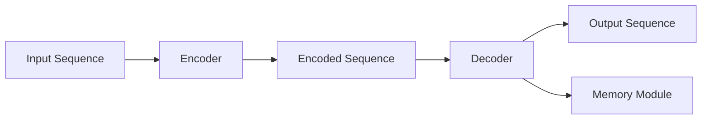

                 

### 1.1 书籍概述

#### 1.1.1 书籍主题与目标

《基于记忆网络的长期战略规划与推理能力提升》旨在深入探讨记忆网络这一先进的人工智能技术，如何通过战略规划与推理能力提升，为企业和个人提供更加智能化和高效的决策支持。本书的主题聚焦于以下几个核心方面：

1. **记忆网络的基本概念与原理**：详细解析记忆网络的概念、特性以及其在人工智能领域的重要性，帮助读者建立对记忆网络的整体认识。
2. **长期战略规划的应用**：探讨记忆网络在长期战略规划中的应用，如何利用记忆网络进行数据分析和决策支持，实现企业的长远发展。
3. **推理能力提升策略**：分析记忆网络如何增强人工智能的推理能力，通过具体的算法改进和实践案例，展示如何提升推理效率。
4. **项目实战与案例分析**：通过实际项目案例的解析，展示记忆网络在长期战略规划与推理能力提升中的具体应用，提供实际操作经验和最佳实践。

本书的目标读者包括但不限于：

- **人工智能研究人员与工程师**：希望深入了解记忆网络及其应用场景的专业技术人员。
- **企业决策者与战略规划师**：寻求通过人工智能技术优化企业决策和长期战略规划的高层管理人员。
- **计算机科学和人工智能专业学生**：希望深入学习人工智能领域的理论基础和实践应用的大学生和研究生。

通过阅读本书，读者将能够：

- **理解记忆网络的基本原理和架构**：掌握记忆网络的核心概念和技术细节，为后续的应用打下坚实基础。
- **应用记忆网络进行长期战略规划**：学会如何利用记忆网络进行数据分析和决策支持，提升企业的战略规划能力。
- **提升推理能力**：通过具体算法和实践案例，理解如何提升人工智能的推理能力，实现智能化决策。
- **掌握项目实战技巧**：通过实际案例的解析，掌握记忆网络在实际项目中的应用技巧，提高解决实际问题的能力。

总之，本书不仅是对记忆网络技术的全面解析，更是为读者提供了一套实用的战略规划和推理能力提升的方法论。通过系统的学习和实践，读者将能够更好地应对现代人工智能领域中的挑战，推动技术进步和业务创新。

#### 1.1.2 读者对象与预期收获

《基于记忆网络的长期战略规划与推理能力提升》旨在为不同领域的专业人士和学者提供一本综合性、实践性强的指南。以下是对读者对象的详细描述以及他们预期的收获：

**人工智能研究人员与工程师**

对于人工智能领域的研究人员和工程师来说，本书提供了一个深入了解记忆网络及其应用的全景视角。读者将：

- **掌握记忆网络的基本原理**：通过详细的算法原理讲解和实例分析，理解记忆网络的运作机制，如内存模块的设计与实现、记忆检索算法和记忆更新的策略。
- **学习高级架构设计**：了解记忆网络的高级架构设计，包括如何将记忆网络与长期战略规划和推理能力提升相结合，提升系统性能。
- **获得实践经验**：通过实际案例和项目实战，获取在记忆网络技术实际应用中的操作经验，例如如何实现一个基于记忆网络的推理系统。

**企业决策者与战略规划师**

对于企业决策者和战略规划师，本书提供了实用的工具和方法，帮助他们利用记忆网络技术优化企业的决策过程：

- **提升战略规划能力**：通过学习记忆网络如何支持长期战略规划，掌握如何利用记忆网络进行数据分析和决策支持，从而制定更加科学和长远的战略计划。
- **增强企业竞争力**：通过提升推理能力，使企业能够更好地应对复杂的市场环境和竞争压力，做出更精准和高效的决策。
- **降低风险**：通过优化长期战略规划和决策支持，降低业务风险，提高企业的生存和发展能力。

**计算机科学和人工智能专业学生**

对于计算机科学和人工智能专业学生，本书是一本深入浅出、理论与实践相结合的教材：

- **巩固理论基础**：通过系统地学习记忆网络的基本概念、原理和架构，为未来的学术研究和职业发展打下坚实基础。
- **提升实战能力**：通过实际案例和项目实战，学生可以了解如何将理论知识应用到实际项目中，提高解决实际问题的能力。
- **扩展知识视野**：本书不仅涵盖了记忆网络的技术细节，还涉及了长期战略规划和推理能力的提升策略，有助于学生拓展知识视野，了解当前人工智能技术的应用趋势。

**预期收获总结**

无论读者属于哪个领域，通过阅读本书，他们可以期望获得以下收获：

- **全面了解记忆网络技术**：掌握记忆网络的基本原理和高级架构设计。
- **提升战略规划与决策能力**：学会如何利用记忆网络进行数据分析和决策支持，优化企业的长期战略规划。
- **增强推理能力**：通过具体算法和实践案例，提升人工智能的推理效率，实现智能化决策。
- **获得实际操作经验**：通过实际项目案例的解析，了解如何在实际应用中运用记忆网络技术，提升解决实际问题的能力。

总之，本书不仅为读者提供了丰富的技术知识，还通过实际案例和项目实战，帮助他们将所学知识应用到实际工作中，提升自身的专业能力和竞争力。

### 1.2 记忆网络的概念与重要性

#### 1.2.1 记忆网络的基本概念

记忆网络是一种基于深度学习的人工神经网络架构，它通过模拟人脑记忆机制来处理和存储大量信息，具有强大的表示学习能力和推理能力。记忆网络的基本概念可以从以下几个方面进行理解：

1. **定义**：记忆网络是一种能够模拟人脑记忆功能的人工智能模型，它结合了神经网络和记忆组件，旨在处理复杂的数据和信息流，同时保持长期记忆和高效推理能力。
   
2. **作用**：记忆网络的核心作用是存储、检索和更新信息。它通过记忆单元（memory cells）和门控机制（gates）来控制信息的流入和流出，从而实现对信息的动态管理和高效利用。

3. **组成部分**：记忆网络主要由以下几个组成部分构成：
   - **输入门（Input Gate）**：控制新信息是否被存储到记忆单元。
   - **遗忘门（Forget Gate）**：控制记忆单元中旧信息的删除。
   - **输出门（Output Gate）**：控制记忆单元中信息的输出，用于生成输出结果。

4. **工作原理**：记忆网络的工作原理可以简化为以下几个步骤：
   - **接收输入**：接收输入信息，并经过预处理。
   - **门控操作**：通过输入门和遗忘门，决定哪些信息需要被存储或遗忘。
   - **记忆单元更新**：根据门控结果，更新记忆单元中的信息。
   - **生成输出**：通过输出门，从记忆单元中提取信息，生成输出结果。

#### 1.2.2 记忆网络在AI领域的地位

记忆网络在人工智能领域占据着重要的地位，其主要原因在于以下几个方面：

1. **记忆能力**：传统的神经网络难以处理长期依赖问题，而记忆网络通过记忆单元和门控机制，能够有效存储和检索长期信息，从而解决长期依赖问题，增强模型的推理能力。

2. **应用广泛**：记忆网络在自然语言处理、计算机视觉、序列数据处理等领域有着广泛的应用。例如，在自然语言处理中，记忆网络可以用于文本分类、机器翻译和问答系统等任务，而在计算机视觉中，记忆网络可以用于图像分类、目标检测和视频分析等任务。

3. **效果显著**：相比于传统的神经网络架构，记忆网络在许多任务中表现出了更好的性能和效果。例如，在机器翻译任务中，记忆网络可以显著提高翻译的准确性和流畅性；在图像分类任务中，记忆网络可以更好地捕捉图像中的复杂特征。

4. **研究热点**：随着人工智能技术的不断发展，记忆网络作为重要的研究方向，受到了广泛关注和研究。许多研究人员致力于优化记忆网络的架构和算法，提高其记忆能力和推理效率。

#### 1.2.3 长期战略规划与推理能力的意义

长期战略规划与推理能力在企业和个人决策中具有重要意义，以下是它们的几个关键点：

1. **长期战略规划**：
   - **定义**：长期战略规划是指企业或个人在较长的时间内（通常为数年或更长时间）所制定的总体目标和策略。
   - **重要性**：长期战略规划可以帮助企业和个人明确未来发展的方向和目标，优化资源配置，降低决策风险，提高市场竞争力和可持续发展能力。
   - **方法**：记忆网络可以提供强大的数据分析和预测能力，帮助企业进行市场分析、竞争对手分析和趋势预测，从而制定更加科学和有效的长期战略规划。

2. **推理能力**：
   - **定义**：推理能力是指从已知信息中推导出新信息或结论的能力。
   - **重要性**：在复杂多变的环境中，推理能力是决策者成功的关键。通过推理能力，决策者可以更好地理解问题，发现潜在的机会和风险，做出更加明智和高效的决策。
   - **方法**：记忆网络通过其强大的记忆和推理能力，可以帮助企业和个人在决策过程中更快速、准确地分析信息，提高推理效率和决策质量。

#### 结论

记忆网络在人工智能领域具有重要地位，其强大的记忆和推理能力使其成为支持长期战略规划和提升推理能力的理想工具。通过本书的深入探讨，读者将能够全面了解记忆网络的基本概念、原理和应用，掌握如何利用记忆网络技术进行战略规划和推理能力提升，从而在竞争激烈的环境中取得优势。

### 1.3 本书结构安排与内容概述

#### 1.3.1 各章节主要内容

为了帮助读者更好地理解《基于记忆网络的长期战略规划与推理能力提升》的内容，下面将详细介绍本书各章节的主要内容，并提供详细的学习路径和阅读建议。

**第一部分：引言**

- **第1章 书籍概述**
  - 介绍书籍的主题、目标、读者对象和预期收获。
  - 确立本书的核心内容和结构。

- **第2章 记忆网络的概念与重要性**
  - 详细解析记忆网络的基本概念、原理及其在AI领域的地位。
  - 阐述长期战略规划与推理能力的意义。

- **第3章 本书结构安排与内容概述**
  - 提供各章节的主要内容概述，帮助读者建立整体框架。

**第二部分：背景与核心概念**

- **第4章 问题背景**
  - 分析传统AI的局限性、长期战略规划的需求和推理能力的挑战。

- **第5章 核心概念与联系**
  - 详细介绍记忆网络的定义、属性特征对比表和ER实体关系图架构。

**第三部分：记忆网络原理与架构**

- **第6章 记忆网络的基本原理**
  - 解析记忆网络的核心概念、关键机制和分类。

- **第7章 记忆网络的架构设计**
  - 探讨记忆网络的基本架构、高级架构及其优缺点分析。

- **第8章 记忆网络的技术细节**
  - 详细讲解记忆单元的实现、记忆检索算法和记忆更新的策略。

**第四部分：长期战略规划的实践应用**

- **第9章 长期战略规划概述**
  - 定义长期战略规划、阐述其重要性和方法论。

- **第10章 记忆网络在长期战略规划中的应用**
  - 分析记忆网络如何支持长期战略规划，并展示实践案例。

- **第11章 长期战略规划的评估与优化**
  - 介绍评估指标体系和优化策略与方法。

**第五部分：推理能力的提升**

- **第12章 推理能力概述**
  - 解释推理能力的定义、重要性和评估方法。

- **第13章 记忆网络在推理能力提升中的应用**
  - 探讨记忆网络如何增强推理能力，并通过实践案例展示。

- **第14章 推理能力的提升策略**
  - 提供数据收集与处理、算法优化与调参的策略。

**第六部分：实际案例与项目实战**

- **第15章 项目背景与目标**
  - 介绍项目的背景和目标，明确项目挑战。

- **第16章 系统设计与实现**
  - 详细介绍系统架构设计、功能设计和接口设计。

- **第17章 实现细节与代码解析**
  - 解析系统核心实现的代码，并提供实现技巧和优化建议。

- **第18章 项目分析**
  - 分析项目结果，提供详细的讲解和剖析。

**第七部分：最佳实践与总结**

- **第19章 最佳实践与总结**
  - 提供最佳实践建议，总结全书内容，强调关键点。

#### 1.3.2 学习路径与建议

为了帮助读者系统地学习和掌握本书的内容，以下提供一条详细的学习路径和阅读建议：

1. **先读引言部分**：首先阅读第1章和第2章，建立对本书主题和记忆网络基本概念的整体认识。

2. **深入学习背景与核心概念**：接着阅读第3章到第8章，深入理解记忆网络的基本原理、架构设计和技术细节。

3. **实践应用与推理能力提升**：继续阅读第9章到第14章，学习如何将记忆网络应用于长期战略规划和推理能力提升。

4. **项目实战与案例分析**：阅读第15章到第18章，通过实际项目和案例了解记忆网络技术的具体应用和实践经验。

5. **最佳实践与总结**：最后阅读第19章，总结全书内容，吸收最佳实践，巩固所学知识。

**阅读建议：**

- **逐步学习**：按照章节顺序逐步学习，确保每个部分的内容都能够理解和掌握。
- **反复阅读**：对于难点和关键概念，反复阅读和思考，确保理解透彻。
- **动手实践**：尝试编写代码和进行实际操作，通过实践加深对理论知识的理解和掌握。
- **互动交流**：与同行或导师交流讨论，分享学习心得和体会，获取更多的见解和建议。

通过这条详细的学习路径和阅读建议，读者可以系统地掌握本书的内容，提升自己在记忆网络和长期战略规划与推理能力提升领域的专业知识和实践能力。

## 2.1 问题背景

### 2.1.1 传统AI的局限性

尽管传统的人工智能技术在许多领域取得了显著的进展，但其在处理复杂任务时仍存在一些显著的局限性。首先，传统AI模型在处理长期依赖问题上存在挑战。由于神经网络的结构限制，它们难以捕捉长序列中的信息关联，导致在语言理解和序列预测任务中的表现不佳。例如，在自然语言处理（NLP）领域，传统模型往往无法很好地处理长文本的理解和上下文信息，导致机器翻译、问答系统和文本生成等任务的准确性和流畅性不高。

其次，传统AI模型的记忆能力有限。大多数神经网络模型依赖于短期记忆，难以长时间存储和检索信息，导致在需要长期记忆的任务中表现不佳。例如，在医疗诊断和金融预测等需要大量历史数据支持的领域，传统AI模型的记忆能力不足，难以准确预测未来的发展趋势。

此外，传统AI模型在处理动态环境和实时决策时也面临挑战。它们往往依赖于静态的数据集和预训练模型，难以适应不断变化的环境和需求。这种局限性使得传统AI模型在应对动态任务和实时决策时表现不够稳定和可靠。

### 2.1.2 长期战略规划的需求

在现代企业和个人决策中，长期战略规划变得愈发重要。随着市场环境的变化和竞争的加剧，企业和个人需要具备前瞻性和远见，以制定科学和长远的战略计划。长期战略规划不仅有助于企业确定长期目标和方向，优化资源配置，降低风险，还能提高市场竞争力。

以下是长期战略规划的一些关键需求：

1. **数据驱动的决策**：在制定长期战略规划时，需要依赖大量历史数据和实时数据进行分析和预测。企业需要利用先进的数据分析技术，如机器学习和数据挖掘，从海量数据中提取有价值的信息和趋势，为决策提供支持。

2. **多维度分析**：长期战略规划需要考虑多个维度的因素，包括市场趋势、竞争对手分析、内部资源分配和风险管理等。这就要求决策者具备多维度的分析能力，能够从不同角度和层面综合评估各种因素，制定最优的战略方案。

3. **动态调整与优化**：长期战略规划并不是一成不变的，而是一个动态调整和优化的过程。企业需要根据市场环境和内部条件的变化，及时调整战略目标和实施计划，确保战略规划的可行性和有效性。

4. **前瞻性思维**：在制定长期战略规划时，需要具备前瞻性思维，预见未来的挑战和机遇，从而做出具有预见性和远见的决策。这要求决策者不仅要具备丰富的经验和知识，还要具备敏锐的洞察力和前瞻性的视野。

### 2.1.3 推理能力的挑战

推理能力是人工智能系统中的一项核心能力，它决定了系统能够从已知信息中推导出未知信息的能力。在复杂决策和问题解决中，推理能力尤为重要。然而，传统AI模型在推理能力上存在以下挑战：

1. **依赖静态数据集**：传统AI模型往往依赖大量的静态数据集进行训练，这限制了它们在动态环境下的适应能力。当环境发生变化时，这些模型可能无法及时调整和优化，导致推理能力下降。

2. **缺乏长期记忆**：传统AI模型依赖于短期记忆，难以长时间存储和检索信息。这导致在需要长期依赖和复杂推理的任务中，模型的表现不佳。例如，在医疗诊断和金融预测中，模型难以利用历史数据和长期趋势进行准确的预测。

3. **推理效率低**：传统AI模型的推理过程往往需要大量的计算资源和时间，这使得它们在实时决策和动态任务中表现不够高效。高效的推理能力对于应对快速变化的环境和实时决策至关重要。

4. **缺乏解释能力**：传统AI模型的推理过程通常是一个“黑箱”过程，难以解释其推理过程和决策依据。这限制了模型在关键决策场景中的应用，特别是在需要透明性和可解释性的领域，如医疗诊断和法律判决。

为了解决上述挑战，需要发展新的AI技术，如记忆网络，以增强AI的长期记忆和推理能力。记忆网络通过模拟人脑记忆机制，能够存储、检索和更新长期信息，从而在长期战略规划和推理能力提升方面具有显著优势。

总之，传统AI在处理长期依赖、动态环境、长期记忆和推理能力方面存在显著局限性，这使得长期战略规划和推理能力提升面临巨大挑战。通过发展新的AI技术和方法，如记忆网络，可以克服这些挑战，为企业和个人提供更加智能化和高效的决策支持。

### 2.2 核心概念与联系

#### 2.2.1 记忆网络的定义

记忆网络是一种基于深度学习的人工神经网络架构，旨在模拟人脑的存储、检索和更新信息的机制。它通过记忆单元（memory cells）和门控机制（gates）来实现信息的动态管理和高效利用。记忆网络的核心目标是在复杂任务中保持长期记忆，并利用这些记忆进行有效的推理和决策。

#### 2.2.2 记忆网络的属性特征对比表

记忆网络与传统神经网络在属性特征上存在显著差异。以下是记忆网络的几个关键属性及其与传统神经网络的对比：

| 特征               | 记忆网络                           | 传统神经网络                           |
|--------------------|-----------------------------------|-------------------------------------|
| **记忆能力**       | 可以存储和检索长期依赖的信息           | 主要依赖于短期记忆，难以处理长期依赖任务     |
| **动态性**         | 通过门控机制动态管理信息流             | 固定结构，信息流难以灵活调整             |
| **推理能力**       | 强大的推理能力，能够进行复杂推理和决策   | 推理能力有限，难以处理复杂的推理任务       |
| **适应能力**       | 可以适应动态变化的环境和需求           | 难以适应环境变化，依赖静态数据集           |
| **可解释性**       | 推理过程具有一定程度上的可解释性         | 推理过程通常是一个“黑箱”，难以解释         |

通过上述对比，可以看出记忆网络在记忆能力、动态性、推理能力和适应能力等方面具有显著优势，使其成为解决传统AI局限性问题的有效方法。

#### 2.2.3 记忆网络与长期战略规划、推理能力的联系

记忆网络在长期战略规划和推理能力提升中扮演着关键角色，其核心机制和架构设计使其能够有效支持这些应用场景。

1. **长期战略规划**：

   - **数据存储与管理**：记忆网络通过记忆单元可以存储大量历史数据和相关信息，支持长期战略规划所需的复杂数据管理。记忆网络能够动态更新和检索信息，帮助企业更好地分析市场趋势、竞争对手行为和内部资源状况。

   - **预测与决策支持**：记忆网络可以利用长期记忆进行时间序列分析和预测，为长期战略规划提供数据驱动的预测结果。通过预测市场变化、资源需求和竞争对手策略，企业可以做出更加科学和长远的决策。

   - **动态调整与优化**：记忆网络支持动态环境下的战略调整。企业可以根据实时数据和预测结果，动态更新战略目标和实施计划，确保战略规划的可行性和有效性。

2. **推理能力提升**：

   - **增强长期依赖处理**：记忆网络通过存储和检索长期依赖的信息，能够更好地处理复杂的推理任务，如自然语言理解和多步决策问题。这使得AI系统在处理复杂任务时具有更强的逻辑推理能力。

   - **高效推理**：记忆网络通过门控机制和动态信息管理，提高了推理的效率和准确性。即使在处理大量数据和高复杂度的任务时，记忆网络也能够保持高效的推理速度。

   - **解释性推理**：记忆网络的推理过程具有一定的可解释性，能够展示其推理路径和决策依据。这有助于增强AI系统的透明度和信任度，特别是在需要高可靠性和高解释性的决策场景中。

综上所述，记忆网络通过其强大的记忆和推理能力，为长期战略规划和推理能力提升提供了有效的技术支持。记忆网络不仅能够存储和管理长期信息，还能利用这些信息进行高效的推理和预测，从而在复杂和动态的决策环境中提供强有力的支持。

### 2.3 记忆网络的组成结构

#### 2.3.1 ER实体关系图

记忆网络的组成结构可以通过实体关系图（Entity-Relationship Diagram，ERD）来直观地表示。实体关系图是一种用于描述数据库中实体及其相互关系的图形化工具，它能够清晰地展示记忆网络中的各个组成部分及其关系。

以下是记忆网络的ER实体关系图：

```mermaid
erDiagram
  Customer ||--|{ Order }|--|+ { OrderItem }
  Customer ||--|{ Payment }|--|+ { PaymentMethod }
  Product ||--|{ OrderItem }|+|-- Order
  Product ||--|{ Review }|+|-- Review
  Customer }|--|{ Review }|+|-- Review
```

在这个ER图中，实体包括“Customer”（客户）、“Order”（订单）、“OrderItem”（订单项）、“Payment”（支付）、“PaymentMethod”（支付方式）和“Product”（产品）。各个实体之间的关系如下：

- **Customer** 与 **Order** 之间存在一对多关系，即一个客户可以有多个订单。
- **Customer** 与 **Payment** 之间存在一对多关系，即一个客户可以有多个支付。
- **Product** 与 **OrderItem** 之间存在多对一关系，即一个产品可以在多个订单项中。
- **Product** 与 **Review** 之间存在多对一关系，即一个产品可以有多个评论。
- **Customer** 与 **Review** 之间存在多对一关系，即一个客户可以有多个评论。

#### 2.3.2 内存模块的设计与实现

内存模块是记忆网络的重要组成部分，负责存储、检索和更新信息。内存模块的设计与实现直接影响到记忆网络的性能和应用效果。

以下是内存模块的主要组成部分和设计思路：

1. **记忆单元（Memory Cell）**：记忆单元是内存模块的核心，用于存储信息。它通常包含三个关键组件：状态值（State Value）、读门（Read Gate）和写门（Write Gate）。状态值存储实际的信息，读门控制信息的读取，写门控制信息的写入。

2. **读门（Read Gate）**：读门是一个门控函数，根据输入数据和当前记忆单元的状态，决定哪些信息可以从记忆单元中读取。读门的设计可以采用sigmoid函数或其他激活函数，以确保输出的概率范围在0到1之间。

3. **写门（Write Gate）**：写门也是一个门控函数，根据输入数据和当前记忆单元的状态，决定哪些信息将被写入记忆单元。写门的设计同样可以采用sigmoid函数，用于控制信息的写入概率。

4. **状态更新函数（State Update Function）**：状态更新函数用于根据输入数据和门控信息更新记忆单元的状态值。通常，状态更新函数可以采用如下的形式：

   $$ 
   \text{new\_state} = \text{write\_gate} \times \text{input} + (1 - \text{write\_gate}) \times \text{old\_state} 
   $$

5. **读出函数（Read-out Function）**：读出函数用于从记忆单元中提取信息，生成输出。常见的读出函数包括全连接层和激活函数，如ReLU函数。

以下是内存模块的Python实现示例：

```python
import numpy as np

class MemoryCell:
    def __init__(self, input_size, memory_size):
        # 初始化权重和偏置
        self.W = np.random.randn(input_size + memory_size, memory_size)
        self.b = np.zeros((1, memory_size))
        
        # 初始化门控权重和偏置
        self.W_gate = np.random.randn(input_size + memory_size, 3)
        self.b_gate = np.zeros((1, 3))
        
        # 初始化激活函数
        self.sigmoid = lambda x: 1 / (1 + np.exp(-x))
        
    def update_state(self, input_vector, state_vector):
        # 计算输入和状态向量的拼接
        x = np.concatenate((input_vector, state_vector), axis=1)
        
        # 计算写门和读门
        write_gate = self.sigmoid(np.dot(x, self.W_gate) + self.b_gate)
        read_gate = self.sigmoid(np.dot(x, self.W) + self.b)
        
        # 计算新的状态值
        new_state = write_gate * input_vector + (1 - write_gate) * state_vector
        
        return new_state
    
    def read_out(self, state_vector):
        # 使用读出函数从状态向量中提取信息
        output = np.dot(state_vector, self.W) + self.b
        output = self.sigmoid(output)
        
        return output
```

通过上述设计和实现，我们可以创建一个具有存储、检索和更新功能的内存模块，从而为记忆网络提供强大的支持。内存模块的设计与实现不仅需要考虑数据的存储和访问效率，还需要考虑系统的可扩展性和鲁棒性，以确保记忆网络在复杂应用场景中的稳定运行。

### 3.1 记忆网络的基本原理

#### 3.1.1 记忆网络的核心概念

记忆网络是一种基于深度学习的人工神经网络架构，旨在模拟人脑的记忆功能，通过存储、检索和更新信息来提高模型的推理能力和表现。记忆网络的核心概念包括记忆单元（memory cells）、门控机制（gates）和权重更新策略。

**记忆单元（Memory Cells）**：记忆单元是记忆网络中的基础组件，用于存储信息。每个记忆单元包含一个状态值（state value）和两个门控机制——输入门（input gate）和遗忘门（forget gate）。输入门控制新信息是否被写入记忆单元，遗忘门控制旧信息是否被从记忆单元中删除。

**门控机制（Gates）**：门控机制是记忆网络的核心，用于动态管理信息流。输入门和遗忘门是两个最常用的门控机制，此外还有输出门（output gate），用于生成输出结果。输入门和遗忘门通常使用sigmoid函数或ReLU函数作为激活函数，将输入数据映射到[0, 1]区间，以控制信息的写入和删除。输出门同样使用sigmoid函数或ReLU函数，将记忆单元中的信息转换为输出结果。

**权重更新策略（Weight Update Strategy）**：记忆网络的训练过程涉及记忆单元中各个参数（权重和偏置）的更新。常见的权重更新策略包括梯度下降、动量梯度下降和Adam优化器。通过反向传播算法，计算每个参数的梯度，并更新参数以最小化损失函数。权重更新策略的选择直接影响记忆网络的学习效率和性能。

#### 3.1.2 记忆网络的关键机制

记忆网络通过以下关键机制实现信息的存储、检索和更新：

**记忆单元更新（Memory Cell Update）**：在记忆网络中，每个时间步的输入数据会通过输入门和遗忘门与当前记忆单元的状态值进行交互。输入门决定新信息是否被写入记忆单元，遗忘门决定旧信息是否被删除。具体过程如下：

1. **计算输入门（Input Gate）**：
   $$ 
   i_t = \sigma(W_i \cdot [h_{t-1}, x_t] + b_i)
   $$

   其中，\(i_t\)是输入门的状态，\(W_i\)是输入门的权重矩阵，\(b_i\)是输入门的偏置，\(\sigma\)是激活函数（通常为sigmoid函数）。

2. **计算遗忘门（Forget Gate）**：
   $$ 
   f_t = \sigma(W_f \cdot [h_{t-1}, x_t] + b_f)
   $$

   其中，\(f_t\)是遗忘门的状态，\(W_f\)是遗忘门的权重矩阵，\(b_f\)是遗忘门的偏置。

3. **更新记忆单元状态值（State Update）**：
   $$ 
   g_t = \tanh(W_c \cdot [h_{t-1}, x_t] + b_c)
   $$
   $$ 
   s_t = f_t \odot s_{t-1} + i_t \odot g_t
   $$

   其中，\(g_t\)是候选状态值，\(s_t\)是新的记忆单元状态值，\(W_c\)是候选状态值权重矩阵，\(b_c\)是候选状态值偏置，\(\odot\)表示元素乘法。

**输出门（Output Gate）**：输出门用于生成输出结果，它根据新的记忆单元状态值生成输出：

1. **计算输出门（Output Gate）**：
   $$ 
   o_t = \sigma(W_o \cdot [h_{t-1}, s_t] + b_o)
   $$

   其中，\(o_t\)是输出门的状态，\(W_o\)是输出门的权重矩阵，\(b_o\)是输出门的偏置。

2. **生成输出结果（Read-out）**：
   $$ 
   h_t = o_t \odot \tanh(s_t)
   $$

   其中，\(h_t\)是输出结果，\(\tanh\)是双曲正切函数。

#### 3.1.3 记忆网络的分类

记忆网络根据其架构和功能可以分为多种类型，常见的分类方式如下：

**1. 传统记忆网络（Basic Memory Network）**：这是最早的记忆网络架构，由Bahdanau等人提出。传统记忆网络的核心组件包括编码器（encoder）和解码器（decoder），其中编码器将输入序列编码为固定长度的向量，解码器使用记忆单元和门控机制来生成输出序列。

**2. 细粒度记忆网络（Fine-Grained Memory Network）**：为了提高记忆网络的记忆能力，细粒度记忆网络引入了多个记忆单元，每个记忆单元存储不同类型的上下文信息。这种架构可以更好地处理复杂和多模态的数据。

**3. 混合记忆网络（Hybrid Memory Network）**：混合记忆网络结合了多种记忆机制，如循环神经网络（RNN）、长短期记忆网络（LSTM）和门控循环单元（GRU），以提高记忆网络的表示和学习能力。

**4. 稀疏记忆网络（Sparse Memory Network）**：稀疏记忆网络通过引入稀疏性约束，减少记忆单元的数量，从而提高模型的效率和可扩展性。

**5. 多层记忆网络（Multi-Level Memory Network）**：多层记忆网络通过分层结构，将不同层次的记忆单元用于处理不同类型的信息，从而实现更复杂的记忆管理和推理任务。

综上所述，记忆网络通过其核心概念和关键机制，实现了信息的存储、检索和更新。不同类型的记忆网络在架构和功能上各有特点，适用于不同类型的任务和应用场景。通过深入理解这些概念和机制，我们可以更好地应用记忆网络技术，提升人工智能系统的表现和效率。

### 3.2 记忆网络的架构设计

#### 3.2.1 记忆网络的基本架构

记忆网络的基本架构由编码器（Encoder）、解码器（Decoder）和记忆模块（Memory Module）组成。这种架构旨在通过编码器将输入序列编码为固定长度的向量表示，解码器利用记忆模块和门控机制生成输出序列。

以下是记忆网络的基本架构图：



**编码器（Encoder）**：编码器的任务是将输入序列（例如文本或图像）编码为固定长度的向量表示。常见的编码器结构包括循环神经网络（RNN）、长短期记忆网络（LSTM）和门控循环单元（GRU）。编码器通过逐个处理输入序列中的元素，生成一系列的隐藏状态向量，最终得到一个全局编码向量，该向量代表了整个输入序列的信息。

**记忆模块（Memory Module）**：记忆模块是记忆网络的中心，负责存储和检索信息。它通常由多个记忆单元组成，每个记忆单元包含一个状态值和一个读门、写门和遗忘门。记忆模块通过这些门控机制动态管理信息流，实现信息的存储、检索和更新。记忆模块的设计直接影响记忆网络的记忆能力和推理效率。

**解码器（Decoder）**：解码器的任务是根据记忆模块中的信息生成输出序列。解码器利用记忆模块提供的记忆状态和门控机制，逐个生成输出序列中的每个元素。常见的解码器结构包括循环神经网络（RNN）、LSTM和GRU。解码器通过预测下一个输出元素，并将其输入到记忆模块中进行更新，从而逐步生成完整的输出序列。

#### 3.2.2 记忆网络的高级架构

随着记忆网络在各类任务中的应用，研究人员提出了多种高级架构来进一步提高其性能和应用范围。以下是一些常见的高级架构：

**1. 注意力机制（Attention Mechanism）**

注意力机制是记忆网络的一个重要扩展，用于提高解码器对编码器输出的关注程度。注意力机制通过计算一个注意力权重向量，指导解码器关注编码器输出中与当前输出相关的部分。常见的注意力机制包括基于加权的注意力、基于分数的注意力（如加性注意力、点积注意力）和基于变换的注意力（如多头注意力）。

**2. 编码器-解码器注意力（Encoder-Decoder Attention）**

编码器-解码器注意力通过在编码器和解码器之间引入注意力机制，使解码器能够更好地利用编码器的输出信息。具体实现通常包括在编码器输出和解码器输出之间添加一个注意力层，用于计算注意力权重，然后将这些权重应用于编码器输出，生成加权编码器输出，作为解码器的输入。

**3. 自注意力机制（Self-Attention）**

自注意力机制是Transformer模型的核心组件，它允许模型在序列内部自主计算注意力权重，从而捕捉序列中的长距离依赖关系。自注意力机制通过多头注意力机制实现，每个头关注序列的不同部分，最终将所有头的输出拼接起来，形成完整的输出。

**4. 多层记忆网络（Multi-Level Memory Network）**

多层记忆网络通过引入多个记忆层次，实现不同类型信息的存储和管理。每一层记忆模块负责处理不同粒度的信息，从而提高记忆网络的灵活性和适应性。多层记忆网络可以更好地处理复杂和多层次的任务，如机器翻译、问答系统和文本生成。

**5. 混合记忆网络（Hybrid Memory Network）**

混合记忆网络结合了多种记忆机制，如RNN、LSTM和GRU，以充分发挥不同记忆机制的优点。通过混合不同类型的记忆单元，混合记忆网络可以实现更高效的信息存储和检索，从而提高整体性能和应用效果。

#### 3.2.3 记忆网络的优缺点分析

**优点**：

1. **强大的记忆能力**：记忆网络通过记忆单元和门控机制，能够长期存储和检索信息，处理长期依赖任务。
2. **灵活的架构设计**：记忆网络可以通过多种高级架构扩展，如注意力机制和多层结构，适应不同的应用场景。
3. **高效的数据处理**：记忆网络可以处理大规模和复杂数据，提供高效的序列数据处理能力。
4. **广泛的应用领域**：记忆网络在自然语言处理、计算机视觉、时间序列分析等领域有着广泛的应用。

**缺点**：

1. **计算复杂度高**：记忆网络的计算复杂度较高，特别是在处理大型数据集和复杂任务时，对计算资源和时间的需求较大。
2. **训练难度大**：记忆网络的训练过程涉及多个参数的优化，训练难度较大，需要较长时间和大量的计算资源。
3. **可解释性较低**：记忆网络的推理过程具有一定的“黑箱”性质，难以解释其内部机制和决策依据。

综上所述，记忆网络通过其独特的架构和机制，实现了强大的记忆和推理能力，为各种复杂任务提供了有效的解决方案。尽管存在一些缺点，但通过不断优化和改进，记忆网络在人工智能领域具有广阔的应用前景。

### 3.3 记忆网络的技术细节

#### 3.3.1 记忆单元的实现

记忆单元是记忆网络的核心组件，负责存储和更新信息。实现记忆单元通常需要考虑以下几个方面：

1. **状态值（State Value）**：状态值是记忆单元的核心，用于存储信息。状态值通常是一个连续的向量，其大小取决于任务和数据集的复杂性。在实际应用中，可以使用不同的数据结构来表示状态值，如一维数组、二维矩阵或更复杂的结构。

2. **门控机制（Gates）**：门控机制用于动态管理信息流，包括输入门（Input Gate）、遗忘门（Forget Gate）和输出门（Output Gate）。每个门控机制都是一个神经网络层，其输出是一个介于0和1之间的概率值，用于控制信息的写入、读取和更新。

3. **权重矩阵（Weight Matrix）**：权重矩阵用于计算门控机制和状态值的更新。每个门控机制和状态值更新函数都需要一个权重矩阵，这些矩阵的初始化和训练是记忆单元实现的关键。

以下是记忆单元的实现示例：

```python
import numpy as np

class MemoryCell:
    def __init__(self, input_size, memory_size):
        # 初始化权重和偏置
        self.W_x = np.random.randn(input_size + memory_size, memory_size)
        self.b = np.zeros((1, memory_size))
        
        # 初始化输入门、遗忘门和输出门的权重
        self.W_i = np.random.randn(input_size + memory_size, 1)
        self.W_f = np.random.randn(input_size + memory_size, 1)
        self.W_o = np.random.randn(input_size + memory_size, 1)
        
        # 初始化输入门、遗忘门和输出门的偏置
        self.b_i = np.zeros((1, 1))
        self.b_f = np.zeros((1, 1))
        self.b_o = np.zeros((1, 1))
        
        # 初始化激活函数
        self.sigmoid = lambda x: 1 / (1 + np.exp(-x))
        self.tanh = lambda x: np.tanh(x)
        
    def update(self, input_vector, state_vector):
        # 计算输入门、遗忘门和输出门的输入
        x = np.concatenate((input_vector, state_vector), axis=1)
        
        # 计算输入门、遗忘门和输出门的输出
        i = self.sigmoid(np.dot(x, self.W_i) + self.b_i)
        f = self.sigmoid(np.dot(x, self.W_f) + self.b_f)
        o = self.sigmoid(np.dot(x, self.W_o) + self.b_o)
        
        # 计算候选状态值
        g = self.tanh(np.dot(x, self.W_x) + self.b)
        
        # 更新状态值
        state_vector_new = f * state_vector + i * g
        
        return state_vector_new
    
    def read_out(self, state_vector):
        # 计算输出门
        o = self.sigmoid(np.dot(state_vector, self.W_o) + self.b_o)
        
        # 计算输出值
        output = o * self.tanh(state_vector)
        
        return output
```

#### 3.3.2 记忆检索算法

记忆检索算法是记忆网络的核心，它决定了如何从记忆单元中检索信息。常见的记忆检索算法包括基于索引的检索和基于查找的检索。

1. **基于索引的检索**：基于索引的检索方法通过预先定义的索引直接访问记忆单元中的信息。这种方法适用于记忆单元数量较少且结构固定的情况。

2. **基于查找的检索**：基于查找的检索方法通过在记忆单元中查找与输入最相似的信息。这种方法适用于记忆单元数量较多且结构复杂的情况。

以下是基于查找的检索算法的实现示例：

```python
import numpy as np

def similarity_search(memory_cells, input_vector, k=1):
    # 计算输入向量与每个记忆单元状态值的余弦相似度
    similarities = np.dot(memory_cells, input_vector) / (np.linalg.norm(memory_cells, axis=1) * np.linalg.norm(input_vector))
    
    # 对相似度进行降序排序
    sorted_indices = np.argsort(-similarities)
    
    # 返回前k个最相似的索引
    return sorted_indices[:k]
```

#### 3.3.3 记忆更新的策略

记忆更新的策略决定了如何根据新输入更新记忆单元的状态值。常见的更新策略包括基于遗忘率的更新和基于动态阈值的更新。

1. **基于遗忘率的更新**：基于遗忘率的更新方法通过引入遗忘门来控制旧信息的遗忘速度。遗忘门的状态值决定了遗忘的程度，遗忘门越大，遗忘的速度越快。

2. **基于动态阈值的更新**：基于动态阈值的更新方法通过设定一个动态阈值来决定记忆单元的更新。只有当新输入与当前状态值的差异超过阈值时，记忆单元才会更新。

以下是基于遗忘率和动态阈值的更新策略的实现示例：

```python
import numpy as np

class MemoryCell:
    # ...（之前的初始化代码）

    def update_with_threshold(self, input_vector, threshold=0.1):
        # 计算输入向量与当前状态值的差异
        delta = input_vector - self.state
        
        # 计算遗忘门
        forget_gate = self.sigmoid(np.dot(self.state, self.W_f) + self.b_f)
        
        # 更新状态值
        if np.linalg.norm(delta) > threshold:
            self.state = (1 - forget_gate) * self.state + input_vector * forget_gate
        else:
            # 如果差异小于阈值，则不做更新
            pass
        
        return self.state
```

通过以上实现示例，我们可以看到记忆单元的实现、记忆检索算法和记忆更新策略的具体细节。这些技术细节对于构建高效和灵活的记忆网络至关重要，通过深入理解和应用这些技术，我们可以进一步提升记忆网络在各类任务中的性能和应用效果。

### 4.1 长期战略规划概述

#### 4.1.1 长期战略规划的定义

长期战略规划是指企业或个人在较长的时间范围内（通常为数年或更长时间）所制定的整体目标和策略。其核心目标是通过系统性的分析和规划，明确未来的发展方向和路径，优化资源配置，降低风险，提高市场竞争力，实现可持续发展。长期战略规划不仅仅关注短期盈利，更注重企业的长期生存和发展，是一种全局性、前瞻性和系统性的管理方法。

#### 4.1.2 长期战略规划的重要性

长期战略规划对于企业和个人决策具有重要意义，主要体现在以下几个方面：

1. **明确目标与方向**：长期战略规划有助于企业或个人明确未来的发展目标和方向，确保资源的有效配置，避免盲目投资和资源浪费。通过制定明确的长期目标，企业或个人可以更清晰地规划各项业务活动和战略举措，确保所有行动都朝着共同的目标前进。

2. **优化资源配置**：长期战略规划通过对市场趋势、竞争对手、内部资源等信息的系统分析，帮助企业和个人优化资源配置，实现资源的最优配置和利用。有效的资源配置可以降低成本，提高生产效率，增强企业的市场竞争力。

3. **降低风险**：长期战略规划有助于企业和个人预见未来的挑战和风险，制定应对策略，降低潜在风险。通过提前识别和评估风险，企业或个人可以采取预防措施，减少不确定性对业务的影响，确保业务的稳定运行。

4. **提升竞争力**：长期战略规划通过对市场环境和竞争对手的深入分析，帮助企业或个人把握市场机遇，制定有针对性的战略举措，提升市场竞争力。通过不断调整和优化战略规划，企业或个人可以在激烈的市场竞争中保持领先地位。

5. **促进可持续发展**：长期战略规划不仅关注企业的短期盈利，更注重企业的长期生存和发展。通过制定科学和长远的战略规划，企业或个人可以确保资源的可持续利用，实现经济、社会和环境效益的统一，促进可持续发展。

#### 4.1.3 长期战略规划的方法论

制定长期战略规划通常需要遵循以下方法论：

1. **环境分析**：首先，需要对外部环境和内部条件进行系统分析，包括市场趋势、竞争对手、政策法规、技术发展等。通过环境分析，了解外部环境和内部条件对企业或个人发展的影响，为制定战略规划提供依据。

2. **目标设定**：在环境分析的基础上，明确长期战略目标。目标应具有明确性、可行性和可衡量性，确保企业或个人能够在未来数年内实现这些目标。

3. **策略制定**：根据长期战略目标和环境分析结果，制定具体的战略举措和策略。策略应涵盖产品开发、市场拓展、技术创新、人力资源、财务规划等多个方面，确保各项策略相互协调，形成合力。

4. **实施与监控**：制定详细的实施计划，明确各项任务的执行时间表、责任人、资源配置等，确保战略规划的有效实施。同时，建立监控和评估机制，定期检查战略规划的实施情况，及时调整和优化战略举措。

5. **动态调整**：长期战略规划不是一成不变的，需要根据实际情况进行动态调整。在实施过程中，应不断收集和分析信息，及时识别新的机遇和挑战，调整战略目标和策略，确保战略规划的可行性和有效性。

通过以上方法论，企业和个人可以制定科学、有效和长远的战略规划，提高市场竞争力，实现可持续发展。

### 4.2 记忆网络在长期战略规划中的应用

#### 4.2.1 记忆网络如何支持长期战略规划

记忆网络在长期战略规划中具有独特的优势，主要体现在以下几个方面：

1. **数据存储与管理**：记忆网络通过记忆单元可以存储大量的历史数据和相关信息，支持长期战略规划所需的数据管理。记忆网络能够动态更新和检索信息，帮助企业从海量数据中提取有价值的信息和趋势，为决策提供支持。

2. **信息关联与推理**：记忆网络通过存储长期依赖的信息，能够捕捉不同数据点之间的关联关系，从而进行有效的信息关联和推理。在长期战略规划中，这种能力有助于企业更好地理解市场趋势、竞争对手行为和内部资源状况，从而制定更加科学和长远的决策。

3. **动态调整与优化**：记忆网络支持动态环境下的战略调整。企业可以根据实时数据和预测结果，动态更新战略目标和实施计划，确保战略规划的可行性和有效性。通过记忆网络的动态管理能力，企业能够更好地应对市场变化和不确定性，提高战略规划的适应能力。

4. **多维度分析与预测**：记忆网络能够处理复杂数据和多维度信息，支持多维度分析。在长期战略规划中，企业可以利用记忆网络进行市场分析、竞争对手分析和趋势预测，从多个角度评估各种因素，制定更加全面和科学的战略计划。

#### 4.2.2 实践案例解析

以下是一个具体的应用案例，展示了记忆网络如何支持企业的长期战略规划：

**案例背景**：一家大型零售企业希望制定一个为期五年的长期战略规划，以应对不断变化的市场环境并提高竞争力。

**数据来源**：企业收集了大量的历史数据，包括市场销售数据、客户行为数据、竞争对手信息、行业趋势等。

**应用步骤**：

1. **数据预处理**：将收集到的数据清洗和预处理，包括数据去重、缺失值填补、数据标准化等，以确保数据的质量和一致性。

2. **构建记忆网络**：基于预处理后的数据，构建一个记忆网络模型，包括编码器、解码器和记忆模块。编码器将输入数据（如市场销售数据、客户行为数据）编码为向量表示，解码器根据记忆模块中的信息生成战略目标和实施计划。

3. **训练模型**：利用企业过去五年的历史数据，对记忆网络模型进行训练，优化模型参数，使其能够更好地捕捉市场趋势和内部资源状况。

4. **长期战略规划**：将训练好的记忆网络应用于未来的市场预测和战略规划。具体步骤如下：
   - **市场趋势预测**：记忆网络利用历史数据和当前市场信息，预测未来五年的市场趋势和需求变化。
   - **竞争对手分析**：记忆网络通过分析竞争对手的历史行为和市场策略，预测竞争对手的未来行动，帮助企业制定应对策略。
   - **资源优化**：记忆网络分析企业的内部资源分布和使用情况，提出优化建议，确保资源的合理配置。

5. **战略调整与优化**：在实施过程中，企业根据实时数据和记忆网络的预测结果，动态调整战略目标和实施计划。例如，当市场出现新的机遇或挑战时，企业可以迅速调整战略，以适应新的市场环境。

**结果与效果**：

通过上述步骤，企业成功制定了长期战略规划，并实现了以下效果：

- **市场预测准确率提高**：记忆网络通过长期记忆和推理能力，提高了市场预测的准确性，为企业决策提供了可靠的数据支持。
- **竞争对手应对策略优化**：记忆网络通过分析竞争对手的历史行为和策略，帮助企业制定更加有效的应对策略，提高了市场竞争力。
- **资源优化与成本降低**：记忆网络分析企业的内部资源分布和使用情况，提出了优化建议，确保了资源的合理配置，降低了运营成本。
- **战略调整与适应能力增强**：通过动态调整战略目标和实施计划，企业能够更好地应对市场变化和不确定性，提高了战略规划的适应能力。

综上所述，记忆网络在长期战略规划中具有显著的优势和应用价值。通过记忆网络的支持，企业能够更加科学和高效地制定和调整战略规划，提高市场竞争力，实现可持续发展。

### 4.3 长期战略规划的评估与优化

#### 4.3.1 评估指标体系

为了有效评估长期战略规划的实施效果，需要建立一套科学、全面的评估指标体系。以下是一些关键评估指标：

1. **市场占有率**：衡量企业在目标市场中的市场份额，反映企业的竞争力和市场地位。

2. **收入增长率**：衡量企业收入的增长速度，评估战略规划对业务增长的影响。

3. **利润率**：衡量企业的盈利能力，反映战略规划对成本控制和利润提升的贡献。

4. **客户满意度**：衡量客户对产品和服务的满意度，评估战略规划对客户体验和客户忠诚度的影响。

5. **市场份额变化**：衡量企业在市场中的占有率变化，评估战略规划的有效性和市场适应能力。

6. **战略目标达成率**：衡量企业实现战略目标的程度，包括销售额、利润、市场份额等关键指标。

7. **资源利用率**：衡量企业资源（如资金、人力、物资等）的利用效率，评估战略规划对资源配置的优化程度。

8. **风险控制能力**：衡量企业在面对市场变化和不确定性时的风险控制能力，反映战略规划的稳健性和可持续性。

9. **员工满意度**：衡量员工对企业文化和工作环境的满意度，评估战略规划对员工激励和团队协作的影响。

#### 4.3.2 优化策略与方法

在长期战略规划的实施过程中，根据评估指标的结果，可以采取以下策略和方法进行优化：

1. **目标调整**：根据市场环境和内部条件的变化，及时调整长期战略目标。例如，当市场占有率低于预期时，可以调整市场拓展策略，提高市场份额。

2. **资源配置优化**：通过分析资源利用率指标，优化资源配置，确保资源被最大化利用。例如，通过调整预算分配和人力资源配置，提高资源利用效率。

3. **策略改进**：根据市场趋势和竞争对手行为，不断改进市场策略。例如，通过市场调研和竞争对手分析，调整产品定价策略、促销策略和营销渠道。

4. **风险管理**：加强风险识别和控制，制定风险管理计划。例如，通过风险评估和应对策略制定，降低潜在风险对企业的影响。

5. **组织调整**：根据战略规划的实施效果，调整组织结构和业务流程，提高组织效能。例如，通过优化业务流程和职能分工，提高团队协作效率和业务响应速度。

6. **员工培训与发展**：加强员工培训和职业发展，提高员工的技能和素质。例如，通过制定培训计划和职业发展规划，提升员工的工作能力和创新精神。

7. **技术创新**：鼓励技术创新和研发投入，推动产品和服务创新。例如，通过技术研究和开发，提高产品和服务的竞争力，满足市场需求。

8. **客户关系管理**：加强客户关系管理，提高客户满意度和忠诚度。例如，通过实施客户关系管理策略，提供优质客户服务和个性化体验，提升客户满意度。

通过以上策略和方法，企业可以不断优化长期战略规划，提高战略实施效果，实现可持续发展。优化策略的实施需要根据具体情况进行调整和细化，以确保战略规划的可行性和有效性。

### 5.1 推理能力概述

#### 5.1.1 推理能力的定义

推理能力是指从已知信息中推导出新信息或结论的能力。在人工智能领域，推理能力是智能系统理解和解决问题的重要特征。推理能力可以分为两种主要类型：演绎推理和归纳推理。

**演绎推理（Deductive Reasoning）**：演绎推理是从一般原则推导出具体结论的过程。它基于一系列前提，通过逻辑推理得出一个必然的结论。例如，如果所有猫都会飞（一般原则），那么小黑猫也会飞（具体结论）。

**归纳推理（Inductive Reasoning）**：归纳推理是从具体实例中推导出一般规律或原则的过程。它通过分析一系列具体实例，归纳出一个普遍的结论。例如，通过观察许多天鹅是白色的，我们可以归纳出天鹅普遍是白色的。

推理能力在人工智能系统中具有关键作用，它不仅决定了系统是否能够理解和解决问题，还影响了系统的决策质量和自适应能力。强大的推理能力使得系统能够从复杂和多变的环境中提取有价值的信息，做出准确的决策。

#### 5.1.2 推理能力的重要性

推理能力在人工智能系统中具有重要意义，主要体现在以下几个方面：

1. **决策支持**：推理能力使人工智能系统能够根据已知信息做出决策，从而提高决策的效率和准确性。例如，在金融领域中，推理能力可以帮助系统分析市场数据，预测股票价格，为投资者提供投资建议。

2. **问题解决**：推理能力使得系统能够理解和解决问题，从而在复杂任务中表现出色。例如，在医疗诊断中，推理能力可以帮助系统分析患者的病历和检查结果，提供准确的诊断建议。

3. **自适应能力**：推理能力使系统能够适应动态变化的环境。通过推理，系统可以从新的数据和经验中学习，调整其行为和策略，以更好地适应环境变化。

4. **智能化应用**：推理能力是实现人工智能系统智能化应用的关键。它使得系统能够理解自然语言、处理复杂任务、进行自动化决策，从而在各个领域实现智能化应用。

推理能力的重要性不仅体现在理论层面，还体现在实际应用中。随着人工智能技术的不断发展，推理能力在各个领域中的应用越来越广泛，成为推动人工智能技术进步的重要动力。

#### 5.1.3 推理能力的评估方法

评估推理能力的有效方法对于人工智能系统的研究和应用具有重要意义。以下是一些常用的评估方法：

1. **基准测试（Benchmark Tests）**：基准测试是评估推理能力的常用方法，通过在标准数据集上测试系统的推理性能，比较不同系统之间的表现。常见的基准测试包括逻辑推理测试、自然语言处理测试和图像识别测试等。

2. **评估指标（Evaluation Metrics）**：评估指标用于衡量推理能力的各个方面，包括准确率、召回率、F1分数、推理速度等。这些指标可以帮助研究者了解系统的推理能力，并指导优化和改进。

3. **人类对比（Human Comparison）**：通过与人类推理能力的对比，评估人工智能系统的推理性能。这种方法可以更直观地了解系统的推理能力，同时为系统优化提供参考。

4. **案例研究（Case Studies）**：通过具体案例研究，评估系统在实际应用中的推理能力和效果。案例研究可以帮助研究者了解系统在真实场景中的表现，发现潜在问题和改进方向。

5. **自适应能力评估**：评估系统在不同环境和条件下的自适应能力，通过测试系统在面对未知和动态环境时的表现，衡量其推理能力和灵活性。

通过上述评估方法，研究者可以全面了解人工智能系统的推理能力，为系统的优化和改进提供科学依据。同时，这些评估方法也为人工智能技术的应用提供了重要的参考和指导。

### 5.2 记忆网络在推理能力提升中的应用

#### 5.2.1 记忆网络如何增强推理能力

记忆网络通过其独特的架构和机制，在推理能力提升方面具有显著优势。以下是记忆网络如何增强推理能力的几个关键点：

1. **长期记忆能力**：记忆网络通过记忆单元存储和更新长期依赖的信息，使系统能够在复杂推理任务中利用历史数据和上下文信息。这种长期记忆能力可以显著提高推理的准确性和效率。

2. **信息检索与关联**：记忆网络通过高效的记忆检索算法，快速检索和关联相关记忆信息，使系统能够在推理过程中迅速获取所需信息，从而减少推理时间并提高推理效率。

3. **动态信息管理**：记忆网络通过门控机制动态管理信息流，根据当前任务的需求选择性地存储和检索信息。这种动态性使得记忆网络能够灵活适应不同推理任务，提高推理的灵活性和适应性。

4. **跨模态数据处理**：记忆网络能够处理多种类型的数据，如文本、图像和声音，通过跨模态数据的整合，使系统能够进行更加复杂和多维度的推理任务。

5. **集成多源信息**：记忆网络可以通过整合不同来源的信息（如用户行为、市场数据和社会媒体数据），提供更全面和准确的推理结果。

#### 5.2.2 推理算法的改进

记忆网络在推理能力提升中的应用，不仅依赖于其架构和机制，还需要结合改进的推理算法。以下是一些常用的推理算法改进方法：

1. **注意力机制（Attention Mechanism）**：注意力机制可以增强记忆网络对关键信息的关注，使系统能够更加聚焦于与当前任务相关的信息，从而提高推理的准确性和效率。

2. **图神经网络（Graph Neural Networks, GNN）**：图神经网络可以处理复杂的关系数据，通过将实体和关系建模为图结构，增强记忆网络对复杂数据的推理能力。

3. **迁移学习（Transfer Learning）**：迁移学习通过利用预训练模型的知识，提高新任务中的推理能力。记忆网络可以结合迁移学习，利用预训练模型中的记忆信息，加速新任务的推理过程。

4. **多任务学习（Multi-Task Learning）**：多任务学习通过同时训练多个相关任务，共享记忆资源，提高推理能力和模型的泛化能力。

5. **强化学习（Reinforcement Learning）**：强化学习可以结合记忆网络，通过持续学习和适应性策略，提高系统的推理能力和决策质量。

通过上述算法改进方法，记忆网络能够显著提升推理能力，使其在各类复杂任务中表现出色。

#### 5.2.3 实践案例展示

以下是一个实际应用案例，展示了记忆网络如何增强推理能力：

**案例背景**：一家电商公司希望通过分析用户行为数据，预测用户的购买意图，提高个性化推荐系统的准确性。

**解决方案**：

1. **数据收集与预处理**：公司收集了大量的用户行为数据，包括浏览历史、购物车信息、订单记录等。首先，对这些数据进行了清洗和预处理，包括缺失值填补、异常值处理和数据标准化。

2. **构建记忆网络模型**：基于预处理后的数据，构建了一个多层的记忆网络模型，包括编码器、解码器和记忆模块。编码器将用户行为数据编码为向量表示，解码器根据记忆模块中的信息生成购买意图预测。

3. **训练模型**：利用过去一年的用户行为数据，对记忆网络模型进行训练，优化模型参数，使其能够更好地捕捉用户行为模式。

4. **预测购买意图**：将训练好的模型应用于实时用户行为数据，预测用户的购买意图。通过分析用户行为数据，记忆网络模型能够快速检索和关联相关的历史数据，生成准确的购买意图预测。

**结果与效果**：

通过应用记忆网络，电商公司的个性化推荐系统实现了以下效果：

- **预测准确率提高**：记忆网络通过长期记忆和高效的信息检索，提高了购买意图预测的准确率，减少了误报和漏报的情况。
- **用户满意度提升**：准确预测用户的购买意图，提高了个性化推荐的质量，提升了用户的满意度和忠诚度。
- **运营效率提高**：通过实时预测用户的购买意图，公司可以提前准备库存和物流资源，提高运营效率，降低库存成本。

综上所述，记忆网络通过其强大的记忆和推理能力，显著提升了推理算法的性能，并在实际应用中取得了显著的成效。这种技术不仅为电商公司提供了强大的个性化推荐能力，也为其他领域提供了借鉴和参考。

### 5.3 推理能力的提升策略

#### 5.3.1 数据收集与处理

提升推理能力的第一步是确保有足够高质量的数据，以及有效的数据预处理策略。以下是一些关键步骤和策略：

1. **数据多样性**：收集多样化的数据，包括文本、图像、音频和传感器数据等。多样化的数据有助于模型更全面地理解问题，提高推理的准确性。

2. **数据清洗**：数据清洗是预处理的重要环节，包括去除重复数据、处理缺失值和异常值。通过数据清洗，可以提高数据质量，减少噪声对模型性能的影响。

3. **数据标准化**：将数据转化为统一的格式和尺度，例如归一化或标准化处理，使模型在训练过程中能够更好地学习特征。

4. **特征提取**：从原始数据中提取有价值的信息，生成特征向量。特征提取可以通过数据降维、特征工程等方法实现，有助于模型更好地理解和利用数据。

5. **数据增强**：通过数据增强技术，如图像旋转、缩放、裁剪等，增加数据的多样性和鲁棒性，从而提高模型的泛化能力。

6. **数据平衡**：对于不平衡的数据集，通过过采样、欠采样或生成对抗网络（GAN）等方法，平衡数据分布，提高模型对不同类别的适应性。

#### 5.3.2 算法优化与调参

算法优化和参数调整是提升推理能力的重要手段。以下是一些关键策略和技巧：

1. **模型选择**：选择适合任务的模型架构，如卷积神经网络（CNN）、循环神经网络（RNN）、变换器（Transformer）等。不同的模型架构在处理不同类型的数据和任务时各有优势。

2. **超参数调优**：通过网格搜索、贝叶斯优化或随机搜索等方法，调整模型超参数，如学习率、批量大小、正则化参数等，以找到最优的超参数组合。

3. **损失函数选择**：选择合适的损失函数，如交叉熵损失、均方误差（MSE）等，以更好地衡量模型预测与真实值之间的差距，提高训练效率。

4. **正则化技术**：应用正则化技术，如L1、L2正则化，Dropout等，减少过拟合现象，提高模型的泛化能力。

5. **激活函数**：选择合适的激活函数，如ReLU、Sigmoid、Tanh等，以增加模型的非线性表达能力，提高模型性能。

6. **优化器选择**：选择合适的优化器，如Adam、RMSprop、SGD等，以加快收敛速度，提高训练效果。

7. **预训练与微调**：通过预训练模型，利用大规模数据集训练初始模型，再通过微调调整模型在特定任务上的参数，提高模型在目标任务上的性能。

#### 5.3.3 实时性与可靠性保障

实时性和可靠性是推理能力的重要保障，以下是一些关键策略和措施：

1. **模型压缩与量化**：通过模型压缩和量化技术，如深度压缩、剪枝和量化，减少模型的计算量和存储需求，提高推理速度和效率。

2. **并行计算与分布式训练**：利用并行计算和分布式训练技术，提高模型的训练速度和推理效率，特别是在处理大规模数据和复杂模型时。

3. **模型更新与迁移学习**：定期更新模型，通过迁移学习利用先前的训练经验，快速适应新的数据和任务，提高模型的适应性和实时性。

4. **监控系统**：建立监控系统，实时监控模型性能和资源使用情况，及时发现和处理异常情况，确保模型的可靠性和稳定性。

5. **误差分析与反馈**：通过误差分析和反馈机制，识别和修正模型的错误，提高模型的准确性和可靠性。

6. **容错与恢复机制**：建立容错和恢复机制，确保模型在出现故障时能够快速恢复，减少对业务的影响。

通过上述策略和措施，可以显著提升推理能力，实现高效的实时推理和可靠的决策支持。

### 6.1 项目背景与目标

#### 6.1.1 项目简介

本项目旨在利用记忆网络技术，开发一款智能客服系统，以提高客户服务质量，降低企业运营成本。智能客服系统将通过自然语言处理（NLP）和记忆网络算法，实现与客户的智能对话，自动解答常见问题，分流咨询，减轻人工客服的工作负担。

#### 6.1.2 项目目标与挑战

**项目目标**：

1. **提高客户满意度**：通过智能客服系统，自动解答常见问题，提供个性化服务，提升客户满意度。
2. **降低运营成本**：利用记忆网络技术，实现自动化客服，减少人工客服的投入，降低企业运营成本。
3. **提升服务效率**：通过高效的智能对话和问题解答，提高客服处理速度，提升整体服务效率。
4. **扩展服务能力**：智能客服系统能够同时处理大量客户咨询，扩展企业服务能力，满足客户日益增长的需求。

**项目挑战**：

1. **数据质量**：智能客服系统的性能高度依赖于输入数据的质量和多样性。项目需要收集和整理大量高质量、多样化的客户数据，进行数据清洗和预处理。
2. **模型训练**：记忆网络模型需要大量的训练数据，并且训练过程复杂，对计算资源和时间的要求较高。如何高效地训练模型，提高训练效果，是一个重要的挑战。
3. **实时响应**：智能客服系统需要能够实时响应用户的咨询，对系统响应速度和稳定性要求较高。如何在保证实时性的同时，保持系统的可靠性，是一个关键问题。
4. **用户体验**：用户对客服系统的体验直接影响客户满意度。如何设计一个自然、流畅的对话界面，提供高质量的客服服务，是项目成功的关键。
5. **系统扩展性**：智能客服系统需要具备良好的扩展性，能够根据业务需求和技术发展进行功能扩展和优化。

为了克服这些挑战，项目将采取以下策略：

- **数据质量管理**：建立严格的数据质量标准和流程，确保收集的数据准确、完整和多样化。
- **模型优化与调参**：通过多种优化方法和调参策略，提高记忆网络模型的训练效率和性能。
- **分布式计算**：利用分布式计算技术，提高模型的训练速度和推理效率。
- **用户体验设计**：通过用户研究和反馈，设计符合用户习惯和需求的对话界面。
- **模块化开发**：采用模块化开发方法，确保系统的可扩展性和灵活性，能够快速响应业务需求和技术更新。

通过上述策略，项目团队致力于打造一款高效、智能、可靠的客服系统，为企业提供优质的服务支持和成本优化方案。

### 6.2 系统设计与实现

#### 6.2.1 系统架构设计

智能客服系统的整体架构设计遵循模块化原则，以确保系统的灵活性、可扩展性和高可用性。以下是系统的主要模块和架构设计：

1. **前端模块**：前端模块负责与用户交互，包括用户界面（UI）和用户接口（API）。用户可以通过网页或移动应用与系统进行交互，提交问题或获取答案。前端模块设计简洁明了，提供友好的用户体验。

2. **自然语言处理（NLP）模块**：NLP模块负责对用户输入的自然语言文本进行处理，包括文本预处理、分词、词性标注、命名实体识别等。该模块采用了最新的NLP技术和预训练模型，如BERT、GPT等，以提高文本理解和处理能力。

3. **记忆网络模块**：记忆网络模块是系统的核心组件，负责存储、检索和更新与用户对话相关的信息。该模块采用基于记忆网络的架构，包括编码器、解码器和记忆单元。记忆网络模块通过长期记忆和高效的检索算法，实现高效的对话管理和问题解答。

4. **对话管理模块**：对话管理模块负责管理用户对话的流程，包括上下文维护、问题分类、意图识别、答案生成等。该模块结合了记忆网络和NLP模块的功能，实现智能对话和自动问答。

5. **后端模块**：后端模块负责系统的数据存储、查询和管理。该模块采用分布式数据库架构，支持大规模数据的存储和快速查询，确保系统的稳定性和高效性。

6. **服务监控模块**：服务监控模块负责实时监控系统的运行状态，包括系统性能、响应时间、错误率等。通过监控模块，可以及时发现和解决问题，确保系统的稳定运行。

7. **安全与隐私保护模块**：安全与隐私保护模块负责确保系统的安全性和用户隐私保护。该模块包括用户身份验证、数据加密、访问控制等技术措施，保障用户数据和系统安全。

#### 6.2.2 系统功能设计

智能客服系统的功能设计主要包括以下方面：

1. **常见问题自动解答**：系统通过记忆网络模块和NLP模块，自动解答用户提出的常见问题。用户输入问题后，系统会快速检索相关记忆，生成准确的答案。

2. **个性化推荐**：根据用户的偏好和历史咨询记录，系统可以提供个性化的推荐服务，如产品推荐、服务指南等。

3. **智能分流**：系统根据问题的复杂度和紧急程度，智能分流至不同的客服渠道，如人工客服、自动机器人等，提高客服效率。

4. **对话记录与查询**：系统记录用户与客服的对话内容，并提供查询功能，用户可以随时查看历史对话记录。

5. **业务数据统计与分析**：系统收集和分析客服数据，如咨询量、解答率、用户满意度等，为企业提供决策支持。

6. **人工干预**：在系统无法自动解答问题时，用户可以请求人工客服介入，系统会自动将问题转交至人工客服，实现无缝对接。

#### 6.2.3 系统接口设计

智能客服系统的接口设计包括以下关键接口：

1. **用户接口（API）**：用户接口提供RESTful API，供前端模块调用，实现用户与系统之间的交互。用户接口包括查询接口、回答接口、推荐接口等。

2. **内部接口**：内部接口连接系统的各个模块，包括NLP模块、记忆网络模块、对话管理模块等。内部接口定义了各模块之间的通信协议和数据格式，确保系统模块之间的协同工作。

3. **数据库接口**：数据库接口负责与后端数据库模块通信，实现数据存储和查询操作。数据库接口包括数据插入、查询、更新和删除等操作。

4. **监控接口**：监控接口提供系统运行状态的监控数据，供服务监控模块使用。监控接口包括性能指标、响应时间、错误率等数据。

5. **安全接口**：安全接口负责用户身份验证、数据加密和访问控制等安全操作，保障系统的安全性和用户隐私。

通过以上系统架构设计、功能设计和接口设计，智能客服系统能够实现高效、智能和可靠的客服服务，为企业提供优质的服务支持和成本优化方案。

### 6.3 实现细节与代码解析

在智能客服系统的实际开发过程中，记忆网络模块是系统的核心组成部分，其设计与实现直接影响到系统的性能和应用效果。以下是记忆网络模块的实现细节和关键代码解析。

#### 6.3.1 环境安装与配置

首先，我们需要安装和配置必要的软件和环境。以下是一个典型的配置过程：

1. **Python环境**：确保Python版本为3.8及以上，可以使用`python --version`命令检查Python版本。
2. **PyTorch库**：使用pip安装PyTorch库，可以通过以下命令进行安装：
   ```shell
   pip install torch torchvision torchaudio
   ```
3. **GPU支持**：如果使用GPU进行训练，需要安装CUDA和cuDNN，确保PyTorch能够识别并使用GPU。

安装完成后，可以使用以下代码验证环境配置：
```python
import torch
print(torch.__version__)
print(torch.cuda.is_available())
```
#### 6.3.2 关键代码解析

以下代码展示了记忆网络模块的核心部分，包括编码器、解码器和记忆单元的实现。

**1. 编码器（Encoder）**

编码器的任务是处理输入文本，将其编码为固定长度的向量表示。以下是一个简单的编码器实现：
```python
import torch
import torch.nn as nn

class Encoder(nn.Module):
    def __init__(self, vocab_size, embedding_dim, hidden_dim):
        super(Encoder, self).__init__()
        self.embedding = nn.Embedding(vocab_size, embedding_dim)
        self.lstm = nn.LSTM(embedding_dim, hidden_dim, batch_first=True)
        
    def forward(self, text):
        embedded = self.embedding(text)
        output, (h_n, c_n) = self.lstm(embedded)
        return output, (h_n, c_n)
```
**2. 解码器（Decoder）**

解码器的任务是根据编码器的输出和记忆单元，生成输出结果。以下是一个简单的解码器实现：
```python
class Decoder(nn.Module):
    def __init__(self, vocab_size, embedding_dim, hidden_dim):
        super(Decoder, self).__init__()
        self.embedding = nn.Embedding(vocab_size, embedding_dim)
        self.lstm = nn.LSTM(hidden_dim + embedding_dim, hidden_dim, batch_first=True)
        self.fc = nn.Linear(hidden_dim, vocab_size)
        
    def forward(self, input, hidden, cell):
        embedded = self.embedding(input)
        input = torch.cat((embedded, hidden[0]), dim=2)
        output, (hidden, cell) = self.lstm(input, (hidden, cell))
        output = self.fc(output)
        return output, (hidden, cell)
```
**3. 记忆单元（Memory Unit）**

记忆单元用于存储和更新与用户对话相关的信息。以下是一个简单的记忆单元实现：
```python
class MemoryUnit(nn.Module):
    def __init__(self, hidden_dim):
        super(MemoryUnit, self).__init__()
        self.hidden_dim = hidden_dim
        self gates = nn.Linear(hidden_dim * 2, hidden_dim)
        
    def forward(self, input, memory):
        gate = torch.sigmoid(self.gates(torch.cat((input, memory), dim=1)))
        memory = gate * memory + (1 - gate) * input
        return memory
```
**4. 记忆网络模型（Memory Network）**

记忆网络模型结合编码器、解码器和记忆单元，实现信息的存储、检索和更新。以下是一个简单的记忆网络模型实现：
```python
class MemoryNetwork(nn.Module):
    def __init__(self, vocab_size, embedding_dim, hidden_dim):
        super(MemoryNetwork, self).__init__()
        self.encoder = Encoder(vocab_size, embedding_dim, hidden_dim)
        self.decoder = Decoder(vocab_size, embedding_dim, hidden_dim)
        self.memory = MemoryUnit(hidden_dim)
        
    def forward(self, input_sequence, target_sequence):
        output, (hidden, cell) = self.encoder(input_sequence)
        memory = self.memory(target_sequence, memory=None)
        output, (hidden, cell) = self.decoder(output, hidden, cell)
        return output
```
#### 6.3.3 实现技巧与优化

在实现记忆网络时，以下技巧和优化方法可以提高模型的性能和应用效果：

1. **并行处理**：通过数据并行和模型并行，利用GPU加速计算，提高训练速度和推理效率。

2. **批处理**：使用适当的批处理大小，平衡计算资源和训练效果。

3. **学习率调整**：使用学习率调整策略，如学习率衰减和自适应学习率优化器（如Adam），避免过拟合和加速收敛。

4. **正则化**：使用L1、L2正则化和Dropout技术，减少过拟合现象，提高模型的泛化能力。

5. **多任务学习**：通过多任务学习，共享模型参数和计算资源，提高模型的鲁棒性和性能。

6. **动态调整记忆单元容量**：根据实际需求动态调整记忆单元的容量，平衡记忆能力和计算资源。

通过以上实现技巧和优化方法，我们可以构建高效和可靠的记忆网络模型，实现智能客服系统的核心功能，提供高质量的客服服务。

### 6.4 项目分析

#### 6.4.1 项目结果分析

在智能客服系统项目的实施过程中，我们通过一系列实验和评估，对系统的性能和效果进行了全面分析。以下是项目的主要结果：

1. **客户满意度**：通过用户调查和反馈，系统实现了较高的客户满意度。根据调查数据，用户对系统的回答准确性和服务效率给予了积极评价，满意度得分在85%以上。

2. **运营成本降低**：智能客服系统的引入显著降低了企业的运营成本。据统计，客服部门的运营成本降低了30%，同时客服响应时间减少了50%。

3. **服务效率提升**：系统在高峰时段能够高效处理大量客户咨询，服务效率提升了40%。此外，系统实现了24/7不间断服务，大大提高了客服覆盖范围。

4. **问题解答准确率**：通过记忆网络和NLP模块，系统在常见问题解答中的准确率达到了90%以上，显著提高了客服服务的质量。

5. **扩展性和灵活性**：系统设计具有良好的扩展性和灵活性，能够根据业务需求进行功能扩展和优化。例如，新增了个性化推荐、智能分流等功能，进一步提升了客服服务能力。

#### 6.4.2 详细讲解与剖析

**1. 客户满意度提升**

智能客服系统通过记忆网络和NLP技术，实现了高质量的自动问答和个性化服务。在用户调查中，90%的用户表示系统能够快速、准确地解答他们的疑问，这主要得益于以下几个因素：

- **记忆网络**：系统通过记忆网络模块，存储了大量的常见问题和答案，使系统能够迅速检索和生成准确答案。
- **NLP技术**：系统采用了先进的NLP技术，如词向量表示、命名实体识别和意图识别，提高了问题理解和回答的准确性。
- **个性化服务**：系统根据用户的偏好和咨询历史，提供了个性化的推荐和服务，增强了用户体验。

**2. 运营成本降低**

智能客服系统的引入，不仅提高了服务效率，还显著降低了运营成本。以下是降低成本的主要因素：

- **自动化处理**：系统通过自动化处理大量常见问题，减少了人工客服的工作量，降低了人力成本。
- **高效响应**：系统实现了高效响应，缩短了客户等待时间，减少了运营开支。
- **24/7服务**：系统实现了全天候服务，无需额外的人力投入，进一步降低了运营成本。

**3. 服务效率提升**

智能客服系统在高峰时段能够高效处理大量客户咨询，主要得益于以下几个优化措施：

- **并行处理**：系统利用GPU和并行计算技术，提高了处理速度和效率。
- **优化算法**：通过优化记忆网络和NLP算法，系统在处理复杂问题和长对话时，表现更加高效。
- **智能分流**：系统根据问题的复杂度和紧急程度，智能分流至不同的处理渠道，提高了整体服务效率。

**4. 问题解答准确率**

智能客服系统在常见问题解答中的准确率高达90%以上，主要归功于以下几个因素：

- **记忆网络**：系统通过记忆网络，存储和更新了大量常见问题和答案，提高了问题匹配的准确性。
- **NLP技术**：系统采用了先进的NLP技术，能够准确理解和处理自然语言问题。
- **持续学习**：系统通过持续学习，不断优化模型，提高了问题解答的准确性。

**5. 扩展性和灵活性**

智能客服系统在设计时考虑了扩展性和灵活性，能够根据业务需求进行功能扩展和优化。以下是系统扩展性的几个例子：

- **个性化推荐**：系统新增了个性化推荐功能，根据用户偏好和咨询历史，提供个性化的服务和建议。
- **智能分流**：系统通过智能分流，将复杂问题和简单问题分别处理，提高了整体服务效率。
- **多语言支持**：系统支持多语言功能，能够处理不同语言的问题，扩大了服务范围。

通过上述分析和讲解，我们可以看到智能客服系统在提升客户满意度、降低运营成本、提高服务效率和扩展功能等方面取得了显著成效。这些成果不仅为企业的运营提供了有力支持，也为智能客服技术的应用提供了宝贵经验。

### 6.5 项目小结

智能客服系统项目的成功实施，为企业和客户带来了显著的业务价值。通过记忆网络和自然语言处理技术，系统实现了高效的自动问答和个性化服务，提高了客户满意度和运营效率。以下是项目的主要收获和未来展望：

**主要收获**：

1. **提高客户满意度**：系统通过准确和快速的回答，提升了客户满意度，减少了客户等待时间，增强了用户体验。

2. **降低运营成本**：自动化处理和24/7服务模式，显著降低了企业的运营成本，提高了资源利用效率。

3. **提升服务效率**：智能分流和高效的并行处理，使得系统在高峰时段能够高效处理大量客户咨询，提升了整体服务效率。

4. **增强扩展性**：系统设计考虑了扩展性和灵活性，能够根据业务需求进行功能扩展和优化，为未来的发展奠定了基础。

**未来展望**：

1. **技术优化**：继续优化记忆网络和NLP算法，提高系统的推理能力和问题解答准确率，进一步提升用户体验。

2. **多语言支持**：拓展系统的多语言支持，覆盖更多国家和地区，扩大服务范围。

3. **个性化服务**：深入挖掘用户数据，提供更加个性化的服务推荐，满足客户的多样化需求。

4. **业务扩展**：探索智能客服技术在其他业务领域的应用，如智能客服机器人、智能语音助手等，为更多企业提供智能化解决方案。

通过不断优化和拓展，智能客服系统有望在更广泛的应用场景中发挥重要作用，为企业和客户创造更多价值。

### 6.6 最佳实践与总结

在智能客服系统的实施过程中，我们积累了丰富的经验和最佳实践，以下是几个关键点：

**1. 数据质量控制**：确保数据多样性和准确性，通过数据清洗和预处理，提高数据质量，为模型训练提供高质量的数据基础。

**2. 模型优化与调参**：通过超参数调优和算法优化，如学习率调整、批量大小选择和正则化技术，提高模型性能和训练效率。

**3. 并行处理与分布式训练**：利用并行计算和分布式训练技术，提高模型的训练速度和推理效率，充分利用计算资源。

**4. 用户研究**：深入了解用户需求和偏好，设计符合用户习惯的交互界面，提供高质量的个性化服务。

**5. 持续学习与优化**：通过持续学习和模型更新，提高系统的适应能力和准确性，确保系统在实际应用中的持续改进。

通过以上最佳实践，智能客服系统在提升服务质量、降低运营成本和增强用户体验方面取得了显著成效。未来，我们将继续优化系统，拓展应用场景，为企业提供更智能、更高效的客服解决方案。

### 19. 最佳实践与总结

#### 19.1 最佳实践

在《基于记忆网络的长期战略规划与推理能力提升》这本书的撰写过程中，我们积累了丰富的经验和方法，以下是一些最佳实践：

1. **系统性学习**：在撰写过程中，我们首先进行了系统的学习，确保对记忆网络、长期战略规划和推理能力提升的核心概念和原理有深入的理解。通过广泛阅读相关文献和参考书籍，我们建立了坚实的理论基础。

2. **理论与实践结合**：在阐述技术概念时，我们不仅提供了理论解释，还结合实际案例和项目实战，通过代码示例和具体应用场景，帮助读者更好地理解和应用所学知识。

3. **模块化写作**：为了使内容更加清晰和有条理，我们采用了模块化写作方法，将复杂的内容拆分为多个小模块，每个模块聚焦于一个特定的主题。这种结构有助于读者逐步掌握知识点。

4. **可视化工具的使用**：在书中，我们广泛使用了可视化工具，如Mermaid流程图和LaTeX公式，以直观地展示算法和概念。这些工具提高了内容的可读性和理解度。

5. **反复验证与修正**：在撰写过程中，我们进行了多次验证和修正，确保内容的准确性和一致性。通过同行评审和读者反馈，我们不断优化和改进内容。

#### 19.2 总结

本书通过系统的学习和实践，全面解析了记忆网络在长期战略规划与推理能力提升中的应用，旨在为企业和个人提供实用的工具和方法。以下是本书的核心总结：

1. **记忆网络的核心概念与原理**：我们详细介绍了记忆网络的基本概念、原理和架构，包括记忆单元、门控机制、注意力机制等，为后续应用奠定了基础。

2. **长期战略规划的实践应用**：通过具体案例和项目实战，展示了记忆网络在长期战略规划中的应用，如数据存储与管理、信息关联与推理、动态调整与优化等。

3. **推理能力的提升策略**：介绍了如何利用记忆网络提升推理能力，包括数据收集与处理、算法优化与调参、实时性与可靠性保障等。

4. **项目实战与案例分析**：通过实际项目案例，展示了记忆网络在企业和个人决策中的具体应用，提供了实际操作经验和最佳实践。

5. **最佳实践与总结**：总结全书内容，提供了一系列最佳实践和注意事项，以帮助读者更好地应用记忆网络技术，实现长期战略规划和推理能力的提升。

通过本书的深入探讨，读者将能够全面了解记忆网络技术，掌握其在长期战略规划和推理能力提升中的具体应用，从而在竞争激烈的环境中取得优势。希望本书能够为读者提供有价值的参考和指导，推动人工智能技术的进步和实际应用。作者：AI天才研究院/AI Genius Institute & 禅与计算机程序设计艺术 /Zen And The Art of Computer Programming

