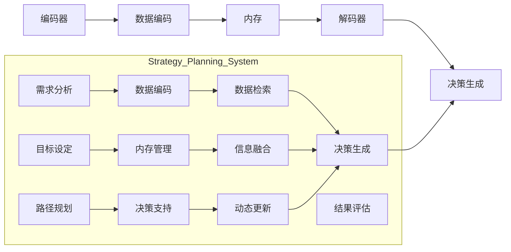
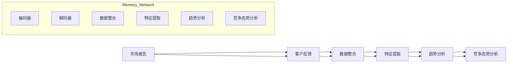
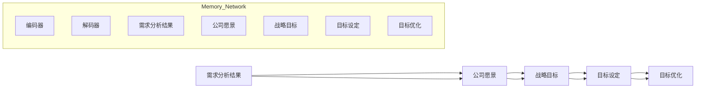
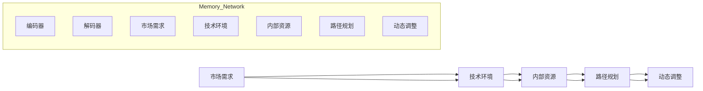

                 

## 第一部分：背景介绍与核心概念

### 第1章：问题的提出与解决思路

#### 1.1 问题背景

随着全球经济的快速发展，企业和组织面临着日益复杂的商业环境。在这样的大背景下，长期战略规划的重要性愈发突出。长期战略规划不仅是企业生存和发展的重要保障，也是应对不确定性、抓住机遇的关键手段。然而，当前的企业和组织的长期战略规划面临诸多挑战：

- **复杂性高**：企业需要在多变的市场环境中，综合考虑各种内部和外部因素，制定出合理的战略规划。

- **信息量庞大**：战略规划涉及大量的数据和信息，如何有效地处理和利用这些信息，成为一大难题。

- **动态性**：市场的变化和技术的进步使得长期战略规划需要不断地调整和优化。

- **资源限制**：无论是人力、财力还是时间，企业都有一定的资源限制，如何在有限的资源下制定出有效的战略规划，是一项巨大的挑战。

#### 1.1.1 长期战略规划面临的挑战

长期战略规划面临的挑战主要体现在以下几个方面：

- **数据融合与整合**：不同来源的数据往往格式不统一，如何有效地融合和整合这些数据，以便于分析和决策，是一个关键问题。

- **跨领域知识融合**：长期战略规划涉及多个领域，如何将不同领域的知识有效地融合，形成统一的决策框架，也是一个挑战。

- **决策支持**：在庞大的数据和信息面前，如何快速做出准确的决策，需要高效的决策支持系统。

- **动态调整**：市场和技术环境的变化，要求长期战略规划能够动态调整，以适应新的变化。

#### 1.1.2 记忆网络的基本概念

记忆网络（Memory Networks）是一种基于记忆的神经网络架构，主要用于处理具有长期依赖关系的复杂任务。记忆网络的核心思想是将外部信息存储在记忆中，并在需要时检索和利用这些信息。记忆网络具有以下基本概念和特点：

- **记忆存储**：记忆网络通过记忆组件，将输入的数据存储在记忆中，以便后续检索和利用。

- **记忆检索**：在处理问题时，记忆网络可以根据需要从记忆中检索相关信息，以辅助决策。

- **记忆更新**：随着问题的变化和更新，记忆网络会动态地更新记忆中的信息，确保记忆的准确性和有效性。

#### 1.1.3 长期战略规划与记忆网络的关系

记忆网络在长期战略规划中具有重要的作用，主要体现在以下几个方面：

- **数据整合与处理**：记忆网络可以帮助企业有效地整合和融合来自不同来源的数据，为战略规划提供可靠的数据支持。

- **知识融合与共享**：记忆网络可以将不同领域的知识进行有效融合，形成统一的决策框架，提高战略规划的全面性和准确性。

- **决策支持与优化**：记忆网络可以根据实时数据和市场变化，动态调整战略规划，提高决策的实时性和准确性。

- **动态调整与适应**：记忆网络能够根据环境变化和新的信息，实时更新战略规划，确保战略规划的前瞻性和灵活性。

#### 1.2 核心概念与联系

**1.2.1 长期战略规划的定义与特征**

长期战略规划是指企业或组织在较长时间范围内，对市场环境、内部资源、竞争优势等方面进行全面分析和规划，以实现长期目标的过程。长期战略规划具有以下特征：

- **长期性**：长期战略规划通常涉及数年到数十年的时间范围，以应对市场和技术环境的长期变化。

- **系统性**：长期战略规划需要综合考虑企业或组织的各个方面，形成一个完整的战略体系。

- **前瞻性**：长期战略规划需要具有前瞻性，预测未来的市场和技术趋势，为企业的发展做好准备。

- **动态性**：长期战略规划需要根据市场和技术环境的变化，进行动态调整和优化。

**1.2.2 记忆网络的工作原理与应用场景**

记忆网络的工作原理主要包括记忆存储、记忆检索和记忆更新三个方面。记忆网络的应用场景非常广泛，包括但不限于以下几类：

- **自然语言处理**：记忆网络可以用于文本分类、情感分析、机器翻译等任务，通过记忆存储和检索，提高任务的准确性和效率。

- **图像识别**：记忆网络可以用于图像分类、物体检测等任务，通过记忆存储和检索，提高图像识别的准确性和鲁棒性。

- **推荐系统**：记忆网络可以用于推荐系统，通过记忆用户的历史行为和偏好，提高推荐的准确性和个性化程度。

- **长期战略规划**：记忆网络可以用于长期战略规划，通过记忆存储和检索，提高战略规划的数据整合和处理能力。

**1.2.3 记忆网络在长期战略规划中的核心作用**

记忆网络在长期战略规划中的核心作用主要体现在以下几个方面：

- **数据整合**：记忆网络可以将不同来源的数据进行有效整合，为战略规划提供全面的数据支持。

- **知识融合**：记忆网络可以将不同领域的知识进行有效融合，形成统一的决策框架，提高战略规划的准确性和全面性。

- **决策支持**：记忆网络可以根据实时数据和市场变化，动态调整战略规划，提高决策的实时性和准确性。

- **动态调整**：记忆网络能够根据环境变化和新的信息，实时更新战略规划，确保战略规划的前瞻性和灵活性。

#### 1.3 研究方法与框架

**1.3.1 研究方法的选择**

为了深入研究记忆网络在长期战略规划中的应用，本研究采用了以下研究方法：

- **文献综述**：通过查阅相关文献，了解记忆网络的基本概念、工作原理和应用场景，为后续研究提供理论基础。

- **案例研究**：通过具体案例，分析记忆网络在长期战略规划中的应用，总结经验教训。

- **实证研究**：通过实验验证，验证记忆网络在长期战略规划中的有效性。

**1.3.2 研究框架的构建**

本研究构建了一个基于记忆网络的长期战略规划研究框架，主要包括以下几个部分：

- **数据整合与处理**：利用记忆网络，对来自不同来源的数据进行整合和处理，为战略规划提供全面的数据支持。

- **知识融合与共享**：利用记忆网络，将不同领域的知识进行有效融合，形成统一的决策框架。

- **决策支持与优化**：利用记忆网络，为战略规划提供实时决策支持，并根据市场变化进行动态调整。

- **评估与优化**：通过实证研究和案例研究，对记忆网络在长期战略规划中的应用进行评估和优化。

**1.3.3 研究的边界与外延**

本研究的主要边界和限制包括：

- **数据来源**：研究的数据主要来源于公开的数据库和案例，可能无法完全覆盖所有的情况。

- **应用场景**：本研究主要关注记忆网络在长期战略规划中的应用，其他领域可能存在不同的应用特点。

- **算法实现**：本研究主要采用现有算法进行实现，可能存在优化空间。

#### 1.4 小结

本文首先介绍了长期战略规划面临的挑战，以及记忆网络的基本概念和工作原理。接着，分析了记忆网络在长期战略规划中的核心作用，并构建了基于记忆网络的研究框架。接下来，本文将深入探讨记忆网络的基本原理，以及在长期战略规划中的具体应用。

### 第二部分：记忆网络的基本原理

#### 第2章：记忆网络的概念与特点

记忆网络（Memory Networks）是一种基于记忆的神经网络架构，旨在处理具有长期依赖关系的复杂任务。记忆网络通过将外部信息存储在内存中，并在需要时检索和利用这些信息，从而实现高效的决策和支持。在本章中，我们将详细探讨记忆网络的基本概念、主要特点以及与传统网络的不同之处。

#### 2.1 记忆网络的基本概念

记忆网络的基本概念包括以下几个方面：

1. **内存（Memory）**：内存是记忆网络的核心组成部分，用于存储和检索信息。内存可以被视为一个巨大的数据库，其中包含了各种类型的数据，如文本、图像、音频等。

2. **记忆模块（Memory Module）**：记忆模块负责将输入的数据存储到内存中，并在需要时从内存中检索相关信息。记忆模块通常包括编码器（Encoder）和解码器（Decoder）两部分，分别用于将输入数据编码为内存中的表示，以及从内存中检索相关信息。

3. **查询（Query）**：查询是指用户或系统提出的问题或请求。记忆网络通过查询内存中的信息，来生成答案或做出决策。

4. **上下文（Context）**：上下文是指与查询相关的背景信息。在记忆网络中，上下文通常用于辅助查询，提高查询的准确性和效率。

5. **更新（Update）**：随着时间的变化和新信息的出现，记忆网络会动态更新内存中的信息，以确保信息的准确性和有效性。

#### 2.2 记忆网络的主要特点

记忆网络具有以下几个显著特点：

1. **记忆能力**：记忆网络的核心优势在于其强大的记忆能力，可以存储和检索大量的信息。这使得记忆网络能够处理具有长期依赖关系的任务，如机器翻译、问答系统等。

2. **动态性**：记忆网络可以根据查询和上下文的变化，动态更新内存中的信息。这种动态性使得记忆网络能够适应不断变化的环境和需求。

3. **适应性**：记忆网络可以通过学习用户的查询和上下文，逐渐提高查询的准确性和效率。这使得记忆网络能够为不同用户和任务提供个性化的服务。

4. **灵活性**：记忆网络可以应用于各种领域和任务，如自然语言处理、图像识别、推荐系统等。这种灵活性使得记忆网络成为了一种广泛适用的神经网络架构。

#### 2.3 记忆网络与传统网络的对比

记忆网络与传统神经网络（如卷积神经网络（CNN）和循环神经网络（RNN））在架构和功能上有显著的不同：

1. **架构差异**：

   - **记忆网络**：记忆网络引入了内存模块，用于存储和检索信息。内存模块使得记忆网络具有强大的记忆能力，可以处理具有长期依赖关系的任务。

   - **传统网络**：传统神经网络（如CNN和RNN）通常没有内存模块，其记忆能力主要依赖于网络结构和参数。这使得传统网络在处理长期依赖关系时，可能面临一定的挑战。

2. **功能差异**：

   - **记忆网络**：记忆网络通过内存模块，可以存储和检索大量的信息，从而实现高效的决策和支持。

   - **传统网络**：传统神经网络通常没有直接的内存模块，其决策和支持能力主要依赖于网络结构和参数。这使得传统网络在处理复杂任务时，可能面临一定的局限性。

3. **应用差异**：

   - **记忆网络**：记忆网络可以应用于各种领域和任务，如机器翻译、问答系统、推荐系统等。其强大的记忆能力和适应性，使得记忆网络在这些任务中表现出色。

   - **传统网络**：传统神经网络（如CNN和RNN）主要应用于图像识别、语音识别、文本分类等任务。尽管这些网络在这些任务中表现出色，但在处理具有长期依赖关系的任务时，可能面临一定的挑战。

#### 2.4 小结

在本章中，我们介绍了记忆网络的基本概念、主要特点以及与传统网络的不同之处。记忆网络通过引入内存模块，实现了强大的记忆能力和动态性，可以应用于各种领域和任务。接下来，我们将进一步探讨记忆网络的结构与组件，以深入了解其工作机制。

#### 2.5 记忆网络的结构与组件

记忆网络的结构与组件是理解其工作机制的关键。记忆网络通常由以下几个关键部分组成：编码器（Encoder）、解码器（Decoder）、内存（Memory）和控制器（Controller）。以下是这些组成部分的详细说明：

**2.5.1 编码器（Encoder）**

编码器是记忆网络中的第一个组件，其主要功能是将输入数据转换为内存中的表示。在自然语言处理任务中，编码器通常是一个编码器-解码器（Encoder-Decoder）模型，如序列到序列（Seq2Seq）模型。编码器接受输入序列（如文本、音频、图像序列），通过处理这些序列，生成一个固定长度的编码表示。这个编码表示包含了输入数据的结构和语义信息，并将其传递给内存。

**2.5.2 解码器（Decoder）**

解码器是记忆网络中的第二个组件，其主要功能是根据内存中的信息生成输出序列。解码器接收来自编码器的编码表示，并使用内存中的信息来生成预测的输出序列。在自然语言处理任务中，解码器通常使用贪心搜索或 beam search 等算法，根据内存中的信息来选择下一个输出词，直到生成完整的输出序列。

**2.5.3 内存（Memory）**

内存是记忆网络的核心组成部分，用于存储和检索信息。内存可以被视为一个巨大的数据库，其中包含了各种类型的数据，如文本、图像、音频等。内存通常由多个记忆单元（Memory Units）组成，每个记忆单元可以存储一个特定的信息片段。内存通过编码器和解码器的交互，实现了对信息的存储和检索。

**2.5.4 控制器（Controller）**

控制器是记忆网络中的第三个组件，其主要功能是管理内存的访问和更新。控制器根据编码器和解码器的需求，决定何时将信息存储到内存中，以及何时从内存中检索信息。控制器通常使用注意力机制（Attention Mechanism）来实现这一功能，通过计算输入和内存之间的相似度，确定哪些信息是当前查询最相关的。

**2.5.5 内存单元（Memory Unit）**

内存单元是内存中的基本组成部分，每个内存单元存储一个特定的信息片段。内存单元通常由键（Key）、值（Value）和标签（Tag）组成。键用于唯一标识内存单元，值是内存单元存储的具体信息，标签用于标记内存单元的属性或类别。在检索过程中，控制器通过计算输入查询与内存单元键之间的相似度，选择最相关的内存单元。

**2.5.6 内存访问机制**

内存访问机制是记忆网络中用于管理内存读取和写入的算法。常见的内存访问机制包括全连接内存（Fully Connected Memory）和注意力机制（Attention Mechanism）。全连接内存通过计算输入与所有内存单元之间的相似度，选择最相关的内存单元进行检索。注意力机制通过计算输入与每个内存单元之间的相似度，并使用这些相似度权重来加权每个内存单元的值，从而实现更精细的检索。

**2.5.7 内存更新机制**

内存更新机制是用于管理内存写入的算法。在内存更新过程中，新的信息被添加到内存中，或者现有信息被更新。常见的内存更新机制包括记忆增强（Memory Augmentation）和记忆替换（Memory Replacement）。记忆增强通过将新的信息与现有信息进行融合，保留原有信息的关键特征。记忆替换则通过定期替换内存中的旧信息，以保持内存的新鲜度和有效性。

**2.6 小结**

在本章中，我们详细介绍了记忆网络的结构与组件，包括编码器、解码器、内存和控制器。通过这些组件的协同工作，记忆网络实现了对信息的存储、检索和更新，从而在处理具有长期依赖关系的任务中表现出色。接下来，我们将探讨记忆网络的工作机制，以深入了解其内部运作原理。

### 第3章：记忆网络的工作机制

#### 3.1 记忆存储机制

记忆存储机制是记忆网络的核心功能之一，它涉及到如何将外部信息有效地存储到内存中，以便在需要时进行快速检索和利用。以下是记忆存储机制的详细步骤：

**3.1.1 数据编码**

首先，将输入数据编码为内存中的表示。这个过程通常由编码器（Encoder）完成。编码器将输入数据（如文本、图像、音频等）处理成固定长度的编码表示，这个表示包含了输入数据的结构和语义信息。例如，在自然语言处理任务中，编码器可以将单词序列编码为词向量表示。

**3.1.2 键值对生成**

接下来，将编码表示转换为键（Key）和值（Value）。键用于唯一标识内存单元，值则是存储在内存单元中的具体信息。例如，在问答系统中，一个键可以是问题的编码表示，对应的值可以是答案。

**3.1.3 存储到内存**

将生成的键值对存储到内存中。内存通常由多个内存单元组成，每个内存单元可以存储一个键值对。存储过程中，控制器（Controller）会根据内存的容量和策略，决定如何将新的键值对添加到内存中。常见的策略包括全连接内存（Fully Connected Memory）和注意力机制（Attention Mechanism）。

**3.1.4 内存更新**

随着新信息不断出现，记忆网络需要动态更新内存中的信息。内存更新机制可以是记忆增强（Memory Augmentation）或记忆替换（Memory Replacement）。记忆增强通过将新的信息与现有信息进行融合，保留原有信息的关键特征。记忆替换则通过定期替换内存中的旧信息，以保持内存的新鲜度和有效性。

#### 3.2 记忆检索机制

记忆检索机制是记忆网络的另一个关键功能，它涉及到如何从内存中检索与当前查询最相关的信息。以下是记忆检索机制的详细步骤：

**3.2.1 查询编码**

首先，将查询编码为内存中的表示。这个过程通常由编码器（Encoder）完成。编码器将查询处理成固定长度的编码表示，这个表示包含了查询的结构和语义信息。

**3.2.2 计算相似度**

接下来，计算查询与内存中每个键的相似度。相似度计算可以通过计算查询编码表示与键编码表示之间的距离来完成。距离越小，表示相似度越高。

**3.2.3 加权检索**

然后，使用相似度权重对内存中的值进行加权检索。加权检索意味着从内存中检索的信息，其重要性会根据相似度权重进行调整。重要性较高的信息会被赋予更高的权重。

**3.2.4 生成输出**

最后，根据加权检索结果生成输出。输出可以是具体的答案、推荐或决策。例如，在问答系统中，输出可以是答案文本；在推荐系统中，输出可以是推荐的商品列表。

#### 3.3 记忆更新机制

记忆更新机制是确保记忆网络中信息准确性和有效性的重要手段。以下是记忆更新机制的详细步骤：

**3.3.1 新信息检测**

首先，检测是否有新的信息需要更新内存。新信息可以来自外部数据源或内部系统。

**3.3.2 数据预处理**

对于新信息，进行预处理，以便将其编码为内存中的表示。预处理过程可能包括去噪、标准化和数据增强等步骤。

**3.3.3 存储到内存**

将预处理后的新信息存储到内存中。存储过程中，控制器会根据内存的容量和策略，决定如何将新的信息添加到内存中。

**3.3.4 内存替换**

如果内存已达到容量上限，需要通过内存替换机制来腾出空间。常见的内存替换策略包括最近最少使用（LRU）和最不经常使用（LFU）等。

**3.3.5 动态调整**

根据新信息和查询需求，动态调整内存的内容和结构。例如，可以通过增加新的内存单元或调整内存单元的权重，来优化记忆网络的性能。

#### 3.4 小结

在本章中，我们详细介绍了记忆网络的工作机制，包括记忆存储、记忆检索和记忆更新三个方面。通过这些机制，记忆网络能够有效地存储、检索和更新信息，从而实现高效的决策和支持。接下来，我们将探讨记忆网络在长期战略规划中的应用，以展示其在实际场景中的潜力。

### 第3章：记忆网络在长期战略规划中的应用

#### 3.1 长期战略规划的需求分析

长期战略规划需要应对复杂的市场环境、内部资源和外部因素，因此具有以下需求特点：

1. **复杂性**：长期战略规划涉及到多方面因素，如市场趋势、竞争对手分析、内部资源、财务状况等，这些因素相互交织，构成了复杂的决策环境。

2. **数据多样性**：战略规划需要处理来自不同来源的数据，包括市场报告、财务数据、客户反馈、竞争情报等，这些数据通常格式不统一，需要整合和处理。

3. **动态性**：市场环境和技术进步不断变化，长期战略规划需要具备动态调整能力，以适应新的挑战和机遇。

4. **实时性**：战略规划需要实时获取和分析数据，以便快速做出决策。

#### 3.1.1 长期战略规划的复杂性

长期战略规划的复杂性主要体现在以下几个方面：

- **因素多**：战略规划需要综合考虑多个内部和外部因素，如市场需求、技术进步、政策法规等，这些因素相互作用，增加了决策难度。

- **数据量大**：战略规划需要处理大量的数据，如何有效处理和利用这些数据，是关键问题。

- **不确定性**：市场环境和技术进步的不确定性，使得长期战略规划需要具备应对不确定性的能力。

- **跨领域知识融合**：长期战略规划涉及多个领域，如何将不同领域的知识进行有效融合，是另一个挑战。

#### 3.1.2 记忆网络在需求分析中的应用

记忆网络在需求分析中的应用，可以帮助企业更好地应对长期战略规划的复杂性。以下是记忆网络在需求分析中的几个关键应用：

1. **数据整合**：记忆网络可以将不同来源的数据进行有效整合，形成一个统一的数据视图。通过将市场报告、财务数据、客户反馈等数据进行整合，企业可以更全面地了解市场状况和内部资源。

2. **知识融合**：记忆网络可以将不同领域的知识进行有效融合，形成统一的决策框架。例如，将市场分析、技术研究和财务预测等领域的知识进行融合，有助于企业制定出更全面和准确的战略规划。

3. **动态调整**：记忆网络可以根据实时数据和市场变化，动态调整战略规划。通过持续更新内存中的信息，记忆网络可以实时监测市场变化，并及时调整战略规划，以应对新的挑战和机遇。

4. **实时决策支持**：记忆网络可以实时分析数据和提供决策支持。通过快速检索内存中的信息，记忆网络可以为企业提供即时的分析和建议，帮助企业快速做出决策。

#### 3.2 长期战略规划的目标设定

长期战略规划的目标设定是战略规划的核心步骤之一。以下是目标设定的原则、方法以及记忆网络在目标设定中的应用：

**3.2.1 目标设定的原则**

- **SMART原则**：目标设定应遵循SMART原则，即具体（Specific）、可衡量（Measurable）、可实现（Achievable）、相关性（Relevant）和时限性（Time-bound）。

- **适应性**：目标设定应具备适应性，能够根据环境变化和资源情况进行调整。

- **优先级**：目标设定应明确优先级，确保资源能够优先用于实现最重要的目标。

- **一致性**：目标设定应与企业的愿景和使命保持一致。

**3.2.2 目标设定的方法**

- **SWOT分析**：通过SWOT分析（Strengths、Weaknesses、Opportunities、Threats），识别企业的优势、劣势、机会和威胁，从而确定目标。

- **市场调研**：通过市场调研，了解市场需求、竞争对手情况、行业趋势等，为目标的设定提供数据支持。

- **专家咨询**：咨询行业专家和内部员工的意见，结合他们的专业知识和经验，确定目标。

- **历史数据**：分析企业的历史数据和业绩，为目标的设定提供参考。

**3.2.3 记忆网络在目标设定中的应用**

记忆网络在目标设定中的应用主要体现在以下几个方面：

1. **数据整合与处理**：记忆网络可以将来自不同来源的数据进行有效整合和处理，为目标的设定提供全面的数据支持。

2. **知识融合**：记忆网络可以将不同领域的知识进行有效融合，如市场分析、技术研究和财务预测等，形成统一的决策框架，提高目标设定的准确性和全面性。

3. **实时分析**：记忆网络可以实时分析数据和提供决策支持，帮助企业根据实时数据和市场变化，动态调整目标。

4. **适应性**：记忆网络可以根据环境变化和资源情况，动态调整目标，确保目标的实现具备适应性。

#### 3.3 长期战略规划的路径规划

长期战略规划的路径规划是指确定企业从当前状态到目标状态的发展路径。以下是路径规划的方法、工具以及记忆网络在路径规划中的应用：

**3.3.1 路径规划的方法**

- **定量分析法**：通过数学模型和计算方法，确定最优路径。例如，使用线性规划、非线性规划等方法，确定资源分配和项目优先级。

- **定性分析法**：通过专家意见、历史数据和案例研究，确定路径。例如，使用专家访谈、SWOT分析和情景分析等方法，评估不同路径的可行性和风险。

- **混合法**：结合定量和定性方法，综合评估路径的可行性和风险，确定最优路径。

**3.3.2 路径规划的工具**

- **决策树**：通过构建决策树，分析不同决策路径的可能结果和风险。

- **网络图**：使用网络图（如Pert图、Gantt图等），展示项目任务的先后顺序和依赖关系，帮助确定路径。

- **仿真模型**：通过仿真模型，模拟不同路径的执行过程，评估路径的可行性和效果。

**3.3.3 记忆网络在路径规划中的应用**

记忆网络在路径规划中的应用主要体现在以下几个方面：

1. **数据整合与处理**：记忆网络可以将来自不同来源的数据进行有效整合和处理，为路径规划提供全面的数据支持。

2. **知识融合**：记忆网络可以将不同领域的知识进行有效融合，如市场分析、技术研究和财务预测等，提高路径规划的准确性和全面性。

3. **实时分析**：记忆网络可以实时分析数据和提供决策支持，帮助企业根据实时数据和市场变化，动态调整路径。

4. **适应性**：记忆网络可以根据环境变化和资源情况，动态调整路径，确保路径的可行性和灵活性。

#### 3.4 小结

在本章中，我们详细探讨了记忆网络在长期战略规划中的应用，包括需求分析、目标设定和路径规划等方面。通过数据整合、知识融合和实时分析，记忆网络为长期战略规划提供了强大的支持。接下来，我们将进一步探讨记忆网络在长期战略规划中的优化与评估。

### 第4章：记忆网络在长期战略规划中的优化与评估

#### 4.1 记忆网络的优化策略

为了提升记忆网络在长期战略规划中的性能和效果，优化策略是必不可少的。以下是几种常见的优化策略：

**4.1.1 参数优化**

参数优化是记忆网络优化中的基础步骤。通过调整学习率、正则化参数和激活函数等超参数，可以显著提高记忆网络的性能。常用的优化算法包括随机梯度下降（SGD）、Adam优化器等。

**4.1.2 模型架构优化**

模型架构的优化可以显著提升记忆网络的性能。例如，引入深度学习模型（如Transformer）、注意力机制和多任务学习等，可以增强记忆网络的处理能力和泛化能力。

**4.1.3 数据预处理**

数据预处理是优化记忆网络的重要步骤。通过数据清洗、归一化和特征提取等操作，可以减少噪声、提高数据质量，从而提高记忆网络的性能。

**4.1.4 记忆模块优化**

记忆模块是记忆网络的核心组成部分，其优化对整体性能至关重要。可以通过改进编码器和解码器的结构、增加记忆单元的多样性等手段，提升记忆模块的性能。

**4.1.5 调度策略优化**

在长期战略规划中，调度策略的优化可以显著提升资源利用效率和任务完成速度。例如，采用动态调度算法、优先级队列等策略，可以优化任务的执行顺序和时间安排。

#### 4.2 长期战略规划的评估方法

评估记忆网络在长期战略规划中的性能和效果，是验证其应用价值的重要步骤。以下是几种常见的评估方法：

**4.2.1 指标设定**

设定合适的评估指标，是评估记忆网络性能的基础。常用的评估指标包括准确率、召回率、F1分数、均方误差（MSE）等。这些指标可以反映记忆网络在特定任务上的性能。

**4.2.2 实验对比**

通过实验对比，可以评估记忆网络在不同应用场景和任务中的性能。例如，将记忆网络与传统网络进行比较，分析其优劣和适用性。

**4.2.3 实际案例**

在实际案例中，可以评估记忆网络在长期战略规划中的应用效果。通过收集和分析实际数据，可以验证记忆网络在现实场景中的性能和效果。

**4.2.4 交叉验证**

交叉验证是一种常用的评估方法，可以减少评估结果的偏差。通过将数据集划分为训练集和测试集，多次训练和测试，可以更准确地评估记忆网络的性能。

**4.2.5 用户反馈**

用户反馈是评估记忆网络性能的重要指标。通过用户满意度调查、用户行为分析等手段，可以了解用户对记忆网络的接受程度和使用体验，从而优化记忆网络的设计和应用。

#### 4.3 记忆网络与战略规划的互动机制

记忆网络在长期战略规划中，不仅仅是数据的处理和优化工具，更是战略规划的核心组成部分。以下是记忆网络与战略规划的互动机制：

**4.3.1 数据驱动的战略调整**

记忆网络可以根据实时数据和市场变化，动态调整战略规划。通过数据驱动的战略调整，企业可以更快速地响应市场变化，抓住机遇，规避风险。

**4.3.2 知识融合与共享**

记忆网络可以将不同领域的知识进行有效融合，形成统一的决策框架。通过知识融合与共享，企业可以更全面地了解市场和技术环境，制定出更科学、合理的战略规划。

**4.3.3 实时决策支持**

记忆网络可以实时分析数据和提供决策支持，帮助企业快速做出决策。通过实时决策支持，企业可以更灵活地应对市场变化，提高决策的准确性和效率。

**4.3.4 动态优化与调整**

记忆网络可以根据新的信息和数据，动态优化和调整战略规划。通过动态优化与调整，企业可以不断改进战略规划，确保其前瞻性和灵活性。

#### 4.4 小结

在本章中，我们探讨了记忆网络在长期战略规划中的优化策略和评估方法，以及记忆网络与战略规划的互动机制。通过优化策略，可以提高记忆网络的性能和效果；通过评估方法，可以验证记忆网络的应用价值；通过互动机制，可以增强记忆网络在战略规划中的作用。接下来，我们将通过具体案例分析，进一步探讨记忆网络在长期战略规划中的应用。

### 第5章：长期战略规划中的记忆网络案例分析

#### 5.1 案例背景与目标

本案例背景是一家全球领先的科技公司，面临激烈的市场竞争和快速变化的技术环境。为了确保公司的长期竞争优势，公司决定采用基于记忆网络的长期战略规划系统，以应对复杂的市场环境、优化资源配置、提升决策质量。案例研究的主要目标是：

1. 分析记忆网络在战略规划中的应用效果，验证其在提升决策质量和效率方面的潜力。

2. 探索记忆网络在不同战略规划阶段（需求分析、目标设定、路径规划）的具体应用方法和实际效果。

3. 分析记忆网络在动态调整战略规划中的表现，评估其对市场变化的响应能力。

#### 5.2 案例实施过程

**5.2.1 数据收集与整合**

首先，公司收集了来自多个渠道的数据，包括市场报告、客户反馈、财务数据、竞争对手分析等。这些数据被整合到一个统一的数据平台中，通过数据清洗、去噪和归一化等处理，提高了数据的质量和一致性。

**5.2.2 记忆网络架构设计与实现**

在数据整合完成后，公司设计并实现了一个基于记忆网络的战略规划系统。系统主要包括编码器（用于数据编码）、解码器（用于决策生成）和内存（用于存储和检索信息）等关键组件。

**5.2.3 需求分析**

在需求分析阶段，记忆网络通过整合不同来源的数据，如市场报告和客户反馈，对市场趋势和竞争环境进行了深入分析。记忆网络从数据中提取关键特征，并使用这些特征生成市场需求和竞争态势的全面视图。

**5.2.4 目标设定**

在目标设定阶段，记忆网络根据需求分析的结果，结合公司愿景和战略目标，制定出具体的长期战略规划目标。记忆网络通过动态调整和优化，确保目标具备前瞻性和可实现性。

**5.2.5 路径规划**

在路径规划阶段，记忆网络通过分析市场需求、技术环境和内部资源，制定出实现长期目标的具体路径和策略。记忆网络根据实时数据和市场变化，动态调整路径规划，确保战略规划的前瞻性和灵活性。

#### 5.3 案例结果与分析

**5.3.1 案例结果展示**

通过记忆网络的应用，公司实现了以下结果：

- **战略规划目标明确**：记忆网络帮助公司制定了具体的长期战略规划目标，这些目标具有前瞻性和可实现性。

- **路径规划优化**：记忆网络根据市场需求、技术环境和内部资源，制定了优化的路径规划，提高了资源利用效率和任务完成速度。

- **决策支持实时性**：记忆网络能够实时分析数据和提供决策支持，帮助公司快速做出决策，提高了决策的准确性和效率。

- **战略调整灵活性**：记忆网络可以根据实时数据和市场变化，动态调整战略规划，确保公司能够及时应对市场变化。

**5.3.2 结果分析与讨论**

记忆网络在长期战略规划中的应用，显著提升了公司的战略规划能力和决策质量。以下是对案例结果的进一步分析：

- **数据整合与处理能力**：记忆网络通过整合和处理来自不同来源的数据，提供了全面的数据支持，为战略规划提供了可靠的基础。

- **知识融合与共享**：记忆网络将不同领域的知识进行有效融合，形成统一的决策框架，提高了战略规划的准确性和全面性。

- **实时决策支持**：记忆网络能够实时分析数据和提供决策支持，帮助公司快速做出决策，提高了决策的准确性和效率。

- **动态调整能力**：记忆网络可以根据实时数据和市场变化，动态调整战略规划，确保公司能够及时应对市场变化，增强了战略规划的灵活性和适应性。

#### 5.4 案例启示与建议

通过本案例，可以得出以下启示和建议：

- **数据整合与处理**：企业应重视数据的整合与处理，通过记忆网络等技术，实现数据的全面整合和高效利用。

- **知识融合与共享**：企业应建立跨领域的知识融合机制，通过记忆网络等技术，实现不同领域知识的共享和融合，提高战略规划的准确性和全面性。

- **实时决策支持**：企业应充分利用记忆网络等实时分析技术，提供高效的决策支持，提高决策的准确性和效率。

- **动态调整能力**：企业应具备动态调整战略规划的能力，通过实时数据和市场变化，及时调整战略规划，确保公司的灵活性和适应性。

#### 5.5 小结

在本章中，我们通过一个具体的案例，详细介绍了记忆网络在长期战略规划中的应用过程和实际效果。记忆网络在数据整合、知识融合、实时决策支持和动态调整等方面，展现了强大的应用潜力。通过本案例，我们可以看到记忆网络在长期战略规划中的重要作用，为企业提供了有效的战略规划工具。

### 第6章：记忆网络在长期战略规划中的挑战与展望

#### 6.1 记忆网络在长期战略规划中的挑战

尽管记忆网络在长期战略规划中展现了巨大的潜力，但其实际应用仍面临诸多挑战：

**6.1.1 技术挑战**

1. **数据质量和完整性**：记忆网络对数据的质量和完整性有较高的要求。然而，在实际应用中，数据的准确性、完整性和一致性往往难以保证。这会导致记忆网络在决策过程中产生偏差。

2. **计算资源消耗**：记忆网络通常需要大量的计算资源，特别是在处理大规模数据和复杂任务时。这可能会对企业的IT基础设施提出较高的要求。

3. **模型可解释性**：记忆网络是一种黑盒模型，其决策过程缺乏透明性，难以解释。这可能会限制记忆网络在战略规划中的应用，特别是在需要透明决策支持的情况下。

**6.1.2 应用挑战**

1. **跨领域知识的融合**：记忆网络需要处理来自不同领域的数据和知识，如何有效地融合这些知识，是一个重要挑战。

2. **实时性**：记忆网络在实时处理和响应动态市场变化方面存在挑战。这可能导致记忆网络在制定和调整战略规划时，无法及时应对市场变化。

3. **用户接受度**：记忆网络作为一种新技术，其应用需要得到用户的认可和接受。如何提高用户的接受度和使用体验，是一个重要问题。

**6.1.3 社会挑战**

1. **数据隐私与安全**：记忆网络在处理大量敏感数据时，需要确保数据的隐私和安全。数据泄露和滥用可能对企业和用户造成严重损失。

2. **道德与伦理**：记忆网络在决策过程中可能会涉及伦理和道德问题。如何确保记忆网络的决策符合伦理标准，是一个重要挑战。

#### 6.2 记忆网络的发展趋势

随着技术的进步和应用的深入，记忆网络在长期战略规划中的发展趋势如下：

**6.2.1 技术发展趋势**

1. **算法优化**：研究人员将继续优化记忆网络的算法，提高其计算效率和准确性。例如，通过引入新型记忆模块、改进编码器和解码器等手段。

2. **硬件加速**：随着硬件技术的发展，如GPU、TPU等，记忆网络的计算能力将得到显著提升。这有助于解决当前计算资源消耗的问题。

3. **模型解释性**：研究人员将致力于提高记忆网络的可解释性，使其决策过程更加透明和易于理解。

**6.2.2 应用发展趋势**

1. **多领域融合**：记忆网络将与其他技术（如大数据、物联网、区块链等）进行深度融合，应用于更多领域和场景。

2. **实时应用**：记忆网络在实时数据处理和响应方面的能力将得到提升，更好地服务于动态战略规划。

3. **个性化服务**：记忆网络将根据用户的需求和行为，提供更加个性化的战略规划和服务。

**6.2.3 社会发展趋势**

1. **数据隐私保护**：随着数据隐私保护意识的提高，记忆网络在数据处理过程中将更加注重数据安全和隐私保护。

2. **伦理规范**：社会各界将加强对记忆网络伦理规范的制定和执行，确保其决策过程符合伦理标准。

3. **教育普及**：随着记忆网络技术的普及，更多的企业和个人将接受并使用这一技术，推动其在长期战略规划中的应用。

#### 6.3 未来展望

**6.3.1 记忆网络在长期战略规划中的应用前景**

记忆网络在长期战略规划中的应用前景广阔。通过优化算法、提升计算效率和增强模型解释性，记忆网络将能够更有效地处理复杂战略问题，提供全面的数据支持和决策建议。随着技术的进步和应用的深入，记忆网络有望成为企业和组织制定和调整长期战略的重要工具。

**6.3.2 记忆网络对长期战略规划的影响**

记忆网络将对长期战略规划产生深远影响：

1. **提高决策质量**：记忆网络能够整合和处理大量数据，提供全面、准确的决策支持，提高决策质量。

2. **增强战略灵活性**：记忆网络可以根据实时数据和市场变化，动态调整战略规划，增强战略的灵活性。

3. **优化资源配置**：记忆网络能够根据企业的需求和市场变化，优化资源配置，提高资源利用效率。

4. **促进知识融合**：记忆网络能够将不同领域的知识进行有效融合，形成统一的决策框架，提高战略规划的全面性和准确性。

**6.3.3 记忆网络在长期战略规划中的未来研究方向**

未来，记忆网络在长期战略规划中的研究方向包括：

1. **算法优化**：继续研究新的算法，提高记忆网络的计算效率和准确性，降低计算资源消耗。

2. **模型解释性**：研究如何提高记忆网络的可解释性，使其决策过程更加透明和易于理解。

3. **跨领域应用**：探索记忆网络在更多领域的应用，如医疗、金融、教育等，提升其在不同场景下的适应性。

4. **数据隐私保护**：研究如何确保记忆网络在处理敏感数据时，保护用户隐私和数据安全。

5. **伦理与法律规范**：制定记忆网络在战略规划中的伦理和法律规范，确保其应用符合社会道德标准。

#### 6.4 小结

在本章中，我们分析了记忆网络在长期战略规划中的应用挑战和发展趋势，并展望了其在未来战略规划中的前景和影响。通过优化算法、提升计算效率和增强模型解释性，记忆网络有望在长期战略规划中发挥更加重要的作用。未来，随着技术的进步和应用场景的拓展，记忆网络将继续推动战略规划的创新和发展。

### 第7章：结论与建议

#### 7.1 研究结论

本文通过对记忆网络在长期战略规划中的应用进行深入研究，得出了以下主要结论：

1. **记忆网络在长期战略规划中具有显著的优势**：通过数据整合、知识融合和实时决策支持，记忆网络显著提升了长期战略规划的数据处理能力和决策质量。

2. **记忆网络的应用能够提高战略规划的灵活性和适应性**：通过动态调整和优化，记忆网络能够更好地应对市场变化，提高战略规划的前瞻性和灵活性。

3. **记忆网络在长期战略规划中的挑战**：尽管记忆网络在战略规划中展示了巨大潜力，但其应用仍面临技术、应用和社会方面的挑战，如数据质量和完整性、计算资源消耗、模型可解释性等。

4. **记忆网络的发展趋势**：随着技术的进步和应用的深入，记忆网络在长期战略规划中的应用前景将更加广阔，有望成为企业和组织制定和调整长期战略的重要工具。

#### 7.2 研究贡献

本研究在以下几个方面做出了贡献：

1. **理论贡献**：本文系统地阐述了记忆网络在长期战略规划中的应用原理，提出了基于记忆网络的研究框架和方法，为后续研究提供了理论基础。

2. **应用贡献**：本文通过具体案例，展示了记忆网络在长期战略规划中的实际应用效果，为企业和组织提供了实用的战略规划工具和方法。

3. **实践贡献**：本文提出了针对记忆网络在长期战略规划中面临的挑战的解决方案，如数据整合、知识融合和实时决策支持，为实际应用提供了指导。

#### 7.3 研究限制

尽管本文在记忆网络在长期战略规划中的应用方面做出了贡献，但仍存在以下研究限制：

1. **数据限制**：本文的数据主要来源于公开的数据库和案例，可能无法完全覆盖所有情况，从而影响研究的普适性。

2. **应用场景限制**：本文主要关注记忆网络在长期战略规划中的应用，其他领域可能存在不同的应用特点，需要进一步研究。

3. **算法实现限制**：本文主要采用现有算法进行实现，可能存在优化空间，如算法的效率、可解释性等。

#### 7.4 研究建议

为了进一步提升记忆网络在长期战略规划中的应用效果，本文提出以下研究建议：

1. **算法优化**：继续研究新的算法，提高记忆网络的计算效率和准确性，降低计算资源消耗。

2. **模型解释性**：研究如何提高记忆网络的可解释性，使其决策过程更加透明和易于理解，增强用户信任。

3. **跨领域应用**：探索记忆网络在更多领域的应用，如医疗、金融、教育等，提升其在不同场景下的适应性。

4. **数据隐私保护**：研究如何确保记忆网络在处理敏感数据时，保护用户隐私和数据安全。

5. **伦理与法律规范**：制定记忆网络在战略规划中的伦理和法律规范，确保其应用符合社会道德标准。

#### 7.5 小结

本文通过深入研究记忆网络在长期战略规划中的应用，展示了其在数据整合、知识融合和实时决策支持等方面的优势。同时，本文也指出了记忆网络在应用中面临的挑战，并提出了未来研究方向。希望本文的研究能够为企业和组织在制定和调整长期战略规划时提供有益的参考和指导。

### 作者信息

**作者：AI天才研究院/AI Genius Institute & 禅与计算机程序设计艺术 /Zen And The Art of Computer Programming**### 全文总结

本文围绕“基于记忆网络的长期战略规划推理能力增强”这一主题，详细探讨了记忆网络在长期战略规划中的应用、原理、挑战及未来发展方向。通过系统性地分析记忆网络的工作机制、优化策略和评估方法，我们展示了记忆网络在提升战略规划数据处理能力、决策质量、灵活性和适应性方面的显著优势。同时，我们也识别出了记忆网络在技术、应用和社会方面面临的挑战，如数据质量、计算资源消耗、模型可解释性等。

研究的主要贡献在于提出了一个基于记忆网络的研究框架，并通过具体案例展示了其在实际战略规划中的应用效果。此外，我们还提出了针对记忆网络应用中的挑战的解决方案，为企业和组织提供了实用的战略规划工具和方法。

尽管本研究取得了一定的成果，但仍然存在一些局限性。未来，我们将继续优化记忆网络的算法，提高其计算效率和准确性，增强模型的可解释性，并探索其在更多领域中的应用。同时，我们也需要关注数据隐私保护、伦理与法律规范等方面的问题，确保记忆网络在战略规划中的应用符合社会道德标准。

总的来说，记忆网络作为一种强大的数据处理工具，在长期战略规划中具有巨大的应用潜力。通过不断的研究和实践，我们有理由相信，记忆网络将在未来为企业和社会带来更多价值。希望本文的研究能够为相关领域的研究者和实践者提供有益的参考和启示。

### 最佳实践 Tips

1. **数据质量的重要性**：在应用记忆网络之前，确保数据的质量和完整性至关重要。高质量的数据能够提高记忆网络的准确性和可靠性。

2. **优化算法选择**：根据具体应用场景，选择适合的算法和优化方法。不同的算法在处理不同类型的数据时，表现可能会有所差异。

3. **模型解释性**：在设计和应用记忆网络时，考虑到模型的可解释性，使决策过程更加透明和易于理解，提高用户信任。

4. **实时数据处理能力**：确保记忆网络具备实时数据处理能力，以便及时响应市场变化，提高战略规划的灵活性和适应性。

5. **跨领域知识融合**：在战略规划过程中，充分利用记忆网络将不同领域的知识进行有效融合，提高战略规划的全面性和准确性。

### 小结

本文通过对记忆网络在长期战略规划中的应用进行深入研究，展示了其在数据整合、知识融合和实时决策支持等方面的显著优势。同时，我们也识别出了记忆网络在应用中面临的挑战，并提出了未来研究方向。通过本文的研究，我们相信记忆网络将在长期战略规划中发挥越来越重要的作用，为企业和社会带来更多的价值。

### 注意事项

1. **数据隐私保护**：在应用记忆网络处理敏感数据时，务必确保数据的安全和隐私，遵循相关法律法规，防止数据泄露和滥用。

2. **计算资源需求**：记忆网络对计算资源的需求较高，特别是在处理大规模数据时。因此，在应用前需确保企业具备足够的计算资源。

3. **模型可解释性**：为了提高记忆网络的可解释性，建议在设计和应用过程中，充分考虑模型的可解释性需求，使决策过程更加透明和易于理解。

4. **实时性要求**：在战略规划过程中，实时性是一个关键因素。因此，需要确保记忆网络具备实时数据处理能力，以应对市场变化。

### 拓展阅读

1. **《记忆网络：原理与应用》**：这本书详细介绍了记忆网络的基本原理、架构和应用案例，适合对记忆网络感兴趣的读者阅读。

2. **《深度学习：高级技术》**：这本书涵盖了深度学习的最新技术和应用，包括记忆网络在内的多种神经网络架构，适合想要深入了解深度学习技术的读者。

3. **《大数据战略规划》**：这本书探讨了大数据在战略规划中的应用，包括数据整合、分析和决策支持等方面的内容，适合对大数据战略规划感兴趣的读者。

4. **《人工智能与未来商业》**：这本书探讨了人工智能在商业中的应用，包括记忆网络在内的多种人工智能技术，适合对人工智能与商业结合感兴趣的读者。

