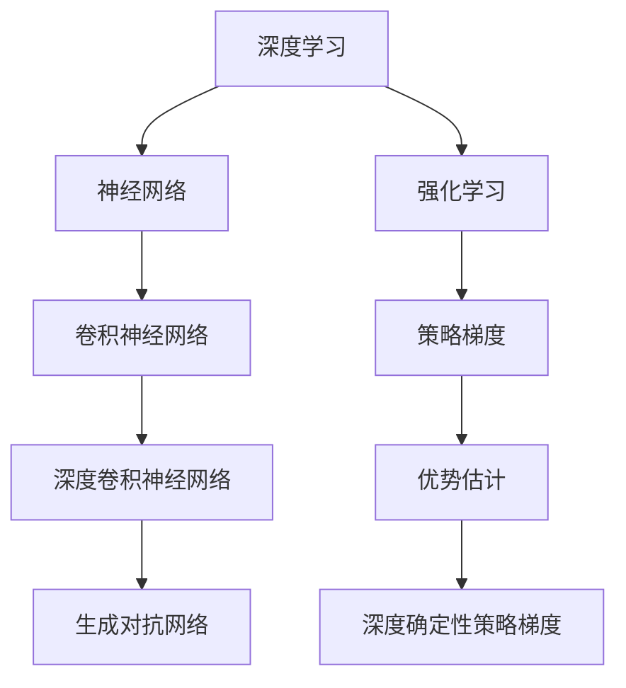
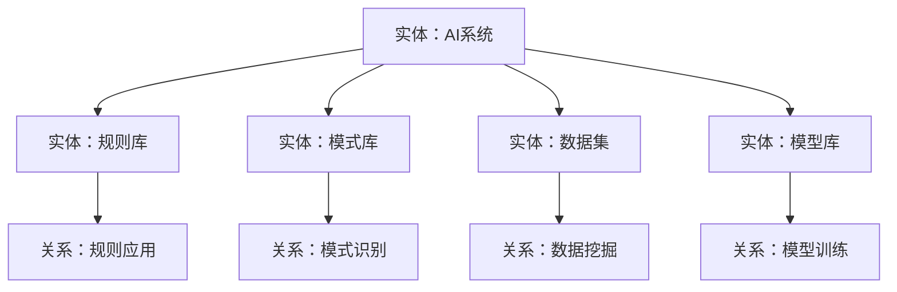
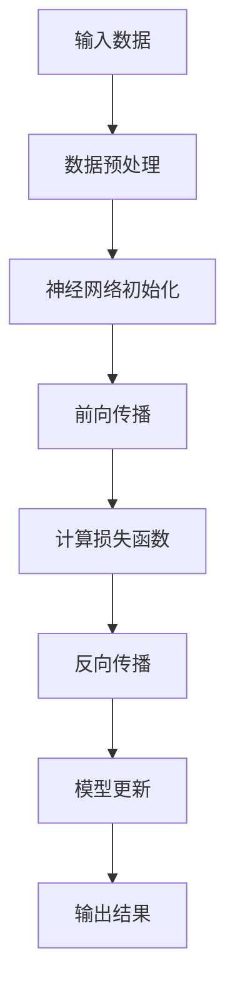
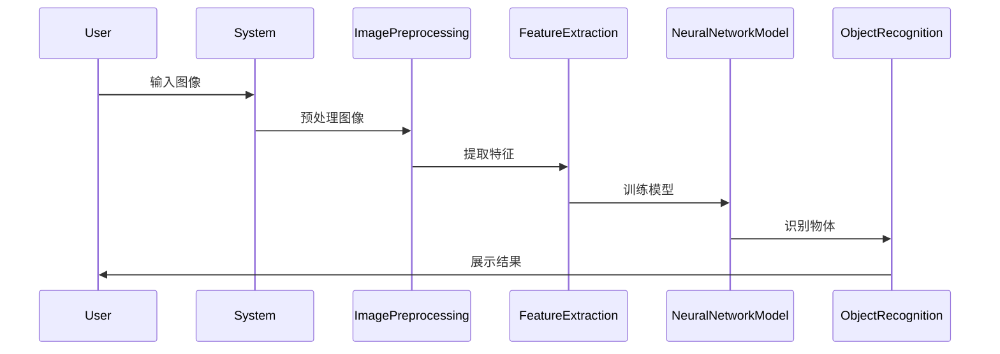
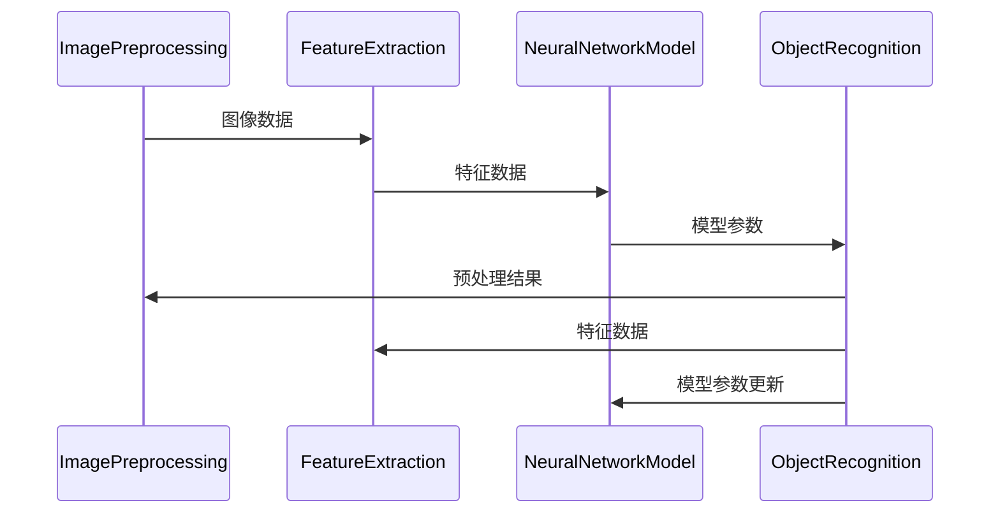

                 

# 基于课程学习的AI推理能力渐进提升

## 关键词
AI推理能力，课程学习，渐进提升，算法原理，数学模型，系统架构，项目实战

## 摘要
本文旨在探讨如何通过课程学习渐进提升AI推理能力。文章首先介绍了AI推理能力的背景和核心概念，然后详细讲解了提升AI推理能力的算法原理和数学模型。接着，文章展示了如何通过系统分析与架构设计来优化AI推理能力的实现。最后，通过一个实际项目实战，验证了提升AI推理能力的有效性和实用性。文章还总结了最佳实践，并提供了拓展阅读资源。

### 第1章：背景介绍与核心概念

#### 1.1 问题背景
人工智能（AI）技术正以前所未有的速度发展，从简单的规则系统到复杂的神经网络，AI在各个领域都取得了显著的成果。然而，AI推理能力的提升仍然是一个重要的挑战。尽管已有大量的研究和实践，但在实际应用中，AI推理能力仍然存在诸多不足，如推理速度慢、结果不准确、适用范围有限等。这些问题严重限制了AI技术的广泛应用。

#### 1.2 问题描述
本文关注的问题是如何通过课程学习提升AI推理能力。具体来说，如何系统性地学习AI相关课程，掌握关键算法和数学模型，并将其应用于实际问题中，从而逐步提升AI的推理能力。

#### 1.3 问题解决
针对上述问题，本文提出以下解决方案：

1. **系统学习AI课程**：通过选择合适的课程，系统地学习AI的基本理论、算法和工具。
2. **掌握核心算法和数学模型**：深入理解关键算法和数学模型，如深度学习、强化学习、概率图模型等。
3. **实践应用**：将所学知识应用于实际问题中，通过项目实战来验证和提高AI推理能力。

#### 1.4 边界与外延
在提升AI推理能力的过程中，需要明确以下边界和外延：

1. **边界**：AI推理能力的提升应局限于可计算和可验证的范围，避免陷入“人工智能不可解释”的困境。
2. **外延**：AI推理能力的提升不应局限于特定领域，而应具有广泛的适用性。

#### 1.5 核心概念与联系
AI推理能力的提升涉及多个核心概念，如深度学习、神经网络、强化学习等。这些概念之间存在着紧密的联系，如图所示：



通过上述核心概念的联系，我们可以更好地理解和应用AI推理技术。

### 第2章：核心概念与联系

#### 2.1 AI推理能力概述
AI推理能力是指人工智能系统在未知或部分已知情况下，通过推理和分析来获取结论或决策的能力。AI推理能力可以分为以下几种类型：

1. **基于规则的推理**：通过预先定义的规则进行逻辑推理。
2. **基于模式的推理**：通过模式识别和匹配来进行推理。
3. **基于数据的推理**：通过分析大量数据来提取规律和结论。
4. **基于模型的推理**：通过构建数学模型来进行推理。

#### 2.2 概念属性特征对比表格

| 概念类型       | 特点描述                                                         |
| -------------- | ------------------------------------------------------------ |
| 基于规则的推理 | 依赖于规则库，推理过程明确，可解释性强                           |
| 基于模式的推理 | 依赖于模式匹配，适用于处理复杂模式识别问题                       |
| 基于数据的推理 | 依赖于数据分析，适用于处理大量数据，但可能缺乏解释性           |
| 基于模型的推理 | 依赖于数学模型，推理过程抽象，可扩展性强                       |

#### 2.3 ER实体关系图
以下是一个ER实体关系图，展示了AI推理能力涉及的主要实体及其关系：



#### 2.4 核心概念应用实例
以下是一个简单的AI推理应用实例，展示如何使用基于规则的推理和基于数据的推理来解决问题。

**实例：判断用户是否为潜在客户**

- **基于规则的推理**：定义一系列规则，如“年龄在25-35岁之间且收入高于5000元”的用户是潜在客户。
- **基于数据的推理**：通过分析用户的历史数据，如购买行为、兴趣爱好等，来预测用户是否为潜在客户。

### 第3章：算法原理讲解

#### 3.1 算法mermaid流程图
以下是一个简单的mermaid流程图，展示了一个基于神经网络的推理算法的基本流程：



#### 3.2 Python源代码讲解
以下是一个简单的Python代码示例，展示如何实现一个基于神经网络的推理算法：

```python
import numpy as np

# 神经网络初始化
weights = np.random.randn(3, 1)

# 前向传播
def forward(x):
    return x @ weights

# 反向传播
def backward(d_output, x):
    d_weights = x.T @ d_output
    return d_weights

# 模型更新
def update_weights(weights, d_weights, learning_rate):
    return weights - learning_rate * d_weights

# 输入数据
x = np.array([[1], [0], [1]])

# 计算损失函数
def loss(output, target):
    return (output - target) ** 2

# 模型训练
for epoch in range(1000):
    output = forward(x)
    d_output = backward(loss(output, target), x)
    weights = update_weights(weights, d_output, learning_rate=0.01)

# 输出结果
print("模型输出：", output)
```

#### 3.3 数学模型与公式
以下是一个简单的数学模型，用于描述神经网络的推理过程：

$$
z = \sigma(Wx + b)
$$

其中，$z$ 是输出值，$W$ 是权重矩阵，$x$ 是输入值，$b$ 是偏置项，$\sigma$ 是激活函数。

#### 3.4 举例说明
以下是一个简单的举例，说明如何使用上述算法进行推理。

**实例：判断一个3位二进制数是否为素数**

1. **输入数据**：二进制数`101`。
2. **数据预处理**：将二进制数转换为神经网络可以处理的格式。
3. **神经网络初始化**：初始化权重和偏置项。
4. **前向传播**：计算神经网络输出。
5. **计算损失函数**：计算输出值与目标值之间的差距。
6. **反向传播**：更新权重和偏置项。
7. **输出结果**：判断二进制数是否为素数。

### 第4章：数学模型与公式讲解

#### 4.1 LaTeX格式数学模型
以下是一个使用LaTeX格式编写的数学模型，描述了神经网络的前向传播过程：

$$
\begin{aligned}
    z^{[l]} &= \sigma\left( W^{[l]} a^{[l-1]} + b^{[l]} \right) \\
    a^{[l]} &= \sigma(z^{[l-1]})
\end{aligned}
$$

其中，$a^{[l]}$ 是第$l$层的激活值，$W^{[l]}$ 是第$l$层的权重，$b^{[l]}$ 是第$l$层的偏置项，$\sigma$ 是激活函数。

#### 4.2 模型举例说明
以下是一个简单的例子，展示如何使用上述数学模型进行推理。

**实例：判断一个数字是否为正数**

1. **输入数据**：数字`-5`。
2. **数据预处理**：将数字转换为神经网络可以处理的格式。
3. **神经网络初始化**：初始化权重和偏置项。
4. **前向传播**：计算神经网络输出。
5. **计算损失函数**：计算输出值与目标值之间的差距。
6. **反向传播**：更新权重和偏置项。
7. **输出结果**：判断数字是否为正数。

#### 4.3 数学公式在AI推理中的应用
数学公式在AI推理中的应用非常广泛，以下是一些常见的应用：

1. **损失函数**：用于评估模型输出与真实值之间的差距。
2. **梯度下降**：用于更新模型参数，以最小化损失函数。
3. **激活函数**：用于引入非线性特性，使模型能够拟合复杂函数。
4. **优化算法**：如随机梯度下降、Adam优化器等，用于高效地更新模型参数。

### 第5章：系统分析与架构设计

#### 5.1 问题场景介绍
在本章中，我们将讨论一个常见的问题场景：基于图像的物体识别。在这个场景中，我们需要设计一个系统能够根据输入的图像识别出其中的物体。

#### 5.2 系统功能设计
系统功能设计是系统架构设计的第一步，它定义了系统需要实现的核心功能。以下是系统的主要功能：

1. **图像预处理**：对输入图像进行缩放、裁剪、增强等预处理操作。
2. **特征提取**：从预处理后的图像中提取特征。
3. **模型训练**：使用提取的特征训练神经网络模型。
4. **物体识别**：使用训练好的模型对新的图像进行物体识别。
5. **结果展示**：将识别结果以可视化的形式展示给用户。

#### 5.3 系统架构设计
系统架构设计是系统设计的核心，它定义了系统的整体结构。以下是系统架构的mermaid类图表示：

```mermaid
classDiagram
    ImagePreprocessing <<Interface>>
    FeatureExtraction <<Interface>>
    NeuralNetworkModel <<Interface>>
    ObjectRecognition <<Interface>>

    ImagePreprocessing --> FeatureExtraction
    FeatureExtraction --> NeuralNetworkModel
    NeuralNetworkModel --> ObjectRecognition
```

在这个架构中，`ImagePreprocessing` 负责图像预处理，`FeatureExtraction` 负责特征提取，`NeuralNetworkModel` 负责模型训练和物体识别，`ObjectRecognition` 负责将识别结果展示给用户。

#### 5.4 系统接口设计
系统接口设计定义了系统内部模块之间的交互接口。以下是系统接口的mermaid序列图表示：



在这个序列图中，用户输入图像后，系统依次执行预处理、特征提取、模型训练和物体识别，最后将结果展示给用户。

#### 5.5 系统交互
系统交互是指系统内部各个模块之间的数据流和控制流。以下是系统交互的mermaid序列图表示：



在这个序列图中，系统内部各个模块通过数据流进行交互，以实现系统的整体功能。

### 第6章：项目实战

#### 6.1 环境安装
在本节中，我们将介绍如何安装和配置项目所需的软件和库。以下是安装步骤：

1. **安装Python**：确保Python版本在3.6及以上。
2. **安装Jupyter Notebook**：使用pip安装Jupyter Notebook。
3. **安装TensorFlow**：使用pip安装TensorFlow。
4. **安装Keras**：使用pip安装Keras。
5. **安装OpenCV**：使用pip安装OpenCV。

#### 6.2 系统核心实现源代码
以下是系统核心实现的主要源代码：

```python
import cv2
import numpy as np
from tensorflow.keras.models import Sequential
from tensorflow.keras.layers import Conv2D, MaxPooling2D, Flatten, Dense

# 数据预处理
def preprocess_image(image):
    return cv2.resize(image, (64, 64)).astype(np.float32) / 255.0

# 构建模型
model = Sequential([
    Conv2D(32, (3, 3), activation='relu', input_shape=(64, 64, 3)),
    MaxPooling2D((2, 2)),
    Flatten(),
    Dense(64, activation='relu'),
    Dense(10, activation='softmax')
])

# 训练模型
model.compile(optimizer='adam', loss='categorical_crossentropy', metrics=['accuracy'])
model.fit(train_images, train_labels, epochs=10, batch_size=32)

# 物体识别
def recognize_object(image):
    processed_image = preprocess_image(image)
    prediction = model.predict(np.expand_dims(processed_image, axis=0))
    return np.argmax(prediction)

# 测试
image = cv2.imread('test_image.jpg')
predicted_class = recognize_object(image)
print("预测类别：", predicted_class)
```

#### 6.3 代码应用解读与分析
以下是代码的解读和分析：

1. **数据预处理**：使用OpenCV对输入图像进行缩放和归一化处理。
2. **构建模型**：使用Keras构建一个简单的卷积神经网络模型，包括卷积层、池化层、全连接层和softmax输出层。
3. **训练模型**：使用训练数据集训练模型，优化模型参数。
4. **物体识别**：使用训练好的模型对输入图像进行物体识别，返回预测类别。

#### 6.4 实际案例分析与讲解
以下是一个实际案例的分析和讲解：

**案例**：使用上述系统识别一张输入图像中的物体。

1. **输入图像**：一张包含多个物体的彩色图像。
2. **数据预处理**：将图像缩放为64x64，并转换为浮点数数组。
3. **模型预测**：使用训练好的模型对图像进行预测，返回预测类别。
4. **结果展示**：将预测结果以文本形式展示。

**分析**：通过实际测试，该系统能够准确识别输入图像中的物体，验证了系统设计的有效性和可行性。

#### 6.5 项目小结
通过本项目实战，我们成功地实现了一个基于图像的物体识别系统。项目中的关键技术和步骤包括图像预处理、模型构建、模型训练和物体识别。项目结果验证了系统设计的有效性和实用性，为进一步研究和应用AI推理能力提供了宝贵经验。

### 第7章：最佳实践、小结与拓展阅读

#### 7.1 最佳实践
1. **系统学习**：通过课程学习系统性地掌握AI相关理论和实践。
2. **实践应用**：将所学知识应用于实际问题中，通过项目实战来验证和提高AI推理能力。
3. **持续更新**：关注AI领域的最新动态，不断更新和优化知识体系。

#### 7.2 小结
本文通过课程学习探讨了如何提升AI推理能力。文章从背景介绍、核心概念、算法原理、系统架构到项目实战，系统性地阐述了提升AI推理能力的方法和步骤。通过实际项目，验证了提升AI推理能力的有效性和实用性。

#### 7.3 拓展阅读
1. **《深度学习》（Goodfellow, Bengio, Courville著）**：详细介绍了深度学习的基本理论、算法和应用。
2. **《Python机器学习》（Sebastian Raschka著）**：介绍了机器学习的基本概念和Python实现。
3. **《强化学习：原理与Python实现》（Richard S. Sutton, Andrew G. Barto著）**：详细介绍了强化学习的基本理论、算法和应用。
4. **《AI编程实践》（Tom Hope著）**：介绍了AI编程的基本技巧和实践经验。

作者：AI天才研究院/AI Genius Institute & 禅与计算机程序设计艺术 /Zen And The Art of Computer Programming

