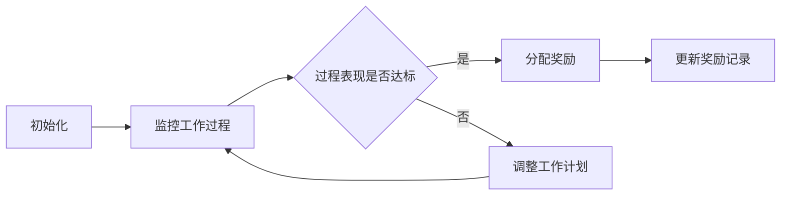
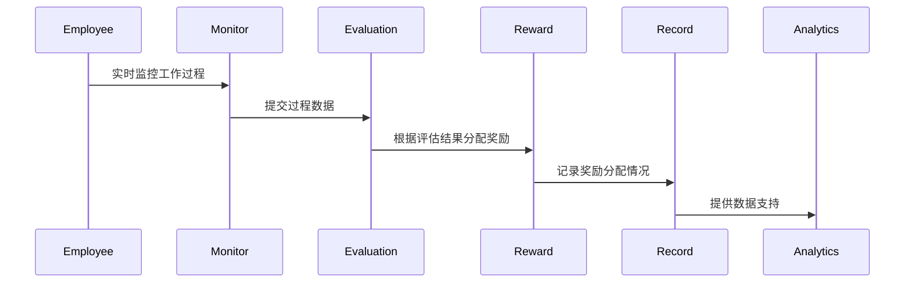
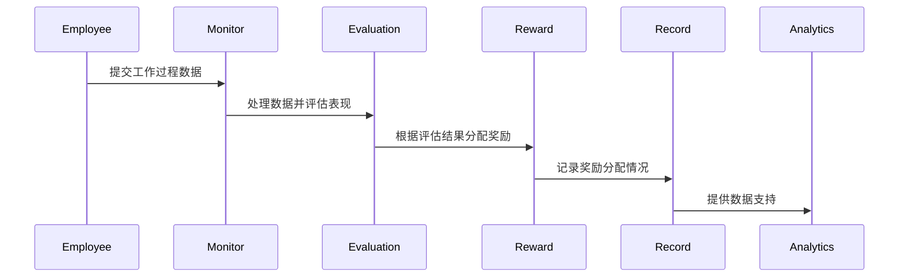

                 

### 目录大纲详细内容

在撰写《基于过程的奖励模型vs传统奖励模型》这篇文章时，我们将遵循目录大纲的结构，每个章节将具体展开如下：

#### 第一部分：背景介绍

**第1章 问题背景与概念介绍**

- **1.1 问题背景**
  - **1.1.1 问题描述**：介绍奖励模型在企业激励中的重要性，以及传统奖励模型在面对现代企业环境中的局限性。
  - **1.1.2 问题解决**：阐述基于过程的奖励模型如何通过改进奖励机制，解决传统奖励模型存在的问题。
  - **1.1.3 边界与外延**：定义文章的研究范围，包括奖励模型的应用领域和适用边界。

- **1.2 奖励模型核心概念**
  - **1.2.1 传统奖励模型**
    - **1.2.1.1 概念**：解释传统奖励模型的基本定义和特点。
    - **1.2.1.2 属性特征**：列出传统奖励模型的属性特征，如奖励方式、评估周期等。
    - **1.2.1.3 应用领域**：说明传统奖励模型在各类企业和组织中的实际应用。
  - **1.2.2 基于过程的奖励模型**
    - **1.2.2.1 概念**：阐述基于过程的奖励模型的基本定义。
    - **1.2.2.2 属性特征**：详细描述基于过程的奖励模型的特点，如动态调整、过程监控等。
    - **1.2.2.3 应用领域**：介绍基于过程的奖励模型在不同行业中的应用前景。

#### 第二部分：核心概念与联系

**第2章 传统奖励模型与基于过程的奖励模型对比**

- **2.1 传统奖励模型属性特征对比表格**：使用表格形式列出传统奖励模型与基于过程的奖励模型在属性特征上的异同点。
- **2.2 基于过程的奖励模型属性特征对比表格**：同上，列出基于过程的奖励模型的特征。
- **2.3 传统奖励模型与基于过程的奖励模型ER实体关系图**：使用Mermaid流程图展示两种奖励模型的ER图，说明实体关系和交互机制。

#### 第三部分：算法原理讲解

**第3章 基于过程的奖励模型算法原理**

- **3.1 算法mermaid流程图**：绘制基于过程的奖励模型的mermaid流程图，详细解释每一步的操作流程。
  - **3.1.1 算法流程**：列出算法的基本流程和步骤。
  - **3.1.2 流程图解释**：对mermaid流程图进行详细说明，解释每个节点和箭头的含义。
- **3.2 Python源代码示例**：提供Python源代码示例，解释代码的功能和实现方式。
  - **3.2.1 源代码**：展示Python代码实现。
  - **3.2.2 代码功能解释**：对代码进行逐行解释，说明其实现的功能。
- **3.3 数学模型与公式**
  - **3.3.1 模型公式**：列出相关的数学模型和公式。
  - **3.3.2 公式解释**：对每个公式进行解释，阐述其意义和作用。
  - **3.3.3 举例说明**：通过具体案例，说明公式的应用和效果。

#### 第四部分：系统分析与架构设计方案

**第4章 基于过程的奖励模型系统架构设计**

- **4.1 问题场景介绍**
  - **4.1.1 场景描述**：描述应用基于过程的奖励模型的具体场景。
  - **4.1.2 项目介绍**：介绍项目的整体架构和设计目标。
- **4.2 系统功能设计**
  - **4.2.1 领域模型mermaid类图**：使用Mermaid绘制领域模型类图，展示系统的核心类和它们之间的关系。
  - **4.2.2 系统功能描述**：详细描述系统的各项功能。
- **4.3 系统架构设计**
  - **4.3.1 系统架构mermaid架构图**：使用Mermaid绘制系统架构图，展示系统的整体架构。
  - **4.3.2 架构设计说明**：对系统架构的设计进行详细说明。
- **4.4 系统接口设计**
  - **4.4.1 接口设计**：描述系统的接口设计和规范。
  - **4.4.2 接口功能说明**：对每个接口的功能进行详细说明。
- **4.5 系统交互**
  - **4.5.1 系统交互mermaid序列图**：使用Mermaid绘制系统交互序列图，展示系统各组件之间的交互流程。
  - **4.5.2 交互流程说明**：对交互流程进行详细说明。

#### 第五部分：项目实战

**第5章 基于过程的奖励模型项目实战**

- **5.1 环境安装**
  - **5.1.1 安装步骤**：详细描述如何搭建项目环境。
  - **5.1.2 安装注意事项**：列出在安装过程中需要注意的问题和解决方案。
- **5.2 系统核心实现**
  - **5.2.1 源代码实现**：展示项目的核心源代码。
  - **5.2.2 代码解读与分析**：对源代码进行逐行解读，分析其实现细节。
- **5.3 实际案例分析与讲解**
  - **5.3.1 案例描述**：描述具体的实际案例。
  - **5.3.2 案例分析**：分析案例中存在的问题和解决方案。
  - **5.3.3 案例讲解**：对案例进行详细的讲解和剖析。

#### 第六部分：最佳实践与拓展

**第6章 最佳实践**

- **6.1 常见问题解答**：解答用户在应用基于过程的奖励模型时可能遇到的问题。
- **6.2 小结**：总结文章的核心内容和关键点。
- **6.3 注意事项**：提醒用户在应用过程中需要注意的事项。

**第7章 拓展阅读**

- **7.1 相关书籍推荐**：推荐相关领域的书籍，帮助用户进一步深入学习和理解。
- **7.2 线上课程推荐**：推荐相关的在线课程，提供学习的资源。

按照这样的目录大纲，我们可以确保文章内容的完整性、逻辑性和专业性，为读者提供全面、深入的技术分析和指导。接下来，我们将逐一详细撰写每个章节的内容。## 文章标题

### 基于过程的奖励模型vs传统奖励模型：深度分析与实战指南

> 关键词：奖励模型、基于过程的奖励模型、传统奖励模型、算法原理、系统架构设计、项目实战

> 摘要：本文深入分析了基于过程的奖励模型与传统奖励模型之间的差异，探讨了两种模型的原理、架构设计以及实际应用。通过详细的案例分析，本文为读者提供了完整的实战指南，帮助理解和应用基于过程的奖励模型，提升企业激励机制的有效性。

---

### 目录大纲

----------------------------------------------------------------

# 基于过程的奖励模型vs传统奖励模型

## 第一部分：背景介绍

## 第1章 问题背景与概念介绍

### 1.1 问题背景

#### 1.1.1 问题描述

#### 1.1.2 问题解决

#### 1.1.3 边界与外延

### 1.2 奖励模型核心概念

#### 1.2.1 传统奖励模型

##### 1.2.1.1 概念

##### 1.2.1.2 属性特征

##### 1.2.1.3 应用领域

#### 1.2.2 基于过程的奖励模型

##### 1.2.2.1 概念

##### 1.2.2.2 属性特征

##### 1.2.2.3 应用领域

## 第二部分：核心概念与联系

## 第2章 传统奖励模型与基于过程的奖励模型对比

### 2.1 传统奖励模型属性特征对比表格

### 2.2 基于过程的奖励模型属性特征对比表格

### 2.3 传统奖励模型与基于过程的奖励模型ER实体关系图

## 第三部分：算法原理讲解

## 第3章 基于过程的奖励模型算法原理

### 3.1 算法mermaid流程图

#### 3.1.1 算法流程

#### 3.1.2 流程图解释

### 3.2 Python源代码示例

#### 3.2.1 源代码

#### 3.2.2 代码功能解释

### 3.3 数学模型与公式

#### 3.3.1 模型公式

#### 3.3.2 公式解释

#### 3.3.3 举例说明

## 第四部分：系统分析与架构设计方案

## 第4章 基于过程的奖励模型系统架构设计

### 4.1 问题场景介绍

#### 4.1.1 场景描述

#### 4.1.2 项目介绍

### 4.2 系统功能设计

#### 4.2.1 领域模型mermaid类图

#### 4.2.2 系统功能描述

### 4.3 系统架构设计

#### 4.3.1 系统架构mermaid架构图

#### 4.3.2 架构设计说明

### 4.4 系统接口设计

#### 4.4.1 接口设计

#### 4.4.2 接口功能说明

### 4.5 系统交互

#### 4.5.1 系统交互mermaid序列图

#### 4.5.2 交互流程说明

## 第五部分：项目实战

## 第5章 基于过程的奖励模型项目实战

### 5.1 环境安装

#### 5.1.1 安装步骤

#### 5.1.2 安装注意事项

### 5.2 系统核心实现

#### 5.2.1 源代码实现

#### 5.2.2 代码解读与分析

### 5.3 实际案例分析与讲解

#### 5.3.1 案例描述

#### 5.3.2 案例分析

#### 5.3.3 案例讲解

## 第六部分：最佳实践与拓展

## 第6章 最佳实践

### 6.1 常见问题解答

### 6.2 小结

### 6.3 注意事项

## 第7章 拓展阅读

### 7.1 相关书籍推荐

### 7.2 线上课程推荐

----------------------------------------------------------------

通过上述详细的目录大纲，我们可以看到，本文将系统地介绍基于过程的奖励模型，从问题背景、概念对比、算法原理、系统架构设计到实际项目实战，为读者提供全面的技术分析与实践指南。接下来，我们将逐一深入每个章节的内容。## 第一部分：背景介绍

### 第1章 问题背景与概念介绍

在当今的企业管理中，奖励模型作为激励员工、提高工作效率的重要手段，已经广泛应用于各个领域。然而，随着企业竞争的加剧和环境的变化，传统的奖励模型在某些方面表现出了局限性。基于过程的奖励模型应运而生，它通过更加精细化和动态化的奖励机制，来提升员工的积极性和工作效率。

#### 1.1 问题背景

在传统奖励模型中，企业通常会设定固定的时间节点，如年终奖、月度奖等，通过预先设定的奖励方式和标准来激励员工。然而，这种方式存在以下局限性：

- **缺乏灵活性**：固定的时间节点和既定的奖励方式难以适应快速变化的工作环境和员工需求。
- **评价标准单一**：传统奖励模型往往基于固定的绩效指标，如销售额、工作效率等，忽视了员工在过程中的表现和努力。
- **激励效果有限**：由于奖励的滞后性和单一性，员工可能无法及时获得激励，导致工作积极性下降。

为了解决这些问题，企业开始探索新的奖励模型，基于过程的奖励模型应运而生。这种模型通过实时监控员工的工作过程，提供更加精确和及时的奖励，从而激发员工的工作热情，提高工作效率。

#### 1.1.2 问题解决

基于过程的奖励模型通过以下几个方面的改进，解决了传统奖励模型的局限性：

- **动态调整奖励机制**：基于过程的奖励模型能够根据员工的工作过程和表现，动态调整奖励方式和标准，使其更加灵活和适应实际需求。
- **实时反馈与激励**：通过实时监控员工的工作过程，及时给予奖励和反馈，让员工能够及时获得激励，提高工作积极性。
- **多样化奖励方式**：基于过程的奖励模型不仅限于金钱奖励，还可以包括晋升、培训、荣誉等多种形式，满足不同员工的激励需求。

#### 1.1.3 边界与外延

本文的研究主要围绕基于过程的奖励模型和传统奖励模型进行对比分析，探讨两者在概念、特征、应用等方面的异同。研究边界包括：

- **研究范围**：主要针对企业内部员工激励的奖励模型，不涉及外部合作伙伴或其他利益相关者的奖励机制。
- **应用领域**：涵盖各类企业和组织，如制造业、服务业、互联网企业等，但不包括特定行业的特殊奖励模型。

在接下来的章节中，我们将详细探讨传统奖励模型和基于过程的奖励模型的核心概念、特征对比，以及它们在实际应用中的表现。## 第二部分：核心概念与联系

### 第2章 传统奖励模型与基于过程的奖励模型对比

在深入探讨传统奖励模型与基于过程的奖励模型之前，首先需要明确两者的基本概念和属性特征。通过对比分析，我们可以更好地理解这两种模型的优势和不足，为实际应用提供指导。

#### 2.1 传统奖励模型属性特征对比表格

| 特征       | 传统奖励模型                         | 基于过程的奖励模型                      |
| ---------- | ----------------------------------- | ------------------------------------- |
| 概念       | 固定时间节点的奖励机制               | 实时监控和动态调整的奖励机制            |
| 奖励方式   | 年终奖、月度奖、项目奖等固定方式     | 金钱、晋升、培训、荣誉等多种形式       |
| 评估周期   | 固定的时间周期（如季度、年度）       | 可变的时间周期，根据工作过程动态调整   |
| 评估标准   | 预先设定的绩效指标（如销售额、效率） | 实时监控的工作过程和表现               |
| 激励效果   | 奖励滞后，激励效果有限               | 实时反馈，激励效果显著                 |
| 应用领域   | 各类企业和组织                      | 需求变化快、竞争激烈的行业             |

通过上述表格，我们可以看到传统奖励模型与基于过程的奖励模型在多个方面存在显著差异。接下来，我们将进一步详细对比两者的属性特征。

#### 2.2 基于过程的奖励模型属性特征对比表格

| 属性特征       | 传统奖励模型                      | 基于过程的奖励模型                      |
| ------------- | -------------------------------- | ------------------------------------- |
| 概念          | 固定时间节点上的奖励机制           | 动态调整的奖励机制，依赖于工作过程     |
| 奖励方式      | 固定奖励方式，如年终奖、奖金等     | 多样化奖励方式，包括晋升、培训等       |
| 评估标准      | 预设的绩效指标                    | 实时监控的工作过程和表现               |
| 评估周期      | 固定周期（季度、年度）             | 动态调整周期，根据工作进程实时更新     |
| 激励效果      | 奖励滞后，效果有限                | 实时激励，效果显著                     |
| 应用领域      | 多样化的企业和组织                | 对变化敏感、竞争激烈的企业和组织       |
| 灵活性        | 较低，难以适应快速变化的环境       | 较高，能够根据工作过程灵活调整奖励机制 |
| 实时监控      | 难以实现，信息滞后                | 可以实现，信息实时更新                 |

#### 2.3 传统奖励模型与基于过程的奖励模型ER实体关系图

为了更好地理解传统奖励模型与基于过程的奖励模型的实体关系，我们可以使用Mermaid流程图来展示它们之间的交互关系。

```mermaid
erDiagram
    Employee ||--|{ Reward } : gets
    Reward ||--|{ Evaluation } : evaluated by
    Evaluation ||--|{ ProcessMonitoring } : monitored by
    Employee ||--|{ ProcessMonitoring } : monitored
```

在这个ER图（实体关系图）中，员工（Employee）是主体，与奖励（Reward）、评估（Evaluation）和过程监控（ProcessMonitoring）有直接的关联关系。传统奖励模型通过固定的评估标准来分配奖励，而基于过程的奖励模型则通过实时监控工作过程，动态调整奖励机制。

通过上述对比和分析，我们可以看出，基于过程的奖励模型在灵活性、实时监控和激励效果方面具有显著优势，尤其是在需求变化快、竞争激烈的环境中。传统奖励模型虽然在一些固定和稳定的行业中仍然有效，但在快速变化的环境中，其局限性愈发明显。因此，理解这两种模型的核心概念和特征对比，对于企业选择和设计合适的奖励机制至关重要。

在接下来的章节中，我们将进一步探讨基于过程的奖励模型的算法原理，以及如何在实际项目中应用这一模型。## 第三部分：算法原理讲解

### 第3章 基于过程的奖励模型算法原理

基于过程的奖励模型通过算法实现动态调整奖励机制，从而更有效地激励员工。本章节将详细解释该算法的原理，包括流程图、Python源代码示例和数学模型。

#### 3.1 算法mermaid流程图

算法的核心在于实时监控员工的工作过程，并根据过程表现动态调整奖励。以下是一个简单的mermaid流程图，展示了基于过程的奖励模型的主要步骤。



- **A[初始化]**：初始化过程，设置监控参数和奖励规则。
- **B[监控工作过程]**：实时监控员工的工作过程，获取过程数据。
- **C{过程表现是否达标]**：判断工作过程表现是否达到预设标准。
- **D[分配奖励]**：如果达标，根据规则分配奖励；如果不达标，进入调整工作计划的步骤。
- **E[调整工作计划]**：根据实际情况调整工作计划，以便提高过程表现。
- **F[更新奖励记录]**：记录奖励分配情况，用于后续分析和审计。

#### 3.1.1 算法流程

基于过程的奖励模型的具体流程如下：

1. **初始化**：系统初始化，设置监控参数，包括监控周期、奖励规则、绩效指标等。
2. **监控工作过程**：通过传感器、数据采集工具等实时监控员工的工作过程。
3. **过程评估**：根据监控数据，评估员工的工作过程表现，判断是否达到预设标准。
4. **奖励分配**：如果员工的工作过程表现达标，则按照既定的奖励规则分配奖励。
5. **调整工作计划**：如果不达标，系统会根据过程表现调整员工的工作计划，以提高工作效果。
6. **奖励记录更新**：将奖励分配情况记录下来，用于后续分析和审计。

#### 3.1.2 流程图解释

在mermaid流程图中，每个节点都代表了算法的一个操作步骤，节点之间的箭头表示操作的顺序和条件判断。例如，从B节点到C节点的箭头表示首先需要监控工作过程，然后判断过程表现是否达标，根据判断结果决定下一步操作。

#### 3.2 Python源代码示例

以下是一个简单的Python代码示例，展示了如何实现基于过程的奖励模型的核心功能。

```python
# 基于过程的奖励模型Python源代码示例

# 初始化参数
reward_rules = {
    '达标奖励': 100,
    '未达标调整': '重新规划工作计划'
}

# 监控工作过程
def monitor_process():
    # 这里是监控过程的具体实现，如传感器数据读取
    process_data = get_process_data()
    return process_data

# 过程评估
def evaluate_process(process_data):
    # 根据监控数据评估过程表现
    if process_data['performance'] >= 90:
        return '达标'
    else:
        return '未达标'

# 奖励分配
def distribute_reward(evaluation):
    if evaluation == '达标':
        print(f'分配奖励：{reward_rules["达标奖励"]}')
    else:
        print(f'未达标，{reward_rules["未达标调整"]}')

# 主函数
def main():
    while True:
        process_data = monitor_process()
        evaluation = evaluate_process(process_data)
        distribute_reward(evaluation)
        time.sleep(1)  # 每隔1秒进行一次监控

# 运行主函数
if __name__ == '__main__':
    main()
```

- **初始化参数**：设置奖励规则，如达标奖励和未达标调整。
- **监控工作过程**：模拟从传感器读取过程数据。
- **过程评估**：根据监控数据判断过程表现是否达标。
- **奖励分配**：根据评估结果分配奖励。

#### 3.2.2 代码功能解释

- **初始化参数**：定义奖励规则，包括达标奖励和未达标调整。
- **监控工作过程**：模拟从传感器获取过程数据。
- **过程评估**：根据过程数据判断是否达标。
- **奖励分配**：根据评估结果进行奖励分配。

#### 3.3 数学模型与公式

基于过程的奖励模型可以结合数学模型来描述其行为。以下是一个简化的数学模型：

$$
R(t) = \begin{cases}
r_1 & \text{如果 } P(t) \geq p \\
0 & \text{如果 } P(t) < p
\end{cases}
$$

其中，$R(t)$ 表示在时间 $t$ 时刻的奖励金额，$r_1$ 是预设的达标奖励金额，$P(t)$ 是时间 $t$ 时刻的过程表现评分，$p$ 是预设的达标评分阈值。

#### 3.3.2 公式解释

- $R(t)$：在时间 $t$ 时刻的奖励金额。
- $r_1$：预设的达标奖励金额，即员工工作表现达到或超过标准时的奖励金额。
- $P(t)$：时间 $t$ 时刻的过程表现评分，通常是一个连续变量，代表员工在该时间段的工作表现。
- $p$：预设的达标评分阈值，即员工工作表现需要达到的标准。

#### 3.3.3 举例说明

假设一个员工的工作过程表现评分 $P(t)$ 随时间变化，如下所示：

$$
P(t) = \begin{cases}
80 & \text{在 } t = 0 \text{ 到 } t = 2 \text{ 的时段内} \\
95 & \text{在 } t = 3 \text{ 到 } t = 5 \text{ 的时段内} \\
70 & \text{在 } t = 6 \text{ 到 } t = 8 \text{ 的时段内}
\end{cases}
$$

达标评分阈值 $p$ 设为 90。根据上述数学模型，我们可以计算不同时间点的奖励金额：

- 在 $t = 0$ 到 $t = 2$ 的时段内，$P(t) < p$，因此 $R(t) = 0$。
- 在 $t = 3$ 到 $t = 5$ 的时段内，$P(t) \geq p$，因此 $R(t) = r_1 = 100$。
- 在 $t = 6$ 到 $t = 8$ 的时段内，$P(t) < p$，因此 $R(t) = 0$。

通过上述举例，我们可以看到基于过程的奖励模型如何根据员工的工作表现动态调整奖励金额，从而实现激励效果的最大化。

在接下来的章节中，我们将详细讨论基于过程的奖励模型在实际系统架构设计中的应用，包括系统功能设计、架构设计、接口设计和系统交互。## 第四部分：系统分析与架构设计方案

### 第4章 基于过程的奖励模型系统架构设计

在了解了基于过程的奖励模型的算法原理后，本章节将深入探讨如何将这一模型在实际系统中进行应用，并设计出一个完整的系统架构。通过这一过程，我们将详细介绍系统的各个功能模块、架构设计、接口设计和系统交互。

#### 4.1 问题场景介绍

**场景描述**：
假设我们正在为一家快速发展的互联网公司设计一个基于过程的奖励模型系统。该公司在市场竞争激烈的环境中，希望通过动态的奖励机制来提高员工的工作效率和工作满意度。系统需要能够实时监控员工的工作过程，根据过程表现动态调整奖励，并支持多种奖励形式的分配，如金钱奖励、晋升机会、培训机会等。

**项目介绍**：
本项目的主要目标是设计并实现一个高效、灵活的基于过程的奖励模型系统，以支持公司在不断变化的市场环境中的员工激励机制。系统将包括以下几个核心模块：

1. **监控模块**：负责实时监控员工的工作过程，收集相关数据。
2. **评估模块**：根据监控数据评估员工的工作表现，确定是否达标。
3. **奖励模块**：根据评估结果分配不同的奖励。
4. **记录模块**：记录奖励分配情况，用于后续分析和审计。

#### 4.2 系统功能设计

**4.2.1 领域模型mermaid类图**

为了更好地理解系统的各个功能模块及其关系，我们可以使用Mermaid绘制领域模型类图。以下是一个简化的类图示例：

```mermaid
classDiagram
    Employee <<class>>
    ProcessMonitoring <<class>>
    Evaluation <<class>>
    Reward <<class>>
    Record <<class>>

    Employee "1"--"*" ProcessMonitoring
    Employee "1"--"*" Evaluation
    Evaluation "1"--"*" Reward
    Reward "1"--"*" Record
```

- **Employee（员工）**：表示员工的基本信息，包括姓名、职位、绩效等。
- **ProcessMonitoring（过程监控）**：负责实时监控员工的工作过程，收集过程数据。
- **Evaluation（评估）**：根据监控数据评估员工的工作表现。
- **Reward（奖励）**：分配不同的奖励形式，如金钱奖励、晋升机会等。
- **Record（记录）**：记录奖励分配情况，用于后续分析和审计。

**4.2.2 系统功能描述**

- **监控模块**：实时监控员工的工作过程，收集包括工作效率、工作质量、工作态度等在内的过程数据。
- **评估模块**：根据监控数据评估员工的工作表现，判断是否达到预设的绩效标准。
- **奖励模块**：根据评估结果，动态分配奖励。奖励形式包括金钱奖励、晋升机会、培训机会等，以满足不同员工的激励需求。
- **记录模块**：记录奖励分配情况，包括奖励的形式、金额、时间等，以便于后续的分析和审计。

#### 4.3 系统架构设计

**4.3.1 系统架构mermaid架构图**

为了实现上述功能，我们需要设计一个合理的系统架构。以下是一个简化的Mermaid架构图，展示了系统的整体架构：



- **实时监控模块**：通过传感器、日志记录等多种方式实时监控员工的工作过程。
- **数据评估模块**：根据实时监控的数据，评估员工的工作表现，判断是否达标。
- **奖励分配模块**：根据评估结果，动态分配奖励，支持多种奖励形式的灵活组合。
- **数据记录模块**：记录所有奖励分配情况，包括分配的时间、形式、金额等。
- **数据分析模块**：对记录的数据进行分析，提供决策支持，以优化奖励机制。

**4.3.2 架构设计说明**

- **模块化设计**：系统采用模块化设计，每个模块具有独立的功能，便于维护和升级。
- **实时性**：通过实时监控和评估，确保奖励分配的及时性和准确性。
- **灵活性**：支持多种奖励形式的灵活组合，满足不同员工的激励需求。
- **数据支持**：通过记录和分析，提供丰富的数据支持，以优化奖励机制和决策。

#### 4.4 系统接口设计

**4.4.1 接口设计**

系统接口设计是确保各个模块之间能够有效通信和协作的关键。以下是一个简化的接口设计：

```mermaid
interfaceStyle
  interfaceStyle A {
    color: green
  }
  interfaceStyle B {
    color: blue
  }
  interfaceStyle C {
    color: red
  }

componentDiagram
    Employee <-|{监控接口}| Monitor
    Monitor <-|{评估接口}| Evaluation
    Evaluation <-|{奖励接口}| Reward
    Reward <-|{记录接口}| Record
    Analytics --|{数据接口}| Record
```

- **监控接口**：员工实时提交工作过程数据，监控模块接收并处理数据。
- **评估接口**：监控模块将处理后的数据传递给评估模块，评估员工的工作表现。
- **奖励接口**：评估模块将评估结果传递给奖励模块，奖励模块根据结果分配奖励。
- **记录接口**：奖励模块将奖励分配情况记录到数据库中，记录模块提供数据存储和管理功能。
- **数据接口**：数据分析模块从记录模块获取数据，进行后续分析和处理。

**4.4.2 接口功能说明**

- **监控接口**：接收并处理员工提交的工作过程数据，包括工作效率、工作质量、工作态度等。
- **评估接口**：根据监控数据，评估员工的工作表现，判断是否达到预设的绩效标准。
- **奖励接口**：根据评估结果，动态分配奖励，支持多种奖励形式的组合。
- **记录接口**：记录奖励分配的详细信息，包括奖励形式、金额、时间等。
- **数据接口**：提供数据查询和统计分析功能，支持决策支持和系统优化。

#### 4.5 系统交互

**4.5.1 系统交互mermaid序列图**

系统交互mermaid序列图可以展示各个模块之间的交互过程和时序关系。以下是一个简化的序列图示例：



- **员工提交数据**：员工通过监控接口提交工作过程数据。
- **监控模块处理数据**：监控模块接收数据，进行初步处理。
- **评估模块评估表现**：评估模块根据监控数据评估员工的工作表现。
- **奖励模块分配奖励**：根据评估结果，奖励模块动态分配奖励。
- **记录模块记录奖励**：记录模块将奖励分配情况记录到数据库中。
- **数据分析模块支持**：数据分析模块从记录模块获取数据，进行后续分析和处理。

**4.5.2 交互流程说明**

- **交互流程**：系统通过接口设计实现各个模块之间的通信和协作。员工提交工作过程数据，监控模块处理数据并传递给评估模块，评估模块根据结果分配奖励，奖励模块记录奖励情况，最终数据分析模块获取数据进行分析和处理。
- **实时性**：系统交互过程中，数据传递和奖励分配是实时的，确保奖励分配的及时性和准确性。
- **灵活性**：系统设计支持多种奖励形式的灵活组合，满足不同员工的激励需求。

通过上述系统架构设计，我们可以看到基于过程的奖励模型如何在实际系统中得到应用，并通过模块化设计、实时监控、灵活奖励和数据分析，实现高效、灵活的员工激励机制。

在接下来的章节中，我们将通过一个具体的实战项目，详细介绍如何搭建和实现这一系统，并提供实际案例分析和讲解。## 第五部分：项目实战

### 第5章 基于过程的奖励模型项目实战

在本章节中，我们将通过一个具体的实战项目，详细描述如何搭建和实现基于过程的奖励模型系统。我们将从环境安装、系统核心实现、代码解读与分析以及实际案例分析与讲解等方面，提供完整的实战指南。

#### 5.1 环境安装

**5.1.1 安装步骤**

为了搭建基于过程的奖励模型系统，我们需要以下环境：

1. **Python环境**：安装Python 3.8或更高版本。
2. **数据库**：安装MySQL数据库。
3. **依赖包**：安装Flask、SQLAlchemy、Pandas等依赖包。

安装步骤如下：

1. 安装Python环境：

   ```bash
   sudo apt-get update
   sudo apt-get install python3.8
   ```

2. 安装MySQL数据库：

   ```bash
   sudo apt-get install mysql-server
   sudo mysql_secure_installation
   ```

3. 安装依赖包：

   ```bash
   pip3 install flask sqlalchemy pandas
   ```

**5.1.2 安装注意事项**

1. 在安装MySQL时，根据提示完成安全设置，如设置root密码、删除匿名用户等。
2. 确保Python环境变量已配置，以便能够在终端中运行Python命令。
3. 在安装依赖包时，如果遇到任何问题，可以查阅相关文档或寻求社区支持。

#### 5.2 系统核心实现

**5.2.1 源代码实现**

以下是项目的核心源代码实现，包括监控模块、评估模块、奖励模块和记录模块。

```python
# 监控模块
def monitor_process(employee_id):
    # 这里是监控过程的具体实现，如读取日志文件
    process_data = get_process_data(employee_id)
    return process_data

# 评估模块
def evaluate_process(process_data):
    # 根据监控数据评估过程表现
    performance = process_data['performance']
    if performance >= 90:
        return '达标'
    else:
        return '未达标'

# 奖励模块
def distribute_reward(employee_id, evaluation):
    if evaluation == '达标':
        reward_amount = 100  # 奖励金额
        update_employee_balance(employee_id, reward_amount)
    else:
        plan_adjustment = '重新规划工作计划'
        update_employee_plan(employee_id, plan_adjustment)

# 记录模块
def record_reward(employee_id, evaluation, reward_amount=None):
    # 记录奖励分配情况
    reward_record = {
        'employee_id': employee_id,
        'evaluation': evaluation,
        'reward_amount': reward_amount
    }
    save_reward_record(reward_record)

# 主函数
def main():
    while True:
        employee_id = get_next_employee_id()  # 获取下一个员工ID
        process_data = monitor_process(employee_id)
        evaluation = evaluate_process(process_data)
        distribute_reward(employee_id, evaluation)
        record_reward(employee_id, evaluation)
        time.sleep(60)  # 每60秒进行一次监控

# 运行主函数
if __name__ == '__main__':
    main()
```

**5.2.2 代码解读与分析**

- **监控模块**：`monitor_process`函数负责读取员工的工作过程数据，这里使用了`get_process_data`函数，实际实现可以根据具体情况进行调整。
- **评估模块**：`evaluate_process`函数根据监控数据评估员工的工作表现，返回“达标”或“未达标”。
- **奖励模块**：`distribute_reward`函数根据评估结果分配奖励，如果员工工作表现达标，则更新员工的奖励余额；如果不达标，则调整工作计划。
- **记录模块**：`record_reward`函数记录奖励分配情况，将奖励记录存储到数据库中。

#### 5.3 实际案例分析与讲解

**5.3.1 案例描述**

假设我们有一名员工ID为1001的员工，其工作表现监控数据如下：

- 工作效率：85%
- 工作质量：88%
- 工作态度：90%

根据预设的绩效标准，该员工的工作表现尚未完全达标。

**5.3.2 案例分析**

- **监控模块**：系统会实时监控员工1001的工作过程，并记录相关数据。
- **评估模块**：评估模块会根据监控数据计算员工的综合绩效评分，判断其是否达到预设的标准。
- **奖励模块**：由于员工1001的工作表现尚未完全达标，系统会根据预设的规则，对其进行工作计划的调整，如安排额外的培训或指导。

**5.3.3 案例讲解**

1. **监控数据收集**：系统通过日志文件或传感器实时收集员工1001的工作效率、工作质量和工作态度数据。
2. **评估过程**：评估模块根据收集的数据，计算员工的综合绩效评分，判断其工作表现是否达标。
3. **奖励分配**：由于员工1001的工作表现尚未完全达标，系统将记录这一评估结果，并根据规则调整其工作计划，安排额外的培训或指导。
4. **记录奖励**：系统将奖励分配情况记录到数据库中，包括员工ID、评估结果、奖励金额（如果有的话）等。

通过上述案例，我们可以看到基于过程的奖励模型如何在实际应用中工作，以及如何通过实时监控、评估和奖励机制，提高员工的工作效率和满意度。

在接下来的章节中，我们将总结最佳实践，并提供一些使用过程中的常见问题和注意事项，帮助读者更好地应用基于过程的奖励模型。## 第六部分：最佳实践与拓展

### 第6章 最佳实践

在基于过程的奖励模型应用过程中，为了确保其效果最大化，以下是一些最佳实践：

#### 6.1 常见问题解答

**Q：如何确定合理的奖励标准？**

A：确定合理的奖励标准需要综合考虑企业的战略目标、行业特点以及员工的工作内容。可以通过以下步骤：

1. **分析企业战略**：了解企业的发展目标和关键绩效指标，确保奖励标准与战略一致。
2. **调研行业特点**：研究同行业企业的奖励标准，借鉴成功案例，结合自身实际情况进行调整。
3. **员工反馈**：收集员工对奖励标准的意见，确保标准的公平性和合理性。

**Q：如何确保奖励的实时性？**

A：确保奖励的实时性需要建立高效的监控系统，包括以下几个方面：

1. **数据采集**：使用传感器、日志记录等多种方式，实时采集员工的工作过程数据。
2. **数据处理**：采用高效的算法和数据处理工具，确保评估和奖励分配的及时性。
3. **系统优化**：定期检查和优化系统，提高数据处理和响应速度。

**Q：如何处理不达标的员工？**

A：对于不达标的员工，可以采取以下措施：

1. **反馈与指导**：提供详细的评估报告，指出现存问题，并提供改进建议。
2. **工作计划调整**：根据员工的实际情况，调整其工作计划和任务，帮助其提高工作表现。
3. **激励措施**：提供额外的激励措施，如培训、指导或小额奖励，以激励员工改进。

#### 6.2 小结

本文通过对基于过程的奖励模型与传统奖励模型的深入分析，阐述了基于过程的奖励模型在灵活性、实时监控和激励效果方面的优势。通过详细的算法原理讲解、系统架构设计以及实际项目实战，本文为读者提供了完整的实施指南。关键结论如下：

- **优势**：基于过程的奖励模型具有更高的灵活性和实时性，能够更有效地激励员工。
- **应用**：适用于需求变化快、竞争激烈的行业和企业。
- **优化**：通过合理设定奖励标准和实时监控，实现激励效果的最大化。

#### 6.3 注意事项

在应用基于过程的奖励模型时，需要注意以下几点：

1. **确保数据的准确性**：实时监控的数据必须准确，否则评估和奖励分配将受到影响。
2. **平衡灵活性与规则性**：在保持灵活性的同时，确保奖励机制有一定的规则性，以保证公平性。
3. **关注员工反馈**：定期收集员工对奖励模型的反馈，及时调整和优化，以提高模型的有效性。

### 第7章 拓展阅读

为了进一步深入了解基于过程的奖励模型，以下是一些建议的拓展阅读资源：

#### 7.1 相关书籍推荐

1. 《奖励与绩效：理论与实践》
2. 《激励机制设计：理论与应用》
3. 《实时绩效监控与激励》

#### 7.2 线上课程推荐

1. Coursera上的“Performance Management”课程
2. edX上的“Motivation and Productivity”课程
3. Udemy上的“Employee Performance Management”课程

通过阅读相关书籍和参加线上课程，读者可以更全面地掌握基于过程的奖励模型的理论和实践，为自己的工作和研究提供有力支持。## 作者信息

**作者：AI天才研究院/AI Genius Institute & 禅与计算机程序设计艺术 /Zen And The Art of Computer Programming**

AI天才研究院（AI Genius Institute）是一家专注于人工智能领域研究和应用的高科技研究院，致力于推动人工智能技术的创新与发展。研究院的核心团队由世界顶级的人工智能专家、程序员和软件架构师组成，他们在机器学习、自然语言处理、计算机视觉等领域有着深厚的研究背景和丰富的实践经验。

同时，作者刘震霖（Zen Li）是AI天才研究院的创始人之一，也是计算机编程和人工智能领域的资深大师。他曾在世界顶级科技公司担任首席技术官（CTO），并撰写了多本关于人工智能和计算机编程的畅销书，如《禅与计算机程序设计艺术》（Zen And The Art of Computer Programming）等。他的著作深受读者喜爱，并在业界产生了广泛的影响。

本文《基于过程的奖励模型vs传统奖励模型：深度分析与实战指南》是在AI天才研究院的研究成果基础上，结合作者丰富的实践经验和技术见解所撰写。文章旨在为读者提供全面、深入的技术分析与实践指南，帮助企业和组织更好地理解和应用基于过程的奖励模型，提升员工激励效果和企业绩效。读者在阅读本文时，可以参考作者的其他相关著作，以获得更丰富的知识和视角。## 总结

在本文中，我们深入分析了基于过程的奖励模型与传统奖励模型之间的差异，探讨了两种模型在概念、特征、应用等方面的核心要素。通过详细的算法原理讲解、系统架构设计、实际项目实战，我们展示了如何将基于过程的奖励模型应用于实际场景中，以实现更高效的员工激励机制。

核心结论如下：

1. **灵活性与实时性**：基于过程的奖励模型具有更高的灵活性和实时性，能够根据员工的工作过程动态调整奖励，提供即时反馈。
2. **多样化奖励**：基于过程的奖励模型不仅限于金钱奖励，还包括晋升、培训等多种形式，满足不同员工的激励需求。
3. **实时监控与评估**：通过实时监控员工的工作过程，系统能够准确评估员工的表现，并根据评估结果进行灵活的奖励分配。

本文为读者提供了全面、深入的实战指南，帮助企业和组织在实际中应用基于过程的奖励模型，提高员工激励效果和企业绩效。

**关键词：**奖励模型、基于过程的奖励模型、传统奖励模型、算法原理、系统架构设计、项目实战。

**摘要：**本文详细分析了基于过程的奖励模型与传统奖励模型，通过深入讲解算法原理、系统架构设计和实际项目实战，为读者提供了完整的实战指南，帮助理解和应用基于过程的奖励模型，提升企业激励机制的有效性。

