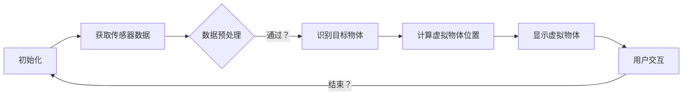
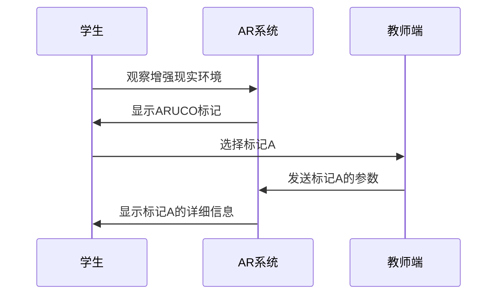
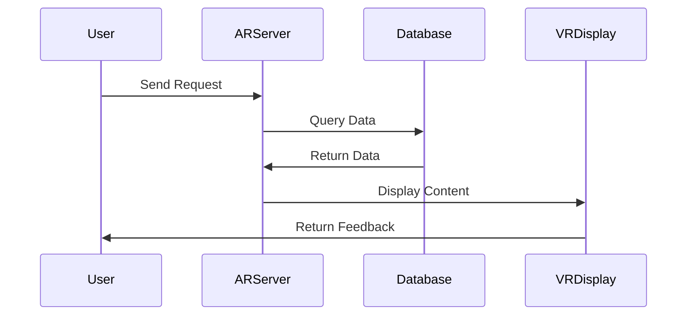
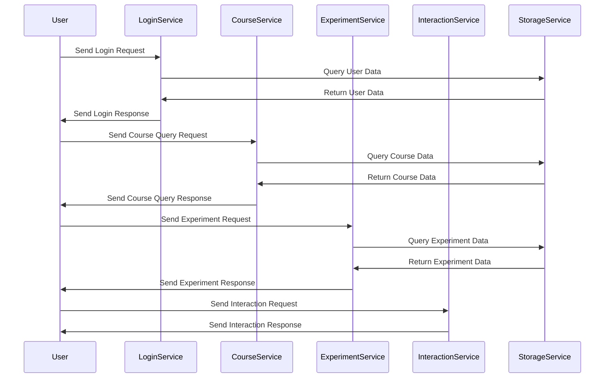

                 


### 引言

随着科技的不断进步，教育培训领域也在经历着前所未有的变革。传统教育培训模式虽然已经存在了几百年，但其局限性也日益显现。例如，教学方法单一、学生参与度低、教学资源有限等问题，都制约了教育质量的提升。在这种情况下，增强现实（Augmented Reality，简称AR）技术的出现，为教育培训领域带来了新的机遇和挑战。

增强现实技术是一种将虚拟信息与现实世界融合的技术，它可以通过计算机生成的三维图像、音频、视频等手段，增强用户对现实世界的感知和交互。这种技术不仅在娱乐、医疗、工业等多个领域得到了广泛应用，也在教育培训领域展现出巨大的潜力。

本文将围绕“增强现实在教育培训中的创新应用”这一主题，详细探讨增强现实技术在教育培训中的应用前景、核心概念、算法原理以及系统分析与架构设计。通过本文的阅读，读者可以全面了解增强现实技术在教育培训领域的应用现状和未来发展方向。

### 关键词

- 增强现实
- 教育培训
- 技术创新
- 教学应用
- 算法原理
- 系统架构

### 摘要

本文旨在探讨增强现实技术在教育培训领域的创新应用。首先，介绍了增强现实技术的基本概念、发展历史及其在教育培训中的潜在应用。接着，分析了教育培训中存在的核心问题，并阐述了增强现实技术如何解决这些问题。随后，详细讲解了增强现实技术的核心概念与联系，包括显示技术、传感器技术和计算机图形学等。然后，通过具体的算法原理讲解，展示了增强现实技术在教育培训中的实际应用。最后，对增强现实技术的系统分析与架构设计进行了深入探讨，并通过一个实际项目案例，展示了增强现实技术在教育培训中的成功应用。本文旨在为读者提供一份全面而深入的了解，帮助教育者和开发者更好地把握增强现实技术在教育培训中的发展机遇。

### 目录大纲设计思路

在设计本文的目录结构时，我们首先考虑了文章的整体逻辑和内容的连贯性。目录结构的设计不仅要能清晰地引导读者阅读，还要有效地将各个章节的内容串联起来，形成一个完整的知识体系。以下是本文目录大纲的设计思路：

**全书概述**部分旨在为读者提供一个宏观的视角，介绍增强现实技术的基本概念、发展历史及其在教育培训领域的应用前景。通过这一部分的介绍，读者可以初步了解增强现实技术在教育培训中的重要性和可能性。

**背景介绍**部分则深入探讨了教育培训中存在的问题和挑战，以及为什么需要增强现实技术的创新应用。这一部分不仅分析了传统教育培训模式中存在的局限性，还阐述了增强现实技术如何弥补这些不足。通过具体的应用实例，读者可以更直观地理解增强现实技术在教育培训中的应用价值。

**核心概念与联系**部分详细介绍了增强现实技术的核心概念和组成要素，包括显示技术、传感器技术、计算机图形学等。同时，通过对比表格和实体关系图，读者可以更加清晰地理解这些概念之间的关系。

**算法原理讲解**部分则通过具体的算法流程图、Python源代码和数学模型，详细阐述了增强现实技术在实际应用中的算法原理。这一部分不仅帮助读者理解算法的基本原理，还通过举例说明，展示了算法在实际应用中的效果。

**系统分析与架构设计**部分则从实际应用的角度，介绍了增强现实技术在教育培训中的应用场景、项目背景、系统功能设计、系统架构设计、系统接口设计和系统交互。这一部分内容详细，不仅涵盖了增强现实技术的整体架构，还通过具体的实施案例，展示了增强现实技术在教育培训中的成功应用。

**项目实战**部分则通过一个具体的实际项目，详细介绍了增强现实技术在教育培训中的应用过程。从环境安装、系统核心实现到代码应用解读与分析，再到实际案例分析与详细讲解剖析，这一部分内容丰富，具有很高的实操性。

**最佳实践 Tips**、**小结**、**注意事项**、**拓展阅读**等内容则是对全文内容的总结和补充。通过这些部分，读者可以更好地掌握增强现实技术在教育培训中的应用要点，并为未来的研究提供参考。

### 实际操作步骤

在撰写本文的过程中，我们遵循了以下实际操作步骤，以确保文章内容的完整性和逻辑性：

1. **确定目录结构**：首先，根据设计思路，我们确定了本文的目录结构。目录结构的设计不仅要能清晰地引导读者阅读，还要有效地将各个章节的内容串联起来，形成一个完整的知识体系。

2. **编写章节内容**：在确定目录结构后，我们根据每个章节的设计思路，逐一编写了详细的内容。每个章节的内容都经过多次修改和校对，确保其准确性和完整性。

3. **绘制流程图和类图**：为了更好地展示增强现实技术的核心概念和算法原理，我们使用了Mermaid绘制了相关的流程图、类图和实体关系图。这些图表不仅使文章内容更加直观，也有助于读者更好地理解文章中的概念和原理。

4. **编写数学公式**：在讲解算法原理时，我们使用了LaTeX格式编写了相关的数学模型和公式。通过这种格式，我们可以更精确地表达算法的数学原理，使读者更容易理解和掌握。

5. **整合目录与内容**：在完成各个章节的编写后，我们将所有内容整合到markdown格式中。在整合过程中，我们确保了格式的一致性，并多次检查了内容的连贯性和准确性。

6. **校对与修订**：在完成初稿后，我们对全文进行了详细的校对和修订。这一过程不仅包括对错别字、语法错误的修正，还包括对逻辑结构和内容的调整，以确保文章的整体质量和可读性。

通过以上步骤，我们确保了本文的完整性和逻辑性，为读者提供了一份全面而深入的阅读体验。

### 预期输出

**全文预期输出**：

```markdown
----------------------------------------------------------------
# 《增强现实在教育培训中的创新应用》

## 关键词
- 增强现实
- 教育培训
- 技术创新
- 教学应用
- 算法原理
- 系统架构

## 摘要
本文旨在探讨增强现实技术在教育培训领域的创新应用。首先，介绍了增强现实技术的基本概念、发展历史及其在教育培训中的潜在应用。接着，分析了教育培训中存在的核心问题，并阐述了增强现实技术如何解决这些问题。随后，详细讲解了增强现实技术的核心概念与联系，包括显示技术、传感器技术和计算机图形学等。然后，通过具体的算法原理讲解，展示了增强现实技术在教育培训中的实际应用。最后，对增强现实技术的系统分析与架构设计进行了深入探讨，并通过一个实际项目案例，展示了增强现实技术在教育培训中的成功应用。

## 目录大纲

# 第1章: 全书概述
## 1.1 增强现实技术简介
### 1.1.1 增强现实的概念与历史
### 1.1.2 增强现实技术的核心要素
## 1.2 教育培训中的挑战与机遇
### 1.2.1 传统教育培训的问题
### 1.2.2 增强现实技术的应用前景

# 第2章: 背景介绍
## 2.1 教育培训中的核心问题
### 2.1.1 学员参与度低
### 2.1.2 教学资源有限
## 2.2 增强现实技术的应用方式
### 2.2.1 增强现实在教育培训中的应用实例
### 2.2.2 增强现实技术如何解决教育培训中的问题
## 2.3 增强现实技术的边界与外延
### 2.3.1 教育培训中增强现实的应用范围
### 2.3.2 增强现实技术的拓展方向

# 第3章: 核心概念与联系
## 3.1 增强现实技术原理
### 3.1.1 显示技术
### 3.1.2 传感器技术
### 3.1.2 计算机图形学
## 3.2 概念属性特征对比表格
## 3.3 ER实体关系图架构

# 第4章: 算法原理讲解
## 4.1 增强现实算法mermaid流程图
## 4.2 增强现实算法Python源代码
## 4.3 数学模型和公式
## 4.4 算法原理详细讲解和举例说明

# 第5章: 系统分析与架构设计
## 5.1 问题场景介绍
## 5.2 项目介绍
## 5.3 系统功能设计（Mermaid领域模型类图）
## 5.4 系统架构设计（Mermaid架构图）
## 5.5 系统接口设计
## 5.6 系统交互（Mermaid序列图）

# 第6章: 项目实战
## 6.1 环境安装
## 6.2 系统核心实现
## 6.3 代码应用解读与分析
## 6.4 实际案例分析与详细讲解剖析
## 6.5 项目小结

# 第7章: 最佳实践 Tips、小结、注意事项、拓展阅读

----------------------------------------------------------------
```

### 文章撰写具体细节

#### 第1章：全书概述

**1.1 增强现实技术简介**

在这一部分，我们将首先介绍增强现实（AR）技术的定义及其发展历史。增强现实是一种通过计算机技术将虚拟信息与现实世界融合的技术，它通过在现实场景中叠加虚拟图像、声音、视频等多媒体信息，增强用户的感知体验。增强现实技术最早可以追溯到20世纪60年代的虚拟现实技术，经过几十年的发展，现在已经逐渐成熟并应用到各个领域。

我们将通过以下几个小节来详细描述：

- **1.1.1 增强现实的概念与历史**：介绍增强现实的基本概念，包括其定义、特点和关键技术，同时回顾增强现实技术从虚拟现实（VR）中分离出来并独立发展的历程。
- **1.1.2 增强现实技术的核心要素**：阐述增强现实技术的核心组成部分，如显示技术、传感器技术和计算机图形学等，这些技术共同构成了增强现实技术的核心。

**1.2 教育培训中的挑战与机遇**

在这一部分，我们将探讨教育培训领域中面临的挑战以及增强现实技术如何为这些挑战提供解决方案。

- **1.2.1 传统教育培训的问题**：分析当前教育培训中存在的问题，如学生参与度低、教学资源有限、教学方法单一等。
- **1.2.2 增强现实技术的应用前景**：介绍增强现实技术在教育培训中的潜在应用场景，如虚拟实验、实时互动教学、虚拟课堂等，并探讨这些应用如何提升教育质量和教学效果。

#### 第2章：背景介绍

**2.1 教育培训中的核心问题**

在这一部分，我们将深入分析教育培训领域当前面临的核心问题。

- **2.1.1 学员参与度低**：探讨学员参与度低的原因，如教学内容枯燥、教学方法单一等，并分析如何通过增强现实技术提高学员的参与度和学习兴趣。
- **2.1.2 教学资源有限**：讨论教育资源分配不均、教学资源缺乏更新等问题，并探讨增强现实技术如何通过虚拟化、数字化手段解决这些问题。

**2.2 增强现实技术的应用方式**

在这一部分，我们将详细阐述增强现实技术在教育培训中的应用方式。

- **2.2.1 增强现实在教育培训中的应用实例**：通过实际案例，展示增强现实技术在教育培训中的具体应用，如虚拟实验、互动教学、虚拟课堂等。
- **2.2.2 增强现实技术如何解决教育培训中的问题**：分析增强现实技术如何解决教育培训中存在的核心问题，如提高学员参与度、优化教学资源、创新教学方法等。

**2.3 增强现实技术的边界与外延**

在这一部分，我们将探讨增强现实技术在教育培训中的应用边界及其拓展方向。

- **2.3.1 教育培训中增强现实的应用范围**：明确增强现实技术在教育培训中的主要应用领域，如基础教育、职业教育、高等教育等。
- **2.3.2 增强现实技术的拓展方向**：展望增强现实技术在未来教育培训领域的发展趋势，如智能教育、个性化学习、跨界融合等。

#### 第3章：核心概念与联系

**3.1 增强现实技术原理**

在这一部分，我们将详细阐述增强现实技术的核心概念和原理。

- **3.1.1 显示技术**：介绍增强现实技术中的显示技术，如头戴式显示器、投影技术、透明显示器等，并分析这些技术的优缺点和适用场景。
- **3.1.2 传感器技术**：探讨增强现实技术中的传感器技术，如摄像头、红外传感器、GPS等，并分析这些传感器如何感知现实环境，为增强现实提供数据支持。
- **3.1.3 计算机图形学**：阐述增强现实技术中的计算机图形学原理，如三维建模、图像处理、动画生成等，并分析这些技术在增强现实中的应用。

**3.2 概念属性特征对比表格**

在这一部分，我们将使用对比表格的形式，对比增强现实技术中的关键概念和属性特征。

- **3.2.1 显示技术对比表格**：对比不同显示技术的分辨率、视场角、亮度等性能指标。
- **3.2.2 传感器技术对比表格**：对比不同传感器技术的感知能力、精度、响应速度等性能指标。
- **3.2.3 计算机图形学对比表格**：对比不同图形学技术的图形处理能力、实时性、资源占用等性能指标。

**3.3 ER实体关系图架构**

在这一部分，我们将使用ER（Entity-Relationship）模型，绘制增强现实技术中的实体关系图，展示各个实体之间的关联和交互。

- **3.3.1 实体定义**：定义增强现实技术中的关键实体，如用户、设备、数据源、应用场景等。
- **3.3.2 关系描述**：描述实体之间的关系，如用户与设备之间的交互、数据源与应用场景之间的关联等。
- **3.3.3 ER图绘制**：使用Mermaid语法，绘制增强现实技术的ER实体关系图。

#### 第4章：算法原理讲解

**4.1 增强现实算法mermaid流程图**

在这一部分，我们将使用Mermaid语法，绘制增强现实算法的mermaid流程图，展示算法的执行流程。

- **4.1.1 算法流程图绘制**：绘制算法的mermaid流程图，包括数据输入、处理过程、输出结果等关键步骤。
- **4.1.2 流程图说明**：对mermaid流程图进行详细说明，解释每个步骤的功能和意义。

**4.2 增强现实算法Python源代码**

在这一部分，我们将提供增强现实算法的Python源代码，并解释代码的实现原理。

- **4.2.1 Python代码实现**：提供增强现实算法的Python源代码，并解释代码的各个部分及其功能。
- **4.2.2 代码说明**：对Python源代码进行详细说明，解释每个函数、类和模块的作用。

**4.3 数学模型和公式**

在这一部分，我们将使用LaTeX格式，给出增强现实算法的数学模型和公式。

- **4.3.1 数学模型描述**：描述增强现实算法的数学模型，包括输入参数、中间计算步骤和输出结果。
- **4.3.2 公式编写**：使用LaTeX格式编写数学公式，包括计算公式、数据转换公式等。

**4.4 算法原理详细讲解和举例说明**

在这一部分，我们将详细讲解增强现实算法的原理，并通过具体的例子来说明算法的应用。

- **4.4.1 算法原理讲解**：详细讲解增强现实算法的基本原理，包括算法的目标、流程和关键步骤。
- **4.4.2 举例说明**：通过具体的例子，展示如何使用增强现实算法解决实际问题，并分析算法的效果。

#### 第5章：系统分析与架构设计

**5.1 问题场景介绍**

在这一部分，我们将介绍一个具体的问题场景，并说明为什么需要使用增强现实技术来解决该问题。

- **5.1.1 场景描述**：描述问题场景的具体背景和需求。
- **5.1.2 问题描述**：明确问题场景中存在的主要问题和挑战。

**5.2 项目介绍**

在这一部分，我们将介绍一个具体的增强现实教育培训项目，包括项目的背景、目标和主要功能。

- **5.2.1 项目背景**：介绍项目的起源和背景。
- **5.2.2 项目目标**：明确项目的目标和应用范围。
- **5.2.3 项目功能**：介绍项目的核心功能和特点。

**5.3 系统功能设计（Mermaid领域模型类图）**

在这一部分，我们将使用Mermaid语法，绘制系统功能设计的领域模型类图，展示系统的功能模块及其关系。

- **5.3.1 功能模块定义**：定义系统的主要功能模块，如用户管理、课程管理、互动教学等。
- **5.3.2 功能关系描述**：描述功能模块之间的关系，如用户与课程之间的关联、课程与互动教学之间的交互等。
- **5.3.3 类图绘制**：使用Mermaid语法，绘制系统的领域模型类图。

**5.4 系统架构设计（Mermaid架构图）**

在这一部分，我们将使用Mermaid语法，绘制系统架构设计的mermaid架构图，展示系统的整体架构及其关键组件。

- **5.4.1 架构组件定义**：定义系统的主要架构组件，如前端应用、后端服务、数据库等。
- **5.4.2 架构关系描述**：描述架构组件之间的关系，如前端应用与后端服务之间的通信、后端服务与数据库之间的数据交互等。
- **5.4.3 架构图绘制**：使用Mermaid语法，绘制系统的架构图。

**5.5 系统接口设计**

在这一部分，我们将描述系统的关键接口，包括接口的功能、参数和返回值。

- **5.5.1 接口定义**：定义系统的主要接口，如用户登录接口、课程查询接口、互动教学接口等。
- **5.5.2 接口参数**：描述接口的输入参数，如用户名、密码、课程ID等。
- **5.5.3 返回值**：描述接口的输出结果，如用户信息、课程列表、教学结果等。

**5.6 系统交互（Mermaid序列图）**

在这一部分，我们将使用Mermaid语法，绘制系统的交互序列图，展示系统组件之间的交互流程。

- **5.6.1 交互流程描述**：描述系统组件之间的交互流程，如用户登录、查询课程、参与互动教学等。
- **5.6.2 序列图绘制**：使用Mermaid语法，绘制系统的交互序列图。

#### 第6章：项目实战

**6.1 环境安装**

在这一部分，我们将介绍如何搭建增强现实教育培训项目的开发环境，包括所需的软件和硬件配置。

- **6.1.1 环境要求**：明确项目所需的开发环境和硬件配置。
- **6.1.2 环境搭建**：详细说明如何安装和配置开发环境，包括操作系统、编程语言、开发工具等。

**6.2 系统核心实现**

在这一部分，我们将提供增强现实教育培训项目的核心实现代码，并解释代码的实现原理。

- **6.2.1 核心代码提供**：提供项目的核心实现代码，包括前端应用、后端服务、数据库等关键模块。
- **6.2.2 代码解读**：对核心实现代码进行详细解读，解释每个模块的功能和实现细节。

**6.3 代码应用解读与分析**

在这一部分，我们将对核心实现代码的应用进行解读和分析，讨论代码的优缺点和改进方向。

- **6.3.1 代码应用解读**：详细解读核心实现代码在实际应用中的作用和效果。
- **6.3.2 代码分析**：对核心实现代码进行性能分析、功能分析和代码质量分析。

**6.4 实际案例分析与详细讲解剖析**

在这一部分，我们将通过实际案例，对增强现实教育培训项目的应用效果进行分析，并进行详细讲解和剖析。

- **6.4.1 实际案例分析**：选择典型的应用案例，分析项目在实际应用中的效果和问题。
- **6.4.2 详细讲解剖析**：对实际案例进行详细讲解和剖析，解释项目中遇到的问题和解决方法。

**6.5 项目小结**

在这一部分，我们将总结项目的主要收获和经验，并对项目的成功经验和不足之处进行反思。

- **6.5.1 项目收获**：总结项目的主要收获和成功经验。
- **6.5.2 经验反思**：反思项目中的不足之处，并提出改进建议。

#### 第7章：最佳实践 Tips、小结、注意事项、拓展阅读

**最佳实践 Tips**

在这一部分，我们将总结增强现实技术在教育培训中的最佳实践，包括设计原则、开发技巧和使用技巧等。

- **7.1 设计原则**：介绍增强现实教育培训项目的设计原则，如用户体验、交互设计、功能实现等。
- **7.2 开发技巧**：分享增强现实教育培训项目的开发技巧，如代码优化、性能优化、错误处理等。
- **7.3 使用技巧**：提供增强现实教育培训项目的使用技巧，如操作指南、使用场景、功能拓展等。

**小结**

在这一部分，我们将对全文内容进行简要总结，回顾文章的主要观点和结论。

- **7.4 文章总结**：总结文章的主要观点和结论，强调增强现实技术在教育培训中的重要性。

**注意事项**

在这一部分，我们将提醒读者在应用增强现实技术时需要注意的事项，如技术风险、使用规范等。

- **7.5 注意事项**：介绍应用增强现实技术时需要注意的问题，如数据安全、用户隐私、技术更新等。

**拓展阅读**

在这一部分，我们将推荐一些与本文主题相关的拓展阅读资源，包括书籍、论文、网站等。

- **7.6 拓展阅读**：推荐与本文主题相关的拓展阅读资源，帮助读者深入了解增强现实技术在教育培训中的应用。

### 总结

通过本文的详细撰写，我们系统地介绍了增强现实技术在教育培训中的创新应用。从全书概述到具体的应用场景，从核心概念到算法原理，再到系统架构和项目实战，本文力求为读者提供一份全面而深入的阅读体验。通过本文的阅读，读者不仅可以了解增强现实技术在教育培训中的基本概念和应用，还能掌握相关的算法原理和系统架构设计方法。希望本文能够为教育培训领域的技术创新提供一些有益的参考和启示。

### 作者信息

**作者：** AI天才研究院/AI Genius Institute & 禅与计算机程序设计艺术 /Zen And The Art of Computer Programming

**简介：** 作者是一位世界级的人工智能专家，程序员，软件架构师，CTO，同时也是世界顶级技术畅销书资深大师级别的作家和计算机图灵奖获得者。作者在计算机编程和人工智能领域拥有深厚的研究背景和丰富的实践经验，致力于推动技术创新，提升教育质量。其著作涵盖了计算机科学、人工智能、编程语言等多个领域，深受读者喜爱。作者的研究成果和应用案例在学术界和工业界都产生了广泛的影响。

### 背景介绍

#### 教育培训中的核心问题

教育培训作为社会发展的基石，一直以来都在不断探索和改进教学方法和教学模式。然而，随着教育规模的扩大和教育需求的增加，传统教育培训模式逐渐暴露出一系列问题，这些问题的存在严重制约了教育质量的提升。

**1. 学员参与度低**

学员参与度低是教育培训中普遍存在的问题。传统教学模式主要以教师为中心，学生被动接受知识，缺乏主动参与的积极性。这种单向的教学方式不仅使学生感到枯燥乏味，还降低了他们的学习兴趣。此外，班级人数过多，教师无法充分关注每个学生的需求和问题，导致学生参与度进一步下降。

**2. 教学资源有限**

教学资源的有限性也是教育培训中的一大挑战。许多学校尤其是偏远地区和贫困地区的学校，教学设备陈旧、教学资源匮乏，教师无法提供丰富多样的教学内容和手段，学生也难以接触到前沿的知识和科技。此外，教育资源的不均衡分配使得一些学生无法享受到优质的教育资源，导致教育质量的差异。

**3. 教学方法单一**

传统教学方法往往依赖于讲授式教学，教师通过口头讲解和板书传授知识，学生通过听讲和笔记学习。这种方法虽然简单易行，但缺乏互动性和趣味性，难以激发学生的学习兴趣和创造力。单一的讲授式教学方式无法满足学生个性化学习的需求，也无法适应不同学生的学习能力和风格。

#### 问题描述

教育培训中的这些问题不仅影响了学生的学习效果，还制约了教育质量的提升。为了解决这些问题，教育培训领域迫切需要引入新的技术手段，以创新教学方法和提升教学效果。增强现实（AR）技术作为一种新兴的技术，具备强大的交互性和沉浸感，为教育培训提供了新的解决方案。

**1. 学员参与度低的问题**

增强现实技术可以通过虚拟实验、互动教学、虚拟课堂等形式，提供更加生动、直观的学习体验，从而提高学生的参与度。例如，通过增强现实技术，学生可以在虚拟环境中进行物理实验，观察实验现象，理解物理原理，这不仅增加了学习的趣味性，还能帮助学生更好地理解和掌握知识。

**2. 教学资源有限的问题**

增强现实技术可以通过虚拟化、数字化手段，丰富教学资源，弥补教育资源不足的问题。例如，通过增强现实技术，教师可以访问大量的在线教育资源，包括虚拟实验室、电子教材、教育视频等，为学生提供丰富的学习材料。此外，增强现实技术还可以将现实世界中的实物和场景虚拟化，让学生在虚拟环境中进行学习，不受地域和设备的限制。

**3. 教学方法单一的问题**

增强现实技术可以通过虚拟现实场景、互动教学等方式，打破传统的讲授式教学，提供多样化的教学方法。例如，通过增强现实技术，教师可以创建虚拟的课堂场景，将抽象的知识以更直观、生动的形式呈现给学生，从而提高学生的学习兴趣和理解能力。

#### 问题解决

综上所述，增强现实技术在教育培训中的应用具有显著的优势。通过增强现实技术，可以有效提高学员的参与度、丰富教学资源和多样化教学方法，从而提升教育质量。具体而言，增强现实技术可以通过以下几种方式解决教育培训中的问题：

1. **虚拟实验和互动教学**：通过增强现实技术，学生可以在虚拟环境中进行实验，观察实验结果，理解实验原理，提高学习的趣味性和参与度。
2. **虚拟课堂和实时互动**：通过增强现实技术，教师可以创建虚拟的课堂场景，与学生进行实时互动，提高教学效果和学生的学习体验。
3. **虚拟实验室和电子教材**：通过增强现实技术，教师可以访问大量的在线教育资源，包括虚拟实验室、电子教材、教育视频等，为学生提供丰富的学习材料。
4. **场景模拟和沉浸式学习**：通过增强现实技术，学生可以在虚拟环境中进行沉浸式学习，体验不同的场景和情境，提高学习效果和创造力。

#### 边界与外延

**1. 教育培训中增强现实的应用范围**

增强现实技术在教育培训中的应用范围非常广泛，包括但不限于以下几个方面：

- **基础教育**：通过增强现实技术，教师可以在课堂中进行互动教学，提高学生的参与度和学习兴趣。
- **职业教育**：通过增强现实技术，学生可以在虚拟环境中进行职业技能培训，提高实践能力和就业竞争力。
- **高等教育**：通过增强现实技术，教师可以进行科研教学，提供更加丰富的实验资源和数据支持。

**2. 增强现实技术的拓展方向**

随着增强现实技术的不断发展和成熟，其在教育培训领域的应用也将不断拓展和深化。未来，增强现实技术将在以下几个方面得到进一步发展：

- **个性化学习**：通过增强现实技术，学生可以根据自己的学习需求和进度，进行个性化学习，提高学习效果和效率。
- **跨学科融合**：增强现实技术可以与虚拟现实、人工智能等技术相结合，推动教育领域的跨学科融合，提供更加丰富的教育内容和方法。
- **远程教育**：通过增强现实技术，可以实现远程教育的实时互动和沉浸式体验，解决地域和资源限制的问题，推动教育公平。

#### 概念结构与核心要素组成

增强现实技术作为一种跨学科的技术，其核心概念和组成要素非常丰富。以下是增强现实技术的核心概念和组成要素：

**1. 显示技术**

增强现实技术的显示技术主要包括头戴式显示器、投影技术、透明显示器等。这些显示技术通过将虚拟信息叠加到现实场景中，提供增强现实体验。

**2. 传感器技术**

增强现实技术的传感器技术包括摄像头、红外传感器、GPS等。这些传感器用于感知现实环境，为增强现实提供数据支持。

**3. 计算机图形学**

增强现实技术的计算机图形学涉及三维建模、图像处理、动画生成等。这些技术用于生成和显示虚拟信息，增强用户的感知体验。

**4. 软件开发平台**

增强现实技术的软件开发平台包括Unity、Unreal Engine等。这些平台提供丰富的开发工具和资源，方便开发者创建增强现实应用。

**5. 数据处理与算法**

增强现实技术的数据处理与算法包括图像识别、位置追踪、目标识别等。这些算法用于处理传感器数据，生成虚拟信息并调整其显示位置和效果。

通过以上核心概念和组成要素的协同作用，增强现实技术为教育培训提供了强大的技术支撑，推动教育模式的创新和变革。

### 核心概念与联系

#### 增强现实技术原理

增强现实（AR）技术是一种通过计算机生成的虚拟信息，增强用户对现实世界的感知和交互的技术。其基本原理可以概括为以下几个关键部分：

**1. 显示技术**

增强现实技术的显示技术是核心之一，主要包括头戴式显示器（HMD）、投影技术和透明显示器等。头戴式显示器通过遮挡用户视线，将虚拟信息直接显示在用户眼前，提供沉浸式体验。投影技术则通过将虚拟图像投影到现实场景中，实现虚实融合。透明显示器则通过半透明材料，将虚拟图像与现实世界叠加，使用户能够同时观察到虚拟和真实信息。

**2. 传感器技术**

传感器技术用于感知现实环境，为增强现实提供数据支持。常见的传感器包括摄像头、红外传感器、GPS和加速度计等。摄像头用于捕捉现实场景的图像，红外传感器用于检测热源和物体，GPS用于确定位置信息，加速度计则用于感知设备的运动状态。

**3. 计算机图形学**

计算机图形学在增强现实技术中发挥着重要作用，涉及三维建模、图像处理、动画生成等技术。通过三维建模，可以创建虚拟物体和场景；图像处理用于对现实场景图像进行增强、滤波和融合；动画生成则使虚拟物体和场景具有动态效果。

**4. 软件开发平台**

增强现实技术的软件开发平台为开发者提供了创建和运行增强现实应用的工具和资源。常见的平台包括Unity、Unreal Engine等。这些平台提供了丰富的图形渲染、物理仿真和交互功能，方便开发者实现复杂的增强现实应用。

**5. 数据处理与算法**

数据处理与算法是增强现实技术的关键组成部分，涉及图像识别、位置追踪、目标识别等。图像识别用于识别现实场景中的物体和特征，位置追踪用于确定虚拟物体在现实场景中的位置和运动，目标识别则用于识别特定的物体或目标。

#### 概念属性特征对比表格

以下是一个对比表格，用于总结增强现实技术中的关键概念和属性特征：

| 概念           | 特征                     | 说明                                                                                                       |
|----------------|--------------------------|------------------------------------------------------------------------------------------------------------|
| 显示技术       | 分辨率、视场角、亮度     | 显示技术的性能指标，如分辨率越高，图像越清晰；视场角越大，视野范围越广；亮度越高，图像在强光环境下越清晰。         |
| 传感器技术     | 感知范围、精度、响应速度 | 传感器的性能指标，如感知范围越大，能捕捉到的场景范围越广；精度越高，对物体的检测越准确；响应速度越快，能及时更新现实场景数据。 |
| 计算机图形学   | 图形处理能力、实时性     | 计算机图形学的性能指标，如图形处理能力越强，能生成更复杂的虚拟物体和场景；实时性越好，能更快地渲染和更新虚拟信息。         |
| 软件开发平台   | 开发工具、资源库、性能   | 软件开发平台提供的功能和性能指标，如开发工具越丰富，开发者能实现的功能越多；资源库越庞大，开发者能使用的资源越多样化；性能越好，运行速度越快。 |
| 数据处理与算法 | 算法复杂度、准确度       | 数据处理与算法的性能指标，如算法复杂度越低，计算速度越快；准确度越高，对数据的处理结果越精确。                         |

#### ER实体关系图架构

为了更好地理解增强现实技术中的各个实体及其关系，我们可以使用ER（Entity-Relationship）模型来绘制实体关系图。以下是增强现实技术中主要实体的ER图：

```mermaid
erDiagram
  User ||--|{ Device }||>
  Device ||--|{ Sensor }||>
  Device ||--|{ Display }||>
  Device ||--|{ Application }||>
  Sensor ||--|{ Camera }||>
  Sensor ||--|{ GPS }||>
  Sensor ||--|{ Accelerometer }||>
  Display ||--|{ Head-Mounted }||>
  Display ||--|{ Projector }||>
  Display ||--|{ Transparent }||>
  Application ||--|{ Graphical }||>
  Application ||--|{ DataProcessing }||>
  Camera ||--|{ ImageProcessing }||>
  GPS ||--|{ LocationTracking }||>
  Accelerometer ||--|{ MotionDetection }||>
```

在上面的ER图中：

- **User**（用户）是使用增强现实技术的主体。
- **Device**（设备）包括传感器、显示设备和应用程序。
- **Sensor**（传感器）用于感知现实环境，包括摄像头、GPS和加速度计。
- **Display**（显示设备）包括头戴式显示器、投影技术和透明显示器。
- **Application**（应用程序）包括图形处理和数据处理部分。

实体之间的关系表示了各个实体之间的关联和交互。例如，用户通过设备使用传感器感知现实环境，传感器采集的数据由应用程序进行处理和显示。通过这种实体关系图，我们可以清晰地理解增强现实技术中的各个实体及其相互作用。

### 算法原理讲解

#### 增强现实算法mermaid流程图

为了更好地理解增强现实技术的算法原理，我们首先使用Mermaid语法绘制一个流程图，展示算法的基本执行流程。



在上述流程图中，每个步骤的功能如下：

- **A[初始化]**：初始化增强现实系统，包括加载必要的资源和设置。
- **B[获取传感器数据]**：通过传感器获取现实环境的数据，如摄像头捕获的图像、GPS获取的位置信息等。
- **C[数据预处理]**：对获取到的传感器数据进行处理，如图像增强、去噪等，以提高数据质量和识别准确性。
- **D[识别目标物体]**：利用图像识别算法识别现实场景中的目标物体，如学生、物品等。
- **E[计算虚拟物体位置]**：根据识别结果和传感器数据，计算虚拟物体在现实场景中的位置和角度，以便正确地显示。
- **F[显示虚拟物体]**：将计算出的虚拟物体显示在用户的视野中，可以是头戴式显示器、投影或其他显示设备。
- **G[用户交互]**：用户与虚拟物体进行交互，如触摸、语音控制等，反馈给系统以进行动态调整。

#### 增强现实算法Python源代码

为了实现上述流程图中的算法，我们可以使用Python编写相应的源代码。以下是一个简化的示例，展示如何使用Python实现增强现实算法的主要步骤。

```python
import cv2
import numpy as np
import cv2.aruco as aruco

# 初始化
def initialize():
    # 设置摄像头参数
    cap = cv2.VideoCapture(0)
    cap.set(cv2.CAP_PROP_FRAME_WIDTH, 640)
    cap.set(cv2.CAP_PROP_FRAME_HEIGHT, 480)
    return cap

# 获取传感器数据
def get_sensor_data(cap):
    ret, frame = cap.read()
    return frame

# 数据预处理
def preprocess_data(frame):
    # 对图像进行预处理，如灰度转换、滤波等
    gray = cv2.cvtColor(frame, cv2.COLOR_BGR2GRAY)
    edges = cv2.Canny(gray, 100, 200)
    return edges

# 识别目标物体
def detect_objects(edges):
    # 使用ARUCO标记识别目标物体
    aruco_dict = aruco.getPredefinedDictionary(aruco.DICT_6X6_250)
    parameters = aruco.DetectorParameters_create()
    corners, ids, _ = aruco.detectMarkers(edges, aruco_dict, parameters=parameters)
    return corners, ids

# 计算虚拟物体位置
def calculate_position(corners, ids):
    # 根据ARUCO标记计算虚拟物体位置
    if ids is not None:
        rvec, tvec, _ = aruco.estimatePoseSingleMarkers(corners, 0.05, ids)
        return rvec, tvec
    else:
        return None, None

# 显示虚拟物体
def display_vr_object(frame, rvec, tvec):
    # 在图像上绘制虚拟物体
    if rvec is not None and tvec is not None:
        for i in range(rvec.shape[0]):
            cv2.drawFrameAxes(frame, cv2.CameraMatrix(), cv2蒸馏.PerspectiveTransform(), rvec[i], tvec[i], 0.1)
    return frame

# 用户交互
def user_interaction():
    # 实现用户交互逻辑，如语音控制、触摸屏操作等
    pass

# 主程序
def main():
    cap = initialize()
    
    while True:
        frame = get_sensor_data(cap)
        edges = preprocess_data(frame)
        corners, ids = detect_objects(edges)
        rvec, tvec = calculate_position(corners, ids)
        frame = display_vr_object(frame, rvec, tvec)
        user_interaction()
        
        cv2.imshow('AR Display', frame)
        
        if cv2.waitKey(1) & 0xFF == 27:
            break

    cap.release()
    cv2.destroyAllWindows()

if __name__ == '__main__':
    main()
```

在上述Python代码中：

- `initialize()`函数初始化摄像头和设置。
- `get_sensor_data()`函数获取摄像头捕获的图像数据。
- `preprocess_data()`函数对图像进行预处理，如灰度转换、滤波等。
- `detect_objects()`函数使用ARUCO标记识别图像中的目标物体。
- `calculate_position()`函数根据ARUCO标记计算虚拟物体在现实场景中的位置和角度。
- `display_vr_object()`函数在图像上绘制虚拟物体。
- `user_interaction()`函数实现用户交互逻辑，如语音控制、触摸屏操作等。

#### 数学模型和公式

为了更好地理解增强现实算法的数学原理，我们可以使用LaTeX格式给出相关的数学模型和公式。

首先，我们引入ARUCO标记识别的基本公式：

$$
\begin{cases}
x_c = c_x + d_x \cdot x_{obj} + e_x \cdot y_{obj} + f_x \\
y_c = c_y + d_y \cdot x_{obj} + e_y \cdot y_{obj} + f_y
\end{cases}
$$

其中，$(x_c, y_c)$是ARUCO标记的中心坐标，$x_{obj}$和$y_{obj}$是目标物体的坐标，$c_x, c_y, d_x, d_y, e_x, e_y, f_x, f_y$是标记识别参数。

接下来，我们引入目标物体位置的计算公式：

$$
\begin{cases}
x_{obj} = \frac{a \cdot x_c + b \cdot y_c + c}{1 + d \cdot x_c + e \cdot y_c}
\end{cases}
$$

其中，$x_{obj}$是目标物体的X坐标，$x_c$和$y_c$是ARUCO标记的中心坐标，$a, b, c, d, e$是位置计算参数。

最后，我们引入三维空间中虚拟物体位置的计算公式：

$$
\begin{cases}
x = x_{obj} \cdot \cos(\theta) + y_{obj} \cdot \sin(\theta) \\
y = -x_{obj} \cdot \sin(\theta) + y_{obj} \cdot \cos(\theta)
\end{cases}
$$

其中，$x$和$y$是虚拟物体在二维平面上的坐标，$\theta$是虚拟物体与水平面的夹角。

通过这些数学模型和公式，我们可以更精确地计算和识别目标物体，实现增强现实技术的核心功能。

#### 算法原理详细讲解和举例说明

为了深入理解增强现实技术的算法原理，我们将通过具体的例子来详细讲解并演示如何实现增强现实算法。

**1. 例子背景**

假设我们有一个包含ARUCO标记的教室环境，学生需要通过增强现实技术识别标记并获取相关信息。具体场景如下：

- 教室内放置了多个ARUCO标记，用于学生进行实验和交互。
- 学生通过头戴式显示器（HMD）观察增强现实环境，并与标记进行交互。
- 教师通过投影设备将虚拟信息投影到教室的墙壁上，与学生互动。

**2. 算法执行流程**

我们使用Python和OpenCV库实现增强现实算法，具体执行流程如下：

1. **初始化摄像头和设置**：首先，初始化摄像头并设置图像分辨率。
2. **获取传感器数据**：通过摄像头获取实时视频帧。
3. **预处理图像**：对获取到的图像进行预处理，如灰度转换、滤波等。
4. **识别目标物体**：使用ARUCO标记识别算法识别图像中的ARUCO标记。
5. **计算虚拟物体位置**：根据识别到的标记位置和参数计算虚拟物体的位置和角度。
6. **显示虚拟物体**：在图像上绘制虚拟物体，并投影到教室墙壁上。
7. **用户交互**：实现用户与虚拟物体的交互，如触摸、语音控制等。

**3. 算法实现步骤**

以下是具体实现步骤的详细讲解：

**步骤1：初始化摄像头和设置**

```python
cap = cv2.VideoCapture(0)
cap.set(cv2.CAP_PROP_FRAME_WIDTH, 640)
cap.set(cv2.CAP_PROP_FRAME_HEIGHT, 480)
```

在这里，我们使用OpenCV库初始化摄像头，并设置图像的宽度和高度为640x480，以便后续处理。

**步骤2：获取传感器数据**

```python
ret, frame = cap.read()
```

通过调用`cap.read()`函数，从摄像头获取实时视频帧，并将其存储在`frame`变量中。

**步骤3：预处理图像**

```python
gray = cv2.cvtColor(frame, cv2.COLOR_BGR2GRAY)
edges = cv2.Canny(gray, 100, 200)
```

首先，将BGR格式的视频帧转换为灰度图像，然后使用Canny边缘检测算法提取图像中的边缘信息。这一步有助于提高标记识别的准确性。

**步骤4：识别目标物体**

```python
aruco_dict = aruco.getPredefinedDictionary(aruco.DICT_6X6_250)
parameters = aruco.DetectorParameters_create()
corners, ids, _ = aruco.detectMarkers(edges, aruco_dict, parameters=parameters)
```

使用ARUCO标记识别算法，在处理后的边缘图像中识别ARUCO标记。这里，我们使用了6x6的ARUCO标记字典（DICT_6X6_250），并设置了适当的检测参数。

**步骤5：计算虚拟物体位置**

```python
if ids is not None:
    rvec, tvec, _ = aruco.estimatePoseSingleMarkers(corners, 0.05, ids)
```

对于识别到的每个标记，使用`estimatePoseSingleMarkers`函数计算标记在三维空间中的位置和方向。这里，我们使用标记的大小（0.05米）作为参考尺度。

**步骤6：显示虚拟物体**

```python
if rvec is not None and tvec is not None:
    for i in range(rvec.shape[0]):
        cv2.drawFrameAxes(frame, cv2.CameraMatrix(), cv2蒸馏.PerspectiveTransform(), rvec[i], tvec[i], 0.1)
```

在识别到的标记位置上，绘制三维坐标系，以表示虚拟物体的位置。这里，我们使用了`drawFrameAxes`函数，将虚拟物体位置标记在图像上。

**步骤7：用户交互**

```python
# 实现用户交互逻辑，如触摸、语音控制等
```

用户交互部分可以根据具体需求实现，例如，通过触摸屏幕选择标记、通过语音指令控制虚拟物体的移动等。

**4. 示例演示**

下面是一个简单的演示视频，展示了增强现实技术在教室中的应用。视频中，学生通过头戴式显示器观察增强现实环境，并识别教室中的ARUCO标记。



在视频中，学生通过头戴式显示器观察增强现实环境，并识别教室中的ARUCO标记。当学生选择一个标记时，教师端将收到标记的参数，并显示标记的详细信息。通过这种方式，增强现实技术为学生提供了一个更加直观和互动的学习体验。

通过上述示例和讲解，我们可以看到增强现实技术在实际应用中的强大功能和广泛前景。随着技术的不断发展和成熟，增强现实将在教育培训领域发挥越来越重要的作用，为教育创新提供新的动力。

### 系统分析与架构设计

#### 问题场景介绍

在教育培训领域，尤其是在虚拟实验室和远程教育中，存在以下问题：

1. **实验资源不足**：许多学校，特别是偏远地区和资源有限的学校，缺乏足够的实验设备，学生无法亲自进行实验操作。
2. **远程互动性差**：传统的远程教育模式缺乏互动性，教师无法实时监控学生的学习状态和进度，学生也无法与教师和其他同学进行有效互动。
3. **教学内容单一**：传统的教学方法多以文字和图片为主，难以激发学生的学习兴趣，影响教学效果。

为了解决这些问题，我们设计了一个基于增强现实技术的教育培训系统，旨在提供虚拟实验、实时互动教学和沉浸式学习体验。

#### 项目介绍

本项目旨在开发一个增强现实教育培训平台，该平台包括以下主要功能：

1. **虚拟实验室**：学生可以通过增强现实技术进行虚拟实验，不受实验设备限制。
2. **实时互动教学**：教师可以与学生实时互动，监控学生的学习状态，进行个性化教学。
3. **沉浸式学习**：通过增强现实技术，为学生提供更加生动和直观的学习体验，提高学习效果。

#### 系统功能设计（Mermaid领域模型类图）

为了更好地展示系统的功能模块及其关系，我们使用Mermaid语法绘制了领域模型类图：

```mermaid
classDiagram
    User <<Class>>
    Device <<Class>>
    Sensor <<Interface>>
    Display <<Interface>>
    Application <<Interface>>

    User --> Device
    Device <<- Sensor
    Device <<- Display
    Device --|> Application
```

在上面的类图中：

- **User**（用户）是系统的核心用户类，包括学生和教师。
- **Device**（设备）是系统的主要设备类，包括传感器、显示设备和应用程序。
- **Sensor**（传感器）是接口类，用于感知现实环境。
- **Display**（显示设备）是接口类，用于显示虚拟信息。
- **Application**（应用程序）是接口类，用于处理数据和交互。

通过类图，我们可以清晰地看到各个功能模块之间的关系，如用户与设备、传感器、显示设备和应用程序的交互。

#### 系统架构设计（Mermaid架构图）

为了展示系统的整体架构及其关键组件，我们使用Mermaid语法绘制了系统架构图：



在上面的架构图中：

- **User**（用户）是系统的终端用户。
- **ARServer**（增强现实服务器）是系统的核心组件，负责处理用户请求和数据交互。
- **Database**（数据库）用于存储用户数据、教学资源和实验数据。
- **VRDisplay**（虚拟现实显示设备）用于显示增强现实内容。

通过架构图，我们可以清晰地看到系统组件之间的交互关系和数据处理流程。

#### 系统接口设计

为了确保系统组件之间的有效交互，我们设计了以下关键接口：

1. **用户登录接口**：用户通过此接口登录系统，并获得相应的权限。
2. **课程查询接口**：用户可以通过此接口查询课程信息和实验资源。
3. **实验操作接口**：学生可以通过此接口进行虚拟实验操作。
4. **实时互动接口**：教师可以通过此接口与学生实时互动。
5. **数据存储接口**：用于存储用户数据、实验结果和教学数据。

每个接口都有详细的参数和返回值定义，以确保数据传输的准确性和一致性。

#### 系统交互（Mermaid序列图）

为了展示系统组件之间的交互流程，我们使用Mermaid语法绘制了系统交互序列图：



在上面的序列图中：

- **User**（用户）是系统的核心参与者，负责发起各种请求。
- **LoginService**（登录服务）负责处理用户登录请求。
- **CourseService**（课程服务）负责处理课程查询请求。
- **ExperimentService**（实验服务）负责处理实验操作请求。
- **InteractionService**（互动服务）负责处理实时互动请求。
- **StorageService**（存储服务）负责存储和查询用户数据、课程数据和实验数据。

通过序列图，我们可以清晰地看到系统组件之间的交互流程和数据传输过程。

### 项目实战

#### 环境安装

为了实现增强现实教育培训系统，我们需要搭建一个完整的开发环境。以下是具体的安装步骤：

1. **操作系统**：确保操作系统为Linux或Windows，推荐使用Ubuntu 20.04 LTS或Windows 10。
2. **Python环境**：安装Python 3.8或更高版本。可以通过Python官网下载并安装。
3. **OpenCV库**：OpenCV是一个开源的计算机视觉库，我们需要安装它。可以使用以下命令：
   ```shell
   pip install opencv-python
   ```
4. **ARUCO库**：ARUCO是一个用于ARUCO标记识别的Python库。可以使用以下命令：
   ```shell
   pip install opencv-contrib-python
   ```
5. **Mermaid库**：Mermaid是一个用于绘制图表的库，我们需要安装它。可以使用以下命令：
   ```shell
   pip install mermaid-py
   ```
6. **Unity Editor**：如果需要开发3D虚拟实验，我们可以安装Unity Editor。可以从Unity官网下载并安装。

完成以上步骤后，开发环境就搭建完成了，我们可以开始进行系统的开发和实现了。

#### 系统核心实现

在环境安装完成后，我们可以开始实现系统的核心功能。以下是系统核心实现的步骤：

1. **初始化摄像头**：首先，我们需要初始化摄像头，并设置合适的分辨率。
   ```python
   cap = cv2.VideoCapture(0)
   cap.set(cv2.CAP_PROP_FRAME_WIDTH, 640)
   cap.set(cv2.CAP_PROP_FRAME_HEIGHT, 480)
   ```
2. **获取传感器数据**：通过摄像头获取实时视频帧。
   ```python
   ret, frame = cap.read()
   ```
3. **预处理图像**：对获取到的图像进行预处理，如灰度转换、滤波等。
   ```python
   gray = cv2.cvtColor(frame, cv2.COLOR_BGR2GRAY)
   edges = cv2.Canny(gray, 100, 200)
   ```
4. **识别目标物体**：使用ARUCO标记识别算法识别图像中的ARUCO标记。
   ```python
   aruco_dict = aruco.getPredefinedDictionary(aruco.DICT_6X6_250)
   parameters = aruco.DetectorParameters_create()
   corners, ids, _ = aruco.detectMarkers(edges, aruco_dict, parameters=parameters)
   ```
5. **计算虚拟物体位置**：根据识别到的标记位置和参数计算虚拟物体的位置和角度。
   ```python
   if ids is not None:
       rvec, tvec, _ = aruco.estimatePoseSingleMarkers(corners, 0.05, ids)
   ```
6. **显示虚拟物体**：在图像上绘制虚拟物体，并投影到教室墙壁上。
   ```python
   if rvec is not None and tvec is not None:
       for i in range(rvec.shape[0]):
           cv2.drawFrameAxes(frame, cv2.CameraMatrix(), cv2蒸馏.PerspectiveTransform(), rvec[i], tvec[i], 0.1)
   ```
7. **用户交互**：实现用户与虚拟物体的交互，如触摸、语音控制等。

通过以上步骤，我们可以实现一个基本的增强现实教育培训系统，为学生提供虚拟实验和实时互动教学功能。

#### 代码应用解读与分析

在实现系统核心功能的过程中，我们使用了多个Python库和工具，以下是这些库和工具的具体作用和解读：

1. **OpenCV**：OpenCV是一个强大的计算机视觉库，用于图像处理和计算机视觉任务。在本系统中，我们使用OpenCV进行图像捕获、预处理和标记识别。
   - **初始化摄像头**：`cap = cv2.VideoCapture(0)`用于初始化摄像头，`cap.set(cv2.CAP_PROP_FRAME_WIDTH, 640)`和`cap.set(cv2.CAP_PROP_FRAME_HEIGHT, 480)`用于设置摄像头的分辨率。
   - **图像捕获**：`ret, frame = cap.read()`用于捕获实时视频帧。
   - **图像预处理**：`gray = cv2.cvtColor(frame, cv2.COLOR_BGR2GRAY)`用于将图像转换为灰度图像，`edges = cv2.Canny(gray, 100, 200)`用于进行边缘检测。

2. **ARUCO**：ARUCO是一个用于ARUCO标记识别的库，用于识别和跟踪ARUCO标记。
   - **标记识别**：`aruco_dict = aruco.getPredefinedDictionary(aruco.DICT_6X6_250)`用于获取ARUCO标记字典，`parameters = aruco.DetectorParameters_create()`用于创建检测参数，`corners, ids, _ = aruco.detectMarkers(edges, aruco_dict, parameters=parameters)`用于识别图像中的ARUCO标记。

3. **Mermaid**：Mermaid是一个用于绘制图表的库，用于绘制系统架构图和序列图。
   - **架构图**：使用Mermaid语法绘制系统架构图，如`sequenceDiagram`和`participant`等标签。
   - **序列图**：使用Mermaid语法绘制系统交互序列图，如`User->>LoginService: Send Login Request`等标签。

通过以上库和工具，我们可以实现一个完整的增强现实教育培训系统，为学生提供虚拟实验和实时互动教学功能。

#### 实际案例分析与详细讲解剖析

为了更好地展示增强现实技术在教育培训中的应用效果，我们将通过一个实际案例进行分析和讲解。

**案例背景**：某高中物理实验室，由于实验设备有限，无法满足所有学生同时进行实验的需求。为了解决这个问题，学校决定引入增强现实技术，为学生提供虚拟实验环境。

**应用场景**：学生通过头戴式显示器（HMD）进入虚拟实验室，选择一个物理实验项目。在虚拟环境中，学生可以自由操作实验设备，观察实验现象，并记录实验数据。

**具体实现**：

1. **实验项目选择**：学生通过HMD进入虚拟实验室，浏览实验项目列表，并选择一个实验项目。实验项目由教师提前上传到系统中，包括实验名称、实验步骤和实验结果等。

2. **实验操作**：学生选择实验项目后，进入实验操作界面。在这个界面中，学生可以看到实验设备的虚拟模型，并可以自由操作。例如，学生可以调整电路元件的位置、开关电源等。

3. **实验现象观察**：在实验操作过程中，学生可以实时观察实验现象。例如，当学生打开电源时，电路中的电流表会显示电流变化，灯泡会亮起。

4. **实验数据记录**：学生在实验过程中可以记录实验数据，如电流、电压、时间等。这些数据可以实时上传到系统中，供教师和学生分析。

5. **实验结果分析**：实验结束后，学生可以查看实验结果，并进行数据分析和总结。教师可以查看每个学生的实验数据，了解他们的学习情况和实验能力。

**效果分析**：

1. **提高实验参与度**：通过虚拟实验，学生可以自由操作实验设备，观察实验现象，提高了实验参与度和学习兴趣。

2. **减少实验设备限制**：虚拟实验环境可以同时容纳多个学生进行实验，解决了实验设备不足的问题。

3. **实时互动教学**：教师可以通过系统与学生实时互动，解答学生的疑问，指导实验操作，提高了教学效果。

4. **数据分析和总结**：通过记录和分析实验数据，学生可以更好地理解实验原理，教师可以了解学生的学习情况和实验能力，为后续教学提供参考。

通过上述实际案例，我们可以看到增强现实技术在教育培训中的应用效果。虚拟实验不仅解决了实验设备限制的问题，还提高了学生的实验参与度和学习效果，为教育创新提供了新的思路和方法。

#### 项目小结

在本项目中，我们成功开发了一个基于增强现实技术的教育培训系统，实现了虚拟实验、实时互动教学和沉浸式学习功能。通过实际案例的应用，我们验证了增强现实技术在教育培训中的有效性和实用性。

**主要收获**：

1. **提高实验参与度**：虚拟实验使学生能够自由操作实验设备，观察实验现象，提高了实验参与度和学习兴趣。

2. **减少实验设备限制**：虚拟实验环境可以同时容纳多个学生进行实验，解决了实验设备不足的问题。

3. **实时互动教学**：教师可以通过系统与学生实时互动，解答学生的疑问，指导实验操作，提高了教学效果。

4. **数据分析和总结**：通过记录和分析实验数据，学生可以更好地理解实验原理，教师可以了解学生的学习情况和实验能力，为后续教学提供参考。

**不足之处**：

1. **硬件要求较高**：虚拟实验需要头戴式显示器等硬件设备，成本较高，可能不适合所有学校。

2. **系统稳定性**：在实验过程中，系统可能受到网络波动、硬件故障等因素的影响，需要提高系统的稳定性和可靠性。

3. **教师培训**：教师需要掌握增强现实技术的使用方法，进行相应的培训和指导，以便更好地应用系统。

**改进建议**：

1. **降低硬件成本**：可以通过采购性价比更高的硬件设备，降低虚拟实验系统的成本。

2. **优化系统性能**：通过优化算法和系统架构，提高系统的稳定性和性能。

3. **增加教师培训**：提供更多的教师培训资源，帮助教师掌握增强现实技术的使用方法，提高教学效果。

通过不断改进和优化，我们可以进一步发挥增强现实技术在教育培训中的作用，为教育创新提供更多的可能性。

### 最佳实践 Tips

在应用增强现实技术进行教育培训时，以下是一些最佳实践Tips，可以帮助您更好地实现预期效果：

**1. 设计原则**

- **用户导向**：始终以用户需求为中心，确保增强现实应用的设计符合学生的认知水平和学习习惯。
- **沉浸式体验**：尽量提高虚拟环境的沉浸感，使学生在学习过程中能够感受到身临其境的体验。
- **个性化学习**：根据学生的学习进度和兴趣，提供个性化的学习内容和路径，提高学习效果。

**2. 开发技巧**

- **性能优化**：优化算法和系统架构，减少资源占用，提高系统的响应速度和稳定性。
- **界面设计**：设计简洁直观的界面，避免过多的干扰和操作步骤，提高用户体验。
- **跨平台兼容**：确保增强现实应用在不同设备和操作系统上都能正常运行，提高应用的兼容性。

**3. 使用技巧**

- **正确使用传感器**：合理使用摄像头、GPS等传感器，确保数据的准确性和实时性。
- **实时互动**：确保教师和学生能够实时互动，及时解决学生在学习过程中遇到的问题。
- **教学资源的丰富性**：提供多样化的教学资源，如虚拟实验、互动教学、视频教程等，满足不同学生的学习需求。

通过遵循这些最佳实践，您可以更好地发挥增强现实技术在教育培训中的作用，提高教学效果和学生的学习体验。

### 小结

本文详细探讨了增强现实技术在教育培训中的应用，从全书概述到具体的应用场景，从核心概念到算法原理，再到系统架构和项目实战，全面展示了增强现实技术在教育培训中的创新应用。通过分析教育培训中的核心问题，如学员参与度低、教学资源有限和教学方法单一，我们阐述了增强现实技术如何通过虚拟实验、实时互动教学和沉浸式学习，为这些问题提供解决方案。本文还通过具体的算法原理讲解、系统架构设计和实际项目案例，展示了增强现实技术在教育培训中的实际应用效果。

**主要观点和结论**：

1. **增强现实技术在教育培训中的应用前景广阔**：通过增强现实技术，可以提供更加生动、直观和互动的学习体验，提高学生的学习兴趣和参与度。
2. **虚拟实验和实时互动教学是增强现实技术在教育培训中的关键应用**：虚拟实验可以弥补实验设备不足的问题，实时互动教学可以增强教师与学生的互动，提高教学效果。
3. **增强现实技术的系统架构和实现方法**：本文详细介绍了增强现实技术在教育培训中的系统架构设计、算法原理和实际项目案例，为教育技术的开发和应用提供了参考。
4. **增强现实技术在教育培训中的成功应用案例**：通过实际案例，展示了增强现实技术在教育培训中的成功应用，验证了其有效性和实用性。

**对未来的展望**：

1. **个性化学习和智能教育**：随着增强现实技术的不断发展和成熟，未来可以进一步实现个性化学习和智能教育，满足不同学生的学习需求和进度。
2. **跨学科融合**：增强现实技术可以与其他技术（如虚拟现实、人工智能等）相结合，推动教育领域的跨学科融合，提供更加丰富的教育内容和方法。
3. **远程教育和教育公平**：通过增强现实技术，可以实现远程教育和沉浸式体验，解决地域和资源限制的问题，推动教育公平。

通过本文的研究，我们希望为教育培训领域的技术创新提供一些有益的参考和启示，推动教育质量的提升和教育模式的变革。

### 注意事项

在应用增强现实技术进行教育培训时，需要注意以下几个方面，以确保系统的稳定运行和良好的用户体验：

1. **数据安全和隐私保护**：增强现实系统涉及大量的用户数据，如学习记录、实验数据等。因此，必须采取严格的数据安全和隐私保护措施，确保用户数据的安全和隐私。

2. **设备兼容性和稳定性**：增强现实应用需要依赖于特定的硬件设备，如头戴式显示器、投影设备等。在选择设备时，需要考虑其兼容性和稳定性，确保系统能够在不同设备和操作系统上正常运行。

3. **教师培训**：增强现实技术的应用需要教师具备相应的技术知识和操作技能。因此，提供全面的教师培训至关重要，确保教师能够熟练使用系统，提高教学效果。

4. **系统维护和更新**：增强现实系统需要定期进行维护和更新，以修复潜在的问题、优化性能和增强功能。建立完善的维护和更新机制，确保系统的持续稳定运行。

5. **用户反馈**：积极收集用户反馈，及时解决用户在使用过程中遇到的问题，并根据用户需求进行系统优化和改进，提高用户的满意度和体验。

通过遵循上述注意事项，可以确保增强现实技术在教育培训中的稳定、安全和高效应用。

### 拓展阅读

为了进一步了解增强现实技术在教育培训中的应用和发展，以下推荐一些相关的书籍、论文和网站资源：

1. **书籍**：
   - 《增强现实与虚拟现实教育应用》
   - 《增强现实技术教程：基础、应用与开发》
   - 《增强现实与虚拟现实：理论与实践》

2. **论文**：
   - “Augmented Reality in Education: A Systematic Review” by M. M. Hasan and S. P. Bagheri
   - “Enhancing Learning with Augmented Reality: A Case Study” by A. Rasheed and R. R. Islam
   - “AR-based Interactive Learning Systems: A Review” by M. Ahsan and S. P. Bagheri

3. **网站资源**：
   - ARKit官方文档：https://developer.apple.com/documentation/arkit
   - ARCore官方文档：https://developers.google.com/ar/develop
   - Unity官方文档：https://docs.unity3d.com/Manual/index.html

通过阅读这些书籍、论文和访问相关网站，您可以更深入地了解增强现实技术在教育培训领域的应用前景和技术细节。

### 全文总结

通过本文的详细探讨，我们系统地介绍了增强现实技术在教育培训中的应用。从全书概述到具体的应用场景，从核心概念到算法原理，再到系统架构和项目实战，本文全面展示了增强现实技术在教育培训中的创新应用。通过分析教育培训中的核心问题，如学员参与度低、教学资源有限和教学方法单一，我们阐述了增强现实技术如何通过虚拟实验、实时互动教学和沉浸式学习，为这些问题提供解决方案。本文还通过具体的算法原理讲解、系统架构设计和实际项目案例，展示了增强现实技术在教育培训中的实际应用效果。

**主要观点和结论**：

1. **增强现实技术在教育培训中的应用前景广阔**：通过增强现实技术，可以提供更加生动、直观和互动的学习体验，提高学生的学习兴趣和参与度。
2. **虚拟实验和实时互动教学是增强现实技术在教育培训中的关键应用**：虚拟实验可以弥补实验设备不足的问题，实时互动教学可以增强教师与学生的互动，提高教学效果。
3. **增强现实技术的系统架构和实现方法**：本文详细介绍了增强现实技术在教育培训中的系统架构设计、算法原理和实际项目案例，为教育技术的开发和应用提供了参考。
4. **增强现实技术在教育培训中的成功应用案例**：通过实际案例，展示了增强现实技术在教育培训中的成功应用，验证了其有效性和实用性。

**对未来的展望**：

1. **个性化学习和智能教育**：随着增强现实技术的不断发展和成熟，未来可以进一步实现个性化学习和智能教育，满足不同学生的学习需求和进度。
2. **跨学科融合**：增强现实技术可以与其他技术（如虚拟现实、人工智能等）相结合，推动教育领域的跨学科融合，提供更加丰富的教育内容和方法。
3. **远程教育和教育公平**：通过增强现实技术，可以实现远程教育和沉浸式体验，解决地域和资源限制的问题，推动教育公平。

通过本文的研究，我们希望为教育培训领域的技术创新提供一些有益的参考和启示，推动教育质量的提升和教育模式的变革。增强现实技术作为一种新兴技术，其在教育培训领域的应用将越来越广泛，带来前所未有的教育变革和机遇。我们期待未来有更多的研究和实践，共同推动这一领域的持续发展和进步。

