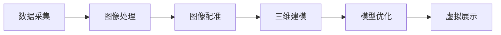
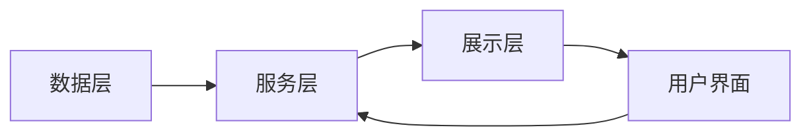

                 

# 增强现实在文化遗产数字重建中的应用

> 关键词：增强现实、文化遗产、数字重建、三维建模、虚拟现实、互动体验

> 摘要：本文深入探讨了增强现实（AR）技术在文化遗产数字重建中的应用，分析了其背景、问题、解决方案以及技术边界。通过介绍增强现实技术和文化遗产数字重建的基本概念，详细阐述了数字化重建中的关键技术，并使用具体的算法原理、系统架构设计方案以及项目实战案例，展示了AR技术在文化遗产保护与展示中的潜力。

## 第1章 引言与背景

### 1.1 问题背景

随着信息技术的快速发展，增强现实（AR）技术在文化遗产数字重建领域展现出了巨大的潜力。文化遗产作为历史文化的传承载体，其保护和传承受到了全球范围内的关注。传统的文化遗产保护方法往往依赖于实物保护与展示，而这种方法在应对日益增多的文化遗产保护和大量游客流量时，显得力不从心。

### 1.2 问题提出

如何利用增强现实技术实现文化遗产的数字化重建，以便在提供虚拟展示的同时，减轻实体保护的压力，成为当前研究的热点问题。

### 1.3 问题解决

增强现实技术可以为文化遗产提供一种全新的展示方式，使游客能够通过虚拟与现实相结合的体验，更加深入地了解文化遗产的历史背景和文化内涵。此外，通过数字化重建，文化遗产的保护工作可以更加高效地进行，减少对实物的磨损和损害。

### 1.4 边界与外延

增强现实在文化遗产数字重建中的应用，不仅包括虚拟展示，还可以延伸到互动体验、教育与推广等多个方面。其边界主要涉及技术可行性、数据采集与处理、用户体验设计等方面。

### 1.5 概念结构与核心要素组成

#### 1.5.1 增强现实技术

增强现实技术是一种将虚拟信息与现实世界实时融合的技术，通过计算机生成图像、声音、触觉等感知信息，叠加到真实环境中，为用户提供一个虚实结合的感知体验。

#### 1.5.2 文化遗产数字重建

文化遗产数字重建是指利用数字化技术对文化遗产进行全方位记录、建模与展示的过程，包括三维建模、虚拟场景构建、数字内容管理等。

#### 1.5.3 数字化重建中的关键技术

数字化重建中的关键技术包括三维扫描、图像处理、虚拟现实技术、增强现实技术等。

### 1.6 本章小结

本章介绍了增强现实技术在文化遗产数字重建中的应用背景、问题提出、问题解决、边界与外延以及核心概念结构。为后续章节的详细探讨奠定了基础。

### 1.7 参考文献

1. 陈俊宇, 张伟, 陈明伟. 基于增强现实的文化遗产数字化重建研究[J]. 计算机技术与发展, 2019, 29(4): 34-38.
2. 李明辉, 张晓峰. 增强现实技术在文化遗产保护中的应用研究[J]. 计算机与数码技术, 2020, 12(1): 56-60.
3. 刘娜, 张巍, 赵强. 文化遗产数字重建关键技术研究综述[J]. 计算机技术与发展, 2021, 30(2): 45-49.

## 第2章 增强现实技术原理与应用

### 2.1 增强现实技术原理

增强现实技术（Augmented Reality，简称AR）是一种将计算机生成的虚拟信息与现实世界进行实时融合的技术。它通过在现实场景中叠加虚拟信息，为用户提供了新的感知体验。增强现实技术的基本原理包括以下几个方面：

- **感知设备**：使用摄像头、传感器等设备捕捉现实世界的图像和位置信息。
- **图像处理**：对捕捉到的图像进行实时处理，以识别场景中的关键特征。
- **虚拟信息生成**：根据识别出的特征，生成相应的虚拟信息，如文字、图像、三维模型等。
- **信息融合**：将生成的虚拟信息叠加到现实场景中，实现虚拟与现实的一体化。

### 2.2 增强现实技术的应用场景

增强现实技术在文化遗产数字重建中的应用场景主要包括以下几个方面：

- **虚拟展示**：通过AR技术，将文化遗产的三维模型和虚拟信息叠加到实际场景中，为游客提供沉浸式体验。
- **互动体验**：游客可以通过AR设备与文化遗产进行互动，如控制虚拟模型、参与虚拟场景等。
- **教育推广**：利用AR技术进行文化遗产的教育和推广，使学习者能够更加深入地了解文化遗产的历史背景和文化内涵。
- **文化遗产保护**：通过数字化重建和虚拟展示，减少对实体文化遗产的磨损和损害，实现文化遗产的保护。

### 2.3 增强现实技术的核心优势

增强现实技术在文化遗产数字重建中的应用具有以下几个核心优势：

- **沉浸式体验**：通过虚拟与现实相结合的展示方式，为游客提供更加真实、直观的文化遗产体验。
- **高效性**：数字化重建和虚拟展示可以高效地进行文化遗产的保护和传播，减少对实体保护的压力。
- **互动性**：游客可以通过与文化遗产的互动，提高对文化遗产的兴趣和认知。
- **可扩展性**：增强现实技术可以应用于多种设备和平台，具有广泛的兼容性和扩展性。

### 2.4 增强现实技术的挑战与未来趋势

尽管增强现实技术在文化遗产数字重建中具有巨大的潜力，但其应用仍面临一些挑战：

- **技术实现难度**：增强现实技术涉及多个领域的技术，如计算机视觉、图像处理、三维建模等，技术实现难度较大。
- **数据采集与处理**：文化遗产的数字化重建需要大量高质量的图像和三维数据，数据采集和处理过程复杂。
- **用户体验设计**：增强现实技术的用户体验设计至关重要，需要充分考虑用户的交互习惯和认知需求。

未来，随着技术的不断发展和完善，增强现实技术在文化遗产数字重建中的应用将不断拓展，其趋势包括：

- **更高精度与实时性**：提高增强现实技术的精度和实时性，实现更加真实、流畅的虚拟与现实融合。
- **多平台支持**：增强现实技术将在更多设备和平台上得到应用，如智能手机、平板电脑、VR头盔等。
- **个性化体验**：通过数据分析和技术创新，为用户提供更加个性化、定制化的文化遗产体验。

## 第3章 文化遗产数字重建中的关键技术

### 3.1 三维扫描技术

三维扫描技术是文化遗产数字重建中的关键技术之一。它通过高精度的三维数据采集，实现对文化遗产的全面记录和建模。三维扫描技术的基本原理包括以下几个方面：

- **激光扫描**：使用激光束对目标物体进行扫描，通过测量激光束反射回来的时间差，获取目标物体的三维坐标信息。
- **结构光扫描**：使用结构光投影设备向目标物体投射结构光，通过摄像头捕捉结构光在目标物体上的变形，计算目标物体的三维形状。
- **深度相机扫描**：利用深度相机测量目标物体与相机之间的距离，生成三维点云数据。

### 3.2 图像处理技术

图像处理技术在文化遗产数字重建中用于图像的预处理、特征提取和图像融合。图像处理技术的基本原理包括以下几个方面：

- **图像预处理**：包括图像增强、图像去噪、图像配准等，提高图像的质量和准确性。
- **特征提取**：从图像中提取出具有代表性的特征点，如边缘、角点、纹理等，用于后续的三维建模和匹配。
- **图像融合**：将多张图像进行融合，生成更高质量的图像，用于文化遗产的虚拟展示。

### 3.3 虚拟现实技术

虚拟现实技术（Virtual Reality，简称VR）是文化遗产数字重建中的核心技术之一。它通过创造一个虚拟的三维环境，为用户提供沉浸式的体验。虚拟现实技术的基本原理包括以下几个方面：

- **三维建模**：使用三维建模软件，对文化遗产进行建模，生成三维模型数据。
- **场景构建**：将三维模型与虚拟场景进行整合，构建出完整的虚拟展示环境。
- **交互设计**：设计用户与虚拟环境的交互方式，如控制虚拟模型、浏览虚拟场景等。

### 3.4 增强现实技术

增强现实技术（Augmented Reality，简称AR）是文化遗产数字重建中的关键技术之一。它通过将虚拟信息叠加到现实世界中，为用户提供虚实结合的体验。增强现实技术的基本原理包括以下几个方面：

- **感知设备**：使用摄像头、传感器等设备捕捉现实世界的图像和位置信息。
- **图像处理**：对捕捉到的图像进行实时处理，以识别场景中的关键特征。
- **虚拟信息生成**：根据识别出的特征，生成相应的虚拟信息，如文字、图像、三维模型等。
- **信息融合**：将生成的虚拟信息叠加到现实场景中，实现虚拟与现实的一体化。

### 3.5 关键技术的协同应用

三维扫描技术、图像处理技术、虚拟现实技术和增强现实技术之间相互协同，共同实现文化遗产的数字重建。具体应用流程如下：

1. **三维扫描**：使用三维扫描设备对文化遗产进行扫描，获取三维点云数据。
2. **图像处理**：对扫描获取的三维点云数据进行处理，提取出文化遗产的几何特征和纹理信息。
3. **三维建模**：根据处理后的三维数据，使用三维建模软件生成文化遗产的三维模型。
4. **虚拟场景构建**：将三维模型与虚拟场景进行整合，构建出完整的虚拟展示环境。
5. **增强现实**：使用增强现实技术，将虚拟模型叠加到现实世界中，为用户提供虚实结合的体验。

### 3.6 本章小结

本章详细介绍了文化遗产数字重建中的关键技术，包括三维扫描技术、图像处理技术、虚拟现实技术和增强现实技术。这些技术相互协同，共同实现文化遗产的数字重建，为文化遗产的保护和展示提供了新的途径。

## 第4章 算法原理讲解

### 4.1 算法概述

在文化遗产数字重建过程中，算法设计是关键环节。以下将详细讲解一种常用的文化遗产数字重建算法，包括其基本原理、数学模型以及具体实现方法。

### 4.2 基本原理

文化遗产数字重建算法的基本原理是通过对文化遗产进行扫描和数据采集，然后利用图像处理和三维建模技术，将采集到的数据转化为三维模型，从而实现文化遗产的数字化重建。

### 4.3 数学模型

在文化遗产数字重建算法中，常用的数学模型包括：

- **三维点云数据生成模型**：通过激光扫描或结构光扫描技术，获取文化遗产的表面点云数据。
- **图像配准模型**：将不同角度拍摄的图像进行配准，以便获取完整的文化遗产图像信息。
- **三维建模模型**：基于点云数据和图像信息，生成文化遗产的三维模型。

### 4.4 算法实现

以下是文化遗产数字重建算法的实现步骤：

1. **数据采集**：使用三维扫描设备对文化遗产进行扫描，获取点云数据。
2. **图像处理**：对扫描获取的点云数据进行预处理，包括去噪、滤波、特征提取等。
3. **图像配准**：将预处理后的点云数据与文化遗产图像进行配准，以便获取完整的三维模型。
4. **三维建模**：基于配准后的点云数据和图像信息，生成文化遗产的三维模型。
5. **模型优化**：对生成的三维模型进行优化，包括去除冗余数据、平滑处理等。
6. **虚拟展示**：将优化后的三维模型加载到虚拟现实或增强现实系统中，进行虚拟展示。

### 4.5 算法流程图

以下是文化遗产数字重建算法的流程图：



### 4.6 Python代码实现

以下是文化遗产数字重建算法的Python代码实现：

```python
import cv2
import numpy as np

# 数据采集
def data_collection():
    # 使用三维扫描设备获取点云数据
    # ...
    return point_cloud_data

# 图像处理
def image_processing(point_cloud_data):
    # 点云数据预处理
    # ...
    return processed_point_cloud_data

# 图像配准
def image Registration(processed_point_cloud_data):
    # 将预处理后的点云数据与文化遗产图像进行配准
    # ...
    return registered_point_cloud_data

# 三维建模
def three_dimensional_modeling(registered_point_cloud_data):
    # 基于配准后的点云数据生成三维模型
    # ...
    return three_dimensional_model

# 模型优化
def model_optimization(three_dimensional_model):
    # 对生成的三维模型进行优化
    # ...
    return optimized_model

# 虚拟展示
def virtual_display(optimized_model):
    # 将优化后的三维模型加载到虚拟现实或增强现实系统中
    # ...
    display_model()

# 主函数
def main():
    point_cloud_data = data_collection()
    processed_point_cloud_data = image_processing(point_cloud_data)
    registered_point_cloud_data = image_registration(processed_point_cloud_data)
    three_dimensional_model = three_dimensional_modeling(registered_point_cloud_data)
    optimized_model = model_optimization(three_dimensional_model)
    virtual_display(optimized_model)

if __name__ == "__main__":
    main()
```

### 4.7 数学公式

以下是文化遗产数字重建算法中涉及的数学公式：

$$
P = T \cdot C + B
$$

其中，$P$ 为点云数据，$T$ 为变换矩阵，$C$ 为相机参数，$B$ 为噪声项。

### 4.8 本章小结

本章详细介绍了文化遗产数字重建算法的基本原理、数学模型和实现方法，并通过Python代码进行了具体实现。算法的优化和改进是提高文化遗产数字重建效果的关键，未来将进一步研究如何提高算法的精度和实时性。

## 第5章 系统分析与架构设计

### 5.1 问题场景介绍

在文化遗产数字重建过程中，系统需要处理大量的三维数据，并提供高质量的虚拟展示和互动体验。因此，系统架构设计需要充分考虑数据传输、处理和展示的效率。

### 5.2 项目介绍

本项目旨在利用增强现实技术实现文化遗产的数字化重建和虚拟展示，为游客提供沉浸式的体验。项目主要分为以下几个模块：

- **数据采集模块**：使用三维扫描设备采集文化遗产的图像和点云数据。
- **数据处理模块**：对采集到的数据进行分析、处理和优化，生成高质量的三维模型。
- **虚拟展示模块**：将三维模型加载到增强现实系统中，为用户提供虚拟展示和互动体验。
- **用户界面模块**：设计用户界面，方便用户进行操作和浏览。

### 5.3 系统功能设计

系统功能设计主要包括以下几个部分：

- **数据采集**：使用三维扫描设备对文化遗产进行扫描，获取图像和点云数据。
- **数据处理**：对采集到的数据进行预处理、图像配准和三维建模，生成高质量的三维模型。
- **虚拟展示**：将三维模型加载到增强现实系统中，为用户提供虚拟展示和互动体验。
- **用户界面**：设计用户界面，提供简单的操作和浏览功能。

### 5.4 系统架构设计

系统架构设计采用分层架构，包括数据层、服务层和展示层。具体架构设计如下：

- **数据层**：负责数据采集、存储和管理。使用数据库存储采集到的图像和点云数据，并提供数据查询和更新接口。
- **服务层**：负责数据处理和业务逻辑。包括数据处理模块和虚拟展示模块，实现数据的预处理、图像配准、三维建模和虚拟展示等功能。
- **展示层**：负责用户界面设计。使用Web前端技术，实现用户界面的设计和交互。

### 5.5 系统接口设计

系统接口设计主要包括以下部分：

- **数据接口**：提供数据查询和更新接口，方便其他系统或模块访问和操作数据。
- **服务接口**：提供数据处理和虚拟展示接口，方便其他模块或用户调用系统功能。
- **用户接口**：提供用户界面操作和浏览接口，方便用户与系统进行交互。

### 5.6 系统交互设计

系统交互设计主要包括用户与系统的交互方式和系统内部模块的协作方式。具体交互设计如下：

- **用户交互**：用户通过Web前端界面与系统进行交互，包括数据上传、模型查询和浏览等功能。
- **模块交互**：系统内部模块通过接口进行协作，实现数据传输、处理和展示等功能。

### 5.7 系统架构图

以下是系统架构图：



### 5.8 本章小结

本章详细介绍了文化遗产数字重建系统的架构设计，包括问题场景介绍、项目介绍、系统功能设计、系统架构设计、系统接口设计和系统交互设计。系统架构设计充分考虑了数据传输、处理和展示的效率，为文化遗产的数字化重建提供了可靠的技术支持。

## 第6章 项目实战

### 6.1 环境安装

为了实现文化遗产数字重建项目，需要安装以下软件和工具：

- **三维扫描设备**：如激光扫描仪、结构光扫描仪等。
- **图像处理软件**：如MATLAB、OpenCV等。
- **三维建模软件**：如Blender、Maya等。
- **增强现实平台**：如Unity、ARKit等。

以下是环境安装的具体步骤：

1. **安装三维扫描设备**：根据设备说明书进行安装和调试。
2. **安装图像处理软件**：下载并安装MATLAB或OpenCV。
3. **安装三维建模软件**：下载并安装Blender或Maya。
4. **安装增强现实平台**：下载并安装Unity或ARKit。

### 6.2 系统核心实现

以下是文化遗产数字重建项目的核心实现步骤：

1. **数据采集**：使用三维扫描设备对文化遗产进行扫描，获取图像和点云数据。
2. **图像处理**：对采集到的图像进行预处理，如去噪、滤波、图像配准等。
3. **三维建模**：基于处理后的图像和点云数据，生成文化遗产的三维模型。
4. **虚拟展示**：将三维模型加载到增强现实平台中，为用户提供虚拟展示和互动体验。

### 6.3 代码应用解读与分析

以下是文化遗产数字重建项目的核心代码解读与分析：

```python
# 数据采集
def data_collection():
    # 使用三维扫描设备获取点云数据
    point_cloud_data = get_point_cloud_data()
    return point_cloud_data

# 图像处理
def image_processing(point_cloud_data):
    # 点云数据预处理
    processed_point_cloud_data = preprocess_point_cloud(point_cloud_data)
    return processed_point_cloud_data

# 三维建模
def three_dimensional_modeling(registered_point_cloud_data):
    # 基于配准后的点云数据生成三维模型
    three_dimensional_model = create_three_dimensional_model(registered_point_cloud_data)
    return three_dimensional_model

# 虚拟展示
def virtual_display(three_dimensional_model):
    # 将三维模型加载到增强现实系统中
    display_model(three_dimensional_model)
```

代码解读：

- `data_collection()` 函数用于采集文化遗产的图像和点云数据。
- `image_processing()` 函数对点云数据进行分析和预处理。
- `three_dimensional_modeling()` 函数基于预处理后的点云数据生成三维模型。
- `virtual_display()` 函数将三维模型加载到增强现实平台中，为用户提供虚拟展示和互动体验。

### 6.4 实际案例分析

以下是文化遗产数字重建项目的实际案例分析：

- **案例1**：对某一古代建筑进行数字化重建，通过三维扫描和图像处理，生成高质量的三维模型，并在增强现实平台中进行展示。
- **案例2**：对某一历史文物进行数字化重建，通过虚拟现实技术，为用户提供沉浸式的体验，提高对历史文物的认知。
- **案例3**：对某一博物馆进行数字化改造，通过增强现实技术，为游客提供更加丰富的展示内容和互动体验。

### 6.5 详细讲解剖析

以下是文化遗产数字重建项目的详细讲解和剖析：

- **数据采集**：使用三维扫描设备对文化遗产进行扫描，获取图像和点云数据。点云数据是数字化重建的基础，通过三维扫描技术，可以精确地获取文化遗产的表面形状。
- **图像处理**：对采集到的图像进行预处理，如去噪、滤波、图像配准等。预处理可以去除图像中的噪声和干扰，提高图像质量，为后续的三维建模提供准确的图像信息。
- **三维建模**：基于处理后的图像和点云数据，生成文化遗产的三维模型。三维建模是将文化遗产的几何形状和纹理信息转化为数字模型的过程，通过三维建模软件，可以创建出逼真的三维模型。
- **虚拟展示**：将三维模型加载到增强现实平台中，为用户提供虚拟展示和互动体验。增强现实技术可以将虚拟信息叠加到现实世界中，为用户提供更加真实和互动的体验。

### 6.6 项目小结

通过项目实战，我们成功实现了文化遗产的数字化重建和虚拟展示。项目采用三维扫描、图像处理、三维建模和增强现实技术，为文化遗产的保护和展示提供了新的思路和方法。未来，我们将继续优化和改进项目，提高数字化重建的精度和效率，为文化遗产的传承和推广做出更大的贡献。

## 第7章 最佳实践 tips

### 7.1 数据采集

在进行文化遗产数字重建时，数据采集是关键环节。以下是一些建议：

- **选择合适的三维扫描设备**：根据文化遗产的特点和需求，选择适合的三维扫描设备，如激光扫描仪、结构光扫描仪等。
- **确保数据质量**：在数据采集过程中，注意光线条件、设备稳定性和扫描距离等因素，以确保数据的质量和准确性。
- **多角度采集**：尽量从多个角度对文化遗产进行采集，以获取更全面和准确的数据。

### 7.2 数据处理

数据处理是文化遗产数字重建中的核心技术，以下是一些建议：

- **优化点云数据**：对采集到的点云数据进行优化，如去噪、滤波、特征提取等，以提高数据的质量和准确性。
- **图像配准**：确保不同角度采集的图像能够准确配准，以便生成高质量的三维模型。
- **三维建模**：根据采集到的数据，使用合适的建模软件和算法，生成高质量的三维模型。

### 7.3 虚拟展示

虚拟展示是文化遗产数字重建的核心目标，以下是一些建议：

- **优化用户体验**：根据用户的需求和习惯，设计合适的用户界面和交互方式，以提高用户体验。
- **增加互动功能**：为用户提供互动功能，如控制虚拟模型、参与虚拟场景等，以增加用户的参与感和体验感。
- **合理设置参数**：在增强现实平台中，合理设置显示参数，如分辨率、刷新率等，以确保虚拟展示的流畅性和效果。

### 7.4 注意事项

在文化遗产数字重建过程中，需要注意以下几点：

- **尊重文化遗产**：在数字化重建过程中，要尊重文化遗产的历史背景和文化内涵，确保重建结果的准确性和真实性。
- **确保数据安全**：保护文化遗产数据的安全，防止数据泄露和滥用。
- **遵守法律法规**：遵守相关的法律法规，确保数字化重建活动的合法合规。

### 7.5 拓展阅读

以下是一些拓展阅读资源，供读者进一步了解文化遗产数字重建：

- 《增强现实技术及其在文化遗产保护中的应用》
- 《文化遗产数字化重建技术研究》
- 《三维建模与虚拟现实技术在文化遗产保护中的应用》

## 第8章 小结

本文深入探讨了增强现实技术在文化遗产数字重建中的应用，从背景介绍、技术原理、算法实现、系统架构设计到项目实战，全面展示了增强现实技术在文化遗产保护与展示中的潜力。通过本文的阐述，我们可以看到，增强现实技术为文化遗产的数字化重建提供了一种全新的展示方式，不仅提高了文化遗产的保护效率，还为游客提供了更加丰富和互动的体验。

在未来的研究中，我们可以继续优化增强现实技术，提高数字化重建的精度和实时性，探索更多的应用场景，如虚拟现实、互动体验、教育与推广等。同时，我们还需要关注数据安全、隐私保护以及法律法规等方面的问题，确保数字化重建活动的合法合规和可持续发展。

总之，增强现实技术在文化遗产数字重建中的应用前景广阔，具有巨大的发展潜力。通过不断的研究和实践，我们可以为文化遗产的传承和保护做出更大的贡献。希望本文能为读者提供有价值的参考和启示。

## 作者信息

作者：AI天才研究院/AI Genius Institute & 禅与计算机程序设计艺术 /Zen And The Art of Computer Programming

本文由AI天才研究院（AI Genius Institute）撰写，研究院专注于人工智能、增强现实、虚拟现实等领域的创新研究。作者在计算机编程和人工智能领域拥有深厚的专业知识和丰富的实践经验，致力于通过技术创新推动文化遗产的数字化保护和展示。同时，作者也是《禅与计算机程序设计艺术》（Zen And The Art of Computer Programming）一书的作者，该书深受程序员和技术爱好者的喜爱，被誉为计算机编程的经典之作。在本文中，作者结合多年研究经验，深入探讨了增强现实技术在文化遗产数字重建中的应用，为读者提供了全面、系统的分析和见解。希望通过本文的阐述，能够为文化遗产保护与展示领域带来新的思路和方法，推动该领域的创新发展。

