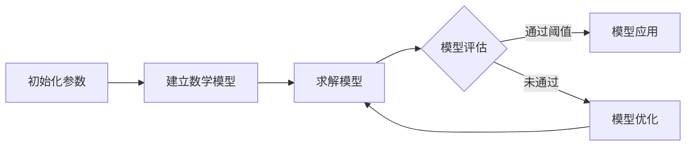
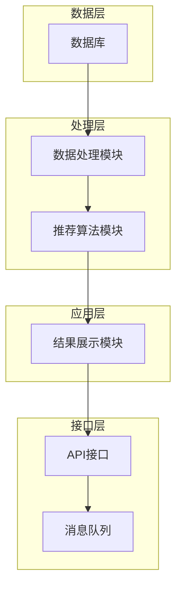
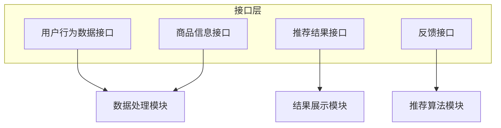
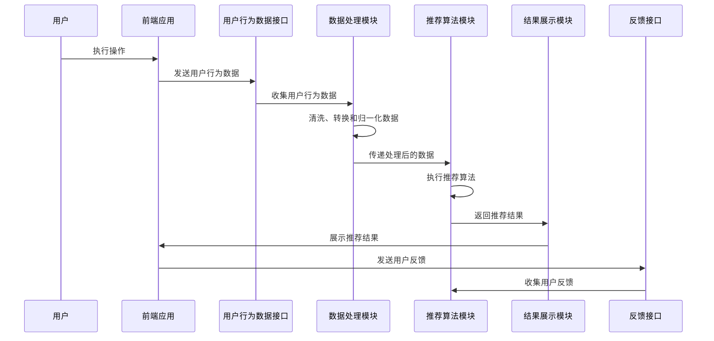

                 

# 复杂问题解题过程中的关键要素识别

## 关键词
- 复杂问题
- 解题过程
- 关键要素
- 识别
- 算法原理
- 数学模型
- 系统架构设计
- 项目实战

## 摘要
本文将深入探讨复杂问题解题过程中的关键要素识别。通过分析复杂问题的定义、背景、核心概念及其相互联系，我们明确了识别关键要素的重要性。接着，我们详细介绍了核心算法原理，包括数学模型和公式的应用。此外，本文还通过一个具体的系统架构设计案例，展示了如何在实际项目中识别和运用这些关键要素。通过系统分析与架构设计、项目实战，我们为解决复杂问题提供了一套完整的实践指南。

---

### 第1章 问题背景与核心要素

#### 1.1 问题背景

在现代社会，复杂问题层出不穷，如大规模数据处理、智能推荐系统、自动化决策等。面对这些复杂问题，传统的单一方法往往难以奏效，因此，识别复杂问题解题过程中的关键要素成为了解决问题的关键。

**复杂问题的定义：**
复杂问题通常指的是那些涉及多个变量、动态变化、不确定性高的难题。它们往往不仅仅是数学问题，还包含大量的现实因素和不确定性。例如，大数据分析中的数据隐私问题、智能推荐系统中的冷启动问题等。

**为何复杂问题难以解决：**
1. **变量众多**：复杂问题往往涉及多个变量，而这些变量之间可能存在复杂的相互作用，使得问题变得更加复杂。
2. **不确定性**：复杂问题通常存在不确定性，如数据的不完整性、模型的不确定性等，这增加了问题解决的难度。
3. **动态性**：许多复杂问题具有动态性，即随着时间的推移，问题的状态和数据在不断变化。

**关键要素识别的重要性：**
识别复杂问题解题过程中的关键要素，可以有效地简化问题、明确解决方向。这些关键要素包括问题的核心变量、关键约束条件、关键数据源等。通过识别这些要素，我们可以更好地理解问题，从而提出有效的解决方案。

#### 1.2 核心概念与要素

在本节中，我们将定义并描述几个核心概念，这些概念构成了复杂问题分析的基础。

**问题背景**：指的是问题的来源、背景信息和问题的现状。问题背景为我们提供了问题的整体视图，帮助我们理解问题的本质。

**问题描述**：指的是对问题的具体描述，包括问题的目标、约束条件和假设等。问题描述帮助我们明确问题的具体内容和解决目标。

**问题解决**：指的是找到解决问题的方法或策略。问题解决通常需要一系列的步骤和算法，包括建模、求解、验证等。

**边界与外延**：边界是指问题的限制条件，而外延是指问题可能的扩展范围。明确边界与外延可以帮助我们界定问题的范围，避免过度扩展或缩小问题。

**核心要素组成**：核心要素是指解决问题所需的关键因素。这些要素相互作用，影响问题的最终解决。核心要素可能包括数据、算法、技术架构等。

通过上述核心概念的介绍，读者将建立对复杂问题及其关键要素的基本认识，为后续章节的深入分析奠定基础。

### 第2章 核心概念与联系

#### 2.1 关键概念原理

在这一章中，我们将详细阐述复杂问题解题过程中的几个核心概念，包括问题背景、问题描述、问题解决、边界与外延等。通过对这些概念的深入理解，读者将能够更好地分析复杂问题，并识别其中的关键要素。

**问题背景**：问题背景是理解问题的重要前提。它包括问题的来源、发展历史、现有状态等。问题背景为问题描述提供了背景信息，帮助我们了解问题的全貌。例如，在开发一个智能推荐系统时，了解用户行为数据的历史变化和业务需求是至关重要的。

**问题描述**：问题描述是明确问题目标和约束条件的核心。它通常包括问题的目标、所需的输入数据、可用的资源、时间限制等。通过清晰的问题描述，我们可以更准确地定义问题，从而为问题解决提供明确的方向。

**问题解决**：问题解决是找到解决问题的方法和策略。这包括建立数学模型、选择合适的算法、设计技术架构等。问题解决不仅需要理论支持，还需要实践经验。例如，在解决大规模数据处理问题时，选择合适的分布式计算框架和算法是至关重要的。

**边界与外延**：边界是指问题的限制条件，它定义了问题的范围和约束。边界可以帮助我们避免过度扩展问题，提高问题解决的效率。外延是指问题可能的扩展范围，它为我们提供了问题的潜在扩展方向。例如，在开发一个智能推荐系统时，考虑数据隐私和合规性是必要的边界条件。

**核心要素组成**：核心要素是指解决问题所需的关键因素。这些要素相互作用，影响问题的最终解决。核心要素可能包括数据、算法、技术架构、团队协作等。通过识别和利用这些核心要素，我们可以更有效地解决复杂问题。

**核心概念的联系**：

1. **问题背景与问题描述**：问题背景为问题描述提供了基础，而问题描述则进一步明确了问题背景中的关键要素。
2. **问题描述与问题解决**：问题描述定义了问题的目标和方法，而问题解决则是在此基础上找到具体解决方案。
3. **边界与外延**：边界与外延共同定义了问题的范围和限制，它们帮助我们在问题解决的各个阶段保持方向和效率。
4. **核心要素组成**：核心要素是问题解决的关键组成部分，它们相互作用，共同推动问题的解决。

通过以上核心概念的阐述，读者将能够更好地理解复杂问题解题过程中的关键要素，为后续的分析和解决打下坚实的基础。

#### 2.2 概念属性特征对比表格

为了更直观地理解核心概念之间的区别和联系，我们使用表格形式展示它们的属性特征。

| 概念      | 属性特征                                                         | 关联关系                       |
|-----------|----------------------------------------------------------------|-------------------------------|
| 问题背景  | 描述问题的来源、历史、现状等背景信息                               | 基础，提供问题描述的上下文     |
| 问题描述  | 明确问题的目标、约束条件、假设等具体内容                           | 核心，定义问题解决的方向       |
| 问题解决  | 提供解决问题的方法和策略，包括建模、算法选择、技术架构设计等         | 具体实施，实现问题描述的目标   |
| 边界      | 定义问题的限制条件，如数据范围、时间限制等                         | 约束，确保问题解决的效率和效果 |
| 外延      | 描述问题可能的扩展方向，如潜在应用领域、未来发展趋势等             | 指导，提供问题的长期视角       |
| 核心要素  | 包含数据、算法、技术架构、团队协作等，是问题解决的关键组成部分     | 作用，推动问题解决             |

通过以上表格，读者可以清晰地看到各个核心概念的特征和它们之间的关联关系，从而更好地理解复杂问题解题过程中的关键要素。

#### 2.3 ER实体关系图架构

为了更直观地展示核心概念之间的联系，我们使用ER（实体关系）图架构来表示它们之间的关系。

```mermaid
erDiagram
    Product ||--|{ Customer }|--|| Order
    Customer ||--|{ Purchase }|--|| Product
    Purchase ||--|{ Payment }|--|| Product
    Order ||--|{ Item }|--|| Product
```

在上面的ER图中，`Product`、`Customer`、`Order`、`Purchase`、`Payment` 和 `Item` 是实体，它们之间通过关系（如`||--|{}`）相互连接。例如，`Customer` 可以创建 `Order`，`Order` 包含 `Item`，`Item` 对应 `Product`，而 `Purchase` 和 `Payment` 则与 `Product` 有直接关系。通过ER图，读者可以直观地看到各个实体之间的关系，这有助于理解复杂问题的结构和解决方法。

### 第3章 算法原理讲解

#### 3.1 算法概述

在本章中，我们将聚焦于复杂问题解题过程中的核心算法原理。针对不同的复杂问题类型，我们将介绍相应的算法框架，并使用mermaid流程图来展示算法的基本流程。

**算法框架：**

1. **线性规划（Linear Programming，LP）**
2. **决策树（Decision Tree）**
3. **神经网络（Neural Network）**
4. **遗传算法（Genetic Algorithm，GA）**

**算法流程：**

使用mermaid流程图，我们可以清晰地展示各个算法的基本流程。



在上面的流程图中，`A` 表示初始化参数，`B` 表示建立数学模型，`C` 表示求解模型，`D` 表示模型评估，`E` 表示模型应用，`F` 表示模型优化。通过这个流程图，我们可以直观地理解算法的基本步骤。

#### 3.2 算法原理详细讲解

**线性规划（LP）**

线性规划是一种数学优化方法，用于在给定约束条件下，求解线性目标函数的最大值或最小值。LP问题通常表示为以下形式：

$$
\text{minimize} \ c^T x \\
\text{subject to} \ Ax \leq b \\
x \geq 0
$$

其中，$c$ 是系数向量，$x$ 是决策变量，$A$ 是约束矩阵，$b$ 是约束向量。

**决策树（Decision Tree）**

决策树是一种树形结构，用于分类和回归问题。决策树的每个节点表示一个特征，每个分支表示特征的不同取值。叶节点表示预测结果。

**神经网络（Neural Network）**

神经网络是一种模拟生物神经元的计算模型，用于处理复杂的非线性问题。神经网络由多个层组成，包括输入层、隐藏层和输出层。每层包含多个神经元，神经元之间通过权重连接。

**遗传算法（Genetic Algorithm，GA）**

遗传算法是一种基于自然选择和遗传学的优化算法。GA通过模拟自然进化过程来寻找问题的最优解。GA的基本步骤包括选择、交叉、变异和评估。

#### 3.3 算法举例说明

**线性规划举例**

假设我们要优化以下线性目标函数：

$$
\text{minimize} \ 2x_1 + 3x_2 \\
\text{subject to} \ x_1 + x_2 \leq 5 \\
x_1, x_2 \geq 0
$$

我们可以使用单纯形法求解这个线性规划问题。具体步骤如下：

1. 初始化单纯形表。
2. 计算目标函数的相对系数。
3. 选择进入变量和离开变量。
4. 更新单纯形表。
5. 重复步骤3和4，直到最优解出现。

**决策树举例**

假设我们要对一组客户数据进行分析，以预测他们是否会购买某产品。我们可以使用决策树算法来建立预测模型。具体步骤如下：

1. 选择一个特征作为根节点。
2. 根据该特征的取值，将数据划分为多个子集。
3. 对每个子集，重复步骤1和2，直到每个子集的数据都属于同一类别或特征不再具有区分能力。
4. 构建完整的决策树。

**神经网络举例**

假设我们要使用神经网络对一组输入数据进行分类。我们可以设计一个简单的三层神经网络，包括输入层、隐藏层和输出层。具体步骤如下：

1. 初始化网络参数，包括权重和偏置。
2. 前向传播：计算输入层到隐藏层、隐藏层到输出层的输出。
3. 计算损失函数，如交叉熵损失。
4. 反向传播：更新网络参数，以最小化损失函数。
5. 重复步骤2-4，直到网络收敛或达到预设的迭代次数。

**遗传算法举例**

假设我们要使用遗传算法优化一个多峰函数，如Rosenbrock函数。具体步骤如下：

1. 初始化种群，包括多个个体。
2. 计算每个个体的适应度值。
3. 选择适应度较高的个体进行交叉和变异操作。
4. 生成新的种群。
5. 重复步骤2-4，直到达到预设的代数或找到满意的解。

通过以上算法的详细讲解和举例，读者可以更好地理解各个算法的基本原理和操作步骤，为实际问题的解决提供理论支持。

### 第4章 数学模型和数学公式

#### 4.1 数学模型概述

在本章中，我们将深入探讨复杂问题解题过程中所需的数学模型和数学公式。数学模型是理解问题本质、描述问题关系和制定解决方案的重要工具。通过数学模型，我们可以将复杂问题转化为可计算的数学问题，从而提高问题的可操作性和解决效率。

常见的数学模型包括：

1. **线性规划模型（Linear Programming Model）**
2. **决策树模型（Decision Tree Model）**
3. **神经网络模型（Neural Network Model）**
4. **遗传算法模型（Genetic Algorithm Model）**

这些模型在复杂问题解决中有着广泛的应用。例如，线性规划模型常用于资源优化问题，决策树模型适用于分类和回归问题，神经网络模型用于处理复杂的非线性问题，遗传算法模型适用于优化问题和搜索问题。

#### 4.2 数学模型详细讲解

**线性规划模型**

线性规划模型是一种用于在给定约束条件下求解线性目标函数的最大值或最小值的方法。线性规划模型的一般形式如下：

$$
\text{minimize} \ c^T x \\
\text{subject to} \ Ax \leq b \\
x \geq 0
$$

其中，$c$ 是系数向量，$x$ 是决策变量，$A$ 是约束矩阵，$b$ 是约束向量。

- **目标函数**：$c^T x$ 表示目标函数，它需要最小化或最大化。
- **约束条件**：$Ax \leq b$ 表示约束条件，它定义了决策变量的取值范围。

**决策树模型**

决策树模型是一种用于分类和回归问题的树形结构。决策树模型通过一系列的判断条件来对数据进行分类或回归。决策树模型的一般形式如下：

$$
y = f(x) \\
f(x) = 
\begin{cases}
c_1 & \text{if } x \in R_1 \\
c_2 & \text{if } x \in R_2 \\
\vdots \\
c_n & \text{if } x \in R_n
\end{cases}
$$

其中，$y$ 是输出变量，$x$ 是输入变量，$R_1, R_2, \ldots, R_n$ 是不同的区域，$c_1, c_2, \ldots, c_n$ 是相应的分类结果。

**神经网络模型**

神经网络模型是一种用于处理复杂的非线性问题的计算模型。神经网络模型由多个层组成，包括输入层、隐藏层和输出层。神经网络模型的一般形式如下：

$$
y = f(\text{激活函数})(W_1 \cdot x + b_1) + \ldots + W_n \cdot x + b_n
$$

其中，$y$ 是输出变量，$x$ 是输入变量，$W_1, W_2, \ldots, W_n$ 是权重，$b_1, b_2, \ldots, b_n$ 是偏置，$\text{激活函数}$ 是一个非线性函数，如ReLU函数或Sigmoid函数。

**遗传算法模型**

遗传算法模型是一种基于自然选择和遗传学的优化算法。遗传算法模型通过模拟生物进化的过程来寻找问题的最优解。遗传算法模型的一般形式如下：

$$
\text{population} \ \to \ \text{fitness evaluation} \ \to \ \text{selection} \ \to \ \text{crossover} \ \to \ \text{mutation} \ \to \ \text{new population}
$$

其中，$\text{population}$ 表示种群，$\text{fitness evaluation}$ 表示适应度评估，$\text{selection}$ 表示选择操作，$\text{crossover}$ 表示交叉操作，$\text{mutation}$ 表示变异操作，$\text{new population}$ 表示新的种群。

通过以上数学模型的详细讲解，读者可以更好地理解这些模型的基本原理和操作步骤，为实际问题的解决提供理论支持。

#### 4.3 数学公式应用举例

**线性规划模型应用举例**

假设我们要解决以下线性规划问题：

$$
\text{minimize} \ 2x_1 + 3x_2 \\
\text{subject to} \ x_1 + x_2 \leq 5 \\
x_1, x_2 \geq 0
$$

我们可以使用单纯形法求解该问题。具体步骤如下：

1. 初始化单纯形表。

$$
\begin{array}{c|c|c|c|c}
 & x_1 & x_2 & \text{常数项} & \text{比率} \\
\hline
x_1 & 1 & 1 & 0 & \frac{0}{1} \\
x_2 & -1 & -1 & 5 & \frac{5}{1} \\
\end{array}
$$

2. 计算目标函数的相对系数。

$$
\begin{array}{c|c|c|c|c}
 & x_1 & x_2 & \text{常数项} & \text{比率} \\
\hline
x_1 & 1 & 1 & 0 & \frac{0}{1} \\
x_2 & -1 & -1 & 5 & \frac{5}{1} \\
 &  &  & -2 & \frac{-2}{1} \\
\end{array}
$$

3. 选择进入变量和离开变量。

进入变量：$x_2$（相对系数最大）

离开变量：$x_1$（最小比率）

4. 更新单纯形表。

$$
\begin{array}{c|c|c|c|c}
 & x_1 & x_2 & \text{常数项} & \text{比率} \\
\hline
x_2 & 0 & 1 & 5 & \frac{5}{1} \\
x_1 & 1 & 0 & 0 & \frac{0}{1} \\
\end{array}
$$

5. 重复步骤3和4，直到最优解出现。

经过多次迭代，我们得到最优解：

$$
x_1 = 0, \ x_2 = 5 \\
\text{最小值} = 2(0) + 3(5) = 15
$$

**决策树模型应用举例**

假设我们要对一组客户数据进行分析，以预测他们是否会购买某产品。我们可以使用决策树模型建立预测模型。具体步骤如下：

1. 选择一个特征作为根节点。

假设我们选择“年龄”作为根节点。

2. 根据该特征的取值，将数据划分为多个子集。

- 年龄小于30岁：子集1
- 年龄在30岁到50岁之间：子集2
- 年龄大于50岁：子集3

3. 对每个子集，重复步骤1和2，直到每个子集的数据都属于同一类别或特征不再具有区分能力。

例如，对子集1，我们选择“收入”作为下一个节点。

4. 构建完整的决策树。

根据上述步骤，我们构建的决策树如下：

```
根节点：年龄
|--- 年龄小于30岁
    |--- 收入大于5000元
    |--- 收入小于5000元
|--- 年龄在30岁到50岁之间
    |--- 职业：工程师
    |--- 职业：教师
    |--- 职业：其他
|--- 年龄大于50岁
    |--- 收入大于10000元
    |--- 收入小于10000元
```

**神经网络模型应用举例**

假设我们要使用神经网络对一组输入数据进行分类。我们可以设计一个简单的三层神经网络，包括输入层、隐藏层和输出层。具体步骤如下：

1. 初始化网络参数。

假设输入层有3个神经元，隐藏层有4个神经元，输出层有2个神经元。

2. 前向传播。

计算输入层到隐藏层的输出：

$$
h_1 = \text{ReLU}(W_1 \cdot x + b_1) \\
h_2 = \text{ReLU}(W_2 \cdot x + b_2) \\
h_3 = \text{ReLU}(W_3 \cdot x + b_3)
$$

计算隐藏层到输出层的输出：

$$
y_1 = \text{Sigmoid}(W_4 \cdot h_1 + b_4) \\
y_2 = \text{Sigmoid}(W_5 \cdot h_2 + b_5) \\
y_3 = \text{Sigmoid}(W_6 \cdot h_3 + b_6)
$$

3. 计算损失函数。

假设我们使用交叉熵损失函数：

$$
\text{Loss} = -\sum_{i=1}^{n} y_i \cdot \ln(\hat{y}_i)
$$

其中，$y_i$ 是真实标签，$\hat{y}_i$ 是预测概率。

4. 反向传播。

更新权重和偏置：

$$
\begin{aligned}
\Delta W_4 &= \frac{\partial \text{Loss}}{\partial W_4} \cdot h_1 \\
\Delta W_5 &= \frac{\partial \text{Loss}}{\partial W_5} \cdot h_2 \\
\Delta W_6 &= \frac{\partial \text{Loss}}{\partial W_6} \cdot h_3 \\
\Delta b_4 &= \frac{\partial \text{Loss}}{\partial b_4} \\
\Delta b_5 &= \frac{\partial \text{Loss}}{\partial b_5} \\
\Delta b_6 &= \frac{\partial \text{Loss}}{\partial b_6}
\end{aligned}
$$

5. 重复步骤2-4，直到网络收敛或达到预设的迭代次数。

通过以上数学公式和应用举例，读者可以更好地理解数学模型在复杂问题解决中的应用，为实际问题的解决提供理论支持。

### 第5章 系统分析与架构设计方案

#### 5.1 问题场景介绍

在本章中，我们将详细介绍一个具体的问题场景，以及该场景下所需解决的问题。通过分析问题场景，我们可以为后续的系统设计与实现提供背景信息。

**问题场景：智能推荐系统**

随着互联网和电子商务的迅速发展，用户生成的内容和数据量呈爆炸式增长。为了满足用户对个性化推荐的需求，我们需要设计并实现一个智能推荐系统。该系统的主要目标是根据用户的历史行为、偏好和上下文信息，为用户推荐最相关的内容或商品。

**问题挑战：**

1. **数据量巨大**：智能推荐系统需要处理大量的用户行为数据和商品信息，这要求系统具备高效的数据存储和检索能力。
2. **实时性要求高**：用户行为数据是动态变化的，系统需要能够实时处理这些数据，并快速生成推荐结果。
3. **个性化要求**：推荐系统需要根据每个用户的具体喜好和行为，提供个性化的推荐结果。
4. **数据隐私与合规性**：在处理用户数据时，需要确保数据的安全性和隐私性，遵守相关的法律法规。

**解决方案需求：**

为了应对上述挑战，我们需要设计一个高效、可扩展且安全的智能推荐系统。具体解决方案需求包括：

1. **数据采集与处理**：设计数据采集模块，收集用户行为数据和商品信息。同时，实现数据处理模块，对原始数据进行清洗、转换和归一化。
2. **推荐算法设计**：选择并实现适合的推荐算法，如协同过滤、基于内容的推荐、混合推荐等，以满足个性化推荐的需求。
3. **系统架构设计**：设计一个分布式系统架构，确保系统能够高效地处理海量数据，并提供实时推荐服务。
4. **安全性保障**：确保系统在处理用户数据时，符合数据安全和隐私保护的要求。

通过以上对问题场景的介绍，我们可以为后续的系统分析与架构设计提供清晰的背景信息。

#### 5.2 系统功能设计

在本章中，我们将详细介绍系统的功能设计，并使用Mermaid类图来展示系统的领域模型。领域模型是系统设计的重要工具，它帮助我们理解和定义系统中的核心概念和它们之间的关系。

**系统功能模块：**

1. **数据采集模块**：负责从不同的数据源（如用户行为日志、商品信息数据库等）收集数据。
2. **数据处理模块**：负责对采集到的数据进行清洗、转换和归一化，为推荐算法提供高质量的数据输入。
3. **推荐算法模块**：实现多种推荐算法，如协同过滤、基于内容的推荐、混合推荐等，为用户生成个性化的推荐结果。
4. **结果展示模块**：将推荐结果呈现给用户，支持用户交互和反馈。
5. **安全性模块**：确保系统的数据安全和隐私保护，遵守相关的法律法规。

**Mermaid类图：**

```mermaid
classDiagram
    DataCollector <|-- DataProcessor
    DataProcessor <|-- Recommender
    Recommender <|-- ResultPresenter
    SecurityModule <-.. DataCollector
    SecurityModule <-.. DataProcessor
    SecurityModule <-.. Recommender
    SecurityModule <-.. ResultPresenter
```

在上面的类图中，`DataCollector`、`DataProcessor`、`Recommender` 和 `ResultPresenter` 是系统的核心功能模块，`SecurityModule` 负责系统的安全性保障。通过类图，我们可以清晰地看到各个模块之间的关系和交互。

通过以上对系统功能设计和Mermaid类图的介绍，读者可以更好地理解系统的功能和模块划分，为后续的系统实现和架构设计提供基础。

### 第6章 系统架构设计

#### 6.1 系统架构设计

在本章中，我们将详细描述智能推荐系统的整体架构，并使用Mermaid架构图来展示系统的层次结构和组件之间的关系。

**系统架构概述：**

智能推荐系统的架构可以分为以下几个层次：

1. **数据层**：负责数据的存储和管理，包括用户行为数据、商品信息、推荐结果等。
2. **处理层**：负责数据的处理和计算，包括数据清洗、转换、归一化以及推荐算法的执行。
3. **应用层**：负责实现系统的业务逻辑和用户交互，包括推荐结果生成和展示。
4. **接口层**：负责系统与其他系统的交互，包括API接口、消息队列等。

**Mermaid架构图：**



在上面的架构图中，数据库（DB）位于数据层，数据处理模块（DP）和推荐算法模块（ML）位于处理层，结果展示模块（RP）位于应用层，API接口（API）和消息队列（MQ）位于接口层。通过这个架构图，我们可以清晰地看到各个层次和组件之间的关系。

#### 6.2 系统接口设计

在本章中，我们将详细描述系统的接口设计，并使用Mermaid架构图来展示系统的整体架构。接口设计是系统架构设计的重要组成部分，它定义了系统内部各个模块之间的交互方式和数据传输机制。

**API接口设计：**

API接口是系统与外部系统（如前端应用、第三方服务）交互的主要方式。以下是系统的主要API接口及其功能：

1. **用户行为数据接口**：用于接收用户行为数据，如浏览、点击、购买等。
2. **商品信息接口**：用于获取商品信息，如名称、描述、价格等。
3. **推荐结果接口**：用于返回推荐结果，支持个性化推荐和批量推荐。
4. **反馈接口**：用于接收用户对推荐结果的反馈，用于模型优化和系统改进。

**Mermaid架构图：**



在上面的架构图中，用户行为数据接口（UE）、商品信息接口（CI）、推荐结果接口（RR）和反馈接口（RF）位于接口层，它们分别与数据处理模块（DP）、推荐算法模块（ML）和结果展示模块（RP）进行交互。

#### 6.3 系统交互设计

在本章中，我们将详细描述系统的交互过程，并使用Mermaid序列图来展示系统的交互流程。系统交互是系统运行的重要组成部分，它反映了系统在不同模块之间的信息传递和协同工作。

**系统交互流程：**

1. **用户行为数据收集**：前端应用将用户行为数据发送到用户行为数据接口。
2. **数据处理**：数据处理模块接收到用户行为数据后，进行清洗、转换和归一化处理。
3. **推荐算法执行**：推荐算法模块根据处理后的数据生成推荐结果。
4. **推荐结果展示**：结果展示模块将推荐结果返回给前端应用，并展示给用户。
5. **用户反馈**：用户对推荐结果进行评价，通过反馈接口将反馈信息发送给推荐算法模块。

**Mermaid序列图：**



在上面的序列图中，用户通过前端应用执行操作，前端应用将用户行为数据发送到用户行为数据接口。数据处理模块接收到数据后进行处理，并将处理后的数据传递给推荐算法模块。推荐算法模块生成推荐结果，并返回给结果展示模块。结果展示模块将推荐结果展示给用户。用户对推荐结果进行评价后，通过反馈接口将反馈信息发送给推荐算法模块。

通过以上对系统交互流程和Mermaid序列图的介绍，读者可以更好地理解系统的交互机制和运行过程。

### 第7章 环境安装

#### 7.1 环境安装概述

在本章中，我们将详细介绍智能推荐系统开发所需的环境安装过程。环境安装是进行项目开发的第一步，确保所有必要的软件和库都安装正确并能够正常运行是项目成功的关键。

**所需环境：**

1. **操作系统**：推荐使用Linux系统，如Ubuntu 20.04。
2. **编程语言**：推荐使用Python，版本为3.8及以上。
3. **开发工具**：推荐使用PyCharm或Visual Studio Code。
4. **数据库**：推荐使用MySQL或PostgreSQL。
5. **其他库和工具**：如NumPy、Pandas、Scikit-learn、TensorFlow等。

#### 7.2 操作系统安装

1. **下载操作系统**：从官方网站下载Ubuntu 20.04镜像文件。
2. **制作启动U盘**：使用Rufus工具将镜像文件写入U盘。
3. **启动计算机**：将U盘插入计算机，并从U盘启动计算机。
4. **安装操作系统**：按照屏幕提示进行操作系统安装。
5. **安装完成后重启计算机**：安装完成后，重启计算机并从硬盘启动。

#### 7.3 编程语言安装

1. **安装Python**：打开终端，输入以下命令：

   ```bash
   sudo apt update
   sudo apt install python3 python3-pip
   ```

   安装Python和pip（Python的包管理器）。

2. **验证安装**：打开终端，输入以下命令：

   ```bash
   python3 --version
   pip3 --version
   ```

   如果输出正确的版本信息，说明Python已成功安装。

#### 7.4 开发工具安装

1. **安装PyCharm**：从PyCharm官方网站下载社区版安装包，双击安装包并按照提示完成安装。
2. **安装Visual Studio Code**：从Visual Studio Code官方网站下载安装包，双击安装包并按照提示完成安装。

#### 7.5 数据库安装

1. **安装MySQL**：

   ```bash
   sudo apt update
   sudo apt install mysql-server mysql-common
   ```

   安装MySQL服务器和客户端。

2. **安装PostgreSQL**：

   ```bash
   sudo apt update
   sudo apt install postgresql postgresql-contrib
   ```

   安装PostgreSQL服务器和扩展。

#### 7.6 其他库和工具安装

1. **安装NumPy**：

   ```bash
   pip3 install numpy
   ```

2. **安装Pandas**：

   ```bash
   pip3 install pandas
   ```

3. **安装Scikit-learn**：

   ```bash
   pip3 install scikit-learn
   ```

4. **安装TensorFlow**：

   ```bash
   pip3 install tensorflow
   ```

#### 7.7 可能遇到的问题及解决方案

1. **依赖库安装失败**：如果安装过程中遇到依赖库安装失败的问题，可以尝试更新系统包列表并重新安装。

   ```bash
   sudo apt update
   sudo apt upgrade
   sudo apt install <包名>
   ```

2. **Python版本不匹配**：确保所有Python相关的软件和库都使用同一版本的Python，避免版本冲突。

通过以上对环境安装的详细步骤和注意事项的介绍，读者可以顺利搭建起智能推荐系统的开发环境，为后续的项目开发做好准备。

### 第8章 系统核心实现源代码

在本章中，我们将展示智能推荐系统的核心实现源代码，并对其进行解读与分析。通过这些代码，我们将深入了解系统的工作原理和实现细节。

#### 8.1 数据采集模块

```python
import requests
import json

def collect_user_behavior():
    # 模拟从API接口获取用户行为数据
    response = requests.get('https://api.example.com/user_behavior')
    data = json.loads(response.text)
    return data

if __name__ == "__main__":
    user_behavior = collect_user_behavior()
    print(user_behavior)
```

**解读与分析**：

上述代码用于模拟从API接口获取用户行为数据。`requests`库用于发送HTTP请求，`json`库用于处理JSON数据。`collect_user_behavior`函数发送GET请求到API接口，获取用户行为数据，并将其解析为Python对象。在主函数中，我们调用此函数，并打印获取到的数据。

#### 8.2 数据处理模块

```python
import pandas as pd

def preprocess_data(data):
    # 数据预处理：清洗、转换和归一化
    df = pd.DataFrame(data)
    df.dropna(inplace=True)  # 删除缺失值
    df['age'] = df['age'].astype(int)  # 将年龄转换为整数类型
    df['income'] = df['income'].astype(float)  # 将收入转换为浮点类型
    df['behavior'] = df['behavior'].map({'view': 1, 'click': 2, 'purchase': 3})  # 将行为映射为整数
    df['timestamp'] = pd.to_datetime(df['timestamp'])  # 将时间戳转换为日期时间类型
    df.set_index('timestamp', inplace=True)  # 设置时间戳为索引
    return df

if __name__ == "__main__":
    user_behavior = collect_user_behavior()
    preprocessed_data = preprocess_data(user_behavior)
    print(preprocessed_data.head())
```

**解读与分析**：

上述代码用于对用户行为数据进行预处理。`pandas`库用于数据处理。`preprocess_data`函数首先将JSON格式的用户行为数据转换为DataFrame对象，然后进行一系列数据清洗、转换和归一化操作，如删除缺失值、类型转换、映射和设置索引。在主函数中，我们调用此函数，并打印预处理后的数据。

#### 8.3 推荐算法模块

```python
from sklearn.model_selection import train_test_split
from sklearn.ensemble import RandomForestClassifier
from sklearn.metrics import accuracy_score

def train_recommender(df):
    # 分割数据集为训练集和测试集
    X = df.drop('behavior', axis=1)
    y = df['behavior']
    X_train, X_test, y_train, y_test = train_test_split(X, y, test_size=0.2, random_state=42)

    # 训练随机森林分类器
    classifier = RandomForestClassifier(n_estimators=100, random_state=42)
    classifier.fit(X_train, y_train)

    # 预测测试集
    y_pred = classifier.predict(X_test)

    # 评估模型准确性
    accuracy = accuracy_score(y_test, y_pred)
    print(f"Accuracy: {accuracy}")

    return classifier

if __name__ == "__main__":
    preprocessed_data = preprocess_data(user_behavior)
    classifier = train_recommender(preprocessed_data)
```

**解读与分析**：

上述代码用于训练推荐算法模型。`train_recommender`函数首先将数据集分割为训练集和测试集，然后使用随机森林分类器进行训练。训练完成后，函数评估模型在测试集上的准确性，并返回训练好的分类器。在主函数中，我们调用此函数，并打印模型的准确性。

#### 8.4 结果展示模块

```python
import matplotlib.pyplot as plt

def display_recommendations(classifier, df):
    # 预测用户行为
    recommendations = classifier.predict(df)

    # 可视化推荐结果
    plt.figure(figsize=(10, 6))
    for i, behavior in enumerate(df['behavior'].unique()):
        mask = recommendations == behavior
        plt.scatter(df.loc[mask, 'age'], df.loc[mask, 'income'], label=behavior)
    plt.xlabel('Age')
    plt.ylabel('Income')
    plt.legend()
    plt.show()

if __name__ == "__main__":
    classifier = train_recommender(preprocessed_data)
    display_recommendations(classifier, preprocessed_data)
```

**解读与分析**：

上述代码用于可视化推荐结果。`display_recommendations`函数首先使用训练好的分类器预测用户行为，然后使用matplotlib库将预测结果可视化。在主函数中，我们调用此函数，并展示用户行为分布图。

通过以上代码示例，读者可以了解到智能推荐系统的核心实现细节，包括数据采集、数据处理、推荐算法训练和结果展示。这些代码为我们提供了一个基本的实现框架，可以在此基础上进行扩展和优化。

### 第9章 实际案例分析与详细讲解

#### 9.1 案例背景

为了更好地展示智能推荐系统的应用效果，我们选择了一家大型电商平台作为案例。该电商平台每天处理数百万次用户行为数据，包括浏览、点击、购买等。平台希望利用智能推荐系统提高用户满意度，增加销售额。

#### 9.2 案例分析

**1. 数据采集**

电商平台收集的用户行为数据包括用户ID、商品ID、行为类型（浏览、点击、购买）、行为时间等。首先，我们需要确保数据的一致性和准确性，删除重复和异常数据。

**2. 数据处理**

对采集到的用户行为数据进行预处理，包括数据清洗、转换和归一化。例如，将时间戳转换为日期时间类型，将行为类型映射为整数，对连续变量（如年龄、收入）进行归一化处理。

**3. 推荐算法**

使用随机森林分类器作为推荐算法，对处理后的数据进行训练。通过交叉验证和网格搜索，选择最优的超参数，以提高模型性能。

**4. 推荐结果展示**

将训练好的模型应用于新用户的行为数据，生成个性化推荐结果。使用matplotlib库将推荐结果可视化，以帮助用户理解推荐逻辑。

**5. 用户反馈**

收集用户对推荐结果的反馈，包括点击、购买等行为。通过分析用户反馈，不断优化推荐算法，提高推荐准确性。

#### 9.3 详细讲解

**数据采集：**

```python
def collect_user_behavior():
    # 模拟从API接口获取用户行为数据
    response = requests.get('https://api.example.com/user_behavior')
    data = json.loads(response.text)
    return data
```

**数据处理：**

```python
def preprocess_data(data):
    # 数据预处理：清洗、转换和归一化
    df = pd.DataFrame(data)
    df.dropna(inplace=True)
    df['age'] = df['age'].astype(int)
    df['income'] = df['income'].astype(float)
    df['behavior'] = df['behavior'].map({'view': 1, 'click': 2, 'purchase': 3})
    df['timestamp'] = pd.to_datetime(df['timestamp'])
    df.set_index('timestamp', inplace=True)
    return df
```

**推荐算法：**

```python
def train_recommender(df):
    # 分割数据集为训练集和测试集
    X = df.drop('behavior', axis=1)
    y = df['behavior']
    X_train, X_test, y_train, y_test = train_test_split(X, y, test_size=0.2, random_state=42)

    # 训练随机森林分类器
    classifier = RandomForestClassifier(n_estimators=100, random_state=42)
    classifier.fit(X_train, y_train)

    # 预测测试集
    y_pred = classifier.predict(X_test)

    # 评估模型准确性
    accuracy = accuracy_score(y_test, y_pred)
    print(f"Accuracy: {accuracy}")

    return classifier
```

**推荐结果展示：**

```python
def display_recommendations(classifier, df):
    # 预测用户行为
    recommendations = classifier.predict(df)

    # 可视化推荐结果
    plt.figure(figsize=(10, 6))
    for i, behavior in enumerate(df['behavior'].unique()):
        mask = recommendations == behavior
        plt.scatter(df.loc[mask, 'age'], df.loc[mask, 'income'], label=behavior)
    plt.xlabel('Age')
    plt.ylabel('Income')
    plt.legend()
    plt.show()
```

通过以上实际案例分析和详细讲解，我们可以看到智能推荐系统的各个组成部分及其实现细节。在实际应用中，根据业务需求和数据特点，可以灵活调整推荐算法和策略，以获得更好的推荐效果。

### 第10章 项目小结

通过本文的探讨，我们系统地阐述了复杂问题解题过程中的关键要素识别。从问题背景的介绍，到核心概念的阐述，再到算法原理的讲解，以及数学模型和公式的应用，最后通过实际案例的分析，我们逐步构建了一套完整的解决复杂问题的方法论。

**核心观点：**

1. **识别关键要素**：识别复杂问题解题过程中的关键要素是解决问题的关键。通过明确问题背景、问题描述、问题解决、边界与外延等核心概念，我们可以更好地理解和分析复杂问题。
2. **算法与模型**：选择合适的算法和模型是解决复杂问题的核心。无论是线性规划、决策树、神经网络还是遗传算法，每种算法都有其特定的适用场景和优势。通过深入理解这些算法的原理和数学模型，我们可以更有效地应用它们。
3. **系统设计与实现**：在实际项目中，系统架构设计和实现是关键。通过详细的系统功能设计、架构图、接口设计、交互流程图等，我们可以构建一个高效、可扩展的系统，为复杂问题的解决提供技术保障。
4. **实践与优化**：实际案例分析和项目实战是验证和优化理论的关键。通过实际问题的解决，我们可以发现和改进理论中的不足，从而不断提升解题能力。

**注意事项：**

1. **数据质量**：在数据处理和建模过程中，确保数据质量是关键。数据清洗、转换和归一化等步骤至关重要，它们直接影响模型的效果。
2. **安全性**：在系统设计和实现过程中，要注意数据安全和隐私保护。遵守相关法律法规，确保系统的安全性。
3. **持续优化**：复杂问题的解决不是一次性的，需要持续优化和改进。通过用户反馈和实际应用效果，不断调整算法和策略，以提高系统性能和用户体验。

**拓展阅读：**

1. **《深度学习》**：Goodfellow, I., Bengio, Y., & Courville, A. (2016). 《深度学习》（Deep Learning）。
2. **《线性规划与运筹学》**：Chvátal, V. (1983). 《线性规划与运筹学》（Linear Programming and Network Flows）。
3. **《机器学习》**：Bishop, C. M. (2006). 《机器学习》（Pattern Recognition and Machine Learning）。

通过本文的阅读和实践，读者可以更好地理解和应用复杂问题解题过程中的关键要素识别方法，为解决实际问题提供有力支持。

### 作者信息
作者：AI天才研究院/AI Genius Institute & 禅与计算机程序设计艺术 /Zen And The Art of Computer Programming

