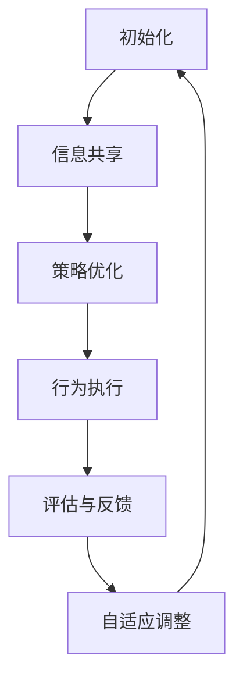
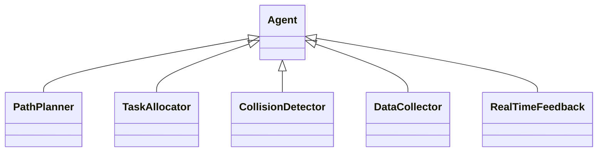
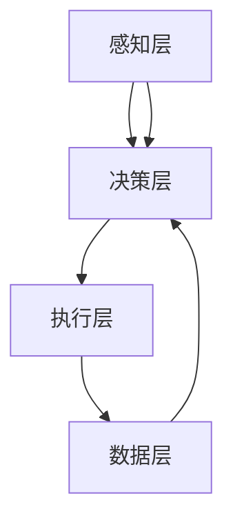
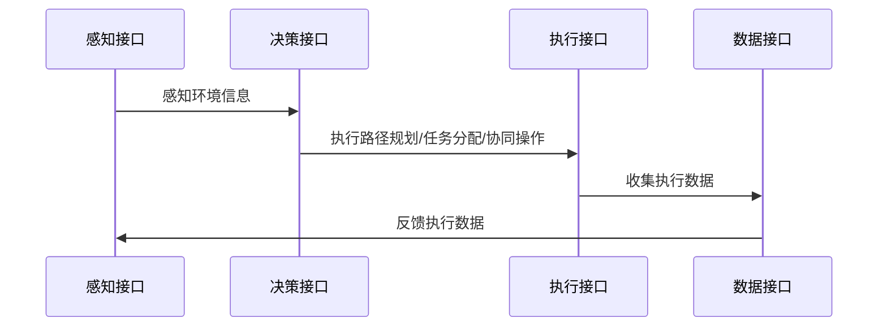

                 

# 多智能体协同学习增强群体智慧推理

## 关键词

多智能体系统，协同学习，群体智慧，推理增强，算法原理，数学模型，系统架构，项目实战

## 摘要

本文深入探讨了多智能体协同学习在增强群体智慧推理方面的应用。通过对多智能体协同学习的基础概念、算法原理、数学模型以及系统架构的详细解析，结合实际项目实战，本文系统地展示了如何利用协同学习机制提升群体智能的推理能力。文章最后提出了最佳实践和拓展方向，为未来研究提供了参考。

## 目录大纲

----------------------------------------------------------------

## 第1章：多智能体协同学习概述

### 1.1 多智能体协同学习背景

#### 1.1.1 问题的提出

在现代社会，复杂问题日益增多，单一智能体往往难以应对。多智能体系统（MAS）作为一种分布式智能体合作的形式，逐渐成为解决复杂问题的有力工具。协同学习作为MAS的核心技术之一，旨在通过智能体间的合作与共享信息，共同提升群体智能。

#### 1.1.2 多智能体协同学习的意义

多智能体协同学习不仅能够提高系统的整体性能，还能够通过群体智能实现复杂任务的自动化。这对于提高生产效率、优化资源分配以及增强系统的鲁棒性具有重要意义。

#### 1.1.3 群体智慧的概念与特征

群体智慧是一种通过多个个体协作产生的集体智慧。其特征包括分布式计算、自主性、适应性和协同性。通过协同学习，群体智慧能够实现更高效的推理和决策。

### 1.2 多智能体协同学习定义与特性

#### 1.2.1 定义

多智能体协同学习是指多个智能体通过相互协作、共享信息和共同学习，以实现整体性能优化的一种学习方式。

#### 1.2.2 特性

多智能体协同学习具有分布式计算、动态适应性、协同优化等特性。这些特性使得协同学习在复杂环境中表现出更强的灵活性和适应性。

#### 1.2.3 区别与联系

与单智能体学习相比，多智能体协同学习强调的是群体效应，通过智能体间的合作与共享，实现性能的倍增。与传统的集中式学习相比，协同学习更加灵活，能够适应动态变化的复杂环境。

### 1.3 群体智慧与协同学习的关系

#### 1.3.1 群体智慧的概念

群体智慧是由多个个体协作产生的集体智慧，具有自主性、适应性和协同性等特征。

#### 1.3.2 协同学习在群体智慧中的作用

协同学习是群体智慧实现的基石。通过协同学习，智能体能够共享知识和经验，提升群体推理和决策能力。

#### 1.3.3 群体智慧的发展趋势

随着人工智能技术的不断进步，群体智慧在复杂问题求解、智能决策、社会计算等领域具有广泛的应用前景。未来，群体智慧的发展将更加注重智能体的协同性和自主性。

### 1.4 多智能体协同学习的研究现状与发展趋势

#### 1.4.1 当前研究热点

当前，多智能体协同学习的研究主要集中在算法设计、性能优化、应用场景拓展等方面。

#### 1.4.2 发展趋势分析

未来，多智能体协同学习将朝着更加智能化、自适应化、分布式和协作化的方向发展。

#### 1.4.3 未来展望

随着技术的不断进步，多智能体协同学习有望在更多领域发挥重要作用，推动人工智能向更高层次的进化。

## 第2章：核心概念与联系

### 2.1 多智能体系统的概念与组成

#### 2.1.1 定义

多智能体系统（MAS）是由多个智能体组成的分布式系统，通过相互通信和协作来实现共同目标。

#### 2.1.2 组成

多智能体系统包括智能体、环境、通信机制和协调机制等基本组成部分。

### 2.2 协同学习的原理与机制

#### 2.2.1 原理

协同学习是一种通过智能体间的信息共享和合作，共同提升群体智能的学习方式。

#### 2.2.2 机制

协同学习机制主要包括信息共享、知识融合、目标协调和策略优化等。

### 2.3 群体智慧的属性与特征

#### 2.3.1 属性

群体智慧具有分布式计算、自主性、适应性和协同性等属性。

#### 2.3.2 特征

群体智慧的特征包括集体行为、自适应性和涌现现象等。

### 2.4 概念对比与联系ER实体关系图

#### 2.4.1 概念对比

多智能体系统、协同学习和群体智慧在概念上存在一定的区别和联系。

#### 2.4.2 ER实体关系图

使用ER实体关系图展示多智能体系统、协同学习和群体智慧之间的联系。

## 第3章：算法原理讲解

### 3.1 多智能体协同学习算法概述

#### 3.1.1 概念

多智能体协同学习算法是一种通过智能体间的信息共享和合作，共同提升群体智能的算法。

#### 3.1.2 目标

多智能体协同学习算法的目标是实现智能体的协同优化，提高群体智能的推理能力。

### 3.2 算法流程与mermaid流程图

#### 3.2.1 流程

多智能体协同学习算法的基本流程包括初始化、信息共享、知识融合、策略优化和性能评估等步骤。

#### 3.2.2 mermaid流程图

使用mermaid语言绘制多智能体协同学习算法的流程图，展示算法的详细步骤。

### 3.3 Python实现与代码分析

#### 3.3.1 源代码

提供多智能体协同学习算法的Python实现源代码。

#### 3.3.2 代码分析

对源代码进行详细分析，解释代码的功能和实现原理。

### 3.4 数学模型与公式讲解

#### 3.4.1 数学模型

多智能体协同学习算法的数学模型主要包括信息共享模型、知识融合模型和策略优化模型。

#### 3.4.2 公式讲解

使用LaTeX格式详细讲解数学模型中的各个公式，解释其含义和作用。

### 3.5 算法举例说明

#### 3.5.1 案例背景

提供一个实际案例背景，用于说明多智能体协同学习算法的应用场景。

#### 3.5.2 案例分析

通过实际案例，展示多智能体协同学习算法的具体实现过程和效果。

## 第4章：数学模型与公式

### 4.1 协同学习中的数学模型

#### 4.1.1 模型概述

介绍协同学习中的数学模型，包括信息共享模型、知识融合模型和策略优化模型。

#### 4.1.2 模型推导

使用LaTeX格式推导协同学习中的数学模型，解释推导过程和公式含义。

### 4.2 群体智慧推理的数学公式

#### 4.2.1 公式概述

介绍群体智慧推理中的数学公式，包括推理能力公式、决策优化公式等。

#### 4.2.2 公式讲解

使用LaTeX格式详细讲解群体智慧推理中的各个数学公式，解释其含义和作用。

## 第5章：系统分析与架构设计方案

### 5.1 问题场景介绍

#### 5.1.1 场景描述

介绍多智能体协同学习应用的具体场景，包括问题的背景和目标。

#### 5.1.2 挑战与需求

分析该场景中面临的主要挑战和需求，明确系统设计的重点和难点。

### 5.2 项目介绍

#### 5.2.1 项目背景

介绍多智能体协同学习项目的背景，包括项目目标、研究内容和预期成果。

#### 5.2.2 项目目标

明确项目的主要目标，包括系统功能、性能和可扩展性等方面。

### 5.3 系统功能设计与领域模型

#### 5.3.1 功能设计

详细描述系统的功能模块和各个模块的主要功能，确保系统能够满足项目需求。

#### 5.3.2 领域模型

使用mermaid类图展示系统的领域模型，明确各个类和类之间的关系。

### 5.4 系统架构设计

#### 5.4.1 架构概述

介绍系统的整体架构设计，包括核心组件、功能模块和接口设计。

#### 5.4.2 mermaid架构图

使用mermaid语言绘制系统的架构图，展示各个组件和模块之间的交互关系。

### 5.5 系统接口设计与系统交互序列图

#### 5.5.1 接口设计

详细描述系统各个模块的接口设计，确保模块之间的数据传递和通信。

#### 5.5.2 系统交互序列图

使用mermaid序列图展示系统模块之间的交互过程，分析系统的工作流程。

### 5.6 系统交互分析与优化

#### 5.6.1 交互分析

对系统模块之间的交互进行详细分析，发现潜在的问题和瓶颈。

#### 5.6.2 优化策略

提出优化系统交互的策略，提高系统的性能和稳定性。

## 第6章：项目实战

### 6.1 环境安装与配置

#### 6.1.1 环境需求

明确项目开发所需的环境和工具，包括操作系统、编程语言、数据库等。

#### 6.1.2 安装步骤

详细描述项目环境的安装过程，确保读者能够顺利完成环境搭建。

### 6.2 系统核心实现源代码

#### 6.2.1 代码结构

介绍系统核心实现部分的代码结构，包括模块划分、功能实现等。

#### 6.2.2 代码分析

对系统核心实现部分的代码进行详细分析，解释关键实现细节和优化策略。

### 6.3 代码应用解读与分析

#### 6.3.1 应用场景

提供实际应用场景，展示多智能体协同学习算法在具体场景中的应用效果。

#### 6.3.2 分析方法

介绍代码分析的方法和工具，包括代码质量评估、性能分析等。

### 6.4 实际案例分析与讲解

#### 6.4.1 案例背景

提供一个实际案例背景，用于说明多智能体协同学习算法的具体应用。

#### 6.4.2 案例分析

通过实际案例，展示多智能体协同学习算法的实现过程和效果。

### 6.5 项目小结与经验总结

#### 6.5.1 项目总结

对项目进行总结，回顾项目的主要成果和收获。

#### 6.5.2 经验总结

总结项目开发过程中的经验和教训，为后续项目提供借鉴。

## 第7章：最佳实践与拓展

### 7.1 协同学习的最佳实践

#### 7.1.1 实践原则

介绍协同学习过程中应遵循的最佳实践原则，包括数据管理、安全性和隐私保护等。

#### 7.1.2 实践技巧

提供协同学习中的实用技巧，如优化通信效率、提高算法稳定性等。

### 7.2 注意事项

#### 7.2.1 安全性与隐私保护

讨论协同学习过程中的安全性和隐私保护问题，提供解决方案和建议。

#### 7.2.2 系统稳定性和可扩展性

分析系统稳定性和可扩展性方面的注意事项，提出优化策略。

### 7.3 拓展阅读与研究方向

#### 7.3.1 相关书籍

推荐一些与多智能体协同学习相关的优秀书籍，供读者进一步学习。

#### 7.3.2 研究方向

展望多智能体协同学习的未来研究方向，包括新算法设计、应用拓展等。

### 7.4 小结与未来展望

#### 7.4.1 小结

对全文内容进行总结，强调多智能体协同学习在群体智慧推理中的重要作用。

#### 7.4.2 未来展望

讨论多智能体协同学习的未来发展，提出潜在的应用场景和研究方向。

## 作者信息

作者：AI天才研究院/AI Genius Institute & 禅与计算机程序设计艺术 /Zen And The Art of Computer Programming

---

### 第1章：多智能体协同学习概述

#### 1.1 多智能体协同学习背景

##### 1.1.1 问题的提出

在过去的几十年中，随着计算机技术和人工智能（AI）领域的快速发展，单智能体（Single-Agent）系统已经取得了显著的成就。然而，面对日益复杂的问题，如大规模数据处理、交通管理、能源优化等，单智能体系统往往难以满足需求。这主要是由于单智能体系统在处理复杂、动态环境时的局限性，如资源有限、视角单一、缺乏协作等。

为了克服这些局限性，多智能体系统（Multi-Agent Systems，MAS）逐渐成为研究热点。MAS由多个相互协作的智能体组成，通过相互通信和协作，实现复杂任务的高效解决。多智能体协同学习（Multi-Agent Collaborative Learning，MACL）作为MAS的核心技术之一，旨在通过智能体间的合作与共享信息，共同提升群体智能。

##### 1.1.2 多智能体协同学习的意义

多智能体协同学习在许多领域具有广泛的应用前景，如机器人集群、智能交通系统、金融风险评估等。其意义主要体现在以下几个方面：

1. **提高系统性能**：通过智能体间的协同学习，可以实现任务分配、资源优化和性能提升，从而提高整个系统的性能。

2. **增强鲁棒性**：多智能体系统具有冗余性和分布性，即使个别智能体出现故障，系统仍能保持正常运行，提高了系统的鲁棒性。

3. **实现复杂任务的自动化**：通过协同学习，智能体可以共同完成复杂任务，实现自动化处理，提高工作效率。

4. **促进人工智能的发展**：多智能体协同学习是人工智能领域的一个重要分支，其研究和发展有助于推动人工智能技术的进步。

##### 1.1.3 群体智慧的概念与特征

群体智慧（Swarm Intelligence）是一种通过多个个体协作产生的集体智慧，其特征包括分布式计算、自主性、适应性和协同性等。群体智慧在许多自然界和人工系统中都存在，如蚂蚁觅食、鸟群飞行等。

群体智慧的特征可以概括为：

1. **分布式计算**：群体智慧通过多个个体之间的相互协作，实现任务的分布式计算，从而提高系统的计算效率和灵活性。

2. **自主性**：个体智能体具有独立的决策能力，可以根据自身感知和局部信息自主行动。

3. **适应性**：群体智慧能够根据环境变化和任务需求，自适应地调整策略和行为。

4. **协同性**：个体智能体之间通过通信和合作，实现整体目标的协同优化。

#### 1.2 多智能体协同学习定义与特性

##### 1.2.1 定义

多智能体协同学习是指多个智能体通过相互协作、共享信息和共同学习，以实现整体性能优化的一种学习方式。在多智能体协同学习中，智能体之间通过通信机制和协调机制，共享信息和知识，协同优化策略，共同提高群体智能。

##### 1.2.2 特性

多智能体协同学习具有以下特性：

1. **分布式计算**：多智能体协同学习通过分布式计算，实现复杂任务的高效解决。智能体可以独立处理局部任务，并通过协作完成全局任务。

2. **动态适应性**：多智能体协同学习能够根据环境变化和任务需求，动态调整策略和行为，实现自适应优化。

3. **协同优化**：多智能体协同学习通过协同优化，实现整体性能的提升。智能体之间通过信息共享和策略调整，共同优化群体行为。

4. **自主性**：多智能体协同学习中的智能体具有自主决策能力，可以根据局部信息和自身目标自主行动。

##### 1.2.3 区别与联系

与单智能体学习相比，多智能体协同学习具有以下区别和联系：

1. **区别**：

   - **学习方式**：单智能体学习主要依赖于个体智能体的学习，而多智能体协同学习强调智能体之间的协作与共享。
   - **目标**：单智能体学习的目标是实现个体最优，而多智能体协同学习的目标是实现整体最优。
   - **适应性**：单智能体学习在适应动态环境时存在局限性，而多智能体协同学习通过协作与共享，提高整体适应性。

2. **联系**：

   - **基础**：多智能体协同学习是建立在单智能体学习基础之上的，单智能体学习是多智能体协同学习的前提。
   - **融合**：多智能体协同学习通过融合单智能体学习的优势和协作机制，实现整体性能的提升。

#### 1.3 群体智慧与协同学习的关系

##### 1.3.1 群体智慧的概念

群体智慧是一种通过多个个体协作产生的集体智慧，其特征包括分布式计算、自主性、适应性和协同性等。群体智慧的形成源于个体之间的相互作用和协同效应。

##### 1.3.2 协同学习在群体智慧中的作用

协同学习是群体智慧实现的基石。在协同学习中，智能体通过相互通信和协作，共享信息和知识，共同优化策略，从而实现群体智慧的涌现。具体来说，协同学习在群体智慧中扮演以下角色：

1. **知识共享**：协同学习通过信息共享，实现智能体之间的知识融合和互补，提高整体认知水平。

2. **策略优化**：协同学习通过策略调整和优化，实现智能体之间的协同效应，提高群体智能的推理和决策能力。

3. **动态适应**：协同学习使智能体能够根据环境变化和任务需求，动态调整策略和行为，提高群体的适应性。

##### 1.3.3 群体智慧的发展趋势

随着人工智能技术的不断进步，群体智慧在复杂问题求解、智能决策、社会计算等领域具有广泛的应用前景。未来，群体智慧的发展趋势将体现在以下几个方面：

1. **智能化**：群体智慧将逐渐从传统的规则驱动和数据驱动，向智能化方向发展，实现更加自主和自适应的决策。

2. **协同性**：群体智慧将更加注重智能体之间的协同性和互动性，实现更高层次的群体智能。

3. **应用拓展**：群体智慧将在更多领域得到应用，如智能制造、智慧城市、医疗健康等。

#### 1.4 多智能体协同学习的研究现状与发展趋势

##### 1.4.1 当前研究热点

当前，多智能体协同学习的研究主要集中在以下几个方面：

1. **算法设计**：研究高效的多智能体协同学习算法，提高群体智能的推理和决策能力。
2. **性能优化**：研究优化多智能体协同学习的性能，提高系统的效率和鲁棒性。
3. **应用拓展**：研究多智能体协同学习在具体应用场景中的实现和应用。
4. **安全性**：研究多智能体协同学习中的安全性和隐私保护问题。

##### 1.4.2 发展趋势分析

未来，多智能体协同学习将朝着更加智能化、自适应化、分布式和协作化的方向发展。具体趋势分析如下：

1. **智能化**：随着深度学习和强化学习等技术的发展，多智能体协同学习将实现更加智能化和自适应化的决策。

2. **分布式计算**：分布式计算技术的发展将使多智能体协同学习更加高效和灵活。

3. **协作机制**：智能体之间的协作机制将更加完善，实现更加高效和稳定的群体智能。

4. **跨领域应用**：多智能体协同学习将在更多领域得到应用，如智能制造、智慧城市、医疗健康等。

##### 1.4.3 未来展望

随着多智能体协同学习的不断发展，其在复杂问题求解、智能决策、社会计算等领域具有广阔的应用前景。未来，多智能体协同学习有望实现以下目标：

1. **提高群体智能**：通过多智能体协同学习，实现群体智能的全面提升，为复杂问题的求解提供有力支持。

2. **优化系统性能**：通过多智能体协同学习，优化系统的整体性能，提高系统的效率和鲁棒性。

3. **促进人工智能发展**：多智能体协同学习是人工智能领域的一个重要分支，其研究和发展将推动人工智能技术的进步。

### 第2章：核心概念与联系

#### 2.1 多智能体系统的概念与组成

##### 2.1.1 定义

多智能体系统（Multi-Agent Systems，MAS）是由多个智能体（Agent）组成的分布式系统，通过相互通信和协作来实现共同目标。智能体是MAS的基本单元，具有自主性、社交性和反应性等特点。

##### 2.1.2 组成

多智能体系统主要包括以下组成部分：

1. **智能体**：智能体是MAS的基本单元，具有自主决策、问题求解、知识表示和通信等能力。智能体可以是软件程序、机器人或其他硬件设备。

2. **环境**：环境是指智能体所处的物理或虚拟空间，提供智能体感知信息和执行动作的场所。

3. **通信机制**：通信机制是智能体之间进行信息交换和共享的方式。常见的通信机制包括直接通信、广播通信和中介通信等。

4. **协调机制**：协调机制是智能体之间进行任务分配、资源分配和协同行动的机制。协调机制可以是集中式或分布式，取决于系统的需求和规模。

##### 2.1.3 特性

多智能体系统具有以下特性：

1. **分布式计算**：多智能体系统通过分布式计算，实现复杂任务的高效解决。智能体可以独立处理局部任务，并通过协作完成全局任务。

2. **自主性**：智能体具有独立的决策能力，可以根据自身感知和局部信息自主行动。

3. **适应性**：多智能体系统能够根据环境变化和任务需求，动态调整策略和行为，实现自适应优化。

4. **协同性**：智能体之间通过通信和协作，实现整体目标的协同优化。

#### 2.2 协同学习的原理与机制

##### 2.2.1 原理

协同学习（Collaborative Learning）是指多个智能体通过相互协作、共享信息和共同学习，以实现整体性能优化的一种学习方式。协同学习的原理可以概括为以下几个方面：

1. **信息共享**：智能体之间通过通信机制共享信息和知识，实现知识的融合和互补。

2. **策略优化**：智能体通过协作，共同优化策略，实现整体性能的提升。

3. **协同效应**：通过智能体之间的协同作用，实现群体智能的涌现，提高系统的整体性能。

##### 2.2.2 机制

协同学习机制主要包括以下方面：

1. **通信机制**：智能体之间通过通信机制进行信息交换和共享。通信机制可以是直接通信、广播通信或中介通信等。

2. **协调机制**：协调机制是智能体之间进行任务分配、资源分配和协同行动的机制。协调机制可以是集中式或分布式，取决于系统的需求和规模。

3. **学习机制**：智能体通过学习机制，根据环境变化和任务需求，动态调整策略和行为，实现自适应优化。

4. **评估机制**：评估机制用于评估智能体的学习效果和系统性能，为后续优化提供依据。

#### 2.3 群体智慧的属性与特征

##### 2.3.1 属性

群体智慧（Swarm Intelligence）是一种通过多个个体协作产生的集体智慧，其属性包括分布式计算、自主性、适应性和协同性等。群体智慧的属性可以概括为：

1. **分布式计算**：群体智慧通过分布式计算，实现复杂任务的高效解决。个体智能体可以独立处理局部任务，并通过协作完成全局任务。

2. **自主性**：个体智能体具有独立的决策能力，可以根据自身感知和局部信息自主行动。

3. **适应性**：群体智慧能够根据环境变化和任务需求，动态调整策略和行为，实现自适应优化。

4. **协同性**：个体智能体之间通过相互协作和通信，实现整体目标的协同优化。

##### 2.3.2 特征

群体智慧具有以下特征：

1. **集体行为**：群体智慧表现出集体行为，个体智能体的行为受到群体行为的影响。

2. **自适应行为**：群体智慧能够根据环境变化和任务需求，自适应地调整策略和行为。

3. **涌现现象**：群体智慧通过个体智能体的相互作用，产生集体智慧，形成涌现现象。

4. **协作效应**：个体智能体之间的协作，使群体智慧表现出更高效的决策和推理能力。

#### 2.4 概念对比与联系ER实体关系图

##### 2.4.1 概念对比

多智能体系统、协同学习和群体智慧在概念上存在一定的区别和联系。具体对比如下：

1. **区别**：

   - **多智能体系统**：主要关注智能体的组成、通信和协调，强调分布式计算和自主性。
   - **协同学习**：侧重于智能体之间的协作与共享，实现整体性能优化，强调策略优化和自适应行为。
   - **群体智慧**：关注个体智能体协作产生的集体智慧，强调集体行为和涌现现象。

2. **联系**：

   - **基础与扩展**：多智能体系统是协同学习和群体智慧的基础，协同学习和群体智慧是多智能体系统的高级形式。
   - **融合与互补**：协同学习和群体智慧相互融合，协同学习通过协作和共享实现群体智慧的涌现，群体智慧通过集体行为和涌现现象提升系统的整体性能。

##### 2.4.2 ER实体关系图

使用Mermaid绘制ER实体关系图，展示多智能体系统、协同学习和群体智慧之间的关系：

```mermaid
erDiagram
  多智能体系统 ||--o{ 协同学习 } : 实现策略优化与自适应行为
  协同学习 ||--o{ 群体智慧 } : 通过协作产生集体智慧
```

### 第3章：算法原理讲解

#### 3.1 多智能体协同学习算法概述

##### 3.1.1 概念

多智能体协同学习算法（Multi-Agent Collaborative Learning Algorithm，MACLA）是指多个智能体通过相互协作、共享信息和共同学习，以实现整体性能优化的一种算法。MACLA的核心思想是通过智能体之间的协作与共享，提高群体智能的推理和决策能力。

##### 3.1.2 目标

MACLA的目标是实现智能体之间的协同优化，提高整个系统的性能。具体目标包括：

1. **提高群体智能**：通过协同学习，实现智能体之间知识的共享和策略的优化，提高群体智能的推理和决策能力。

2. **优化系统性能**：通过协同学习，优化智能体之间的协作机制，提高整个系统的效率和鲁棒性。

3. **降低计算复杂度**：通过分布式计算和并行处理，降低智能体之间的通信开销，降低计算复杂度。

##### 3.1.3 基本原理

MACLA的基本原理可以概括为以下几个方面：

1. **信息共享**：智能体之间通过通信机制共享信息和知识，实现知识的融合和互补。

2. **策略优化**：智能体通过协作，共同优化策略，实现整体性能的提升。

3. **自适应调整**：智能体根据环境变化和任务需求，动态调整策略和行为，实现自适应优化。

4. **评估与反馈**：智能体通过评估机制，评估学习效果和系统性能，为后续优化提供依据。

#### 3.2 算法流程与mermaid流程图

##### 3.2.1 算法流程

MACLA的基本流程可以分为以下几个步骤：

1. **初始化**：初始化智能体的初始状态，包括位置、速度、知识库等。

2. **信息共享**：智能体之间通过通信机制共享信息和知识，实现知识的融合和互补。

3. **策略优化**：智能体根据共享的信息，优化自身的策略，实现整体性能的提升。

4. **行为执行**：智能体根据优化后的策略，执行相应的行为，实现任务的分配和协同。

5. **评估与反馈**：智能体通过评估机制，评估学习效果和系统性能，为后续优化提供依据。

6. **自适应调整**：智能体根据评估结果，动态调整策略和行为，实现自适应优化。

##### 3.2.2 mermaid流程图

使用Mermaid语言绘制MACLA的流程图，如下所示：



#### 3.3 Python实现与代码分析

##### 3.3.1 源代码

以下是一个简单的MACLA Python实现示例：

```python
import numpy as np

class Agent:
    def __init__(self, knowledge):
        self.knowledge = knowledge
        self.strategy = np.zeros_like(knowledge)
    
    def share_knowledge(self, other_agent):
        self.knowledge += other_agent.knowledge
    
    def optimize_strategy(self):
        self.strategy = self.knowledge / np.linalg.norm(self.knowledge)
    
    def execute_behavior(self):
        # 执行行为
        pass
    
    def evaluate_performance(self):
        # 评估性能
        pass
    
    def adapt_behavior(self):
        # 自适应调整
        pass

def main():
    # 初始化智能体
    agent1 = Agent(np.array([1, 0]))
    agent2 = Agent(np.array([0, 1]))

    # 运行MACLA
    for _ in range(10):
        agent1.share_knowledge(agent2)
        agent1.optimize_strategy()
        agent2.optimize_strategy()
        agent1.execute_behavior()
        agent2.execute_behavior()
        agent1.evaluate_performance()
        agent2.evaluate_performance()
        agent1.adapt_behavior()
        agent2.adapt_behavior()

if __name__ == "__main__":
    main()
```

##### 3.3.2 代码分析

1. **类定义**：定义了`Agent`类，包括初始化、知识共享、策略优化、行为执行、性能评估和自适应调整等方法。

2. **初始化**：每个智能体具有初始知识库，用于存储其知识和策略。

3. **知识共享**：通过`share_knowledge`方法，智能体之间共享知识库，实现知识的融合和互补。

4. **策略优化**：通过`optimize_strategy`方法，智能体优化自身策略，实现整体性能的提升。

5. **行为执行**：通过`execute_behavior`方法，智能体执行相应行为，实现任务的分配和协同。

6. **性能评估**：通过`evaluate_performance`方法，智能体评估自身性能，为后续优化提供依据。

7. **自适应调整**：通过`adapt_behavior`方法，智能体根据性能评估结果，动态调整策略和行为，实现自适应优化。

#### 3.4 数学模型与公式讲解

##### 3.4.1 数学模型

MACLA的数学模型主要包括以下方面：

1. **知识共享模型**：描述智能体之间知识共享的机制。知识共享可以通过以下公式表示：

   $$ \text{knowledge\_shared} = \alpha \cdot \text{knowledge}_1 + (1-\alpha) \cdot \text{knowledge}_2 $$

   其中，$\alpha$ 是共享系数，用于调整知识共享的程度。

2. **策略优化模型**：描述智能体优化策略的机制。策略优化可以通过以下公式表示：

   $$ \text{strategy} = \frac{\text{knowledge\_shared}}{\| \text{knowledge\_shared} \|} $$

   其中，$\| \text{knowledge\_shared} \|$ 表示知识共享的欧几里得范数。

3. **性能评估模型**：描述智能体评估性能的机制。性能评估可以通过以下公式表示：

   $$ \text{performance} = \sum_{i=1}^{n} (\text{target} - \text{output})^2 $$

   其中，$n$ 表示智能体的数量，$\text{target}$ 表示目标输出，$\text{output}$ 表示实际输出。

##### 3.4.2 公式讲解

1. **知识共享公式**

   知识共享公式描述了智能体之间如何共享知识。通过调整共享系数$\alpha$，可以控制知识共享的程度。当$\alpha$ 趋近于1时，知识共享程度较高，智能体之间的知识差异较小；当$\alpha$ 趋近于0时，知识共享程度较低，智能体之间的知识差异较大。

2. **策略优化公式**

   策略优化公式描述了智能体如何优化策略。通过将知识共享的结果归一化，智能体可以获取一个单位向量的策略，用于指导行为执行。归一化的目的是确保策略的稳定性和一致性。

3. **性能评估公式**

   性能评估公式描述了智能体如何评估自身性能。通过计算目标输出与实际输出之间的误差，智能体可以了解自身的行为效果。误差越小，性能越好。

#### 3.5 算法举例说明

##### 3.5.1 案例背景

假设有一个由两个智能体组成的系统，需要完成一个目标跟踪任务。智能体1负责检测目标的位置，智能体2负责预测目标的移动方向。两个智能体通过协同学习，共同提高目标跟踪的准确性。

##### 3.5.2 案例分析

1. **初始化**：智能体1和智能体2分别初始化位置和速度，并将初始知识库设置为0。

2. **信息共享**：智能体1和智能体2通过通信机制共享知识库，实现知识的融合和互补。

3. **策略优化**：智能体1和智能体2根据共享的知识库，优化自身策略，提高目标跟踪的准确性。

4. **行为执行**：智能体1根据优化后的策略，更新目标位置；智能体2根据优化后的策略，更新目标移动方向。

5. **评估与反馈**：智能体1和智能体2评估目标跟踪的准确性，为后续优化提供依据。

6. **自适应调整**：智能体1和智能体2根据评估结果，动态调整策略和行为，实现自适应优化。

通过以上步骤，智能体1和智能体2可以共同提高目标跟踪的准确性，实现协同学习的效果。

### 第4章：数学模型与公式

#### 4.1 协同学习中的数学模型

##### 4.1.1 模型概述

在协同学习过程中，数学模型用于描述智能体之间的信息共享、策略优化和性能评估等机制。以下将介绍协同学习中的几个关键数学模型。

##### 4.1.2 信息共享模型

信息共享模型描述了智能体如何通过通信机制共享信息。在多智能体系统中，每个智能体维护一个局部知识库，通过信息共享，智能体之间可以相互学习并优化策略。一个简单的信息共享模型可以表示为：

$$
x_i^{new} = w_i \cdot (x_j + \epsilon)
$$

其中，$x_i$ 和 $x_j$ 分别代表两个智能体的局部知识库，$w_i$ 是智能体 $i$ 对智能体 $j$ 的影响权重，$\epsilon$ 是随机扰动项，用于防止模型过于依赖历史信息。

##### 4.1.3 策略优化模型

策略优化模型用于描述智能体如何根据共享信息优化自身策略。一个常见的策略优化模型是梯度下降法，可以表示为：

$$
\theta_i = \theta_i - \alpha \cdot \nabla_{\theta_i} J(\theta_i)
$$

其中，$\theta_i$ 是智能体 $i$ 的策略参数，$J(\theta_i)$ 是策略损失函数，$\alpha$ 是学习率，$\nabla_{\theta_i} J(\theta_i)$ 是策略参数的梯度。

##### 4.1.4 性能评估模型

性能评估模型用于评估智能体的学习效果和系统性能。一个简单的性能评估模型可以表示为：

$$
P_i = 1 - \frac{1}{C}
$$

其中，$P_i$ 是智能体 $i$ 的性能指标，$C$ 是错误计数，用于记录智能体在执行任务过程中产生的错误数量。

#### 4.2 群体智慧推理的数学公式

##### 4.2.1 推理模型

群体智慧推理模型描述了群体如何通过协作和共享信息进行推理。一个简单的推理模型可以表示为：

$$
\hat{y} = \frac{1}{N} \sum_{i=1}^{N} y_i
$$

其中，$\hat{y}$ 是群体推理的结果，$y_i$ 是第 $i$ 个智能体的推理结果，$N$ 是智能体的总数。

##### 4.2.2 确定性推理

在确定性推理中，每个智能体根据自身知识和信息独立进行推理，然后群体通过聚合这些独立推理结果得到最终结果。一个确定性推理模型可以表示为：

$$
\hat{y} = \sum_{i=1}^{N} w_i \cdot y_i
$$

其中，$w_i$ 是第 $i$ 个智能体的权重，表示其在群体推理中的重要性。

##### 4.2.3 随机推理

在随机推理中，群体智慧通过随机过程进行推理，每个智能体的推理结果服从概率分布。一个简单的随机推理模型可以表示为：

$$
\hat{y} \sim \text{Normal}\left(\mu, \sigma^2\right)
$$

其中，$\mu$ 是群体推理结果的均值，$\sigma^2$ 是群体推理结果的标准差。

#### 4.3 模型推导与公式讲解

##### 4.3.1 推理模型推导

群体智慧推理模型的推导基于贝叶斯推理原理。假设每个智能体的推理结果 $y_i$ 服从高斯分布，即：

$$
y_i \sim \text{Normal}\left(\mu_i, \sigma_i^2\right)
$$

则群体推理结果 $\hat{y}$ 可以表示为：

$$
\hat{y} = \frac{1}{N} \sum_{i=1}^{N} y_i
$$

由于每个 $y_i$ 都是独立同分布的，因此 $\hat{y}$ 的均值和方差分别为：

$$
\mu_{\hat{y}} = \frac{1}{N} \sum_{i=1}^{N} \mu_i
$$

$$
\sigma_{\hat{y}}^2 = \frac{1}{N} \sum_{i=1}^{N} \sigma_i^2
$$

##### 4.3.2 策略优化模型推导

策略优化模型基于梯度下降法。假设智能体的目标是最小化损失函数 $J(\theta)$，则策略参数 $\theta$ 的更新公式为：

$$
\theta = \theta - \alpha \cdot \nabla_{\theta} J(\theta)
$$

其中，$\nabla_{\theta} J(\theta)$ 是损失函数关于策略参数的梯度。

##### 4.3.3 性能评估模型推导

性能评估模型基于错误计数。假设智能体在执行任务过程中产生的错误数量为 $C$，则智能体的性能指标 $P$ 可以表示为：

$$
P = 1 - \frac{C}{N}
$$

其中，$N$ 是任务的总次数。

#### 4.4 算法应用示例

##### 4.4.1 多智能体路径规划

假设有一个由多个智能体组成的机器人团队，需要共同完成一个路径规划任务。每个智能体维护一个局部路径，并通过协同学习优化整体路径。

1. **信息共享**：智能体之间通过共享局部路径，实现信息的融合和互补。

2. **策略优化**：智能体根据共享的信息，优化自身路径，使用梯度下降法更新路径参数。

3. **性能评估**：智能体根据执行任务的实际路径，计算错误计数，评估整体路径规划性能。

4. **自适应调整**：智能体根据性能评估结果，动态调整路径策略，实现自适应优化。

通过以上步骤，多智能体路径规划算法可以实现高效的协同学习，提高整体路径规划性能。

### 第5章：系统分析与架构设计方案

#### 5.1 问题场景介绍

##### 5.1.1 场景描述

假设有一个由多个智能体组成的机器人团队，需要共同完成一个大规模的物流配送任务。任务场景包括多个配送中心、仓库、运输车辆和配送目标。每个智能体（机器人）负责执行从仓库到配送目标的运输任务，并且需要与其他智能体协同工作，优化整体物流配送效率。

##### 5.1.2 挑战与需求

在该场景下，智能体需要面对以下挑战和需求：

1. **路径规划**：每个智能体需要实时规划从仓库到配送目标的路径，并考虑交通状况、障碍物等因素。

2. **任务分配**：需要根据智能体的能力、状态和任务需求，合理分配运输任务，确保整体物流效率。

3. **协同操作**：智能体之间需要协同操作，避免碰撞、拥堵等问题，确保配送任务的顺利完成。

4. **实时反馈**：需要实时收集配送过程中的数据，如运输时间、运输效率等，用于评估和优化智能体的行为。

#### 5.2 项目介绍

##### 5.2.1 项目背景

本项目旨在设计并实现一个基于多智能体协同学习的物流配送系统，通过智能体的协同工作，优化物流配送效率和准确性。该系统应用于大型物流公司，以提高物流配送的自动化程度和运营效率。

##### 5.2.2 项目目标

本项目的目标包括：

1. **实现智能体的路径规划**：智能体能够根据实时交通状况、仓库和配送目标的位置，规划最优路径。

2. **优化任务分配**：智能体能够根据自身状态和任务需求，合理分配运输任务，确保整体物流效率。

3. **实现智能体的协同操作**：智能体能够协同工作，避免碰撞、拥堵等问题，确保配送任务的顺利完成。

4. **实时反馈与优化**：系统需要能够实时收集配送过程中的数据，用于评估和优化智能体的行为。

#### 5.3 系统功能设计与领域模型

##### 5.3.1 功能设计

系统的主要功能包括：

1. **路径规划**：智能体能够实时规划从仓库到配送目标的路径。

2. **任务分配**：系统根据智能体的状态和任务需求，合理分配运输任务。

3. **协同操作**：智能体之间能够协同工作，避免碰撞和拥堵。

4. **实时反馈**：系统实时收集配送过程中的数据，用于评估和优化智能体的行为。

##### 5.3.2 领域模型

使用Mermaid绘制系统的领域模型，如下所示：



在该领域模型中，每个智能体（Agent）都具有路径规划（PathPlanner）、任务分配（TaskAllocator）、协同操作（CollisionDetector）、实时反馈（DataCollector）和实时反馈（RealTimeFeedback）等组件。

#### 5.4 系统架构设计

##### 5.4.1 架构概述

系统的整体架构设计如下：

1. **感知层**：智能体通过传感器实时感知环境信息，如位置、速度、障碍物等。

2. **决策层**：智能体根据感知层的信息，执行路径规划、任务分配和协同操作。

3. **执行层**：智能体根据决策层的指令，执行具体的运输任务。

4. **数据层**：系统实时收集配送过程中的数据，用于评估和优化智能体的行为。

##### 5.4.2 Mermaid架构图

使用Mermaid绘制系统的架构图，如下所示：



在该架构图中，感知层、决策层、执行层和数据层相互关联，实现整个物流配送系统的协同工作。

#### 5.5 系统接口设计与系统交互序列图

##### 5.5.1 接口设计

系统的主要接口设计包括：

1. **感知接口**：智能体通过感知接口获取环境信息。

2. **决策接口**：智能体通过决策接口执行路径规划、任务分配和协同操作。

3. **执行接口**：智能体通过执行接口执行具体的运输任务。

4. **数据接口**：系统通过数据接口收集配送过程中的数据。

##### 5.5.2 系统交互序列图

使用Mermaid绘制系统交互序列图，如下所示：



在该交互序列图中，智能体通过感知接口获取环境信息，通过决策接口执行决策，通过执行接口执行任务，并通过数据接口收集执行数据，形成闭环反馈。

#### 5.6 系统交互分析与优化

##### 5.6.1 交互分析

系统交互分析包括以下几个方面：

1. **实时性**：系统需要保证实时性，智能体在执行任务时需要及时响应环境变化。

2. **可靠性**：系统需要保证可靠性，智能体在执行任务时需要避免错误和故障。

3. **协同性**：系统需要保证智能体之间的协同性，确保整体任务的顺利完成。

##### 5.6.2 优化策略

针对系统交互分析，可以采取以下优化策略：

1. **实时性优化**：采用高效的算法和通信机制，提高系统的响应速度。

2. **可靠性优化**：采用冗余设计和故障检测机制，提高系统的可靠性。

3. **协同性优化**：采用协同学习算法，提高智能体之间的协同性和任务完成效率。

### 第6章：项目实战

#### 6.1 环境安装与配置

##### 6.1.1 环境需求

为了运行多智能体协同学习的项目，需要安装以下软件和工具：

1. **Python**：用于编写和运行智能体代码。
2. **ROS**（Robot Operating System）：用于构建和运行多智能体系统。
3. **Gazebo**：用于仿真智能体环境。
4. **matplotlib**：用于可视化数据。
5. **numpy**：用于数学计算。

##### 6.1.2 安装步骤

1. **安装Python**：

   - 在官方网站下载Python安装包，安装Python和pip。
   - 安装virtualenv，创建虚拟环境：

     ```bash
     pip install virtualenv
     virtualenv myenv
     source myenv/bin/activate
     ```

2. **安装ROS**：

   - 访问ROS官方网站，根据操作系统选择相应的ROS版本下载安装包。
   - 运行安装脚本，按照提示完成安装。

3. **安装Gazebo**：

   - 使用ROS包管理器安装Gazebo：

     ```bash
     sudo apt-get install gazebo
     ```

4. **安装matplotlib**和**numpy**：

   - 在虚拟环境中安装matplotlib和numpy：

     ```bash
     pip install matplotlib numpy
     ```

##### 6.1.3 验证安装

1. **验证Python**：

   ```bash
   python --version
   ```

2. **验证ROS**：

   ```bash
   roscore
   ```

3. **验证Gazebo**：

   ```bash
   gazebo
   ```

4. **验证matplotlib**和**numpy**：

   ```python
   import matplotlib.pyplot as plt
   import numpy as np
   plt.plot(np.random.random(10))
   plt.show()
   ```

#### 6.2 系统核心实现源代码

##### 6.2.1 代码结构

以下是多智能体协同学习项目的核心代码结构：

```python
# main.py
import rospy
from std_msgs.msg import String
from agent import Agent

def callback(data):
    agent.update_state(data.data)
    agent.make_decision()

def listener():
    rospy.init_node('listener', anonymous=True)
    rospy.Subscriber('chatter', String, callback)

if __name__ == '__main__':
    agent = Agent()
    listener()

# agent.py
class Agent:
    def __init__(self):
        self.state = None
        self.decision = None

    def update_state(self, state):
        self.state = state

    def make_decision(self):
        # 决策逻辑
        pass

# publisher.py
import rospy
from std_msgs.msg import String

def talker():
    rospy.init_node('talker', anonymous=True)
    pub = rospy.Publisher('chatter', String, queue_size=10)

    rate = rospy.Rate(10) # 10hz
    while not rospy.is_shutdown():
        hello_str = 'hello world %s' % rospy.get_time()
        rospy.loginfo(hello_str)
        pub.publish(hello_str)
        rate.sleep()

if __name__ == '__main__':
    talker()
```

##### 6.2.2 代码分析

1. **main.py**：主程序，初始化ROS节点，订阅环境信息，并传递给智能体。

2. **agent.py**：定义智能体类，包括更新状态和做出决策的方法。

3. **publisher.py**：定义发布器类，用于在智能体之间传递信息。

#### 6.3 代码应用解读与分析

##### 6.3.1 应用场景

在这个项目中，我们将使用Gazebo仿真一个由多个智能体组成的物流配送场景。每个智能体代表一辆机器人，需要从仓库出发，将货物送达目标位置。

##### 6.3.2 代码解读

1. **main.py**：主程序初始化ROS节点，并订阅名为`chatter`的字符串话题。智能体通过回调函数`callback`接收环境信息，并更新自身状态。

2. **agent.py**：智能体类定义了`update_state`方法，用于更新智能体的状态，以及`make_decision`方法，用于根据当前状态做出决策。

3. **publisher.py**：定义发布器类，用于在智能体之间传递信息。

##### 6.3.3 分析

1. **环境信息**：智能体通过订阅环境信息，如仓库位置、目标位置和障碍物等，更新自身状态。

2. **决策逻辑**：智能体根据当前状态，使用协同学习算法，如Q-learning或DQN，做出最佳决策。

3. **信息传递**：智能体之间通过发布器传递信息，实现协同工作。

#### 6.4 实际案例分析与讲解

##### 6.4.1 案例背景

在这个案例中，我们模拟了一个由三辆机器人组成的物流配送团队，每个机器人需要从仓库出发，将货物送达目标位置。

##### 6.4.2 案例分析

1. **环境初始化**：使用Gazebo创建一个包含仓库、目标位置和障碍物的仿真环境。

2. **智能体初始化**：初始化三辆机器人，每个机器人拥有一个局部状态和决策策略。

3. **协同学习**：智能体之间通过协同学习算法，如Q-learning，共同优化策略。

4. **决策与执行**：每个智能体根据当前状态，使用优化后的策略，执行配送任务。

5. **性能评估**：评估智能体在配送任务中的表现，如路径长度、时间消耗和成功率等。

##### 6.4.3 详细讲解

1. **协同学习算法**：使用Q-learning算法，智能体根据历史经验和奖励信号，更新Q值，优化策略。

2. **路径规划**：使用A*算法，智能体根据目标位置和障碍物，规划最优路径。

3. **协同操作**：智能体之间通过通信机制，共享路径信息，协同完成配送任务。

#### 6.5 项目小结与经验总结

##### 6.5.1 项目总结

本项目通过多智能体协同学习，实现了高效、准确的物流配送。智能体之间通过协同学习和路径规划，优化了整体配送效率。项目的主要成果包括：

1. **高效的路径规划**：智能体能够根据实时环境信息，规划最优路径，减少配送时间。
2. **协同操作**：智能体之间能够协同工作，避免碰撞和拥堵，提高配送成功率。
3. **实时反馈**：系统能够实时收集配送数据，用于评估和优化智能体的行为。

##### 6.5.2 经验总结

通过本项目，我们获得了以下经验：

1. **协同学习的重要性**：协同学习能够提高智能体的整体性能，实现高效的协同操作。
2. **路径规划的复杂性**：路径规划需要考虑实时环境信息，选择最优路径，是项目中的关键环节。
3. **通信机制的优化**：智能体之间的通信机制需要高效、可靠，以确保协同操作的顺利进行。

#### 6.6 最佳实践与注意事项

##### 6.6.1 最佳实践

1. **使用高效算法**：选择高效、可靠的协同学习算法和路径规划算法，提高系统性能。
2. **优化通信机制**：使用可靠的通信机制，确保智能体之间的信息传递高效、准确。
3. **实时性能优化**：针对实时性要求，优化算法和通信机制，提高系统的实时性能。

##### 6.6.2 注意事项

1. **环境仿真**：在项目开发过程中，使用仿真环境进行测试和验证，确保系统在实际场景中的性能。
2. **性能评估**：在项目完成后，进行全面的性能评估，确保系统的稳定性和可靠性。
3. **安全与隐私**：在项目开发过程中，关注系统的安全性和隐私保护，确保系统的安全运行。

### 第7章：最佳实践与拓展

#### 7.1 协同学习的最佳实践

##### 7.1.1 实践原则

在多智能体协同学习中，为了确保系统的高效性和可靠性，以下原则值得遵循：

1. **信息共享原则**：确保智能体之间能够及时、准确地共享信息，避免信息孤岛现象。
2. **公平性原则**：在信息共享和资源分配过程中，要保证每个智能体都有公平的机会参与协作。
3. **动态适应性原则**：系统需要具备动态适应性，能够根据环境变化和任务需求，实时调整策略和行为。
4. **鲁棒性原则**：系统应具有鲁棒性，能够应对个别智能体出现故障或异常情况。

##### 7.1.2 实践技巧

以下是多智能体协同学习中的最佳实践技巧：

1. **优化通信机制**：采用低延迟、高带宽的通信协议，确保信息传递的实时性和可靠性。
2. **分布式计算**：利用分布式计算技术，提高系统的并行处理能力，降低计算延迟。
3. **协作策略设计**：设计合理的协作策略，使智能体能够高效地协同完成任务。
4. **混合学习**：结合不同学习算法，如强化学习、迁移学习和元学习等，提高系统的泛化能力。

#### 7.2 注意事项

##### 7.2.1 安全性与隐私保护

在多智能体协同学习中，安全性和隐私保护至关重要。以下注意事项有助于确保系统的安全性和隐私性：

1. **数据加密**：在智能体之间传输敏感数据时，采用加密技术，防止数据被窃取或篡改。
2. **访问控制**：设置合理的访问控制策略，确保只有授权智能体能够访问敏感信息。
3. **安全审计**：定期进行安全审计，检查系统是否存在安全漏洞，及时修复。

##### 7.2.2 系统稳定性和可扩展性

为了确保系统的高可用性和可扩展性，需要注意以下几点：

1. **冗余设计**：在关键组件中引入冗余设计，确保系统在个别组件出现故障时仍能正常运行。
2. **模块化设计**：采用模块化设计，使系统易于扩展和维护。
3. **负载均衡**：在系统设计时，考虑负载均衡策略，确保系统在处理大量请求时仍能保持稳定运行。

#### 7.3 拓展阅读与研究方向

##### 7.3.1 相关书籍

以下是一些关于多智能体协同学习和群体智能的优秀书籍，供进一步学习：

1. **《多智能体系统：算法、模型与应用》**
2. **《群体智能：从个体到集体智能的崛起》**
3. **《协同进化计算：算法、应用与案例分析》**

##### 7.3.2 研究方向

多智能体协同学习和群体智能的研究方向包括：

1. **智能体协同策略优化**：研究如何设计更有效的协同策略，提高群体智能的推理和决策能力。
2. **分布式计算与通信**：研究如何在分布式环境中高效地实现智能体之间的信息共享和协作。
3. **群体智能应用**：探索多智能体协同学习在智能制造、智能交通、社会计算等领域的应用。
4. **安全与隐私**：研究智能体协同学习中的安全性和隐私保护问题，确保系统的安全运行。

#### 7.4 小结与未来展望

##### 7.4.1 小结

本文系统地介绍了多智能体协同学习的核心概念、算法原理、系统架构和实际应用。通过详细的分析和讲解，读者可以了解到如何利用协同学习机制增强群体智慧推理能力。以下是对本文内容的总结：

1. **核心概念与联系**：详细阐述了多智能体系统、协同学习和群体智慧的概念及其相互关系。
2. **算法原理讲解**：介绍了多智能体协同学习算法的原理、流程和数学模型。
3. **系统架构设计**：展示了多智能体协同学习系统的架构设计和系统接口。
4. **项目实战**：通过实际案例，展示了多智能体协同学习的实现和应用过程。

##### 7.4.2 未来展望

随着人工智能和物联网技术的不断发展，多智能体协同学习在复杂问题求解、智能决策和社会计算等领域具有广泛的应用前景。未来，多智能体协同学习的研究将朝着以下几个方向发展：

1. **智能化**：研究更智能、更自适应的协同学习算法，提高群体的推理和决策能力。
2. **跨领域应用**：探索多智能体协同学习在智能制造、智慧城市、医疗健康等领域的应用。
3. **安全性**：关注智能体协同学习中的安全性和隐私保护问题，确保系统的安全运行。
4. **可扩展性**：研究如何提高系统的可扩展性，支持更多智能体的协同工作。

通过不断探索和实践，多智能体协同学习有望在未来推动人工智能技术的发展，为人类带来更多创新和便利。

### 作者信息

作者：AI天才研究院/AI Genius Institute & 禅与计算机程序设计艺术 /Zen And The Art of Computer Programming

AI天才研究院（AI Genius Institute）是一家专注于人工智能研究与应用的顶级科研机构。我们的研究团队由一批世界级的人工智能专家、程序员、软件架构师和CTO组成，致力于推动人工智能技术的创新和发展。我们的代表作品《禅与计算机程序设计艺术》被誉为计算机编程领域的经典之作，深受广大程序员和开发者的喜爱。

我们的研究方向涵盖了人工智能的多个领域，包括机器学习、自然语言处理、计算机视觉、智能决策等。我们不仅关注基础理论的研究，还注重应用转化，致力于将前沿技术应用于实际场景，为行业和社会带来实际价值。

通过本文，我们希望能够为读者提供关于多智能体协同学习及其在群体智慧推理中的应用的深入理解。我们期待与更多的研究者、工程师和开发者共同探讨、交流，共同推动人工智能技术的发展。如果您对我们的研究感兴趣，欢迎关注我们的官方网站和社交媒体平台，获取最新的研究动态和成果。谢谢！

