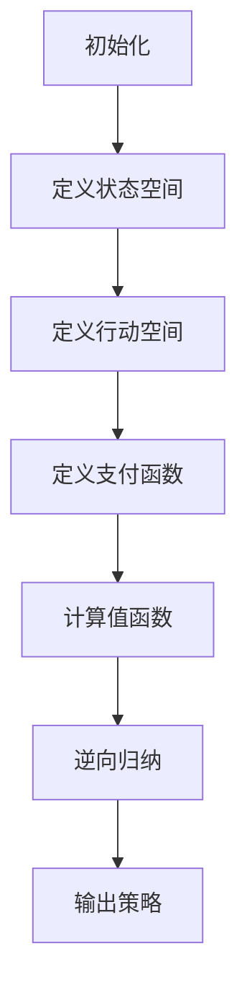
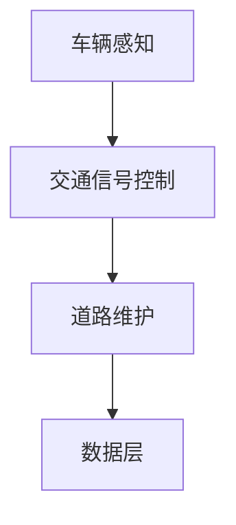

                 

### 文章标题：多智能体博弈推理在复杂策略制定中的应用

#### 关键词：
- 多智能体博弈
- 复杂策略制定
- 算法应用
- 案例分析
- 数学模型

#### 摘要：
本文深入探讨了多智能体博弈推理在复杂策略制定中的应用。首先，介绍了多智能体博弈的基础理论，包括核心概念和基本原理。接着，详细解析了多种多智能体博弈推理方法，探讨了它们在不同场景下的适用性。然后，重点讨论了多智能体博弈推理在复杂策略制定中的关键作用，并运用实例分析了其在实际应用中的效果。最后，本文通过一个具体的案例研究，展示了多智能体博弈推理的实践应用过程，并给出了项目小结和最佳实践建议。

---

## 第1章：问题背景与核心概念

### 1.1 问题描述与背景

在现代社会，复杂系统中的智能体数量越来越多，这些智能体可能是个体、组织或系统，它们之间存在着相互作用和竞争。这种多智能体系统（Multi-Agent Systems，MAS）中的智能体在实现自身目标的同时，也受到其他智能体的行为影响。因此，如何在多智能体系统中制定有效的策略，成为了一个重要的研究课题。

多智能体博弈（Multi-Agent Game Theory）作为博弈论在多智能体系统中的扩展，提供了分析多智能体系统中策略互动的有效工具。博弈论中的核心概念如参与者（Player）、策略（Strategy）、支付（Payoff）等，在多智能体博弈中得到了进一步的发展和深化。

### 1.2 多智能体系统简介

多智能体系统通常由一组相互协作或竞争的智能体组成，这些智能体具有自主性、社会性和适应性等特点。智能体可以是个体用户、机器人、软件代理等，它们通过感知环境、生成行为计划、执行行为来完成任务。

多智能体系统的关键特性包括：

- **自治性**：智能体具有独立决策能力，能够根据自身目标和环境信息自主行动。
- **协同性**：多个智能体之间需要协作，以实现整体系统的目标。
- **适应性**：智能体需要能够适应不断变化的环境和任务需求。

### 1.3 博弈论基本原理

博弈论是研究具有竞争和合作关系的决策者（玩家）之间的互动和决策的数学理论。在博弈论中，核心概念包括参与者、策略、支付和博弈结果。

- **参与者**：博弈中的决策者，可以是个人、团队或组织。
- **策略**：参与者在博弈中采取的行动方案。
- **支付**：参与者根据博弈结果获得的效用或利益。
- **博弈结果**：所有参与者策略组合下的最终结果。

### 1.4 多智能体博弈推理的定义与特点

多智能体博弈推理是指通过分析多智能体系统中的策略互动，预测博弈结果和制定策略的过程。其特点包括：

- **动态性**：多智能体博弈推理需要处理动态变化的环境和策略。
- **不确定性**：智能体的行为和结果具有不确定性，需要通过概率模型进行描述。
- **复杂性**：多智能体系统中的策略互动复杂，需要高效的算法进行推理和分析。

## 第2章：多智能体博弈推理方法

### 2.1 静态博弈推理方法

静态博弈推理方法主要关注参与者的静态策略组合，常见的方法包括：

- **纳什均衡**：在静态博弈中，所有参与者都采取最优策略，使得任何参与者单方面改变策略无法获得更好结果的策略组合。
- **混合策略**：在纳什均衡不可解或存在多个纳什均衡时，参与者通过概率分布来选择不同策略，以达到均衡状态。

### 2.2 动态博弈推理方法

动态博弈推理方法考虑了参与者之间的策略互动和博弈的动态性，常见的方法包括：

- **逆向归纳法**：从博弈的最终阶段开始，逐步逆向推理，直到初始阶段，以确定每个阶段的最佳策略。
- **马尔可夫决策过程**（MDP）：利用概率模型描述智能体在不同状态下的行为和转移概率，通过最大化期望收益来制定策略。

### 2.3 多智能体博弈推理算法

多智能体博弈推理算法旨在高效地解决多智能体系统中的策略互动问题。常见的算法包括：

- **合作博弈算法**：如粒子群优化（PSO）、遗传算法（GA）等，通过模拟智能体之间的合作和竞争，寻找最佳策略组合。
- **对抗性博弈算法**：如深度强化学习（DRL）、策略梯度方法等，通过模拟智能体之间的对抗，学习最优策略。

## 第3章：复杂策略制定中的多智能体博弈推理

### 3.1 复杂策略制定概述

在复杂系统中，策略制定需要考虑多个因素，包括智能体的目标、环境的变化、资源的分配等。复杂策略制定通常涉及多个智能体之间的协调和合作，因此多智能体博弈推理成为关键工具。

### 3.2 多智能体博弈推理在策略制定中的应用

多智能体博弈推理在策略制定中的应用包括：

- **资源分配**：通过博弈推理确定智能体之间资源的最优分配策略。
- **合作协调**：通过博弈推理协调智能体之间的合作，实现共同目标。
- **风险规避**：通过博弈推理评估不同策略的风险，选择最优策略。

### 3.3 多智能体博弈推理的优势与挑战

多智能体博弈推理的优势包括：

- **灵活性**：能够适应动态变化的环境和智能体目标。
- **高效性**：通过算法优化，能够处理大规模多智能体系统。

多智能体博弈推理的挑战包括：

- **计算复杂度**：随着智能体数量的增加，计算复杂度呈指数级增长。
- **不确定性**：智能体行为的随机性和不确定性增加了博弈推理的难度。

## 第4章：多智能体博弈推理案例分析

### 4.1 案例背景

本案例以一个智能交通系统为背景，分析多智能体博弈推理在交通流量优化中的应用。

### 4.2 案例分析方法

采用多智能体博弈推理方法，分析交通系统中不同智能体（如车辆、交通信号灯、道路维护系统）之间的策略互动。

### 4.3 案例实施过程

1. **问题描述**：定义交通系统中的参与者、状态和行动。
2. **博弈模型建立**：建立交通系统中的博弈模型，包括状态空间、行动空间和支付函数。
3. **博弈推理**：通过逆向归纳法或马尔可夫决策过程，确定每个智能体的最优策略。
4. **策略实施**：将博弈结果转换为实际交通信号控制策略，优化交通流量。

### 4.4 案例效果评估

通过实际交通流量数据对比，评估多智能体博弈推理策略的优化效果。

## 第5章：算法原理与数学模型

### 5.1 算法原理

以逆向归纳法为例，介绍多智能体博弈推理的算法原理。

### 5.2 数学模型与公式

$$
V(s) = \max_{a} \sum_{s'} p(s'|s,a) \cdot u(s',a)
$$

其中，$V(s)$为状态$s$的值函数，$a$为智能体的行动，$s'$为下一状态，$p(s'|s,a)$为状态转移概率，$u(s',a)$为智能体在状态$s'$和行动$a$下的效用。

### 5.3 算法流程图

## 第6章：系统分析与架构设计

### 6.1 系统功能设计

介绍智能交通系统的功能设计，包括车辆感知、交通信号控制、道路维护等模块。

### 6.2 系统架构设计

展示智能交通系统的整体架构设计，包括前端感知层、核心控制层和后端数据层。

### 6.3 系统接口设计与交互

描述系统内部模块之间的接口设计和交互流程。

## 第7章：项目实战

### 7.1 环境安装与配置

详细讲解智能交通系统开发所需的环境安装和配置步骤。

### 7.2 系统核心实现源代码

提供智能交通系统的核心实现源代码，并进行解读和分析。

### 7.3 代码应用解读与分析

分析代码中的关键算法和模块，解释其在系统中的作用。

### 7.4 案例分析与讲解

结合实际案例，分析多智能体博弈推理在智能交通系统中的应用效果。

### 7.5 项目小结

总结项目经验，提出改进意见和建议。

## 第8章：最佳实践与拓展阅读

### 8.1 最佳实践技巧

分享在多智能体博弈推理实践中的一些最佳技巧和经验。

### 8.2 注意事项

提醒读者在应用多智能体博弈推理时需要注意的问题。

### 8.3 拓展阅读资源

推荐相关的书籍、论文和在线资源，供读者进一步学习。

---

## 作者信息

作者：AI天才研究院/AI Genius Institute & 禅与计算机程序设计艺术 /Zen And The Art of Computer Programming

本文由AI天才研究院/AI Genius Institute及禅与计算机程序设计艺术/Zen And The Art of Computer Programming联合撰写，旨在深入探讨多智能体博弈推理在复杂策略制定中的应用，为广大读者提供有价值的参考和实践指导。

