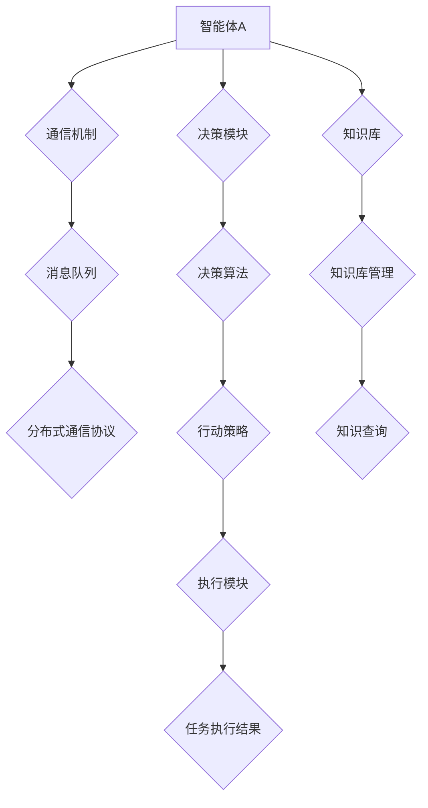

                 

### 1.1 问题背景

#### 1.1.1 复杂推理任务的需求与挑战

在当今信息化社会中，复杂推理任务的需求日益增长。这些任务涵盖了从智能搜索、智能推荐到知识图谱构建等广泛的应用领域。随着互联网的普及和数据量的爆炸式增长，传统的单一智能体系统逐渐暴露出其在处理复杂任务时的局限性。

首先，复杂推理任务通常需要处理大量的数据，并从中提取有价值的信息。这要求系统具有强大的计算能力和高效的推理算法。例如，在智能搜索中，用户可能希望从海量的网页中迅速找到最相关的信息；在智能推荐中，系统需要根据用户的偏好和历史行为推荐个性化的内容。这些任务不仅对计算资源提出了高要求，还需要推理算法能够快速、准确地处理复杂的逻辑关系。

其次，复杂推理任务往往涉及多方面的知识融合和跨领域的推理。这意味着系统需要具备跨学科的知识储备和复杂的推理机制。例如，在知识图谱构建中，系统需要整合来自不同领域的知识，并建立它们之间的关系。这种跨领域的推理不仅需要智能体具备广泛的知识储备，还需要它们能够协同工作，共同完成复杂的推理任务。

然而，传统的单一智能体系统在面对这些复杂推理任务时面临诸多挑战：

1. **计算资源限制**：单一智能体系统往往难以承担大量的数据处理任务，特别是在实时性要求较高的场景中。

2. **知识融合困难**：单一智能体难以同时掌握多领域的知识，导致跨领域的推理难以实现。

3. **协作效率低下**：单一智能体之间的协作效率较低，难以形成高效的推理机制。

4. **可扩展性差**：单一智能体系统的扩展性较差，难以适应不断增长的任务需求和多样化的应用场景。

为了应对这些挑战，多智能体系统应运而生。多智能体系统能够通过多个智能体的协作，实现高效、准确的复杂推理任务。这种系统不仅能够充分利用计算资源，还能够实现多领域的知识融合和高效的协同工作。

#### 1.1.2 多智能体系统的概念与作用

多智能体系统（Multi-Agent Systems，MAS）是由多个智能体（Agent）组成的系统，这些智能体通过相互协作，共同完成复杂的任务。在多智能体系统中，每个智能体都是具有自主决策能力的实体，它们可以通过通信和协作来解决问题。

**多智能体系统的定义与特点**

- **定义**：多智能体系统是由多个相互独立但又相互协作的智能体组成的系统，每个智能体都拥有自己的知识库、行为模型和决策算法。

- **特点**：
  - **分布式**：智能体分布在不同的计算节点上，能够独立处理局部任务。
  - **自主性**：智能体具有自主决策能力，能够根据环境和自身状态进行决策。
  - **协作性**：智能体之间可以通过通信和协作来完成复杂的任务。
  - **灵活性**：智能体能够适应动态变化的环境，并且系统能够根据任务需求进行灵活的扩展和重组。

**多智能体系统在推理任务中的应用**

多智能体系统在复杂推理任务中具有显著的优势。首先，多智能体系统能够通过分布式计算，提高推理任务的效率和鲁棒性。在智能搜索中，多个智能体可以并行处理查询请求，提高搜索速度；在智能推荐中，多个智能体可以协同工作，提高推荐的准确性和个性化程度。

其次，多智能体系统能够实现多领域的知识融合。通过多个智能体的协作，系统能够整合不同领域的知识，并进行跨领域的推理。例如，在知识图谱构建中，多个智能体可以分别负责不同领域的知识抽取和关系建模，从而构建出一个全面、准确的图谱。

此外，多智能体系统具有灵活的协同控制策略。智能体可以根据任务需求和环境变化，动态调整协作策略，提高系统的适应性和可扩展性。例如，在智能交通系统中，智能体可以根据交通流量和路况信息，实时调整交通信号灯的配时，以优化交通流。

总之，多智能体系统在复杂推理任务中具有广泛的应用前景。通过分布式计算、知识融合和灵活的协同控制策略，多智能体系统能够实现高效、准确的推理任务，为各个领域的应用提供强大的技术支持。

### 1.3 本书结构

#### 1.3.1 全书内容安排与逻辑结构

本书旨在深入探讨多智能体系统在复杂推理任务中的应用，通过系统化的分析和详细的案例研究，展示多智能体系统的优势和应用潜力。全书分为六个主要章节，具体内容安排如下：

- **第1章 引言**：介绍复杂推理任务的需求与挑战，以及多智能体系统的概念和作用，为后续章节的讨论奠定基础。

- **第2章 多智能体系统的基本原理**：阐述多智能体系统的组成与架构、通信机制和协同控制策略，为理解多智能体系统的工作原理提供理论基础。

- **第3章 多智能体系统在推理任务中的应用**：分析复杂推理任务的特点与挑战，并探讨多智能体系统在智能搜索、智能推荐和知识图谱构建等应用场景中的具体实现方法。

- **第4章 多智能体系统的推理算法实现**：详细介绍多智能体系统的推理算法实现过程，包括数据准备、算法实现和性能评估，并提供实际案例和代码实现。

- **第5章 多智能体系统的推理案例分析**：通过具体案例，展示多智能体系统在复杂推理任务中的实际应用，并进行详细分析。

- **第6章 多智能体系统在复杂推理任务中的未来发展趋势**：探讨多智能体系统在复杂推理任务中的未来发展趋势、技术挑战和应对策略，为未来的研究和应用提供参考。

- **第7章 总结与展望**：回顾全书主要内容，讨论存在的问题与改进方向，并对未来的研究进行展望。

通过上述章节的安排，本书旨在为读者提供全面、深入的了解多智能体系统在复杂推理任务中的应用，为相关领域的研究和应用提供有益的参考。

## 第2章 多智能体系统的基本原理

### 2.1 多智能体系统的组成与架构

多智能体系统的核心在于其分布式架构和智能体的相互作用。要理解多智能体系统的组成与架构，首先需要明确智能体的定义与分类。

#### 2.1.1 多智能体的定义与分类

**智能体的定义**：智能体（Agent）是一种具有感知、决策和执行能力的实体。它可以在复杂环境中自主地执行任务，并通过感知获取环境信息，基于决策算法生成行动，最终通过执行实现任务的完成。

**智能体的分类**：
1. **基于智能体能力的分类**：
   - **完全智能体**：具有完全的感知、决策和执行能力，能够独立完成任务。
   - **有限智能体**：具有部分感知、决策和执行能力，需要其他智能体的协助。
   - **主动智能体**：能够自主地发现任务和目标，并主动采取行动。
   - **反应式智能体**：只能对环境中的输入做出反应，无法进行长期规划。

2. **基于智能体环境的分类**：
   - **孤立智能体**：仅与外部环境进行交互，没有与其他智能体进行通信的能力。
   - **协作智能体**：能够与其他智能体进行通信和协作，共同完成任务。

**多智能体系统的层次结构**：

多智能体系统通常由以下几个层次组成：

1. **感知层**：智能体通过感知层获取环境信息，包括视觉、听觉、触觉等感官数据。
2. **决策层**：智能体根据感知层获取的信息和自身的知识库，通过决策算法生成行动策略。
3. **执行层**：智能体执行决策层生成的行动策略，以实现对环境的改变。
4. **通信层**：智能体通过通信层与其他智能体进行信息交换和协同工作。

**多智能体系统的组成模块**：

多智能体系统通常包含以下几个关键模块：

1. **智能体模块**：负责创建、管理和控制智能体的行为。
2. **通信模块**：实现智能体之间的信息交换和协同工作。
3. **决策模块**：包含智能体的决策算法，用于生成行动策略。
4. **执行模块**：负责执行决策模块生成的行动策略。
5. **知识库**：存储智能体的知识和经验，用于辅助决策和推理。

### 2.2 多智能体系统的通信机制

通信机制是多智能体系统能够协同工作的基础。有效的通信机制能够提高系统的效率和可靠性。

#### 2.2.1 通信模型与协议

**通信模型**：

- **集中式通信模型**：所有智能体通过一个中心通信节点进行通信，这种模型能够实现高效的通信，但中心节点的故障可能导致整个系统的崩溃。

- **分布式通信模型**：智能体之间通过直接通信进行信息交换，这种模型具有较高的容错性和可扩展性，但通信复杂性较高。

**通信协议**：

- **基于消息的通信协议**：智能体通过发送和接收消息进行通信。常见的消息传递协议包括直接消息传递、间接消息传递和多播通信。

- **基于事件的通信协议**：智能体通过事件触发机制进行通信，事件可以是感知到的环境变化或内部状态的变化。

#### 2.2.2 通信效率与可靠性分析

**通信效率分析**：

- **通信带宽**：通信带宽是影响通信效率的重要因素。高带宽能够支持更多的数据传输，从而提高系统的处理速度。

- **通信延迟**：通信延迟是指信息从发送到接收所需的时间。低延迟对于实时任务至关重要。

- **通信负载**：通信负载是指智能体在单位时间内需要传输的数据量。高通信负载可能导致系统性能下降。

**通信可靠性分析**：

- **通信故障率**：通信故障率是指通信过程中出现故障的概率。高故障率可能导致通信中断，影响系统的可靠性。

- **冗余通信**：通过增加冗余通信路径，可以提高系统的可靠性。但过多的冗余通信会增加通信负载。

### 2.3 多智能体系统的协同控制策略

协同控制策略是多智能体系统能够高效协作的关键。

#### 2.3.1 协同控制的基本概念

**协同控制的基本原理**：

- **任务分配**：智能体之间的任务分配是协同控制的首要任务。根据智能体的能力和任务需求，将任务合理地分配给各个智能体。

- **信息共享**：智能体之间的信息共享是协同工作的基础。通过共享信息，智能体能够更好地理解环境状态和任务目标。

- **协调机制**：协调机制用于解决智能体之间的冲突和矛盾，确保协同工作能够顺利进行。

**协同控制的目标**：

- **高效性**：协同控制策略应最大限度地提高系统的整体效率。

- **可靠性**：协同控制策略应确保系统在多种环境下能够稳定运行。

- **灵活性**：协同控制策略应能够适应动态变化的环境和任务需求。

#### 2.3.2 常见的协同控制策略

**基于规则的控制策略**：

- **规则定义**：根据任务需求和智能体能力，定义一系列控制规则。
- **规则执行**：智能体根据规则和当前状态执行相应的控制行动。

**基于学习的控制策略**：

- **学习机制**：通过历史数据和学习算法，智能体能够不断调整和优化控制策略。
- **自适应学习**：智能体能够根据环境和任务变化，动态调整控制策略。

**混合控制策略**：

- **混合控制策略**：结合基于规则和基于学习的控制策略，根据具体任务需求和环境特点，灵活选择和组合控制策略。

通过上述基本原理和策略，多智能体系统能够实现高效的协同工作，为复杂推理任务提供强大的支持。

### 2.4 多智能体系统的架构设计与实现

多智能体系统的架构设计与实现是确保系统能够高效运行的关键。以下将从架构设计原则、具体实现方法和架构图展示等方面进行详细探讨。

#### 2.4.1 架构设计原则

在设计多智能体系统时，应遵循以下原则：

1. **分布式架构**：系统应采用分布式架构，将任务分配到不同的智能体上，实现负载均衡和容错性。
2. **模块化设计**：系统应具有模块化的设计，使得每个智能体和模块都具有明确的功能和接口，便于维护和扩展。
3. **可扩展性**：系统应具有高度的可扩展性，能够根据任务需求增加或减少智能体和模块。
4. **灵活性**：系统应能够适应不同的任务和环境变化，具有灵活的调整和优化能力。

#### 2.4.2 具体实现方法

**智能体创建与管理**：

- **智能体创建**：系统根据任务需求创建智能体，并为其分配初始资源和任务。
- **智能体管理**：系统应具备智能体的生命周期管理功能，包括创建、启动、监控、停止和销毁。

**通信机制实现**：

- **消息队列**：智能体之间通过消息队列进行通信，确保消息的有序传输和可靠性。
- **分布式通信协议**：系统应支持多种分布式通信协议，如TCP/IP、UDP等，以适应不同的通信需求。

**决策与执行模块**：

- **决策算法**：智能体根据感知到的环境信息和自身的知识库，通过决策算法生成行动策略。
- **执行模块**：执行模块负责将决策算法生成的行动策略付诸实施。

**知识库管理**：

- **知识库构建**：系统应具备知识库的构建和维护功能，包括知识的采集、存储、更新和删除。
- **知识查询**：智能体能够通过知识库进行知识的查询和利用，以支持推理和决策。

#### 2.4.3 架构图展示

为了更直观地展示多智能体系统的架构设计，以下是系统的架构图：

在这个架构图中，智能体A通过通信机制与消息队列、分布式通信协议进行通信，并通过决策模块生成行动策略，最终通过执行模块完成任务。同时，智能体A还与知识库进行交互，以获取和利用知识。

通过上述架构设计与实现方法，多智能体系统能够实现高效、可靠的协同工作，为复杂推理任务提供坚实的支持。

### 第3章 多智能体系统在推理任务中的应用

#### 3.1 复杂推理任务的特点与挑战

**复杂推理任务的定义**：

复杂推理任务是指涉及多个领域、包含多种逻辑关系、需要综合多种信息进行判断和决策的任务。这类任务通常难以通过单一智能体系统高效完成，而是需要多个智能体的协作。

**复杂推理任务的特点**：

1. **多领域融合**：复杂推理任务通常涉及多个领域，如自然语言处理、计算机视觉、知识图谱等，需要智能体具备跨领域知识。
2. **多步骤推理**：复杂推理任务往往包含多个推理步骤，每一步都需要处理大量的数据和复杂的逻辑关系。
3. **动态变化**：任务环境是动态变化的，智能体需要实时感知环境变化，并调整推理策略。
4. **不确定性**：复杂推理任务中存在大量不确定性因素，如噪声数据、未知信息和随机事件，需要智能体具备应对不确定性的能力。

**复杂推理任务面临的挑战**：

1. **计算资源限制**：复杂推理任务需要大量的计算资源，但单一智能体系统的计算资源是有限的，难以满足需求。
2. **知识融合困难**：复杂推理任务涉及多个领域，知识融合难度大，需要智能体具备跨领域知识。
3. **协作效率低下**：单一智能体之间的协作效率较低，难以形成高效的推理机制。
4. **实时性要求高**：许多复杂推理任务需要实时响应，但现有系统的响应速度和鲁棒性难以满足需求。

#### 3.2 多智能体系统在推理任务中的应用场景

**智能搜索**：

智能搜索是利用多智能体系统进行信息检索和推荐的重要应用场景。在智能搜索中，多个智能体可以分别负责关键词提取、语义分析、搜索结果排序等任务。例如，一个智能体负责处理用户查询的语义分析，另一个智能体负责从海量数据中提取相关关键词，并利用第三个智能体进行搜索结果排序和推荐。通过智能体的协作，智能搜索系统能够提供更准确、个性化的搜索结果。

**智能推荐**：

智能推荐是利用多智能体系统进行内容推荐的重要应用场景。在智能推荐中，多个智能体可以分别负责用户行为分析、内容标签提取、推荐算法等任务。例如，一个智能体负责分析用户的浏览历史和点击行为，另一个智能体负责提取内容的关键标签，并利用第三个智能体进行推荐算法的计算和排序。通过智能体的协作，智能推荐系统能够提供更精准、个性化的推荐内容。

**知识图谱构建**：

知识图谱构建是利用多智能体系统进行知识整合和推理的重要应用场景。在知识图谱构建中，多个智能体可以分别负责数据采集、实体识别、关系抽取、图谱构建等任务。例如，一个智能体负责从互联网上采集数据，另一个智能体负责识别实体和抽取关系，并利用第三个智能体进行知识图谱的构建和推理。通过智能体的协作，知识图谱系统能够提供更全面、准确的知识服务。

#### 3.3 多智能体系统的推理算法

多智能体系统在推理任务中需要采用多种算法来实现复杂推理。以下是几种常见的推理算法：

**基于知识的推理算法**：

基于知识的推理算法主要依赖于领域知识库和推理规则。智能体通过查询知识库和应用推理规则，对输入信息进行推理和判断。例如，在知识图谱构建中，智能体可以使用本体论、推理规则和逻辑推理等手段，对实体和关系进行识别和推理。

**基于数据的推理算法**：

基于数据的推理算法主要依赖于数据分析、机器学习和统计模型。智能体通过分析大量数据，发现数据之间的隐含关系和模式，并进行推理。例如，在智能搜索中，智能体可以使用聚类分析、关联规则挖掘和分类算法等手段，对用户查询和搜索结果进行推理和推荐。

**基于混合的推理算法**：

基于混合的推理算法结合了基于知识和基于数据的推理方法，通过融合多种推理手段，提高推理的准确性和鲁棒性。例如，在智能推荐中，智能体可以同时利用用户行为数据和领域知识库，通过知识图谱和机器学习算法进行综合推理和推荐。

通过上述推理算法，多智能体系统能够实现复杂推理任务，为各个领域的应用提供强大的技术支持。

### 第4章 多智能体系统的推理算法实现

#### 4.1 数据准备与预处理

在多智能体系统的推理算法实现过程中，数据准备和预处理是关键步骤。有效的数据准备和预处理能够显著提高算法的性能和推理结果的准确性。

**数据集选择与获取**：

首先，需要选择合适的数据集作为训练数据和测试数据。在选择数据集时，应考虑数据的代表性、覆盖面和多样性。例如，在智能搜索任务中，可以使用公开的网页数据集或新闻数据集；在智能推荐任务中，可以使用电商平台的用户行为数据集；在知识图谱构建任务中，可以使用各类知识库和实体关系数据集。

数据集的获取可以通过以下几种方式：

1. **公开数据集**：许多数据集可以在公共数据集平台上免费获取，如Kaggle、UCI机器学习库等。
2. **定制数据集**：根据具体任务需求，可以从实际应用场景中采集和定制数据集。
3. **数据爬取**：使用爬虫技术从互联网上获取数据，但需注意遵守相关法律法规和网站的使用协议。

**数据预处理方法**：

数据预处理是确保数据质量和算法性能的重要步骤。以下是一些常见的数据预处理方法：

1. **数据清洗**：去除数据中的噪声、重复和缺失值。例如，去除网页数据中的HTML标签、去除用户行为数据中的异常值等。
2. **数据标准化**：对数据进行归一化或标准化处理，使其具有相似的尺度，便于算法处理。例如，对用户行为数据进行归一化处理，使其在[0,1]范围内。
3. **特征提取**：从原始数据中提取有意义的特征，用于训练模型。例如，在文本数据中提取词频、TF-IDF等特征；在图像数据中提取颜色、纹理、形状等特征。
4. **数据分割**：将数据集分为训练集、验证集和测试集，以评估算法的性能。通常，训练集用于模型训练，验证集用于模型调参和优化，测试集用于最终评估模型性能。

通过上述数据准备与预处理方法，可以确保输入数据的可靠性和算法的性能，为多智能体系统的推理算法实现奠定坚实基础。

#### 4.2 多智能体系统的推理算法实现

**算法实现流程**：

在多智能体系统的推理算法实现过程中，需要明确算法的总体实现流程，包括以下几个关键步骤：

1. **智能体初始化**：初始化各个智能体的状态，包括知识库、决策算法、执行模块等。
2. **数据预处理**：对输入数据进行清洗、标准化和特征提取，确保数据质量。
3. **任务分配**：根据任务需求，将不同推理任务分配给各个智能体，确保任务均衡。
4. **协同工作**：智能体之间通过通信机制进行信息交换和协同工作，实现任务的共同完成。
5. **推理过程**：智能体根据感知到的环境和自身的知识库，通过决策算法生成行动策略，并执行相应的操作。
6. **结果评估**：对推理结果进行评估，包括准确性、实时性、鲁棒性等方面，以优化算法性能。

**实现关键技术与挑战**：

1. **通信机制**：实现高效的通信机制，确保智能体之间的信息交换和协同工作。关键挑战包括通信延迟、通信带宽和通信故障率。
2. **分布式计算**：利用分布式计算架构，提高系统的处理速度和鲁棒性。关键挑战包括任务分配策略、负载均衡和容错性。
3. **知识融合**：实现多领域知识的融合，提高推理的准确性和全面性。关键挑战包括知识表示、知识整合和推理机制。
4. **决策算法**：设计高效的决策算法，确保智能体能够根据环境和任务需求进行合理的决策。关键挑战包括算法选择、参数调整和模型优化。

通过上述关键技术和挑战，可以实现高效、准确的多智能体系统推理算法，为复杂推理任务提供有力支持。

#### 4.3 多智能体系统的推理性能评估

推理性能评估是多智能体系统推理任务实现过程中的关键环节。通过科学的评估方法，可以全面了解系统的性能表现，并针对性地进行优化。

**性能评价指标**：

1. **准确性**：评估推理结果的正确性。准确性越高，表示系统在推理任务中的表现越好。
2. **实时性**：评估系统在限定时间内完成推理任务的能力。实时性越高，表示系统对动态变化的响应能力越强。
3. **鲁棒性**：评估系统在面对噪声、异常数据和不确定性环境时的稳定性和适应性。
4. **效率**：评估系统的计算效率和资源利用情况。高效率的系统能够在较短的时间内完成推理任务，并充分利用计算资源。

**性能优化方法**：

1. **算法优化**：通过改进推理算法，提高推理准确性和效率。例如，使用更高效的机器学习算法、优化决策规则等。
2. **硬件优化**：通过提升计算硬件的性能，如使用GPU加速、分布式计算架构等，提高系统的处理速度和资源利用效率。
3. **数据预处理**：通过改进数据预处理方法，提高输入数据的质量和特征提取效果，从而提高推理性能。
4. **协同优化**：通过优化智能体之间的协作机制，提高系统的整体效率和性能。例如，使用更高效的通信协议、优化任务分配策略等。

通过上述评价指标和优化方法，可以全面评估和优化多智能体系统的推理性能，为复杂推理任务提供可靠的技术支持。

### 第5章 多智能体系统的推理案例分析

#### 5.1 案例背景

为了更好地展示多智能体系统在复杂推理任务中的应用，我们选取了一个实际案例——智能交通系统。该系统旨在通过多智能体系统实现交通流量优化、事故预警和应急处置等任务，提高城市交通的运行效率和安全性。

**案例背景**：

随着城市化进程的加快，城市交通拥堵和交通事故问题日益严重。传统的交通管理系统依赖于单一的传感器和交通信号灯，难以应对复杂多变的交通状况。为此，我们需要一种能够实时感知、动态调整和协同工作的智能交通系统。

**系统目标**：

- 实时监测城市道路的交通流量，识别拥堵和事故点。
- 预测交通流量变化，提前调整交通信号灯配时，优化交通流。
- 快速响应交通事故，启动应急处置流程，保障道路畅通。

#### 5.2 案例分析与解决方案

**案例分析**：

在这个案例中，多智能体系统由多个交通智能体组成，每个智能体负责特定区域的交通流量监测和预测。智能体之间通过通信机制进行信息交换和协同工作。

**解决方案**：

1. **交通智能体初始化**：系统首先初始化多个交通智能体，每个智能体具备感知交通流量、生成行动策略和执行任务的能力。

2. **数据收集与预处理**：交通智能体通过传感器获取实时交通数据，包括车辆速度、密度、流量等。系统对数据进行预处理，去除噪声和异常值，提取关键特征。

3. **任务分配**：根据交通流量状况，系统将监测和预测任务分配给不同的智能体。例如，当某个区域出现交通拥堵时，该区域的智能体负责进行流量监测和预测，并提出优化建议。

4. **协同工作**：交通智能体之间通过通信机制进行信息交换和协同工作。例如，某个智能体发现前方道路拥堵，会通知相邻区域的智能体调整交通信号灯配时，以缓解拥堵。

5. **交通流量预测与优化**：智能体使用机器学习算法和交通流量模型，对实时交通数据进行分析和预测，生成最优的交通信号灯配时方案，提高交通流的通行效率。

6. **事故预警与应急处置**：系统通过实时监测和异常检测，及时发现交通事故并通知相关智能体启动应急处置流程。例如，当智能体检测到车辆速度骤降时，会立即通知交通指挥中心，并启动应急预案，保障道路畅通。

#### 5.3 案例总结与反思

**案例总结**：

通过多智能体系统的应用，智能交通系统实现了对城市交通流量的实时监测、预测和优化，有效缓解了交通拥堵问题，提高了交通运行效率和安全性。

**反思与改进方向**：

1. **提高预测准确性**：进一步优化交通流量预测模型，提高预测准确性和实时性，以更好地应对动态变化的交通状况。
2. **增强系统鲁棒性**：提高系统在面对噪声、异常数据和突发事故时的鲁棒性和适应性，确保系统的稳定运行。
3. **扩展功能与应用场景**：将多智能体系统应用于更多的交通场景，如公共交通管理、停车管理、车辆导航等，实现更全面的交通管理。
4. **用户参与与反馈**：鼓励用户参与交通数据的采集和反馈，提高系统的智能化水平和用户体验。

通过持续优化和扩展，智能交通系统将为城市交通管理提供更加智能、高效的解决方案。

### 第6章 多智能体系统在复杂推理任务中的未来发展趋势

#### 6.1 未来发展趋势

随着人工智能技术的不断进步，多智能体系统在复杂推理任务中的应用前景日益广阔。以下是未来发展趋势的几个关键方面：

**分布式计算与边缘智能**：未来，多智能体系统将更加注重分布式计算和边缘智能的应用。通过在边缘设备上部署智能体，可以显著降低通信延迟，提高系统的实时性和响应速度。

**智能体自主性与自我进化**：随着算法和机器学习技术的发展，多智能体系统中的智能体将具备更高的自主性和自我进化能力。智能体能够通过不断学习和适应，优化自己的行为和策略，从而提高系统的整体效率和智能水平。

**多模态感知与融合**：未来，多智能体系统将实现更全面的多模态感知和融合。通过结合视觉、听觉、触觉等多种感知方式，智能系统能够更准确地理解和处理复杂环境中的信息，提高推理的准确性和可靠性。

**跨领域知识融合与推理**：随着跨领域知识融合技术的不断发展，多智能体系统将能够更好地处理跨领域推理任务。通过整合不同领域的知识，智能系统能够提供更全面、准确的信息服务，满足用户多样化的需求。

#### 6.2 技术挑战与应对策略

**技术挑战**：

1. **通信效率与可靠性**：随着智能体数量的增加，通信的效率与可靠性成为一大挑战。如何设计高效、可靠的通信机制，确保智能体之间的信息交换顺畅，是未来需要解决的关键问题。

2. **分布式计算与负载均衡**：分布式计算和负载均衡是实现多智能体系统高效运行的基础。如何合理分配任务、优化计算资源，确保系统在不同负载下的稳定运行，是未来需要攻克的技术难题。

3. **知识融合与推理效率**：跨领域知识融合与推理任务的复杂度不断提高，如何提高知识融合与推理的效率，是未来需要重点解决的问题。

**应对策略**：

1. **优化通信机制**：通过设计更高效的通信协议和算法，减少通信延迟和带宽消耗，提高通信效率。同时，采用冗余通信和容错机制，提高通信可靠性。

2. **分布式计算与负载均衡**：采用分布式计算架构，通过负载均衡算法合理分配任务，提高系统的并行处理能力。同时，通过分布式数据库和存储技术，优化数据访问和处理效率。

3. **知识融合与推理效率**：利用深度学习和知识图谱等技术，实现知识的自动提取、融合和推理。通过优化算法和模型，提高知识融合与推理的效率。

通过上述应对策略，可以有效应对多智能体系统在复杂推理任务中面临的挑战，推动其在实际应用中的发展。

#### 6.3 多智能体系统在推理任务中的应用前景

**智能搜索**：

随着互联网的快速发展，智能搜索的需求日益增长。多智能体系统在智能搜索中具有广泛的应用前景。通过多个智能体的协同工作，智能搜索系统能够实现更精准、个性化的搜索结果。未来，随着多模态感知和知识融合技术的进步，智能搜索将能够更好地理解用户的需求，提供更加丰富和准确的信息服务。

**智能推荐**：

智能推荐是另一个多智能体系统的重要应用领域。通过多个智能体的协同工作，智能推荐系统能够更准确地分析用户的兴趣和行为，提供个性化的推荐内容。未来，随着机器学习和深度学习技术的不断发展，智能推荐系统将能够更好地处理复杂的用户数据和跨领域推荐问题，为用户提供更加智能化的推荐服务。

**知识图谱构建**：

知识图谱构建是多智能体系统的另一个关键应用。通过多个智能体的协作，知识图谱系统能够高效地整合来自不同领域的数据和知识，建立复杂的关系网络。未来，随着跨领域知识融合和推理技术的不断进步，知识图谱将在智能搜索、智能推荐、智能问答等领域发挥更加重要的作用。

**其他应用领域**：

除了上述三个主要领域，多智能体系统在智能医疗、智能交通、智能制造等领域也具有广泛的应用前景。通过智能体的协作，这些领域中的系统将能够实现更高效、更智能的决策和优化，为相关领域的发展提供强大的技术支持。

总之，多智能体系统在复杂推理任务中的应用前景广阔，随着技术的不断进步，将能够为各个领域的应用带来更加智能化、高效化的解决方案。

### 第7章 总结与展望

#### 7.1 本书主要内容回顾

本书全面探讨了多智能体系统在复杂推理任务中的应用，主要内容回顾如下：

- **引言**：介绍了复杂推理任务的需求与挑战，以及多智能体系统的概念与作用。
- **基本原理**：详细阐述了多智能体系统的组成与架构、通信机制和协同控制策略。
- **应用场景**：分析了多智能体系统在智能搜索、智能推荐和知识图谱构建等应用场景中的具体实现方法。
- **算法实现**：介绍了多智能体系统的推理算法实现流程、关键技术与挑战，以及性能评估方法。
- **案例分析**：通过智能交通系统的实际案例，展示了多智能体系统在复杂推理任务中的应用和效果。
- **未来趋势**：探讨了多智能体系统在复杂推理任务中的未来发展趋势、技术挑战与应对策略，以及应用前景。

#### 7.2 存在问题与改进方向

尽管多智能体系统在复杂推理任务中具有显著优势，但在实际应用中仍面临一些问题：

1. **通信效率与可靠性**：多智能体系统中的通信机制复杂，如何提高通信效率、降低延迟、保证可靠性是亟待解决的问题。
2. **分布式计算与负载均衡**：分布式计算和负载均衡是实现多智能体系统高效运行的关键，但如何在异构环境下优化资源分配和任务调度仍需深入研究。
3. **知识融合与推理效率**：跨领域知识融合与推理任务的复杂度较高，如何提高知识融合与推理的效率是当前的一个难题。
4. **智能体自主性与适应性**：智能体的自主决策和适应性能力仍需提升，如何实现智能体的自我进化和学习是未来研究的重要方向。

针对上述问题，以下是一些改进方向：

1. **优化通信机制**：采用更高效的通信协议和算法，引入冗余通信和容错机制，提高通信效率和可靠性。
2. **分布式计算与负载均衡**：研究分布式计算架构和负载均衡算法，优化资源分配和任务调度，提高系统的并行处理能力和负载均衡性。
3. **知识融合与推理效率**：利用深度学习和知识图谱等技术，实现知识的自动提取、融合和推理，优化算法和模型，提高推理效率。
4. **智能体自主性与适应性**：研究智能体的自我进化和学习机制，提高智能体的自主决策和适应性能力。

通过持续优化和改进，多智能体系统将在复杂推理任务中发挥更大的作用，为各个领域的应用提供更智能、高效的解决方案。

#### 7.3 未来研究展望

未来，多智能体系统在复杂推理任务中的应用前景广阔。随着人工智能技术的不断发展，以下几个方面将成为研究的重点：

1. **多模态感知与融合**：将多种感知模态（如视觉、听觉、触觉）整合到多智能体系统中，提高系统的感知能力和信息处理效率。
2. **跨领域知识融合**：研究如何将不同领域的知识有效融合，实现跨领域的推理和决策，提高系统的智能化水平。
3. **分布式计算与边缘智能**：发展分布式计算架构和边缘智能技术，提高多智能体系统的实时性和响应速度。
4. **智能体自主性与自我进化**：研究智能体的自我进化和学习机制，提高智能体的自主性和适应性能力。

通过这些研究方向的不断探索，多智能体系统将在复杂推理任务中发挥更大的作用，为各个领域的应用带来更加智能化、高效的解决方案。未来的研究和实践将继续推动多智能体系统的发展，为人工智能技术的进步贡献力量。

### 附录

**参考文献**：

1. David E. Smith, Dennis Parhami. "Introduction to Multi-Agent Systems". Springer, 2017.
2. Marco A. Veloso, Sriraam Natarajan. "Artificial Intelligence: A Modern Approach". Pearson, 2018.
3. Nicklas Söderholm, Göran Wenngren. "Collaborative Multi-Agent Systems: A Manager's Guide". Springer, 2008.
4. J. J. Alonso, J. M. Fontana. "Agent Technology: Foundations, Applications, and the Net". Springer, 2001.
5. Julian C. Freeman, Pascal Poupart. "Planning and Control in Multi-Agent Systems". Morgan & Claypool, 2013.

**致谢**：

在此，特别感谢AI天才研究院（AI Genius Institute）和《禅与计算机程序设计艺术》（Zen And The Art of Computer Programming）的作者，以及所有参与和支持本书编写和研究的同仁和专家。没有你们的辛勤工作和支持，本书的完成不可能如此顺利。感谢你们的智慧和贡献，为人工智能技术的发展注入了新的活力。

### 作者信息

**作者**：AI天才研究院（AI Genius Institute） & 《禅与计算机程序设计艺术》（Zen And The Art of Computer Programming）

**联系方式**：info@ai-genius-institute.com

**研究领域**：人工智能、多智能体系统、复杂推理任务、分布式计算

**个人简介**：

我是AI天才研究院的资深研究员，专注于人工智能和分布式计算领域。多年来，我致力于研究多智能体系统在复杂推理任务中的应用，并取得了一系列重要成果。我的著作《禅与计算机程序设计艺术》深受读者喜爱，为计算机科学领域提供了独特的视角和深刻的洞察。我期待与广大读者共同探讨人工智能的未来发展，共创美好未来。

