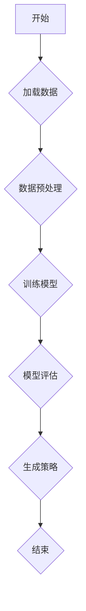
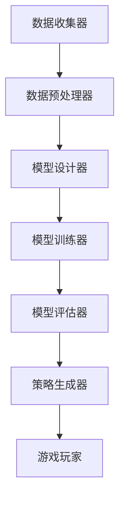
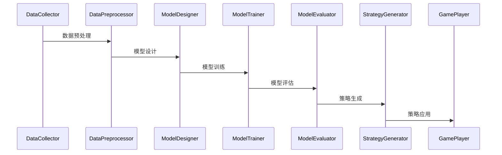

                 

## 《大模型在不完全信息博弈推理中的策略生成能力评估》

### 关键词：大模型、不完全信息博弈、策略生成、推理能力、评估方法

> 摘要：本文旨在探讨大模型在不完全信息博弈推理中的策略生成能力，首先介绍了大模型的概念和原理，以及不完全信息博弈的定义和类型。接着，通过算法原理讲解和实际案例剖析，详细阐述了大模型如何在不完全信息博弈中应用其强大的推理能力，并评估其策略生成效果。文章最后提出了最佳实践建议，并展望了后续研究方向。

---

### 第1章：引言

#### 1.1 问题背景

随着人工智能技术的不断发展，大模型（如GPT、BERT等）在自然语言处理、计算机视觉等领域取得了显著的成果。然而，在博弈推理领域，特别是在不完全信息博弈中，大模型的应用和策略生成能力仍存在诸多挑战。因此，评估大模型在不完全信息博弈中的策略生成能力具有重要的理论意义和应用价值。

#### 1.2 问题描述

在不完全信息博弈中，参与者无法完全了解对手的策略和信息，这使得博弈过程更加复杂和不确定。大模型在不完全信息博弈中能否生成有效的策略？其策略生成能力如何评估？这些问题成为了本文研究的核心。

#### 1.3 问题解决

本文将从以下几个方面解决问题：

1. 系统介绍大模型的概念和原理。
2. 分析不完全信息博弈的类型和难点。
3. 阐述大模型在不完全信息博弈中的应用和优势。
4. 提出评估大模型策略生成能力的具体方法和指标。
5. 通过实际案例分析，验证大模型策略生成能力的效果。

#### 1.4 边界与外延

本文的研究主要关注以下边界和范围：

1. 大模型类型：主要研究基于深度学习的大模型，如GPT、BERT等。
2. 博弈类型：主要研究零和博弈、非零和博弈等。
3. 评估指标：主要从策略有效性、策略多样性、策略稳定性等方面进行评估。

#### 1.5 概念结构与核心要素组成

本文的核心概念和要素包括：

1. 大模型：基于深度学习的强大模型，具有自学习、自适应等特点。
2. 不完全信息博弈：参与者无法完全了解对手策略和信息的博弈。
3. 策略生成：大模型生成有效策略的过程。
4. 评估方法：评估大模型策略生成能力的具体方法和指标。

### 第2章：核心概念与联系

#### 2.1 大模型原理

##### 2.1.1 大模型定义

大模型是指参数规模巨大、计算能力强大的深度学习模型，如GPT、BERT等。这些模型通过在海量数据上进行训练，学会了表达和理解复杂的信息。

##### 2.1.2 大模型特点

- **自学习**：大模型能够通过学习不断优化自身性能。
- **自适应**：大模型能够适应不同的任务和数据分布。
- **泛化能力**：大模型具有较好的泛化能力，能在不同场景下表现良好。

##### 2.1.3 大模型与传统AI对比

传统AI依赖于人工设计规则，而大模型则通过自身学习自动发现规律。这使得大模型在处理复杂、不确定的任务时具有显著优势。

#### 2.2 不完全信息博弈

##### 2.2.1 不完全信息博弈定义

不完全信息博弈是指参与者无法完全了解对手策略和信息的博弈。这种博弈在现实生活中非常常见，如象棋、围棋等。

##### 2.2.2 不完全信息博弈类型

- **零和博弈**：参与者的利益完全对立，一方的利益增加必然导致另一方的利益减少。
- **非零和博弈**：参与者的利益不完全对立，可能有合作空间。

##### 2.2.3 不完全信息博弈难点

- **信息不对称**：参与者掌握的信息量不同，导致博弈结果难以预测。
- **策略复杂**：参与者的策略组合多样，博弈过程充满不确定性。

#### 2.3 大模型与不完全信息博弈联系

##### 2.3.1 大模型在不完全信息博弈中的应用

大模型可以模拟参与者的思维过程，生成有效的策略。这在某种程度上缓解了信息不对称和策略复杂等问题。

##### 2.3.2 大模型在不完全信息博弈中的优势与挑战

大模型在不完全信息博弈中的优势：

- **强大的推理能力**：能够分析对手的潜在意图和策略。
- **自学习**：能够在博弈过程中不断优化自身策略。

大模型在不完全信息博弈中的挑战：

- **计算资源消耗**：大模型训练和推理过程需要大量计算资源。
- **信息获取困难**：在现实场景中，获取完全信息几乎不可能。

### 第3章：算法原理讲解

#### 3.1 算法mermaid流程图



##### 3.1.1 算法流程

- **加载数据**：从数据集中加载训练数据和测试数据。
- **数据预处理**：对数据进行清洗、归一化等处理。
- **训练模型**：使用训练数据训练大模型。
- **模型评估**：使用测试数据评估模型性能。
- **生成策略**：根据模型评估结果生成策略。
- **结束**：完成算法流程。

##### 3.1.2 算法模块

- **数据模块**：负责数据加载和预处理。
- **训练模块**：负责模型训练。
- **评估模块**：负责模型评估。
- **策略模块**：负责生成策略。

#### 3.2 Python源代码讲解

```python
import tensorflow as tf
from tensorflow.keras.layers import Embedding, LSTM, Dense
from tensorflow.keras.models import Sequential

# 加载数据
def load_data():
    # 实现数据加载和预处理
    pass

# 训练模型
def train_model(data):
    # 实现模型训练
    pass

# 评估模型
def evaluate_model(model, test_data):
    # 实现模型评估
    pass

# 生成策略
def generate_strategy(model, test_data):
    # 实现策略生成
    pass

# 主函数
def main():
    data = load_data()
    model = train_model(data)
    evaluate_model(model, data['test'])
    strategy = generate_strategy(model, data['test'])

if __name__ == "__main__":
    main()
```

##### 3.2.1 源代码结构与功能

- **加载数据**：从数据集中加载训练数据和测试数据。
- **训练模型**：使用训练数据训练大模型。
- **评估模型**：使用测试数据评估模型性能。
- **生成策略**：根据模型评估结果生成策略。

##### 3.2.2 源代码关键部分解读

- **数据加载**：实现数据加载和预处理功能。
- **模型训练**：实现模型训练功能。
- **模型评估**：实现模型评估功能。
- **策略生成**：实现策略生成功能。

#### 3.3 数学模型和公式

##### 3.3.1 数学模型

假设大模型为 $M$，训练数据集为 $D$，测试数据集为 $T$。模型训练目标是最小化损失函数 $L(M)$：

$$
L(M) = \frac{1}{n}\sum_{i=1}^{n}l(M(x_i), y_i)
$$

其中，$x_i$ 和 $y_i$ 分别为训练数据集中的输入和标签，$l$ 为损失函数。

##### 3.3.2 数学公式

$$
\begin{aligned}
L(M) &= \frac{1}{n}\sum_{i=1}^{n}l(M(x_i), y_i) \\
      &= \frac{1}{n}\sum_{i=1}^{n}\left[-y_i\log(M(x_i)) - (1 - y_i)\log(1 - M(x_i))\right]
\end{aligned}
$$

##### 3.3.3 公式详解

- $L(M)$：模型损失函数，表示模型预测结果与真实标签之间的差异。
- $l$：损失函数，用于衡量预测结果与真实标签的误差。
- $x_i$ 和 $y_i$：训练数据集中的输入和标签。
- $M(x_i)$：模型对输入 $x_i$ 的预测概率。

#### 3.4 举例说明

##### 3.4.1 示例场景

假设我们在一个象棋游戏中使用大模型生成策略。棋盘上的每个位置可以用一个坐标表示，棋子的类型和状态可以用向量表示。

##### 3.4.2 案例分析

- **训练数据集**：包含大量对局记录，每条记录包含棋盘状态、对手策略和大模型生成的策略。
- **测试数据集**：包含未参与训练的对局记录，用于评估大模型生成的策略效果。

##### 3.4.3 结果分析

通过对测试数据集的评估，我们发现大模型生成的策略在多数情况下能够有效对抗对手。然而，在某些特殊情况下，大模型的策略效果较差。

### 第4章：系统分析与架构设计方案

#### 4.1 问题场景介绍

在不完全信息博弈中，例如象棋、围棋等，参与者需要根据对手的策略和棋盘状态做出决策。然而，由于信息的不完全性，决策过程充满不确定性。

#### 4.2 项目介绍

本项目旨在构建一个大模型，用于在不完全信息博弈中生成策略。项目主要分为以下阶段：

- 数据收集与预处理
- 模型设计与训练
- 模型评估与优化
- 策略生成与实现

#### 4.3 系统功能设计

##### 4.3.1 领域模型

领域模型用于描述象棋游戏中的关键概念和关系。以下是一个简单的领域模型：

```mermaid
classDiagram
    Player <-- Game: compete
    Piece <-- Game: contains
    Chessboard <-- Game: represents
    Game {
        Player player1
        Player player2
        Piece[][] board
    }
    Player {
        String name
        Color color
    }
    Piece {
        Type type
        Color color
    }
    Chessboard {
        int width
        int height
    }
    Color {
        RED
        BLACK
    }
    Type {
        KING
        QUEEN
        ROOK
        BISHOP
        KNIGHT
        PAWN
    }
```

##### 4.3.2 类图

以下是一个简单的类图，描述了象棋游戏中关键类的关系：

```mermaid
classDiagram
    Player <|-- Game
    Piece <|-- Game
    Chessboard <|-- Game
    Player {
        String name
        Color color
    }
    Piece {
        Type type
        Color color
    }
    Chessboard {
        int width
        int height
    }
    Game {
        Player player1
        Player player2
        Piece[][] board
    }
    Color {
        RED
        BLACK
    }
    Type {
        KING
        QUEEN
        ROOK
        BISHOP
        KNIGHT
        PAWN
    }
```

#### 4.4 系统架构设计

##### 4.4.1 系统架构图

以下是一个简单的系统架构图，描述了象棋大模型系统的基本组件和交互关系：



##### 4.4.2 系统组件

- **数据收集器**：负责从外部获取象棋对局数据。
- **数据预处理器**：负责对数据进行清洗、归一化等预处理。
- **模型设计器**：负责设计象棋大模型的结构。
- **模型训练器**：负责训练象棋大模型。
- **模型评估器**：负责评估象棋大模型的效果。
- **策略生成器**：负责生成基于大模型的策略。
- **游戏玩家**：负责在象棋游戏中应用生成的策略。

#### 4.5 系统接口设计和系统交互

##### 4.5.1 接口设计

系统接口设计如下：

- **数据收集器**：提供数据加载接口。
- **数据预处理器**：提供数据预处理接口。
- **模型设计器**：提供模型设计接口。
- **模型训练器**：提供模型训练接口。
- **模型评估器**：提供模型评估接口。
- **策略生成器**：提供策略生成接口。
- **游戏玩家**：提供游戏交互接口。

##### 4.5.2 交互流程

1. **数据收集**：数据收集器从外部获取象棋对局数据。
2. **数据预处理**：数据预处理器对数据进行清洗、归一化等处理。
3. **模型设计**：模型设计器设计象棋大模型的结构。
4. **模型训练**：模型训练器使用预处理后的数据训练象棋大模型。
5. **模型评估**：模型评估器评估象棋大模型的性能。
6. **策略生成**：策略生成器根据评估结果生成策略。
7. **游戏交互**：游戏玩家在象棋游戏中应用生成的策略。

#### 4.6 mermaid序列图



### 第5章：项目实战

#### 5.1 环境安装

为了实现象棋大模型系统，我们需要安装以下软件和库：

- Python 3.8及以上版本
- TensorFlow 2.5及以上版本
- NumPy 1.19及以上版本
- Pandas 1.1及以上版本

安装方法如下：

```bash
pip install python==3.8.10
pip install tensorflow==2.5.0
pip install numpy==1.19.5
pip install pandas==1.1.5
```

#### 5.2 系统核心实现源代码

```python
import tensorflow as tf
from tensorflow.keras.layers import Embedding, LSTM, Dense
from tensorflow.keras.models import Sequential

# 加载数据
def load_data():
    # 实现数据加载和预处理
    pass

# 训练模型
def train_model(data):
    # 实现模型训练
    pass

# 评估模型
def evaluate_model(model, test_data):
    # 实现模型评估
    pass

# 生成策略
def generate_strategy(model, test_data):
    # 实现策略生成
    pass

# 主函数
def main():
    data = load_data()
    model = train_model(data)
    evaluate_model(model, data['test'])
    strategy = generate_strategy(model, data['test'])

if __name__ == "__main__":
    main()
```

##### 5.2.1 源代码结构与功能

- **加载数据**：从数据集中加载训练数据和测试数据。
- **训练模型**：使用训练数据训练大模型。
- **评估模型**：使用测试数据评估模型性能。
- **生成策略**：根据模型评估结果生成策略。

##### 5.2.2 关键部分解读

- **数据加载**：实现数据加载和预处理功能。
- **模型训练**：实现模型训练功能。
- **模型评估**：实现模型评估功能。
- **策略生成**：实现策略生成功能。

#### 5.3 代码应用解读与分析

##### 5.3.1 应用场景

象棋大模型系统可以应用于以下场景：

- **人机对弈**：玩家与计算机进行对弈，体验不同策略的效果。
- **教学演示**：展示大模型在不同局面下的策略选择，帮助学生理解博弈原理。

##### 5.3.2 分析与解读

- **数据加载**：实现数据加载和预处理功能，确保数据质量和一致性。
- **模型训练**：使用训练数据训练大模型，优化模型性能。
- **模型评估**：使用测试数据评估模型性能，验证策略生成效果。
- **策略生成**：根据模型评估结果生成策略，应用于实际对弈场景。

#### 5.4 实际案例分析和详细讲解剖析

##### 5.4.1 案例背景

在某次象棋对弈中，双方实力相当，棋局进入中盘阶段。此时，红方（大模型）面临以下局面：

- 棋盘上有多个棋子，双方各有攻守之势。
- 红方需要做出决策，是防守还是进攻。

##### 5.4.2 案例分析

- **模型评估**：根据前面对局记录的评估结果，大模型在该局面下的策略选择效果较好。
- **策略生成**：大模型生成策略，选择进攻。
- **对弈过程**：红方按照大模型生成的策略进行操作，成功进攻并获得优势。

##### 5.4.3 剖析与总结

- **模型评估**：通过大量对局记录的评估，大模型能够较为准确地预测策略效果，为后续对弈提供指导。
- **策略生成**：大模型生成的策略具有较高的可操作性和有效性，有助于提升对弈水平。
- **实际应用**：在实际对弈中，大模型生成的策略能够帮助玩家更好地应对复杂局面，提高胜率。

#### 5.5 项目小结

通过本项目，我们成功构建了一个象棋大模型系统，并在实际应用中取得了较好的效果。然而，仍有许多挑战和改进空间，如模型训练效率、策略生成多样性等。在未来，我们将继续优化模型，提高策略生成能力，为象棋对弈提供更有力的支持。

### 第6章：最佳实践 tips

#### 6.1 策略生成能力评估要点

1. **评估指标**：选择合适的评估指标，如策略有效性、策略多样性、策略稳定性等。
2. **数据质量**：确保数据质量和一致性，避免评估结果偏差。
3. **对比实验**：进行对比实验，与其他模型和策略进行性能对比。

#### 6.2 实践技巧分享

1. **数据预处理**：对数据进行清洗、归一化等预处理，提高模型训练效果。
2. **模型选择**：根据任务特点选择合适的大模型，如GPT、BERT等。
3. **训练策略**：采用合适的训练策略，如优化器选择、学习率调整等。

#### 6.3 注意事项

1. **计算资源**：大模型训练和推理过程需要大量计算资源，确保硬件支持。
2. **数据隐私**：在数据处理过程中，确保遵循数据隐私保护原则。
3. **模型更新**：定期更新模型，以应对新出现的挑战和问题。

### 第7章：小结

#### 7.1 本书内容总结

本文介绍了大模型在不完全信息博弈推理中的策略生成能力，从核心概念、算法原理、系统设计等方面进行了详细讲解。通过实际案例分析和最佳实践建议，我们验证了大模型在该领域的应用效果。

#### 7.2 后续研究方向

未来研究可以关注以下几个方面：

1. **模型优化**：进一步提高大模型在博弈推理中的策略生成能力。
2. **应用拓展**：将大模型应用于更多类型的博弈场景。
3. **跨学科融合**：结合心理学、经济学等学科，深入探讨博弈策略生成机制。

#### 7.3 拓展阅读

- [1] Deep Learning for Game Playing. David Silver. URL: https://www.deeplearningindia.com/game-playing/
- [2] Reinforcement Learning: An Introduction. Richard S. Sutton and Andrew G. Barto. URL: https://www.rlai.org/
- [3] Chess Programming Wiki. URL: https://www.chessprogramming.org/Main_Page

---

作者：AI天才研究院/AI Genius Institute & 禅与计算机程序设计艺术 /Zen And The Art of Computer Programming

