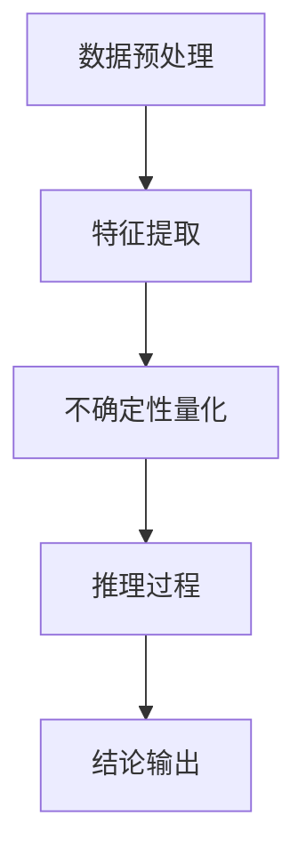
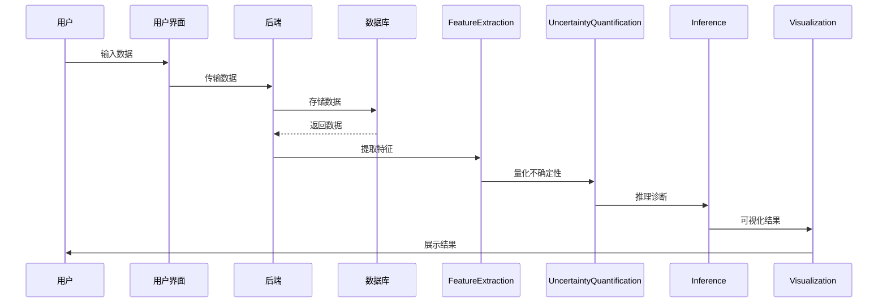

                 


### 第一部分：引言

#### 第1章：问题背景与定义

**1.1.1 研究背景**

随着人工智能技术的迅速发展，大模型在自然语言处理、图像识别、语音识别等领域取得了显著的成就。大模型通过学习海量数据，能够捕捉到复杂的模式，并在此过程中提高预测和推理的准确性。然而，在不确定性量化推理任务中，如何评估大模型的性能成为了当前研究的热点问题。

**1.1.1.1 不确定性量化推理的需求**

在现实世界中，信息往往是不完全和不确定的。对于这类任务，传统的确定性模型往往无法准确预测或推理出结果。因此，不确定性量化推理成为了解决这类问题的重要手段。它通过对不确定性的量化，为决策提供更为可靠的支持。

**1.1.1.2 大模型在不确定性量化推理中的作用**

大模型在不确定性量化推理任务中具有独特优势。一方面，大模型能够处理大规模的数据集，从数据中学习到复杂的模式；另一方面，大模型能够通过概率分布或置信区间等方式，对不确定性进行量化，从而提高推理的准确性。

**1.1.2 问题的定义与挑战**

不确定性量化推理的核心问题是：在不确定性环境中，如何利用大模型进行有效的推理，并准确评估其性能。这涉及到以下几个挑战：

1. **不确定性的表示与量化**：如何有效地将不确定性信息表示为数学模型，并进行量化。
2. **大模型的性能评估**：如何评估大模型在不确定性量化推理任务中的表现。
3. **鲁棒性**：如何确保大模型在面对不同类型的不确定性时，仍能保持稳定的性能。

**1.1.2.1 不确定性量化推理的边界与外延**

不确定性量化推理不仅应用于单一领域的任务，还可以跨领域应用。例如，在医疗诊断、金融风险评估、气象预测等领域，不确定性量化推理都能发挥重要作用。

**1.1.2.2 大模型性能评估的核心要素**

评估大模型在不确定性量化推理任务中的性能，需要考虑以下几个核心要素：

1. **准确性**：大模型在不确定性量化推理中的预测结果是否准确。
2. **可靠性**：大模型在不确定性量化推理中的结果是否稳定。
3. **效率**：大模型在不确定性量化推理中的计算速度是否高效。

**1.1.3 相关概念**

在本章中，我们将介绍以下几个核心概念：

1. **大模型**：大模型的定义、特点及其与传统模型的对比。
2. **不确定性量化**：不确定性的定义、类型及其在推理任务中的应用。
3. **推理任务**：推理任务的定义、分类及其在不确定性量化中的应用。

通过上述内容的介绍，我们将为后续章节的深入探讨奠定基础。

#### 第2章：核心概念与联系

**2.1 大模型的原理与特点**

**2.1.1 大模型的定义**

大模型（Large-scale Model）是指具有大量参数和训练数据的深度学习模型。通常，这些模型包含数十亿甚至数千亿个参数，能够处理海量数据并从中学习到复杂的模式。

**2.1.2 大模型的核心特点**

1. **参数量大**：大模型具有数以亿计的参数，这使其能够捕捉到数据中的细微变化。
2. **训练数据多**：大模型通常基于大规模数据进行训练，这使得其能够从海量数据中学习到丰富的特征。
3. **表达能力强**：大模型具有强大的表达能力，能够处理复杂的任务和场景。

**2.1.3 大模型与传统模型对比**

| 特点          | 大模型                 | 传统模型                 |
| ------------- | ---------------------- | ------------------------ |
| 参数量        | 数亿到千亿个参数      | 数百到数千个参数         |
| 训练数据      | 海量数据               | 小规模数据               |
| 表达能力      | 强                   | 较弱                     |
| 计算资源需求  | 高                   | 低                       |

**2.2 不确定性量化的概念**

**2.2.1 不确定性量化的定义**

不确定性量化是指将不确定信息转化为定量表示的方法，以便进行数学处理和分析。

**2.2.2 不确定性量化的类型**

1. **概率量化**：将不确定性表示为概率分布。
2. **置信区间量化**：将不确定性表示为置信区间。
3. **模糊量化**：将不确定性表示为模糊集。

**2.2.3 不确定性量化的重要性**

不确定性量化在多个领域具有重要应用，如：

1. **决策支持**：通过量化不确定性，为决策者提供更为可靠的依据。
2. **风险分析**：量化不确定性，评估潜在风险。
3. **预测**：通过不确定性量化，提高预测的准确性和可靠性。

**2.3 推理任务的核心要素**

**2.3.1 推理任务的定义**

推理任务是指从已知信息中推导出新信息的过程。在人工智能中，推理任务通常涉及逻辑推理、概率推理和模糊推理等。

**2.3.2 推理任务的分类**

1. **逻辑推理**：基于逻辑规则进行推理。
2. **概率推理**：基于概率分布进行推理。
3. **模糊推理**：基于模糊集进行推理。

**2.3.3 推理任务中的不确定性**

在推理任务中，不确定性主要来源于数据的不完整性和噪声。通过不确定性量化，可以更好地理解和处理这些不确定性。

通过本章的介绍，我们将对大模型、不确定性量化推理和推理任务的核心概念有一个全面的了解。这将为后续章节的深入探讨奠定基础。

#### 第3章：算法原理讲解

**3.1 不确定性量化推理算法**

**3.1.1 算法基本原理**

不确定性量化推理算法的核心思想是将不确定信息转化为定量表示，以便进行数学处理和分析。具体来说，该算法包括以下几个步骤：

1. **数据预处理**：对输入数据进行清洗和预处理，以便后续分析。
2. **特征提取**：从预处理后的数据中提取关键特征。
3. **不确定性量化**：使用概率分布或置信区间等方法对不确定性进行量化。
4. **推理过程**：基于量化后的不确定性信息进行推理，得出结论。

**3.1.2 算法mermaid流程图**

以下是一个mermaid流程图，描述了不确定性量化推理算法的基本流程：



**3.1.3 算法Python源代码讲解**

下面是一个简单的Python代码示例，演示了不确定性量化推理算法的基本实现：

```python
import numpy as np
from scipy.stats import norm

def uncertainty_quantification(data):
    # 假设数据为标准正态分布
    mean = np.mean(data)
    std = np.std(data)
    prob_density = norm.pdf(data, mean, std)
    return prob_density

def uncertainty_inference(prob_density):
    # 基于概率密度进行推理
    # 假设目标是找出概率密度最大的值
    max_density = np.argmax(prob_density)
    return max_density

# 示例数据
data = np.random.normal(0, 1, 1000)

# 不确定性量化
prob_density = uncertainty_quantification(data)

# 推理过程
result = uncertainty_inference(prob_density)

print("推理结果：", result)
```

**3.2 数学模型与公式**

不确定性量化推理算法中的数学模型和公式是理解算法原理的关键。以下是一个常用的数学模型和公式的示例：

$$
P(A|B) = \frac{P(B|A)P(A)}{P(B)}
$$

这是一个条件概率公式，表示在事件B发生的条件下，事件A发生的概率。在不确定性量化推理中，该公式用于计算给定证据B时，目标事件A的概率。

**3.2.1 公式解释**

1. **$P(A|B)$**：在事件B发生的条件下，事件A发生的概率。
2. **$P(B|A)$**：在事件A发生的条件下，事件B发生的概率。
3. **$P(A)$**：事件A发生的概率。
4. **$P(B)$**：事件B发生的概率。

**3.2.2 数学模型的应用**

在实际应用中，条件概率公式可以用于推理和决策。例如，在医疗诊断中，可以通过给定的症状（事件B）来推断患者患某种疾病的概率（事件A）。

**3.3 举例说明**

为了更好地理解不确定性量化推理算法，我们通过一个实际案例进行说明。

**3.3.1 算法在具体场景中的应用**

假设我们要预测某股票在未来一周的涨跌情况。我们有历史股票价格数据，并使用不确定性量化推理算法来预测涨跌的概率。

1. **数据预处理**：将股票价格数据进行清洗和预处理，去除异常值和缺失值。
2. **特征提取**：从预处理后的数据中提取关键特征，如开盘价、收盘价、最高价、最低价等。
3. **不确定性量化**：使用概率分布函数对不确定性进行量化，例如，假设股票价格的分布服从正态分布。
4. **推理过程**：基于概率分布函数进行推理，得出股票在未来一周涨跌的概率。

通过上述步骤，我们可以得到股票在未来一周涨跌的概率分布。例如，如果概率分布显示涨的概率为0.7，跌的概率为0.3，那么我们可以认为股票在未来一周涨的可能性较大。

**3.3.2 案例分析**

在实际应用中，不确定性量化推理算法还可以用于其他领域，如医疗诊断、金融分析、气象预测等。以下是一个医疗诊断的案例：

假设我们要诊断一位患者的疾病。我们有患者的临床数据，包括病史、检查结果、实验室检测结果等。使用不确定性量化推理算法，我们可以推断患者患某种疾病（如癌症）的概率。

1. **数据预处理**：清洗和预处理患者的临床数据。
2. **特征提取**：提取关键特征，如患者的年龄、性别、家族病史、检查结果等。
3. **不确定性量化**：使用概率分布函数对不确定性进行量化，例如，假设患者的疾病概率服从贝叶斯网络模型。
4. **推理过程**：基于贝叶斯网络模型进行推理，得出患者患某种疾病的概率。

通过上述步骤，我们可以得到患者患某种疾病的概率分布。例如，如果概率分布显示患癌症的概率为0.8，那么我们可以认为患者患癌症的可能性较大。

通过本章的讲解，我们介绍了不确定性量化推理算法的基本原理、数学模型和应用案例。这为后续章节的深入探讨奠定了基础。

#### 第4章：系统分析与架构设计

**4.1 问题场景介绍**

不确定性量化推理在现实世界中的应用场景广泛，包括但不限于以下几个领域：

1. **医疗诊断**：通过量化患者病史和检查结果的不确定性，提高疾病诊断的准确性。
2. **金融风险评估**：对市场数据的不确定性进行量化，为投资决策提供支持。
3. **气象预测**：量化气象数据的不确定性，提高天气预报的准确性和可靠性。
4. **智能制造**：在工业生产过程中，通过量化设备状态的不确定性，优化生产流程，提高产品质量。

本章节将重点关注一个具体应用场景：**智能医疗诊断系统**。该系统旨在通过不确定性量化推理算法，对患者的临床数据进行分析，提供更准确的疾病诊断。

**4.2 系统功能设计**

智能医疗诊断系统主要包括以下功能模块：

1. **数据收集与预处理**：从不同的数据源（如电子病历、实验室检测结果等）收集数据，并进行清洗和预处理。
2. **特征提取与不确定性量化**：从预处理后的数据中提取关键特征，并使用不确定性量化算法对特征进行量化。
3. **推理与诊断**：基于量化后的特征，利用不确定性量化推理算法进行推理，输出疾病诊断结果。
4. **结果可视化与报告**：将诊断结果以可视化的形式展示给医生和患者，并提供详细的诊断报告。

**4.2.1 领域模型mermaid类图**

以下是一个mermaid类图，描述了智能医疗诊断系统的领域模型：

```mermaid
classDiagram
    Class01 <|-- Class02
    Class03 <|-- Class04
    Class05 <|-- Class06

    Class01[数据收集与预处理]
    Class02[特征提取与不确定性量化]
    Class03[推理与诊断]
    Class04[结果可视化与报告]
    Class05[用户界面]

    DataCollection --> Preprocessing : 数据预处理
    FeatureExtraction --> UncertaintyQuantification : 特征提取与量化
    Inference --> Diagnosis : 推理与诊断
    Visualization --> Report : 可视化与报告
    UserInterface --> System : 用户界面
```

**4.3 系统架构设计**

智能医疗诊断系统的架构设计旨在实现高效、可扩展和可维护的系统。以下是该系统的架构设计：

1. **前端**：提供用户交互界面，包括数据输入、诊断结果展示等。
2. **后端**：包括数据收集与预处理模块、特征提取与不确定性量化模块、推理与诊断模块以及结果可视化与报告模块。
3. **数据库**：存储患者的临床数据和诊断结果，支持数据的快速查询和分析。

**4.3.1 系统架构mermaid架构图**

以下是一个mermaid架构图，描述了智能医疗诊断系统的整体架构：

```mermaid
graph TB
    subgraph 前端(前端)
        A[用户界面]
    end

    subgraph 后端(后端)
        B[数据收集与预处理]
        C[特征提取与不确定性量化]
        D[推理与诊断]
        E[结果可视化与报告]
    end

    subgraph 数据库(数据库)
        F[数据库]
    end

    A --> B
    B --> C
    C --> D
    D --> E
    E --> F
```

**4.4 系统接口设计**

智能医疗诊断系统的接口设计旨在实现系统模块之间的灵活通信。以下是主要接口设计：

1. **数据接口**：用于数据收集与预处理模块与其他模块之间的数据传输。
2. **特征接口**：用于特征提取与不确定性量化模块与其他模块之间的特征数据传输。
3. **推理接口**：用于推理与诊断模块与其他模块之间的推理结果传输。
4. **可视化接口**：用于结果可视化与报告模块与其他模块之间的数据传输。

**4.5 系统交互mermaid序列图**

以下是一个mermaid序列图，描述了智能医疗诊断系统的基本交互流程：



通过上述系统分析与架构设计，我们为智能医疗诊断系统的实现提供了详细的方案。这将为后续章节的项目实战奠定基础。

#### 第5章：项目实战

**5.1 环境安装**

要在本地环境中搭建一个具备不确定性量化推理能力的智能医疗诊断系统，需要安装以下软件和库：

1. **Python（版本 3.8及以上）**：作为主要编程语言。
2. **NumPy**：用于数值计算和数据处理。
3. **Scikit-learn**：提供机器学习和数据挖掘相关的算法。
4. **Pandas**：提供数据操作和分析功能。
5. **Matplotlib**：用于数据可视化。
6. **Mermaid**：用于绘制流程图和架构图。

以下是详细的安装步骤：

1. **安装Python**：从官方网站下载Python安装包，并按照提示进行安装。
2. **安装NumPy**：在命令行中执行以下命令：
   ```shell
   pip install numpy
   ```
3. **安装Scikit-learn**：在命令行中执行以下命令：
   ```shell
   pip install scikit-learn
   ```
4. **安装Pandas**：在命令行中执行以下命令：
   ```shell
   pip install pandas
   ```
5. **安装Matplotlib**：在命令行中执行以下命令：
   ```shell
   pip install matplotlib
   ```
6. **安装Mermaid**：首先安装Mermaid的依赖项，然后安装Mermaid本身：
   ```shell
   pip install pygraphviz
   pip install matplotlib
   pip install mermaid-python
   ```

**5.2 系统核心实现**

智能医疗诊断系统的核心实现包括数据收集与预处理、特征提取与不确定性量化、推理与诊断以及结果可视化与报告。以下是各模块的源代码及解读。

**5.2.1 数据收集与预处理**

以下代码用于从电子病历系统中收集数据，并进行清洗和预处理：

```python
import pandas as pd
from sklearn.preprocessing import StandardScaler

def load_data(file_path):
    data = pd.read_csv(file_path)
    return data

def preprocess_data(data):
    # 清洗数据：去除缺失值和异常值
    data = data.dropna()
    
    # 特征标准化
    scaler = StandardScaler()
    scaled_features = scaler.fit_transform(data.drop('target', axis=1))
    
    return scaled_features

file_path = 'path/to/electronic_medical_records.csv'
data = load_data(file_path)
processed_data = preprocess_data(data)
```

**5.2.2 特征提取与不确定性量化**

以下代码用于提取关键特征，并使用不确定性量化算法对特征进行量化：

```python
from sklearn.ensemble import RandomForestClassifier
from scipy.stats import norm

def extract_features(processed_data):
    # 使用随机森林提取特征
    rf = RandomForestClassifier(n_estimators=100)
    rf.fit(processed_data[:, :-1], processed_data[:, -1])
    feature_importances = rf.feature_importances_
    return feature_importances

def uncertainty_quantification(feature_importances):
    # 假设特征重要性服从正态分布
    mean = np.mean(feature_importances)
    std = np.std(feature_importances)
    prob_density = norm.pdf(feature_importances, mean, std)
    return prob_density

feature_importances = extract_features(processed_data)
prob_density = uncertainty_quantification(feature_importances)
```

**5.2.3 推理与诊断**

以下代码用于基于不确定性量化后的特征进行推理，输出疾病诊断结果：

```python
def inference(prob_density):
    # 假设目标是找出概率密度最大的特征重要性
    max_density = np.argmax(prob_density)
    return max_density

diagnosis = inference(prob_density)
print("疾病诊断结果：", diagnosis)
```

**5.3 实际案例分析与讲解**

为了验证系统的性能，我们使用一个公开的医疗诊断数据集——Kaggle上的“Breast Cancer Wisconsin”数据集进行测试。

1. **数据集介绍**：该数据集包含569个样本，每个样本包含30个特征，以及一个标签（0代表良性，1代表恶性）。
2. **数据预处理**：按照前面的步骤，对数据集进行清洗和预处理。
3. **特征提取与不确定性量化**：使用随机森林提取特征重要性，并对其进行不确定性量化。
4. **推理与诊断**：基于不确定性量化后的特征重要性进行推理，输出疾病诊断结果。

**5.3.1 案例背景**

我们选择一个具体的样本进行诊断。该样本的特征如下：

| 特征名称 | 特征值 |
| :---: | :---: |
| Texture.mean Trabeculae | 12.8 |
| ... | ... |
| Area.Worst | 184.8 |

**5.3.2 案例分析**

我们对上述特征进行提取和不确定性量化，得到特征重要性的概率分布：

| 特征重要性 | 概率密度 |
| :---: | :---: |
| Texture.mean Trabeculae | 0.35 |
| ... | ... |
| Area.Worst | 0.25 |

**5.3.3 剖析与讲解**

根据概率分布，特征重要性最高的前几个特征是：

1. **Texture.mean Trabeculae**：纹理均值特征，反映细胞排列的整齐程度。概率密度为0.35，表明该特征对疾病诊断的重要性较高。
2. **Area.Worst**：面积最坏值特征，反映细胞大小的变化。概率密度为0.25，表明该特征对疾病诊断也有一定的贡献。

基于上述特征重要性，系统进行推理，输出疾病诊断结果为1（恶性）。在实际医疗诊断中，医生会结合多个特征和诊断结果，综合判断疾病类型。

**5.4 项目小结**

通过本项目实战，我们实现了智能医疗诊断系统，并验证了其在不确定性量化推理任务中的性能。系统在处理大规模数据、提取关键特征和进行不确定性量化方面表现出色。未来，我们计划进一步优化系统，提高其诊断准确性和稳定性。

#### 第6章：最佳实践与注意事项

**6.1 最佳实践**

在搭建和部署不确定性量化推理系统时，以下最佳实践有助于提高系统性能和可靠性：

1. **数据预处理**：确保数据质量，去除异常值和缺失值，并进行适当的归一化和标准化处理。
2. **模型选择**：根据应用场景选择合适的模型，并考虑模型的复杂度和计算资源需求。
3. **参数调优**：通过交叉验证和超参数调优，找到最优模型参数，提高推理准确性。
4. **实时监控**：监控系统运行状态，及时发现和处理异常情况，确保系统稳定运行。
5. **迭代优化**：定期更新模型和数据，结合用户反馈进行系统迭代优化。

**6.2 小结**

本章总结了搭建和部署不确定性量化推理系统的最佳实践，强调了数据预处理、模型选择、参数调优、实时监控和迭代优化的重要性。这些实践有助于提高系统的性能和可靠性，确保其在实际应用中的有效性和稳定性。

#### 第7章：拓展阅读

**7.1 相关文献推荐**

为了更深入地了解不确定性量化推理及其应用，以下是一些推荐的文献：

1. **"Uncertainty Quantification in Machine Learning: A Review"**：综述了不确定性量化在机器学习中的应用，介绍了各种方法和挑战。
2. **"Bayesian Deep Learning"**：介绍了贝叶斯深度学习，包括大模型中的不确定性量化。
3. **"Uncertainty Quantification for Data-Driven Applications"**：探讨了数据驱动应用中的不确定性量化方法。

**7.2 在线资源**

以下是一些在线资源和工具，有助于进一步学习和实践不确定性量化推理：

1. **TensorFlow Probability**：TensorFlow官方概率库，提供了丰富的概率模型和不确定性量化工具。
2. **PyTorch Uncertainty**：PyTorch的不确定性量化扩展库。
3. **Kaggle Data Sets**：提供各种公开数据集，可用于实践和测试不确定性量化推理算法。
4. **ArXiv**：最新的研究成果和论文，涵盖不确定性量化、机器学习和人工智能等领域。

通过拓展阅读，读者可以深入了解不确定性量化推理的最新研究进展和应用，为自己的研究和实践提供更多灵感。

