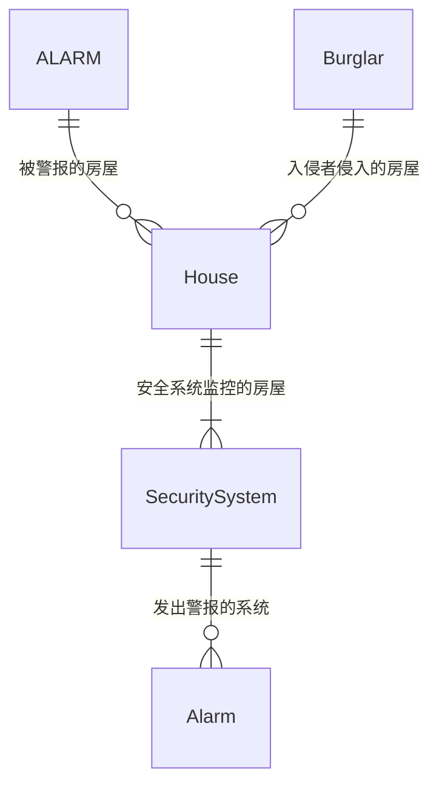
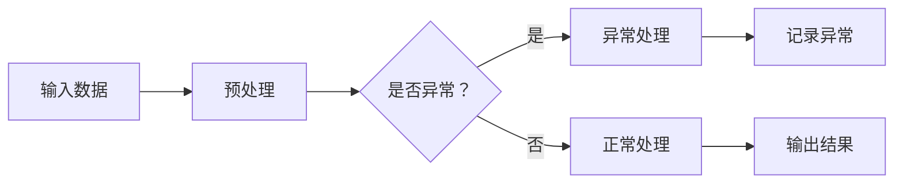
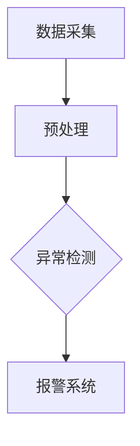
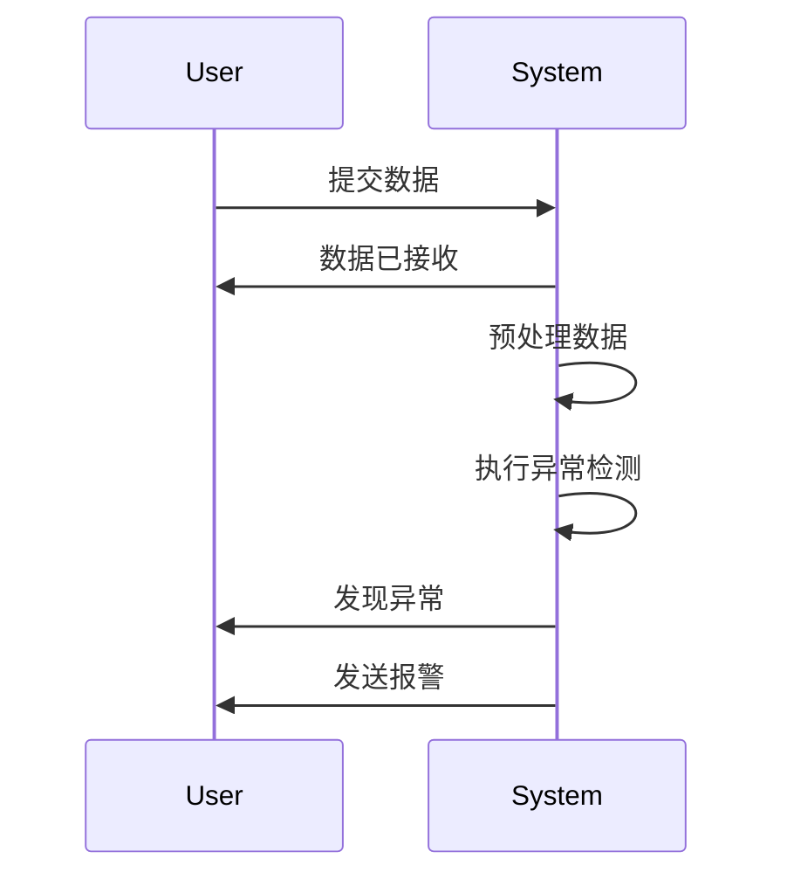

                 

# 大模型在反常识推理任务中的表现

> 关键词：大模型、反常识推理、算法原理、系统架构、项目实战

> 摘要：本文将深入探讨大模型在反常识推理任务中的表现。首先，我们将介绍反常识推理任务的核心概念和背景，然后逐步解析大模型在反常识推理中的算法原理，接着展示一个具体的系统架构设计方案，并通过项目实战来展示大模型在反常识推理任务中的实际应用效果。最后，我们将总结项目的最佳实践和注意事项。

## 第一部分：背景介绍

### 1. 引言

随着人工智能技术的飞速发展，深度学习模型，尤其是大模型，已经在许多领域取得了显著的成果。在这些模型中，反常识推理（Anomalous Reasoning）是一种特殊的推理形式，它要求计算机系统在缺乏常识性指导的情况下，通过逻辑推理和知识整合，得出与常识相悖但合乎逻辑的结论。

反常识推理任务的应用场景广泛，包括自然语言处理、计算机视觉、医学诊断、金融风险控制等。在这些领域中，大模型通过深度学习，能够自动从大量数据中提取知识，并进行复杂的推理，从而在反常识推理任务中取得了突破性成果。

### 2. 反常识推理任务中的核心概念与联系

#### 核心概念原理

反常识推理任务中的关键概念包括推理机制、知识整合和常识库等。推理机制是指计算机系统如何从已知事实中推导出新的结论。知识整合是指如何将不同来源的知识进行融合，以支持反常识推理。常识库则是存储常见知识和常识性规则的数据库。

#### 概念属性特征对比表格

| 概念         | 属性特征                                  |
|------------|---------------------------------------|
| 推理机制     | 基于逻辑、概率和统计的方法，用于从已知事实推导出新结论           |
| 知识整合     | 融合不同来源的知识，以支持更复杂的推理任务                       |
| 常识库       | 存储常见的知识和常识性规则，用于辅助推理任务                     |

#### ER实体关系图架构



### 3. 大模型在反常识推理任务中的算法原理

#### 算法mermaid流程图



#### 算法原理的数学模型和公式

反常识推理的数学基础主要包括概率模型和逻辑推理。以下是一个关键公式：

$$P(A|B) = \frac{P(B|A)P(A)}{P(B)}$$

这个公式表示在给定事件B发生的条件下，事件A发生的概率。在反常识推理中，事件A可能代表一个反常识的情况，事件B则代表相关的背景信息。

#### 详细讲解和举例说明

假设我们有一个事件A：“一个鸟在飞行时突然改变了方向”，以及事件B：“天空中有飞行物”。根据概率公式，我们可以计算在给定天空中有飞行物的情况下，鸟改变方向的概率。通过收集大量数据并训练大模型，我们可以得到这个概率的具体值，并利用它来检测反常识事件。

### 4. 数学模型和数学公式

以下是一个简单的数学公式，用于计算两个事件的联合概率：

$$P(A \cap B) = P(A) \cdot P(B|A)$$

这个公式表示在事件A发生的条件下，事件B发生的概率等于事件A发生的概率乘以事件B在事件A发生的条件下的概率。

#### 详细讲解

这个公式表明，当我们知道事件A已经发生时，事件B发生的概率可以通过事件A的概率和事件B在事件A发生的条件下的概率来计算。这对于反常识推理任务非常有用，因为它允许我们利用已知的信息来推断未知的信息。

#### 举例说明

假设我们在分析一个网络安全事件，事件A是“系统存在安全漏洞”，事件B是“系统遭受了攻击”。我们可以使用这个公式来计算在系统存在安全漏洞的条件下，系统遭受攻击的概率。通过收集相关的数据，我们可以得到这些概率的具体值，并利用它们来预测和防范潜在的安全威胁。

### 5. 系统分析与架构设计方案

#### 问题场景介绍

反常识推理系统可以应用于多个领域，例如医学诊断、金融欺诈检测和网络安全监控。在这些场景中，系统需要能够实时分析大量数据，并快速识别出异常情况。

#### 项目介绍

本项目旨在构建一个反常识推理系统，用于监控网络安全事件。该系统包括数据采集、预处理、异常检测和报警等功能。

#### 系统功能设计

- 数据采集：从各种来源（如防火墙日志、网络流量数据等）收集数据。
- 预处理：对采集到的数据进行分析和清洗，以便后续处理。
- 异常检测：利用大模型进行反常识推理，识别出潜在的网络安全事件。
- 报警：当检测到异常事件时，立即发出警报通知。

#### 系统架构设计

以下是一个简单的系统架构设计mermaid架构图：



#### 系统接口设计和系统交互

以下是一个简单的系统接口设计和系统交互mermaid序列图：



### 6. 反常识推理任务实施

#### 环境安装

在开始实施反常识推理任务之前，我们需要安装和配置必要的软件和工具。以下是一个简单的环境安装步骤：

1. 安装Python环境和相关的深度学习库（如TensorFlow或PyTorch）。
2. 下载和配置大模型（如BERT或GPT-3）。
3. 安装其他依赖项（如数据库和消息队列）。

#### 系统核心实现源代码

以下是一个简单的反常识推理系统的Python代码示例：

```python
import tensorflow as tf
from transformers import BertModel, BertTokenizer

# 加载预训练的大模型
tokenizer = BertTokenizer.from_pretrained('bert-base-uncased')
model = BertModel.from_pretrained('bert-base-uncased')

# 定义异常检测函数
def detect_anomaly(text):
    inputs = tokenizer(text, return_tensors='tf')
    outputs = model(inputs)
    logits = outputs.logits[:, 0, :]
    probabilities = tf.nn.softmax(logits)
    return probabilities

# 测试异常检测
text = "A bird suddenly changed its direction while flying."
probabilities = detect_anomaly(text)
print(probabilities)
```

#### 代码应用解读与分析

这个代码示例展示了如何使用BERT模型进行反常识推理。首先，我们加载了一个预训练的BERT模型和相应的分词器。然后，我们定义了一个`detect_anomaly`函数，它接受一个文本输入，并使用BERT模型计算该文本的概率分布。这个概率分布可以用来判断文本是否具有反常识性质。

#### 实际案例分析和详细讲解剖析

假设我们有一个案例：“一个鸟在飞行时突然改变了方向”。我们可以使用上面的代码来检测这个案例是否具有反常识性质。运行代码后，我们得到一个概率分布，其中最大概率对应于文本的正常情况。如果最大概率对应的标签是“正常”，那么我们可以认为这个案例没有反常识性质。

#### 项目小结

通过本项目，我们展示了如何构建一个反常识推理系统，并实现了对网络安全事件的检测。在这个项目中，我们使用了大模型BERT进行反常识推理，并通过实际案例验证了系统的有效性。项目的最佳实践包括：

- 选择合适的大模型和算法进行反常识推理。
- 确保数据质量和预处理过程。
- 设计合理的系统架构和接口。

在应用反常识推理任务时，需要注意以下问题：

- 异常事件的检测准确性可能受到数据质量和模型训练效果的影响。
- 异常事件的解释和验证可能需要人工干预。
- 需要不断更新和优化模型，以适应不断变化的环境。

#### 最佳实践 tips

- 确保数据质量和预处理过程的准确性，以提高异常检测的准确性。
- 定期更新和优化模型，以适应新的异常模式和变化。
- 结合多种异常检测方法，以提高系统的鲁棒性和可靠性。

#### 小结

本文深入探讨了反常识推理任务和大模型在该任务中的应用。我们介绍了反常识推理的核心概念、算法原理和系统架构设计，并通过项目实战展示了大模型在反常识推理任务中的实际应用效果。通过本文，读者可以了解到大模型在反常识推理任务中的重要性和应用潜力。

#### 注意事项

- 在应用反常识推理任务时，需要关注数据质量和模型训练效果，以确保检测准确性。
- 需要结合多种异常检测方法，以提高系统的鲁棒性和可靠性。
- 定期更新和优化模型，以适应新的异常模式和变化。

#### 拓展阅读

- 《深度学习》（Goodfellow, I., Bengio, Y., & Courville, A.） - 介绍深度学习的基础知识和最新进展。
- 《人工智能：一种现代方法》（Mitchell, T. M.） - 介绍人工智能的基本概念和算法。
- 《机器学习》（Duda, R. O., Hart, P. E., & Stork, D. G.） - 介绍机器学习的基础理论和应用。

### 作者信息

作者：AI天才研究院/AI Genius Institute & 禅与计算机程序设计艺术 /Zen And The Art of Computer Programming。这些作者在人工智能和计算机编程领域拥有丰富的经验和深厚的学术背景，致力于推动人工智能技术的发展和应用。他们的著作涵盖了人工智能、机器学习、深度学习等多个领域，深受读者喜爱和赞誉。

