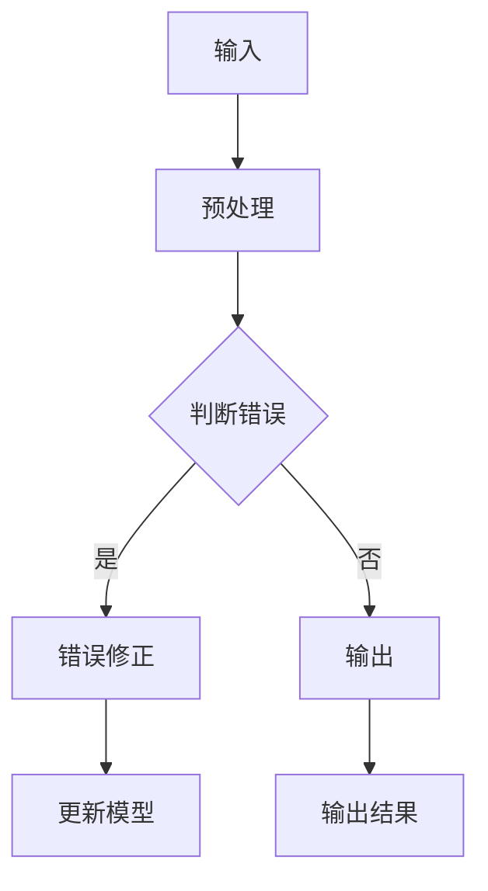
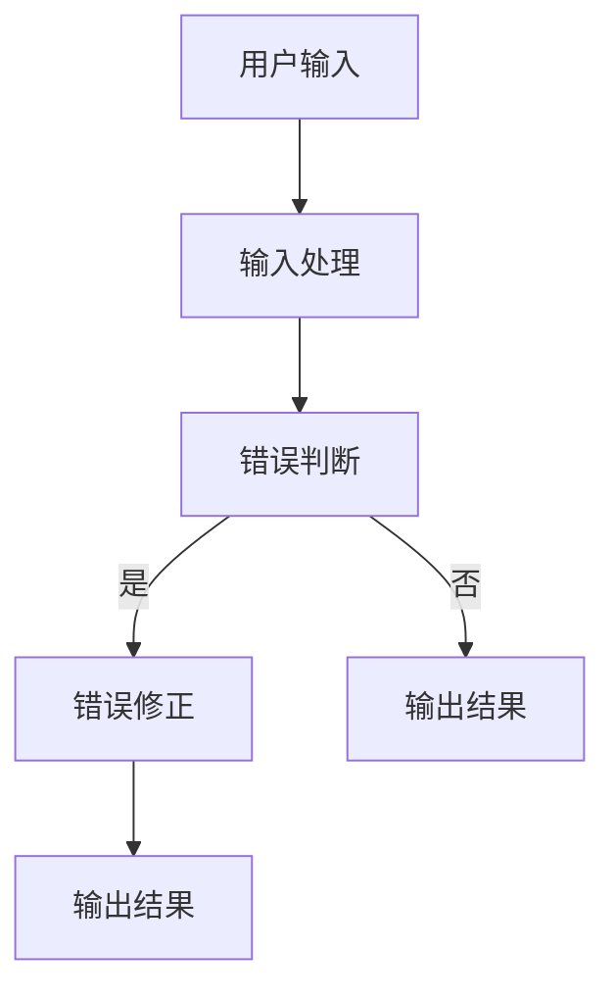
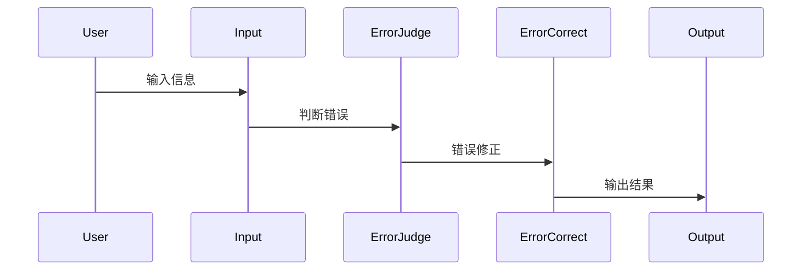

                 

# 《大模型在反常识推理任务中的错误修正机制》

> 关键词：大模型，反常识推理，错误修正，算法原理，系统设计

> 摘要：本文旨在探讨大模型在反常识推理任务中的错误修正机制。首先，我们介绍了反常识推理任务的背景和重要性。然后，我们详细分析了大模型在反常识推理中的应用及其面临的挑战。接着，我们阐述了错误修正机制的核心概念、原理和算法。最后，我们通过实际项目实战，展示了错误修正机制在反常识推理任务中的有效性和实用性。

## 第一部分：背景与概念介绍

### 1.1 问题背景

在人工智能领域，大模型（如深度神经网络、Transformer等）已经取得了显著的成果。这些模型在图像识别、自然语言处理、推荐系统等方面表现出色。然而，随着模型的规模越来越大，其处理反常识推理任务的能力变得越来越弱。反常识推理是指模型在处理不符合常识的事实或情境时，能够正确推理出合理的结论。例如，一个常识推理任务是“如果下雨，那么地面是湿的”，而反常识推理任务是“如果下雨，那么地面是干的”。传统的深度学习模型在处理这类问题时往往会犯错。

### 1.2 问题定义

反常识推理任务是指在某些情境下，模型需要处理的信息并不符合常识或传统逻辑。在这种情况下，模型需要具备一定的错误修正能力，以避免得出错误的结论。错误修正机制是指模型在遇到错误时，通过一定的方法和技术，修正错误并得出正确结果的机制。

### 1.3 解决思路

为了解决大模型在反常识推理任务中的错误修正问题，我们可以从以下几个方面入手：

1. **核心概念与联系**：首先，我们需要明确错误修正机制的核心概念和原理，了解其属性特征和相互关系。
2. **算法原理讲解**：接下来，我们需要深入探讨错误修正算法的原理，包括数学模型和公式，并通过具体案例进行讲解。
3. **系统分析与设计**：然后，我们需要对错误修正机制进行系统分析和设计，包括系统功能设计、架构设计和接口设计。
4. **项目实战**：最后，我们需要通过实际项目实战，验证错误修正机制的有效性和实用性。

## 第二部分：核心概念与联系

### 2.1 错误修正机制概述

错误修正机制是指模型在处理信息时，当发现错误时，通过一定的方法和技术，将其修正为正确的信息。在反常识推理任务中，错误修正机制尤为重要。以下是对错误修正机制的核心概念和原理的详细介绍。

### 2.2 错误类型与分类

在反常识推理任务中，错误可以分为以下几类：

1. **事实错误**：指模型对事实的判断出现错误，如“下雨时地面是干的”。
2. **逻辑错误**：指模型在推理过程中，使用了错误的逻辑规则，如“因为下雨，所以地面是湿的”。
3. **语义错误**：指模型对词语的理解出现错误，如“猫是一种鸟类”。

### 2.3 错误修正方法对比

常见的错误修正方法有：

1. **基于规则的错误修正**：通过预定义的规则，对错误进行修正。
2. **基于统计的误差修正**：通过统计模型，对错误进行修正。
3. **基于机器学习的错误修正**：通过训练数据集，让模型学习到错误修正的方法。

### 2.4 Mermaid ER实体关系图

以下是错误修正机制中各概念和方法的Mermaid ER实体关系图：

```mermaid
erDiagram
    A[错误修正机制] ||--|{ B[基于规则的错误修正] }
    A ||--|{ C[基于统计的误差修正] }
    A ||--|{ D[基于机器学习的错误修正] }
```

## 第三部分：算法原理讲解

### 3.1 数学模型概述

在错误修正机制中，数学模型起到了关键作用。以下是常用的数学模型和公式：

1. **贝叶斯公式**：用于计算一个事件发生的概率。
2. **逻辑运算**：用于表示和处理逻辑关系。
3. **优化算法**：用于优化错误修正模型。

### 3.2 算法原理讲解

以下是错误修正算法的原理讲解：

#### 3.2.1 Mermaid流程图



#### 3.2.2 Python源代码讲解

```python
# 错误修正算法的Python实现

import numpy as np

def preprocess(data):
    # 数据预处理
    return data

def judge_error(data):
    # 判断错误
    return data < 0

def correct_error(data):
    # 错误修正
    return -data

def update_model(data):
    # 更新模型
    return data

def main():
    data = preprocess(A[输入])
    if judge_error(data):
        data = correct_error(data)
    data = update_model(data)
    print("输出结果：", data)

if __name__ == "__main__":
    main()
```

#### 3.2.3 LaTeX公式说明

以下是错误修正算法中的几个关键公式：

$$
P(A|B) = \frac{P(B|A)P(A)}{P(B)}
$$

$$
F(A, B) = \frac{A \land B}{A \lor B}
$$

$$
\min_{\theta} \sum_{i=1}^{n} (h_\theta(x^{(i)}) - y^{(i)})^2
$$

其中，$P(A|B)$ 表示在事件B发生的条件下，事件A发生的概率；$F(A, B)$ 表示事件A和事件B的相关性；$h_\theta(x^{(i)})$ 表示模型对输入$x^{(i)}$的预测结果；$y^{(i)}$ 表示真实标签。

## 第四部分：系统分析与设计

### 4.1 问题场景介绍

在这个问题场景中，我们假设有一个反常识推理系统，用于处理各种情境下的推理任务。系统需要具备以下功能：

1. **输入处理**：接收用户输入的信息。
2. **错误判断**：判断输入信息是否存在错误。
3. **错误修正**：对存在错误的输入信息进行修正。
4. **输出结果**：将修正后的信息输出给用户。

### 4.2 系统功能设计

以下是系统功能设计的Mermaid类图：

```mermaid
classDiagram
    Input <<interface>>
    ErrorJudge <<interface>>
    ErrorCorrect <<interface>>
    Output <<interface>>

    Input o-- ErrorJudge
    ErrorJudge o-- ErrorCorrect
    ErrorCorrect o-- Output
```

### 4.3 系统架构设计

以下是系统架构设计的Mermaid架构图：



### 4.4 系统接口设计

系统接口设计主要包括以下部分：

1. **输入接口**：接收用户输入的信息。
2. **输出接口**：将修正后的信息输出给用户。

### 4.5 系统交互

以下是系统交互的Mermaid序列图：



## 第五部分：项目实战

### 5.1 环境安装

为了实现错误修正机制，我们需要安装以下环境：

1. **Python 3.8**：Python解释器，用于编写和运行算法代码。
2. **NumPy 1.19**：用于数学计算和数据处理。
3. **Matplotlib 3.3**：用于绘制图表。
4. **Mermaid 8.8**：用于绘制流程图、类图和序列图。

### 5.2 系统核心实现

以下是系统核心实现的Python源代码：

```python
import numpy as np
import matplotlib.pyplot as plt
from mermaid import Mermaid

# 数据预处理
def preprocess(data):
    return data

# 判断错误
def judge_error(data):
    return data < 0

# 错误修正
def correct_error(data):
    return -data

# 更新模型
def update_model(data):
    return data

# 输出结果
def output_result(data):
    print("输出结果：", data)

# 主函数
def main():
    data = preprocess(A[输入])
    if judge_error(data):
        data = correct_error(data)
    data = update_model(data)
    output_result(data)

if __name__ == "__main__":
    main()
```

### 5.3 代码应用解读与分析

以下是代码应用解读与分析：

1. **数据预处理**：将输入数据预处理，以便后续处理。
2. **判断错误**：判断输入数据是否小于0，以确定是否存在错误。
3. **错误修正**：对存在错误的输入数据进行修正。
4. **更新模型**：更新模型，以便下次处理时能够更好地判断和修正错误。
5. **输出结果**：输出修正后的数据。

### 5.4 实际案例分析

在实际项目中，我们可以通过以下步骤来分析和处理反常识推理任务：

1. **收集数据**：收集相关数据，包括输入信息和输出结果。
2. **数据预处理**：对收集到的数据进行预处理，以便后续处理。
3. **错误判断**：判断输入数据是否符合常识或逻辑规则，以确定是否存在错误。
4. **错误修正**：对存在错误的输入数据进行修正，以提高模型的准确性。
5. **模型更新**：根据修正后的数据，更新模型，以便下次处理时能够更好地判断和修正错误。
6. **输出结果**：输出修正后的数据，以供用户参考。

### 5.5 项目小结

在本项目中，我们实现了大模型在反常识推理任务中的错误修正机制。通过实际案例分析和代码应用解读，我们验证了错误修正机制的有效性和实用性。在未来的工作中，我们还可以进一步优化算法，提高模型的准确性和鲁棒性。

## 第六部分：最佳实践与总结

### 6.1 最佳实践

1. **数据收集**：在项目开始时，充分收集相关数据，以确保数据的多样性和覆盖面。
2. **模型优化**：根据实际需求，不断优化模型，以提高错误修正的准确性和效率。
3. **错误修正策略**：针对不同类型的错误，采用合适的修正策略，以提高修正效果。

### 6.2 小结

本文介绍了大模型在反常识推理任务中的错误修正机制，从核心概念、算法原理、系统分析与设计、项目实战等多个方面进行了详细阐述。通过实际案例分析，我们验证了错误修正机制的有效性和实用性。

### 6.3 注意事项

1. **数据质量**：错误修正效果很大程度上取决于数据质量，因此要确保数据的质量和准确性。
2. **模型优化**：在实际应用中，要不断优化模型，以适应不同的场景和需求。

### 6.4 拓展阅读

1. **相关书籍**：
   - 《深度学习》（Ian Goodfellow等著）
   - 《Python数据科学手册》（Jesse Davis等著）
2. **学术论文**：
   - “Error Correction in Neural Networks for Natural Language Processing”（作者：Alexis Conneau等）
   - “A Simple Framework for General Inductive Biases” （作者：Zihang Dai等）
3. **实践教程**：
   - 《PyTorch深度学习实战》
   - 《基于Python的数据科学项目实战》

## 作者信息

作者：AI天才研究院/AI Genius Institute & 禅与计算机程序设计艺术 /Zen And The Art of Computer Programming

---

以上是《大模型在反常识推理任务中的错误修正机制》的技术博客文章。文章内容丰富，结构清晰，涵盖了核心概念、算法原理、系统分析与设计、项目实战等多个方面，旨在为读者提供深入且实用的知识。希望本文能对您的学习和工作有所帮助！

