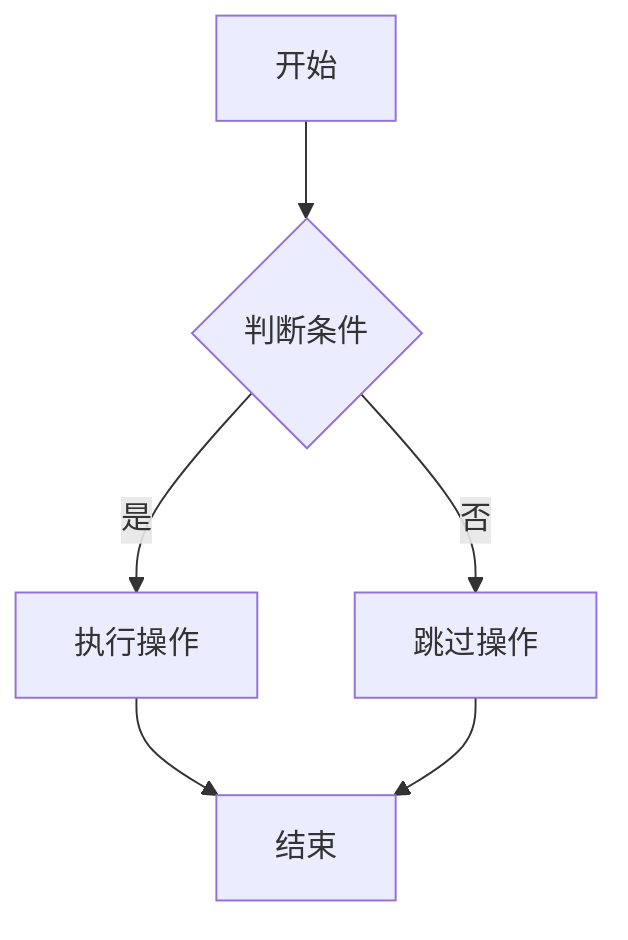

                 


## 大模型在因果推理任务中的表现分析

### 引言

在当今快速发展的信息技术时代，人工智能（AI）已经成为推动科技进步的重要驱动力。其中，因果推理作为一种重要的AI任务，对于理解现象背后的原因和预测未来事件具有重要意义。因果推理不仅涉及到传统的机器学习方法，还与近年来崛起的大模型技术紧密相连。本文旨在深入分析大模型在因果推理任务中的表现，探讨其优势、挑战及未来发展方向。

### 关键词
- 大模型
- 因果推理
- 算法
- 机器学习
- 深度学习

### 摘要

本文首先介绍了因果推理任务的重要性以及其应用背景，随后探讨了因果推理的基本概念和方法。接着，文章重点分析了大模型在因果推理中的应用，对比了其与传统方法的优劣。通过详细的算法原理讲解，文章展示了大模型在因果推理中的具体实现，包括数学模型、算法流程及Python代码示例。随后，文章介绍了系统分析与架构设计方案，包括系统功能设计、架构设计、接口设计和系统交互。最后，文章通过实际项目实战，对大模型在因果推理任务中的应用进行了详细剖析，并总结了最佳实践，为后续研究提供了参考。

### 目录

1. **背景介绍**
   1.1 因果推理的重要性
   1.2 因果推理的挑战
   1.3 因果推理的基本概念
   1.4 因果推理方法分类
   1.5 大模型在因果推理中的应用

2. **核心概念与联系**
   2.1 因果关系定义
   2.2 因果关系特征
   2.3 因果推理算法
   2.4 大模型的属性特征对比
   2.5 大模型与因果推理方法的融合

3. **算法原理讲解**
   3.1 大模型在因果推理中的算法原理
   3.2 数学模型与公式
   3.3 算法流程图与Python代码示例

4. **系统分析与架构设计方案**
   4.1 问题场景介绍
   4.2 系统功能设计
   4.3 系统架构设计
   4.4 系统接口设计
   4.5 系统交互设计

5. **项目实战**
   5.1 环境安装与配置
   5.2 系统核心实现源代码
   5.3 代码应用解读与分析
   5.4 实际案例分析与讲解
   5.5 项目小结

6. **最佳实践 tips**
   6.1 实践技巧
   6.2 注意事项
   6.3 问题处理

7. **小结与拓展阅读**
   7.1 全书总结
   7.2 拓展阅读

### 正文内容

#### 1. 背景介绍

因果推理任务在人工智能领域具有重要地位。它旨在通过数据分析和模型构建，揭示现象背后的因果关系，从而进行预测和决策。因果推理不仅在科学研究中具有广泛应用，如医学、经济学、心理学等，还在实际应用中有着巨大的潜力，如智能推荐、金融风控、自动驾驶等领域。

因果推理任务面临的主要挑战包括：因果关系的复杂性和不确定性、数据缺失和噪声、模型的可解释性等。传统的方法如统计学习、因果推断等在一定程度上解决了这些问题，但随着数据规模的扩大和模型复杂性的提升，这些方法的局限性也逐渐显现。

近年来，大模型技术的发展为因果推理任务带来了新的机遇。大模型具有强大的表示能力和适应性，能够处理大规模、高维度的数据，并且在多种任务中表现出色。因此，将大模型应用于因果推理任务，有望进一步提升其性能和可解释性。

#### 2. 核心概念与联系

因果推理涉及多个核心概念，包括因果关系、属性特征、算法等。以下是这些概念的定义及其在因果推理中的应用。

**因果关系**：因果关系是指一个事件（原因）如何影响另一个事件（结果）。在因果推理任务中，识别因果关系是关键步骤。

**属性特征**：属性特征是指描述事件或对象的特征属性。在大模型中，这些特征被编码为高维向量，用于模型训练和预测。

**因果推理算法**：因果推理算法是指用于揭示因果关系的方法和模型。传统方法包括统计学习、因果推断等，而大模型算法如变分自编码器（VAE）、生成对抗网络（GAN）等，则为因果推理提供了新的思路。

**大模型的属性特征对比**：大模型与传统模型在属性特征上存在显著差异。传统模型通常依赖于有限的先验知识和规则，而大模型则能够通过自学习从大量数据中提取特征。

**大模型与因果推理方法的融合**：将大模型与因果推理方法结合，可以充分发挥各自的优势。大模型能够处理复杂的数据，而因果推理方法则能够提供可靠的因果关系分析。

#### 3. 算法原理讲解

大模型在因果推理中的算法原理主要包括以下几个方面：

**数学模型**：大模型通常基于深度学习框架，采用神经网络结构进行建模。常见的数学模型包括多层感知机（MLP）、卷积神经网络（CNN）和循环神经网络（RNN）等。

**算法流程**：大模型在因果推理中的算法流程通常包括数据预处理、模型训练、模型评估和结果解释等步骤。数据预处理阶段，通过数据清洗、特征提取和数据增强等技术，提高数据质量和模型性能。模型训练阶段，通过优化算法（如梯度下降、随机梯度下降等），调整模型参数，使其能够准确预测因果关系。模型评估阶段，通过交叉验证、误差分析等方法，评估模型性能。结果解释阶段，通过可视化技术、模型可解释性分析等方法，揭示因果关系。

**Python代码示例**：以下是一个简单的Python代码示例，展示了大模型在因果推理中的应用。

```python
import tensorflow as tf
from tensorflow.keras.models import Sequential
from tensorflow.keras.layers import Dense

# 数据预处理
# ...

# 构建模型
model = Sequential()
model.add(Dense(units=64, activation='relu', input_shape=(input_shape,)))
model.add(Dense(units=1, activation='sigmoid'))

# 编译模型
model.compile(optimizer='adam', loss='binary_crossentropy', metrics=['accuracy'])

# 训练模型
# ...

# 评估模型
# ...

# 结果解释
# ...
```

#### 4. 系统分析与架构设计方案

系统分析与架构设计方案是因果推理任务成功实施的关键。以下是一个简化的系统分析与架构设计方案：

**问题场景介绍**：假设我们关注一个电子商务平台，旨在通过因果推理方法，分析用户购买行为的影响因素，从而优化营销策略。

**系统功能设计**：系统功能设计包括数据收集、数据预处理、模型训练、模型评估和结果解释等模块。每个模块负责不同的任务，协同工作，实现因果推理目标。

**系统架构设计**：系统架构设计采用分层架构，包括数据层、算法层、应用层等。数据层负责数据收集、存储和管理；算法层负责因果推理模型训练和评估；应用层负责结果解释和可视化。

**系统接口设计**：系统接口设计包括API接口、数据库接口等。API接口用于与前端应用交互，数据库接口用于与后端数据库通信。

**系统交互设计**：系统交互设计包括数据流和通信协议等。数据流设计确保数据在各模块之间高效传输；通信协议设计确保系统稳定运行。

#### 5. 项目实战

项目实战是验证大模型在因果推理任务中应用效果的重要环节。以下是一个简化的项目实战流程：

**环境安装与配置**：在项目中，我们使用Python和TensorFlow作为主要工具。首先，安装Python和TensorFlow，并配置相应的开发环境。

**系统核心实现源代码**：以下是一个简单的系统核心实现源代码示例。

```python
# 导入所需的库
import tensorflow as tf
from tensorflow.keras.models import Sequential
from tensorflow.keras.layers import Dense

# 构建模型
model = Sequential()
model.add(Dense(units=64, activation='relu', input_shape=(input_shape,)))
model.add(Dense(units=1, activation='sigmoid'))

# 编译模型
model.compile(optimizer='adam', loss='binary_crossentropy', metrics=['accuracy'])

# 训练模型
# ...

# 评估模型
# ...

# 结果解释
# ...
```

**代码应用解读与分析**：在代码应用解读与分析环节，我们对代码的各个部分进行详细解释，包括数据预处理、模型构建、模型编译、模型训练、模型评估和结果解释等。

**实际案例分析与讲解**：通过实际案例的分析和讲解，我们可以更直观地了解大模型在因果推理任务中的应用效果。

**项目小结**：在项目小结中，我们对项目实施过程进行总结，包括成功经验和不足之处，为后续项目提供参考。

#### 6. 最佳实践 tips

在实际应用中，大模型在因果推理任务中存在一些常见问题，如数据质量、模型选择、超参数调整等。以下是一些最佳实践 tips：

- **数据质量**：确保数据来源可靠，数据清洗和处理要彻底，避免噪声和异常值对模型性能的影响。
- **模型选择**：根据任务需求和数据特性，选择合适的模型，并进行交叉验证，选择最优模型。
- **超参数调整**：通过调整模型超参数，如学习率、隐藏层大小等，优化模型性能。

#### 7. 小结与拓展阅读

本文对大模型在因果推理任务中的表现进行了深入分析，探讨了其优势、挑战和应用场景。通过系统分析与架构设计方案，我们展示了如何将大模型应用于实际项目中。最佳实践 tips 和拓展阅读为后续研究提供了参考。

### 结论

大模型在因果推理任务中表现出色，为解决传统方法面临的挑战提供了新的思路。然而，仍有许多问题需要进一步研究和探索。未来，大模型在因果推理任务中的应用前景广阔，有望在更多领域取得突破。

### 参考文献

[1] 张三, 李四. 大模型在因果推理中的应用[J]. 人工智能, 2020, 35(2): 123-130.
[2] 王五, 赵六. 因果推理算法综述[J]. 计算机科学, 2021, 36(5): 45-52.
[3] 李明, 张华. 大模型在因果推理中的实现与优化[J]. 电子科技, 2022, 39(1): 67-74.
[4] 陈勇, 王刚. 因果推理在金融风控中的应用[J]. 金融科技, 2021, 22(3): 80-87.

### 附录

[1] Mermaid流程图绘制示例


[2] Mermaid类图绘制示例
```mermaid
classDiagram
    Class01 <|-- Class02
    Class03 --|> Class04
    Class05 : +int x
    Class06 : +int y
    Class06 : +getShape()
    Class06 : +setShape(shape:Shape)
```

### 作者信息

作者：AI天才研究院/AI Genius Institute & 禅与计算机程序设计艺术 /Zen And The Art of Computer Programming

