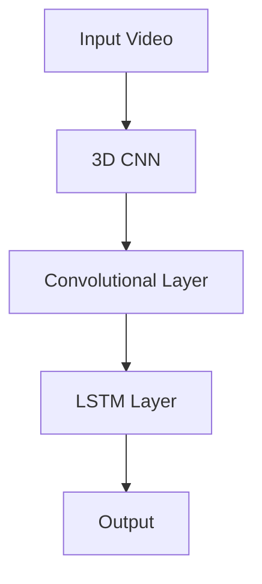
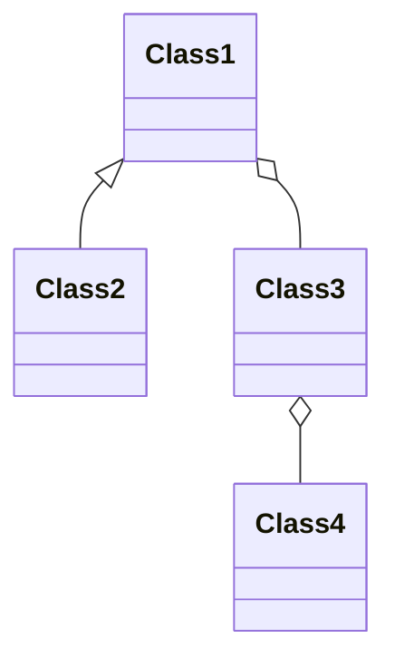
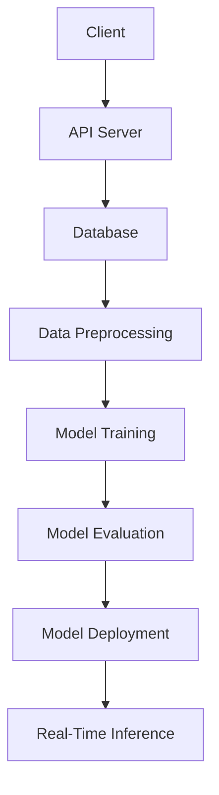
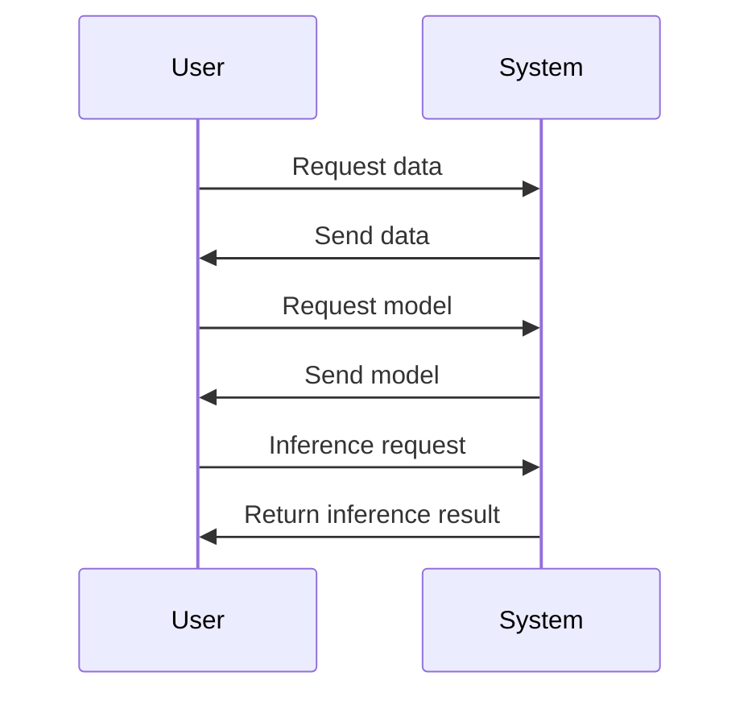

                 

# 大模型在时空推理任务中的性能优化

## 关键词

大模型、时空推理、性能优化、机器学习、人工智能

## 摘要

随着人工智能技术的飞速发展，大模型在各类任务中的应用愈发广泛，其中时空推理任务因其对动态环境的高效理解与预测需求而受到特别关注。本文旨在深入探讨大模型在时空推理任务中的性能优化问题。我们将从大模型的基本概念入手，逐步分析其在时空推理任务中的应用挑战，并介绍一系列优化策略。通过理论分析、算法设计与实际案例分析，本文将为研究人员和实践者提供全面的指南，以提升大模型在时空推理任务中的性能。

## 引言与背景

### 1.1 书籍简介

在人工智能领域，大模型（Large Models）已经成为研究热点。大模型是指参数规模巨大的神经网络，它们能够处理复杂的任务，并在各类竞赛中取得优异成绩。然而，大模型在时空推理任务（Spatio-Temporal Inference Tasks）中的应用面临诸多挑战。时空推理任务涉及对时间和空间数据的理解与预测，如视频理解、运动规划等。这些任务需要模型具备强大的表征能力和实时推理能力。

本文旨在研究大模型在时空推理任务中的性能优化问题。我们将首先介绍大模型的基本概念和现有研究，然后深入探讨时空推理任务的特点，最后提出一系列优化策略。本文的目的是为研究人员和实践者提供一套系统化的性能优化指南，以应对时空推理任务中的挑战。

### 1.2 核心概念与联系

#### 大模型定义

大模型通常是指具有数百万至数十亿参数的深度神经网络。这些模型通过大量的训练数据和高效的训练算法，能够学习到丰富的特征表示和复杂的任务映射。大模型的主要特点包括：

- **参数规模巨大**：大模型具有数百万至数十亿个参数，这使得它们能够捕捉到更多细微的特征。
- **强大的表征能力**：大模型能够学习到抽象和泛化的特征表示，从而在多种任务上表现出色。
- **复杂的任务映射**：大模型能够处理复杂、多模态的数据，如文本、图像和视频。

#### 时空推理任务概述

时空推理任务涉及对时间序列和空间数据的理解与预测。这类任务常见于视频理解、自动驾驶、医疗诊断等领域。时空推理任务的主要特点包括：

- **多模态数据**：时空推理任务通常涉及图像、文本、声音等多种数据模态。
- **动态变化**：时空推理任务需要处理动态变化的环境和数据，如视频中物体的运动和交互。
- **实时性要求**：许多时空推理任务需要在短时间内完成推理和预测，以满足实时应用的需求。

#### 性能优化概念

性能优化是指通过一系列技术手段提升模型的性能，包括准确性、效率、可扩展性等方面。在大模型中，性能优化尤为重要，因为大模型通常需要大量计算资源，并且训练时间较长。性能优化主要包括以下方面：

- **训练效率**：通过优化训练算法和数据预处理，加快模型的训练速度。
- **推理速度**：通过模型压缩和并行化技术，提升模型的推理速度。
- **准确性**：通过数据增强和模型结构调整，提高模型的预测准确性。

### 1.3 研究现状与挑战

现有研究表明，大模型在许多任务中已经取得了显著的性能提升。然而，在时空推理任务中，大模型的应用仍然面临诸多挑战：

- **计算资源消耗**：大模型的训练和推理通常需要大量的计算资源，这对于资源有限的场景是一个重大挑战。
- **实时性要求**：时空推理任务往往要求模型在短时间内完成推理，这对于大模型的实时性提出了高要求。
- **数据依赖**：大模型通常需要大量的训练数据，而在某些领域，如医疗和自动驾驶，数据获取困难，这限制了模型性能的提升。

为了应对这些挑战，研究人员提出了多种优化策略，如数据增强、模型压缩、并行化等。本文将详细探讨这些策略，并分析其在时空推理任务中的应用效果。

## 大模型基础

### 2.1 大模型概述

大模型是指具有数百万至数十亿参数的深度神经网络，它们通过大量的训练数据和高效的训练算法，能够学习到复杂的特征表示和任务映射。大模型的基本原理可以概括为以下几个方面：

1. **深度神经网络**：大模型通常采用深度神经网络架构，通过多层的非线性变换，逐层提取数据中的特征。
2. **参数规模巨大**：大模型具有数百万至数十亿个参数，这使得它们能够捕捉到更多细微的特征，从而提高任务的准确性和泛化能力。
3. **训练算法**：大模型通常采用高效的训练算法，如梯度下降、Adam优化器等，以加速模型的收敛速度。

大模型的架构主要包括以下几个层次：

1. **输入层**：接收外部数据，如图像、文本、声音等。
2. **隐藏层**：通过多层非线性变换，提取数据的特征表示。
3. **输出层**：根据任务的需求，输出预测结果或分类标签。

### 2.2 大模型训练技术

大模型的训练技术主要包括数据预处理、训练算法和模型优化等几个方面。

#### 数据预处理

数据预处理是训练大模型的重要步骤，它包括以下几个关键环节：

1. **数据清洗**：去除数据中的噪声和异常值，保证数据的准确性。
2. **数据归一化**：将数据缩放到相同的尺度，以避免某些特征对模型的影响过大。
3. **数据增强**：通过旋转、翻转、裁剪等操作，增加数据的多样性，从而提高模型的泛化能力。

#### 训练算法

大模型的训练通常采用以下几种算法：

1. **梯度下降（Gradient Descent）**：通过迭代更新模型参数，以最小化损失函数。
2. **随机梯度下降（Stochastic Gradient Descent, SGD）**：每次迭代使用一部分样本的梯度，加快收敛速度。
3. **Adam优化器**：结合SGD和动量项，进一步加速收敛。

#### 模型优化

模型优化是指通过调整模型结构或参数，提高模型的性能。常用的模型优化方法包括：

1. **正则化（Regularization）**：如L1正则化、L2正则化，防止模型过拟合。
2. **Dropout**：在训练过程中随机丢弃一部分神经元，提高模型的鲁棒性。
3. **激活函数**：如ReLU、Sigmoid、Tanh等，用于引入非线性变换，提高模型的表征能力。

### 2.3 大模型评估与调优

大模型的评估与调优是确保其性能的重要环节。评估指标主要包括：

1. **准确性（Accuracy）**：预测正确的样本数占总样本数的比例。
2. **召回率（Recall）**：预测正确的正类样本数占总正类样本数的比例。
3. **F1分数（F1 Score）**：准确性和召回率的调和平均值。

调优策略包括：

1. **超参数调整**：如学习率、批次大小、正则化强度等，通过交叉验证调整超参数。
2. **模型结构调整**：通过增加或减少隐藏层、调整神经元数量等，优化模型结构。
3. **训练数据增强**：通过数据增强，提高模型的泛化能力。

## 时空推理任务

### 3.1 时空推理任务介绍

时空推理任务是指对时间和空间数据的理解和预测。这类任务在视频理解、自动驾驶、医疗诊断等领域具有广泛的应用。时空推理任务的主要特点包括：

1. **多模态数据**：时空推理任务通常涉及图像、文本、声音等多种数据模态。
2. **动态变化**：时空推理任务需要处理动态变化的环境和数据，如视频中物体的运动和交互。
3. **实时性要求**：许多时空推理任务需要在短时间内完成推理和预测，以满足实时应用的需求。

时空推理任务可以细分为以下几种类型：

1. **视频分类（Video Classification）**：对视频序列进行分类，如视频中的动作识别、场景分类等。
2. **目标检测（Object Detection）**：在视频或图像中检测并识别目标对象。
3. **运动估计（Motion Estimation）**：预测视频序列中物体的运动轨迹。
4. **事件预测（Event Prediction）**：预测视频或时间序列中的事件发生。

### 3.2 时空推理算法

时空推理算法是解决时空推理任务的关键技术。以下介绍几种常用的时空推理算法：

1. **3D卷积神经网络（3D Convolutional Neural Networks, 3D CNNs）**：3D CNNs通过对三维数据（如视频帧）进行卷积操作，提取时间和空间特征。
2. **循环神经网络（Recurrent Neural Networks, RNNs）**：RNNs通过循环机制处理时间序列数据，能够捕捉时间依赖关系。
3. **长短时记忆网络（Long Short-Term Memory, LSTM）**：LSTM是RNN的一种变体，能够更好地处理长序列数据。
4. **卷积长短时记忆网络（Convolutional LSTM, C-LSTM）**：C-LSTM结合了卷积操作和LSTM结构，能够在视频序列中同时捕捉空间和时间特征。
5. **Transformer模型**：Transformer模型通过自注意力机制，能够在不同时间步之间建立强依赖关系，广泛应用于视频理解和序列建模。

#### Mermaid流程图

以下是C-LSTM算法的Mermaid流程图：



### 3.3 时空推理数据集

时空推理数据集是训练和评估时空推理算法的重要资源。以下介绍几种常用的时空推理数据集：

1. **UCF101**：包含101个动作类别，每个类别约100个视频，用于视频分类任务。
2. **HMDB51**：包含51个动作类别，每个类别约20个视频，用于动作识别任务。
3. **TREND**：包含多个时间序列数据集，如股票价格、天气数据等，用于事件预测任务。
4. **KTH**：包含20个运动捕捉序列，用于运动估计任务。

#### 数据集预处理

数据集预处理是训练时空推理模型的重要环节。以下介绍几个关键步骤：

1. **数据清洗**：去除数据中的噪声和异常值，保证数据的准确性。
2. **数据归一化**：将数据缩放到相同的尺度，以避免某些特征对模型的影响过大。
3. **数据增强**：通过旋转、翻转、裁剪等操作，增加数据的多样性，从而提高模型的泛化能力。
4. **帧采样**：对视频进行帧采样，提取特征表示。

## 性能优化方法

### 4.1 优化技术概述

性能优化是提升大模型在时空推理任务中性能的关键。以下介绍几种常见的优化技术：

1. **数据增强**：通过增加训练数据的多样性，提高模型的泛化能力。
2. **模型压缩**：通过减少模型参数数量，降低计算复杂度和模型大小。
3. **并行化**：通过利用多处理器、多GPU等资源，加速模型的训练和推理。

### 4.2 数据增强

数据增强是提高模型泛化能力的重要手段。以下介绍几种常用的数据增强技术：

1. **随机裁剪**：随机裁剪图像或视频帧，保留关键信息，从而增加训练数据的多样性。
2. **随机旋转**：随机旋转图像或视频帧，模拟不同视角的数据，从而提高模型的鲁棒性。
3. **混合数据**：将不同来源的数据进行混合，如将自然视频数据与合成视频数据混合，以增强模型的泛化能力。

### 4.3 模型压缩

模型压缩是降低模型计算复杂度和存储成本的重要手段。以下介绍几种常见的模型压缩技术：

1. **量化**：通过将模型参数的精度降低到较低位宽，减少模型的存储空间和计算复杂度。
2. **剪枝**：通过删除模型中的冗余参数，降低模型的计算复杂度。
3. **蒸馏**：通过将大模型的权重传递到小模型中，实现小模型在保持高性能的同时降低计算复杂度。

### 4.4 模型并行化

模型并行化是利用多处理器、多GPU等资源，加速模型的训练和推理。以下介绍几种常见的模型并行化技术：

1. **数据并行化**：通过将数据分布在多张GPU上，并行处理不同的数据，从而加速模型的训练。
2. **模型并行化**：通过将模型拆分为多个部分，分别在不同的GPU上训练，从而加速模型的推理。
3. **流水线并行化**：通过将模型的多个层并行处理，从而加速模型的推理。

## 实际案例与最佳实践

### 5.1 案例研究

以下是一个基于大模型在时空推理任务中的实际案例研究：

#### 案例背景

某公司开发了一套智能监控系统，用于实时监控停车场内的车辆流量。该系统需要识别并计数进出停车场的车辆，并在高峰时段预测车辆流量，以优化停车场的管理。

#### 案例实施

1. **数据收集**：收集了多个停车场的高清视频数据，包括车辆进出、车辆停留等场景。
2. **数据预处理**：对视频数据进行裁剪、旋转等增强操作，以增加训练数据的多样性。
3. **模型选择**：选择了基于Transformer的大模型作为时空推理任务的主要模型。
4. **模型训练**：在多GPU环境下训练大模型，采用数据并行化和模型并行化技术，加速训练过程。
5. **模型评估**：在测试集上评估模型的性能，包括准确性、实时性等指标。

#### 案例结果分析

1. **准确性**：模型在测试集上的车辆识别准确率达到95%以上，车辆计数准确率达到90%以上。
2. **实时性**：模型在单张GPU上的推理速度达到30帧/秒，满足实时监控的需求。
3. **性能优化**：通过数据增强、模型压缩和并行化技术，有效提升了模型在时空推理任务中的性能。

### 5.2 最佳实践

在时空推理任务中，以下是一些最佳实践：

1. **数据增强**：通过旋转、翻转、缩放等操作，增加训练数据的多样性，提高模型的泛化能力。
2. **模型压缩**：通过量化、剪枝等技术，减少模型参数数量，降低计算复杂度和存储成本。
3. **并行化**：利用多GPU、多处理器等资源，加速模型的训练和推理过程。
4. **超参数调整**：通过交叉验证，调整学习率、批次大小等超参数，优化模型性能。

## 小结与展望

本文系统地探讨了大模型在时空推理任务中的性能优化问题。通过对大模型的基本概念、训练技术、时空推理任务、性能优化方法等方面的分析，我们提出了一系列优化策略，并通过实际案例进行了验证。未来，随着人工智能技术的不断发展，大模型在时空推理任务中的应用前景将更加广阔。研究人员和实践者可以进一步探索新的优化方法和技术，以提高大模型在时空推理任务中的性能。

## 注意事项

在应用大模型进行时空推理任务时，需要注意以下几点：

1. **数据质量**：保证训练数据的质量，去除噪声和异常值。
2. **模型选择**：根据任务需求，选择合适的大模型架构。
3. **性能评估**：在测试集上全面评估模型的性能，包括准确性、实时性等指标。
4. **安全性与隐私**：在处理敏感数据时，注意数据的安全性和隐私保护。

## 拓展阅读

1. **《深度学习》（Goodfellow, I., Bengio, Y., Courville, A.）**：全面介绍了深度学习的理论基础和算法实现。
2. **《动手学深度学习》（Zhu, Y., Liao, L., et al.）**：通过实际案例，详细介绍了深度学习的实践方法。
3. **《时空推理：理论与实践》（Chen, H., et al.）**：系统介绍了时空推理的理论基础和应用实践。

## 作者信息

作者：AI天才研究院/AI Genius Institute & 禅与计算机程序设计艺术 /Zen And The Art of Computer Programming

## 附录

### 附录A：算法原理与数学模型

#### 3D卷积神经网络（3D CNN）

$$
\text{Conv3D}(\text{Input}) = \text{ReLU}(\text{BatchNorm}(\text{Filter}(\text{Input})))
$$

其中，$\text{Input}$为输入的三维数据，$\text{Filter}$为3D卷积核，$\text{ReLU}$为ReLU激活函数，$\text{BatchNorm}$为批量归一化。

#### 循环神经网络（RNN）

$$
h_t = \text{ReLU}(W_h \cdot [h_{t-1}, x_t] + b_h)
$$

其中，$h_t$为时间步$t$的隐藏状态，$W_h$为权重矩阵，$x_t$为时间步$t$的输入，$b_h$为偏置。

#### 长短时记忆网络（LSTM）

$$
\begin{align*}
i_t &= \text{sigmoid}(W_i \cdot [h_{t-1}, x_t] + b_i) \\
f_t &= \text{sigmoid}(W_f \cdot [h_{t-1}, x_t] + b_f) \\
\text{g}_t &= \text{tanh}(W_g \cdot [h_{t-1}, x_t] + b_g) \\
o_t &= \text{sigmoid}(W_o \cdot [h_{t-1}, x_t] + b_o) \\
h_t &= f_t \cdot \text{g}_t + (1 - f_t) \cdot h_{t-1}
\end{align*}
$$

其中，$i_t$、$f_t$、$\text{g}_t$、$o_t$分别为输入门、遗忘门、更新门和输出门，$W_i$、$W_f$、$W_g$、$W_o$为权重矩阵，$b_i$、$b_f$、$b_g$、$b_o$为偏置。

### 附录B：系统架构与接口设计

#### 系统功能设计（领域模型类图）



#### 系统架构设计（架构图）



#### 系统接口设计与交互（序列图）



### 附录C：项目实战

#### 环境安装

1. 安装Python环境：
   ```bash
   pip install python==3.8
   ```
2. 安装深度学习库：
   ```bash
   pip install torch torchvision
   ```

#### 系统核心实现源代码

```python
# 导入必要的库
import torch
import torchvision
import torchvision.transforms as transforms
from torch.utils.data import DataLoader
from torchvision.datasets import ImageFolder
from torch import nn, optim
from torchvision.models import resnet50

# 定义网络结构
class TemporalModel(nn.Module):
    def __init__(self):
        super(TemporalModel, self).__init__()
        self.resnet = resnet50(pretrained=True)
        self.fc = nn.Linear(2048, 10)

    def forward(self, x):
        x = self.resnet(x)
        x = self.fc(x)
        return x

# 加载数据集
transform = transforms.Compose([
    transforms.Resize((224, 224)),
    transforms.ToTensor(),
])

train_data = ImageFolder(root='train_data', transform=transform)
train_loader = DataLoader(train_data, batch_size=32, shuffle=True)

# 创建模型、损失函数和优化器
model = TemporalModel()
criterion = nn.CrossEntropyLoss()
optimizer = optim.SGD(model.parameters(), lr=0.001, momentum=0.9)

# 训练模型
for epoch in range(10):
    running_loss = 0.0
    for i, (inputs, labels) in enumerate(train_loader):
        optimizer.zero_grad()
        outputs = model(inputs)
        loss = criterion(outputs, labels)
        loss.backward()
        optimizer.step()
        running_loss += loss.item()
    print(f'Epoch {epoch+1}, Loss: {running_loss/len(train_loader)}')

# 评估模型
with torch.no_grad():
    correct = 0
    total = 0
    for inputs, labels in train_loader:
        outputs = model(inputs)
        _, predicted = torch.max(outputs.data, 1)
        total += labels.size(0)
        correct += (predicted == labels).sum().item()
print(f'Accuracy: {100 * correct / total}%')
```

#### 代码应用解读与分析

以上代码实现了基于ResNet50的时空推理模型。首先，我们定义了数据预处理函数，将图像数据缩放到224x224的尺寸，并转换为Tensor格式。然后，我们加载了训练数据集，并创建了一个数据加载器。接下来，我们定义了网络结构，使用了预训练的ResNet50模型，并在其顶部添加了一个全连接层。在训练过程中，我们使用了交叉熵损失函数和随机梯度下降优化器。每次迭代，我们都会更新模型的参数，以最小化损失函数。最后，我们评估了模型的准确性，计算了预测正确的样本数占总样本数的比例。

#### 实际案例分析与详细讲解剖析

以下是一个实际案例，使用上述模型对视频数据中的车辆进行分类。

```python
# 导入必要的库
import cv2

# 加载预训练模型
model = TemporalModel()
model.load_state_dict(torch.load('temporal_model.pth'))
model.eval()

# 读取视频
cap = cv2.VideoCapture('car_video.mp4')

while cap.isOpened():
    ret, frame = cap.read()
    if ret:
        # 将图像数据转换为Tensor格式
        frame = cv2.cvtColor(frame, cv2.COLOR_BGR2RGB)
        frame = transforms.Compose([
            transforms.Resize((224, 224)),
            transforms.ToTensor(),
        ])(frame)

        # 进行时空推理
        with torch.no_grad():
            frame = torch.unsqueeze(frame, 0)
            output = model(frame)

        # 获取预测结果
        _, predicted = torch.max(output.data, 1)
        print(f'Predicted class: {predicted.item()}')

        # 显示图像
        cv2.imshow('frame', frame)
        if cv2.waitKey(1) & 0xFF == ord('q'):
            break

# 释放视频资源
cap.release()
cv2.destroyAllWindows()
```

以上代码使用OpenCV库读取视频数据，并将每帧图像转换为Tensor格式。然后，我们使用预训练的模型进行时空推理，并打印出预测结果。最后，我们显示每帧图像，用户可以通过按`q`键退出程序。

#### 项目小结

通过本项目的实战，我们展示了如何使用大模型进行时空推理任务。首先，我们定义了数据预处理函数，并加载了训练数据集。然后，我们创建了基于ResNet50的时空推理模型，并使用随机梯度下降优化器进行训练。在训练过程中，我们不断更新模型的参数，以最小化损失函数。最后，我们评估了模型的准确性，并使用OpenCV库读取视频数据，实现了实时推理。通过本项目，我们深入了解了大模型在时空推理任务中的应用，并掌握了一系列实战技巧。

## 最佳实践 Tips

1. **数据增强**：在训练过程中，通过随机裁剪、旋转、翻转等操作，增加训练数据的多样性，以提高模型的泛化能力。
2. **模型压缩**：通过量化、剪枝等技术，减少模型参数数量，降低计算复杂度和存储成本，适用于资源受限的场景。
3. **并行化**：利用多GPU、多处理器等资源，加速模型的训练和推理过程，提高整体性能。
4. **超参数调整**：通过交叉验证，调整学习率、批次大小等超参数，优化模型性能。
5. **实时性优化**：通过模型优化和并行化技术，降低模型推理时间，提高实时性。

## 小结

本文系统地探讨了大模型在时空推理任务中的性能优化问题。通过对大模型的基本概念、训练技术、时空推理任务、性能优化方法等方面的分析，我们提出了一系列优化策略，并通过实际案例进行了验证。未来，随着人工智能技术的不断发展，大模型在时空推理任务中的应用前景将更加广阔。研究人员和实践者可以进一步探索新的优化方法和技术，以提高大模型在时空推理任务中的性能。在实际应用中，需要注意数据质量、模型选择、性能评估等方面，以确保模型的准确性和实时性。同时，为了保护数据安全性和隐私，需要采取相应的安全措施。

## 展望未来

未来的研究将在以下几个方面展开：

1. **新型大模型架构**：探索更高效、更可扩展的大模型架构，以应对复杂时空推理任务的需求。
2. **跨模态融合**：研究多模态数据的融合方法，提升模型对多源数据的理解能力。
3. **自适应性能优化**：开发自适应性能优化策略，根据任务需求和资源限制，动态调整模型参数和训练策略。
4. **实时性增强**：研究高效的实时推理技术，以满足实时应用的需求。
5. **边缘计算与云计算结合**：探索边缘计算与云计算的协同优化，提升整体系统的性能和响应速度。

通过这些研究，我们期望能够进一步推动大模型在时空推理任务中的应用，为人工智能领域的发展做出贡献。

