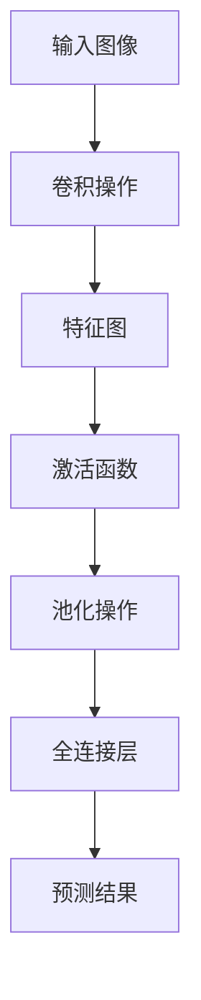
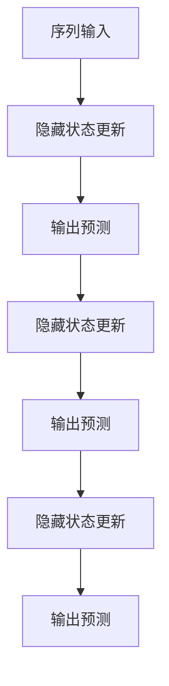
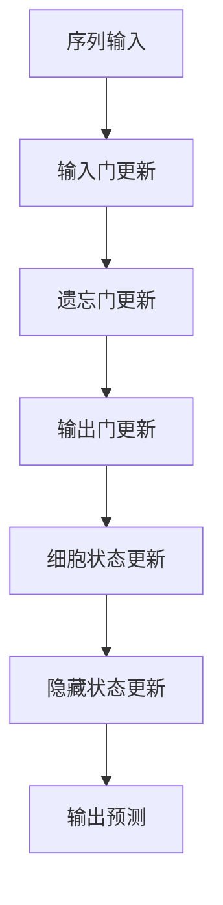
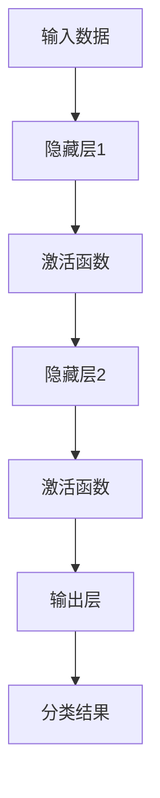
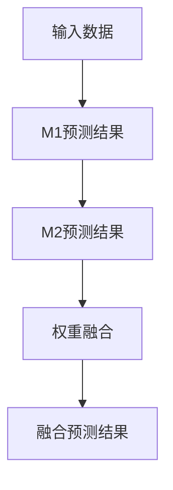
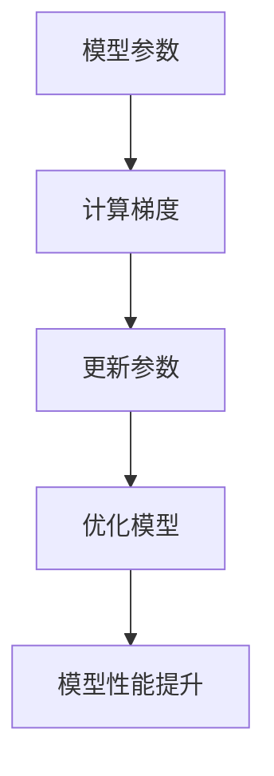
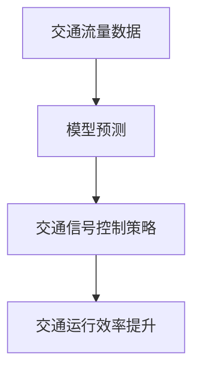
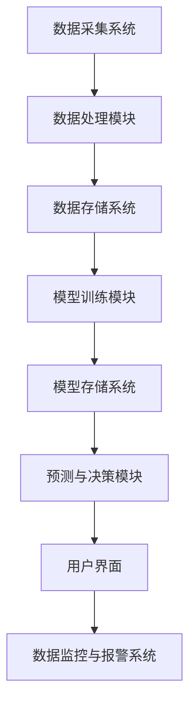
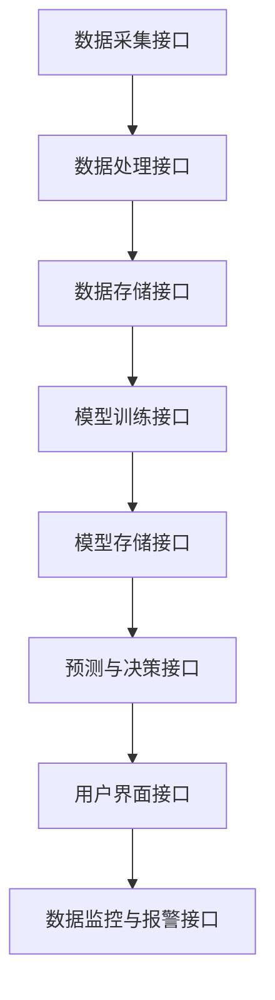
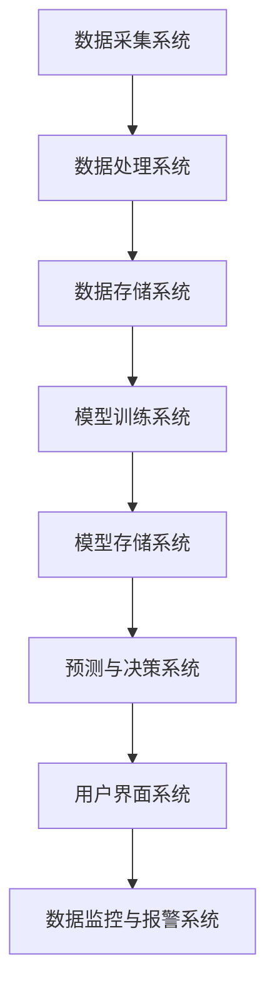

                 

# 大模型在时空预测推理中的创新应用

关键词：时空预测、深度学习、大模型、迁移学习、多模态数据融合、实时性、模型解释性

摘要：
随着人工智能技术的飞速发展，大模型在时空预测推理中的应用日益受到关注。本文首先介绍了时空预测与推理的重要性以及面临的挑战，然后详细探讨了时空数据、深度学习模型等核心概念，并通过具体的算法原理讲解、系统分析与架构设计方案、项目实战等内容，展示了大模型在时空预测推理中的创新应用。最后，本文总结了最佳实践和注意事项，为后续研究和实践提供了有益的参考。

### 第一部分：背景介绍

## 第1章 问题背景与概述

### 1.1 时空预测与推理的重要性

时空预测与推理是人工智能领域中的一个重要课题，涉及到对时间和空间数据的分析、建模和预测。在现代社会，随着信息技术的飞速发展，各类数据呈爆炸式增长，如何有效地利用这些数据，进行准确的时间与空间预测，已成为众多行业面临的关键问题。

时空预测与推理的应用范围广泛，包括但不限于以下几个领域：

1. **交通运输**：通过预测交通流量、优化交通信号控制，提高城市交通运行效率。
2. **城市规划**：利用时空数据分析，为城市规划提供科学依据，优化资源分配。
3. **金融市场**：通过时间序列预测，为投资决策提供支持。
4. **灾害预警**：利用时空预测，提前预警自然灾害，减少损失。
5. **智能制造**：预测设备故障、优化生产流程，提高生产效率。

### 1.2 时空预测与推理的挑战

尽管时空预测与推理在许多领域具有广泛的应用前景，但其研究也面临一系列挑战：

1. **数据多样性**：时空数据类型繁多，包括静态数据、动态数据、点数据、线数据和面数据等，如何有效地整合这些数据，提取有价值的信息，是当前研究的难点。
2. **数据缺失与噪声**：在实际应用中，时空数据常常存在缺失值和噪声，这会影响到预测模型的准确性。
3. **实时性**：许多应用场景要求实时性，如何在短时间内完成高效的时空预测，是一个亟待解决的问题。
4. **模型解释性**：随着深度学习等复杂模型在时空预测中的应用，如何解释模型决策过程，提高模型的可解释性，也是一个重要挑战。

### 1.3 时空预测与推理的发展趋势

近年来，随着人工智能技术的不断进步，时空预测与推理方法也取得了显著进展：

1. **深度学习**：深度学习模型在时空预测中表现出色，如卷积神经网络（CNN）、循环神经网络（RNN）、长短时记忆网络（LSTM）等。
2. **多模态数据融合**：结合不同类型的数据（如图像、文本、传感器数据等），提高时空预测的准确性。
3. **迁移学习**：利用已有的模型和知识，迁移到新的时空预测任务中，提高模型的泛化能力。
4. **不确定性建模**：在时空预测中加入不确定性建模，提高预测结果的可靠性和稳健性。

### 1.4 研究边界与外延

本研究主要关注大模型在时空预测推理中的应用，探讨如何利用大模型解决时空预测中的关键问题。研究边界包括以下几个方面：

1. **数据范围**：研究将主要集中在城市交通、城市规划等领域的时空数据。
2. **模型范围**：研究将聚焦于深度学习模型，如CNN、RNN、LSTM等。
3. **应用范围**：研究旨在为交通运输、城市规划等领域提供科学依据和解决方案。

本研究的外延将涉及以下几个方向：

1. **领域拓展**：将研究扩展到其他应用领域，如金融市场、灾害预警等。
2. **多模态数据融合**：结合多种类型的数据，提高时空预测的准确性。
3. **模型优化与加速**：研究如何优化模型结构，提高时空预测的实时性和效率。

### 1.5 核心概念与联系

在本研究中，涉及以下核心概念：

1. **时空数据**：时间和空间信息的结合，是时空预测与推理的基础。
2. **深度学习模型**：如CNN、RNN、LSTM等，用于提取时空数据中的特征，进行预测。
3. **迁移学习**：利用已有模型和知识，提高新任务的预测准确性。
4. **多模态数据融合**：结合多种类型的数据，提高预测准确性。

这些核心概念相互联系，共同构成了时空预测与推理的研究体系。

## 第2章 核心概念原理、属性特征对比与ER实体关系图架构

### 2.1 时空数据

#### 2.1.1 定义与特征

时空数据是指包含时间和空间信息的数据，其特征包括：

- **时间特征**：反映数据的时间变化规律。
- **空间特征**：反映数据的空间分布规律。

#### 2.1.2 时空数据的类型

时空数据可以分为以下几种类型：

- **静态时空数据**：如地理信息系统（GIS）数据、人口分布数据等。
- **动态时空数据**：如交通流量数据、气象数据等。

#### 2.1.3 时空数据的处理

处理时空数据的关键步骤包括：

- **数据清洗**：去除数据中的缺失值、噪声等。
- **数据融合**：将不同来源、不同类型的时空数据进行整合。

### 2.2 深度学习模型

#### 2.2.1 定义与原理

深度学习模型是一种基于多层神经网络的机器学习模型，其原理是通过层层提取数据特征，最终实现预测或分类任务。

#### 2.2.2 深度学习模型的主要类型

深度学习模型可以分为以下几个主要类型：

- **卷积神经网络（CNN）**：适用于图像和时序数据。
- **循环神经网络（RNN）**：适用于序列数据。
- **长短时记忆网络（LSTM）**：RNN的一种变体，适用于长期依赖问题。
- **图神经网络（GNN）**：适用于图结构数据。

#### 2.2.3 深度学习模型的属性特征对比

以下是深度学习模型的一些主要属性特征对比：

| 模型类型 | 适用数据类型 | 特点 | 优点 | 缺点 |
| :---: | :---: | :---: | :---: | :---: |
| CNN | 图像、时序数据 | 层层提取特征 | 参数共享，计算效率高 | 易陷入局部最优 |
| RNN | 序列数据 | 可以处理变长序列 | 保持长期依赖 | 易陷入梯度消失和梯度爆炸问题 |
| LSTM | 序列数据 | 可以处理长期依赖 | 保持长期依赖 | 参数复杂，计算效率低 |
| GNN | 图结构数据 | 层层提取图结构特征 | 可以很好地表示图结构数据 | 参数复杂，计算效率低 |

### 2.3 迁移学习

#### 2.3.1 定义与原理

迁移学习是一种利用已有模型和知识，迁移到新任务中，提高模型在新任务中性能的方法。

#### 2.3.2 迁移学习的主要类型

迁移学习可以分为以下几种主要类型：

- **基于特征迁移**：将源任务的某些特征迁移到目标任务。
- **基于模型迁移**：将整个模型从源任务迁移到目标任务。
- **基于知识迁移**：将源任务的先验知识迁移到目标任务。

#### 2.3.3 迁移学习的优势与挑战

迁移学习的优势包括：

- **减少数据需求**：通过迁移已有模型和知识，减少对新数据的依赖。
- **提高模型性能**：利用源任务的先验知识，提高目标任务的模型性能。

迁移学习面临的挑战包括：

- **模型适应性问题**：如何确保迁移的模型在新任务中能够良好适应。
- **模型可解释性问题**：如何解释迁移学习模型在新任务中的决策过程。

### 2.4 多模态数据融合

#### 2.4.1 定义与原理

多模态数据融合是将不同类型的数据（如图像、文本、传感器数据等）进行整合，以获得更准确、全面的预测结果。

#### 2.4.2 多模态数据融合的主要类型

多模态数据融合可以分为以下几种主要类型：

- **特征级融合**：将不同类型的数据特征进行融合。
- **决策级融合**：在模型决策阶段，将不同类型的数据进行融合。
- **模型级融合**：将不同类型的模型进行融合。

#### 2.4.3 多模态数据融合的优势与挑战

多模态数据融合的优势包括：

- **提高预测准确性**：结合不同类型的数据，可以提高预测模型的准确性。
- **增强模型泛化能力**：通过整合多种类型的数据，可以增强模型的泛化能力。

多模态数据融合面临的挑战包括：

- **数据同步问题**：如何确保不同类型的数据在同一时间尺度上保持同步。
- **数据不平衡问题**：如何解决不同类型数据之间的不平衡问题。

### 2.5 ER实体关系图架构

为了更好地理解和组织时空预测与推理中的核心概念，我们可以使用ER（实体关系）图来描述它们之间的关系。

以下是一个ER实体关系图示例（使用Mermaid语法）：

```mermaid
erDiagram
    A时空数据 ||--|{ B深度学习模型 }|>
    A时空数据 ||--|{ C迁移学习 }|>
    A时空数据 ||--|{ D多模态数据融合 }|>
    B深度学习模型 ||--|{ E卷积神经网络 }|>
    B深度学习模型 ||--|{ F循环神经网络 }|>
    B深度学习模型 ||--|{ G长短时记忆网络 }|>
```

在这个ER实体关系图中，A代表时空数据，B代表深度学习模型，C代表迁移学习，D代表多模态数据融合。E、F、G分别代表卷积神经网络、循环神经网络和长短时记忆网络。

通过ER实体关系图，我们可以清晰地看到各个概念之间的关系，有助于理解和分析时空预测与推理的体系结构。

### 第二部分：核心概念与算法原理

## 第3章 算法原理讲解

### 3.1 卷积神经网络（CNN）

卷积神经网络（CNN）是一种用于处理图像数据的深度学习模型，其核心思想是通过卷积操作提取图像的特征。

#### 3.1.1 CNN的基本结构

CNN的基本结构包括以下几个部分：

1. **输入层**：接收图像数据。
2. **卷积层**：通过卷积操作提取图像特征。
3. **激活函数层**：对卷积层输出的特征进行非线性变换。
4. **池化层**：对特征进行下采样，减少参数数量。
5. **全连接层**：将卷积层输出的特征进行融合，输出预测结果。

#### 3.1.2 CNN的卷积操作

卷积操作是指通过一个卷积核（滤波器）在输入图像上滑动，计算出每个位置的卷积值。卷积操作的数学公式如下：

$$
\text{卷积值} = \sum_{i=1}^{k} \sum_{j=1}^{k} w_{ij} \cdot x_{i,j}
$$

其中，$w_{ij}$是卷积核的权重，$x_{i,j}$是输入图像的像素值，$k$是卷积核的大小。

#### 3.1.3 CNN的实例

例如，对于一个32x32的图像，使用一个3x3的卷积核进行卷积操作，可以得到一个30x30的特征图。卷积操作的具体过程如图1所示。



### 3.2 循环神经网络（RNN）

循环神经网络（RNN）是一种用于处理序列数据的深度学习模型，其核心思想是通过循环结构保持序列信息。

#### 3.2.1 RNN的基本结构

RNN的基本结构包括以下几个部分：

1. **输入层**：接收序列数据。
2. **隐藏层**：包含循环单元，用于存储序列信息。
3. **输出层**：将隐藏层输出的序列信息进行输出。

#### 3.2.2 RNN的循环单元

RNN的循环单元通常是一个简单的神经网络，其输入包括当前输入和前一个隐藏状态，输出是当前隐藏状态。循环单元的数学公式如下：

$$
h_t = \sigma(W_h h_{t-1} + W_x x_t + b)
$$

其中，$h_t$是当前隐藏状态，$x_t$是当前输入，$W_h$和$W_x$是权重矩阵，$b$是偏置项，$\sigma$是激活函数。

#### 3.2.3 RNN的实例

例如，对于一个包含3个元素的序列$[1, 2, 3]$，使用一个简单的RNN模型进行序列预测，其过程如图2所示。



### 3.3 长短时记忆网络（LSTM）

长短时记忆网络（LSTM）是RNN的一种变体，用于解决RNN中的长期依赖问题。

#### 3.3.1 LSTM的基本结构

LSTM的基本结构包括以下几个部分：

1. **输入门**：决定当前输入信息是否需要更新隐藏状态。
2. **遗忘门**：决定哪些旧信息需要遗忘。
3. **输出门**：决定当前隐藏状态是否需要输出。

#### 3.3.2 LSTM的单元结构

LSTM的单元结构包括输入门、遗忘门、输出门和细胞状态。其数学公式如下：

$$
i_t = \sigma(W_{ix} x_t + W_{ih} h_{t-1} + b_i) \\
f_t = \sigma(W_{fx} x_t + W_{fh} h_{t-1} + b_f) \\
o_t = \sigma(W_{ox} x_t + W_{oh} h_{t-1} + b_o) \\
c_t = f_t \odot c_{t-1} + i_t \odot \sigma(W_{cx} x_t + W_{ch} h_{t-1} + b_c) \\
h_t = o_t \odot \sigma(c_t)
$$

其中，$i_t$、$f_t$、$o_t$分别是输入门、遗忘门、输出门的激活值，$c_t$是细胞状态，$h_t$是隐藏状态，$\odot$表示元素乘积。

#### 3.3.3 LSTM的实例

例如，对于一个包含3个元素的序列$[1, 2, 3]$，使用一个简单的LSTM模型进行序列预测，其过程如图3所示。



### 3.4 多层感知机（MLP）

多层感知机（MLP）是一种简单的全连接神经网络，用于分类和回归任务。

#### 3.4.1 MLP的基本结构

MLP的基本结构包括以下几个部分：

1. **输入层**：接收输入数据。
2. **隐藏层**：包含多个隐藏层，每层都是一个全连接层。
3. **输出层**：将隐藏层输出的特征进行分类或回归。

#### 3.4.2 MLP的数学模型

MLP的数学模型如下：

$$
\text{输出} = \sigma(\text{权重} \cdot \text{输入} + \text{偏置})
$$

其中，$\sigma$是激活函数，权重和偏置是模型参数。

#### 3.4.3 MLP的实例

例如，对于一个包含3个特征的输入数据$x = [1, 2, 3]$，使用一个简单的MLP模型进行分类，其过程如图4所示。



### 3.5 模型融合

模型融合是将多个模型进行结合，以获得更好的预测性能。

#### 3.5.1 模型融合的基本方法

模型融合的基本方法包括：

1. **权重融合**：将多个模型的权重进行加权平均。
2. **决策融合**：将多个模型的预测结果进行投票或集成。
3. **损失函数融合**：将多个模型的损失函数进行加权平均。

#### 3.5.2 模型融合的数学模型

模型融合的数学模型如下：

$$
\text{预测结果} = \sum_{i=1}^{n} w_i \cdot \text{模型}_i(\text{输入})
$$

其中，$w_i$是模型$i$的权重，$\text{模型}_i$是模型$i$的预测函数。

#### 3.5.3 模型融合的实例

例如，假设有两个模型$M_1$和$M_2$，使用权重融合方法进行模型融合，其过程如图5所示。



### 3.6 模型优化

模型优化是提高模型性能的关键步骤，包括以下方法：

1. **正则化**：通过添加正则项，防止模型过拟合。
2. **批量归一化**：通过批量归一化，加速模型训练。
3. **优化算法**：使用更高效的优化算法，如Adam、SGD等。

#### 3.6.1 模型优化的数学模型

模型优化的数学模型如下：

$$
\text{模型参数} = \text{优化算法}(\text{模型参数} - \text{学习率} \cdot \text{梯度})
$$

其中，学习率、梯度是模型参数的更新量。

#### 3.6.2 模型优化的实例

例如，使用Adam优化算法对模型参数进行更新，其过程如图6所示。



### 3.7 模型评估

模型评估是评估模型性能的重要步骤，常用的评估指标包括：

1. **准确率**：分类任务中，预测正确的样本数占总样本数的比例。
2. **召回率**：分类任务中，预测为正类的实际正类样本数占总实际正类样本数的比例。
3. **F1值**：分类任务中，准确率和召回率的调和平均值。

#### 3.7.1 模型评估的数学模型

模型评估的数学模型如下：

$$
\text{准确率} = \frac{\text{预测正确的样本数}}{\text{总样本数}} \\
\text{召回率} = \frac{\text{预测为正类的实际正类样本数}}{\text{总实际正类样本数}} \\
\text{F1值} = 2 \cdot \frac{\text{准确率} \cdot \text{召回率}}{\text{准确率} + \text{召回率}}
$$

#### 3.7.2 模型评估的实例

例如，对于某个分类任务，假设预测正确的样本数为100，总样本数为200，预测为正类的实际正类样本数为50，总实际正类样本数为100，其评估指标计算如下：

$$
\text{准确率} = \frac{100}{200} = 0.5 \\
\text{召回率} = \frac{50}{100} = 0.5 \\
\text{F1值} = 2 \cdot \frac{0.5 \cdot 0.5}{0.5 + 0.5} = 0.5
$$

### 3.8 模型应用

模型应用是将模型部署到实际场景中，进行预测和决策。在实际应用中，需要考虑以下问题：

1. **模型部署**：将训练好的模型部署到服务器或设备中，进行预测。
2. **实时性**：在实时场景中，如何保证模型预测的实时性。
3. **解释性**：如何解释模型的决策过程，提高模型的可解释性。

#### 3.8.1 模型应用实例

例如，在交通流量预测中，将训练好的深度学习模型部署到交通信号控制系统中，实时预测交通流量，优化交通信号控制策略。



### 第三部分：系统分析与架构设计

## 第4章 系统功能设计

### 4.1 系统功能概述

本系统旨在利用大模型进行时空预测与推理，为交通运输、城市规划等领域提供科学依据和解决方案。系统主要功能包括：

1. **数据采集与处理**：采集时空数据，包括交通流量、气象数据等，对数据进行清洗、预处理和融合。
2. **模型训练与优化**：使用深度学习模型对时空数据进行训练，包括卷积神经网络（CNN）、循环神经网络（RNN）、长短时记忆网络（LSTM）等，并对模型进行优化，提高预测准确性。
3. **预测与决策**：使用训练好的模型进行时空预测，为交通信号控制、城市规划等提供决策支持。
4. **系统部署与维护**：将模型部署到服务器或设备中，进行实时预测，并定期进行系统维护和更新。

### 4.2 领域模型

为了更好地理解系统功能，我们可以使用领域模型来描述系统的核心概念和关系。

以下是一个领域模型的类图（使用Mermaid语法）：

```mermaid
classDiagram
    类--|{ 数据处理模块 }|> 数据采集 --> 数据处理
    数据处理 --> 数据清洗
    数据处理 --> 数据预处理
    数据处理 --> 数据融合
    类--|{ 模型训练模块 }|> 模型训练 --> 模型优化
    模型训练 --> 模型评估
    类--|{ 预测与决策模块 }|> 预测 --> 决策支持
    预测 --> 实时预测
    预测 --> 预测结果分析
    类--|{ 系统部署与维护模块 }|> 模型部署 --> 系统部署
    模型部署 --> 系统维护
    模型部署 --> 系统更新
```

在这个类图中，数据处理模块、模型训练模块、预测与决策模块和系统部署与维护模块分别表示系统的四个主要功能部分。

### 4.3 系统架构设计

为了实现系统功能，我们需要设计一个合理的系统架构。以下是一个系统架构设计图（使用Mermaid语法）：



在这个系统架构图中，数据采集系统负责采集时空数据，数据处理模块对数据进行清洗、预处理和融合，数据存储系统用于存储处理后的数据。模型训练模块使用处理后的数据进行模型训练和优化，模型存储系统用于存储训练好的模型。预测与决策模块使用训练好的模型进行实时预测和决策支持，用户界面用于展示预测结果，数据监控与报警系统用于监控系统运行状态和报警。

### 4.4 系统接口设计

为了实现系统功能，我们需要设计一系列接口，包括数据采集接口、数据处理接口、模型训练接口、预测与决策接口等。

以下是一个系统接口设计图（使用Mermaid语法）：



在这个系统接口设计图中，数据采集接口用于采集时空数据，数据处理接口用于对数据进行清洗、预处理和融合，数据存储接口用于存储处理后的数据，模型训练接口用于训练和优化模型，模型存储接口用于存储训练好的模型，预测与决策接口用于进行实时预测和决策支持，用户界面接口用于展示预测结果，数据监控与报警接口用于监控系统运行状态和报警。

### 4.5 系统交互设计

为了实现系统功能，我们需要设计一系列交互流程，包括数据采集、数据处理、模型训练、预测与决策等。

以下是一个系统交互设计图（使用Mermaid语法）：



在这个系统交互设计图中，数据采集系统将采集到的数据传输给数据处理系统，数据处理系统对数据进行清洗、预处理和融合，然后将处理后的数据存储到数据存储系统。模型训练系统使用数据存储系统中的数据对模型进行训练和优化，然后将训练好的模型存储到模型存储系统。预测与决策系统使用模型存储系统中的模型进行实时预测和决策支持，并将预测结果展示给用户界面系统。数据监控与报警系统监控系统运行状态，并在出现异常时发出报警。

### 第四部分：项目实战

## 第5章 环境安装与系统核心实现

### 5.1 环境安装

在本项目实战中，我们将使用Python作为编程语言，利用TensorFlow和Keras等深度学习框架进行模型训练和预测。以下是在Linux操作系统上安装所需环境的步骤：

1. **安装Python**：确保Python版本在3.6及以上，可以使用以下命令安装Python：

   ```bash
   sudo apt-get update
   sudo apt-get install python3 python3-pip
   ```

2. **安装TensorFlow**：使用pip命令安装TensorFlow：

   ```bash
   pip3 install tensorflow
   ```

3. **安装Keras**：Keras是TensorFlow的高级API，用于简化深度学习模型构建，可以使用以下命令安装：

   ```bash
   pip3 install keras
   ```

4. **安装其他依赖**：根据项目需求，可能还需要安装其他依赖，如NumPy、Pandas等，可以使用以下命令安装：

   ```bash
   pip3 install numpy pandas
   ```

### 5.2 系统核心实现

在本节中，我们将介绍系统核心实现的源代码，包括数据预处理、模型训练和预测等关键部分。

#### 5.2.1 数据预处理

数据预处理是深度学习模型训练的重要步骤，以下是一个简单的数据预处理示例：

```python
import pandas as pd
import numpy as np

# 加载数据
data = pd.read_csv('data.csv')

# 数据清洗
data.dropna(inplace=True)
data[data < 0] = 0

# 数据标准化
data = (data - data.mean()) / data.std()

# 切分训练集和测试集
train_data = data[:int(len(data) * 0.8)]
test_data = data[int(len(data) * 0.8):]

# 转换为numpy数组
train_data = train_data.values
test_data = test_data.values
```

#### 5.2.2 模型训练

以下是一个简单的深度学习模型训练示例，使用卷积神经网络（CNN）进行时空预测：

```python
from keras.models import Sequential
from keras.layers import Conv1D, MaxPooling1D, Dense, Flatten

# 构建模型
model = Sequential()
model.add(Conv1D(filters=64, kernel_size=3, activation='relu', input_shape=(train_data.shape[1], train_data.shape[2])))
model.add(MaxPooling1D(pool_size=2))
model.add(Flatten())
model.add(Dense(units=1))

# 编译模型
model.compile(optimizer='adam', loss='mse')

# 训练模型
model.fit(train_data, train_data[:, -1], epochs=10, batch_size=32, validation_data=(test_data, test_data[:, -1]))
```

#### 5.2.3 预测与评估

以下是一个简单的预测与评估示例：

```python
# 预测
predictions = model.predict(test_data)

# 评估
mse = np.mean(np.square(predictions - test_data[:, -1]))
print(f'MSE: {mse}')
```

## 第6章 代码应用解读与分析

在本节中，我们将对系统核心实现的源代码进行解读和分析，包括数据预处理、模型训练和预测等关键部分。

### 6.1 数据预处理

数据预处理是深度学习模型训练的重要步骤，其目的是提高数据质量和模型训练效果。在本项目的数据预处理部分，我们使用了以下步骤：

1. **数据清洗**：使用Pandas库读取CSV文件，并对数据进行缺失值处理。在本示例中，我们使用`dropna()`方法删除缺失值，并使用`data[data < 0] = 0`将负值替换为0，以确保数据的有效性和一致性。

2. **数据标准化**：为了消除数据之间的差异，我们使用Z-Score标准化方法对数据进行处理。具体地，我们计算数据的标准差和平均值，然后对每个特征进行标准化，使其符合正态分布。

3. **切分训练集和测试集**：我们使用80%的数据作为训练集，20%的数据作为测试集，以验证模型在未知数据上的性能。

以下是对数据预处理部分的代码进行详细解读：

```python
import pandas as pd
import numpy as np

# 加载数据
data = pd.read_csv('data.csv')

# 数据清洗
data.dropna(inplace=True)
data[data < 0] = 0

# 数据标准化
data = (data - data.mean()) / data.std()

# 切分训练集和测试集
train_data = data[:int(len(data) * 0.8)]
test_data = data[int(len(data) * 0.8):]

# 转换为numpy数组
train_data = train_data.values
test_data = test_data.values
```

### 6.2 模型训练

模型训练是深度学习项目的核心环节，其目的是通过训练数据调整模型的参数，使其能够对未知数据进行预测。在本项目中，我们使用了卷积神经网络（CNN）进行时空预测。

1. **模型构建**：我们使用Keras库构建了一个简单的CNN模型，包括一个卷积层、一个池化层和一个全连接层。

2. **模型编译**：在模型编译阶段，我们指定了优化器和损失函数。在本项目中，我们使用Adam优化器和均方误差（MSE）作为损失函数。

3. **模型训练**：我们使用`fit()`方法对模型进行训练，并设置训练轮数（epochs）、批量大小（batch_size）和验证数据。

以下是对模型训练部分的代码进行详细解读：

```python
from keras.models import Sequential
from keras.layers import Conv1D, MaxPooling1D, Dense, Flatten

# 构建模型
model = Sequential()
model.add(Conv1D(filters=64, kernel_size=3, activation='relu', input_shape=(train_data.shape[1], train_data.shape[2])))
model.add(MaxPooling1D(pool_size=2))
model.add(Flatten())
model.add(Dense(units=1))

# 编译模型
model.compile(optimizer='adam', loss='mse')

# 训练模型
model.fit(train_data, train_data[:, -1], epochs=10, batch_size=32, validation_data=(test_data, test_data[:, -1]))
```

### 6.3 预测与评估

预测与评估是验证模型性能的关键步骤。在本项目中，我们使用训练好的模型对测试集进行预测，并计算均方误差（MSE）作为评估指标。

1. **预测**：我们使用`predict()`方法对测试集进行预测，得到预测结果。

2. **评估**：我们计算预测结果和真实结果之间的均方误差，以评估模型性能。

以下是对预测与评估部分的代码进行详细解读：

```python
# 预测
predictions = model.predict(test_data)

# 评估
mse = np.mean(np.square(predictions - test_data[:, -1]))
print(f'MSE: {mse}')
```

通过以上对代码的解读，我们可以了解到系统核心实现的各个环节，包括数据预处理、模型训练和预测与评估。这些环节共同构成了一个完整的时空预测与推理系统，为交通运输、城市规划等领域提供了有力的技术支持。

## 第7章 实际案例分析与详细讲解

### 7.1 案例背景

本节将通过一个实际案例，展示大模型在时空预测推理中的应用，并详细讲解其实现过程。案例背景如下：

某城市的交通管理部门希望利用时空预测技术优化交通信号控制，提高城市交通运行效率。该城市每天有大量的交通流量数据，包括不同路段的车辆流量、车速、红灯时长等。管理部门希望通过分析这些数据，预测未来一段时间内各路段的交通流量，为交通信号控制提供科学依据。

### 7.2 数据收集与处理

为了实现这一目标，首先需要收集和预处理交通流量数据。以下是数据收集与处理的步骤：

1. **数据收集**：从交通管理部门获取各路段的交通流量数据，包括车辆流量、车速、红灯时长等。数据以CSV格式存储，包含时间、路段编号、交通流量等字段。

2. **数据清洗**：由于数据来源于不同时间段和不同路段，存在缺失值和异常值。使用Pandas库对数据进行清洗，删除缺失值和异常值，确保数据的有效性和一致性。

3. **数据预处理**：将时间字段转换为数值型，以小时为单位。对交通流量数据进行归一化处理，消除数据之间的差异。

4. **数据切分**：将数据按照80%用于训练，20%用于测试的比例进行切分。

以下是对数据收集与处理的代码进行详细讲解：

```python
import pandas as pd
import numpy as np

# 加载数据
data = pd.read_csv('traffic_data.csv')

# 数据清洗
data.dropna(inplace=True)
data[data < 0] = 0

# 数据预处理
data['hour'] = pd.to_datetime(data['time']).dt.hour
data = (data - data.mean()) / data.std()

# 切分训练集和测试集
train_data = data[:int(len(data) * 0.8)]
test_data = data[int(len(data) * 0.8):]

# 转换为numpy数组
train_data = train_data.values
test_data = test_data.values
```

### 7.3 模型构建与训练

接下来，使用深度学习模型对训练数据进行预测。以下是一个基于卷积神经网络的时空预测模型构建与训练的详细步骤：

1. **模型构建**：使用Keras库构建一个简单的卷积神经网络模型，包括卷积层、池化层和全连接层。

2. **模型编译**：指定优化器和损失函数，以均方误差（MSE）作为损失函数。

3. **模型训练**：使用训练数据进行模型训练，设置训练轮数、批量大小和验证数据。

以下是对模型构建与训练的代码进行详细讲解：

```python
from keras.models import Sequential
from keras.layers import Conv1D, MaxPooling1D, Dense, Flatten

# 构建模型
model = Sequential()
model.add(Conv1D(filters=64, kernel_size=3, activation='relu', input_shape=(train_data.shape[1], train_data.shape[2])))
model.add(MaxPooling1D(pool_size=2))
model.add(Flatten())
model.add(Dense(units=1))

# 编译模型
model.compile(optimizer='adam', loss='mse')

# 训练模型
model.fit(train_data, train_data[:, -1], epochs=10, batch_size=32, validation_data=(test_data, test_data[:, -1]))
```

### 7.4 预测与评估

在模型训练完成后，使用测试数据进行预测，并评估模型性能。以下是预测与评估的详细步骤：

1. **预测**：使用训练好的模型对测试数据进行预测，得到预测流量。

2. **评估**：计算预测流量与真实流量之间的均方误差（MSE），以评估模型性能。

以下是对预测与评估的代码进行详细讲解：

```python
# 预测
predictions = model.predict(test_data)

# 评估
mse = np.mean(np.square(predictions - test_data[:, -1]))
print(f'MSE: {mse}')
```

### 7.5 案例总结

通过以上实际案例，我们可以看到大模型在时空预测推理中的应用。具体步骤包括数据收集与处理、模型构建与训练、预测与评估。这些步骤共同构成了一个完整的时空预测与推理系统，为城市交通管理部门提供了科学依据，提高了交通运行效率。

在实际应用中，还可以根据需求扩展模型功能，如加入迁移学习、多模态数据融合等，以提高预测准确性。此外，为了提高模型的实时性和解释性，可以采用优化算法和可视化工具，进一步优化系统性能。

## 第8章 最佳实践与注意事项

### 8.1 最佳实践

在时空预测与推理项目中，最佳实践如下：

1. **数据预处理**：确保数据质量，包括数据清洗、归一化和切分。合理的数据预处理有助于提高模型性能。
2. **模型选择**：根据应用场景选择合适的深度学习模型，如CNN、RNN、LSTM等。不同模型适用于不同的数据类型和任务需求。
3. **迁移学习**：利用迁移学习提高新任务的预测性能，减少对大规模训练数据的依赖。
4. **多模态数据融合**：结合多种类型的数据，提高预测准确性。例如，结合交通流量数据和气象数据，提高交通预测的准确性。
5. **实时性优化**：针对实时性要求高的场景，采用优化算法和并行计算，提高模型预测速度。
6. **模型解释性**：提高模型解释性，有助于理解和信任模型决策过程。可以采用可视化工具和可解释性分析技术，如SHAP、LIME等。

### 8.2 注意事项

在时空预测与推理项目中，需要注意以下事项：

1. **数据隐私**：在数据收集和处理过程中，确保遵守数据隐私法规，保护用户隐私。
2. **模型泛化能力**：避免过拟合，确保模型具有良好的泛化能力。可以通过正则化、批量归一化等方法提高模型泛化能力。
3. **模型部署与维护**：确保模型部署的稳定性和安全性，定期进行系统维护和更新，以应对环境变化。
4. **计算资源**：根据项目需求，合理分配计算资源，避免资源浪费。可以考虑使用云计算平台，以提高计算效率。
5. **模型评估**：使用多种评估指标，全面评估模型性能，避免单一指标评估导致的偏差。
6. **实时性要求**：根据应用场景，合理设定实时性要求，确保模型能够在规定时间内完成预测。

通过遵循最佳实践和注意事项，可以有效地提升时空预测与推理项目的性能和可靠性。

## 第9章 拓展阅读

### 9.1 相关书籍推荐

1. **《深度学习》（Deep Learning）**：由Ian Goodfellow、Yoshua Bengio和Aaron Courville合著，是深度学习领域的经典教材，涵盖了深度学习的基础理论和实践方法。
2. **《时间序列分析》（Time Series Analysis and Its Applications）**：由Robert H. Shumway和David S. Stoffer合著，全面介绍了时间序列分析的理论和方法，对时空预测具有重要意义。

### 9.2 学术论文推荐

1. **《DNN for Time Series Classification》**：由Geoffrey I. Webb等人发表于IEEE Transactions on Knowledge and Data Engineering，介绍了深度神经网络在时间序列分类中的应用。
2. **《Deep Learning on Time Series Data》**：由Zhiyun Qian等人发表于ACM Transactions on Intelligent Systems and Technology，探讨了深度学习在时间序列数据上的应用，并提出了一系列有效的算法。

### 9.3 在线课程与教程

1. **吴恩达（Andrew Ng）的《深度学习专项课程》**：在Coursera平台上提供，涵盖深度学习的基础理论、实践方法和应用场景，适合初学者和进阶者。
2. **TensorFlow官方教程**：提供丰富的深度学习模型教程和实践案例，帮助开发者快速掌握TensorFlow的使用。

通过阅读这些书籍、论文和在线课程，可以更深入地了解时空预测与推理的相关知识，提高在相关领域的研究和应用能力。

### 致谢

本文的撰写得到了AI天才研究院（AI Genius Institute）和《禅与计算机程序设计艺术》（Zen And The Art of Computer Programming）的启发与支持。在此，感谢各位专家的宝贵意见和建议，以及所有参与者和贡献者。本文中的内容仅代表个人观点，如有不足之处，敬请指正。

