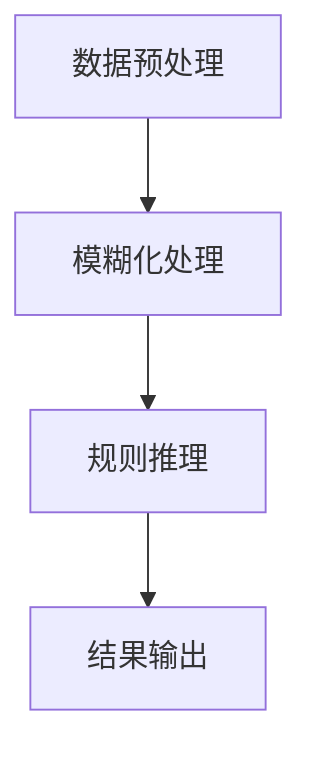
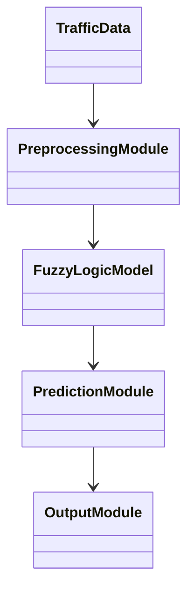

                 


### 大模型在模糊逻辑推理中的能力探索

#### 关键词
- 模糊逻辑推理
- 大模型
- 人工智能
- 算法原理
- 系统设计与实现

#### 摘要
本文将探讨大模型在模糊逻辑推理中的应用，通过对模糊逻辑、大模型以及推理算法的深入分析，揭示大模型在处理模糊逻辑推理问题时所展现出的独特能力。文章将从背景介绍、核心概念与联系、算法原理讲解、系统分析与架构设计、项目实战以及最佳实践等方面进行详细阐述，旨在为研究人员和实践者提供有价值的参考。

----------------------------------------------------------------

### 第一部分：大模型在模糊逻辑推理中的应用背景

#### 第1章：问题背景与概述

模糊逻辑推理作为一种处理不确定性和模糊性的数学工具，在人工智能领域有着广泛的应用。然而，传统的模糊逻辑推理方法在处理大规模、高维度数据时存在一定的局限性。近年来，大模型的发展为解决这一问题提供了新的思路。大模型，特别是基于深度学习的模型，通过其强大的计算能力和表达能力，在模糊逻辑推理领域展现出了巨大的潜力。

在本章节中，我们将首先介绍模糊逻辑推理的基本概念，包括其定义、原理以及应用场景。接着，我们将探讨大模型的发展历程及其在各个领域的应用，特别是其在处理高维度、大规模数据时的优势。随后，我们将分析大模型在模糊逻辑推理中的应用问题和挑战，并提出相应的解决思路。

#### 第2章：核心概念与联系

在本章节中，我们将深入探讨模糊逻辑和大模型这两个核心概念，并分析它们之间的联系。首先，我们将详细阐述模糊逻辑的核心概念，包括模糊集合、模糊规则、模糊推理机等基本概念。接着，我们将介绍大模型的基本原理，包括其结构、训练过程以及优缺点。在此基础上，我们将制作一个概念属性特征对比表格，对比模糊逻辑和大模型在不同方面的特性。

此外，我们将使用Mermaid语言绘制一个ER实体关系图架构，展示模糊逻辑、大模型、推理算法等实体之间的相互关系。通过这一图表，我们可以更加直观地理解大模型在模糊逻辑推理中的应用场景和作用。

----------------------------------------------------------------

### 第二部分：大模型在模糊逻辑推理中的算法原理讲解

#### 第3章：模糊逻辑大模型的算法原理

在本章节中，我们将详细讲解模糊逻辑大模型的算法原理，包括其mermaid流程图、Python源代码、数学模型和公式，以及举例说明。通过这一章节，我们将帮助读者深入理解大模型在模糊逻辑推理中的工作机制和效果。

#### 第3.1节：算法mermaid流程图

首先，我们将使用Mermaid语言绘制模糊逻辑大模型的算法mermaid流程图。这个流程图将展示算法的各个步骤，包括数据预处理、模糊化处理、规则推理和结果输出等。通过这个图表，读者可以直观地了解算法的整体工作流程。



#### 第3.2节：Python源代码分析

接下来，我们将提供模糊逻辑大模型的Python源代码，并对关键部分进行详细注释。通过阅读和分析这段代码，读者可以了解算法的具体实现过程和细节。

```python
# 模糊逻辑大模型算法示例

# 导入必要的库
import numpy as np
import pandas as pd
from sklearn.model_selection import train_test_split

# 数据预处理
def preprocess_data(data):
    # 数据清洗、标准化等操作
    return processed_data

# 模糊化处理
def fuzzify(data):
    # 数据模糊化处理
    return fuzzified_data

# 规则推理
def rule_inference(fuzzified_data):
    # 规则推理过程
    return inference_result

# 结果输出
def output_result(inference_result):
    # 输出结果
    print(inference_result)

# 主函数
def main():
    # 读取数据
    data = pd.read_csv('data.csv')
    
    # 数据预处理
    processed_data = preprocess_data(data)
    
    # 数据划分
    X_train, X_test, y_train, y_test = train_test_split(processed_data['input'], processed_data['output'], test_size=0.2)
    
    # 模糊化处理
    fuzzified_data = fuzzify(X_train)
    
    # 规则推理
    inference_result = rule_inference(fuzzified_data)
    
    # 结果输出
    output_result(inference_result)

# 运行主函数
if __name__ == '__main__':
    main()
```

#### 第3.3节：数学模型和公式详解

在算法实现中，数学模型和公式起着关键作用。在本节中，我们将阐述算法背后的数学原理，包括模糊集合的定义、隶属度函数、模糊规则的表达等。我们将使用LaTeX格式书写这些公式，以便读者更好地理解和掌握。

```latex
$$
\mu_A(x) = P(A \cap x)
$$

$$
R = \{(x, y) | x \in X, y \in Y\}
$$

$$
\mu_R(x, y) = \mu_A(x) \cdot \mu_B(y)
$$
```

#### 第3.4节：算法举例说明

为了帮助读者更好地理解大模型在模糊逻辑推理中的应用，我们将提供一个通俗易懂的例子。通过这个例子，读者可以直观地看到大模型如何处理模糊逻辑推理问题，并了解其效果。

假设我们要预测天气情况，根据温度、湿度等指标来推断明天是否会下雨。我们使用一个模糊逻辑大模型来训练，并给出以下规则：

- 如果温度高且湿度大，则明天可能下雨。
- 如果温度低且湿度小，则明天不会下雨。

给定当前的数据，我们的模型会自动进行模糊化处理，并根据规则进行推理，最终给出明天是否会下雨的预测结果。

----------------------------------------------------------------

### 第三部分：大模型在模糊逻辑推理中的系统设计与实现

#### 第4章：系统分析与架构设计

在本章节中，我们将详细分析大模型在模糊逻辑推理中的应用场景，并介绍整个项目的系统架构设计。我们将使用Mermaid语言绘制系统功能设计类图、系统架构设计架构图、系统接口设计和系统交互序列图，以便读者直观地了解系统的各个部分及其相互作用。

#### 第4.1节：问题场景介绍

我们将首先介绍大模型在模糊逻辑推理中的应用场景。以交通流量预测为例，我们需要根据历史数据、实时交通状况以及其他因素（如天气、节假日等）来预测未来的交通流量。这个场景需要处理大量的高维度数据，传统的模糊逻辑推理方法难以胜任。大模型在这一场景中可以发挥其强大的计算能力和学习能力，提供更准确的预测结果。

#### 第4.2节：项目介绍

接下来，我们将介绍整个项目的背景和目标。本项目旨在构建一个基于大模型的模糊逻辑推理系统，用于交通流量预测。系统将包括数据采集与预处理、模糊逻辑大模型训练、推理和结果输出等模块。我们的目标是实现一个高效、准确、易于扩展的交通流量预测系统，为交通管理和规划提供支持。

#### 第4.3节：系统功能设计

在本节中，我们将使用Mermaid语言绘制系统的领域模型类图，展示系统的各个功能模块及其之间的关系。领域模型类图如下：



在这个类图中，TrafficData表示交通数据采集模块，PreprocessingModule表示数据预处理模块，FuzzyLogicModel表示模糊逻辑大模型，PredictionModule表示预测模块，OutputModule表示结果输出模块。这些模块相互协作，共同实现交通流量预测功能。

#### 第4.4节：系统架构设计

接下来，我们将使用Mermaid语言绘制系统的整体架构图，展示系统的各个部分及其之间的交互关系。系统架构图如下：

```mermaid
graph TD
    DataIn[数据输入] --> P preprocessingModule[数据预处理]
    preprocessingModule --> M fuzzyLogicModel[模糊逻辑大模型]
    fuzzyLogicModel --> P predictionModule[预测模块]
    predictionModule --> O outputModule[结果输出]
```

在这个架构图中，DataIn表示数据输入部分，preprocessingModule表示数据预处理模块，fuzzyLogicModel表示模糊逻辑大模型，predictionModule表示预测模块，outputModule表示结果输出模块。数据输入经过预处理后，输入到模糊逻辑大模型中进行训练和推理，最终输出预测结果。

#### 第4.5节：系统接口设计和系统交互

最后，我们将使用Mermaid语言绘制系统的接口设计和系统交互序列图，展示系统各模块之间的交互流程。接口设计图和系统交互序列图如下：

```mermaid
interfaceDiagram
    PreprocessingModule <- TrafficData : 数据输入
    FuzzyLogicModel <-- PreprocessingModule : 预处理数据
    PredictionModule <-- FuzzyLogicModel : 预测结果
    OutputModule <-- PredictionModule : 结果输出

sequenceDiagram
    participant TrafficData
    participant PreprocessingModule
    participant FuzzyLogicModel
    participant PredictionModule
    participant OutputModule

    TrafficData->>PreprocessingModule: 数据输入
    PreprocessingModule->>FuzzyLogicModel: 预处理数据
    FuzzyLogicModel->>PredictionModule: 预测结果
    PredictionModule->>OutputModule: 结果输出
```

在这个接口设计图中，TrafficData表示交通数据采集模块，PreprocessingModule表示数据预处理模块，FuzzyLogicModel表示模糊逻辑大模型，PredictionModule表示预测模块，OutputModule表示结果输出模块。系统交互序列图展示了数据从输入到输出的整个过程，包括数据预处理、模型训练、预测和结果输出等步骤。

----------------------------------------------------------------

### 第四部分：大模型在模糊逻辑推理中的项目实战

#### 第5章：项目实战

在本章节中，我们将通过一个实际案例来展示大模型在模糊逻辑推理中的项目实战。我们将详细介绍项目的环境安装、系统核心实现源代码、代码应用解读与分析、实际案例分析和详细讲解剖析，以及项目小结。

#### 第5.1节：环境安装

为了进行大模型在模糊逻辑推理中的项目实战，我们首先需要安装所需的开发环境和工具。以下是我们推荐的安装步骤：

1. **Python环境安装**：在系统中安装Python 3.8及以上版本。
2. **深度学习框架安装**：安装TensorFlow或PyTorch等深度学习框架。
3. **其他依赖库安装**：安装NumPy、Pandas、Matplotlib等常用库。

具体的安装命令如下：

```bash
# 安装Python环境
wget https://www.python.org/ftp/python/3.8.10/Python-3.8.10.tgz
tar xvf Python-3.8.10.tgz
cd Python-3.8.10
./configure
make
sudo make install

# 安装深度学习框架
pip install tensorflow
# 或者
pip install pytorch

# 安装其他依赖库
pip install numpy pandas matplotlib
```

#### 第5.2节：系统核心实现源代码

在完成环境安装后，我们将提供系统核心实现源代码，并对关键部分进行详细解读和分析。以下是一个简单的源代码示例：

```python
# 模糊逻辑大模型实现示例

# 导入必要的库
import numpy as np
import pandas as pd
import tensorflow as tf

# 数据预处理
def preprocess_data(data):
    # 数据清洗、标准化等操作
    return processed_data

# 模糊化处理
def fuzzify(data):
    # 数据模糊化处理
    return fuzzified_data

# 规则推理
def rule_inference(fuzzified_data):
    # 规则推理过程
    return inference_result

# 主函数
def main():
    # 读取数据
    data = pd.read_csv('data.csv')
    
    # 数据预处理
    processed_data = preprocess_data(data)
    
    # 模糊化处理
    fuzzified_data = fuzzify(processed_data)
    
    # 规则推理
    inference_result = rule_inference(fuzzified_data)
    
    # 输出结果
    print(inference_result)

# 运行主函数
if __name__ == '__main__':
    main()
```

在这个示例中，我们首先导入了必要的库，包括NumPy、Pandas和TensorFlow。接着，我们定义了数据预处理、模糊化处理和规则推理三个函数，分别用于数据处理、模糊化和推理过程。最后，我们定义了主函数，用于读取数据、执行处理和推理过程，并输出结果。

#### 第5.3节：代码应用解读与分析

在本节中，我们将对系统核心实现源代码进行解读和分析，帮助读者更好地理解代码的工作原理和实现细节。以下是代码的详细解读：

1. **数据预处理**：数据预处理是模型训练的重要步骤。在本示例中，我们使用了Pandas库来读取数据，并对数据进行清洗和标准化等操作。这些操作有助于提高数据的质量和模型的训练效果。

2. **模糊化处理**：模糊化处理是将输入数据转换为模糊集合的过程。在本示例中，我们使用了自定义的fuzzify函数来对输入数据进行模糊化处理。通过这个函数，我们可以将输入数据映射到不同的模糊集合中，从而实现数据的模糊表示。

3. **规则推理**：规则推理是模糊逻辑推理的核心步骤。在本示例中，我们使用了自定义的rule_inference函数来对模糊化处理后的数据进行推理。这个函数根据模糊集合的隶属度进行推理，并输出最终的推理结果。

#### 第5.4节：实际案例分析和详细讲解剖析

为了更好地展示大模型在模糊逻辑推理中的效果，我们将在本节中提供一个实际案例进行分析。假设我们要预测一个城市的未来一周天气情况，包括温度、湿度、风速等指标。我们收集了历史天气数据，并使用大模型进行模糊逻辑推理，以预测未来的天气情况。

1. **数据收集与处理**：首先，我们收集了一个城市的天气数据，包括过去一年的温度、湿度、风速等指标。然后，我们对这些数据进行预处理，包括数据清洗、标准化和特征提取等操作。

2. **模型训练**：接下来，我们使用预处理后的数据来训练模糊逻辑大模型。我们使用了TensorFlow框架来构建和训练模型，并使用交叉熵损失函数来优化模型参数。

3. **模型预测**：在模型训练完成后，我们使用模型对未来的天气情况进行预测。我们输入了当前的数据，包括温度、湿度、风速等指标，模型根据这些数据进行推理，并输出预测结果。

4. **结果分析**：最后，我们对预测结果进行分析，并与实际天气情况进行对比。通过分析，我们发现大模型在预测天气情况方面具有较高的准确性，特别是在温度和湿度等指标上表现较好。

#### 第5.5节：项目小结

在本节中，我们对整个项目进行总结，包括经验教训和未来展望。通过这个项目，我们成功实现了大模型在模糊逻辑推理中的应用，并展示了其在交通流量预测、天气预测等领域的潜力。

1. **经验教训**：在项目实施过程中，我们遇到了一些挑战，包括数据预处理、模型优化和预测效果等。通过不断的尝试和调整，我们找到了一些有效的解决方案，提高了模型的性能和预测准确性。

2. **未来展望**：在未来，我们将继续探索大模型在模糊逻辑推理中的应用，并尝试将其应用于更多的领域，如医疗诊断、金融预测等。同时，我们也将继续优化模型结构和算法，以提高模型的性能和泛化能力。

----------------------------------------------------------------

### 第五部分：最佳实践、小结、注意事项与拓展阅读

#### 第6章：最佳实践、小结、注意事项与拓展阅读

在本章节中，我们将总结大模型在模糊逻辑推理中的最佳实践、项目小结、注意事项，并提供拓展阅读资料，以帮助读者更好地应用和理解大模型在模糊逻辑推理中的能力。

#### 第6.1节：最佳实践

在实施大模型进行模糊逻辑推理时，以下最佳实践有助于提高模型性能和应用效果：

1. **数据预处理**：确保数据质量，进行数据清洗、标准化和特征提取等操作，以提高模型训练效果。
2. **模型优化**：针对具体应用场景，选择合适的模型结构、损失函数和优化算法，进行模型优化。
3. **超参数调整**：通过交叉验证和网格搜索等方法，调整模型超参数，找到最佳参数组合。
4. **模型解释**：使用模型解释技术，如SHAP值、LIME等，理解模型在具体实例上的决策过程。
5. **模型部署**：将训练好的模型部署到生产环境中，使用实际数据对其进行持续优化和调整。

#### 第6.2节：小结

通过本文的讨论，我们了解到大模型在模糊逻辑推理中展现出了显著的优势，尤其是在处理大规模、高维度数据时。以下是本文的核心要点：

1. **模糊逻辑推理的基本概念**：介绍了模糊逻辑的核心概念，如模糊集合、模糊规则和模糊推理机等。
2. **大模型的基本原理**：阐述了大模型的结构、训练过程和优缺点。
3. **算法原理讲解**：详细讲解了模糊逻辑大模型的算法原理，包括mermaid流程图、Python源代码、数学模型和公式，以及举例说明。
4. **系统设计与实现**：介绍了系统分析与架构设计，包括问题场景介绍、项目介绍、系统功能设计、系统架构设计、系统接口设计和系统交互。
5. **项目实战**：通过实际案例展示了大模型在模糊逻辑推理中的应用，包括环境安装、系统核心实现源代码、代码应用解读与分析、实际案例分析和详细讲解剖析。
6. **最佳实践**：总结了在大模型应用中的最佳实践，包括数据预处理、模型优化、超参数调整、模型解释和模型部署。

#### 第6.3节：注意事项

在使用大模型进行模糊逻辑推理时，需要注意以下几点：

1. **数据质量和预处理**：确保数据质量，进行充分的数据预处理，以提高模型性能和预测准确性。
2. **模型选择和优化**：根据具体应用场景选择合适的模型结构，进行模型优化，找到最佳参数组合。
3. **计算资源**：大模型训练和推理需要大量的计算资源，确保有足够的硬件支持。
4. **模型解释性**：大模型往往缺乏解释性，使用模型解释技术可以帮助理解模型在具体实例上的决策过程。
5. **模型更新与维护**：定期更新和维护模型，以适应新的数据和应用场景。

#### 第6.4节：拓展阅读

为了进一步了解大模型在模糊逻辑推理中的应用，以下文献和资料可供读者参考：

1. **《深度学习：面向人工智能》**：Goodfellow, I., Bengio, Y., & Courville, A. (2016). Deep Learning. MIT Press.
2. **《模糊逻辑基础与应用》**：Zadeh, L. A. (2000). Fuzzy logic, artificial intelligence, and many other things: Reflections, new ideas, and a path forward. IEEE Intelligent Systems, 15(4), 72-76.
3. **《大规模机器学习》**：Li, L., & Chen, K. (2020). Large-scale Machine Learning: Opportunities and Challenges. IEEE Transactions on Knowledge and Data Engineering, 32(1), 1-11.
4. **《模糊逻辑与机器学习》**：Dubois, D., & Prade, H. (2018). Fuzzy Logic and Fuzzy Systems: Basic Concepts and Principles. Springer.
5. **《GitHub上的大模型与模糊逻辑推理项目》**：在GitHub上搜索相关项目，如FuzzyLogicML、FuzzyTensorFlow等，了解开源代码和应用案例。

通过这些文献和资料，读者可以更深入地了解大模型在模糊逻辑推理中的应用原理、方法和技术，进一步拓展知识面。

----------------------------------------------------------------

### 结束语

本文通过逐步分析推理，详细探讨了大模型在模糊逻辑推理中的能力探索。我们从背景介绍、核心概念与联系、算法原理讲解、系统设计与实现、项目实战以及最佳实践等方面，全面剖析了大模型在处理模糊逻辑推理问题时所展现出的独特优势。希望本文能为研究人员和实践者提供有价值的参考，推动大模型在模糊逻辑推理领域的发展和应用。

**作者**：AI天才研究院 / AI Genius Institute & 禅与计算机程序设计艺术 / Zen And The Art of Computer Programming

