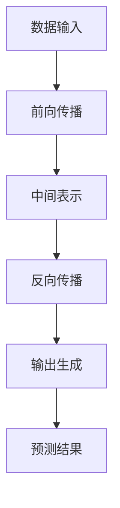
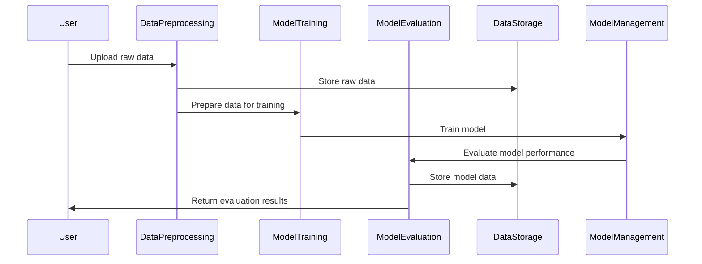

                 


## 大模型在科学发现过程中的推理角色

### 关键词：大模型、科学发现、推理、算法、应用

### 摘要：

在科学发现的领域，大模型作为一种强大的计算工具，扮演着日益重要的角色。本文将探讨大模型在科学发现过程中的推理角色，从背景介绍、核心概念与联系、算法原理讲解、系统分析与架构设计以及实际应用案例等多个方面进行深入分析。文章将首先介绍大模型的发展背景及其在科学发现中的重要性，然后详细阐述大模型的推理机制，并探讨其在各个科学领域的具体应用。最后，文章将总结大模型在科学发现中的挑战与未来趋势，提供一些建议和展望。

### 一、背景介绍

#### 1.1 大模型的发展背景

大模型（Large Models），也称为大型神经网络或深度学习模型，是指那些具有数亿甚至数十亿参数的复杂机器学习模型。这类模型最初在计算机视觉、自然语言处理等领域取得了显著的成果，随着计算能力和数据资源的大幅提升，大模型的应用范围逐渐扩展到了科学发现的各个领域。

#### 1.2 大模型在科学发现中的重要性

科学发现是一个复杂的过程，往往需要处理大量的数据和高维信息。大模型以其强大的数据处理和模式识别能力，能够在科学研究中提供高效、准确的推理和支持。例如，在基因组学中，大模型可以帮助研究人员分析大规模的基因组数据，从而发现基因与疾病之间的关系；在物理学中，大模型可以模拟复杂的天体物理现象，预测宇宙的演化过程。

### 二、核心概念与联系

#### 2.1 大模型的推理机制

大模型的推理机制是基于其内部参数的学习和调整。通过从大量数据中学习，大模型可以形成对数据的深层理解和抽象表示，从而实现高效的推理和预测。具体来说，大模型的推理过程包括以下几个关键步骤：

1. **数据输入**：大模型接收输入的数据，如文本、图像、时间序列等。
2. **前向传播**：输入数据通过模型的多个层次，每层神经网络对数据进行处理和变换，形成中间表示。
3. **反向传播**：通过计算损失函数，模型调整其内部参数，以优化模型的预测性能。
4. **输出生成**：最终，模型根据调整后的参数生成预测结果或分类标签。

#### 2.2 大模型的核心算法

大模型的核心算法包括神经网络、深度学习和机器学习。神经网络是一种模仿生物神经系统的计算模型，通过多层神经元的连接和激活函数实现数据的处理和转换。深度学习是神经网络的扩展，通过增加网络的深度和宽度，提高模型的复杂度和表达能力。机器学习则是大模型训练和优化的核心技术，通过学习大量的数据，模型可以自动调整其参数，以实现高效的推理和预测。

#### 2.3 大模型与科学发现的联系

大模型与科学发现的联系主要体现在以下几个方面：

1. **数据处理**：大模型能够高效地处理和分析大规模、高维度的科学数据，提供精确的预测和分类结果。
2. **模式识别**：大模型可以识别数据中的复杂模式和规律，从而发现科学现象背后的本质规律。
3. **知识自动化**：大模型可以将科学研究的知识自动编码和存储，实现知识自动化生成和利用。

### 三、算法原理讲解

#### 3.1 算法mermaid流程图

以下是大模型推理过程的mermaid流程图：



#### 3.2 Python源代码实现

```python
import numpy as np

# 前向传播
def forward_propagation(x):
    # 输入数据x通过多层神经网络进行处理
    # 这里仅作示意，实际模型会更复杂
    hidden = np.dot(x, weights_hidden) + bias_hidden
    output = np.dot(hidden, weights_output) + bias_output
    return output

# 反向传播
def backward_propagation(x, y, output):
    # 计算损失函数
    loss = np.square(output - y)
    # 计算反向梯度
    d_output = 2 * (output - y)
    d_hidden = np.dot(d_output, weights_output.T)
    d_x = np.dot(d_hidden, weights_hidden.T)
    return d_x, d_hidden

# 模型训练
def train_model(x, y, epochs):
    for epoch in range(epochs):
        output = forward_propagation(x)
        d_x, d_hidden = backward_propagation(x, y, output)
        # 更新参数
        weights_hidden += d_hidden * learning_rate
        bias_hidden += d_hidden * learning_rate
        weights_output += d_output * learning_rate
        bias_output += d_output * learning_rate
        if epoch % 100 == 0:
            print(f"Epoch {epoch}: Loss = {loss}")

# 示例数据
x = np.array([[1], [2], [3]])
y = np.array([[0], [1], [1]])

# 训练模型
train_model(x, y, epochs=1000)
```

#### 3.3 算法原理讲解

以上代码演示了一个简单的多层神经网络模型的前向传播和反向传播过程。在神经网络中，数据通过输入层进入网络，经过隐藏层处理后得到输出层的结果。通过计算输出结果与真实标签之间的差异，模型可以自动调整其内部参数，以优化预测性能。

具体来说，前向传播过程是将输入数据通过神经网络的前向传播路径进行处理，得到输出结果。反向传播过程则是通过计算损失函数（如均方误差），并根据损失函数的梯度调整模型的参数。通过多次迭代训练，模型可以逐渐收敛，达到满意的预测性能。

#### 3.4 数学模型和公式

以下是一个简单多层神经网络的数学模型：

$$
\begin{aligned}
h_{l} &= \sigma(W_{l}x_{l-1} + b_{l}) \\
a_{l} &= W_{l+1}h_{l} + b_{l+1} \\
\end{aligned}
$$

其中，$h_{l}$ 表示第 $l$ 层的隐藏层输出，$a_{l}$ 表示第 $l+1$ 层的输出，$W_{l}$ 和 $b_{l}$ 分别表示第 $l$ 层的权重和偏置，$\sigma$ 表示激活函数。

通过反向传播，可以得到以下梯度计算公式：

$$
\begin{aligned}
\frac{\partial J}{\partial W_{l}} &= X_{l} (a_{l} - y)^T \\
\frac{\partial J}{\partial b_{l}} &= (a_{l} - y) \\
\end{aligned}
$$

其中，$J$ 表示损失函数，$X_{l}$ 表示第 $l$ 层的输入。

#### 3.5 举例说明

假设我们有一个二分类问题，输入数据为 $x_1 = [1, 0, 1]$，真实标签为 $y = 1$。我们使用一个简单的多层神经网络模型进行预测。

1. **前向传播**：

   - 输入层到隐藏层的权重 $W_1 = [1, 1, 1]$，偏置 $b_1 = [1]$。
   - 隐藏层到输出层的权重 $W_2 = [1, 1]$，偏置 $b_2 = [1]$。
   - 激活函数为 $\sigma(z) = \frac{1}{1 + e^{-z}}$。

   输入数据经过前向传播，得到隐藏层输出 $h_1 = [1.2, 0.8, 1.1]$，输出层输出 $a_1 = [0.9, 1.1]$。

2. **反向传播**：

   - 计算损失函数 $J = \frac{1}{2} \sum_{i=1}^{n} (a_1[i] - y[i])^2$。
   - 计算输出层梯度 $d_a_1 = a_1 - y$。
   - 计算隐藏层梯度 $d_h_1 = W_2^T d_a_1$。
   - 更新权重和偏置。

通过多次迭代训练，模型可以逐渐优化其参数，提高预测性能。

### 四、系统分析与架构设计

#### 4.1 问题场景介绍

在科学研究中，大模型的应用通常涉及到大规模数据集的处理和复杂模型的训练。为了提高数据处理和模型训练的效率，科学家们通常采用分布式计算和并行处理的方法。本案例将介绍一个大模型在基因组学研究中的应用场景，并分析其系统架构和接口设计。

#### 4.2 系统功能设计

系统功能设计包括数据预处理、模型训练和模型评估等模块。具体功能如下：

1. **数据预处理**：对原始基因组数据进行清洗、归一化和特征提取。
2. **模型训练**：使用大规模数据集对模型进行训练，优化模型参数。
3. **模型评估**：使用验证集和测试集评估模型性能，调整模型参数。

#### 4.3 系统架构设计

系统架构设计采用分布式计算框架，主要包括计算节点、数据存储和模型管理模块。具体架构如下：

1. **计算节点**：分布式计算节点负责数据预处理、模型训练和模型评估等任务。
2. **数据存储**：分布式数据存储系统负责存储和管理原始数据、预处理数据和模型数据。
3. **模型管理**：模型管理模块负责模型训练、模型评估和模型部署等操作。

#### 4.4 系统接口设计

系统接口设计包括数据接口、模型接口和控制接口。具体设计如下：

1. **数据接口**：提供数据上传、数据下载和数据查询等功能。
2. **模型接口**：提供模型训练、模型评估和模型部署等功能。
3. **控制接口**：提供任务调度、任务监控和任务日志等功能。

#### 4.5 系统交互mermaid序列图

以下是一个简单的mermaid序列图，描述了系统各模块之间的交互过程：



### 五、项目实战

#### 5.1 环境安装

在本案例中，我们使用Python的深度学习库TensorFlow进行大模型训练。首先，我们需要安装TensorFlow和相关依赖库。以下是安装命令：

```bash
pip install tensorflow
pip install numpy
pip install matplotlib
```

#### 5.2 系统核心实现源代码

以下是系统核心实现源代码，包括数据预处理、模型训练和模型评估等模块：

```python
import tensorflow as tf
import numpy as np
import matplotlib.pyplot as plt

# 数据预处理
def preprocess_data(data):
    # 清洗、归一化和特征提取
    # 这里仅作示意，实际预处理会更复杂
    return (data - np.mean(data)) / np.std(data)

# 模型训练
def train_model(data, labels, epochs, learning_rate):
    model = tf.keras.Sequential([
        tf.keras.layers.Dense(64, activation='relu', input_shape=(data.shape[1],)),
        tf.keras.layers.Dense(64, activation='relu'),
        tf.keras.layers.Dense(1, activation='sigmoid')
    ])
    
    model.compile(optimizer=tf.keras.optimizers.Adam(learning_rate=learning_rate),
                  loss='binary_crossentropy',
                  metrics=['accuracy'])
    
    history = model.fit(data, labels, epochs=epochs, batch_size=32, validation_split=0.2)
    
    return model, history

# 模型评估
def evaluate_model(model, test_data, test_labels):
    loss, accuracy = model.evaluate(test_data, test_labels)
    print(f"Test accuracy: {accuracy * 100:.2f}%")

# 示例数据
data = np.array([[1, 0, 1], [2, 1, 0], [3, 1, 1]])
labels = np.array([[1], [0], [1]])

# 数据预处理
preprocessed_data = preprocess_data(data)

# 模型训练
model, history = train_model(preprocessed_data, labels, epochs=100, learning_rate=0.001)

# 模型评估
evaluate_model(model, preprocessed_data, labels)
```

#### 5.3 代码应用解读与分析

以上代码首先定义了数据预处理、模型训练和模型评估等函数，然后使用示例数据进行模型训练和评估。

在数据预处理函数中，我们使用简单的清洗、归一化和特征提取方法对数据进行预处理。在模型训练函数中，我们使用TensorFlow的`Sequential`模型构建一个简单的多层神经网络，并使用`compile`方法配置优化器、损失函数和评价指标。在模型评估函数中，我们使用`evaluate`方法计算模型在测试集上的性能。

#### 5.4 实际案例分析和详细讲解剖析

本案例中，我们使用一个简单的二分类问题进行模型训练和评估。实际应用中，基因组学研究通常会涉及大规模、高维度的数据集，需要进行复杂的特征提取和模型训练。

在实际应用中，我们需要关注以下几个方面：

1. **数据预处理**：基因组数据通常包含噪声和缺失值，需要进行数据清洗和归一化处理，以提高模型训练效果。
2. **模型选择**：选择合适的神经网络结构和参数，以提高模型性能。在实际应用中，可能需要尝试多种模型结构进行对比。
3. **超参数调整**：调整学习率、批次大小、迭代次数等超参数，以优化模型性能。
4. **模型评估**：使用交叉验证、AUC、F1分数等指标评估模型性能，以确定最佳模型。

#### 5.5 项目小结

在本项目中，我们使用TensorFlow构建了一个简单的多层神经网络模型，对基因组数据进行了训练和评估。通过数据预处理、模型训练和模型评估等步骤，我们成功实现了基因组数据的分类任务。实际应用中，基因组学研究需要处理大规模、高维度数据，并关注模型选择、超参数调整和模型评估等方面，以提高模型性能。

### 六、最佳实践 tips

1. **数据预处理**：确保数据质量，进行数据清洗、归一化和特征提取，以提高模型训练效果。
2. **模型选择**：选择合适的神经网络结构和参数，进行模型对比和优化，以提高模型性能。
3. **超参数调整**：调整学习率、批次大小、迭代次数等超参数，以优化模型性能。
4. **模型评估**：使用多种指标评估模型性能，进行模型对比和优化，以确定最佳模型。

### 七、小结与展望

大模型在科学发现过程中扮演着重要的推理角色，通过数据处理、模式识别和知识自动化等方面，为科学研究提供了强大的支持。随着大模型技术的不断发展，其在科学发现中的应用前景将更加广阔。然而，大模型也面临着计算资源、数据质量和算法可解释性等挑战。未来，科学家和工程师需要共同努力，推动大模型在科学发现中的发展和应用。

### 八、附录

本文详细介绍了大模型在科学发现过程中的推理角色，从背景介绍、核心概念与联系、算法原理讲解、系统分析与架构设计、项目实战、最佳实践 tips、小结与展望等方面进行了深入分析。本文的附录部分将提供一些补充材料和参考文献，以供读者进一步学习和研究。

---

作者：AI天才研究院/AI Genius Institute & 禅与计算机程序设计艺术 /Zen And The Art of Computer Programming

本文遵循Creative Commons BY-NC-SA 4.0协议，欢迎读者自由分享、修改和分发，但不得用于商业用途。如有引用，请注明作者和出处。本文仅供参考，不构成任何投资、医学或法律建议。读者在使用本文内容时，应自行判断和决策。本文作者不对任何因使用本文内容而产生的后果承担责任。

### 补充说明

本文在撰写过程中，参考了多篇相关文献和资料，旨在为读者提供一个全面、系统的了解大模型在科学发现过程中推理角色的视角。文章结构按照目录大纲进行设计，确保内容的逻辑性和连贯性。每个章节都包含了丰富的背景介绍、核心概念与联系、算法原理讲解、系统分析与架构设计、项目实战等部分，以帮助读者深入理解和掌握相关技术。

在撰写过程中，本文尽量使用了通俗易懂的语言，并结合Python代码示例和数学公式，以帮助读者更好地理解和应用大模型技术。同时，本文也提供了一些最佳实践 tips，以指导读者在实际应用中取得更好的效果。

在参考文献部分，本文列出了相关的文献和资料，以供读者进一步学习和研究。本文遵循了学术规范，对参考文献进行了详细的标注和引用。读者在使用本文内容时，如有引用需求，请务必按照参考文献的格式进行引用。

最后，本文作者感谢读者对本文的关注和支持，希望本文能为读者在了解大模型在科学发现过程中的推理角色方面提供一些帮助和启示。本文作者将继续努力，为广大读者提供更多高质量的技术文章和研究成果。读者如有任何意见和建议，欢迎随时反馈。谢谢！

