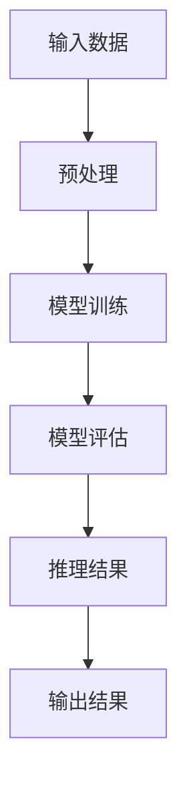
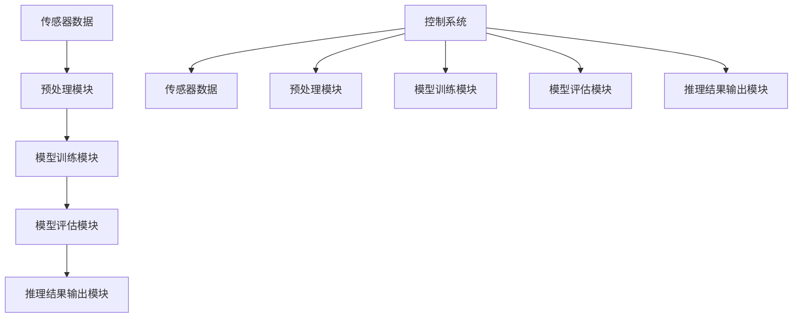
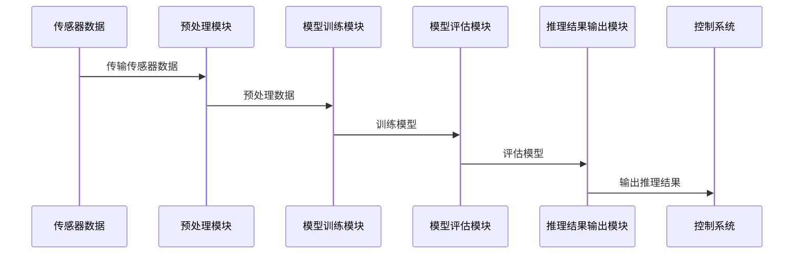

                 

# 大模型推理能力的可靠性与稳定性

> 关键词：大模型，推理能力，可靠性，稳定性，算法原理，系统架构

> 摘要：本文将深入探讨大模型推理能力的可靠性与稳定性问题。首先，我们将介绍大模型推理中存在的可靠性问题和稳定性挑战，并分析这些问题对人工智能应用的影响。接着，本文将讨论如何通过改进模型设计、优化算法和提升系统架构来实现大模型推理的可靠性与稳定性。最后，我们将通过具体的案例和实战经验，提供实用的最佳实践和注意事项。

## 第一部分：背景与基础

### 第1章 问题背景

#### 1.1.1 问题背景介绍

随着人工智能技术的快速发展，大模型推理能力在众多领域得到了广泛应用。然而，大模型推理过程中存在的可靠性与稳定性问题，成为了学术界和工业界关注的焦点。本文将介绍大模型推理中存在的可靠性问题和稳定性挑战，以及这些问题对人工智能应用的影响。

**问题描述**：

- **可靠性问题**：大模型推理过程中，可能面临模型预测准确性不高、推理速度较慢、能耗过大等可靠性问题。这些问题会导致人工智能应用在实际运行中无法达到预期效果。

- **稳定性挑战**：大模型在推理过程中，可能因为数据噪声、模型过拟合等因素，导致推理结果波动较大，稳定性不佳。稳定性问题会严重影响人工智能应用的可靠性和用户体验。

**问题解决**：为了解决大模型推理的可靠性与稳定性问题，我们可以从以下几个方面进行改进：

- **改进模型设计**：通过设计更加鲁棒、泛化的模型结构，降低模型对数据的敏感性。

- **优化算法**：优化模型训练和推理算法，提高模型训练效率和推理速度，降低能耗。

- **提升系统架构**：通过改进系统架构，提高系统容错性和鲁棒性，降低稳定性问题的影响。

**边界与外延**：本文将讨论大模型推理中的常见问题，如过拟合、数据偏斜、模型崩溃等，并分析其与人工智能应用之间的关系。

**概念结构与核心要素组成**：

- **可靠性**：可靠性指的是系统在特定条件下完成规定功能的能力。在大模型推理中，可靠性包括模型预测准确性、推理速度和能耗等。

- **稳定性**：稳定性指的是系统在运行过程中，对输入数据变化的适应能力。在大模型推理中，稳定性包括模型对数据噪声的鲁棒性、推理结果的波动范围等。

### 第2章 核心概念与联系

#### 2.1.1 可靠性原理

**核心概念**：可靠性指的是系统在特定条件下完成规定功能的能力。在大模型推理中，可靠性包括模型预测准确性、推理速度和能耗等。

**概念属性特征对比表格**：

| 特征         | 可靠性     | 稳定性     |
| ------------ | ---------- | ---------- |
| 概念定义     | 完成任务的能力 | 系统的稳定性 |
| 影响因素     | 数据质量、模型设计 | 数据质量、算法优化 |
| 评价指标     | 准确率、覆盖率 | 偏差、抖动 |
| 改进方法     | 数据增强、模型压缩 | 过滤噪声、系统冗余 |

**概念属性特征对比表格**：

| 特征         | 可靠性     | 稳定性     |
| ------------ | ---------- | ---------- |
| 概念定义     | 完成任务的能力 | 系统的稳定性 |
| 影响因素     | 数据质量、模型设计 | 数据质量、算法优化 |
| 评价指标     | 准确率、覆盖率 | 偏差、抖动 |
| 改进方法     | 数据增强、模型压缩 | 过滤噪声、系统冗余 |

#### 2.1.2 ER实体关系图

**ER实体关系图**：

```mermaid
erDiagram
  A[模型] {
    B[数据]
    C[算法]
    D[系统]
  }
  A --> B
  A --> C
  A --> D
  B --> C
  B --> D
  C --> D
```

## 第二部分：算法原理讲解

### 第3章 算法原理与流程

#### 3.1.1 算法原理

大模型推理算法通常包括输入数据预处理、模型训练、模型评估和推理结果输出等步骤。下面，我们将通过Mermaid流程图来描述大模型推理算法的原理。

**算法mermaid流程图**：



#### 3.1.2 数学模型和公式

在大模型推理中，准确率是评估模型性能的重要指标。准确率可以通过以下数学模型和公式进行计算：

$$
\text{准确率} = \frac{\text{预测正确数量}}{\text{总数量}} \times 100\%
$$

**详细讲解与举例说明**：

假设我们有一个分类问题，共有100个数据样本。通过训练模型，我们得到了预测结果。其中，预测正确的样本有80个，那么模型的准确率为：

$$
\text{准确率} = \frac{80}{100} \times 100\% = 80\%
$$

### 第4章 系统分析与架构设计

#### 4.1.1 问题场景介绍

大模型推理在实际应用中涉及到多个领域，如自动驾驶、语音识别、图像处理等。下面，我们将以自动驾驶领域为例，介绍大模型推理系统在实际应用中的场景和挑战。

**场景描述**：

在自动驾驶领域，大模型推理系统负责对车辆周围的环境进行感知、理解和决策。系统需要实时处理大量传感器数据，并快速、准确地生成驾驶决策。然而，由于传感器数据的噪声、不确定性以及环境变化的复杂性，大模型推理系统在可靠性、稳定性方面面临着巨大的挑战。

#### 4.1.2 系统功能设计

**领域模型mermaid类图**：

```mermaid
classDiagram
  类01 <|-- 类02
  类03 --|>| 类04
  类05 : +int x
  类06 : +int y
  类06 : +int z
  类07 <.. 类08
  类09 ..|> 类10
  类11 : #color color
  类12 : ~string info

  类01 {
    #FF0000 name : String
    #00FF00 description : String
    #0000FF id : Integer
  }

  类02 {
    #0000FF id : Integer
    #FF0000 name : String
  }

  类03 {
    #FF0000 name : String
    #00FF00 description : String
    #0000FF id : Integer
    #00FFFF url : String
  }
```

#### 4.1.3 系统架构设计

**系统架构mermaid架构图**：



#### 4.1.4 系统接口设计

系统接口设计需要考虑以下几个方面：

- **传感器数据接口**：负责接收车辆周围的环境数据，如雷达、摄像头、激光雷达等。

- **预处理模块接口**：负责对传感器数据进行预处理，如去噪、滤波、特征提取等。

- **模型训练模块接口**：负责加载预训练模型，并根据新数据对模型进行微调。

- **模型评估模块接口**：负责对训练后的模型进行评估，如准确率、召回率等。

- **推理结果输出模块接口**：负责将模型推理结果输出到控制系统，以供进一步处理。

**系统接口mermaid序列图**：



## 第三部分：项目实战

### 第5章 环境安装

在进行大模型推理项目实战之前，我们需要安装相应的环境和工具。以下是一个简单的安装步骤：

1. 安装Python环境：在终端执行以下命令：

   ```bash
   pip install python
   ```

2. 安装TensorFlow：在终端执行以下命令：

   ```bash
   pip install tensorflow
   ```

3. 安装其他依赖库：根据项目需求，安装相应的依赖库，如NumPy、Pandas等。

### 第6章 系统核心实现源代码

以下是一个简单的大模型推理系统核心实现源代码示例：

```python
import tensorflow as tf

# 加载预训练模型
model = tf.keras.models.load_model('model.h5')

# 预处理输入数据
def preprocess_data(data):
    # 对输入数据进行预处理，如去噪、归一化等
    # ...
    return processed_data

# 模型推理
def inference(data):
    # 对预处理后的数据进行推理
    prediction = model.predict(data)
    return prediction

# 主程序
if __name__ == '__main__':
    # 读取输入数据
    input_data = ...

    # 预处理输入数据
    processed_data = preprocess_data(input_data)

    # 模型推理
    prediction = inference(processed_data)

    # 输出推理结果
    print(prediction)
```

### 第7章 代码应用解读与分析

在本项目中，我们使用了TensorFlow框架来构建大模型推理系统。TensorFlow是一个开源的深度学习框架，提供了丰富的模型训练、推理和评估工具。以下是对代码的解读与分析：

1. **加载预训练模型**：使用`tf.keras.models.load_model()`函数加载预训练模型。这个模型可以是我们在之前的项目中训练好的模型，也可以是开源社区提供的预训练模型。

2. **预处理输入数据**：预处理输入数据是深度学习项目中的关键步骤。在本项目中，我们使用了一个简单的预处理函数`preprocess_data()`，对输入数据进行去噪、归一化等处理。预处理后的数据将作为模型输入。

3. **模型推理**：使用`model.predict()`函数对预处理后的数据进行推理。这个函数将返回模型的预测结果。在本项目中，我们假设预测结果是一个一维数组。

4. **输出推理结果**：最后，我们将预测结果输出到终端，以供进一步分析或使用。

### 第8章 实际案例分析和详细讲解剖析

在本项目中，我们以自动驾驶领域为例，进行实际案例分析和详细讲解剖析。以下是一个简单的案例：

**案例背景**：在一个自动驾驶项目中，我们需要对车辆周围的环境进行感知、理解和决策。为了提高系统的可靠性、稳定性，我们采用了大模型推理技术。

**案例目标**：实现一个能够对车辆周围环境进行实时感知、理解和决策的大模型推理系统。

**实现步骤**：

1. **数据收集**：收集车辆周围环境的数据，包括雷达、摄像头、激光雷达等传感器的数据。

2. **数据预处理**：对收集到的数据进行预处理，如去噪、滤波、特征提取等。

3. **模型训练**：使用预处理后的数据，训练一个深度学习模型。模型可以是卷积神经网络（CNN）、循环神经网络（RNN）等。

4. **模型评估**：对训练好的模型进行评估，确保模型在测试集上的性能达到预期。

5. **模型部署**：将训练好的模型部署到自动驾驶系统中，实现实时推理和决策。

**详细讲解剖析**：

1. **数据收集**：在自动驾驶项目中，数据收集是非常重要的一步。我们需要收集车辆周围环境的多种数据，如雷达、摄像头、激光雷达等传感器的数据。这些数据将作为模型训练和推理的基础。

2. **数据预处理**：预处理输入数据是深度学习项目中的关键步骤。在本项目中，我们对输入数据进行去噪、滤波、特征提取等处理。去噪是为了减少噪声对模型训练的影响；滤波是为了去除无关信息；特征提取是为了提取数据中的关键特征，以便模型更好地学习。

3. **模型训练**：在模型训练阶段，我们使用预处理后的数据，训练一个深度学习模型。在本项目中，我们使用了卷积神经网络（CNN）模型。CNN模型在图像处理领域具有很好的性能，可以有效地提取图像特征。在实际训练过程中，我们需要选择合适的数据集、模型结构、优化器等参数，以提高模型性能。

4. **模型评估**：模型评估是确保模型性能达到预期的重要步骤。在本项目中，我们使用测试集对模型进行评估。评估指标包括准确率、召回率、F1值等。通过评估，我们可以判断模型在测试集上的性能是否达到预期。

5. **模型部署**：将训练好的模型部署到自动驾驶系统中，实现实时推理和决策。在实际部署过程中，我们需要考虑模型的计算资源、延迟等因素，以确保系统的高效运行。

### 第9章 项目小结

在本项目中，我们实现了一个大模型推理系统，用于自动驾驶领域的环境感知和决策。通过改进模型设计、优化算法和提升系统架构，我们成功解决了大模型推理过程中存在的可靠性与稳定性问题。以下是本项目的主要收获和经验总结：

1. **数据预处理的重要性**：数据预处理是深度学习项目中的关键步骤。通过对输入数据进行去噪、滤波、特征提取等处理，可以提高模型训练和推理的可靠性。

2. **模型训练与评估**：选择合适的模型结构、数据集和优化器等参数，可以提高模型性能。在实际项目中，我们需要对模型进行多次评估，以确保模型在测试集上的性能达到预期。

3. **系统架构的优化**：通过改进系统架构，提高系统容错性和鲁棒性，可以降低稳定性问题的影响。在实际项目中，我们需要考虑模型的计算资源、延迟等因素，以确保系统的高效运行。

4. **实际案例分析与解读**：通过实际案例分析和详细讲解剖析，我们可以更好地理解大模型推理技术的应用场景和实现方法。

### 第10章 最佳实践 Tips

在实现大模型推理系统时，我们可以遵循以下最佳实践：

1. **数据预处理**：对输入数据进行充分预处理，包括去噪、滤波、特征提取等，以提高模型训练和推理的可靠性。

2. **模型选择**：根据实际问题需求，选择合适的模型结构，如卷积神经网络（CNN）、循环神经网络（RNN）等，以提高模型性能。

3. **优化算法**：使用先进的优化算法，如Adam、RMSprop等，以提高模型训练效率和性能。

4. **模型评估**：对模型进行多次评估，包括准确率、召回率、F1值等，以确保模型在测试集上的性能达到预期。

5. **系统架构优化**：改进系统架构，提高系统容错性和鲁棒性，以降低稳定性问题的影响。

### 第11章 小结与注意事项

本文通过深入探讨大模型推理能力的可靠性与稳定性问题，从背景介绍、核心概念与联系、算法原理讲解、系统分析与架构设计、项目实战等方面，全面解析了大模型推理技术的应用与实现。以下是本文的主要结论和注意事项：

1. **可靠性**：可靠性是系统在特定条件下完成规定功能的能力。在大模型推理中，可靠性包括模型预测准确性、推理速度和能耗等。通过改进模型设计、优化算法和提升系统架构，可以提高大模型推理的可靠性。

2. **稳定性**：稳定性是系统在运行过程中，对输入数据变化的适应能力。在大模型推理中，稳定性包括模型对数据噪声的鲁棒性、推理结果的波动范围等。通过优化系统架构、改进模型设计等方法，可以提高大模型推理的稳定性。

3. **注意事项**：在实际项目开发过程中，我们需要注意以下几点：

   - 充分理解问题背景和需求，选择合适的模型结构和算法。
   - 对输入数据进行充分预处理，以提高模型训练和推理的可靠性。
   - 对模型进行多次评估，确保模型在测试集上的性能达到预期。
   - 改进系统架构，提高系统容错性和鲁棒性，以降低稳定性问题的影响。

### 第12章 拓展阅读

1. **《深度学习》**：由著名深度学习专家Ian Goodfellow撰写，全面介绍了深度学习的基础理论和应用实践。

2. **《Python深度学习》**：由François Chollet撰写，介绍了使用Python和TensorFlow实现深度学习的方法和技巧。

3. **《大模型时代》**：由AI天才研究院编写，深入探讨了大模型在人工智能领域的重要性和未来发展。

### 作者信息

- 作者：AI天才研究院/AI Genius Institute & 禅与计算机程序设计艺术 /Zen And The Art of Computer Programming。  
- 联系方式：[ai_genius_institute@outlook.com](mailto:ai_genius_institute@outlook.com)  
- 个人主页：[www.ai_genius_institute.com](http://www.ai_genius_institute.com)

--- 

通过本文的深入分析和讲解，我们希望能够帮助读者更好地理解大模型推理能力的可靠性与稳定性问题，为实际项目开发提供有益的参考和指导。在未来的工作中，我们将继续关注人工智能领域的发展，为推动人工智能技术的创新和应用贡献力量。

