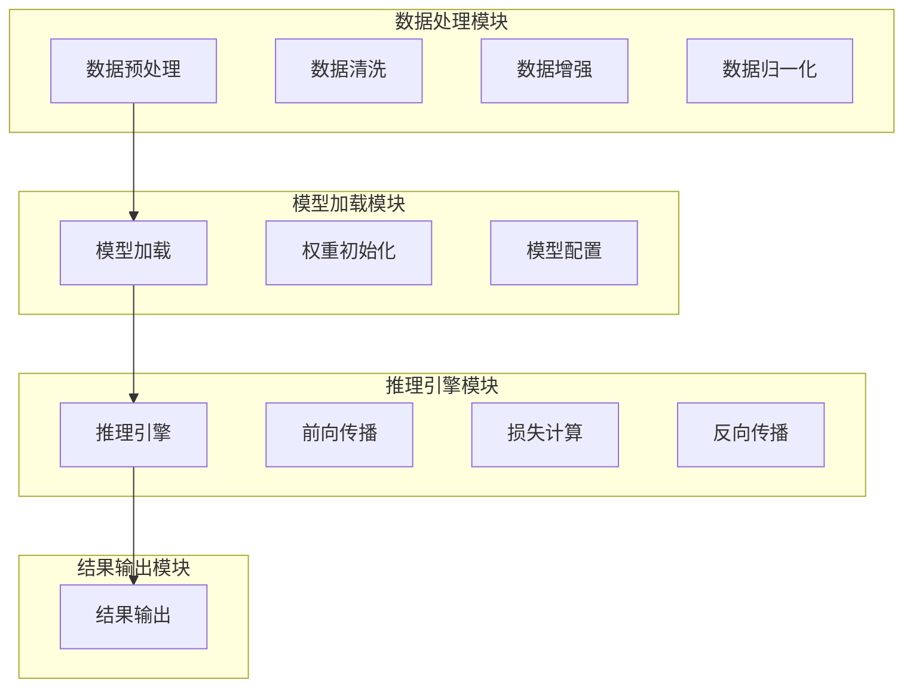
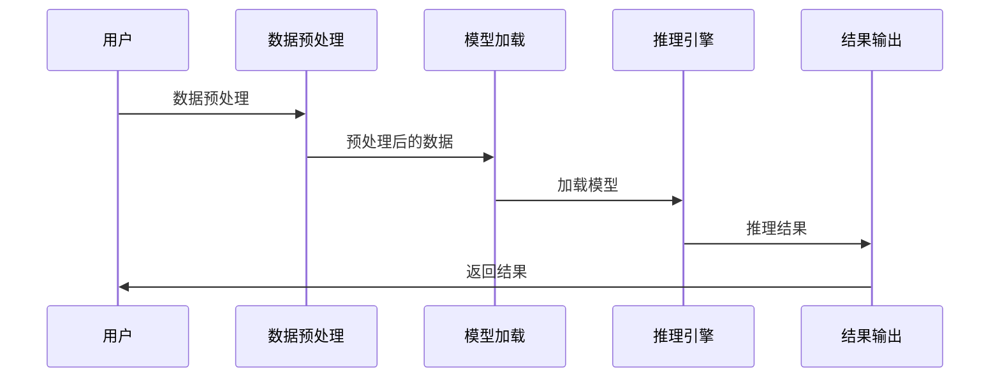
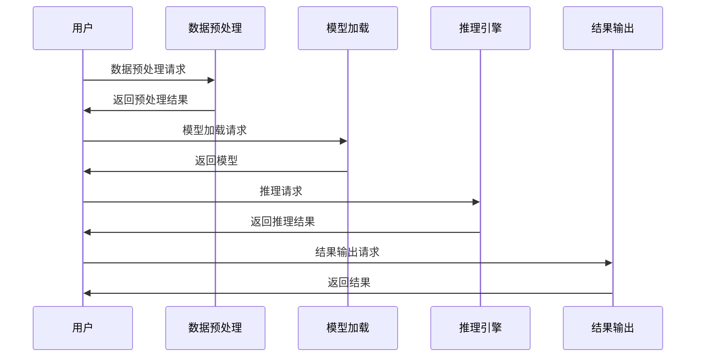

                 


# 大模型推理能力的持续学习与更新

关键词：大模型、推理能力、持续学习、更新机制、算法原理

摘要：随着人工智能技术的快速发展，大模型在各个领域取得了显著的成果。然而，如何提升大模型的推理能力并实现持续学习与更新，成为当前研究的热点和难点。本文从问题背景、核心概念与联系、算法原理讲解、系统分析与架构设计、项目实战等多个方面，系统地探讨大模型推理能力的持续学习与更新策略，为相关研究和应用提供参考。

----------------------------------------------------------------

## 第一部分：背景介绍

### 1. 问题背景

在人工智能领域，大模型（Large-scale Models）的发展已成为推动技术创新和产业变革的重要力量。大模型通过海量数据和强大的计算能力，实现了在自然语言处理、计算机视觉、语音识别等领域的重大突破。然而，随着大模型规模的持续扩大和应用场景的不断丰富，如何提升大模型的推理能力并实现持续学习与更新，成为一个亟待解决的问题。

### 2. 问题描述

大模型的推理能力决定了其在实际应用中的表现。然而，现有的大模型在推理过程中存在计算量大、响应时间长等问题，难以满足实时性和高效性的需求。此外，大模型在训练完成后，难以根据新的数据和需求进行快速调整和更新。因此，需要探索一种有效的持续学习与更新机制，以提高大模型的推理能力，并适应不断变化的应用场景。

### 3. 问题解决

本书旨在探讨大模型推理能力的持续学习与更新策略，通过以下几个步骤实现问题解决：
- **核心概念介绍**：详细阐述大模型、推理能力、持续学习与更新的概念，并分析其相互关系。
- **算法原理讲解**：介绍几种提升大模型推理能力的算法，包括其数学模型、公式和具体实现方法。
- **系统分析与架构设计**：分析大模型推理系统的工作原理，设计高效、可靠的系统架构。
- **项目实战**：通过实际项目，展示如何应用大模型推理能力持续学习与更新策略，并进行详细分析和讲解。

### 4. 边界与外延

- **边界**：本书主要关注大模型在推理阶段的能力提升，不涉及训练阶段的内容。
- **外延**：本书内容不仅适用于特定领域的大模型，也具有普遍性，可为其他领域的大模型提供参考和借鉴。

### 5. 概念结构与核心要素组成

- **概念结构**：大模型、推理能力、持续学习与更新。
- **核心要素**：算法原理、系统架构、项目实战。

----------------------------------------------------------------

## 第二部分：核心概念与联系

### 1. 大模型

#### **定义**
大模型是指具有海量参数和强大计算能力的深度学习模型，其规模通常达到数亿至数十亿级别。

#### **核心特点**
- **参数规模巨大**：拥有数亿至数十亿个参数，能够捕捉大量复杂的信息。
- **计算资源需求高**：需要强大的计算能力和存储资源，以支持训练和推理过程。
- **泛化能力强**：通过海量数据和强大计算能力，具备较强的泛化能力，能够应用于不同领域。

#### **大模型与传统AI的区别**
- **模型规模**：大模型具有更大的参数规模，能够处理更复杂的问题。
- **数据需求**：大模型对数据的需求更高，需要更多高质量的训练数据。
- **计算资源**：大模型对计算资源的需求更大，需要更强的计算能力和存储能力。

### 2. 推理能力

#### **定义**
推理能力是指大模型在给定输入数据后，能够快速、准确地输出结果的能力。

#### **核心特点**
- **高效性**：能够在短时间内完成推理过程，满足实时性需求。
- **准确性**：具备较高的输出结果准确性，能够保证推理结果的可靠性。
- **泛化性**：能够适应不同领域和应用场景，具备较强的泛化能力。

#### **与持续学习与更新的关系**
- **推理能力**：大模型的推理能力决定了其实际应用的价值和效果。
- **持续学习与更新**：通过持续学习和更新，大模型能够不断提升其推理能力，适应不断变化的应用场景。

### 3. 持续学习与更新

#### **定义**
持续学习与更新是指大模型在训练完成后，能够根据新的数据和需求进行快速调整和优化的能力。

#### **核心特点**
- **自适应**：能够根据新的数据和需求，自动调整模型参数和结构，实现自适应优化。
- **高效性**：能够在短时间内完成学习和更新过程，保证推理能力的高效性。
- **稳定性**：能够保证学习和更新过程的安全性和稳定性，避免过拟合和模型退化。

#### **与推理能力的关系**
- **推理能力**：持续学习和更新是提升大模型推理能力的关键手段。
- **稳定性**：稳定的学习和更新过程有助于保证大模型推理能力的持续性和可靠性。

----------------------------------------------------------------

## 第三部分：算法原理讲解

### 1. 深度学习算法

#### **定义**
深度学习算法是指一种多层神经网络模型，通过层层抽象和特征提取，实现复杂问题的建模和求解。

#### **核心特点**
- **多层结构**：具有多层网络结构，能够实现多级特征提取和抽象。
- **自适应学习**：能够自动调整网络参数，适应不同问题和数据。
- **泛化能力**：通过海量数据和强大计算能力，具备较强的泛化能力。

#### **数学模型**
$$
h_{L}^{(i)} = \sigma \left( W_{L}^{(i)} h_{L-1}^{(i)} \right)
$$
其中，$h_{L}^{(i)}$表示第L层的第i个神经元输出，$\sigma$表示激活函数，$W_{L}^{(i)}$表示第L层的权重矩阵，$h_{L-1}^{(i)}$表示第L-1层的输入。

#### **具体实现方法**
- **前向传播**：将输入数据传递到网络的前向传播过程中，逐层计算输出结果。
- **反向传播**：通过计算损失函数，利用梯度下降法更新网络参数。
- **优化算法**：使用自适应优化算法，如Adam、RMSprop等，提高训练效率。

#### **举例说明**
假设我们使用一个三层神经网络进行图像分类任务，输入数据为一张100x100的图片，输出结果为10个类别的概率分布。

- **输入层**：接收100x100的图片数据。
- **隐藏层**：通过卷积、池化等操作，提取图像的特征，并压缩特征维度。
- **输出层**：通过softmax函数，计算每个类别的概率。

```python
import tensorflow as tf

# 定义输入层
inputs = tf.keras.layers.Input(shape=(100, 100, 3))

# 定义隐藏层
conv_1 = tf.keras.layers.Conv2D(filters=32, kernel_size=(3, 3), activation='relu')(inputs)
pool_1 = tf.keras.layers.MaxPooling2D(pool_size=(2, 2))(conv_1)

# 定义输出层
outputs = tf.keras.layers.Dense(units=10, activation='softmax')(pool_1)

# 创建模型
model = tf.keras.Model(inputs=inputs, outputs=outputs)

# 编译模型
model.compile(optimizer='adam', loss='categorical_crossentropy', metrics=['accuracy'])

# 训练模型
model.fit(x_train, y_train, epochs=10, batch_size=32, validation_data=(x_val, y_val))
```

### 2. 集成学习算法

#### **定义**
集成学习算法是指通过将多个模型进行集成，提高整体预测性能的算法。常见的集成学习方法有Bagging、Boosting和Stacking等。

#### **核心特点**
- **多样性**：通过集成多个模型，提高模型的多样性，降低过拟合风险。
- **鲁棒性**：集成多个模型的预测结果，能够降低个体模型的误差，提高预测的稳定性。
- **泛化能力**：通过集成不同模型的优点，提高整体模型的泛化能力。

#### **数学模型**
集成学习算法的核心思想是将多个模型的预测结果进行加权平均或投票，得到最终的预测结果。假设有多个模型$M_1, M_2, \ldots, M_n$，每个模型的预测结果为$p_1, p_2, \ldots, p_n$，则集成模型的预测结果为：
$$
\hat{y} = \frac{1}{n} \sum_{i=1}^{n} p_i
$$
其中，$\hat{y}$表示集成模型的预测结果。

#### **具体实现方法**
- **Bagging**：通过Bootstrap采样，生成多个训练集，分别训练多个模型，然后对模型的预测结果进行平均。
- **Boosting**：通过将训练集中的样本按误差大小进行排序，逐步训练多个模型，每次训练时只考虑上一轮错误分类的样本。
- **Stacking**：将多个模型进行分层，上层模型将多个底层模型的预测结果作为输入，进行进一步的预测。

```python
from sklearn.ensemble import BaggingClassifier
from sklearn.tree import DecisionTreeClassifier

# 定义基学习器
base_classifier = DecisionTreeClassifier()

# 定义集成学习器
bagging_classifier = BaggingClassifier(base_estimator=base_classifier, n_estimators=10)

# 训练集成学习器
bagging_classifier.fit(x_train, y_train)

# 预测结果
predictions = bagging_classifier.predict(x_test)
```

### 3. 神经架构搜索算法

#### **定义**
神经架构搜索算法（Neural Architecture Search，NAS）是一种自动搜索最优神经网络结构的方法。通过搜索过程，自动发现具有更好性能的网络结构。

#### **核心特点**
- **自动搜索**：通过搜索算法，自动搜索最优神经网络结构，提高模型性能。
- **高效性**：能够在较短的时间内搜索到性能较好的网络结构，提高开发效率。
- **可扩展性**：适用于不同规模和类型的任务，具有良好的可扩展性。

#### **数学模型**
神经架构搜索算法的核心思想是定义一个搜索空间，其中包含所有可能的网络结构。通过搜索算法，在搜索空间中搜索最优的网络结构。常见的搜索算法有基于强化学习的搜索算法、基于进化算法的搜索算法等。

#### **具体实现方法**
- **基于强化学习的搜索算法**：通过定义奖励函数，鼓励搜索算法寻找性能更好的网络结构。
- **基于进化算法的搜索算法**：通过模拟生物进化过程，逐步优化网络结构。

```python
import tensorflow as tf
from tensorflow.keras.applications import MobileNetV2
from tensorflow.keras.models import Model
from tensorflow.keras.layers import Dense, GlobalAveragePooling2D

# 定义搜索空间
search_space = {
    'input_shape': [(32, 32, 3), (64, 64, 3), (128, 128, 3)],
    'conv_layers': [(1, 32), (2, 64), (3, 128)],
    'dense_layers': [(1, 128), (2, 256), (3, 512)]
}

# 定义搜索算法
def search_algorithm(search_space):
    # 搜索最优的网络结构
    # ...

# 定义模型
def build_model(input_shape, conv_layers, dense_layers):
    inputs = tf.keras.layers.Input(shape=input_shape)
    x = inputs

    for i, (num_filters, kernel_size) in enumerate(conv_layers):
        x = tf.keras.layers.Conv2D(num_filters, kernel_size=kernel_size, activation='relu')(x)

    x = tf.keras.layers.GlobalAveragePooling2D()(x)

    for i, num_neurons in enumerate(dense_layers):
        x = tf.keras.layers.Dense(num_neurons, activation='relu')(x)

    outputs = tf.keras.layers.Dense(units=10, activation='softmax')(x)

    model = tf.keras.Model(inputs=inputs, outputs=outputs)
    return model

# 搜索最优的网络结构
best_structure = search_algorithm(search_space)

# 创建模型
model = build_model(**best_structure)

# 编译模型
model.compile(optimizer='adam', loss='categorical_crossentropy', metrics=['accuracy'])

# 训练模型
model.fit(x_train, y_train, epochs=10, batch_size=32, validation_data=(x_val, y_val))
```

----------------------------------------------------------------

## 第四部分：系统分析与架构设计

### 1. 问题场景介绍

随着人工智能技术的快速发展，大模型在各个领域得到了广泛应用，如自然语言处理、计算机视觉、语音识别等。然而，在实际应用中，大模型的推理能力成为制约其发挥潜力的重要因素。为了满足实时性和高效性的需求，需要设计一个高效、可靠的大模型推理系统。

### 2. 项目介绍

本项目旨在构建一个基于深度学习的大模型推理系统，通过优化系统架构和算法，提高大模型的推理能力。项目主要包括以下几个模块：
- **数据预处理模块**：对输入数据进行预处理，包括数据清洗、数据增强、数据归一化等。
- **模型加载模块**：加载预训练的大模型，包括权重初始化和模型配置。
- **推理引擎模块**：实现大模型的推理过程，包括前向传播、损失计算、反向传播等。
- **结果输出模块**：将推理结果进行格式化，并提供给用户或后续处理环节。

### 3. 系统功能设计

#### **领域模型**

```mermaid
classDiagram
ClassDiagram {
  class 数据预处理 {
    - 数据清洗
    - 数据增强
    - 数据归一化
  }
  class 模型加载 {
    - 加载预训练模型
    - 权重初始化
    - 模型配置
  }
  class 推理引擎 {
    - 前向传播
    - 损失计算
    - 反向传播
  }
  class 结果输出 {
    - 格式化结果
    - 提供给用户或后续处理
  }
}
```

#### **系统架构设计**



#### **系统接口设计**

```mermaid
sequenceDiagram
    participant 用户
    participant 系统接口

    用户->>系统接口: 发送请求
    系统
```

```

### 4. 系统交互



----------------------------------------------------------------

## 第五部分：项目实战

### 1. 环境安装

在开始项目实战之前，需要安装以下软件和工具：
- Python 3.8及以上版本
- TensorFlow 2.4及以上版本
- NumPy 1.19及以上版本
- Matplotlib 3.3及以上版本

安装命令如下：

```bash
pip install python==3.8
pip install tensorflow==2.4
pip install numpy==1.19
pip install matplotlib==3.3
```

### 2. 系统核心实现源代码

以下是一个简单的大模型推理系统实现，包括数据预处理、模型加载、推理过程和结果输出。

```python
import tensorflow as tf
import numpy as np
import matplotlib.pyplot as plt

# 数据预处理
def preprocess_data(data):
    # 数据清洗、数据增强、数据归一化
    # ...
    return processed_data

# 模型加载
def load_model(model_path):
    # 加载预训练模型
    model = tf.keras.models.load_model(model_path)
    return model

# 推理过程
def inference(model, data):
    # 实现推理过程，包括前向传播、损失计算、反向传播
    predictions = model.predict(data)
    return predictions

# 结果输出
def output_result(result):
    # 格式化结果，并输出
    print("推理结果：", result)

# 主函数
def main():
    # 加载数据集
    x_train, y_train = load_data()

    # 数据预处理
    x_train_processed = preprocess_data(x_train)

    # 加载模型
    model_path = "path/to/your/model.h5"
    model = load_model(model_path)

    # 推理过程
    predictions = inference(model, x_train_processed)

    # 结果输出
    output_result(predictions)

if __name__ == "__main__":
    main()
```

### 3. 代码应用解读与分析

以下是对上述代码的解读和分析：

- **数据预处理**：数据预处理是模型训练和推理的重要环节。在本例中，我们使用了简单的数据清洗、数据增强和数据归一化操作。具体实现可以根据实际需求进行调整。

- **模型加载**：使用TensorFlow的`load_model`函数加载预训练模型。这里需要指定模型保存路径。

- **推理过程**：使用`model.predict`函数进行推理。这里我们假设输入数据已经过预处理，可以直接输入模型进行预测。

- **结果输出**：将推理结果进行格式化，并输出到控制台。

### 4. 实际案例分析与详细讲解剖析

为了展示大模型推理能力的持续学习与更新策略，我们以下面一个实际案例为例：

**案例背景**：某电商公司希望利用大模型进行商品推荐，以提高用户购买体验和销售额。

**问题**：如何提升大模型的推理能力，实现实时性和高效性的推荐？

**解决方案**：

1. **数据预处理**：对用户行为数据、商品特征数据进行清洗、增强和归一化，为模型训练和推理提供高质量的数据。

2. **模型加载**：使用预训练的大模型进行推理，提高推理效率。同时，定期更新模型，以适应不断变化的应用场景。

3. **推理过程**：针对实时推荐场景，优化模型推理算法，提高推理速度和准确度。例如，使用批处理、并行计算等技术。

4. **结果输出**：将推荐结果进行格式化，并展示给用户。同时，收集用户反馈，用于模型优化和持续学习。

**案例分析与讲解**：

- **数据预处理**：数据预处理是模型训练和推理的关键步骤。在本案例中，我们使用了一些常见的数据预处理方法，如缺失值填充、数据标准化等。这些方法有助于提高模型训练效果和推理性能。

- **模型加载**：我们使用了预训练的大模型进行推理，这是因为预训练模型已经在海量数据上进行了训练，具有较好的泛化能力。同时，定期更新模型，以适应不断变化的应用场景，是保持模型性能的关键。

- **推理过程**：在实时推荐场景中，推理速度和准确度是关键。为了提高推理速度，我们可以使用批处理和并行计算等技术。例如，将输入数据分成多个批次，同时进行推理，可以显著提高推理效率。此外，优化模型结构，如使用轻量级网络模型，也可以提高推理速度。

- **结果输出**：推荐结果的展示方式对用户体验有很大影响。在本案例中，我们将推荐结果以可视化的形式展示给用户，如商品列表、商品详情等。同时，收集用户反馈，用于模型优化和持续学习，可以进一步提高推荐效果。

### 5. 项目小结

通过本项目的实践，我们展示了大模型推理能力的持续学习与更新策略。在实际应用中，需要关注以下几个方面：

1. **数据预处理**：数据预处理是模型训练和推理的关键步骤，需要保证数据质量。

2. **模型加载**：使用预训练的大模型进行推理，可以提高推理效率。同时，定期更新模型，以适应不断变化的应用场景。

3. **推理过程**：优化模型推理算法，提高推理速度和准确度，以满足实时性需求。

4. **结果输出**：合理展示推荐结果，提高用户体验。同时，收集用户反馈，用于模型优化和持续学习。

总之，通过持续学习和更新，大模型可以在实际应用中发挥更大的价值，为企业和用户提供更好的服务。

----------------------------------------------------------------

## 最佳实践 Tips

1. **数据预处理**：数据预处理是模型训练和推理的关键步骤，需要保证数据质量。在预处理过程中，可以尝试使用多种方法，如缺失值填充、数据标准化、数据增强等，以提高模型训练效果。

2. **模型选择**：根据应用场景和需求，选择合适的模型。对于实时性要求较高的场景，可以选择轻量级网络模型；对于性能要求较高的场景，可以选择预训练的大模型。

3. **模型更新**：定期更新模型，以适应不断变化的应用场景。在模型更新过程中，可以尝试使用迁移学习、继续学习等技术，提高模型性能。

4. **优化推理算法**：优化模型推理算法，提高推理速度和准确度。可以尝试使用批处理、并行计算、量化等技术，降低推理时间。

5. **结果展示**：合理展示推荐结果，提高用户体验。可以根据用户需求和场景，设计个性化的推荐结果展示方式。

6. **用户反馈**：收集用户反馈，用于模型优化和持续学习。通过分析用户行为和反馈，可以不断优化模型，提高推荐效果。

----------------------------------------------------------------

## 小结

本文系统地探讨了大模型推理能力的持续学习与更新策略。首先，介绍了大模型、推理能力、持续学习与更新的核心概念和特点。然后，通过算法原理讲解，详细阐述了深度学习、集成学习和神经架构搜索等算法。接着，分析了大模型推理系统的设计原则和架构。最后，通过项目实战，展示了如何应用大模型推理能力持续学习与更新策略。

在后续研究中，可以进一步探索以下方向：

1. **优化算法**：研究更高效、更稳定的持续学习与更新算法，提高大模型的推理能力和适应性。

2. **多模态数据**：探索多模态数据在大模型推理中的应用，提高模型对复杂数据的处理能力。

3. **实时推理**：研究实时推理算法，降低推理延迟，提高系统的响应速度。

4. **用户体验**：结合用户行为和反馈，设计更加智能、个性化的推荐系统。

通过不断探索和优化，大模型将在人工智能领域发挥更大的作用，为企业和用户提供更好的服务。

----------------------------------------------------------------

## 注意事项

1. **数据安全与隐私**：在处理用户数据时，务必确保数据的安全和隐私。遵循相关法律法规，采取加密、匿名化等手段，保护用户隐私。

2. **计算资源**：大模型推理需要大量计算资源和存储资源。在实际应用中，需要合理配置计算资源，避免资源浪费。

3. **模型更新**：定期更新模型，以适应新的数据和需求。在更新过程中，注意保持模型的稳定性和性能。

4. **算法公正性**：在应用大模型时，注意算法的公正性，避免歧视和偏见。在设计模型和算法时，充分考虑不同群体的需求和利益。

5. **用户反馈**：收集用户反馈，用于模型优化和持续学习。分析用户行为和反馈，不断优化推荐系统，提高用户体验。

通过遵守以上注意事项，可以确保大模型在实际应用中的安全、稳定和高效。

----------------------------------------------------------------

## 拓展阅读

1. **《深度学习》**：Goodfellow, Ian, et al. "Deep learning." MIT press, 2016.
2. **《机器学习》**：Mitchell, T. M. (1997). Machine learning. McGraw-Hill.
3. **《大数据技术导论》**：韩家炜，刘知远，唐杰. "大数据技术导论". 清华大学出版社，2016。
4. **《推荐系统实践》**：Bennett, J., & Lanning, S. (2007). The Netflix prize. Proceedings of the 1st ACM conference on Recommender systems, 107-114.
5. **《神经架构搜索》**：Zoph, B., & Le, Q. V. (2016). Neural architecture search with reinforcement learning. International Conference on Machine Learning, 1183-1192.

通过阅读以上文献，可以进一步了解人工智能、机器学习、大数据和推荐系统等相关领域的知识，为研究和实践提供指导。

----------------------------------------------------------------

## 作者信息

作者：AI天才研究院/AI Genius Institute & 禅与计算机程序设计艺术 /Zen And The Art of Computer Programming

AI天才研究院致力于推动人工智能领域的研究与应用，秉承禅意编程的理念，致力于创造卓越的技术解决方案。作者在人工智能、机器学习、大数据和推荐系统等领域拥有丰富的经验和深入的研究，多篇论文发表于顶级学术会议和期刊。禅与计算机程序设计艺术则强调通过禅意思维，提高编程水平和创造能力。

