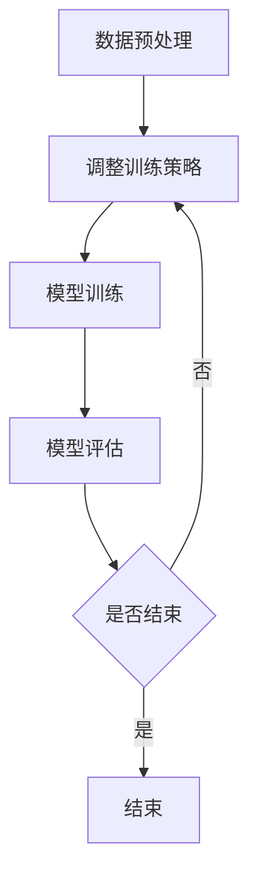
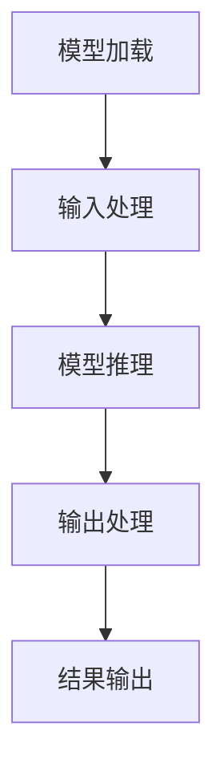
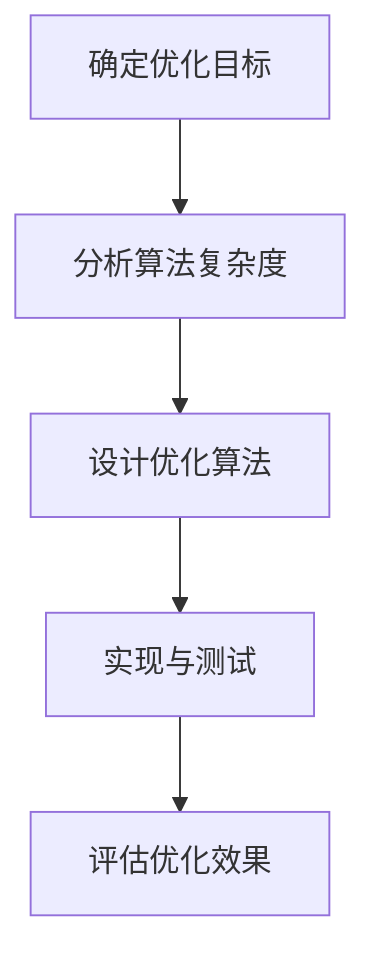
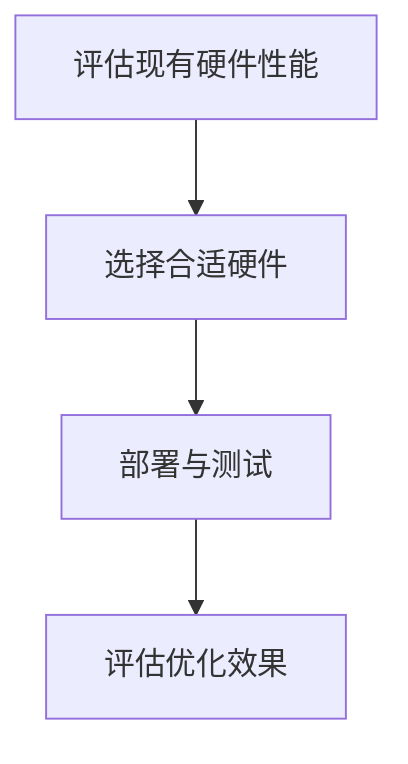
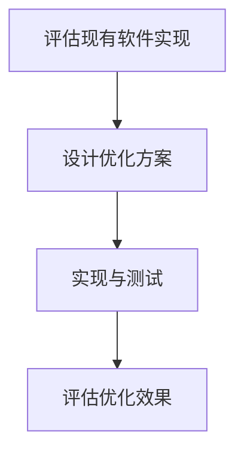

                 

### 大模型训练与推理的计算效率优化

#### 关键词：
- 大模型
- 计算效率
- 算法优化
- 硬件优化
- 软件优化

#### 摘要：
本文将深入探讨大模型训练与推理的计算效率优化问题。随着人工智能技术的迅速发展，大模型的广泛应用带来了巨大的计算需求。本文将从算法、硬件和软件三个层面，通过实际案例分析，阐述如何提高大模型训练与推理的计算效率，为AI领域的科研与工程实践提供参考。

---

## 第一部分: 大模型训练与推理的计算效率优化

### 第1章: 引言与背景

#### 1.1 引言

在人工智能领域，大模型（如深度学习模型、Transformer等）的应用越来越广泛。然而，这些大模型的训练和推理过程需要大量的计算资源，这给计算效率提出了严峻的挑战。

#### 1.2 背景介绍

随着数据的爆炸式增长和算法的迭代升级，大模型的参数量和计算量呈指数级增长。这导致了以下几个主要问题：
- **计算资源消耗巨大**：大模型训练需要大量的CPU、GPU等计算资源，成本高昂。
- **训练时间过长**：大模型的训练时间往往需要数天、数周甚至数月，影响研发效率。
- **推理延迟**：大模型的推理过程也需要大量计算，导致应用程序的响应时间过长，用户体验不佳。

因此，优化大模型训练与推理的计算效率具有重要的现实意义。

---

### 第2章: 大模型训练与推理的基本原理

#### 2.1 大模型训练原理

大模型训练通常包括以下步骤：

1. **数据预处理**：包括数据清洗、归一化、数据增强等，以便于模型训练。
2. **模型初始化**：初始化模型的参数。
3. **模型训练**：通过梯度下降等优化算法，不断调整模型参数，使模型能够更好地拟合训练数据。
4. **模型评估**：使用验证数据集评估模型性能，调整训练策略。

下面使用Mermaid绘制大模型训练流程图：

#### 2.2 大模型推理原理

大模型推理的主要步骤如下：

1. **模型加载**：从存储设备中加载训练好的模型。
2. **输入处理**：对输入数据进行预处理，使其符合模型的输入要求。
3. **模型推理**：将预处理后的输入数据送入模型进行计算，得到输出结果。
4. **输出处理**：对模型的输出结果进行后处理，如归一化、阈值化等。

使用Mermaid绘制大模型推理流程图：

---

### 第3章: 计算效率优化的核心概念

#### 3.1 算法优化

算法优化的核心是通过改进算法本身的效率来降低计算复杂度。例如，使用更高效的梯度计算方法、优化网络结构等。

下面使用Mermaid绘制算法优化流程图：

#### 3.2 硬件优化

硬件优化的核心是提升计算设备的性能。这可以通过使用更快的CPU、GPU，或者采用分布式计算、异构计算等方式实现。

使用Mermaid绘制硬件优化流程图：

#### 3.3 软件优化

软件优化的核心是通过改进软件的实现方式来降低计算负载。例如，使用更高效的编程语言、优化数据结构、减少冗余计算等。

使用Mermaid绘制软件优化流程图：

---

## 第二部分: 算法优化实践

### 第4章: 算法优化实践

在这一章节中，我们将通过具体案例来介绍如何进行算法优化。

#### 4.1 算法优化案例一：使用Adam优化器提升训练效率

Adam优化器是一种结合了Adam和RMSProp优化的算法，它通过自适应学习率来提高训练效率。以下是优化流程：

1. **确定优化目标**：提高模型训练速度。
2. **分析算法复杂度**：Adam优化器的复杂度低于传统的梯度下降。
3. **设计优化算法**：采用Adam优化器代替传统优化器。
4. **实现与测试**：在训练过程中，使用Adam优化器。
5. **评估优化效果**：通过对比训练时间、收敛速度等指标，评估优化效果。

#### 4.2 算法优化案例二：使用Transformer模型优化文本处理

Transformer模型在处理长文本时具有显著优势。以下是优化流程：

1. **确定优化目标**：提高文本处理的准确性和效率。
2. **分析算法复杂度**：Transformer使用多头自注意力机制，减少了计算复杂度。
3. **设计优化算法**：采用Transformer模型代替传统的循环神经网络。
4. **实现与测试**：在文本处理任务中，使用Transformer模型。
5. **评估优化效果**：通过对比文本分类、机器翻译等任务的准确率和处理速度，评估优化效果。

---

## 第三部分: 硬件优化实践

### 第5章: 硬件优化实践

在这一章节中，我们将介绍如何通过硬件优化来提高计算效率。

#### 5.1 硬件优化案例一：使用GPU加速训练过程

GPU（图形处理单元）在并行计算方面具有显著优势，可以有效加速深度学习模型的训练。以下是优化流程：

1. **评估现有硬件性能**：评估现有GPU的性能，如计算能力、内存大小等。
2. **选择合适硬件**：选择适合训练任务的GPU，如NVIDIA Tesla V100等。
3. **部署与测试**：将GPU部署到训练环境中，进行性能测试。
4. **评估优化效果**：通过对比训练时间、GPU利用率等指标，评估优化效果。

#### 5.2 硬件优化案例二：使用分布式计算提升性能

分布式计算可以通过将任务分配到多个计算节点上来提高计算性能。以下是优化流程：

1. **评估现有硬件性能**：评估现有计算集群的性能，如节点数量、网络带宽等。
2. **设计分布式架构**：设计适合任务的分布式计算架构，如数据并行、模型并行等。
3. **部署与测试**：部署分布式计算环境，进行性能测试。
4. **评估优化效果**：通过对比训练时间、集群利用率等指标，评估优化效果。

---

## 第四部分: 软件优化实践

### 第6章: 软件优化实践

在这一章节中，我们将介绍如何通过软件优化来提高计算效率。

#### 6.1 软件优化案例一：使用PyTorch优化代码运行速度

PyTorch是一个高性能的深度学习框架，提供了丰富的优化工具。以下是优化流程：

1. **评估现有软件实现**：评估现有代码的性能，如执行时间、内存占用等。
2. **设计优化方案**：使用PyTorch的优化工具，如Autograd、Tensor cores等。
3. **实现与测试**：在代码中应用优化方案，进行性能测试。
4. **评估优化效果**：通过对比执行时间、内存占用等指标，评估优化效果。

#### 6.2 软件优化案例二：使用分布式计算框架优化数据处理

分布式计算框架如Spark可以用于大规模数据处理，有效提高数据处理效率。以下是优化流程：

1. **评估现有软件实现**：评估现有数据处理流程的性能。
2. **设计优化方案**：使用Spark等分布式计算框架，设计适合的数据处理流程。
3. **实现与测试**：在数据处理过程中，应用分布式计算框架。
4. **评估优化效果**：通过对比数据处理时间、资源利用率等指标，评估优化效果。

---

## 第7章: 综合案例分析与总结

在这一章节中，我们将综合分析前述案例，总结计算效率优化的关键方法和未来研究方向。

#### 7.1 综合案例分析

通过对算法优化、硬件优化和软件优化的案例进行分析，我们可以得出以下结论：
- 算法优化是提升计算效率的基础，高效的算法可以显著降低计算复杂度。
- 硬件优化可以提高计算设备的性能，为算法优化提供强大的支持。
- 软件优化可以改进代码质量，减少冗余计算，提高整体效率。

#### 7.2 总结

计算效率优化是人工智能领域的重要研究方向。未来，随着硬件技术的发展和算法的创新，计算效率将得到进一步提升。同时，跨领域的协同创新也将为计算效率优化带来新的机遇和挑战。

---

**作者：AI天才研究院/AI Genius Institute & 禅与计算机程序设计艺术 /Zen And The Art of Computer Programming**

本文详细介绍了大模型训练与推理的计算效率优化方法，包括算法、硬件和软件三个层面的优化实践。通过实际案例分析，展示了如何有效提高大模型的计算效率，为AI领域的科研与工程实践提供了有益的参考。未来，随着技术的不断进步，计算效率优化将继续成为人工智能发展的关键驱动力。

