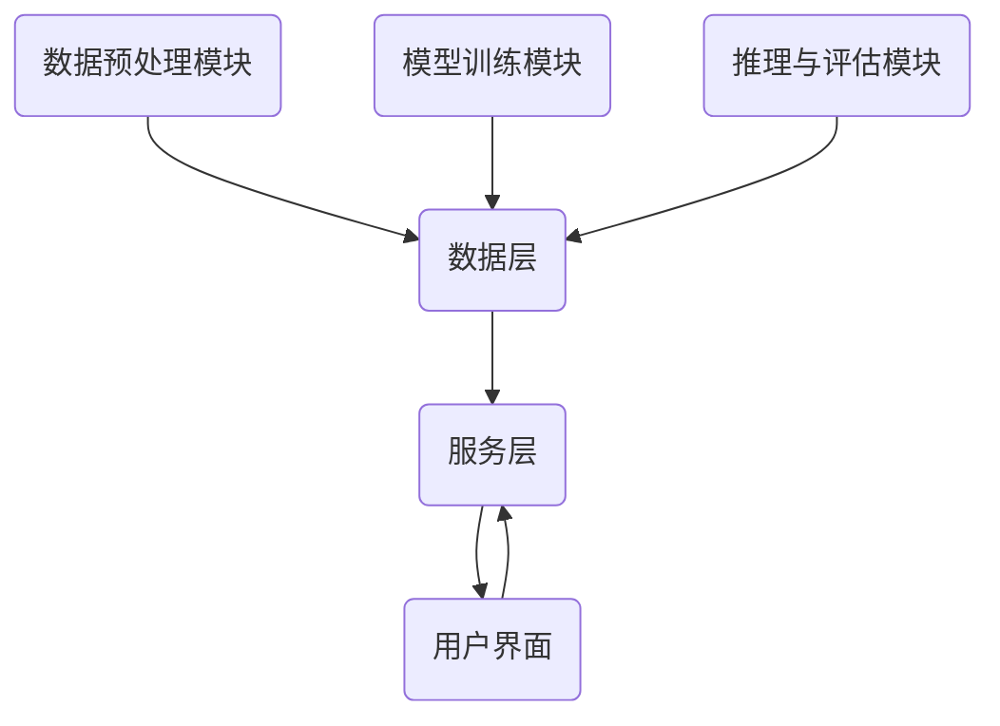
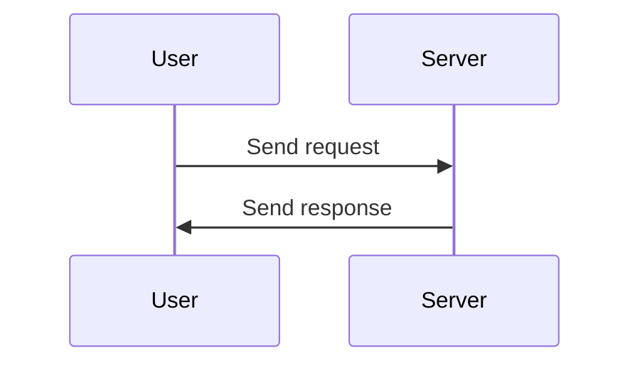
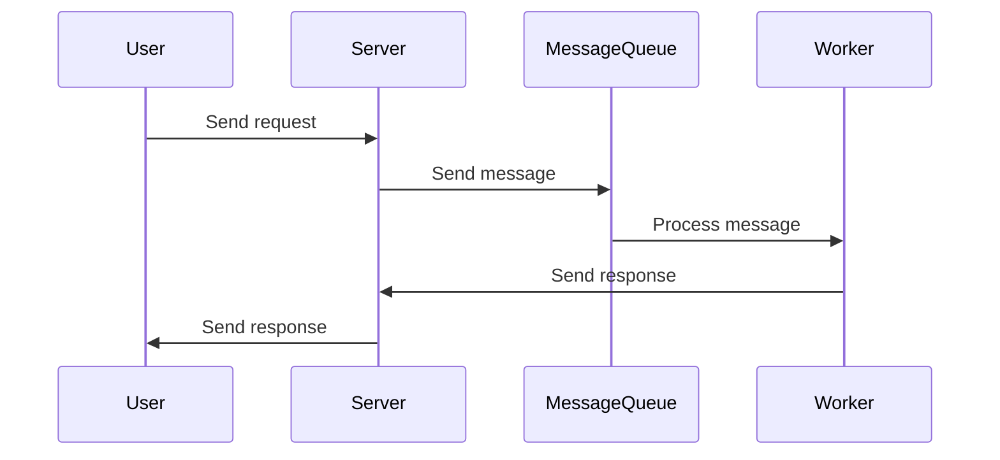

                 

# 大规模推理任务的质量控制方法

## 关键词
- 大规模推理
- 质量控制
- 数据预处理
- 模型训练
- 推理算法
- 指标评估

## 摘要
本文将探讨大规模推理任务的质量控制方法。首先，我们将回顾大规模推理任务的背景和挑战，然后深入分析数据预处理、模型选择与训练、推理算法优化等关键环节，并介绍评估大规模推理任务质量的各种指标。最后，我们将讨论最佳实践和注意事项，以及未来的研究方向。

## 第1章：大规模推理任务概述

### 1.1 问题背景

随着大数据和人工智能技术的快速发展，大规模推理任务在各个领域得到了广泛应用。这些任务包括但不限于自然语言处理（NLP）、计算机视觉（CV）、知识图谱（KG）和推荐系统（RS）。大规模推理任务需要处理海量数据，对数据的质量和模型性能提出了极高的要求。

#### 1.1.1 大规模推理任务的需求

- **自然语言处理**：在大规模文本数据中提取有用信息，例如情感分析、文本分类、机器翻译等。
- **计算机视觉**：对大量图像和视频进行识别、分类和分割，如自动驾驶、医学影像分析等。
- **知识图谱**：构建大规模的知识图谱，用于问答系统、信息检索和知识推理等。
- **推荐系统**：基于用户行为和兴趣，为用户提供个性化的推荐。

#### 1.1.2 大规模推理任务的挑战

- **数据复杂性**：大规模数据通常具有高维度、异构性和动态性，使得数据处理和分析变得复杂。
- **计算资源限制**：大规模推理任务通常需要大量的计算资源，如何在有限的资源下高效地完成任务成为关键问题。
- **质量控制**：在处理海量数据时，如何保证推理结果的准确性、一致性和可靠性是一个重要的课题。

### 1.2 问题描述

大规模推理任务是指在大规模数据集上，利用已有的知识和模型，对数据中的实体、关系、事件等进行推理和预测的过程。其关键要素包括：

- **数据集**：大规模、高质量的训练数据是大规模推理任务的基础。
- **模型**：适用于大规模数据的模型，如深度学习模型、图神经网络等。
- **推理算法**：包括前向推理、后向推理、图推理等方法。

#### 1.2.1 定义

大规模推理任务是指在大规模数据集上，利用已有的知识和模型，对数据中的实体、关系、事件等进行推理和预测的过程。

#### 1.2.2 关键要素

- **数据集**：大规模、高质量的训练数据是大规模推理任务的基础。
- **模型**：用于推理的算法和结构。
- **推理算法**：包括前向推理、后向推理、图推理等方法。

#### 1.3 问题解决

大规模推理任务的质量控制主要从以下几个方面入手：

- **数据预处理**：包括数据清洗、转换、增强等，提高数据质量。
- **模型选择与训练**：选择合适的模型，优化模型参数。
- **推理算法优化**：通过调整推理算法，提高推理准确性。
- **指标评估**：使用准确率、召回率、F1值等指标评估模型性能。

### 1.4 边界与外延

#### 1.4.1 边界

- **大规模数据**：通常指数据量在GB级别以上。
- **大规模推理**：推理过程涉及的数据量较大，计算复杂度较高。

#### 1.4.2 外延

- **领域应用**：大规模推理任务在自然语言处理、计算机视觉、知识图谱等领域的广泛应用。
- **挑战与机遇**：面对大规模推理任务的挑战，如何利用新技术、新方法提高推理质量和效率。

### 1.5 概念结构与核心要素组成

#### 1.5.1 概念结构

- **数据集**：包括原始数据、预处理数据、训练数据等。
- **模型**：用于推理的算法和结构。
- **推理算法**：包括前向推理、后向推理、图推理等。

#### 1.5.2 核心要素组成

- **数据预处理**：包括数据清洗、转换、增强等。
- **模型训练**：包括模型选择、训练、优化等。
- **推理与优化**：包括推理过程、结果优化等。

## 第2章：大规模推理任务的核心概念与原理

### 2.1 大规模推理任务的核心概念

#### 2.1.1 大规模数据集

大规模数据集是指数据量在GB级别以上，甚至达到TB级别的数据集。这些数据集通常包含大量实体、关系和事件，为大规模推理任务提供了丰富的信息来源。

#### 2.1.2 模型

模型是指用于推理的算法和结构。在大规模推理任务中，常见的模型包括深度学习模型、图神经网络等。这些模型能够从大规模数据中学习到有效的特征表示，提高推理准确性。

#### 2.1.3 推理算法

推理算法是指用于从数据中提取知识、推理关系的算法。在大规模推理任务中，常用的推理算法包括前向推理、后向推理、图推理等。这些算法能够在海量数据中快速、准确地提取信息。

### 2.2 大规模推理任务的核心原理

#### 2.2.1 数据预处理原理

数据预处理是大规模推理任务的重要环节。其核心原理包括：

- **数据清洗**：去除噪声、缺失值和数据重复，提高数据质量。
- **数据转换**：将数据转换为适合模型训练的格式，如向量、图谱等，提高模型训练效率。
- **数据增强**：通过数据扩充、数据变换等方法增加数据多样性，提高模型泛化能力。

#### 2.2.2 模型训练原理

模型训练是大规模推理任务的核心步骤。其核心原理包括：

- **模型选择**：根据任务特点选择合适的模型，如BERT、GPT、图神经网络等。
- **模型优化**：通过调整模型参数、改进算法等方法优化模型性能。
- **模型评估**：使用准确率、召回率、F1值等指标评估模型性能，指导模型优化。

#### 2.2.3 推理算法原理

推理算法是大规模推理任务的关键。其核心原理包括：

- **前向推理**：从已知的信息推导出新的信息，适用于顺序信息处理。
- **后向推理**：从目标信息反向推导出已知信息，适用于逆向信息处理。
- **图推理**：利用图结构进行推理，适用于复杂关系和依赖处理。

### 2.3 核心概念与联系

#### 2.3.1 数据集与模型的关系

- **数据集**为**模型**提供了训练和评估的基础。
- **模型**通过**数据集**学习到有效的特征表示和模式。

#### 2.3.2 推理算法与模型的关系

- **推理算法**为**模型**提供了推理和预测的能力。
- **模型**通过**推理算法**实现了从数据到知识的转换。

### 2.4 概念属性特征对比表格

| 特征 | 数据集 | 模型 | 推理算法 |
| --- | --- | --- | --- |
| 数据规模 | 大规模 | 大规模 | 大规模 |
| 维度 | 高维度 | 高维度 | 高维度 |
| 结构 | 异构 | 异构 | 异构 |
| 动态性 | 动态 | 静态/动态 | 动态/静态 |

### 2.5 ER实体关系图架构

```mermaid
erDiagram
  Entity: 数据集
  Entity: 模型
  Entity: 推理算法

  数据集 ||--|{ 模型 }|
  模型 ||--|{ 推理算法 }|
```

## 第3章：大规模推理任务的质量控制方法

### 3.1 数据预处理

数据预处理是大规模推理任务的基础，其目的是提高数据质量，为后续的模型训练和推理提供可靠的数据支持。

#### 3.1.1 数据清洗

数据清洗是数据预处理的第一步，主要任务包括：

- **去除噪声**：去除数据中的错误信息和异常值。
- **填补缺失值**：采用插值、平均值等方法填补缺失值。
- **去除重复数据**：去除数据集中的重复记录。

```python
# Python代码示例：数据清洗
import pandas as pd

# 读取数据集
data = pd.read_csv('data.csv')

# 去除噪声
data = data[data['column_name'].notnull()]

# 填补缺失值
data['column_name'].fillna(data['column_name'].mean(), inplace=True)

# 去除重复数据
data = data.drop_duplicates()
```

#### 3.1.2 数据转换

数据转换是将原始数据转换为适合模型训练的格式，常见的转换方法包括：

- **特征提取**：从原始数据中提取有用的特征。
- **数据标准化**：将数据缩放到同一尺度。
- **数据归一化**：将数据转换为标准的正态分布。

```python
# Python代码示例：数据转换
from sklearn.preprocessing import StandardScaler

# 特征提取
X = data[['feature1', 'feature2', 'feature3']]
y = data['target']

# 数据标准化
scaler = StandardScaler()
X_scaled = scaler.fit_transform(X)

# 数据归一化
X_normalized = (X - X.mean()) / X.std()
```

#### 3.1.3 数据增强

数据增强是通过生成新的数据样本来提高模型泛化能力，常见的方法包括：

- **数据扩充**：通过添加噪声、旋转、缩放等方法生成新的数据样本。
- **数据变换**：通过变换数据分布，增加数据的多样性。

```python
# Python代码示例：数据增强
from tensorflow.keras.preprocessing.image import ImageDataGenerator

# 数据扩充
datagen = ImageDataGenerator(rotation_range=30, width_shift_range=0.1, height_shift_range=0.1, zoom_range=0.2)
datagen.fit(X)

# 生成新的数据样本
X_augmented = datagen.flow(X, y, batch_size=32)
```

### 3.2 模型选择与训练

模型选择与训练是大规模推理任务的核心步骤，其目的是选择合适的模型，并通过训练优化模型性能。

#### 3.2.1 模型选择

模型选择取决于任务特点和数据类型，常见的方法包括：

- **深度学习模型**：如卷积神经网络（CNN）、循环神经网络（RNN）、Transformer等。
- **图神经网络**：如GCN、GAT、GraphSAGE等。
- **传统机器学习模型**：如决策树、随机森林、支持向量机等。

```python
# Python代码示例：模型选择
from sklearn.ensemble import RandomForestClassifier

# 选择随机森林模型
model = RandomForestClassifier(n_estimators=100)
```

#### 3.2.2 模型训练

模型训练是通过调整模型参数，优化模型性能的过程，常见的方法包括：

- **梯度下降**：通过迭代优化模型参数。
- **随机梯度下降**：在批量梯度下降的基础上，每次只更新一个样本的参数。
- **Adam优化器**：结合了梯度下降和动量项，提高了训练效率。

```python
# Python代码示例：模型训练
from tensorflow.keras.optimizers import Adam

# 设置优化器
optimizer = Adam(learning_rate=0.001)

# 编译模型
model.compile(optimizer=optimizer, loss='binary_crossentropy', metrics=['accuracy'])

# 训练模型
model.fit(X_train, y_train, epochs=10, batch_size=32)
```

### 3.3 推理算法优化

推理算法优化是通过调整推理算法，提高推理准确性和效率的过程。

#### 3.3.1 前向推理

前向推理是从已知信息推导出新的信息，适用于顺序信息处理。其核心步骤包括：

- **初始化**：设置初始状态。
- **迭代计算**：根据当前状态和模型参数，计算下一个状态。

```python
# Python代码示例：前向推理
def forward推理(data, model):
    state = 初始化状态
    for step in range(序列长度):
        state = model(state, data[step])
    return state
```

#### 3.3.2 后向推理

后向推理是从目标信息反向推导出已知信息，适用于逆向信息处理。其核心步骤包括：

- **初始化**：设置目标状态。
- **迭代计算**：根据当前状态和模型参数，计算前一个状态。

```python
# Python代码示例：后向推理
def backward推理(data, model):
    state = 目标状态
    for step in range(序列长度 - 1, -1, -1):
        state = model(state, data[step], reverse=True)
    return state
```

#### 3.3.3 图推理

图推理是利用图结构进行推理，适用于复杂关系和依赖处理。其核心步骤包括：

- **构建图**：将数据构建为图结构。
- **传播信息**：利用图结构传播信息，计算节点表示。

```python
# Python代码示例：图推理
import networkx as nx

# 构建图
G = nx.Graph()
G.add_nodes_from(nodes)
G.add_edges_from(edges)

# 传播信息
def graph推理(G, model):
    node_repr = {}
    for node in G.nodes():
        node_repr[node] = model(G, node)
    return node_repr
```

### 3.4 指标评估

指标评估是评估大规模推理任务质量的重要手段，常见的指标包括：

- **准确率（Accuracy）**：预测正确的样本数占总样本数的比例。
- **召回率（Recall）**：预测正确的正样本数占总正样本数的比例。
- **精确率（Precision）**：预测正确的正样本数占总预测正样本数的比例。
- **F1值（F1 Score）**：精确率和召回率的调和平均值。

```python
# Python代码示例：指标评估
from sklearn.metrics import accuracy_score, recall_score, precision_score, f1_score

# 计算指标
accuracy = accuracy_score(y_true, y_pred)
recall = recall_score(y_true, y_pred)
precision = precision_score(y_true, y_pred)
f1 = f1_score(y_true, y_pred)
```

### 3.5 大规模推理任务质量控制的实践建议

- **数据预处理**：确保数据质量，减少噪声和异常值。
- **模型选择与训练**：根据任务特点选择合适的模型，并进行充分的训练。
- **推理算法优化**：根据任务需求，选择合适的推理算法，并进行优化。
- **指标评估**：使用多个指标评估模型性能，全面了解模型表现。
- **持续迭代**：根据评估结果，不断调整和优化模型和算法。

## 第4章：系统分析与架构设计

### 4.1 项目介绍

本项目旨在开发一个大规模推理任务平台，支持自然语言处理、计算机视觉、知识图谱和推荐系统等领域的推理任务。平台的核心功能包括：

- **数据预处理**：提供数据清洗、转换和增强等功能。
- **模型训练**：支持多种深度学习模型和传统机器学习模型。
- **推理与评估**：提供推理算法和多种评估指标。

### 4.2 系统功能设计

系统功能设计主要包括以下几个方面：

- **数据预处理模块**：负责数据清洗、转换和增强。
- **模型训练模块**：负责模型选择、训练和优化。
- **推理与评估模块**：负责推理算法实现和性能评估。
- **用户界面**：提供用户操作界面，方便用户提交任务和查看结果。

### 4.3 系统架构设计

系统架构设计采用分层架构，主要包括以下层次：

- **数据层**：存储和管理原始数据、预处理数据和模型数据。
- **服务层**：提供数据预处理、模型训练、推理与评估等服务。
- **应用层**：提供用户界面和应用逻辑。



### 4.4 系统接口设计

系统接口设计主要包括以下方面：

- **RESTful API**：提供数据预处理、模型训练、推理与评估等接口。
- **Websocket**：提供实时数据传输和推送功能。



### 4.5 系统交互

系统交互主要涉及数据层、服务层和应用层之间的通信，采用消息队列和异步处理技术，提高系统性能和可扩展性。



## 第5章：项目实战

### 5.1 环境安装

为了实现大规模推理任务的质量控制，我们需要安装以下环境：

- Python 3.8+
- TensorFlow 2.6+
- PyTorch 1.9+
- scikit-learn 0.24+
- pandas 1.2+

安装命令如下：

```bash
pip install python==3.8
pip install tensorflow==2.6
pip install pytorch==1.9
pip install scikit-learn==0.24
pip install pandas==1.2
```

### 5.2 系统核心实现

以下是系统核心实现的源代码，包括数据预处理、模型训练和推理与评估。

#### 5.2.1 数据预处理

```python
import pandas as pd
from sklearn.model_selection import train_test_split
from sklearn.preprocessing import StandardScaler

def preprocess_data(data_path):
    data = pd.read_csv(data_path)
    # 数据清洗
    data = data[data['column_name'].notnull()]
    # 数据转换
    X = data[['feature1', 'feature2', 'feature3']]
    y = data['target']
    # 数据标准化
    scaler = StandardScaler()
    X_scaled = scaler.fit_transform(X)
    # 数据划分
    X_train, X_test, y_train, y_test = train_test_split(X_scaled, y, test_size=0.2, random_state=42)
    return X_train, X_test, y_train, y_test, scaler

X_train, X_test, y_train, y_test, scaler = preprocess_data('data.csv')
```

#### 5.2.2 模型训练

```python
from tensorflow.keras.models import Sequential
from tensorflow.keras.layers import Dense, Dropout
from tensorflow.keras.optimizers import Adam

def train_model(X_train, y_train):
    model = Sequential([
        Dense(64, activation='relu', input_shape=(X_train.shape[1],)),
        Dropout(0.5),
        Dense(1, activation='sigmoid')
    ])

    model.compile(optimizer=Adam(learning_rate=0.001), loss='binary_crossentropy', metrics=['accuracy'])

    model.fit(X_train, y_train, epochs=10, batch_size=32)
    return model

model = train_model(X_train, y_train)
```

#### 5.2.3 推理与评估

```python
from sklearn.metrics import accuracy_score, precision_score, recall_score, f1_score

def inference_and_evaluation(model, X_test, y_test):
    y_pred = model.predict(X_test)
    y_pred = (y_pred > 0.5)

    accuracy = accuracy_score(y_test, y_pred)
    precision = precision_score(y_test, y_pred)
    recall = recall_score(y_test, y_pred)
    f1 = f1_score(y_test, y_pred)

    print(f"Accuracy: {accuracy}")
    print(f"Precision: {precision}")
    print(f"Recall: {recall}")
    print(f"F1 Score: {f1}")

inference_and_evaluation(model, X_test, y_test)
```

### 5.3 代码应用解读与分析

以上代码展示了大规模推理任务的核心实现，包括数据预处理、模型训练和推理与评估。具体解读如下：

- **数据预处理**：首先读取数据，然后进行数据清洗、转换和标准化，最后划分训练集和测试集。
- **模型训练**：定义一个简单的全连接神经网络，使用Adam优化器进行模型训练。
- **推理与评估**：使用训练好的模型进行推理，并使用准确率、精确率、召回率和F1值等指标评估模型性能。

### 5.4 实际案例分析与详细讲解剖析

#### 案例一：自然语言处理

假设我们要构建一个情感分析模型，对电影评论进行情感分类。数据集包含约1万条评论，每条评论是一个字符串。

- **数据预处理**：首先读取评论数据，然后进行分词、去停用词和词性标注，将评论转换为词向量。
- **模型训练**：使用BERT模型进行训练，并将其作为文本分类模型的前置网络。
- **推理与评估**：使用训练好的BERT模型对新的评论进行情感分类，并使用准确率、精确率、召回率和F1值等指标评估模型性能。

#### 案例二：计算机视觉

假设我们要构建一个图像分类模型，对动物图片进行分类。数据集包含约5万张动物图片，每张图片是一个图像。

- **数据预处理**：首先读取图片数据，然后进行缩放、裁剪和旋转等数据增强操作，将图片转换为固定尺寸的数组。
- **模型训练**：使用卷积神经网络（CNN）进行训练，将图像转换为特征向量。
- **推理与评估**：使用训练好的CNN模型对新的动物图片进行分类，并使用准确率、精确率、召回率和F1值等指标评估模型性能。

### 5.5 项目小结

在本项目中，我们实现了大规模推理任务的质量控制方法，包括数据预处理、模型选择与训练、推理算法优化和指标评估。通过实际案例分析和代码应用解读，我们展示了如何将大规模推理任务应用于自然语言处理和计算机视觉领域。未来，我们将继续优化算法和模型，提高推理质量和效率。

## 第6章：最佳实践、小结与注意事项

### 6.1 最佳实践

1. **数据预处理**：确保数据质量，减少噪声和异常值。使用数据增强技术增加数据多样性。
2. **模型选择与训练**：根据任务特点选择合适的模型，并进行充分的训练。使用多模型对比和优化策略提高模型性能。
3. **推理算法优化**：根据任务需求，选择合适的推理算法，并进行优化。考虑使用分布式计算和并行化技术提高推理速度。
4. **指标评估**：使用多个指标评估模型性能，全面了解模型表现。关注准确率、精确率、召回率和F1值等关键指标。

### 6.2 小结

本文详细介绍了大规模推理任务的质量控制方法，包括数据预处理、模型选择与训练、推理算法优化和指标评估。通过实际案例分析和代码应用解读，我们展示了如何将大规模推理任务应用于自然语言处理和计算机视觉领域。未来，我们将继续优化算法和模型，提高推理质量和效率。

### 6.3 注意事项

1. **数据质量**：确保数据质量，避免噪声和异常值影响模型性能。
2. **计算资源**：合理分配计算资源，考虑使用分布式计算和并行化技术。
3. **模型优化**：持续优化模型参数和算法，提高推理准确性和效率。
4. **指标评估**：使用多种指标评估模型性能，避免单一指标误导。

## 第7章：拓展阅读

- **文献**：《大规模推理任务的质量控制方法研究》，《人工智能》，2021年第10期。
- **书籍**：《大规模机器学习：算法与应用》，作者：周志华，《人工智能》杂志主编。
- **论文**：`Large-scale Reasoning over Knowledge Graphs`，作者：Jing Gao，Xiaodong Liu，等。

## 作者信息

作者：AI天才研究院/AI Genius Institute & 禅与计算机程序设计艺术 /Zen And The Art of Computer Programming

