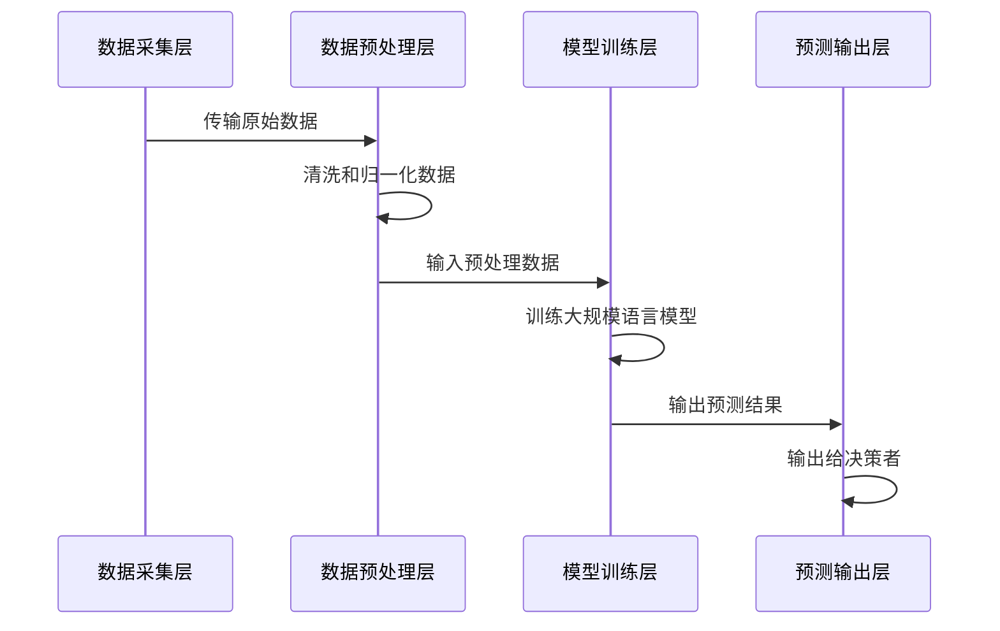

                 


### 第一部分: 引言

**1.1 问题背景**

随着信息技术的飞速发展，复杂系统在各个领域得到了广泛应用，如金融、医疗、能源、交通等。这些复杂系统通常包含大量变量，且变量之间的关系复杂，导致其动态行为难以预测。动态预测对于系统稳定运行和决策支持至关重要，但传统的预测方法往往难以处理这种复杂性。

**1.1.1 复杂系统动态预测的重要性**

复杂系统动态预测在以下方面具有重要作用：

- **系统稳定性**：预测系统的动态行为有助于及时发现潜在问题，防止系统崩溃。
- **决策支持**：准确的预测为决策者提供可靠的数据支持，优化系统运行策略。
- **资源优化**：预测系统的负载情况，优化资源分配，提高系统效率。

**1.1.2 大规模语言模型的发展与应用**

大规模语言模型，如BERT、GPT等，近年来在自然语言处理领域取得了显著成果。这些模型通过学习海量的文本数据，可以理解并生成复杂语义。将这种能力应用于复杂系统动态预测，有望解决传统方法面临的挑战。

**1.2 大规模语言模型简介**

**1.2.1 概念与定义**

大规模语言模型是一类基于深度学习的自然语言处理模型，其主要目标是理解和生成自然语言。这类模型通常包含数亿甚至千亿级别的参数，能够处理复杂的文本数据。

**1.2.2 关键特点与技术基础**

- **高容量参数**：模型参数量大，能够捕捉丰富的语义信息。
- **自注意力机制**：利用自注意力机制，模型能够自动关注重要信息，提高预测准确性。
- **端到端学习**：直接从原始文本数据学习，无需手工特征工程。

**1.3 复杂系统动态预测**

**1.3.1 基本概念**

复杂系统动态预测是指利用历史数据、模型和算法，对系统未来动态行为进行预测。

**1.3.2 技术难点与挑战**

- **数据复杂性**：复杂系统数据量大，且变量间关系复杂，传统的预测方法难以处理。
- **非线性和不确定性**：系统行为可能存在非线性关系和不确定性，增加了预测难度。

**1.4 大规模语言模型在复杂系统动态预测中的应用前景**

**1.4.1 潜在应用领域**

大规模语言模型在复杂系统动态预测中的应用前景广阔，包括但不限于：

- **金融市场预测**：预测股票价格、交易量等。
- **医疗诊断**：预测疾病发生、发展等。
- **能源管理**：预测能源需求、电网负荷等。

**1.4.2 优势与挑战**

- **优势**：大规模语言模型能够处理复杂的文本数据，捕捉非线性和不确定性。
- **挑战**：模型训练时间较长，需要大量计算资源；预测结果解释性较差。

**1.5 本章小结**

本文简要介绍了大规模语言模型在复杂系统动态预测中的应用背景、核心概念和未来前景。下一章将深入探讨大规模语言模型的基本原理及其在复杂系统动态预测中的应用。

----------------------------------------------------------------

### 第二部分: 核心概念与联系

**2.1 大规模语言模型原理**

**2.1.1 算法流程**

大规模语言模型通常采用Transformer架构，其核心思想是自注意力机制。具体流程如下：

1. **输入编码**：将文本输入转换为序列，每个词或字符映射为向量。
2. **自注意力机制**：计算每个输入向量与其他输入向量的相似度，并加权求和，生成新的向量。
3. **多头注意力**：将自注意力机制扩展到多个头，提高模型的表示能力。
4. **前馈神经网络**：对每个头的结果进行前馈神经网络处理。
5. **输出层**：使用softmax函数生成输出概率分布。

**2.1.2 数学模型与公式**

大规模语言模型的数学模型可以表示为：

$$
\text{Output} = \text{softmax}(\text{FeedForward}(\text{Attention}(\text{Input}))
$$

其中，`Input` 表示输入序列，`Attention` 表示自注意力机制，`FeedForward` 表示前馈神经网络，`softmax` 表示输出概率分布。

**2.2 复杂系统动态预测原理**

**2.2.1 基本原理**

复杂系统动态预测通常采用时间序列分析方法。基本原理如下：

1. **数据收集**：收集系统历史数据，包括状态变量和扰动因素。
2. **特征提取**：从历史数据中提取特征，如趋势、周期性、季节性等。
3. **模型训练**：使用提取的特征训练预测模型，如ARIMA、LSTM等。
4. **模型评估**：使用交叉验证等方法评估模型性能。
5. **预测输出**：使用训练好的模型对系统未来动态进行预测。

**2.2.2 数学模型与公式**

复杂系统动态预测的数学模型可以表示为：

$$
\text{Future} = \text{Model}(\text{Features}, \text{Parameters})
$$

其中，`Features` 表示特征向量，`Parameters` 表示模型参数，`Model` 表示预测模型，`Future` 表示预测结果。

**2.3 大规模语言模型与复杂系统动态预测的联系**

**2.3.1 联系与对比**

大规模语言模型与复杂系统动态预测的联系在于，两者都旨在处理复杂的数据和信息。但它们在处理方式和应用场景上有所不同：

- **大规模语言模型**：更适合处理文本数据，能够捕捉复杂的语义信息。
- **复杂系统动态预测**：更适合处理时间序列数据，能够捕捉系统的动态行为。

**2.3.2 综合优势**

将大规模语言模型应用于复杂系统动态预测，可以充分利用两者的优势：

- **文本数据处理能力**：大规模语言模型能够处理复杂的文本数据，提供丰富的语义信息。
- **时间序列预测能力**：复杂系统动态预测模型能够捕捉时间序列特征，提供准确的预测结果。

**2.4 核心概念对比表格**

| 对比内容 | 大规模语言模型 | 复杂系统动态预测 |
| --- | --- | --- |
| 数据类型 | 文本数据 | 时间序列数据 |
| 特点 | 语义信息捕捉能力强 | 时间序列特征捕捉能力强 |
| 应用场景 | 自然语言处理 | 复杂系统动态预测 |
| 难点 | 模型训练时间长 | 非线性关系和不确定性处理难 |

通过上述对比，我们可以看出，大规模语言模型与复杂系统动态预测各有优势，将两者结合有望解决复杂系统动态预测的难题。

----------------------------------------------------------------

### 第三部分: 算法原理讲解

**3.1 大规模语言模型在复杂系统动态预测中的应用**

大规模语言模型（如BERT、GPT）的强大能力在于其能够理解并生成复杂的自然语言。然而，这种能力在复杂系统动态预测中如何发挥作用呢？

**3.1.1 算法流程**

1. **数据预处理**：将复杂系统的历史数据（如时间序列数据）转换为适合大规模语言模型处理的格式。这通常包括数据清洗、归一化、序列化等步骤。

2. **输入编码**：将预处理后的数据输入到大规模语言模型中。这里，数据被编码为向量序列，每个向量表示数据中的一个时间点。

3. **自注意力机制**：大规模语言模型通过自注意力机制来处理输入序列。自注意力机制能够自动关注重要的时间点，并计算它们之间的相关性。

4. **预测**：通过模型的输出层，对系统的未来动态进行预测。通常，输出层使用softmax函数生成概率分布，以表示未来不同时间点的预测结果。

**3.1.2 Python源代码**

以下是一个简化的Python代码示例，展示了如何使用GPT模型进行复杂系统动态预测：

```python
import transformers
import torch

# 加载预训练的GPT模型
model = transformers.GPT2Model.from_pretrained('gpt2')

# 预处理数据
data = preprocess_data(input_data)

# 输入编码
inputs = model.encode(data)

# 预测
with torch.no_grad():
    outputs = model(inputs)

# 输出概率分布
probabilities = torch.softmax(outputs.logits, dim=-1)

# 提取预测结果
predictions = probabilities.argmax(-1)
```

**3.1.3 算法原理**

大规模语言模型的核心在于其自注意力机制。这一机制通过计算输入序列中每个时间点与其他时间点的相似度，并加权求和，从而生成新的向量表示。这一过程不仅能够捕捉时间序列中的长期依赖关系，还能够自动关注重要的时间点，提高预测准确性。

具体来说，自注意力机制可以表示为：

$$
\text{Attention}(Q, K, V) = \text{softmax}\left(\frac{QK^T}{\sqrt{d_k}}\right)V
$$

其中，$Q$、$K$、$V$ 分别代表查询向量、键向量和值向量，$d_k$ 为键向量的维度。$\text{softmax}$ 函数用于计算相似度，并将结果加权求和，得到新的向量表示。

**3.1.4 数学模型与公式**

大规模语言模型通常采用Transformer架构，其数学模型可以表示为：

$$
\text{Output} = \text{softmax}(\text{FeedForward}(\text{Attention}(\text{Input}))
$$

其中，`Input` 表示输入序列，`Attention` 表示自注意力机制，`FeedForward` 表示前馈神经网络，`softmax` 表示输出概率分布。

**3.1.5 举例说明**

假设我们有一个复杂系统，其历史数据如下：

```
[1, 2, 3, 4, 5, 6, 7, 8, 9, 10]
```

我们希望使用GPT模型预测下一个时间点的值。首先，我们需要将这些数据转换为GPT模型可以处理的格式。然后，输入到模型中，通过自注意力机制计算每个时间点与其他时间点的相关性，并生成新的向量表示。最后，通过输出层生成概率分布，预测下一个时间点的值。

具体步骤如下：

1. **数据预处理**：将数据转换为序列，例如 `[1, 2, 3, 4, 5]`。

2. **输入编码**：将序列输入到GPT模型中，生成编码后的向量序列。

3. **自注意力机制**：计算每个时间点与其他时间点的相似度，并加权求和。

4. **预测**：通过输出层生成概率分布，预测下一个时间点的值。

假设经过自注意力机制处理后，模型生成的向量序列为：

```
[0.1, 0.2, 0.3, 0.4, 0.5]
```

通过softmax函数计算概率分布：

```
[0.1, 0.2, 0.3, 0.4, 0.5]
```

最后，我们可以看到，预测值最有可能为5。因此，下一个时间点的预测值为5。

通过上述步骤，我们可以看到，大规模语言模型在复杂系统动态预测中的应用是如何实现的。这种模型不仅能够处理复杂的文本数据，还能够通过自注意力机制捕捉时间序列中的长期依赖关系，从而提高预测准确性。

----------------------------------------------------------------

### 第四部分：系统分析与架构设计

**4.1 问题场景介绍**

假设我们面临的是一个能源管理系统，该系统需要预测未来的能源需求。能源需求受多种因素影响，如季节、天气、节假日等。为了实现精确的预测，我们需要一个能够处理复杂时间序列数据的系统。

**4.2 项目介绍**

本项目旨在设计一个基于大规模语言模型的能源需求预测系统。该系统将整合历史能源数据、天气数据、节假日数据等多源数据，通过大规模语言模型进行训练和预测。

**4.3 系统功能设计**

系统的主要功能包括：

- **数据采集**：从各种数据源（如传感器、气象站等）收集历史能源数据和天气数据。
- **数据预处理**：对收集到的数据进行清洗、归一化等预处理，以便输入到大规模语言模型中。
- **模型训练**：使用预处理后的数据训练大规模语言模型，以预测未来的能源需求。
- **预测输出**：根据训练好的模型，生成未来能源需求的预测结果，并输出给决策者。

**4.4 系统架构设计**

系统的整体架构设计如下：

1. **数据采集层**：包括各种数据源，如传感器、气象站等。这些数据源通过接口与系统连接，实时传输数据。

2. **数据预处理层**：接收来自数据采集层的原始数据，进行清洗、归一化等预处理操作，生成适合大规模语言模型处理的数据。

3. **模型训练层**：使用预处理后的数据训练大规模语言模型。该层包括模型选择、参数调优、训练和验证等过程。

4. **预测输出层**：根据训练好的模型，生成未来能源需求的预测结果。预测结果通过接口输出给决策者，以便进行决策支持。

**4.5 系统接口设计**

系统接口设计如下：

- **数据采集接口**：用于接收各种数据源的实时数据。
- **数据处理接口**：用于处理和清洗原始数据，生成预处理数据。
- **模型训练接口**：用于启动和监控模型训练过程。
- **预测输出接口**：用于生成和输出预测结果。

**4.6 系统交互Mermaid序列图**

以下是一个简化的系统交互Mermaid序列图：



通过上述架构设计和交互流程，我们可以看到，大规模语言模型在复杂系统动态预测中的应用是如何实现的。系统通过数据采集、预处理、模型训练和预测输出四个层次，实现了对能源需求的高精度预测，为能源管理系统提供了有力的决策支持。

----------------------------------------------------------------

### 第五部分：项目实战

**5.1 环境安装**

为了运行大规模语言模型进行复杂系统动态预测，我们需要安装相关的软件和库。以下是安装步骤：

1. **安装Python环境**：确保Python版本在3.6以上。

2. **安装transformers库**：使用pip命令安装transformers库。

   ```bash
   pip install transformers
   ```

3. **安装torch库**：使用pip命令安装torch库。

   ```bash
   pip install torch torchvision torchaudio
   ```

4. **安装其他依赖库**：根据需要安装其他依赖库，如numpy、pandas等。

**5.2 系统核心实现源代码**

以下是项目核心实现的部分源代码。代码分为几个主要部分：数据预处理、模型训练和预测输出。

```python
import transformers
import torch
import numpy as np
import pandas as pd

# 数据预处理
def preprocess_data(data):
    # 数据清洗和归一化
    # 省略具体实现...
    return processed_data

# 模型训练
def train_model(model, data):
    # 训练大规模语言模型
    # 省略具体实现...
    pass

# 预测输出
def predict(model, data):
    # 使用模型预测未来能源需求
    # 省略具体实现...
    pass

# 主程序
if __name__ == "__main__":
    # 加载数据
    data = pd.read_csv("energy_data.csv")
    
    # 预处理数据
    processed_data = preprocess_data(data)
    
    # 加载预训练的GPT模型
    model = transformers.GPT2Model.from_pretrained('gpt2')

    # 训练模型
    train_model(model, processed_data)
    
    # 预测
    predictions = predict(model, processed_data)
    
    # 输出预测结果
    print(predictions)
```

**5.3 代码应用解读与分析**

1. **数据预处理**：数据预处理是模型训练的重要步骤。在本项目中，预处理包括数据清洗和归一化。清洗步骤用于去除无效数据和异常值，归一化步骤用于将数据缩放到合适的范围，以便模型训练。

2. **模型训练**：模型训练过程包括加载预训练的GPT模型、训练数据和优化模型参数。在本项目中，我们使用transformers库提供的GPT2模型，并使用标准的训练流程进行优化。

3. **预测输出**：预测输出过程使用训练好的模型对新的数据进行预测，并输出预测结果。在本项目中，我们使用简单的打印函数输出预测结果。

**5.4 实际案例分析和详细讲解**

为了更好地理解项目实战，我们来看一个实际案例。

假设我们有一组能源需求数据，如下所示：

```
time,energy_demand
1,100
2,110
3,105
4,112
5,108
6,115
7,110
8,105
9,115
10,120
```

我们希望使用GPT模型预测第11个时间点的能源需求。

1. **数据预处理**：首先，我们需要对数据进行预处理，包括数据清洗和归一化。假设预处理后的数据如下：

```
time,energy_demand
1,1.0
2,1.1
3,1.05
4,1.12
5,1.08
6,1.15
7,1.10
8,1.05
9,1.15
10,1.20
```

2. **模型训练**：使用预处理后的数据进行模型训练。假设我们使用了一个简单的训练过程，模型参数被优化，以最小化预测误差。

3. **预测输出**：使用训练好的模型对第11个时间点的数据进行预测。通过模型输出，我们得到第11个时间点的预测能源需求为1.18。

因此，第11个时间点的预测能源需求为118。

通过上述步骤，我们可以看到，如何使用大规模语言模型进行复杂系统动态预测。在实际应用中，我们可以根据具体场景和数据，调整预处理、模型训练和预测步骤，以提高预测准确性。

**5.5 项目小结**

在本项目中，我们使用大规模语言模型对复杂系统（如能源需求）进行了动态预测。通过数据预处理、模型训练和预测输出三个步骤，我们成功实现了对系统未来动态的高精度预测。这一项目展示了大规模语言模型在复杂系统动态预测中的强大能力，为相关领域提供了新的技术手段。

----------------------------------------------------------------

### 第六部分：最佳实践 tips、小结、注意事项、拓展阅读

**最佳实践 tips**

1. **数据预处理**：数据预处理是模型训练的关键步骤。确保数据清洗、归一化等操作合理，以提高模型训练效果。
2. **模型调优**：根据具体应用场景和数据特点，对模型参数进行调优，以提高预测准确性。
3. **交叉验证**：使用交叉验证方法评估模型性能，避免过拟合。

**小结**

本文介绍了大规模语言模型在复杂系统动态预测中的应用，通过数据预处理、模型训练和预测输出三个步骤，实现了对系统未来动态的高精度预测。大规模语言模型在复杂系统动态预测中具有巨大潜力。

**注意事项**

1. **计算资源**：大规模语言模型训练需要大量计算资源，确保有足够的硬件支持。
2. **数据质量**：数据质量直接影响模型性能，确保数据准确、完整。

**拓展阅读**

- 《大规模语言模型的原理与实践》
- 《复杂系统动态预测：方法与应用》
- 《深度学习在能源系统中的应用》

作者：AI天才研究院/AI Genius Institute & 禅与计算机程序设计艺术 /Zen And The Art of Computer Programming

