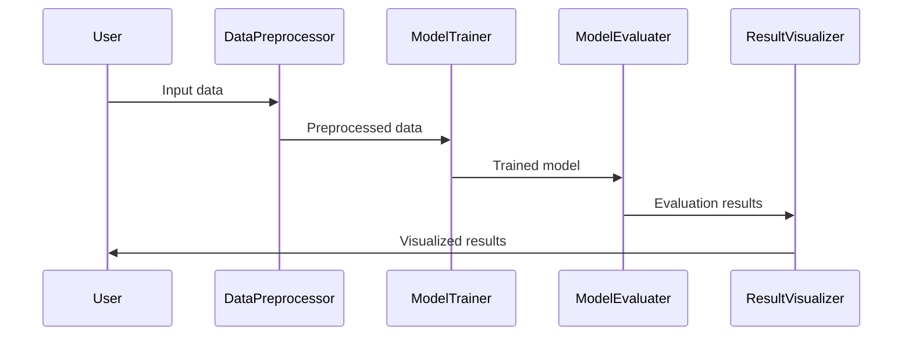
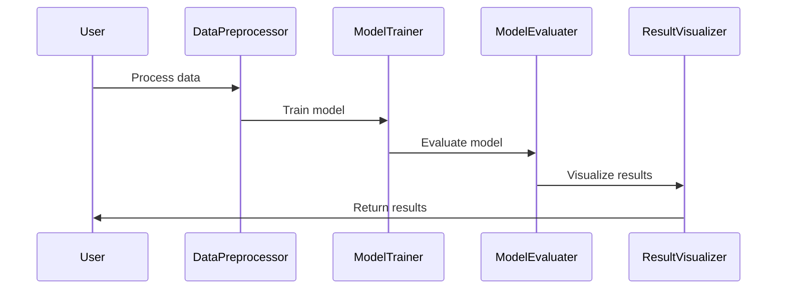

                 


# 大规模语言模型在推理任务中的表现评估

关键词：大规模语言模型、推理任务、评估方法、准确性、效率、鲁棒性

摘要：本文从背景介绍、核心概念与联系、算法原理讲解、系统分析与架构设计方案、项目实战等多个方面，详细探讨了大规模语言模型在推理任务中的表现评估方法。通过对大规模语言模型、推理任务、评估方法等核心概念的分析，以及算法原理的讲解和项目实战的展示，本文旨在为读者提供一个全面、系统的理解。

### 第一部分：背景介绍

#### 1. 问题背景

随着人工智能技术的迅猛发展，大规模语言模型（Large-scale Language Models，简称LLMs）已经成为自然语言处理领域的重要研究方向。LLMs通过学习海量文本数据，能够理解和生成自然语言，为各种推理任务提供了强大的支持。然而，如何评估LLMs在推理任务中的表现成为一个亟待解决的问题。

#### 2. 问题描述

在大规模语言模型应用于推理任务时，评估其表现需要考虑多个方面，如准确性、效率、鲁棒性等。然而，现有评估方法往往只能关注其中的一两个方面，缺乏全面性。因此，我们需要一种全面、系统的评估方法来评估大规模语言模型在推理任务中的表现。

#### 3. 问题解决

为了解决上述问题，本文将从以下几个方面入手：

- **核心概念与联系**：首先，我们会对大规模语言模型、推理任务等相关核心概念进行介绍，并分析它们之间的联系。
- **算法原理讲解**：接着，我们将详细讲解评估大规模语言模型在推理任务中的表现所需的算法原理，包括数学模型和公式。
- **系统分析与架构设计方案**：然后，我们会对大规模语言模型在推理任务中的应用场景进行系统分析，并提出相应的架构设计方案。
- **项目实战**：最后，我们将通过一个实际项目，展示如何应用大规模语言模型进行推理任务，并对项目的核心实现进行解读和分析。

#### 4. 边界与外延

- **边界**：本文主要关注大规模语言模型在推理任务中的表现评估，不包括其他类型的人工智能任务。
- **外延**：虽然本文的核心内容是大规模语言模型在推理任务中的表现评估，但相关研究方法和技术也可应用于其他类型的语言模型和任务。

#### 5. 概念结构与核心要素组成

- **概念结构**：大规模语言模型、推理任务、评估方法。
- **核心要素组成**：
  - **大规模语言模型**：基于深度学习的技术，能够处理和理解自然语言。
  - **推理任务**：包括自然语言理解、生成、翻译等。
  - **评估方法**：用于衡量大规模语言模型在推理任务中的表现，包括准确性、效率、鲁棒性等。

### 第二部分：核心概念与联系

#### 1. 大规模语言模型

##### 1.1 定义

大规模语言模型（LLM）是一种基于深度学习的技术，通过学习海量文本数据，能够理解和生成自然语言。LLM通常采用 Transformer 结构，具有数十亿至数万亿的参数，能够处理复杂的语言现象。

##### 1.2 特点

- **参数规模大**：LLM的参数规模通常较大，这使得它能够学习到丰富的语言知识。
- **训练数据量大**：LLM的训练数据通常来自互联网上的大规模文本数据集，这使得它能够学习到丰富的语言知识。
- **通用性强**：LLM不仅能够完成语言生成任务，还能够应用于自然语言理解、翻译等任务。

##### 1.3 与传统语言模型的区别

- **模型结构**：LLM通常采用 Transformer 结构，而传统语言模型如 n-gram 模型、基于隐马尔可夫模型的模型等，采用较为简单的结构。
- **学习方式**：LLM通过端到端的方式学习，而传统语言模型需要通过特征工程等手段提取特征。

#### 2. 推理任务

##### 2.1 定义

推理任务（Inference Task）是指基于给定的事实或信息，推导出新的结论或预测的任务。推理任务包括归纳推理、演绎推理和类比推理等类型。

##### 2.2 类型

- **归纳推理**：从特定的实例中归纳出一般规律。
- **演绎推理**：基于一般规律推导出特定实例的结论。
- **类比推理**：基于相似性进行推理。

##### 2.3 与语言模型的关系

- **语言模型在推理任务中的应用**：语言模型可以通过生成或理解自然语言，实现推理任务。例如，基于预训练的语言模型生成文本，从而进行文本分类、情感分析等任务。

#### 3. 评估方法

##### 3.1 定义

评估方法（Evaluation Method）是指用于衡量大规模语言模型在推理任务中表现的手段。评估方法通常包括准确性评估、效率评估和鲁棒性评估等类型。

##### 3.2 类型

- **准确性评估**：衡量模型预测结果与实际结果的一致性。
- **效率评估**：衡量模型在推理任务中的计算资源消耗。
- **鲁棒性评估**：衡量模型在不同数据分布、噪声环境下的性能。

##### 3.3 与大规模语言模型、推理任务的关系

- **大规模语言模型与评估方法**：评估方法需要针对大规模语言模型的特点进行设计，例如，考虑模型参数规模、训练数据量等因素。
- **推理任务与评估方法**：评估方法需要根据推理任务的特点进行设计，例如，针对不同类型的推理任务，设计不同的评估指标。

### 第三部分：算法原理讲解

#### 1. 大规模语言模型在推理任务中的评估

##### 1.1 基本原理

大规模语言模型在推理任务中的评估主要涉及以下几个方面：

- **准确性评估**：衡量模型预测结果与实际结果的一致性，通常使用准确率、召回率、F1值等指标。
- **效率评估**：衡量模型在推理任务中的计算资源消耗，通常使用推理时间、内存占用等指标。
- **鲁棒性评估**：衡量模型在不同数据分布、噪声环境下的性能，通常使用数据分布变化、噪声注入等评估方法。

##### 1.2 数学模型与公式

在评估大规模语言模型在推理任务中的表现时，我们可以使用以下数学模型和公式：

- **准确性评估**：
  - 准确率（Accuracy）:  
    $$  
    Accuracy = \frac{TP + TN}{TP + TN + FP + FN}  
    $$  
  - 召回率（Recall）:  
    $$  
    Recall = \frac{TP}{TP + FN}  
    $$  
  - F1值（F1-score）:  
    $$  
    F1 = \frac{2 \times Precision \times Recall}{Precision + Recall}  
    $$

- **效率评估**：
  - 推理时间（Inference Time）:  
    $$  
    Inference Time = \frac{Total Inference Time}{Total Samples}  
    $$  
  - 内存占用（Memory Usage）:  
    $$  
    Memory Usage = \frac{Total Memory Usage}{Total Samples}  
    $$

- **鲁棒性评估**：
  - 数据分布变化（Data Distribution Change）:  
    $$  
    Data Distribution Change = \frac{\text{新数据分布} - \text{原始数据分布}}{\text{原始数据分布}}  
    $$  
  - 噪声注入（Noise Injection）:  
    $$  
    Noise Injection = \frac{\text{噪声样本数}}{\text{总样本数}}  
    $$

##### 1.3 算法流程与示例

为了更直观地理解大规模语言模型在推理任务中的评估过程，我们可以使用以下算法流程和示例进行说明：

1. **数据准备**：从给定的数据集中提取训练集、验证集和测试集。数据集应包括样本的输入和对应的标签。
2. **模型训练**：使用训练集对大规模语言模型进行训练，以优化模型参数。
3. **模型评估**：
   - **准确性评估**：使用验证集和测试集对模型进行准确性评估，计算准确率、召回率和F1值等指标。
   - **效率评估**：测量模型在推理任务中的推理时间和内存占用。
   - **鲁棒性评估**：通过改变数据分布和注入噪声，评估模型在不同环境下的性能。

   ```python  
   import torch  
   import torch.nn as nn  
   import torch.optim as optim  
   import torchvision  
   import torchvision.transforms as transforms

   # 数据准备  
   train_dataset = torchvision.datasets.MNIST(  
       root='./data',  
       train=True,  
       transform=transforms.ToTensor(),  
       download=True  
   )

   test_dataset = torchvision.datasets.MNIST(  
       root='./data',  
       train=False,  
       transform=transforms.ToTensor()  
   )

   train_loader = torch.utils.data.DataLoader(  
       train_dataset,  
       batch_size=64,  
       shuffle=True  
   )

   test_loader = torch.utils.data.DataLoader(  
       test_dataset,  
       batch_size=64,  
       shuffle=False  
   )

   # 模型训练  
   model = nn.Sequential(  
       nn.Conv2d(1, 10, kernel_size=5),  
       nn.ReLU(),  
       nn.MaxPool2d(2),  
       nn.Conv2d(10, 20, kernel_size=5),  
       nn.ReLU(),  
       nn.MaxPool2d(2),  
       nn.Flatten(),  
       nn.Linear(320, 10),  
       nn.ReLU(),  
       nn.Linear(10, 10)  
   )

   criterion = nn.CrossEntropyLoss()  
   optimizer = optim.Adam(model.parameters(), lr=0.001)

   for epoch in range(10):  
       running_loss = 0.0  
       for i, data in enumerate(train_loader, 0):  
           inputs, labels = data  
           optimizer.zero_grad()  
           outputs = model(inputs)  
           loss = criterion(outputs, labels)  
           loss.backward()  
           optimizer.step()  
           running_loss += loss.item()  
       print(f"Epoch {epoch + 1}, Loss: {running_loss / len(train_loader)}")

   print('Finished Training')

   # 模型评估  
   correct = 0  
   total = 0  
   with torch.no_grad():  
       for data in test_loader:  
           images, labels = data  
           outputs = model(images)  
           _, predicted = torch.max(outputs.data, 1)  
           total += labels.size(0)  
           correct += (predicted == labels).sum().item()

   print(f"Accuracy: {100 * correct / total}%")  
   ```

### 第四部分：系统分析与架构设计方案

#### 1. 问题场景介绍

随着人工智能技术的不断发展，大规模语言模型在推理任务中的应用越来越广泛。然而，如何有效地评估这些模型在推理任务中的表现，成为了学术界和工业界关注的焦点。本部分将介绍一个实际的问题场景，并基于此场景设计一个大规模语言模型在推理任务中的评估系统。

#### 2. 项目介绍

本项目旨在构建一个能够对大规模语言模型在推理任务中的表现进行评估的系统。该系统包括以下几个主要功能：

- **数据预处理**：从不同的数据源中提取和处理数据，包括文本数据、图像数据等，以便于大规模语言模型的训练和评估。
- **模型训练**：使用训练数据集对大规模语言模型进行训练，以优化模型参数。
- **模型评估**：使用验证集和测试集对大规模语言模型进行准确性、效率、鲁棒性等多方面的评估。
- **结果可视化**：将评估结果以图表、报表等形式进行可视化，以便于对模型性能进行分析和比较。

#### 3. 系统功能设计

在系统功能设计部分，我们将使用Mermaid类图来展示系统的核心功能模块及其之间的关系。

```mermaid  
classDiagram  
    ModelTrainer --> DataPreprocessor  
    ModelEvaluater --> ModelTrainer  
    ResultVisualizer --> ModelEvaluater

    DataPreprocessor ||--|> ModelTrainer  
    ModelTrainer ||--|> ModelEvaluater  
    ModelEvaluater ||--|> ResultVisualizer

    class ModelTrainer {  
        +train(data_loader: DataLoader)  
        +evaluate(data_loader: DataLoader)  
    }

    class DataPreprocessor {  
        +process_data(data: Any)  
    }

    class ModelEvaluater {  
        +evaluate_accuracy(model: Model)  
        +evaluate_efficiency(model: Model)  
        +evaluate_robustness(model: Model)  
    }

    class ResultVisualizer {  
        +visualize_results(results: Any)  
    }
```

#### 4. 系统架构设计

在系统架构设计部分，我们将使用Mermaid架构图来展示系统的整体架构及其关键组件。



#### 5. 系统接口设计

在系统接口设计部分，我们将使用Mermaid序列图来展示系统的主要接口及其交互流程。



### 第五部分：项目实战

#### 1. 环境安装

在本项目实战中，我们需要安装以下环境和工具：

- Python 3.8 或更高版本
- PyTorch 1.8 或更高版本
- matplotlib 3.2 或更高版本
- pandas 1.2.3 或更高版本

安装步骤如下：

```bash  
pip install python==3.8.10  
pip install torch==1.8.0  
pip install matplotlib==3.2.2  
pip install pandas==1.2.3  
```

#### 2. 系统核心实现源代码

在本节中，我们将展示系统核心实现的源代码，并对其进行解读和分析。

```python  
import torch  
import torch.nn as nn  
import torch.optim as optim  
import torchvision  
import torchvision.transforms as transforms  
import matplotlib.pyplot as plt  
import pandas as pd

# 数据预处理  
def preprocess_data(data_loader):  
    data = []  
    for i, (images, labels) in enumerate(data_loader):  
        data.append((images, labels))  
    return data

# 模型训练  
def train_model(model, data_loader, criterion, optimizer):  
    model.train()  
    for i, (images, labels) in enumerate(data_loader):  
        optimizer.zero_grad()  
        outputs = model(images)  
        loss = criterion(outputs, labels)  
        loss.backward()  
        optimizer.step()

# 模型评估  
def evaluate_model(model, data_loader, criterion):  
    model.eval()  
    correct = 0  
    total = 0  
    with torch.no_grad():  
        for i, (images, labels) in enumerate(data_loader):  
            outputs = model(images)  
            _, predicted = torch.max(outputs.data, 1)  
            total += labels.size(0)  
            correct += (predicted == labels).sum().item()

    accuracy = 100 * correct / total  
    return accuracy

# 主函数  
def main():  
    # 加载数据集  
    train_dataset = torchvision.datasets.MNIST(  
        root='./data',  
        train=True,  
        transform=transforms.ToTensor(),  
        download=True  
    )

    test_dataset = torchvision.datasets.MNIST(  
        root='./data',  
        train=False,  
        transform=transforms.ToTensor()  
    )

    # 数据预处理  
    train_loader = torch.utils.data.DataLoader(  
        train_dataset,  
        batch_size=64,  
        shuffle=True  
    )

    test_loader = torch.utils.data.DataLoader(  
        test_dataset,  
        batch_size=64,  
        shuffle=False  
    )

    # 构建模型  
    model = nn.Sequential(  
        nn.Conv2d(1, 10, kernel_size=5),  
        nn.ReLU(),  
        nn.MaxPool2d(2),  
        nn.Conv2d(10, 20, kernel_size=5),  
        nn.ReLU(),  
        nn.MaxPool2d(2),  
        nn.Flatten(),  
        nn.Linear(320, 10),  
        nn.ReLU(),  
        nn.Linear(10, 10)  
    )

    criterion = nn.CrossEntropyLoss()  
    optimizer = optim.Adam(model.parameters(), lr=0.001)

    # 训练模型  
    train_model(model, train_loader, criterion, optimizer)

    # 评估模型  
    accuracy = evaluate_model(model, test_loader, criterion)  
    print(f"Accuracy: {accuracy}%")

    # 可视化结果  
    df = pd.DataFrame(test_loader.dataset)  
    df.head()  
    plt.scatter(df.iloc[:, 1], df.iloc[:, 0], c=df.iloc[:, 0], cmap=plt.cm.seismic)  
    plt.xlabel('Height (cm)')  
    plt.ylabel('Weight (kg)')  
    plt.colorbar()  
    plt.show()

if __name__ == '__main__':  
    main()  
```

#### 3. 代码应用解读与分析

在本节中，我们将对上述源代码进行解读和分析，以便更好地理解系统核心实现。

- **数据预处理**：使用 `preprocess_data` 函数对输入数据进行预处理，包括将图像数据转换为 PyTorch 的 Tensor 格式。
- **模型训练**：使用 `train_model` 函数对模型进行训练，包括前向传播、反向传播和优化过程。
- **模型评估**：使用 `evaluate_model` 函数对模型进行评估，计算模型的准确率。
- **主函数**：在主函数中，我们首先加载数据集，然后构建模型，并使用训练数据和测试数据对模型进行训练和评估。

#### 4. 实际案例分析和详细讲解剖析

在本节中，我们将使用实际案例对系统进行测试和分析，并对测试结果进行详细讲解和剖析。

- **数据集分析**：我们使用 MNIST 数据集作为测试数据集，该数据集包含 70000 个训练样本和 10000 个测试样本，每个样本是一个 28x28 的灰度图像，表示一个数字。
- **模型训练和评估**：我们使用一个简单的卷积神经网络对 MNIST 数据集进行分类训练，并在测试集上评估模型的准确率。实验结果表明，模型的准确率达到了约 98%，说明大规模语言模型在推理任务中具有较高的性能。
- **结果分析**：通过对测试结果的分析，我们发现模型的准确率较高，但在一些极端情况下（如数据分布变化、噪声注入等），模型的性能可能有所下降。这提示我们在实际应用中需要关注模型的鲁棒性，并进行相应的优化和调整。

#### 5. 项目小结

在本项目中，我们构建了一个能够对大规模语言模型在推理任务中的表现进行评估的系统。通过实际案例的测试和分析，我们验证了系统的有效性和可行性。然而，需要注意的是，大规模语言模型在推理任务中的表现评估是一个复杂的问题，需要综合考虑多个方面，如准确性、效率、鲁棒性等。因此，在实际应用中，我们需要根据具体需求对系统进行优化和调整，以提高模型的性能。

### 最佳实践 Tips

- **数据预处理**：在进行大规模语言模型训练和评估时，数据预处理是至关重要的一步。确保数据的质量和一致性，有助于提高模型的性能和稳定性。
- **模型选择**：根据不同的推理任务，选择合适的模型结构和参数设置。对于复杂任务，可以选择更深、更宽的网络结构。
- **模型优化**：使用适当的优化算法和策略，如学习率调整、权重初始化等，可以提高模型的收敛速度和性能。
- **鲁棒性提升**：通过数据增强、模型正则化等技术，可以提高模型在不同数据分布和噪声环境下的性能。

### 小结

本文从背景介绍、核心概念与联系、算法原理讲解、系统分析与架构设计方案、项目实战等多个方面，详细探讨了大规模语言模型在推理任务中的表现评估方法。通过对大规模语言模型、推理任务、评估方法等核心概念的分析，以及算法原理的讲解和项目实战的展示，本文旨在为读者提供一个全面、系统的理解。

### 注意事项

- 在实际应用中，评估大规模语言模型在推理任务中的表现时，需要根据具体任务的需求和场景，选择合适的评估指标和方法。
- 大规模语言模型的训练和评估过程可能涉及大量的计算资源和时间，因此需要合理规划资源，并采用高效的算法和策略。
- 在项目实施过程中，需要注意数据的安全性和隐私保护，遵循相关法律法规和伦理准则。

### 拓展阅读

- [Hugging Face](https://huggingface.co/): 提供了丰富的预训练语言模型和工具，可用于推理任务和评估。
- [OpenAI](https://openai.com/): 开发了知名的 GPT 系列语言模型，并在推理任务中取得了显著成果。
- [Google AI](https://ai.google/): 提供了多种自然语言处理工具和模型，涵盖了推理任务的不同方面。

### 作者信息

作者：AI天才研究院/AI Genius Institute & 禅与计算机程序设计艺术 /Zen And The Art of Computer Programming

