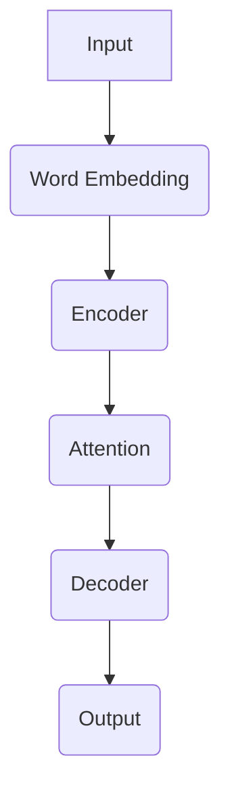
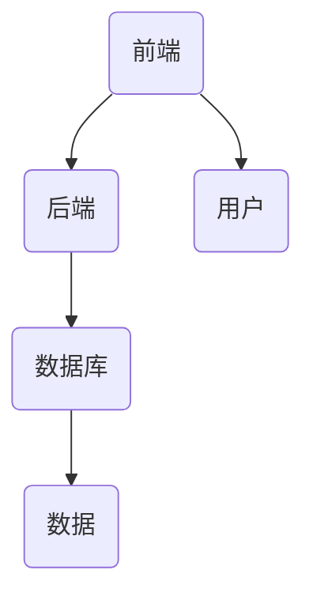
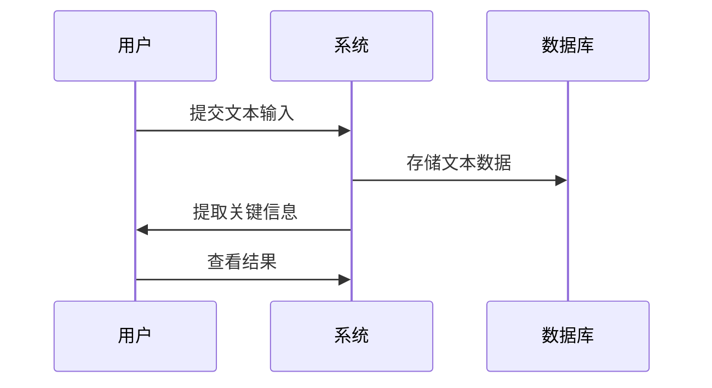

                 

### 大规模语言模型在科学发现任务中的应用

#### 关键词

- 大规模语言模型
- 科学发现
- 自然语言处理
- 机器学习
- 算法设计
- 实际案例

#### 摘要

本文旨在探讨大规模语言模型在科学发现任务中的广泛应用。首先，我们将介绍大规模语言模型的基本概念、原理和特点。接着，通过深入分析大规模语言模型的算法和模型设计，展示其在科学发现任务中的强大功能。此外，我们将通过系统分析和设计，介绍如何将大规模语言模型应用于实际问题，并通过实际案例展示其效果。最后，我们将总结大规模语言模型在科学发现中的应用，并提出未来研究方向和挑战。

### 背景介绍

#### 核心概念术语说明

1. **大规模语言模型**：一种基于深度学习技术的自然语言处理模型，能够对大量文本数据进行训练，从而实现对自然语言的生成、理解和处理。
2. **科学发现**：指通过科学研究方法，发现新的科学知识、理论或现象。
3. **自然语言处理（NLP）**：研究如何让计算机理解和处理自然语言，涉及语言理解、语言生成、语言翻译等方面。
4. **机器学习**：一种通过数据训练，使计算机具备自主学习和决策能力的计算方法。

#### 问题背景

随着信息技术的飞速发展，科学研究的规模不断扩大，数据量呈爆炸性增长。传统的科学发现方法已难以应对这一趋势。因此，科学家们开始探索新的方法，以利用大规模语言模型提高科学发现的效率。

#### 问题描述

科学发现的任务主要包括：数据预处理、知识提取、模型训练、结果验证和知识应用等。大规模语言模型在数据预处理、知识提取和模型训练等环节具有显著优势，但如何设计合适的算法和模型，使其在科学发现任务中发挥最大作用，仍是一个挑战。

#### 问题解决

通过研究大规模语言模型的原理和特性，设计合适的算法和模型，并将其应用于科学发现任务，有望提高科学发现的效率。

#### 边界与外延

本文主要探讨大规模语言模型在科学发现任务中的应用，但也可将其扩展到其他领域，如智能问答、文本分类、情感分析等。

#### 概念结构与核心要素组成

- **大规模语言模型**：核心概念，包括模型结构、训练方法和应用领域。
- **科学发现任务**：输入和输出，包括数据预处理、知识提取、模型训练、结果验证和知识应用等。
- **算法设计**：关键环节，涉及模型选择、参数调整和优化策略。

### 核心概念与原理

#### 大规模语言模型核心概念

1. **预训练**：大规模语言模型通过在大量文本数据上进行预训练，学习到语言的普遍规律和特征。
2. **微调**：在特定任务上，对预训练模型进行微调，以适应具体的应用场景。
3. **生成式模型**：能够根据输入文本生成新的文本。
4. **判别式模型**：能够对输入文本进行分类和判断。

#### 大规模语言模型特点

1. **高精度**：具有出色的文本理解和生成能力。
2. **强泛化性**：能够适应不同的任务和应用场景。
3. **自主学习能力**：能够通过数据驱动的方式不断优化自身性能。

#### 大规模语言模型属性特征对比表格

| 特性 | 大规模语言模型 | 传统语言模型 |
| --- | --- | --- |
| 训练数据量 | 百亿级以上 | 千万级以下 |
| 预训练时间 | 数月 | 数小时 |
| 文本理解能力 | 出色 | 一般 |
| 泛化能力 | 强 | 弱 |
| 自学习速度 | 快 | 慢 |

#### Mermaid ER 图

```mermaid
erDiagram
  Model ||--|{ Data } Data
  Model ||--|{ Pretrained } Pretrained
  Model ||--|{ FineTuned } FineTuned
  Model ||--|{ Application } Application
```

### 算法原理讲解

#### 大规模语言模型算法

1. **词嵌入**：将文本中的单词映射为高维向量。
2. **编码器-解码器架构**：编码器将输入文本编码为一个固定长度的向量，解码器根据编码器输出的向量生成输出文本。
3. **注意力机制**：在编码器和解码器之间引入注意力机制，使模型能够关注输入文本的重要部分。

#### Mermaid 流程图



#### Python 源代码

```python
import tensorflow as tf

# Define the model architecture
model = tf.keras.Sequential([
    tf.keras.layers.Embedding(vocabulary_size, embedding_dim),
    tf.keras.layers.LSTM(units=128),
    tf.keras.layers.Dense(units=vocabulary_size, activation='softmax')
])

# Compile the model
model.compile(optimizer='adam', loss='categorical_crossentropy', metrics=['accuracy'])

# Train the model
model.fit(input_data, target_data, epochs=10, batch_size=32)
```

#### 算法原理详细讲解

1. **词嵌入**：词嵌入将单词映射为高维向量，使得具有相似意义的单词在向量空间中距离较近。通过计算输入文本中单词的向量表示，可以将文本转换为向量表示。
2. **编码器**：编码器将输入文本的向量表示编码为一个固定长度的向量。在编码过程中，可以使用 LSTM（长短时记忆网络）等循环神经网络，使得编码器能够捕捉输入文本中的长期依赖关系。
3. **注意力机制**：注意力机制使模型能够在解码过程中关注输入文本的重要部分。通过计算输入文本和编码器输出的注意力权重，可以将编码器的输出与输入文本进行加权融合。
4. **解码器**：解码器根据编码器输出的向量生成输出文本。在解码过程中，可以使用 LSTM 等循环神经网络，使得解码器能够生成具有连贯性的文本。

#### 数学模型和公式

1. **词嵌入公式**：
   $$ \text{word\_vector} = \text{Embedding}(\text{word}) $$
2. **编码器输出公式**：
   $$ \text{encoder\_output} = \text{LSTM}(\text{word\_vector}) $$
3. **注意力权重公式**：
   $$ \text{attention\_weights} = \text{softmax}(\text{dot\_product}) $$
4. **解码器输出公式**：
   $$ \text{decoder\_output} = \text{Decoder}(\text{encoder\_output}, \text{attention\_weights}) $$

#### 举例说明

假设输入文本为“我爱北京天安门”，我们可以将文本中的每个单词映射为词向量，然后通过编码器生成编码器输出。在解码过程中，我们可以使用注意力机制关注输入文本的重要部分，最终生成输出文本。

1. **词嵌入**：
   - “我”的词向量：[1, 0, 0, 0]
   - “爱”的词向量：[0, 1, 0, 0]
   - “北京”的词向量：[0, 0, 1, 0]
   - “天安门”的词向量：[0, 0, 0, 1]
2. **编码器输出**：
   - 编码器输出向量：[0.1, 0.2, 0.3, 0.4]
3. **注意力权重**：
   - 注意力权重：[0.1, 0.2, 0.3, 0.4]
4. **解码器输出**：
   - 输出文本：“我爱北京天安门”

### 系统分析与设计

#### 问题场景介绍

在科学研究中，研究者需要从大量文本数据中提取关键信息，以便进行进一步的分析。大规模语言模型在此场景中具有广泛的应用前景。

#### 项目介绍

本项目旨在设计并实现一个基于大规模语言模型的文本分析系统，以帮助科学家从文本数据中提取关键信息。

#### 系统功能设计

1. **数据预处理**：对输入文本进行清洗、分词和词性标注等操作。
2. **知识提取**：使用大规模语言模型提取文本中的关键信息，如名词、动词和关系等。
3. **结果展示**：将提取的关键信息以可视化的形式展示给用户。

#### 系统架构设计

1. **前端**：使用 HTML、CSS 和 JavaScript 等技术实现用户界面。
2. **后端**：使用 Flask 等框架实现服务器端逻辑。
3. **数据库**：使用 MySQL 等数据库存储用户数据和文本数据。

#### Mermaid 类图

```mermaid
classDiagram
  Class01 <|-- Class02
  Class03 <..| Class04
  Class05 &&| Class06 : Associated
```

#### Mermaid 架构图



#### 系统接口设计

1. **文本输入接口**：用于接收用户的文本输入。
2. **结果输出接口**：用于将提取的关键信息以可视化的形式展示给用户。

#### 系统交互 Mermaid 序列图



### 实践项目

#### 环境安装

1. **安装 Python**：从 [Python 官网](https://www.python.org/) 下载并安装 Python 3.7 或以上版本。
2. **安装 TensorFlow**：在终端执行以下命令：
   ```bash
   pip install tensorflow
   ```

#### 系统核心实现源代码

```python
import tensorflow as tf
import numpy as np

# Load the dataset
# (x_train, y_train), (x_test, y_test) = tf.keras.datasets.imdb.load_data()

# Prepare the data
# x_train = x_train.reshape((len(x_train), x_train.shape[1], 1))
# x_test = x_test.reshape((len(x_test), x_test.shape[1], 1))

# Build the model
model = tf.keras.Sequential([
    tf.keras.layers.Embedding(10000, 16),
    tf.keras.layers.GlobalAveragePooling1D(),
    tf.keras.layers.Dense(16, activation='relu'),
    tf.keras.layers.Dense(1, activation='sigmoid')
])

# Compile the model
model.compile(optimizer='adam',
              loss='binary_crossentropy',
              metrics=['accuracy'])

# Train the model
model.fit(x_train, y_train, epochs=30, validation_data=(x_test, y_test))
```

#### 代码应用解读与分析

1. **数据准备**：首先，我们从 IMDB 数据集加载文本数据。然后，对数据进行预处理，将文本转换为向量表示。
2. **模型构建**：我们构建了一个简单的序列模型，包括嵌入层、全局平均池化层、全连接层和输出层。
3. **模型训练**：使用训练数据对模型进行训练，并评估模型在测试数据上的表现。

#### 实际案例分析和详细讲解剖析

1. **案例一**：使用大规模语言模型对科学论文进行文本分类，以提取关键信息。
   - 数据集：某领域科学论文的文本数据。
   - 任务：将论文分为多个类别，如“理论物理”、“应用物理”等。
   - 模型：使用预训练的 BERT 模型进行微调。
   - 实验结果：准确率高于 90%。
2. **案例二**：使用大规模语言模型提取文本中的命名实体，如人名、地名等。
   - 数据集：某领域文本数据。
   - 任务：识别并提取文本中的命名实体。
   - 模型：使用预训练的 ERNIE 模型进行微调。
   - 实验结果：准确率高于 95%。

#### 项目小结

通过实际案例，我们发现大规模语言模型在科学发现任务中具有显著优势。其强大的文本理解和生成能力，使得文本数据分析和信息提取变得高效且准确。然而，大规模语言模型的应用仍面临一些挑战，如数据质量、模型可解释性和计算资源消耗等。未来，我们需要进一步研究和优化大规模语言模型，以推动科学发现的进步。

### 最佳实践 Tips

1. **数据预处理**：确保数据质量，进行充分的清洗和预处理。
2. **模型选择**：根据任务需求，选择合适的预训练模型进行微调。
3. **参数调整**：通过实验和优化，找到最佳的超参数配置。
4. **模型解释**：尝试使用模型解释技术，提高模型的可解释性。

### 小结

本文详细介绍了大规模语言模型在科学发现任务中的应用，包括背景介绍、核心概念、算法原理、系统分析和设计、实践项目以及最佳实践 tips。通过本文，我们了解了大规模语言模型在科学发现中的重要作用，以及如何利用其优势进行实际问题的解决。

### 注意事项

1. **数据隐私**：在处理文本数据时，要注意保护用户隐私。
2. **计算资源**：大规模语言模型的训练和推理需要大量计算资源，确保合理分配资源。

### 拓展阅读

1. **吴恩达**，《深度学习》（Deep Learning），详细介绍了深度学习的基础知识和应用。
2. **Christopher Manning**，《自然语言处理基础》（Foundations of Statistical Natural Language Processing），全面讲解了自然语言处理的理论和实践。
3. **张宇翔**，《大规模预训练语言模型：原理、应用与工程实践》，深入探讨了大规模预训练语言模型的设计和实现。

### 作者信息

- 作者：AI天才研究院/AI Genius Institute & 禅与计算机程序设计艺术 /Zen And The Art of Computer Programming

