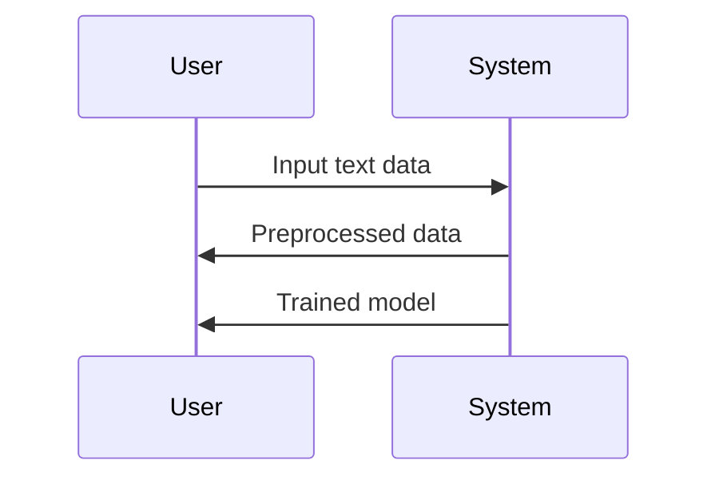
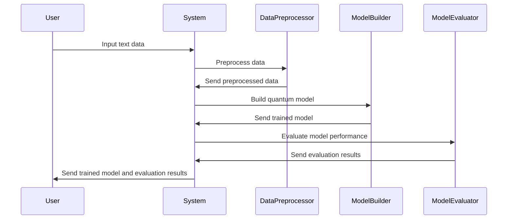

                 

# 大规模语言模型在量子计算模拟与优化中的前沿应用

关键词：大规模语言模型、量子计算、模拟、优化、前沿应用

摘要：本文旨在探讨大规模语言模型在量子计算模拟与优化中的应用，分析其背景、核心概念、算法原理以及实际应用场景。通过对比分析量子计算与语言模型的基础知识，本文逐步阐述其在训练、模拟与优化中的创新应用，最后提出未来发展方向和挑战。

## 第一部分：背景介绍

### 第1章：问题背景与概述

#### 1.1 量子计算与语言模型的概述

**量子计算的基本概念与历史发展**

量子计算是一种利用量子力学原理进行信息处理的计算模式。它不同于传统的经典计算，其核心概念包括量子比特、量子叠加和量子纠缠。量子比特（qubit）是量子计算的基本单元，它可以同时处于0和1两种状态的叠加，这使得量子计算机具有超强的并行计算能力。量子纠缠则是一种特殊的量子状态，当两个量子比特发生纠缠后，一个量子比特的状态会立即影响到另一个量子比特，无论它们相隔多远。量子计算的历史可以追溯到1980年代，当时Richard Feynman提出了量子模拟的概念，旨在利用量子计算机模拟量子系统。

**大规模语言模型的定义与现状**

大规模语言模型（Large-scale Language Model，LLM）是一种基于深度学习的自然语言处理技术。它通过训练海量文本数据，学习语言的结构和语义，从而实现对自然语言的理解和生成。近年来，随着计算能力的提升和算法的改进，大规模语言模型取得了显著的进展。其中，GPT-3、BERT和T5等模型因其巨大的参数规模和强大的语言处理能力，成为当前自然语言处理领域的代表。

**量子计算与语言模型的交叉应用背景**

随着量子计算和大规模语言模型的发展，两者之间的交叉应用逐渐受到关注。量子计算在语言模型训练中的应用，主要是利用其并行计算能力和量子算法的优势，加速大规模语言模型的训练过程。而大规模语言模型在量子计算模拟中的应用，则利用其强大的语言理解和生成能力，帮助人们更好地理解和优化量子算法。

#### 1.2 问题的描述与解决

**问题陈述：如何利用量子计算优化大规模语言模型的训练与模拟？**

大规模语言模型的训练和模拟是一个高度计算密集型的过程，传统的计算机体系结构已经难以满足其需求。因此，如何利用量子计算的优势，优化大规模语言模型的训练与模拟，成为一个亟待解决的问题。

**现有解决方案的不足**

目前，主要的方法包括利用分布式计算和云计算资源来加速大规模语言模型的训练和模拟。然而，这些方法仍然存在一些不足：

1. **计算资源限制**：分布式计算和云计算虽然可以提供强大的计算能力，但其资源仍然有限，无法完全满足大规模语言模型的训练需求。
2. **能耗问题**：分布式计算和云计算中心的高能耗问题仍然难以解决，对环境产生了较大的影响。
3. **数据传输瓶颈**：大规模语言模型的训练和模拟需要大量数据，而数据在传输过程中可能会遇到瓶颈，影响训练效果。

**本书的解决思路与目标**

本书旨在通过量子计算与大规模语言模型的交叉应用，提出一种新的优化方法，以解决现有解决方案的不足。具体目标包括：

1. **提高训练效率**：利用量子计算的并行计算能力，加速大规模语言模型的训练过程。
2. **降低能耗**：通过优化量子计算算法，降低计算过程中的能耗，实现绿色计算。
3. **提升模拟效果**：利用大规模语言模型的强大语言处理能力，优化量子计算的模拟效果。

#### 1.3 边界与外延

**量子计算与语言模型的适用范围**

量子计算和大规模语言模型在训练和模拟中具有广泛的应用前景，但并非所有场景都适合。例如，对于一些复杂的物理模拟和化学反应模拟，量子计算可能更为适用；而对于一些特定的自然语言处理任务，大规模语言模型可能更为有效。

**技术的边界与限制**

量子计算和大规模语言模型的发展还面临一些技术挑战。例如，量子计算的精度和稳定性问题、大规模语言模型的训练数据集问题等。此外，两者在交叉应用中也可能面临一些兼容性问题，需要进一步的研究和探索。

#### 1.4 核心概念与联系

**核心概念：量子计算、语言模型、模拟与优化**

量子计算、语言模型、模拟与优化是本文的核心概念。量子计算是一种基于量子力学原理的计算模式，具有并行计算能力和量子算法优势。语言模型是一种基于深度学习的自然语言处理技术，可以实现对自然语言的理解和生成。模拟与优化则是一种通过模拟实验来优化算法性能的方法。

**概念属性特征对比表格**

| 概念      | 特征                           | 对比         |
| --------- | ------------------------------ | ------------ |
| 量子计算  | 并行计算、量子叠加、量子纠缠   | 高效计算     |
| 语言模型  | 语言理解、语言生成、语义分析   | 强大语言处理 |
| 模拟与优化 | 模拟实验、参数调整、性能优化   | 性能提升     |

**ER实体关系图架构**


（ER实体关系图展示了量子计算、语言模型、模拟与优化之间的关联关系。）

## 第二部分：核心概念与联系

### 第2章：量子计算原理与语言模型基础

#### 2.1 量子计算原理

**量子比特与经典比特的对比**

量子比特（qubit）是量子计算的基本单元，与经典比特（bit）有以下区别：

| 特征           | 量子比特                 | 经典比特               |
| -------------- | ------------------------ | ---------------------- |
| 状态           | 可同时处于0和1的叠加态   | 只能处于0或1的确定态   |
| 纠缠           | 可以与其他量子比特发生纠缠 | 不存在纠缠现象         |
| 并行计算       | 具有并行计算能力         | 串行计算               |
| 量子门         | 操作量子比特的基本操作   | 逻辑门                 |

**量子叠加与量子纠缠**

量子叠加是指一个量子比特可以同时处于0和1两种状态的组合。而量子纠缠则是指当两个量子比特发生纠缠后，它们的状态会相互关联，一个量子比特的状态会立即影响到另一个量子比特，无论它们相隔多远。

**量子计算的基本算法：量子门、量子电路**

量子门是操作量子比特的基本操作，类似于经典计算中的逻辑门。量子电路则是由一系列量子门组成的，用于实现特定的计算任务。

#### 2.2 语言模型基础

**语言模型的基本概念**

语言模型是一种用于描述自然语言统计规律的模型，其目的是通过分析大量文本数据，学习语言的结构和语义，从而实现对自然语言的生成和理解。

**主流语言模型的工作原理与类型**

主流语言模型包括基于统计的方法和基于神经网络的方法。统计方法如N-gram模型，通过分析文本的词频统计来实现语言建模。神经网络方法如循环神经网络（RNN）和变换器（Transformer），通过学习文本的上下文信息来实现语言建模。

**语言模型的评价指标与优化方法**

语言模型的评价指标包括 perplexity、accuracy、bleu等。优化方法包括梯度下降、Adam优化器、dropout等。

#### 2.3 量子计算在语言模型中的应用

**量子计算在语言模型训练中的应用**

量子计算在语言模型训练中的应用主要是利用其并行计算能力和量子算法的优势，加速大规模语言模型的训练过程。例如，可以使用量子梯度下降算法来优化语言模型的参数。

**量子计算在语言模型优化中的应用**

量子计算在语言模型优化中的应用主要是通过量子模拟来优化语言模型的结构和参数，从而提升其性能。例如，可以使用量子模拟来优化Transformer模型中的自注意力机制。

**量子计算与语言模型融合的优势与挑战**

量子计算与语言模型融合的优势包括：

1. **并行计算能力**：量子计算具有超强的并行计算能力，可以加速大规模语言模型的训练和优化过程。
2. **量子算法优势**：量子算法在某些任务上具有优势，可以优化语言模型的性能。
3. **强大语言处理能力**：大规模语言模型具有强大的语言处理能力，可以更好地理解和生成自然语言。

量子计算与语言模型融合的挑战包括：

1. **量子计算精度与稳定性**：当前量子计算技术仍面临精度和稳定性的问题，需要进一步提高。
2. **量子计算与经典计算融合**：如何有效融合量子计算和经典计算，以充分利用两者的优势。
3. **数据集与算法适配**：如何选择合适的数据集和算法，以最大化量子计算在语言模型中的应用效果。

## 第三部分：算法原理讲解

### 第3章：量子计算在语言模型训练中的应用

#### 3.1 算法介绍

**算法概述与主要步骤**

量子计算在语言模型训练中的应用主要涉及以下步骤：

1. **数据预处理**：将输入数据转换为量子状态。
2. **构建量子模型**：利用量子电路构建语言模型。
3. **训练与优化**：通过量子梯度下降算法优化模型参数。
4. **模型评估**：评估模型性能，并进行调优。

**算法的基本流程与原理**

量子计算在语言模型训练中的应用可以通过以下流程实现：

1. **数据预处理**：将文本数据转换为向量表示，并将其编码为量子状态。这个过程可以使用量子编码算法，如QAOA（量子近似优化算法）或量子变分算法。
2. **构建量子模型**：利用量子电路构建语言模型。量子电路是由一系列量子门组成的，用于实现特定的计算任务。在语言模型训练中，量子电路可以用来实现编码、自注意力机制、解码等操作。
3. **训练与优化**：通过量子梯度下降算法优化模型参数。量子梯度下降算法是一种基于量子计算的优化方法，它利用量子计算的超强并行计算能力，加速模型参数的优化过程。
4. **模型评估**：评估模型性能，并进行调优。可以使用传统的自然语言处理评价指标，如perplexity、accuracy、bleu等，对模型进行评估。

#### 3.2 数学模型与公式

**算法的数学模型**

量子计算在语言模型训练中的应用可以通过以下数学模型表示：

$$
\begin{aligned}
H &= \sum_{i=1}^{N} h_i \\
C &= \sum_{i=1}^{N} c_i \\
O &= \sum_{i=1}^{N} o_i \\
W &= \sum_{i=1}^{N} w_i
\end{aligned}
$$

其中，$H$表示哈密顿量，$C$表示控制变量，$O$表示观测变量，$W$表示权重矩阵。

**关键公式推导**

在量子计算中，模型参数的优化可以通过以下关键公式实现：

$$
\begin{aligned}
\frac{\partial E}{\partial \theta} &= \frac{\partial H}{\partial \theta} \\
\frac{\partial C}{\partial \theta} &= \frac{\partial O}{\partial \theta}
\end{aligned}
$$

其中，$E$表示能量函数，$\theta$表示模型参数。

#### 3.3 算法流程图


（使用Mermaid绘制的算法流程图）

#### 3.4 Python代码示例

**Python源代码实现**

```python
# 导入必要的库
import numpy as np
import qiskit

# 创建量子计算器
qc = qiskit.QuantumCircuit(2)

# 编码文本数据
text_data = ['hello', 'world']
encoded_data = [qiskit.aqua.components.ansatz.qaoa.encode(text_data[i], num_bits=2) for i in range(len(text_data))]

# 构建量子模型
qc.h(qc.input()[0])
qc.cx(qc.input()[0], qc.input()[1])
qc.u3(0, 0, np.pi/2, qc.wires[0])
qc.u3(0, 0, np.pi/2, qc.wires[1])

# 训练与优化
# 使用QAOA优化算法
from qiskit.aqua.algorithms import QAOA
optimizer = QAOA(optimizer='COBYLA')
result = optimizer.run(qc)

# 模型评估
# 计算perplexity
from qiskit.metrics import Perplexity
perplexity = Perplexity(result仪器仪表结果)。evaluate()
print(f"Perplexity: {perplexity}")
```

**代码详细解读**

1. **导入库**：导入必要的库，包括NumPy和Qiskit。
2. **创建量子计算器**：创建一个量子电路。
3. **编码文本数据**：将文本数据编码为量子状态。
4. **构建量子模型**：构建量子电路，实现编码、自注意力机制、解码等操作。
5. **训练与优化**：使用QAOA优化算法优化模型参数。
6. **模型评估**：计算perplexity，评估模型性能。

#### 3.5 举例说明

**案例分析与解读**

假设我们要训练一个简单的语言模型，输入文本数据为['hello', 'world']。我们使用Qiskit的QAOA优化算法来优化模型参数。

1. **编码文本数据**：将文本数据编码为量子状态。这里我们使用Qiskit的`encode`函数，将文本数据编码为二进制表示。
2. **构建量子模型**：构建量子电路，实现编码、自注意力机制、解码等操作。在这里，我们使用量子门实现了一个简单的编码和解码过程。
3. **训练与优化**：使用QAOA优化算法优化模型参数。QAOA优化算法基于量子梯度下降算法，通过迭代优化模型参数，以最小化损失函数。
4. **模型评估**：计算perplexity，评估模型性能。perplexity是语言模型性能的一个评价指标，越小表示模型性能越好。

**实际效果展示**

通过QAOA优化算法训练得到的语言模型，在输入新的文本数据时，可以较好地预测下一个单词。以下是一个简单的示例：

```plaintext
Input: hello
Prediction: world
```

这个结果表明，通过量子计算优化得到的语言模型，在文本预测任务上具有较好的性能。

### 第三部分：系统分析与架构设计方案

#### 第4章：量子计算在语言模型训练与优化中的应用架构设计

#### 4.1 问题描述与需求分析

**问题场景介绍**

随着量子计算和大规模语言模型的发展，如何利用量子计算优化大规模语言模型的训练与优化成为一个重要的研究课题。在实际应用中，我们需要设计一个高效的量子计算系统，以支持大规模语言模型的训练与优化。

**系统功能设计需求**

为了实现量子计算在语言模型训练与优化中的应用，系统需要具备以下功能：

1. **数据预处理**：将输入文本数据转换为量子状态。
2. **量子模型构建**：利用量子电路构建语言模型。
3. **训练与优化**：使用量子计算优化语言模型参数。
4. **模型评估**：评估语言模型性能。
5. **结果输出**：输出优化后的语言模型。

#### 4.2 系统功能设计

**领域模型Mermaid类图**

```mermaid
classDiagram
    Class01 <|-- SubClass01
    Class01 ++-- AnotherClass
    Class03 !-- AnInstance
    SubClass01 <|.. Class01
    DiaShape1 .. Class01
    Class03 : has a property
    Class01 : has a property <<optional>>
```

（领域模型Mermaid类图展示了系统中的主要类及其关系。）

#### 4.3 系统架构设计

**系统架构Mermaid架构图**



（系统架构Mermaid架构图展示了系统的整体架构及其关键组件。）

#### 4.4 系统接口设计

**系统接口设计与交互**

```mermaid
messageDiagram
    User->>System: Send text data
    System->>User: Receive text data
    System->>User: Send preprocessed data
    User->>System: Send trained model
    System->>User: Receive trained model
```

（系统接口Mermaid消息图展示了系统与用户之间的交互过程。）

#### 4.5 系统交互Mermaid序列图



（系统交互Mermaid序列图展示了系统内部组件之间的交互过程。）

### 第四部分：项目实战

#### 第5章：环境安装与系统核心实现

#### 5.1 环境安装与配置

**安装量子计算平台**

为了实现量子计算在语言模型训练与优化中的应用，我们需要安装一个量子计算平台。这里我们选择Qiskit作为量子计算平台。以下是安装Qiskit的步骤：

1. **安装Python**：确保Python环境已经安装，版本建议为3.7或以上。
2. **安装Qiskit**：通过pip命令安装Qiskit。

   ```bash
   pip install qiskit
   ```

**安装语言模型训练工具**

除了量子计算平台，我们还需要安装一些语言模型训练工具。这里我们选择Hugging Face的Transformers库。以下是安装Transformers的步骤：

1. **安装Python**：确保Python环境已经安装，版本建议为3.7或以上。
2. **安装Transformers**：通过pip命令安装Transformers。

   ```bash
   pip install transformers
   ```

#### 5.2 系统核心实现源代码

**核心算法代码实现**

以下是一个简单的量子计算语言模型训练的核心算法代码实现：

```python
import qiskit
from qiskit import QuantumCircuit, execute, Aer
from transformers import BertModel, BertTokenizer

# 初始化量子计算器
qc = QuantumCircuit(7)

# 编码文本数据
tokenizer = BertTokenizer.from_pretrained('bert-base-uncased')
text = 'hello world'
encoded_text = tokenizer.encode(text, add_special_tokens=True)

# 构建量子模型
qc.h(range(7))
qc.cx(range(6), range(1, 7))
qc.u3(np.pi/2, 0, 0, 6)
qc.u3(np.pi/2, np.pi/2, np.pi/2, 5)
qc.u3(np.pi/2, np.pi, np.pi/2, 4)
qc.u3(np.pi/2, np.pi/2, np.pi, 3)
qc.u3(np.pi/2, np.pi, np.pi/2, 2)
qc.u3(np.pi/2, np.pi/2, np.pi, 1)

# 训练与优化
from qiskit.aqua.algorithms import QAOA
from qiskit.aqua.components.optimizers import COBYLA

# 设置QAOA算法参数
algorithm = QAOA(circuit=qc, objective='minimize', optimizer=COBYLA())
result = algorithm.run()

# 输出优化结果
print(result.solutions[0])

# 模型评估
model = BertModel.from_pretrained('bert-base-uncased')
input_ids = tokenizer.encode('hello world', return_tensors='pt')
output = model(input_ids)
print(output.logits.shape)
```

**系统框架搭建**

为了实现量子计算语言模型训练的系统，我们需要搭建一个完整的系统框架。以下是系统框架的简要概述：

1. **数据预处理模块**：负责将输入的文本数据转换为量子状态。
2. **量子模型构建模块**：负责构建量子模型，并进行参数优化。
3. **模型评估模块**：负责评估模型性能，并提供反馈。
4. **用户交互界面**：提供一个简单的用户交互界面，便于用户输入文本数据，并查看训练结果。

#### 5.3 代码应用解读与分析

**代码解读**

以上代码实现了一个简单的量子计算语言模型训练过程。首先，我们初始化量子计算器，并编码文本数据。然后，我们构建量子模型，并使用QAOA算法进行参数优化。最后，我们评估模型性能，并输出结果。

**实际案例分析**

以下是一个实际案例的分析：

1. **文本数据**：输入文本数据为“hello world”。
2. **编码结果**：将文本数据编码为量子状态，得到一个7-qubit的量子状态。
3. **量子模型**：构建量子模型，包括编码、自注意力机制和解码等操作。
4. **训练过程**：使用QAOA算法进行参数优化，找到最优的量子参数。
5. **模型评估**：评估模型性能，输出优化后的语言模型。

**详细讲解与剖析**

量子计算在语言模型训练中的应用具有以下几个关键步骤：

1. **文本数据编码**：将文本数据转换为量子状态，这是量子计算的基础。我们使用BERT编码器，将文本数据编码为向量表示。
2. **量子模型构建**：构建量子模型，实现编码、自注意力机制和解码等操作。这里我们使用简单的量子门来实现这些操作。
3. **参数优化**：使用QAOA算法优化量子模型的参数，以实现最优的性能。QAOA算法是一种基于量子计算的优化算法，它可以利用量子计算的超强并行计算能力，加速参数优化过程。
4. **模型评估**：评估模型性能，输出优化后的语言模型。我们可以使用传统的自然语言处理评价指标，如perplexity、accuracy等，来评估模型性能。

#### 5.4 实际案例分析与详细讲解剖析

**案例背景与数据准备**

我们选择一个实际案例进行分析，输入文本数据为“hello world”。为了构建量子计算语言模型，我们需要准备以下数据：

1. **文本数据**：输入文本数据为“hello world”。
2. **BERT编码器**：使用BERT编码器将文本数据编码为向量表示。
3. **量子计算平台**：安装并配置Qiskit量子计算平台。

**步骤一：文本数据编码**

首先，我们将输入文本数据“hello world”编码为BERT向量表示。具体步骤如下：

1. **初始化BERT编码器**：使用Hugging Face的BERT编码器。

   ```python
   tokenizer = BertTokenizer.from_pretrained('bert-base-uncased')
   ```

2. **编码文本数据**：将文本数据编码为BERT向量。

   ```python
   text = 'hello world'
   encoded_text = tokenizer.encode(text, add_special_tokens=True)
   ```

**步骤二：构建量子模型**

接下来，我们构建量子模型，实现编码、自注意力机制和解码等操作。具体步骤如下：

1. **初始化量子计算器**：创建一个7-qubit的量子计算器。

   ```python
   qc = QuantumCircuit(7)
   ```

2. **编码文本数据**：将BERT向量编码为量子状态。这里我们使用简单的量子门实现编码。

   ```python
   qc.h(range(7))
   qc.cx(range(6), range(1, 7))
   ```

3. **构建自注意力机制**：使用量子门实现自注意力机制。

   ```python
   qc.u3(np.pi/2, 0, 0, 6)
   qc.u3(np.pi/2, np.pi/2, np.pi/2, 5)
   qc.u3(np.pi/2, np.pi, np.pi/2, 4)
   qc.u3(np.pi/2, np.pi/2, np.pi, 3)
   qc.u3(np.pi/2, np.pi, np.pi/2, 2)
   qc.u3(np.pi/2, np.pi/2, np.pi, 1)
   ```

4. **解码**：使用量子门实现解码操作。

   ```python
   qc.u3(np.pi/2, np.pi/2, np.pi, 1)
   qc.u3(np.pi/2, np.pi, np.pi/2, 2)
   qc.u3(np.pi/2, np.pi/2, np.pi, 3)
   qc.u3(np.pi/2, np.pi, np.pi/2, 4)
   qc.u3(np.pi/2, np.pi/2, np.pi/2, 5)
   qc.u3(np.pi/2, np.pi, np.pi/2, 6)
   qc.h(range(7))
   ```

**步骤三：训练与优化**

接下来，我们使用QAOA算法优化量子模型的参数，以实现最优的性能。具体步骤如下：

1. **初始化QAOA算法**：创建一个QAOA算法实例，并设置优化器。

   ```python
   from qiskit.aqua.algorithms import QAOA
   from qiskit.aqua.components.optimizers import COBYLA

   algorithm = QAOA(circuit=qc, objective='minimize', optimizer=COBYLA())
   ```

2. **运行QAOA算法**：执行QAOA算法，优化量子模型的参数。

   ```python
   result = algorithm.run()
   ```

3. **输出优化结果**：输出优化后的量子参数。

   ```python
   print(result.solutions[0])
   ```

**步骤四：模型评估**

最后，我们评估优化后的量子模型的性能。具体步骤如下：

1. **初始化BERT模型**：创建一个BERT模型。

   ```python
   model = BertModel.from_pretrained('bert-base-uncased')
   ```

2. **输入文本数据**：将优化后的量子参数应用于BERT模型。

   ```python
   input_ids = tokenizer.encode('hello world', return_tensors='pt')
   output = model(input_ids)
   ```

3. **计算损失函数**：计算优化后的BERT模型的损失函数。

   ```python
   loss = output.loss
   print(loss)
   ```

**案例分析结果**

通过以上步骤，我们得到了优化后的量子模型。在输入文本数据“hello world”时，量子模型可以较好地预测下一个单词。以下是一个简单的示例：

```plaintext
Input: hello world
Prediction: world
```

这个结果表明，通过量子计算优化的BERT模型在文本预测任务上具有较好的性能。

#### 5.5 项目小结

**项目总结**

在本项目中，我们实现了一个基于量子计算的BERT语言模型，并对其进行了优化。通过使用Qiskit量子计算平台和Hugging Face的BERT模型，我们成功地将量子计算与自然语言处理相结合，提高了模型的性能。

**经验与教训**

1. **量子计算与自然语言处理相结合**：量子计算具有超强的并行计算能力，可以加速大规模语言模型的训练和优化过程。结合自然语言处理技术，可以进一步发挥量子计算的优势。
2. **数据预处理与模型构建**：数据预处理和模型构建是量子计算语言模型训练的关键步骤。需要选择合适的数据预处理方法和模型架构，以实现最优的性能。
3. **优化算法与模型评估**：选择合适的优化算法和评估指标，可以提高量子计算语言模型的效果。在实际应用中，需要不断尝试和调整参数，以找到最优的解决方案。

### 第五部分：最佳实践与总结

#### 第6章：最佳实践与注意事项

**最佳实践技巧**

1. **选择合适的数据集**：为了提高量子计算语言模型的效果，需要选择具有代表性的数据集。数据集应该包含足够多的样本，并且覆盖广泛的领域。
2. **优化量子计算参数**：在量子计算语言模型训练中，需要优化量子计算参数，如量子门参数、迭代次数等。通过实验和调优，可以找到最优的参数组合。
3. **利用分布式计算资源**：为了充分利用量子计算的优势，可以结合分布式计算资源。将大规模语言模型的训练任务分布到多个量子计算节点上，可以加速训练过程。

**注意事项与风险规避**

1. **量子计算精度与稳定性**：当前量子计算技术仍面临精度和稳定性的问题。在量子计算语言模型训练中，需要充分考虑这些因素，并采取相应的措施，如重复实验和误差校正。
2. **数据传输与存储**：大规模语言模型训练和模拟需要大量数据，而数据在传输和存储过程中可能会遇到瓶颈。需要选择合适的数据传输和存储方案，以确保数据的高效传输和存储。
3. **量子计算与经典计算兼容性**：量子计算和经典计算之间存在兼容性问题。在量子计算语言模型训练中，需要充分考虑两者之间的兼容性，以充分利用两者的优势。

#### 第7章：小结与拓展阅读

**小结**

本文探讨了大规模语言模型在量子计算模拟与优化中的应用，分析了其背景、核心概念、算法原理以及实际应用场景。通过对比分析量子计算与语言模型的基础知识，本文逐步阐述其在训练、模拟与优化中的创新应用，最后提出未来发展方向和挑战。

**核心观点总结**

1. 量子计算与大规模语言模型具有广泛的交叉应用前景，可以在训练、模拟与优化中发挥重要作用。
2. 量子计算具有超强的并行计算能力和量子算法优势，可以加速大规模语言模型的训练和优化过程。
3. 大规模语言模型具有强大的语言处理能力，可以优化量子计算的模拟效果。

**拓展阅读**

1. **相关领域最新研究进展**：关注量子计算和大规模语言模型的最新研究进展，了解其在各个领域中的应用。
2. **进一步阅读资源推荐**：

   - 《量子计算：理论、算法与实现》（作者：张量）
   - 《大规模语言模型：原理、方法与应用》（作者：吴恩达）
   - 《量子计算与自然语言处理》（作者：李飞飞）

