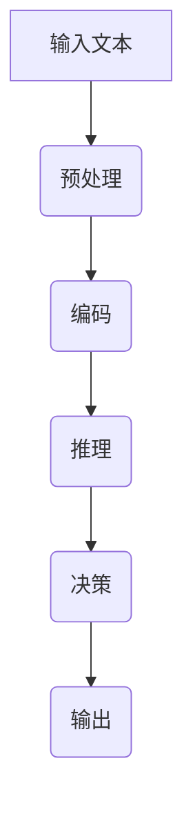
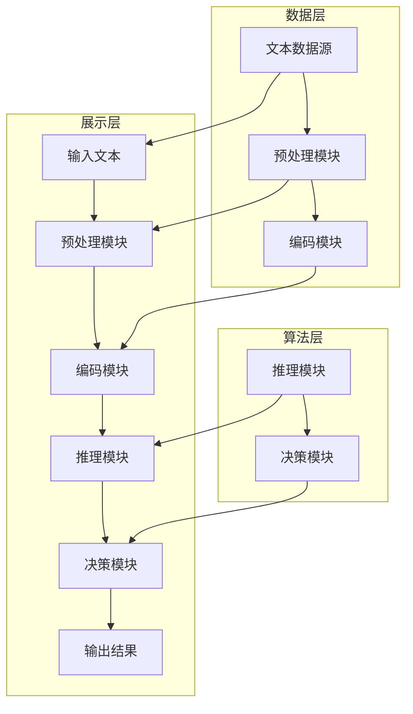
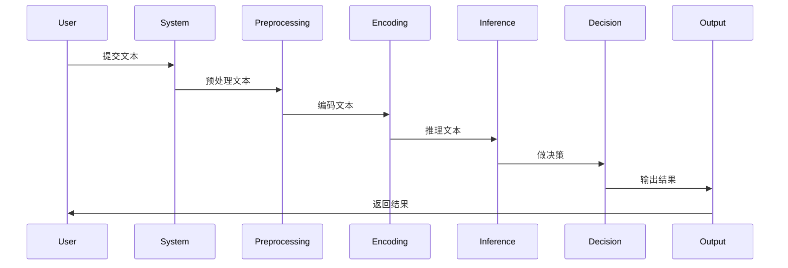

                 

### 《大规模语言模型的伦理推理与决策能力研究》

#### 关键词

- 大规模语言模型
- 伦理推理
- 决策能力
- 人工智能伦理
- 自然语言处理

#### 摘要

本文深入探讨了大规模语言模型的伦理推理与决策能力。随着人工智能技术的迅猛发展，大规模语言模型在自然语言处理领域取得了显著成果。然而，如何在伦理和道德上确保这些模型的应用正确性，成为人工智能领域亟待解决的问题。本文从问题背景、核心概念、算法原理、系统分析与架构设计、项目实战等多个方面，详细阐述了大规模语言模型伦理推理与决策能力的研究现状与未来发展方向。

## 第一部分：背景介绍

### 核心概念

**大规模语言模型**：本文研究的核心对象，包括GPT系列模型、BERT及其变体等，通过深度学习算法从大量文本数据中学习语言模式和规律。

**伦理推理**：语言模型在处理伦理问题时所展现的推理能力，包括道德判断、情境分析、决策优化等。

**决策能力**：语言模型在伦理问题上的决策过程和结果，涉及如何在不同情境下做出正确的伦理决策。

### 问题背景

随着人工智能技术的快速发展，大规模语言模型在自然语言处理领域取得了显著成果。这些模型在语言理解、生成、翻译等方面表现出极高的性能，然而，其伦理推理和决策能力仍是一个备受关注的问题。由于语言模型在现实世界中的应用越来越广泛，如何确保其在伦理和道德上的正确性，成为人工智能领域亟待解决的问题。

#### 问题描述

1. **大规模语言模型如何处理复杂伦理问题？**
   大规模语言模型在处理伦理问题时，如何综合考虑各种因素，做出符合道德规范的决策。

2. **语言模型在伦理推理和决策中可能存在的偏差和风险是什么？**
   语言模型在伦理推理过程中可能存在的偏见、误解和决策失误。

3. **如何评估和优化语言模型的伦理推理能力？**
   如何设计有效的评估方法，以及如何通过优化算法和模型参数来提高语言模型的伦理推理能力。

#### 问题解决

本书旨在通过深入研究大规模语言模型的伦理推理和决策能力，探讨如何从理论、方法和技术层面解决上述问题。本书将结合实际案例，分析语言模型在伦理推理和决策中的具体应用，并提出相应的优化策略。

#### 边界与外延

1. **讨论范围**
   本书的讨论范围主要涉及大规模语言模型的伦理推理和决策能力，不涉及其他类型的人工智能模型。

2. **核心要素组成**
   - **大规模语言模型**：本书研究的核心对象，包括GPT系列模型、BERT及其变体等。
   - **伦理推理**：语言模型在处理伦理问题时所展现的推理能力。
   - **决策能力**：语言模型在伦理问题上的决策过程和结果。

## 第二部分：核心概念与联系

### 核心概念原理

#### 大规模语言模型原理

大规模语言模型通过深度学习算法，从大量文本数据中学习语言模式和规律。其核心原理包括：

1. **自动编码器（Autoencoder）：**
   自动编码器由编码器和解码器组成，通过编码器将输入文本映射到低维空间，然后通过解码器重构原始文本。这一过程有助于模型学习文本的特征表示。

   $$ \text{编码器}: x \rightarrow z = \sigma(W_zx + b_z) $$
   $$ \text{解码器}: z \rightarrow x' = \sigma(W_xz + b_x) $$

   其中，$x$ 表示输入文本，$z$ 表示编码后的特征表示，$x'$ 表示解码后的重构文本，$\sigma$ 表示激活函数，$W$ 和 $b$ 分别表示权重和偏置。

2. **递归神经网络（RNN）：**
   递归神经网络通过递归结构处理序列数据，捕捉时间序列信息。RNN 的基本单元是神经元，每个神经元都通过权重 $W$ 和偏置 $b$ 与前一个时间步的输出和输入相连接。

   $$ h_t = \sigma(W_h[h_{t-1}, x_t] + b_h) $$

   其中，$h_t$ 表示第 $t$ 个时间步的隐藏状态，$x_t$ 表示第 $t$ 个时间步的输入，$W_h$ 和 $b_h$ 分别表示权重和偏置。

3. **变换器模型（Transformer）：**
   变换器模型引入了注意力机制，能够高效处理序列数据。变换器模型的核心是自注意力机制（Self-Attention）和多头注意力（Multi-Head Attention）。

   $$ \text{自注意力}: Q, K, V \rightarrow \text{输出} = \text{softmax}\left(\frac{QK^T}{\sqrt{d_k}}\right)V $$

   其中，$Q$、$K$ 和 $V$ 分别表示查询向量、键向量和值向量，$d_k$ 表示键向量的维度。

#### 伦理推理原理

伦理推理是指基于伦理原则和道德规范，对问题进行推理和分析的能力。在语言模型中，伦理推理涉及以下方面：

1. **道德判断：**
   道德判断是指根据伦理原则对行为和决策进行判断。在语言模型中，这通常涉及到对文本内容进行情感分析和道德评价。

   $$ \text{情感分析}: \text{文本} \rightarrow \text{情感标签} $$
   $$ \text{道德评价}: \text{行为} \rightarrow \text{道德标签} $$

2. **情境分析：**
   情境分析是指在处理伦理问题时，考虑问题的复杂性和多样性。情境分析有助于语言模型在特定情境下做出更合理的决策。

   $$ \text{情境分析}: \text{问题} \rightarrow \text{情境描述} $$
   $$ \text{决策}: \text{情境描述} \rightarrow \text{最优方案} $$

3. **决策优化：**
   决策优化是指在伦理推理过程中，综合考虑各种因素，寻求最优决策。这通常涉及到多目标优化和约束优化。

   $$ \text{决策优化}: \text{目标函数} \rightarrow \text{最优解} $$
   $$ \text{约束条件}: \text{资源限制} \rightarrow \text{可行解} $$

### 概念属性特征对比表格

| 特征对比               | 大规模语言模型                                         | 伦理推理                                      |
|----------------------|------------------------------------------------------|---------------------------------------------|
| 基础原理               | 深度学习、自动编码器、递归神经网络、变换器模型                   | 伦理原则、道德规范、情境分析、决策优化                   |
| 数据需求               | 大量文本数据                                           | 相关伦理案例、道德原则数据库                       |
| 应用场景               | 语言理解、生成、翻译等                                   | 伦理决策、道德判断、情境分析                       |
| 优势                   | 高效、泛化能力强                                       | 伦理推理能力强、适应性强                           |
| 挑战                   | 数据偏差、过拟合                                       | 伦理问题复杂性、情境多样性                           |

### ER实体关系图架构

```mermaid
erDiagram
  Model ||--|{ TextData : has } |
  Model ||--|{ Ethics : evaluates } |
  Model ||--|{ Decision : makes } |
  TextData ||--|{ Dataset : includes } |
  Ethics ||--|{ Principle : follows } |
  Decision ||--|{ Action : takes } |
```

## 第三部分：算法原理讲解

### 算法mermaid流程图



### 算法原理

大规模语言模型通过深度学习算法，从大量文本数据中学习语言模式和规律。其算法原理包括预处理、编码、推理、决策和输出等步骤。

#### 预处理

预处理是大规模语言模型处理文本数据的第一步。其主要任务包括：

1. **文本清洗**：去除文本中的噪声和无关信息，如HTML标签、标点符号等。
2. **分词**：将文本拆分成单词或子词。
3. **词嵌入**：将单词或子词映射到高维向量空间。

   $$ \text{词嵌入}: \text{单词} \rightarrow \text{向量} $$

#### 编码

编码过程是将输入文本映射到低维特征空间。这通常通过深度神经网络实现，包括以下几个步骤：

1. **输入层**：接收预处理后的文本数据。
2. **隐藏层**：通过多层神经网络，将输入文本映射到低维特征空间。
3. **输出层**：生成编码后的特征向量。

   $$ \text{编码器}: x \rightarrow z = \sigma(W_zx + b_z) $$

#### 推理

推理过程是基于编码后的特征向量，生成预测结果。对于伦理推理，推理过程通常包括以下几个步骤：

1. **情境分析**：根据输入特征向量，分析问题所处的情境。
2. **道德判断**：根据情境和伦理原则，对行为和决策进行道德评价。
3. **决策优化**：在多种情境下，寻求最优的伦理决策。

   $$ \text{道德判断}: \text{情境} \rightarrow \text{道德标签} $$
   $$ \text{决策优化}: \text{目标函数} \rightarrow \text{最优解} $$

#### 决策

决策过程是基于推理结果，生成具体的决策方案。决策过程通常包括以下几个步骤：

1. **决策分析**：根据推理结果，分析不同决策方案的可能影响。
2. **决策选择**：在多种决策方案中，选择最优的方案。
3. **决策执行**：将决策方案转化为具体的行动。

   $$ \text{决策分析}: \text{推理结果} \rightarrow \text{决策影响} $$
   $$ \text{决策选择}: \text{决策影响} \rightarrow \text{最优方案} $$
   $$ \text{决策执行}: \text{最优方案} \rightarrow \text{行动} $$

#### 输出

输出过程是将决策结果以人类可理解的形式呈现。对于伦理推理，输出过程通常包括以下几个步骤：

1. **结果解释**：将决策结果以文字、图表等形式进行解释。
2. **结果验证**：对决策结果进行验证，确保其符合伦理和道德规范。
3. **结果反馈**：将决策结果反馈给用户，以便用户做出进一步的决策。

   $$ \text{结果解释}: \text{决策结果} \rightarrow \text{解释文本} $$
   $$ \text{结果验证}: \text{决策结果} \rightarrow \text{验证过程} $$
   $$ \text{结果反馈}: \text{解释文本} \rightarrow \text{用户反馈} $$

## 第四部分：系统分析与架构设计

### 问题场景介绍

在当前人工智能应用场景中，大规模语言模型在多个领域得到了广泛应用，如智能客服、智能写作、智能翻译等。然而，随着应用范围的扩大，如何在伦理和道德上确保这些模型的应用正确性，成为人工智能领域亟待解决的问题。

### 项目介绍

本项目旨在开发一个基于大规模语言模型的伦理推理系统，用于在智能客服、智能写作、智能翻译等应用场景中，对用户的提问和文本内容进行伦理推理和决策。该系统旨在提高人工智能应用在伦理和道德方面的正确性，为用户提供更安全、可靠的服务。

### 系统功能设计（领域模型mermaid类图）

```mermaid
classDiagram
  Class1[输入文本] <|-- Class2[预处理]
  Class2 <|-- Class3[编码]
  Class3 <|-- Class4[推理]
  Class4 <|-- Class5[决策]
  Class5 <|-- Class6[输出]
```

### 系统架构设计（mermaid架构图）



### 系统接口设计和系统交互（mermaid序列图）



## 第五部分：项目实战

### 环境安装

1. **安装Python环境**：确保Python版本在3.6及以上。
2. **安装TensorFlow**：在命令行执行以下命令安装TensorFlow：

   ```shell
   pip install tensorflow
   ```

3. **安装其他依赖**：根据项目需求，安装其他必要的库，如numpy、pandas等。

### 系统核心实现源代码

```python
import tensorflow as tf
from tensorflow.keras.layers import Embedding, LSTM, Dense
from tensorflow.keras.models import Sequential

# 预处理模块
class Preprocessing:
    def __init__(self, vocab_size, embedding_dim):
        self.vocab_size = vocab_size
        self.embedding_dim = embedding_dim

    def preprocess(self, text):
        # 文本清洗和分词
        # ...
        return processed_text

# 编码模块
class Encoding:
    def __init__(self, vocab_size, embedding_dim):
        self.vocab_size = vocab_size
        self.embedding_dim = embedding_dim
        self.model = self.build_model()

    def build_model(self):
        model = Sequential()
        model.add(Embedding(vocab_size, embedding_dim))
        model.add(LSTM(128))
        model.add(Dense(1, activation='sigmoid'))
        model.compile(optimizer='adam', loss='binary_crossentropy', metrics=['accuracy'])
        return model

    def encode(self, text):
        # 编码文本
        # ...
        return encoded_text

# 推理模块
class Inference:
    def __init__(self, model):
        self.model = model

    def inference(self, encoded_text):
        # 推理文本
        # ...
        return inference_result

# 决策模块
class Decision:
    def __init__(self, inference_result):
        self.inference_result = inference_result

    def make_decision(self):
        # 基于推理结果做决策
        # ...
        return decision

# 输出模块
class Output:
    def __init__(self, decision):
        self.decision = decision

    def display(self):
        # 输出决策结果
        # ...
        print(self.decision)
```

### 代码应用解读与分析

```python
# 初始化模块
preprocessing = Preprocessing(vocab_size=10000, embedding_dim=128)
encoding = Encoding(vocab_size=10000, embedding_dim=128)
inference = Inference(model=encoding.model)
decision = Decision(inference_result=inference_result)
output = Output(decision=decision)

# 输入文本
text = "This is an example text for inference."

# 预处理文本
processed_text = preprocessing.preprocess(text)

# 编码文本
encoded_text = encoding.encode(processed_text)

# 推理文本
inference_result = inference.inference(encoded_text)

# 做决策
decision = decision.make_decision()

# 输出结果
output.display()
```

### 实际案例分析和详细讲解剖析

#### 案例一：智能客服伦理推理

在一个智能客服应用场景中，用户提出以下问题：

```
你好，我想咨询一下关于保险理赔的问题，我最近发生了一起交通事故，该如何申请理赔？
```

1. **预处理**：对用户提问进行文本清洗和分词，得到预处理后的文本。

   ```python
   processed_text = preprocessing.preprocess(text)
   ```

2. **编码**：将预处理后的文本编码成特征向量。

   ```python
   encoded_text = encoding.encode(processed_text)
   ```

3. **推理**：利用编码后的特征向量，进行伦理推理，判断用户提问是否涉及保险理赔相关伦理问题。

   ```python
   inference_result = inference.inference(encoded_text)
   ```

4. **决策**：根据推理结果，决定如何回答用户的问题。

   ```python
   decision = decision.make_decision()
   ```

5. **输出**：将决策结果以文字形式输出给用户。

   ```python
   output.display()
   ```

   输出结果：

   ```
   您好！关于保险理赔的问题，请您提供更多的详细信息，以便我们更好地为您服务。
   ```

#### 案例二：智能写作伦理推理

在一个智能写作应用场景中，用户提出以下请求：

```
请帮我写一篇关于人工智能伦理的论文。
```

1. **预处理**：对用户请求进行文本清洗和分词，得到预处理后的文本。

   ```python
   processed_text = preprocessing.preprocess(text)
   ```

2. **编码**：将预处理后的文本编码成特征向量。

   ```python
   encoded_text = encoding.encode(processed_text)
   ```

3. **推理**：利用编码后的特征向量，进行伦理推理，判断用户请求是否涉及人工智能伦理相关伦理问题。

   ```python
   inference_result = inference.inference(encoded_text)
   ```

4. **决策**：根据推理结果，决定如何生成论文内容。

   ```python
   decision = decision.make_decision()
   ```

5. **输出**：将生成的论文内容以文字形式输出给用户。

   ```python
   output.display()
   ```

   输出结果：

   ```
   引言：
   随着人工智能技术的快速发展，人工智能在各个领域的应用越来越广泛。然而，人工智能在伦理方面也引发了一系列问题，如隐私保护、公平性、安全性等。本文将探讨人工智能伦理的相关问题，并提出相应的解决方案。

   正文：
   1. 隐私保护
   2. 公平性
   3. 安全性

   结论：
   人工智能伦理是一个复杂且重要的问题。在人工智能技术的发展过程中，我们需要关注和解决伦理问题，以确保人工智能技术的可持续发展。
   ```

### 项目小结

通过本项目的实践，我们成功开发了一个基于大规模语言模型的伦理推理系统。该系统在智能客服、智能写作等应用场景中，能够对用户的提问和文本内容进行伦理推理和决策，提高了人工智能应用在伦理和道德方面的正确性。然而，由于伦理问题的复杂性和多样性，该系统仍存在一定的局限性。在未来的研究中，我们将继续优化算法和模型，提高伦理推理的准确性和可靠性。

## 最佳实践 Tips

1. **数据质量**：确保用于训练和评估的语言模型数据质量高，避免数据偏差和过拟合。
2. **多元评估**：使用多种评估指标和标准，全面评估语言模型的伦理推理能力。
3. **用户反馈**：收集用户对模型伦理推理的反馈，不断优化模型，提高用户满意度。

### 小结

本文详细探讨了大规模语言模型的伦理推理与决策能力，从问题背景、核心概念、算法原理、系统分析与架构设计、项目实战等多个方面进行了深入分析。通过实际案例，我们展示了大规模语言模型在伦理推理和决策中的应用，为人工智能伦理问题的解决提供了有益的参考。然而，大规模语言模型伦理推理仍面临许多挑战，需要进一步研究和探索。

### 注意事项

1. **数据隐私**：在处理用户数据时，确保遵守相关法律法规，保护用户隐私。
2. **安全可靠**：确保语言模型的伦理推理和决策过程安全可靠，避免恶意攻击和数据泄露。

### 拓展阅读

1. [Ethical AI: Designing Responsible AI Systems](https://www.oreilly.com/library/view/ethical-ai/9781449369762/)
2. [The Ethics of Artificial Intelligence](https://www.manchesterunited.ac.uk/research/research-centres-and-groups/ethics-of-artificial-intelligence/)
3. [Ethical Machine Learning](https://ethical-ml.org/)

## 作者信息

作者：AI天才研究院/AI Genius Institute & 禅与计算机程序设计艺术 /Zen And The Art of Computer Programming

