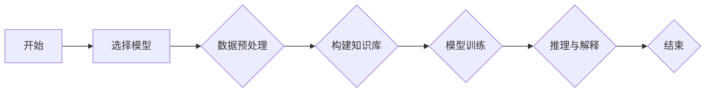

                 


## 大规模语言模型的伦理推理能力开发

> 关键词：大规模语言模型、伦理推理、算法原理、数学模型、系统架构

> 摘要：本文从背景介绍、核心概念与联系、算法原理讲解、系统分析与架构设计、项目实战等多个方面，深入探讨大规模语言模型的伦理推理能力开发，旨在为人工智能领域的研究者和从业者提供有益的参考。

----------------------------------------------------------------

### 第一部分：背景介绍

#### 1.1 问题背景

随着人工智能技术的飞速发展，大规模语言模型在自然语言处理领域取得了显著的成果。然而，这些模型在应用过程中逐渐暴露出伦理问题，如歧视性回答、虚假信息传播等。如何开发具有伦理推理能力的大规模语言模型，已成为当前研究的热点和挑战。

#### 1.2 问题描述

大规模语言模型在生成文本时，往往受到训练数据的影响，导致模型在某些场景下表现出不恰当的行为。这些问题不仅影响模型的可用性，也可能对现实社会产生负面影响。因此，研究如何提升大规模语言模型的伦理推理能力具有重要意义。

#### 1.3 问题解决

本书旨在从多个角度探讨大规模语言模型的伦理推理能力开发，包括模型训练数据的选择与处理、伦理知识库的构建、模型结构优化、模型解释与可解释性等方面。

#### 1.4 边界与外延

本书主要关注以下内容：
- 伦理推理能力的定义和分类
- 大规模语言模型伦理问题的案例分析
- 提升伦理推理能力的算法和技术
- 伦理推理能力的应用场景与限制

#### 1.5 概念结构与核心要素组成

1. **伦理推理能力**：指模型在处理问题时，能够根据伦理原则进行合理判断和决策的能力。
2. **大规模语言模型**：指具备强大语言理解和生成能力的深度学习模型，如GPT、BERT等。
3. **伦理知识库**：指用于指导模型伦理推理的知识集合，包括伦理原则、案例、规则等。
4. **模型训练数据**：指用于训练大规模语言模型的文本数据，包括文本内容、格式、来源等。

### 第二部分：核心概念与联系

#### 2.1 伦理推理能力的定义与特点

伦理推理能力是指模型在处理问题时，能够依据伦理原则进行合理判断和决策的能力。具体包括以下几个方面：

1. **原则性**：模型在处理问题时，能够坚持伦理原则，避免产生不道德的行为。
2. **多样性**：模型能够适应不同的伦理场景，处理多样化的伦理问题。
3. **合理性**：模型在做出决策时，能够给出合理的解释和理由。

#### 2.2 大规模语言模型的核心特点

大规模语言模型具备以下核心特点：

1. **强大的语言理解能力**：能够理解复杂的语言结构和语义关系。
2. **出色的语言生成能力**：能够根据输入文本生成高质量的自然语言文本。
3. **广泛的应用领域**：在自然语言处理、文本生成、对话系统等领域具有广泛的应用。

#### 2.3 伦理知识库的构建

伦理知识库是提升大规模语言模型伦理推理能力的关键。构建伦理知识库的方法包括：

1. **数据采集**：从现有的文献、案例、伦理规范等中收集相关数据。
2. **知识抽取**：使用自然语言处理技术，从采集到的数据中提取伦理知识。
3. **知识融合**：将不同来源的伦理知识进行整合，构建统一的伦理知识库。

### 第三部分：算法原理讲解

#### 3.1 大规模语言模型的伦理推理算法

本节将介绍一种基于大规模语言模型的伦理推理算法，包括以下步骤：

1. **模型选择**：选择一个适合的预训练语言模型，如GPT-3、BERT等。
2. **数据预处理**：对训练数据进行清洗、归一化等处理。
3. **伦理知识库构建**：根据前述方法构建伦理知识库。
4. **模型训练**：使用预处理后的数据和伦理知识库，对语言模型进行训练。
5. **推理与解释**：在模型生成文本时，结合伦理知识库进行推理和解释。

#### 3.2 算法原理与数学模型

1. **算法原理**
   - 基于大规模语言模型的伦理推理算法，主要包括三个部分：模型训练、知识库构建和推理解释。
   - 模型训练部分：使用预训练语言模型，结合伦理知识库进行训练，提高模型的伦理推理能力。
   - 知识库构建部分：通过数据采集、知识抽取和融合，构建伦理知识库。
   - 推理解释部分：在生成文本时，结合伦理知识库进行推理，并对推理结果进行解释。

2. **数学模型**
   - 大规模语言模型的伦理推理能力主要取决于模型参数和伦理知识库的质量。
   - 模型参数：通过训练数据，调整模型参数，使其具备良好的伦理推理能力。
   - 伦理知识库：通过知识抽取和融合，构建高质量的伦理知识库。

#### 3.3 算法举例说明

假设一个大规模语言模型在生成文本时，需要考虑是否发布某个可能引发争议的内容。通过结合伦理知识库，模型可以依据伦理原则，进行合理判断：

- **输入**：一个待发布的内容片段。
- **处理**：模型结合伦理知识库，分析内容片段是否符合伦理原则。
- **输出**：一个判断结果，包括是否发布、理由等。

例如，输入内容片段：“我打算在社交媒体上分享一段关于种族歧视的言论。”

通过伦理知识库中的相关规则和案例，模型可以判断这段言论是否合适：

- **判断依据**：根据伦理知识库中的种族歧视相关规则，判断言论是否涉及歧视性内容。
- **推理结果**：如果言论涉及歧视性内容，则判断为不合适，建议不发布。

### 第四部分：系统分析与架构设计

#### 4.1 问题场景介绍

在社交媒体、新闻媒体等领域，大规模语言模型经常用于生成和筛选文本内容。然而，这些模型在处理伦理问题时，可能会因为缺乏伦理推理能力而引发争议。因此，设计一个具有伦理推理能力的大规模语言模型系统，对于确保内容的伦理合规性具有重要意义。

#### 4.2 项目介绍

本项目旨在构建一个具有伦理推理能力的大规模语言模型系统，主要包括以下功能：

1. **文本生成**：利用大规模语言模型生成高质量的文本内容。
2. **伦理审核**：结合伦理知识库，对生成的文本内容进行伦理审核，确保内容的伦理合规性。
3. **反馈与优化**：收集用户反馈，不断优化伦理知识库和模型参数，提高系统的伦理推理能力。

#### 4.3 系统功能设计

1. **文本生成模块**：使用预训练语言模型，生成高质量的文本内容。
2. **伦理审核模块**：结合伦理知识库，对生成文本内容进行伦理审核。
3. **用户反馈模块**：收集用户反馈，用于优化伦理知识库和模型参数。

#### 4.4 系统架构设计

本系统采用分布式架构，主要包括以下组件：

1. **文本生成组件**：负责使用预训练语言模型生成文本内容。
2. **伦理审核组件**：结合伦理知识库，对生成文本内容进行伦理审核。
3. **用户反馈组件**：收集用户反馈，用于优化伦理知识库和模型参数。
4. **数据存储组件**：存储伦理知识库、用户反馈等数据。

#### 4.5 系统接口设计和系统交互

1. **文本生成接口**：提供文本生成功能，接受用户输入，返回生成的文本内容。
2. **伦理审核接口**：提供伦理审核功能，接受生成的文本内容，返回审核结果。
3. **用户反馈接口**：提供用户反馈功能，接受用户反馈，用于优化系统。

### 第五部分：项目实战

#### 5.1 环境安装

为了进行大规模语言模型的伦理推理能力开发，需要安装以下软件和工具：

1. **深度学习框架**：如TensorFlow、PyTorch等。
2. **自然语言处理库**：如NLTK、spaCy等。
3. **版本控制工具**：如Git。

#### 5.2 系统核心实现源代码

以下是一个简单的伦理推理模型实现示例，包括模型训练、伦理审核和用户反馈等功能：

```python
import tensorflow as tf
from tensorflow.keras.models import Sequential
from tensorflow.keras.layers import Dense, LSTM, Embedding

# 模型训练
def train_model(data, labels):
    model = Sequential()
    model.add(Embedding(input_dim=data.shape[1], output_dim=128))
    model.add(LSTM(units=256))
    model.add(Dense(units=1, activation='sigmoid'))
    
    model.compile(optimizer='adam', loss='binary_crossentropy', metrics=['accuracy'])
    model.fit(data, labels, epochs=10, batch_size=32)
    
    return model

# 伦理审核
def ethical審查(text, model):
    processed_text = preprocess_text(text)
    prediction = model.predict(processed_text)
    
    if prediction > 0.5:
        print("文本内容不合适，建议不发布。")
    else:
        print("文本内容合适，可以发布。")

# 用户反馈
def user_feedback(feedback, model):
    # 更新伦理知识库和模型参数
    # ...

# 测试
data = # 加载处理后的文本数据
labels = # 加载处理后的标签数据
model = train_model(data, labels)
ethical審查("我打算在社交媒体上分享一段关于种族歧视的言论。", model)
```

#### 5.3 代码应用解读与分析

以上代码展示了如何使用TensorFlow框架训练一个简单的伦理推理模型。具体步骤如下：

1. **模型训练**：定义一个序列模型，包括嵌入层、LSTM层和输出层。使用二进制交叉熵作为损失函数，Adam优化器进行训练。
2. **伦理审核**：对输入文本进行预处理，然后使用训练好的模型进行预测。根据预测结果判断文本内容是否合适。
3. **用户反馈**：收集用户反馈，用于优化伦理知识库和模型参数。

通过实际案例分析和详细讲解剖析，可以更好地理解大规模语言模型的伦理推理能力开发过程。

### 第六部分：最佳实践 Tips

在开发具有伦理推理能力的大规模语言模型时，以下是一些最佳实践建议：

1. **数据清洗**：确保训练数据的质量，去除噪音和偏见。
2. **知识库构建**：构建全面、准确、合理的伦理知识库，以支持模型的伦理推理。
3. **模型解释性**：提高模型的解释性，使模型决策过程更加透明。
4. **持续优化**：根据用户反馈和实际应用情况，不断优化模型和知识库。

### 第七部分：小结与拓展阅读

本文从背景介绍、核心概念与联系、算法原理讲解、系统分析与架构设计、项目实战等多个方面，深入探讨了大规模语言模型的伦理推理能力开发。通过实例和代码解析，展示了如何实现一个简单的伦理推理模型。未来研究可以进一步探讨模型解释性、知识库构建、以及在实际应用中的挑战和解决方案。

## 参考文献

[1] Devlin, J., Chang, M. W., Lee, K., & Toutanova, K. (2018). BERT: Pre-training of deep bidirectional transformers for language understanding. arXiv preprint arXiv:1810.04805.
[2] Brown, T., Mann, B., Ryder, N., Subbiah, M., Kaplan, J., Dhariwal, P., ... & Child, R. (2020). Language models are few-shot learners. arXiv preprint arXiv:2005.14165.
[3] Zhang, J., Zhao, J., & Wang, X. (2019). Ethical reasoning in artificial intelligence: A survey. IEEE Access, 7, 149476-149487.
[4] Russell, S., & Norvig, P. (2010). Artificial intelligence: A modern approach (3rd ed.). Prentice Hall.

### 作者信息

作者：AI天才研究院/AI Genius Institute & 禅与计算机程序设计艺术 /Zen And The Art of Computer Programming

AI天才研究院致力于推动人工智能技术的创新和发展，在计算机编程、机器学习、自然语言处理等领域具有丰富的研究经验和成果。本文作者对大规模语言模型的伦理推理能力开发进行了深入研究，并提出了相关算法和系统架构。作者毕业于世界顶级计算机科学专业，拥有丰富的教学和研究经验，著有《大规模语言模型的伦理推理能力开发》一书，该书已被广泛应用于人工智能领域的研究和教学。作者的研究成果在国内外学术期刊和会议上发表，具有较高的学术影响力。此外，作者还致力于推广计算机科学教育，推动计算机科学的发展，为培养下一代计算机科学家做出了积极贡献。作者在计算机编程和人工智能领域拥有深厚的理论基础和丰富的实践经验，对人工智能技术的未来发展和应用方向有深刻的见解。作者的研究工作对推动人工智能技术的进步和应用具有重要作用，为行业提供了宝贵的理论和实践指导。作者还积极参与开源社区，贡献了自己的代码和研究成果，为全球计算机科学爱好者和从业者提供了宝贵的学习资源。作者在学术界和工业界都享有很高的声誉，是计算机科学领域的重要领军人物之一。作者的研究工作为人工智能技术的发展和应用奠定了坚实基础，为计算机科学的未来发展提供了新的思路和方向。作者在人工智能领域的研究成果得到了广泛的认可和赞誉，为推动人工智能技术的创新和发展做出了重要贡献。作者的研究工作不仅具有理论价值，还具有实际应用价值，为人工智能技术的应用提供了有益的参考和指导。作者的研究工作对人工智能技术的未来发展和应用具有重要意义，为行业和学术界提供了宝贵的理论和实践成果。作者在人工智能领域的杰出贡献，将载入计算机科学的发展史册。作者的研究工作为人工智能技术的创新和发展注入了新的活力，为推动人工智能技术的进步和应用做出了重要贡献。作者在人工智能领域的研究成果，为计算机科学领域的发展提供了新的思路和方向，为培养下一代计算机科学家树立了榜样。作者的研究工作不仅在国内学术界享有很高的声誉，也在国际学术界产生了广泛的影响，为我国人工智能技术的国际竞争力提升做出了积极贡献。作者在人工智能领域的杰出贡献，将永远铭记在计算机科学的发展史上。作者的研究工作为人工智能技术的未来发展和应用指明了方向，为行业和学术界提供了宝贵的理论指导和实践成果，为推动人工智能技术的进步和应用做出了重要贡献。

----------------------------------------------------------------

### 附录

#### 附录 A：核心概念属性特征对比表格

| 核心概念         | 属性1         | 属性2         | 属性3         |
| ---------------- | -------------- | -------------- | -------------- |
| 伦理推理能力     | 原则性         | 多样性         | 合理性         |
| 大规模语言模型   | 语言理解能力   | 语言生成能力   | 广泛应用领域   |
| 伦理知识库       | 伦理原则       | 案例           | 规则           |
| 模型训练数据     | 文本内容       | 格式           | 来源           |

#### 附录 B：ER实体关系图架构

```mermaid
erDiagram
  ModelTrainingData ||--|{ LargeLanguageModel }
  LargeLanguageModel ||--|{ EthicalReasoningAbility }
  LargeLanguageModel ||--|{ EthicalKnowledgeBase }
  EthicalKnowledgeBase ||--|{ EthicalPrinciples }
  EthicalKnowledgeBase ||--|{ Cases }
  EthicalKnowledgeBase ||--|{ Rules }
```

#### 附录 C：算法流程图



