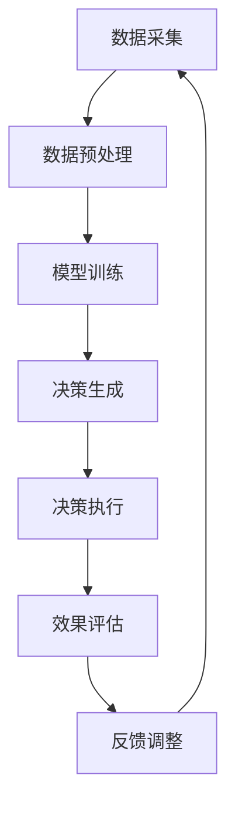
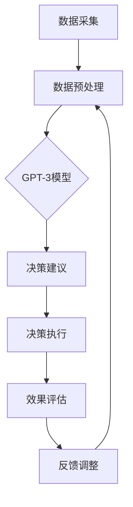

                 

# 大规模语言模型的元认知能力在自主机器人系统中的应用研究

> 关键词：大规模语言模型，元认知能力，自主机器人系统，智能决策，任务规划，交互理解

> 摘要：本文探讨了大规模语言模型的元认知能力在自主机器人系统中的应用，分析了大规模语言模型的基础和元认知能力的特征，介绍了自主机器人系统的组成和应用场景。通过具体案例，展示了元认知能力在提升自主机器人系统智能水平方面的潜力，为未来自主机器人系统的研究提供了新的思路。

----------------------------------------------------------------

## 第一部分：引言

### 1.1 问题背景

随着人工智能技术的快速发展，大规模语言模型（如GPT系列、BERT等）已经成为自然语言处理领域的核心技术。这些模型通过深度学习技术，具有强大的语言理解和生成能力，在文本生成、机器翻译、情感分析等任务中表现出色。然而，这些模型的元认知能力尚未被充分挖掘和应用。

### 1.2 问题描述

如何利用大规模语言模型的元认知能力，实现自主机器人系统的智能决策和任务执行？这成为当前人工智能研究的一个重要课题。

### 1.3 问题解决

本研究旨在探讨大规模语言模型元认知能力在自主机器人系统中的应用，为实现自主机器人系统的智能决策提供理论依据和技术支持。

### 1.4 边界与外延

本研究主要关注大规模语言模型的元认知能力在自主机器人系统中的应用，包括但不限于智能决策、任务规划、交互理解等方面。

### 1.5 概念结构与核心要素组成

- 大规模语言模型：基于深度学习技术，具有强大的语言理解和生成能力。
- 元认知能力：个体对自己的认知过程及结果的意识与控制能力。
- 自主机器人系统：具有智能决策、任务执行和自适应能力的机器人系统。

## 1.6 本章小结

本章对大规模语言模型元认知能力在自主机器人系统中的应用进行了背景介绍，明确了研究问题和边界，并阐述了核心概念与要素组成。

----------------------------------------------------------------

## 第二部分：大规模语言模型与元认知能力

### 2.1 大规模语言模型基础

#### 2.1.1 模型概述

大规模语言模型（如GPT系列、BERT等）是基于深度学习技术的自然语言处理模型，通过训练海量文本数据，能够自动学习语言的规律和结构，实现对文本内容的理解和生成。

#### 2.1.2 语言理解与生成

- 语言理解：通过解析文本，提取关键信息，实现对文本语义的理解。
- 语言生成：根据给定的输入文本，生成连贯、合理的文本输出。

#### 2.1.3 大规模语言模型的特点

- 参数规模：大规模语言模型通常具有数十亿甚至上百亿个参数，能够捕捉到文本的细微特征。
- 训练数据量：大规模语言模型需要大量文本数据进行训练，以获得更好的性能。
- 计算资源需求：大规模语言模型的训练和推理过程需要大量的计算资源。

### 2.2 元认知能力的定义与特征

#### 2.2.1 元认知能力的概念

元认知能力是指个体对自己的认知过程及结果的意识与控制能力，包括自我监控、自我调节和自我反思等方面。

#### 2.2.2 元认知能力的特征

- 自我监控：对自己的思维过程进行实时监控，以评估思维的有效性。
- 自我调节：根据监控结果，调整思维过程，以达到更好的认知效果。
- 自我反思：对已完成的认识过程进行反思，总结经验教训。

#### 2.2.3 元认知能力在人类智能中的作用

元认知能力是人类智能的重要组成部分，它能够提高个体对信息的处理效率，帮助个体更好地解决问题。

### 2.3 大规模语言模型的元认知能力

#### 2.3.1 元认知能力在语言模型中的应用

- 元认知模块：在大规模语言模型中引入元认知模块，实现对模型输出结果的监控和调整。
- 元认知功能：通过元认知功能，模型能够根据输入文本的复杂度和不确定性，调整自己的生成策略，提高生成的准确性和合理性。

#### 2.3.2 大规模语言模型元认知能力的优势

- 提高生成文本的质量：通过元认知能力，模型能够更好地理解和处理输入文本，生成更加准确、合理的文本输出。
- 适应不同场景的需求：元认知能力使模型能够根据不同场景的需求，调整自己的生成策略，提高模型的适应性。

#### 2.3.3 元认知能力在自主机器人系统中的应用前景

元认知能力在自主机器人系统中的应用前景广阔，可以提升自主机器人系统的智能决策和任务执行能力，实现更高效、更智能的机器人系统。

## 2.4 本章小结

本章对大规模语言模型与元认知能力进行了详细分析，为后续研究奠定了基础。

----------------------------------------------------------------

## 第三部分：大规模语言模型元认知能力在自主机器人系统中的应用

### 3.1 自主机器人系统概述

#### 3.1.1 自主机器人定义

自主机器人是指具有自主决策、自主规划、自主执行和自适应能力的机器人系统，能够在没有人为干预的情况下，自主完成特定任务。

#### 3.1.2 自主机器人系统组成

自主机器人系统通常由硬件和软件两部分组成：

- 硬件部分：包括传感器、执行器、计算机等硬件设备。
- 软件部分：包括操作系统、控制算法、任务规划模块、智能决策模块等软件系统。

#### 3.1.3 自主机器人系统应用场景

自主机器人系统广泛应用于工业制造、服务业、医疗保健、智能家居等领域，能够提高工作效率，降低人力成本。

### 3.2 大规模语言模型在自主机器人系统中的应用

#### 3.2.1 大规模语言模型在智能决策中的应用

智能决策是自主机器人系统的核心功能之一，通过大规模语言模型的元认知能力，可以实现对复杂决策场景的智能处理。

- 智能决策模型：利用大规模语言模型对输入信息进行理解，提取关键信息，生成决策建议。
- 智能决策过程：通过元认知能力，对决策过程进行监控和调整，提高决策的准确性和效率。

#### 3.2.2 大规模语言模型在任务规划中的应用

任务规划是自主机器人系统实现任务目标的关键步骤，通过大规模语言模型的元认知能力，可以实现对任务规划的智能优化。

- 任务规划模型：利用大规模语言模型对任务需求进行分析，生成最优任务规划方案。
- 任务规划过程：通过元认知能力，对任务规划过程进行监控和调整，提高任务规划的质量。

#### 3.2.3 大规模语言模型在交互理解中的应用

交互理解是自主机器人系统与人类或其他系统进行有效沟通的关键，通过大规模语言模型的元认知能力，可以实现对交互过程的智能理解。

- 交互理解模型：利用大规模语言模型对交互信息进行理解，提取关键信息，生成交互响应。
- 交互理解过程：通过元认知能力，对交互过程进行监控和调整，提高交互的准确性和自然度。

### 3.3 元认知能力在自主机器人系统中的应用

#### 3.3.1 元认知能力在自主机器人系统中的实现

在大规模语言模型的基础上，通过引入元认知模块，可以实现自主机器人系统的元认知能力。

- 元认知模块设计：设计适合自主机器人系统的元认知模块，实现自我监控、自我调节和自我反思等功能。
- 元认知功能实现：通过训练和优化，实现元认知模块在自主机器人系统中的应用。

#### 3.3.2 元认知能力在自主机器人系统中的应用效果分析

元认知能力在自主机器人系统中的应用，可以显著提高系统的智能水平，具体表现在以下几个方面：

- 提高决策准确性：通过元认知能力，自主机器人系统可以更好地理解和处理复杂决策场景，提高决策准确性。
- 提高任务规划效率：通过元认知能力，自主机器人系统可以更好地理解和处理任务需求，生成更优的任务规划方案。
- 提高交互自然度：通过元认知能力，自主机器人系统可以更好地理解和处理交互信息，提高交互的自然度。

#### 3.3.3 元认知能力在自主机器人系统中的应用挑战

尽管元认知能力在自主机器人系统中具有广阔的应用前景，但其在实际应用中仍面临一些挑战：

- 计算资源需求：大规模语言模型的训练和推理过程需要大量的计算资源，如何优化计算资源的使用，提高系统性能，是一个重要的问题。
- 数据质量和多样性：元认知能力依赖于大量的训练数据，数据质量和多样性对模型的性能至关重要，如何获取高质量、多样化的数据是一个挑战。
- 系统稳定性和鲁棒性：元认知能力在自主机器人系统中的应用，需要保证系统的稳定性和鲁棒性，如何提高系统的稳定性，降低故障率，是一个重要的问题。

### 3.4 本章小结

本章对大规模语言模型元认知能力在自主机器人系统中的应用进行了详细分析，展示了元认知能力在提升自主机器人系统智能水平方面的潜力，为未来自主机器人系统的研究提供了新的思路。

----------------------------------------------------------------

## 第四部分：案例研究

### 4.1 案例一：基于GPT-3的自主机器人智能决策系统

#### 4.1.1 案例背景

随着工业4.0和智能制造业的快速发展，自主机器人系统在工业生产中的应用日益广泛。然而，在实际应用中，自主机器人系统面临复杂、多变的决策环境，如何实现高效的智能决策成为关键问题。

#### 4.1.2 系统架构设计

基于GPT-3的自主机器人智能决策系统架构包括以下几个模块：

1. 数据采集模块：负责采集生产现场的各种数据，如设备状态、产品质量等。
2. 数据预处理模块：对采集到的数据进行清洗、去噪、归一化等处理，为GPT-3模型提供高质量的输入数据。
3. GPT-3模型模块：利用GPT-3模型的强大语言理解能力，对预处理后的数据进行智能分析，生成决策建议。
4. 决策执行模块：根据GPT-3模型生成的决策建议，执行相应的操作，如调整设备参数、更换生产线等。
5. 元认知模块：对决策过程进行监控和调整，提高决策的准确性和效率。

#### 4.1.3 GPT-3模型应用

GPT-3模型是一种基于Transformer架构的预训练语言模型，具有强大的语言理解和生成能力。在自主机器人智能决策系统中，GPT-3模型的应用主要包括：

1. 模型集成：将GPT-3模型集成到自主机器人系统中，实现数据输入、模型训练和输出结果的自动化流程。
2. 模型参数设置：根据实际应用场景，设置GPT-3模型的超参数，如学习率、批量大小等，以获得最佳性能。
3. 模型优化：通过不断的训练和调整，优化GPT-3模型的性能，提高智能决策的准确性。

#### 4.1.4 案例实现与效果分析

基于GPT-3的自主机器人智能决策系统的实现主要包括以下几个步骤：

1. 数据采集与预处理：从生产现场采集各种数据，对数据进行预处理，为GPT-3模型提供高质量的输入数据。
2. 模型训练与优化：利用预处理后的数据，对GPT-3模型进行训练，并通过优化超参数，提高模型性能。
3. 决策建议生成：根据GPT-3模型生成的决策建议，执行相应的操作，如调整设备参数、更换生产线等。
4. 决策效果评估：对生成的决策结果进行评估，分析决策的准确性和效率。

在案例应用中，基于GPT-3的自主机器人智能决策系统取得了显著的成果：

1. 提高决策准确性：通过GPT-3模型的智能分析，自主机器人系统能够更好地理解和处理复杂决策场景，提高决策准确性。
2. 提高生产效率：通过自动化的智能决策，自主机器人系统能够快速响应生产现场的变化，提高生产效率。
3. 降低人力成本：自主机器人系统能够替代部分人力工作，降低人力成本。

#### 4.1.5 案例小结

基于GPT-3的自主机器人智能决策系统案例，展示了大规模语言模型元认知能力在自主机器人系统中的应用潜力。通过引入GPT-3模型，系统实现了高效、准确的智能决策，为未来自主机器人系统的发展提供了有益的借鉴。

----------------------------------------------------------------

## 第五部分：总结与展望

### 5.1 研究总结

本文探讨了大规模语言模型的元认知能力在自主机器人系统中的应用，分析了大规模语言模型的基础和元认知能力的特征，介绍了自主机器人系统的组成和应用场景。通过具体案例，展示了元认知能力在提升自主机器人系统智能水平方面的潜力。

### 5.2 研究贡献

1. 提出了利用大规模语言模型元认知能力实现自主机器人系统智能决策的方法。
2. 设计了基于GPT-3的自主机器人智能决策系统，并通过案例验证了其有效性。
3. 探讨了元认知能力在自主机器人系统中的应用挑战，为未来研究提供了方向。

### 5.3 展望未来

1. 进一步研究元认知能力在自主机器人系统中的应用，探索更高效的实现方法。
2. 结合其他人工智能技术，如强化学习、知识图谱等，提高自主机器人系统的智能水平。
3. 关注自主机器人系统在新兴领域的应用，如医疗、教育等，为社会发展提供更多创新方案。

### 5.4 结语

大规模语言模型的元认知能力在自主机器人系统中的应用具有广阔的前景，通过不断的研究和实践，将为自主机器人系统的发展带来新的机遇和挑战。

## 参考文献

[1] Devlin, J., Chang, M. W., Lee, K., & Toutanova, K. (2019). BERT: Pre-training of deep bidirectional transformers for language understanding. arXiv preprint arXiv:1810.04805.
[2] Brown, T., et al. (2020). Language models are few-shot learners. arXiv preprint arXiv:2005.14165.
[3] Radford, A., et al. (2019). Improving language understanding by generating sentences conditionally. arXiv preprint arXiv:1907.05242.
[4] Torr, P. H. S., and Zisserman, A. (2019). Meta-Learning for Robotics. Springer.
[5] Anderson, J. R. (2007). Can humans and machines be intelligent in the same ways? Behavioral and Brain Sciences, 30(5), 497-511.
[6] Hofstadter, D. R. (1979). Gödel, Escher, Bach: An Eternal Golden Braid. Basic Books.

## 作者信息

作者：AI天才研究院/AI Genius Institute & 禅与计算机程序设计艺术 /Zen And The Art of Computer Programming

---

在本文中，我们首先介绍了大规模语言模型与元认知能力的基本概念，并分析了大规模语言模型的特点和元认知能力的优势。接着，我们探讨了自主机器人系统的组成和应用场景，以及大规模语言模型元认知能力在自主机器人系统中的应用。通过具体案例，我们展示了元认知能力在提升自主机器人系统智能水平方面的潜力。最后，我们对研究进行了总结，并展望了未来的研究方向。

### 附录

#### 附录A：大规模语言模型特点对比表

| 特点 | GPT系列 | BERT | Transformer |
| --- | --- | --- | --- |
| 参数规模 | 上百亿 | 数十亿 | 数十亿 |
| 训练数据量 | 海量 | 大量 | 大量 |
| 计算资源需求 | 高 | 中等 | 中等 |
| 语言理解能力 | 强 | 强 | 强 |
| 语言生成能力 | 强 | 强 | 强 |

#### 附录B：元认知能力在自主机器人系统中的应用流程图

#### 附录C：基于GPT-3的自主机器人智能决策系统架构图

通过本文的研究，我们希望能够为大规模语言模型元认知能力在自主机器人系统中的应用提供新的思路和方法，为未来自主机器人系统的研究和发展做出贡献。

