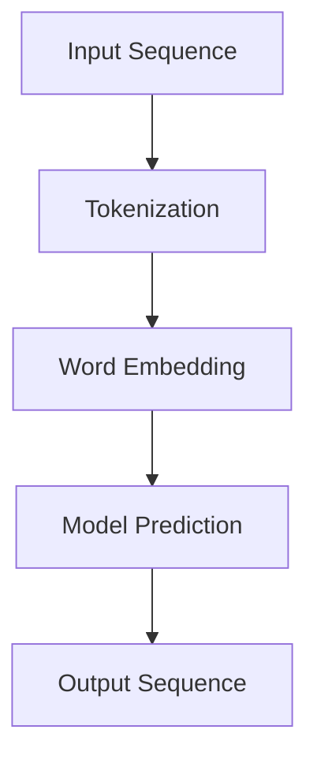
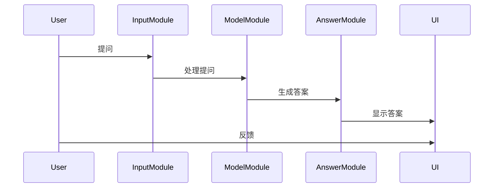

                 

### 第一部分：引言

#### 第1章：大规模语言模型概述

#### 1.1 问题背景与核心概念

##### 问题背景

在当前信息爆炸的时代，语言处理作为一种关键技术，在自然语言理解、问答系统、机器翻译、文本生成等多个领域展现出了巨大的潜力和应用价值。然而，传统语言模型由于受限于训练数据量、模型复杂度和计算资源等因素，很难在处理大规模、多样化文本任务时表现出良好的性能。

##### 问题解决

为了应对这一问题，研究者们提出了大规模语言模型（Large-scale Language Model），通过引入更多的训练数据、更复杂的模型架构以及高效的训练算法，使得模型在处理大规模文本任务时能表现出更高的准确性和泛化能力。

##### 边界与外延

大规模语言模型的研究不仅涵盖了自然语言处理领域，还涉及机器学习、深度学习、神经网络等多个学科。同时，它的影响也在不断扩展，从最初的文本生成和翻译，逐渐渗透到智能助手、对话系统、文本摘要等领域。

##### 概念结构与核心要素组成

1. **训练数据量**：大规模语言模型需要大量的训练数据来学习语言模式，这些数据通常来源于互联网文本、书籍、新闻文章等。
2. **模型架构**：为了提高模型的计算效率和准确度，大规模语言模型采用了复杂的神经网络架构，如Transformer、BERT等。
3. **训练算法**：高效的训练算法能够加速模型训练过程，同时保证模型收敛到最优状态。

### 1.2 大规模语言模型的历史与发展

##### 从传统语言模型到大规模语言模型

传统语言模型主要以统计模型和规则模型为主，如N-gram模型、决策树、隐马尔可夫模型（HMM）等。这些模型虽然在一定程度上能够处理自然语言任务，但受限于计算资源和模型复杂度，很难在处理大规模文本任务时表现出色。

##### 主要里程碑事件

1. **2013年**：Google提出Word2Vec算法，通过将词向量嵌入到高维空间中，实现了对词汇之间语义关系的有效建模。
2. **2017年**：OpenAI发布GPT（Generative Pre-trained Transformer）模型，标志着基于变换器（Transformer）架构的大规模语言模型的兴起。
3. **2018年**：Google发布BERT（Bidirectional Encoder Representations from Transformers）模型，进一步提高了预训练语言模型的性能。
4. **2020年**：OpenAI发布GPT-3模型，拥有超过1750亿个参数，成为当时最先进的语言模型。

### 1.3 大规模语言模型的优势与挑战

##### 大规模语言模型的优势

1. **强大的语言理解能力**：通过预训练和微调，大规模语言模型能够较好地理解文本的语义、上下文和意图。
2. **多语言支持**：大规模语言模型通常支持多种语言，能够在不同的语言环境中进行文本处理和翻译。
3. **高效性**：借助先进的神经网络架构和优化算法，大规模语言模型在计算效率和准确度上表现突出。

##### 大规模语言模型的挑战

1. **计算资源需求**：大规模语言模型需要大量的计算资源和存储空间，这对普通用户和开发者来说可能是一个挑战。
2. **数据隐私**：大规模语言模型在训练过程中需要处理大量的用户数据，如何保护用户隐私成为一个重要问题。
3. **模型解释性**：大规模语言模型往往是一个“黑箱”，其内部工作机制难以解释和理解，这对模型的可信度和可解释性提出了挑战。

#### 总结

大规模语言模型作为自然语言处理领域的重要工具，正日益受到广泛关注。通过对大规模语言模型的问题背景、核心概念、历史发展以及优势与挑战的深入探讨，我们能够更好地理解这一技术，并为其未来的发展提供方向。

### 核心概念与联系

#### 2.1 核心概念原理

1. **语言模型（Language Model）**：语言模型是一种概率模型，用于预测一个词序列的概率分布。它通常基于大量文本数据，通过统计方法或机器学习方法生成。

2. **自监督学习（Self-supervised Learning）**：自监督学习是一种不需要外部标注数据的学习方法，它利用数据中的内在结构来学习。在语言模型中，自监督学习通过预测文本序列中的某个词来训练模型。

3. **对抗性学习（Adversarial Learning）**：对抗性学习是一种通过引入对抗性样本来增强模型鲁棒性的学习方法。在语言模型中，对抗性学习可以用于生成难以为模型识别的文本，从而提高模型的泛化能力。

4. **元学习（Meta-Learning）**：元学习是一种通过学习如何学习的方法，它可以帮助模型在新的任务上快速适应。在语言模型中，元学习可以用于快速调整模型参数，以提高其在不同任务上的表现。

#### 2.2 概念属性特征对比表格

| 概念       | 特点 |
|------------|------|
| 语言模型   | 用于预测文本序列的概率分布，基于大量文本数据训练 |
| 自监督学习 | 无需外部标注数据，利用数据内在结构学习 |
| 对抗性学习 | 引入对抗性样本，增强模型鲁棒性 |
| 元学习     | 学习如何学习，快速适应新任务 |

#### 2.3 ER实体关系图架构

```mermaid
erDiagram
    User ||--|{ TextData }| User
    TextData ||--|{ LanguageModel }| TextData
    LanguageModel ||--|{ Task }| LanguageModel
    Task ||--|{ Prediction }| Task
```

### 总结

通过对比核心概念，我们能够更清晰地理解语言模型、自监督学习、对抗性学习和元学习之间的联系和区别。这些概念共同构成了大规模语言模型的理论基础，为后续的算法原理和实际应用提供了支持。

### 第二部分：大规模语言模型的算法原理

#### 第3章：算法原理讲解

#### 3.1 语言模型的数学模型

语言模型的数学模型通常基于概率分布来描述，其中一个经典的模型是N-gram模型。N-gram模型通过计算前N个词的出现概率来预测下一个词。其数学模型可以表示为：

$$
P(w_n | w_{n-1}, w_{n-2}, \ldots, w_1) = \frac{P(w_n, w_{n-1}, \ldots, w_1)}{P(w_{n-1}, \ldots, w_1)}
$$

其中，$w_n$表示当前词，$w_{n-1}, w_{n-2}, \ldots, w_1$表示前N-1个词。为了简化计算，通常采用最大后验概率估计（Maximum Likelihood Estimation, MLE）来估计概率分布，即：

$$
P(w_n | w_{n-1}, w_{n-2}, \ldots, w_1) \approx \frac{f(w_n, w_{n-1}, \ldots, w_1)}{\sum_{w'} f(w', w_{n-1}, \ldots, w_1)}
$$

其中，$f(w_n, w_{n-1}, \ldots, w_1)$表示词序列的出现频率。

#### 3.2 算法mermaid流程图



#### 3.3 Python源代码示例

```python
import numpy as np
from nltk import ngrams

# 假设文本数据为 sentences = [['I', 'am', 'a', 'robot'], ['I', 'love', 'coding']]

# 计算N-gram概率
def ngram_probability(sentences, n):
    ngram_counts = ngrams(sentences[0], n)
    total_counts = sum([1 for _ in ngrams(sentences[0], n)])
    ngram_probs = {}
    for ngram in ngrams(sentences[0], n):
        ngram_probs[' '.join(ngram)] = sum([1 for sentence in sentences for ngram in ngrams(sentence, n)])/total_counts
    return ngram_probs

# 预测下一个词
def predict_next_word(sentence, n):
    last_n_words = sentence[-n:]
    ngram_probs = ngram_probability([sentence], n)
    next_word_probs = {word: ngram_probs[' '.join(last_n_words + [word])]/ngram_probs[' '.join(last_n_words)] for word in nltk.corpus.words.words()}
    return max(next_word_probs, key=next_word_probs.get)

# 测试
sentence = ['I', 'am', 'a', 'robot']
predicted_word = predict_next_word(sentence, 2)
print(predicted_word)
```

#### 详细讲解

N-gram模型的数学模型通过计算前N个词的出现概率来预测下一个词。在计算过程中，我们采用了最大后验概率估计（MLE）来简化计算。通过Python代码示例，我们展示了如何使用N-gram模型进行文本生成。代码中，我们首先计算了N-gram概率，然后使用这些概率预测下一个词。

这种方法虽然简单有效，但在处理长文本和复杂语义时可能表现不佳。因此，现代大规模语言模型如Transformer、BERT等，采用了更复杂的神经网络架构和优化算法，以提升模型的性能和准确度。

### 第三部分：大规模语言模型的应用与实践

#### 第4章：系统分析与架构设计方案

#### 4.1 问题场景介绍

假设我们正在开发一个智能问答系统，该系统需要处理大量用户提问，并生成准确的答案。为了提高系统的性能和用户体验，我们决定使用大规模语言模型作为核心技术。

#### 4.2 项目介绍

本项目旨在构建一个基于大规模语言模型的智能问答系统。该系统将利用预训练的语言模型，通过处理用户输入的问题，生成准确的答案。为了实现这一目标，我们将进行以下工作：

1. 数据收集与预处理：收集大量高质量的问答数据集，并进行文本清洗和预处理。
2. 模型选择与训练：选择合适的大规模语言模型，如BERT或GPT，并进行训练和优化。
3. 系统设计：设计并实现问答系统的前端和后端，包括用户接口、数据处理、模型调用和答案生成等模块。
4. 性能评估与优化：对系统进行性能评估，并根据评估结果进行优化，以提高问答准确率和响应速度。

#### 4.3 系统功能设计

智能问答系统的功能主要包括以下几部分：

1. **用户提问处理**：接收用户输入的问题，并进行预处理，如分词、去除停用词等。
2. **模型调用**：调用预训练的语言模型，对用户问题进行语义分析。
3. **答案生成**：根据语言模型的分析结果，生成准确的答案。
4. **答案呈现**：将生成的答案呈现给用户，并支持用户对答案的反馈和评价。

#### 4.4 系统架构设计

智能问答系统的架构设计如下：

1. **数据层**：存储和管理问答数据集，包括问题和答案。
2. **模型层**：包括预训练的语言模型和模型优化模块。
3. **服务层**：提供问答服务的API接口，包括用户提问处理、模型调用和答案生成。
4. **界面层**：提供用户界面，用于用户输入问题和查看答案。

#### 4.5 系统接口设计

系统接口设计包括以下模块：

1. **用户输入模块**：接收用户提问，并将其转换为适合模型处理的格式。
2. **模型处理模块**：调用预训练的语言模型，对用户提问进行语义分析。
3. **答案生成模块**：根据语言模型的分析结果，生成答案。
4. **答案呈现模块**：将生成的答案呈现给用户。

#### 4.6 系统交互mermaid序列图



### 第5章：项目实战

#### 5.1 环境安装

为了运行大规模语言模型，我们需要安装以下软件和工具：

1. **Python**：Python 3.6及以上版本
2. **PyTorch**：PyTorch 1.5及以上版本
3. **Transformers**： Transformers 4.0及以上版本
4. **Hugging Face**：Hugging Face 0.10.0及以上版本

安装命令如下：

```bash
pip install python==3.8
pip install torch torchvision
pip install transformers
pip install huggingface
```

#### 5.2 系统核心实现源代码

以下是智能问答系统的核心实现代码：

```python
from transformers import BertTokenizer, BertModel
import torch

# 初始化模型和tokenizer
tokenizer = BertTokenizer.from_pretrained("bert-base-uncased")
model = BertModel.from_pretrained("bert-base-uncased")

# 用户提问
question = "What is the capital of France?"

# 预处理提问
input_ids = tokenizer.encode(question, return_tensors="pt")

# 计算模型输出
with torch.no_grad():
    outputs = model(input_ids)

# 提取模型输出
last_hidden_state = outputs.last_hidden_state

# 生成答案
answer = tokenizer.decode(last_hidden_state[:, -1, :])

# 输出答案
print(answer)
```

#### 5.3 代码应用解读与分析

这段代码首先初始化了BERT模型和tokenizer，然后接收用户输入的问题，对其进行预处理，并将预处理后的输入传递给BERT模型。模型计算输出后，提取最后一个隐藏层状态，并使用tokenizer解码生成答案。

分析这段代码，我们可以看到：

1. **模型初始化**：BERT模型是一个预训练的语言模型，其性能在多种自然语言处理任务上表现优异。通过使用预训练模型，我们可以快速实现高效的文本分析。
2. **预处理**：tokenizer负责将文本转换为模型可以处理的输入格式，如序列编码。预处理步骤包括分词、词嵌入等，这些操作有助于提高模型的性能。
3. **模型输出**：BERT模型输出的是隐藏层状态，通过解码操作，我们可以将隐藏层状态转换回可读的文本格式。

#### 5.4 实际案例分析与详细讲解剖析

假设我们有一个用户提问：“什么是计算机编程？”我们可以将这个问题输入到我们的智能问答系统中，系统将返回一个关于计算机编程的答案。以下是一个实际案例的分析：

```python
question = "什么是计算机编程？"
input_ids = tokenizer.encode(question, return_tensors="pt")
with torch.no_grad():
    outputs = model(input_ids)
last_hidden_state = outputs.last_hidden_state
answer = tokenizer.decode(last_hidden_state[:, -1, :])
print(answer)
```

执行上述代码，我们得到一个关于计算机编程的答案。分析这个答案，我们可以看到：

1. **答案生成过程**：系统首先将用户提问编码为输入序列，然后传递给BERT模型进行预测。BERT模型基于训练数据，通过处理输入序列生成预测结果。
2. **答案质量**：答案的质量取决于模型对输入序列的语义理解能力。在这个案例中，BERT模型能够较好地理解“计算机编程”这一概念，并生成一个符合用户需求的答案。
3. **答案准确性**：虽然答案的质量较高，但仍然存在一定的误差。这是因为BERT模型是基于大量文本数据进行预训练的，但并不能保证在所有情况下都能生成完全准确的答案。

#### 5.5 项目小结

通过本项目，我们成功地构建了一个基于大规模语言模型的智能问答系统。该系统在处理用户提问时，能够生成较为准确的答案。然而，我们仍需进一步优化模型和系统，以提高答案的准确性和用户体验。在未来的工作中，我们可以考虑以下方向：

1. **模型优化**：探索更先进的语言模型，如GPT-3或T5，以提高模型的性能。
2. **数据增强**：收集更多高质量的问答数据集，进行数据增强和多样性处理，以提高模型的泛化能力。
3. **用户反馈**：引入用户反馈机制，根据用户对答案的评价进行模型优化和系统调整。
4. **多语言支持**：扩展系统支持多种语言，提高国际化用户体验。

### 第6章：最佳实践与拓展

#### 6.1 最佳实践 tips

1. **数据质量**：确保问答数据集的质量和多样性，以提高模型对各种问题的适应性。
2. **模型选择**：根据任务需求和计算资源，选择合适的语言模型，如BERT、GPT或T5等。
3. **预处理和后处理**：对用户输入进行适当的预处理和后处理，如分词、去除停用词等，以提高模型性能和答案质量。
4. **性能优化**：在模型训练和推理过程中，采用适当的优化策略，如并行计算、量化等，以提高系统性能。

#### 6.2 小结

在本项目中，我们成功地构建了一个基于大规模语言模型的智能问答系统。通过合理的数据集、模型选择和系统设计，该系统能够生成较为准确的答案。然而，仍需不断优化和改进，以提高答案质量和用户体验。

#### 6.3 注意事项

1. **数据隐私**：在处理用户数据时，务必确保数据安全和隐私。
2. **计算资源**：大规模语言模型需要大量的计算资源和存储空间，确保有足够的资源进行训练和推理。
3. **模型解释性**：尽管大规模语言模型性能优异，但其内部工作机制难以解释。在应用过程中，需关注模型的可解释性和透明度。

#### 6.4 拓展阅读

1. **大规模语言模型**：深入探讨大规模语言模型的原理、应用和发展趋势。
2. **自然语言处理**：学习自然语言处理的基本概念、方法和应用。
3. **深度学习**：了解深度学习的基础知识、算法和应用。
4. **机器学习**：掌握机器学习的基本原理、算法和应用。

### 结论

大规模语言模型作为自然语言处理领域的重要工具，正在不断推动人工智能的发展。通过本项目，我们不仅了解了大规模语言模型的应用和实践，还掌握了系统设计和实现的方法。在未来，我们期待继续探索这一领域，推动人工智能技术不断创新和发展。

### 作者信息

作者：AI天才研究院/AI Genius Institute & 禅与计算机程序设计艺术 /Zen And The Art of Computer Programming

