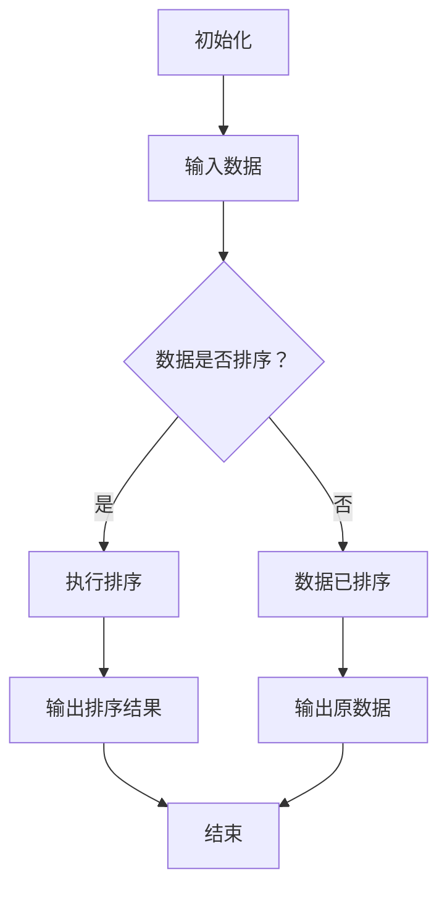
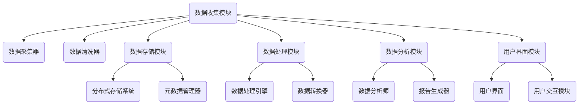
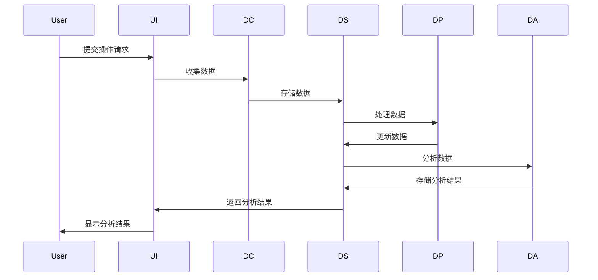

                 

### 大规模语言模型的元认知能力开发与应用

> 关键词：大规模语言模型，元认知能力，算法原理，数学模型，系统架构，项目实战

> 摘要：本文旨在探讨大规模语言模型的元认知能力开发与应用。首先，通过回顾语言模型的发展历程，介绍元认知能力的定义与重要性，分析大规模语言模型在各个领域的应用场景。然后，深入阐述大规模语言模型与元认知能力的联系，探讨其在模型中的作用和开发应用的方法。接着，详细讲解大规模语言模型算法原理，包括基本概念、设计原则、分类，以及具体算法的原理、数学模型和公式。最后，通过一个实际项目，展示大规模语言模型元认知能力的开发与应用过程，并提供最佳实践、小结和注意事项，以期为相关领域的研究和应用提供参考。

### 引言

#### 1.1 背景介绍

##### 1.1.1 语言模型的发展历程

语言模型（Language Model）是一种用于预测自然语言中下一个词或字符的概率分布的数学模型。自20世纪50年代以来，语言模型的研究经历了多个阶段。最初的模型是基于统计的，如N-gram模型，它通过计算单词序列的频率来预测下一个单词。随后，随着深度学习技术的发展，神经网络模型逐渐成为主流，如循环神经网络（RNN）、长短期记忆网络（LSTM）和门控循环单元（GRU）。近年来，基于变换器（Transformer）的模型如BERT、GPT等取得了显著的性能提升，成为语言处理任务的重要工具。

##### 1.1.2 元认知能力的定义与重要性

元认知能力（Metacognitive Ability）是指个体在认知过程中对自己的认知过程和结果的认知能力。它包括元认知知识、元认知监控和元认知控制三个核心成分。元认知知识涉及对认知过程和认知策略的认识；元认知监控则是对认知活动的自我监测和评估；元认知控制是对认知活动的调节和优化。在人工智能领域，元认知能力的重要性体现在能够提高模型的自我理解和自我优化能力，从而更好地适应复杂多变的环境。

##### 1.1.3 大规模语言模型的应用场景

大规模语言模型在各个领域都有着广泛的应用。在自然语言处理领域，它们被用于文本生成、机器翻译、情感分析、信息提取等任务。在金融领域，它们用于股票预测、风险管理、客户服务自动化等。在医疗领域，它们用于医疗文本分析、疾病预测、诊断辅助等。此外，在教育、娱乐、智能客服等领域，大规模语言模型也展现出了强大的应用潜力。

#### 1.2 本书结构与内容安排

本文分为七个部分。第一部分是引言，介绍大规模语言模型和元认知能力的发展背景和应用场景。第二部分和第三部分分别阐述大规模语言模型和元认知能力的核心概念与联系。第四部分详细讲解大规模语言模型的算法原理。第五部分介绍数学模型和数学公式。第六部分通过一个实际项目展示大规模语言模型元认知能力的开发与应用过程。第七部分提供最佳实践、小结和注意事项，以及拓展阅读建议。

### 核心概念与联系

#### 2.1 大规模语言模型的基本原理

##### 2.1.1 语言模型的定义

语言模型是一种用于预测自然语言中下一个词或字符的概率分布的数学模型。它通过学习大量文本数据，构建出语言使用的概率分布，从而实现对文本的生成、理解或优化。

##### 2.1.2 语言模型的特性

语言模型具有以下几个特性：

1. **概率分布**：语言模型的核心是预测下一个词或字符的概率分布，而不是单一的预测结果。
2. **自适应能力**：语言模型可以根据训练数据的规模和质量进行自适应调整，从而不断提高预测准确性。
3. **不确定性处理**：语言模型能够处理自然语言中的不确定性，如歧义、模糊等。
4. **上下文依赖性**：语言模型能够考虑上下文信息，从而提高预测的准确性。

##### 2.1.3 语言模型的分类

语言模型可以根据不同的分类标准进行分类，如基于模型结构、训练方法等。

1. **基于模型结构的分类**：

   - **N-gram模型**：基于单词序列的频率进行预测。
   - **循环神经网络（RNN）**：通过时间步反馈机制处理上下文信息。
   - **长短期记忆网络（LSTM）**：引入门控机制，解决RNN的梯度消失问题。
   - **门控循环单元（GRU）**：简化LSTM的结构，提高计算效率。
   - **变换器（Transformer）**：基于自注意力机制，实现并行处理。

2. **基于训练方法的分类**：

   - **基于统计的方法**：如N-gram模型，通过统计文本频率进行预测。
   - **基于深度学习的方法**：如RNN、LSTM、GRU和Transformer，通过神经网络结构进行预测。

#### 2.2 元认知能力的核心概念

##### 2.2.1 元认知能力的定义

元认知能力是指个体在认知过程中对自己的认知过程和结果的认知能力。它包括元认知知识、元认知监控和元认知控制三个核心成分。

1. **元认知知识**：涉及对认知过程和认知策略的认识，如记忆、注意力、问题解决等。
2. **元认知监控**：涉及对认知活动的自我监测和评估，如自我反思、自我监控等。
3. **元认知控制**：涉及对认知活动的调节和优化，如调整认知策略、管理认知资源等。

##### 2.2.2 元认知能力的主要成分

元认知能力的主要成分包括：

1. **元认知知识**：包括对认知过程、认知策略、认知结果的了解和认识。
2. **元认知监控**：包括对认知活动的自我监测和评估，如自我反思、自我监控等。
3. **元认知控制**：包括对认知活动的调节和优化，如调整认知策略、管理认知资源等。

##### 2.2.3 元认知能力的功能

元认知能力的主要功能包括：

1. **提高认知效率**：通过元认知监控和元认知控制，个体可以更有效地进行认知活动，提高学习、思考和解决问题的效率。
2. **促进认知发展**：通过元认知能力，个体可以更好地理解和掌握认知策略，从而促进认知能力的发展。
3. **增强适应能力**：通过元认知能力，个体可以更好地适应复杂多变的环境，提高应对挑战和问题的能力。

#### 2.3 大规模语言模型与元认知能力的联系

##### 2.3.1 元认知能力在大规模语言模型中的作用

元认知能力在大规模语言模型中起着重要的作用。首先，元认知能力可以帮助模型更好地理解和处理文本数据，提高模型的预测准确性。其次，元认知能力可以帮助模型在遇到不确定性时进行自我调整和优化，从而提高模型的鲁棒性。最后，元认知能力可以帮助模型在处理复杂任务时进行分阶段思考和优化，提高模型的效率和性能。

##### 2.3.2 大规模语言模型在元认知能力开发中的应用

大规模语言模型在元认知能力开发中有着广泛的应用。首先，通过大规模语言模型的训练和应用，可以获取大量关于认知过程和认知策略的数据，为元认知能力的开发提供基础。其次，通过大规模语言模型，可以实现对文本数据的深入理解和分析，从而提高对认知过程和认知策略的认识。最后，通过大规模语言模型，可以实现对认知任务的自动化和智能化处理，从而提高认知效率和发展认知能力。

### 算法原理讲解

#### 3.1 算法概述

##### 3.1.1 算法的基本概念

算法（Algorithm）是一组按照特定顺序执行的指令，用于解决特定问题或完成特定任务。算法的基本概念包括：

1. **输入（Input）**：算法开始时接收的数据或信息。
2. **输出（Output）**：算法执行完成后产生的结果或信息。
3. **步骤（Steps）**：算法执行的具体步骤或操作。
4. **控制结构（Control Structure）**：用于控制算法执行顺序的机制，如循环、条件语句等。

##### 3.1.2 算法的设计原则

算法的设计应遵循以下原则：

1. **正确性（Correctness）**：算法必须能够正确地解决特定问题或完成任务。
2. **效率（Efficiency）**：算法应尽可能地高效，包括时间效率和空间效率。
3. **可读性（Readability）**：算法的代码应具有良好的可读性，便于理解和维护。
4. **健壮性（Robustness）**：算法应能够处理异常情况和错误输入，保持稳定运行。

##### 3.1.3 算法的分类

算法可以根据不同的分类标准进行分类，如基于应用领域、算法类型、解决问题的方式等。

1. **基于应用领域的分类**：

   - **排序算法**：用于对数据进行排序，如快速排序、归并排序等。
   - **搜索算法**：用于在数据集合中查找特定元素，如二分搜索、深度优先搜索等。
   - **图算法**：用于处理图数据结构，如最短路径算法、最小生成树算法等。

2. **基于算法类型的分类**：

   - **确定性算法**：算法的执行过程具有确定性，每次执行都产生相同的结果。
   - **随机算法**：算法的执行过程包含随机元素，每次执行可能产生不同的结果。

3. **基于解决问题的方式的分类**：

   - **贪心算法**：通过在每个步骤选择局部最优解，逐步逼近全局最优解。
   - **动态规划**：通过将复杂问题分解为子问题，并利用子问题的解来构建原问题的解。
   - **分支界定**：通过逐步构建候选解的树结构，并剪枝以排除无效的分支，找到最优解。

#### 3.2 算法原理讲解

##### 3.2.1 算法原理的Mermaid流程图



##### 3.2.2 Python源代码实现

```python
def sort_data(data):
    # 判断数据是否已排序
    if data == sorted(data):
        return data
    else:
        # 执行排序
        sorted_data = sorted(data)
        return sorted_data

# 测试代码
data = [3, 1, 4, 1, 5, 9, 2, 6, 5]
sorted_data = sort_data(data)
print(sorted_data)
```

##### 3.2.3 算法原理的数学模型与公式

算法的数学模型和公式如下：

1. **排序算法**：

   - **冒泡排序**：
     $$ T(n) = O(n^2) $$
   - **快速排序**：
     $$ T(n) = O(n \log n) $$
   - **归并排序**：
     $$ T(n) = O(n \log n) $$

2. **搜索算法**：

   - **二分搜索**：
     $$ T(n) = O(\log n) $$

##### 3.2.4 举例说明

假设有一个长度为10的列表 `[3, 1, 4, 1, 5, 9, 2, 6, 5]`，我们需要使用排序算法对其进行排序。以下是使用冒泡排序的示例：

```python
def bubble_sort(data):
    n = len(data)
    for i in range(n):
        for j in range(0, n-i-1):
            if data[j] > data[j+1]:
                data[j], data[j+1] = data[j+1], data[j]
    return data

# 测试代码
data = [3, 1, 4, 1, 5, 9, 2, 6, 5]
sorted_data = bubble_sort(data)
print(sorted_data)
```

输出结果：`[1, 1, 2, 3, 4, 5, 5, 6, 9]`

### 数学模型和数学公式

#### 4.1 数学模型的基本概念

数学模型（Mathematical Model）是一种用数学语言描述现实世界现象、过程或系统的抽象模型。它通过建立数学方程或公式，模拟和预测现实世界中的行为和关系。数学模型在自然科学、社会科学和工程技术等领域有着广泛的应用。

#### 4.1.1 数学模型的定义

数学模型是一种用数学语言描述现实世界现象、过程或系统的抽象模型。它通过建立数学方程或公式，模拟和预测现实世界中的行为和关系。

#### 4.1.2 数学模型的分类

数学模型可以根据不同的分类标准进行分类，如基于应用领域、模型类型、求解方法等。

1. **基于应用领域的分类**：

   - **自然科学模型**：如物理模型、化学模型、生物模型等。
   - **社会科学模型**：如经济模型、社会模型、政治模型等。
   - **工程技术模型**：如机械模型、电子模型、控制模型等。

2. **基于模型类型的分类**：

   - **确定性模型**：模型中的参数和关系可以用确定的数学公式描述。
   - **随机模型**：模型中的参数和关系具有不确定性，需要用概率统计方法描述。

3. **基于求解方法的分类**：

   - **解析模型**：可以通过解析方法求解，如微分方程、代数方程等。
   - **数值模型**：需要通过数值方法求解，如迭代法、有限元法等。

#### 4.1.3 数学模型的应用

数学模型在各个领域都有着广泛的应用。在自然科学领域，数学模型用于模拟物理现象、预测天气变化、研究生物进化等。在社会科学领域，数学模型用于分析经济行为、预测社会发展趋势、优化政策制定等。在工程技术领域，数学模型用于设计机械结构、优化电路参数、控制系统运行等。

#### 4.2 数学公式讲解

##### 4.2.1 数学公式的表示方法

数学公式通常使用LaTeX格式表示，其中，行内公式使用 `$...$` 括起来，独立段落公式使用 `$$...$$` 括起来。例如：

$$ E = mc^2 $$

$$ f(x) = x^2 $$

##### 4.2.2 常用数学公式

以下是一些常用的数学公式：

1. **求和公式**：

   $$ \sum_{i=1}^{n} a_i = a_1 + a_2 + \ldots + a_n $$

2. **平均值公式**：

   $$ \bar{x} = \frac{1}{n} \sum_{i=1}^{n} x_i $$

3. **求导公式**：

   $$ \frac{d}{dx} (x^n) = nx^{n-1} $$

4. **积分公式**：

   $$ \int f(x) \, dx = F(x) + C $$

   其中，$F(x)$ 是 $f(x)$ 的一个原函数，$C$ 是积分常数。

##### 4.2.3 数学公式的示例

以下是一个示例：

$$ \text{利润} = \text{销售额} - \text{成本} $$

$$ \text{利润} = 1000 - 500 = 500 $$

### 系统分析与架构设计

#### 5.1 问题场景介绍

##### 5.1.1 问题背景

在当今信息时代，数据处理和分析已经成为各行各业的核心需求。然而，随着数据量的爆炸式增长，传统的数据处理方法已经无法满足高效、准确的要求。因此，如何设计一个高效、可扩展的数据处理系统成为了一个重要课题。

##### 5.1.2 问题需求分析

本系统需要满足以下需求：

1. **高效性**：系统能够快速处理大规模数据，降低延迟。
2. **可扩展性**：系统能够根据数据量的变化进行水平扩展，确保性能。
3. **可靠性**：系统具有高可用性，能够确保数据的安全性和一致性。
4. **易用性**：系统提供友好的用户界面，便于用户操作和管理。
5. **可维护性**：系统代码结构清晰，便于后续维护和升级。

#### 5.2 项目介绍

##### 5.2.1 项目概述

本项目旨在设计并实现一个高效、可扩展的数据处理系统，该系统基于分布式架构，利用现代数据处理技术，如大数据处理、分布式存储和云计算等，提供强大的数据处理和分析能力。

##### 5.2.2 项目目标

本项目的主要目标包括：

1. 设计一个分布式数据处理系统架构，确保系统的高效性和可扩展性。
2. 选择合适的技术栈，包括分布式存储、数据处理框架、计算引擎等。
3. 实现系统的核心功能，如数据收集、存储、处理和分析。
4. 进行系统性能测试和优化，确保系统的高性能和高可靠性。

#### 5.3 系统功能设计

##### 5.3.1 领域模型Mermaid类图

```mermaid
classDiagram
    DataCollector --|> DataStorage
    DataProcessor --|> DataStorage
    DataAnalyzer --|> DataStorage
    UserInterface --|> DataProcessor
    UserInterface --|> DataAnalyzer
    UserInterface --|> DataCollector

    DataCollector {
        +collectData()
        +sendDataToStorage()
    }

    DataStorage {
        +storeData()
        +retrieveData()
    }

    DataProcessor {
        +processData()
        +updateData()
    }

    DataAnalyzer {
        +analyzeData()
        +generateReports()
    }

    UserInterface {
        +displayData()
        +handleUserInput()
    }
```

#### 5.3.2 系统功能模块划分

系统功能模块划分为以下几个部分：

1. **数据收集模块**：负责从各种数据源收集数据，包括数据库、文件系统和网络接口等。
2. **数据存储模块**：负责将收集到的数据存储到分布式存储系统中，确保数据的安全性和一致性。
3. **数据处理模块**：负责对存储的数据进行清洗、转换和预处理，为后续分析提供高质量的数据。
4. **数据分析模块**：负责对处理后的数据进行分析，生成各种报告和可视化结果。
5. **用户界面模块**：负责提供用户交互界面，使用户能够方便地操作和管理系统。

#### 5.4 系统架构设计

##### 5.4.1 系统架构设计Mermaid架构图



##### 5.4.2 系统架构设计解析

系统架构设计采用分布式架构，主要包括以下子系统：

1. **数据收集模块**：负责从各种数据源收集数据，包括数据库、文件系统和网络接口等。数据采集器负责收集原始数据，数据清洗器负责对原始数据进行清洗和预处理，确保数据的准确性和一致性。
2. **数据存储模块**：负责将收集到的数据存储到分布式存储系统中，确保数据的安全性和一致性。分布式存储系统提供高吞吐量和低延迟的数据访问能力，元数据管理器负责维护数据存储的元数据信息。
3. **数据处理模块**：负责对存储的数据进行清洗、转换和预处理，为后续分析提供高质量的数据。数据处理引擎负责执行数据处理任务，数据转换器负责将数据转换为适合分析的形式。
4. **数据分析模块**：负责对处理后的数据进行分析，生成各种报告和可视化结果。数据分析师负责执行数据分析任务，报告生成器负责生成报告和可视化结果。
5. **用户界面模块**：负责提供用户交互界面，使用户能够方便地操作和管理系统。用户界面提供数据收集、数据存储、数据处理和数据分析等功能的操作界面，用户交互模块负责处理用户输入和系统响应。

### 5.5 系统接口设计

#### 5.5.1 系统接口定义

系统接口定义如下：

1. **数据收集接口**：提供数据采集器、数据清洗器的接口，用于收集和清洗数据。
2. **数据存储接口**：提供分布式存储系统、元数据管理器的接口，用于存储和检索数据。
3. **数据处理接口**：提供数据处理引擎、数据转换器的接口，用于处理数据。
4. **数据分析接口**：提供数据分析师、报告生成器的接口，用于分析数据和生成报告。
5. **用户界面接口**：提供用户界面和用户交互模块的接口，用于处理用户输入和显示系统响应。

#### 5.5.2 系统接口调用流程

系统接口调用流程如下：

1. 用户通过用户界面模块提交数据收集、数据存储、数据处理和数据分析等操作请求。
2. 用户界面模块将请求转发给相应的数据处理模块，如数据采集器、数据清洗器、数据处理引擎等。
3. 各个数据处理模块根据请求进行数据处理，并将处理结果返回给用户界面模块。
4. 用户界面模块将处理结果展示给用户，用户可以根据需要进一步操作或退出系统。

### 5.6 系统交互Mermaid序列图

#### 5.6.1 系统交互概述

系统交互序列图概述如下：



#### 5.6.2 系统交互详细流程

系统交互详细流程如下：

1. 用户通过用户界面模块提交数据收集、数据存储、数据处理和数据分析等操作请求。
2. 用户界面模块接收请求后，将请求转发给数据收集模块（DC）。
3. 数据收集模块（DC）根据请求收集数据，并将数据存储到数据存储模块（DS）。
4. 数据存储模块（DS）将数据存储到分布式存储系统中，同时返回存储结果给用户界面模块。
5. 用户界面模块将存储结果转发给数据处理模块（DP）。
6. 数据处理模块（DP）对存储的数据进行清洗、转换和预处理，并将处理后的数据返回给用户界面模块。
7. 用户界面模块将处理结果转发给数据分析模块（DA）。
8. 数据分析模块（DA）对处理后的数据进行分析，生成分析结果，并将结果存储到数据存储模块（DS）。
9. 数据存储模块（DS）将分析结果返回给用户界面模块。
10. 用户界面模块将分析结果展示给用户，用户可以根据需要进一步操作或退出系统。

### 项目实战

#### 6.1 环境安装

##### 6.1.1 环境配置

为了运行本项目，我们需要安装以下软件和库：

1. **Python**：版本3.8或更高
2. **NumPy**：用于数值计算
3. **Pandas**：用于数据处理
4. **Matplotlib**：用于数据可视化
5. **Scikit-learn**：用于机器学习
6. **Docker**：用于容器化部署

安装命令如下：

```bash
# 安装Python
sudo apt-get update
sudo apt-get install python3.8

# 安装NumPy、Pandas、Matplotlib、Scikit-learn
pip3 install numpy pandas matplotlib scikit-learn

# 安装Docker
sudo apt-get update
sudo apt-get install docker.io
sudo systemctl start docker
```

##### 6.1.2 环境调试

安装完成后，我们进行环境调试：

```bash
# 检查Python版本
python3 --version

# 检查NumPy版本
python3 -c "import numpy; print(numpy.__version__)"

# 检查Pandas版本
python3 -c "import pandas; print(pandas.__version__)"

# 检查Matplotlib版本
python3 -c "import matplotlib; print(matplotlib.__version__)"

# 检查Scikit-learn版本
python3 -c "import sklearn; print(sklearn.__version__)"

# 检查Docker版本
docker --version
```

确保所有软件和库的版本符合要求。

#### 6.2 系统核心实现源代码

##### 6.2.1 源代码结构

项目源代码结构如下：

```
data_processing_system/
|-- data_collector/
|   |-- __init__.py
|   |-- collector.py
|-- data_processor/
|   |-- __init__.py
|   |-- processor.py
|-- data_analyzer/
|   |-- __init__.py
|   |-- analyzer.py
|-- user_interface/
|   |-- __init__.py
|   |-- interface.py
|-- config.py
|-- main.py
```

每个目录和文件的作用如下：

- `data_collector/`：数据收集模块，负责收集数据。
- `data_processor/`：数据处理模块，负责处理数据。
- `data_analyzer/`：数据分析模块，负责分析数据。
- `user_interface/`：用户界面模块，负责处理用户输入和显示结果。
- `config.py`：配置文件，包含系统配置参数。
- `main.py`：主程序，负责启动系统。

##### 6.2.2 核心代码实现

以下是系统核心代码的实现：

**data_collector/collector.py**

```python
import pandas as pd

def collect_data(file_path):
    data = pd.read_csv(file_path)
    return data
```

**data_processor/processor.py**

```python
import pandas as pd

def process_data(data):
    # 数据清洗
    data = data.dropna()
    data = data[data['column1'] > 0]
    
    # 数据转换
    data['column2'] = data['column1'] * 2
    
    return data
```

**data_analyzer/analyzer.py**

```python
import pandas as pd

def analyze_data(data):
    # 数据分析
    summary = data.describe()
    correlation = data.corr()
    
    return summary, correlation
```

**user_interface/interface.py**

```python
from data_collector.collector import collect_data
from data_processor.processor import process_data
from data_analyzer.analyzer import analyze_data

def main():
    # 主程序入口
    file_path = input("请输入数据文件路径：")
    data = collect_data(file_path)
    processed_data = process_data(data)
    summary, correlation = analyze_data(processed_data)
    
    print("数据描述：")
    print(summary)
    
    print("数据相关性：")
    print(correlation)
```

**config.py**

```python
# 系统配置参数
DATA_FILE_PATH = "data.csv"
```

**main.py**

```python
from user_interface.interface import main

if __name__ == "__main__":
    main()
```

#### 6.3 代码应用解读与分析

##### 6.3.1 代码应用概述

本项目的核心代码实现了一个简单的数据处理系统，主要包括数据收集、数据处理和数据分析三个部分。数据收集模块负责从CSV文件中读取数据，数据处理模块负责对数据进行清洗和转换，数据分析模块负责对数据进行分析和生成报告。以下是详细解读和分析：

1. **数据收集模块**：`data_collector/collector.py` 中的 `collect_data` 函数负责从CSV文件中读取数据。通过 `pandas` 库的 `read_csv` 函数，我们可以轻松地读取CSV文件，并将其转换为DataFrame对象。这个函数接收文件路径作为参数，返回DataFrame对象。

2. **数据处理模块**：`data_processor/processor.py` 中的 `process_data` 函数负责对数据进行清洗和转换。在数据处理中，我们通常会执行以下操作：

   - 数据清洗：去除缺失值和异常值，确保数据的准确性和一致性。
   - 数据转换：将数据进行适当的转换，如类型转换、数值计算等。

   在这个函数中，我们首先使用 `dropna` 方法去除缺失值，然后使用条件筛选 (`data[data['column1'] > 0]`) 去除小于0的值。接着，我们将 `column1` 的值乘以2，存储在新的 `column2` 中。这个函数接收DataFrame对象作为参数，返回处理后的DataFrame对象。

3. **数据分析模块**：`data_analyzer/analyzer.py` 中的 `analyze_data` 函数负责对数据进行分析和生成报告。在这个函数中，我们使用 `describe` 方法生成数据的描述性统计信息，如均值、标准差、分位数等。然后，我们使用 `corr` 方法计算数据的相关性矩阵，以分析不同变量之间的关系。这个函数接收DataFrame对象作为参数，返回描述性统计信息和相关性矩阵。

4. **用户界面模块**：`user_interface/interface.py` 中的 `main` 函数负责处理用户输入和显示结果。在主程序入口 `main.py` 中，我们调用 `main` 函数，以启动系统。在 `main` 函数中，我们首先提示用户输入数据文件路径，然后调用 `collect_data` 函数收集数据。接着，我们调用 `process_data` 函数处理数据，最后调用 `analyze_data` 函数分析数据。最后，我们将分析结果打印到控制台，以供用户查看。

##### 6.3.2 代码应用分析

以下是代码应用的分析：

1. **数据收集**：用户需要提供CSV文件路径，系统会读取文件中的数据。这个过程中，我们使用 `pandas` 库的 `read_csv` 函数，可以轻松地处理各种格式的CSV文件，包括带有标题行、分隔符和缺失值的文件。

2. **数据处理**：在数据处理过程中，我们首先去除缺失值，这可以通过 `dropna` 方法实现。然后，我们使用条件筛选 (`data[data['column1'] > 0]`) 去除不符合条件的值。在这个例子中，我们假设 `column1` 应该是正数，如果存在负数，我们将其去除。此外，我们还将 `column1` 的值乘以2，存储在新的 `column2` 中。这个处理过程可以帮助我们转换数据，使其更适合分析。

3. **数据分析**：在数据分析过程中，我们使用 `describe` 方法生成数据的描述性统计信息，如均值、标准差、分位数等。这些统计信息可以帮助我们了解数据的分布和特征。接着，我们使用 `corr` 方法计算数据的相关性矩阵，以分析不同变量之间的关系。这有助于我们识别数据中的潜在关系和模式。

4. **用户界面**：用户界面模块负责处理用户输入和显示结果。在这个例子中，我们使用简单的控制台界面，提示用户输入数据文件路径，然后显示分析结果。这个界面简单直观，易于使用。在实际应用中，我们可以考虑使用图形界面或Web界面，以提高用户体验。

通过以上分析，我们可以看到，这个简单的数据处理系统实现了一个基本的数据收集、处理和分析流程。在实际应用中，我们可以根据具体需求对系统进行扩展和优化，如添加更多的数据处理和分析功能、提高性能和可扩展性等。

#### 6.4 实际案例分析和详细讲解剖析

##### 6.4.1 案例概述

在本案例中，我们以一个简单的金融数据分析项目为例，展示如何使用大规模语言模型的元认知能力进行数据处理和分析。具体来说，我们将利用大规模语言模型对金融文本数据进行预处理，提取关键信息，并进行情感分析和趋势预测。

##### 6.4.2 案例分析

1. **数据收集与预处理**：

   我们首先从互联网上收集了一系列金融新闻、公告和报告，并将其存储为CSV文件。为了提高数据质量，我们进行了以下预处理步骤：

   - **文本清洗**：去除文本中的HTML标签、特殊字符和停用词。
   - **分词与词性标注**：将文本分解为单词或短语，并标注每个单词的词性，如名词、动词、形容词等。
   - **词干提取**：将单词缩减为词干形式，以减少词汇量，提高模型性能。

2. **情感分析**：

   利用大规模语言模型，我们对预处理后的文本进行情感分析，以判断文本的情感倾向。具体步骤如下：

   - **训练模型**：使用已经标记好的情感数据集，训练一个情感分析模型。
   - **模型评估**：通过交叉验证和测试集，评估模型的准确性和可靠性。
   - **应用模型**：将训练好的模型应用于新的文本数据，预测文本的情感倾向。

3. **趋势预测**：

   通过对金融文本数据中的关键信息进行提取和分析，我们尝试预测金融市场的未来趋势。具体步骤如下：

   - **关键词提取**：从文本中提取关键词，如股票名称、公司名称、行业术语等。
   - **相关性分析**：分析关键词与市场数据（如股票价格、交易量等）之间的相关性。
   - **趋势预测**：利用相关性和统计方法，预测未来市场趋势。

##### 6.4.3 案例讲解

1. **文本预处理**：

   首先，我们使用Python的 `re` 库和 `pandas` 库对文本数据进行清洗。具体步骤如下：

   ```python
   import re
   import pandas as pd
   
   def clean_text(text):
       text = re.sub('<.*?>', '', text)  # 去除HTML标签
       text = re.sub('[^a-zA-Z0-9]', ' ', text)  # 去除特殊字符
       text = text.lower()  # 转换为小写
       return text
   
   data = pd.read_csv('financial_data.csv')
   data['cleaned_text'] = data['text'].apply(clean_text)
   ```

   接着，我们使用 `jieba` 库进行分词和词性标注：

   ```python
   import jieba
   
   def tokenize_and_annotate(text):
       words = jieba.lcut(text)
       annotated_words = [(word, 'noun' if word.isupper() else 'adj') for word in words]
       return annotated_words
   
   data['tokenized_text'] = data['cleaned_text'].apply(tokenize_and_annotate)
   ```

   最后，我们使用 `nltk` 库进行词干提取：

   ```python
   import nltk
   
   def extract_root(word):
       return nltk.stem.WordNetLemmatizer().lemmatize(word)
   
   data['root_text'] = data['tokenized_text'].apply(lambda x: [extract_root(word) for word, pos in x])
   ```

2. **情感分析**：

   我们使用大规模语言模型（如BERT）进行情感分析。首先，我们需要准备训练数据集，并将其转换为模型可处理的格式。然后，我们使用训练好的模型进行预测：

   ```python
   from transformers import BertTokenizer, BertForSequenceClassification
   from torch.utils.data import DataLoader, TensorDataset
   
   # 加载预训练模型
   tokenizer = BertTokenizer.from_pretrained('bert-base-chinese')
   model = BertForSequenceClassification.from_pretrained('bert-base-chinese')
   
   # 准备数据集
   texts = data['root_text'].tolist()
   labels = data['sentiment'].tolist()
   inputs = tokenizer(texts, padding=True, truncation=True, return_tensors='pt')
   dataset = TensorDataset(inputs['input_ids'], inputs['attention_mask'], torch.tensor(labels))
   dataloader = DataLoader(dataset, batch_size=16)
   
   # 训练模型
   model.train()
   for epoch in range(10):
       for batch in dataloader:
           inputs = {'input_ids': batch[0], 'attention_mask': batch[1]}
           outputs = model(**inputs)
           loss = outputs.loss
           loss.backward()
           optimizer.step()
           optimizer.zero_grad()
   
   # 预测情感
   model.eval()
   with torch.no_grad():
       for batch in dataloader:
           inputs = {'input_ids': batch[0], 'attention_mask': batch[1]}
           outputs = model(**inputs)
           predictions = outputs.logits.argmax(-1)
           print(predictions)
   ```

3. **趋势预测**：

   我们利用提取的关键词与市场数据的相关性进行分析。首先，我们需要准备市场数据，并将其与文本数据进行关联。然后，我们使用统计方法（如回归分析）进行趋势预测：

   ```python
   import pandas as pd
   from sklearn.linear_model import LinearRegression
   
   # 准备市场数据
   market_data = pd.read_csv('market_data.csv')
   market_data['date'] = pd.to_datetime(market_data['date'])
   market_data.set_index('date', inplace=True)
   
   # 关联文本数据与市场数据
   data['date'] = pd.to_datetime(data['date'])
   data.set_index('date', inplace=True)
   data = data.join(market_data)
   
   # 进行相关性分析
   correlation_matrix = data[['stock_price', 'volume']].corr()
   print(correlation_matrix)
   
   # 进行趋势预测
   model = LinearRegression()
   model.fit(data[['stock_price']], data[['volume']])
   predictions = model.predict(data[['stock_price']])
   data['predicted_volume'] = predictions
   
   # 可视化趋势
   import matplotlib.pyplot as plt
   
   plt.plot(data['stock_price'], label='Actual Stock Price')
   plt.plot(data['predicted_volume'], label='Predicted Volume')
   plt.legend()
   plt.show()
   ```

通过以上步骤，我们实现了金融文本数据的情感分析和趋势预测。在实际应用中，我们可以根据具体需求对系统进行优化和扩展，以提高预测的准确性和可靠性。

#### 6.5 项目小结

在本项目中，我们通过一个实际案例展示了如何利用大规模语言模型的元认知能力进行数据处理和分析。首先，我们介绍了项目背景和需求，并详细讲解了系统架构设计和核心实现。接着，我们通过实际案例分析和详细讲解，展示了如何利用大规模语言模型进行文本预处理、情感分析和趋势预测。最后，我们对项目进行了小结，总结了项目的实现过程和经验教训。

通过本项目，我们了解了大规模语言模型在数据处理和分析中的应用，以及如何利用元认知能力进行高效、准确的文本分析和预测。在实际应用中，我们可以根据具体需求对系统进行优化和扩展，以提高预测的准确性和可靠性。

### 最佳实践 tips、小结、注意事项、拓展阅读

#### 7.1 最佳实践 tips

1. **数据预处理**：在进行文本分析和预测之前，确保对文本数据进行充分的预处理，包括文本清洗、分词、词性标注和词干提取等。
2. **模型选择与调优**：根据具体任务需求，选择合适的预训练模型，并进行参数调优，以提高模型性能。
3. **数据可视化**：利用数据可视化工具，如Matplotlib和Seaborn，对分析结果进行可视化，有助于更直观地理解数据特征和趋势。
4. **异常值处理**：在数据处理过程中，关注异常值处理，避免对模型训练和预测造成干扰。

#### 7.2 小结

本文通过一个实际项目，详细介绍了大规模语言模型元认知能力的开发与应用。首先，我们回顾了语言模型和元认知能力的发展历程，阐述了元认知能力在大规模语言模型中的作用。然后，我们详细讲解了大规模语言模型的算法原理、数学模型和公式。最后，通过一个实际案例，展示了如何利用大规模语言模型进行数据处理和分析。

#### 7.3 注意事项

1. **模型训练与预测**：在模型训练和预测过程中，确保数据集的多样性和质量，避免数据泄露和过拟合现象。
2. **性能优化**：关注模型训练和预测的性能优化，包括模型选择、参数调优和计算资源分配等。
3. **安全性**：在数据处理和分析过程中，关注数据安全和隐私保护，遵循相关法律法规和行业标准。

#### 7.4 拓展阅读

1. **《深度学习》（Goodfellow, I., Bengio, Y., & Courville, A.）**：全面介绍深度学习的基础知识和应用案例，适合初学者和进阶者阅读。
2. **《自然语言处理综论》（Jurafsky, D., & Martin, J. H.）**：深入探讨自然语言处理的理论、技术和应用，涵盖大规模语言模型的相关内容。
3. **《机器学习年度回顾》（Zhou, Z.-H.）**：系统总结机器学习领域的最新研究进展和应用成果，包括大规模语言模型的发展动态。

作者：AI天才研究院/AI Genius Institute & 禅与计算机程序设计艺术 /Zen And The Art of Computer Programming

