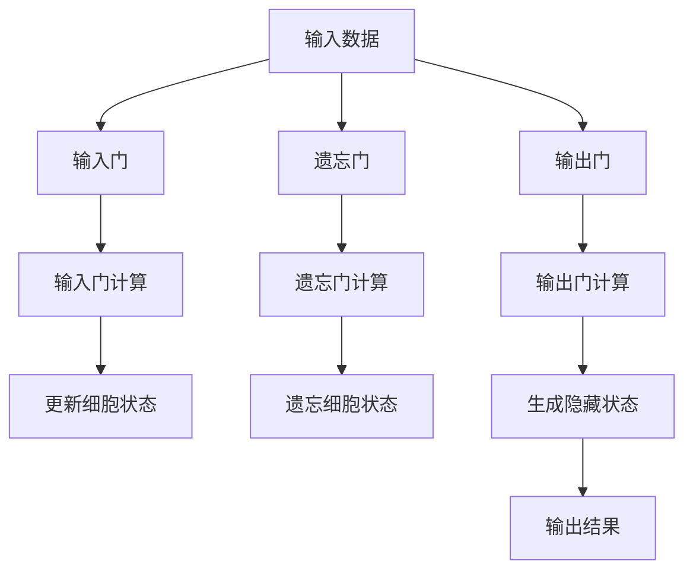

                 

### 引言

在当今人工智能领域，大规模语言模型（如GPT-3、BERT等）已经成为自然语言处理（NLP）中的主流技术。这些模型在文本生成、机器翻译、问答系统等领域展示了卓越的性能，极大地推动了人工智能技术的发展。然而，随着模型规模的扩大和复杂度的增加，一个关键问题逐渐浮现：如何评估和增强大规模语言模型的元认知能力？

元认知能力是指个体对自己认知过程的认知与监控能力，包括自我评估、目标设置、认知策略选择等。在大规模语言模型中，元认知能力的重要性在于它不仅能够提升模型的性能，还能帮助模型更好地理解和处理复杂的任务。因此，本文旨在探讨大规模语言模型的元认知能力评估与增强问题，回答以下几个核心问题：

1. **元认知能力的概念与评估方法是什么？**
2. **如何构建元认知能力的量化模型？**
3. **大规模语言模型的算法原理如何影响元认知能力？**
4. **如何通过数学模型和算法优化来增强模型的元认知能力？**
5. **在实际应用中，如何将元认知能力应用于提高模型性能？**

本文将按照以下结构展开：首先，介绍大规模语言模型的发展背景，引出元认知能力的概念。接着，深入探讨大规模语言模型的基础知识，包括定义、特点、构建方法和评估指标。然后，详细讨论元认知能力的评估方法，包括自我评估法、他评法和客观评估法。接下来，介绍元认知能力的量化模型，包括数学模型和量化方法。随后，分析大规模语言模型的算法原理和数学模型，探讨如何通过算法优化增强元认知能力。最后，通过实际应用案例展示如何将元认知能力应用于大规模语言模型，并总结全文，提出未来研究方向。

### 关键词

- **大规模语言模型**
- **元认知能力**
- **评估方法**
- **量化模型**
- **算法优化**
- **应用案例**

### 摘要

本文聚焦于大规模语言模型的元认知能力评估与增强问题，旨在探讨如何提升模型的认知与监控能力，以应对复杂任务和提高性能。首先，回顾了大规模语言模型的发展背景和元认知能力的基本概念。接着，详细介绍了大规模语言模型的基础知识，包括定义、特点、构建方法和评估指标。随后，探讨了元认知能力的评估方法，包括自我评估法、他评法和客观评估法，并构建了元认知能力的量化模型。在算法原理部分，分析了大规模语言模型的算法原理和数学模型，并探讨了如何通过算法优化增强元认知能力。最后，通过实际应用案例展示了元认知能力在提高大规模语言模型性能中的应用，总结了全文并提出了未来研究方向。本文对于理解大规模语言模型的元认知能力具有重要意义，为后续研究和应用提供了有力支持。

## 第1章：问题背景与核心概念

### 1.1 问题背景

大规模语言模型（如GPT-3、BERT等）的迅猛发展，使自然语言处理（NLP）领域取得了显著进展。这些模型在文本生成、机器翻译、问答系统等领域展示了卓越的性能，极大地推动了人工智能技术的发展。然而，随着模型规模的扩大和复杂度的增加，一个关键问题逐渐浮现：如何评估和增强大规模语言模型的元认知能力？

元认知能力是指个体对自己认知过程的认知与监控能力，包括自我评估、目标设置、认知策略选择等。在大规模语言模型中，元认知能力的重要性在于它不仅能够提升模型的性能，还能帮助模型更好地理解和处理复杂的任务。例如，元认知能力可以帮助模型在面对新任务时自我调整，识别和纠正错误，从而提高任务的完成质量。

当前，尽管大规模语言模型在NLP领域取得了巨大成功，但其在元认知能力方面的研究还处于初级阶段。大多数模型仍依赖预训练和微调，缺乏自我监控和调整能力。这使得模型在处理未知或复杂任务时，容易出现性能不稳定、错误率上升等问题。因此，研究和提升大规模语言模型的元认知能力，对于提升模型的整体性能和应用价值具有重要意义。

### 1.2 核心概念

#### 1.2.1 大规模语言模型

大规模语言模型是指通过大规模数据集进行训练，能够理解和生成自然语言的深度学习模型。常见的模型有GPT-3、BERT、RoBERTa等。这些模型通常采用循环神经网络（RNN）、长短时记忆网络（LSTM）、Transformer等架构，能够捕捉到语言中的长距离依赖关系，并在多种NLP任务中取得优异性能。

#### 1.2.2 元认知能力

元认知能力是指个体对自己认知过程的认知与监控能力，包括自我评估、目标设置、认知策略选择等。在人工智能领域，元认知能力是指模型在执行任务时，对自己认知过程的监控和调整能力。例如，模型在生成文本时，能够识别和纠正错误，或在面对新任务时，能够自我调整策略，提高任务的完成质量。

#### 1.2.3 元认知能力在语言模型中的应用

元认知能力在语言模型中的应用主要体现在以下几个方面：

1. **自我评估与反馈**：模型在生成文本时，能够对自己的生成结果进行评估和反馈，识别和纠正错误，从而提高生成文本的质量。
2. **目标设置与调整**：模型在执行任务时，能够根据任务目标和当前状态，调整自己的认知策略，以实现最佳任务完成效果。
3. **认知资源管理**：模型在处理复杂任务时，能够合理分配和利用认知资源，避免资源浪费和过度消耗。

### 1.3 联系与重要性

#### 1.3.1 元认知能力与大规模语言模型的关系

元认知能力与大规模语言模型密切相关。一方面，大规模语言模型的复杂度和性能依赖于其内部结构和参数设置，而元认知能力则为模型提供了自我监控和调整的能力，有助于提高模型的整体性能和应用价值。另一方面，大规模语言模型的训练和优化过程，也为元认知能力的实现提供了技术支持，如深度学习算法、优化策略等。

#### 1.3.2 元认知能力的重要性

元认知能力在人工智能领域具有重要性，主要体现在以下几个方面：

1. **提升模型性能**：元认知能力可以帮助模型在面对未知或复杂任务时，进行自我调整和优化，从而提高任务的完成质量。
2. **增强模型稳定性**：通过元认知能力的引入，模型在处理未知任务时，能够更好地应对不确定性和异常情况，提高模型稳定性。
3. **促进模型泛化能力**：元认知能力有助于模型在面临新任务时，快速适应和调整，提高模型的泛化能力。

### 1.4 研究现状与挑战

当前，元认知能力在人工智能领域的研究主要集中在以下几个方面：

1. **评估方法**：研究如何有效地评估模型的元认知能力，包括自我评估、他评法和客观评估法等。
2. **量化模型**：研究如何构建元认知能力的量化模型，包括数学模型和算法模型等。
3. **算法优化**：研究如何通过算法优化提升模型的元认知能力，包括深度学习算法、优化策略等。

然而，在研究和应用过程中，仍然面临以下挑战：

1. **评估标准不统一**：不同评估方法之间的标准不统一，难以对模型的元认知能力进行准确评估。
2. **模型复杂度高**：大规模语言模型的复杂度高，导致元认知能力的实现和优化难度较大。
3. **应用场景受限**：当前的研究主要聚焦在实验室环境中，实际应用场景较为有限。

未来，随着人工智能技术的不断发展，元认知能力在语言模型中的应用将面临更多机遇和挑战。通过深入研究元认知能力的评估与增强方法，有望为大规模语言模型提供更强大的认知和监控能力，进一步提升其在实际应用中的性能和价值。

## 第2章：大规模语言模型的基础知识

### 2.1 大规模语言模型的定义与特点

大规模语言模型是指通过大规模数据集进行训练，能够理解和生成自然语言的深度学习模型。这些模型通常采用复杂的神经网络架构，如循环神经网络（RNN）、长短时记忆网络（LSTM）、Transformer等，以捕捉语言中的长距离依赖关系。大规模语言模型的主要特点如下：

1. **大规模数据训练**：大规模语言模型通过大规模数据集进行训练，这使得模型能够从丰富的数据中学习到语言的复杂模式和规律，从而提高模型的性能。
2. **深度神经网络架构**：大规模语言模型采用深度神经网络架构，能够处理高维输入数据，并通过多层网络进行特征提取和表示学习。
3. **多任务学习能力**：大规模语言模型具备多任务学习能力，可以在多种NLP任务中取得优异性能，如文本生成、机器翻译、问答系统等。
4. **强泛化能力**：通过大规模数据训练，大规模语言模型能够较好地应对未知任务，具有较强的泛化能力。

### 2.2 大规模语言模型的构建方法

构建大规模语言模型通常包括以下步骤：

1. **数据采集与预处理**：首先，从互联网上收集大量文本数据，如网页、新闻、书籍等。然后，对采集到的数据进行预处理，包括去除噪声、分词、词性标注等，以生成可用于训练的数据集。
2. **模型选择与设计**：根据任务需求和数据特点，选择合适的模型架构。常见的模型架构有RNN、LSTM、Transformer等。在模型设计过程中，需要考虑网络层数、隐藏层节点数、激活函数等参数。
3. **模型训练与优化**：使用训练数据集对模型进行训练，通过梯度下降等优化算法更新模型参数，以最小化损失函数。在训练过程中，可以采用批处理、dropout等技术提高模型的训练效果。
4. **模型评估与调整**：在训练完成后，使用验证数据集对模型进行评估，根据评估结果调整模型参数，优化模型性能。
5. **模型部署与应用**：将训练好的模型部署到实际应用场景中，如文本生成、机器翻译、问答系统等，实现模型的实际应用。

### 2.3 大规模语言模型的特点

大规模语言模型具有以下特点：

1. **高维度输入数据**：大规模语言模型能够处理高维输入数据，如文本、语音等，这使得模型在处理复杂数据时具备更强的能力。
2. **强表达能力**：通过深度神经网络架构，大规模语言模型能够捕捉到语言中的长距离依赖关系，具有较强的表达能力。
3. **高计算复杂度**：大规模语言模型的计算复杂度高，需要大量的计算资源和时间进行训练和优化。
4. **多任务学习能力**：大规模语言模型具备多任务学习能力，可以在多种NLP任务中取得优异性能。
5. **强泛化能力**：通过大规模数据训练，大规模语言模型能够较好地应对未知任务，具有较强的泛化能力。

### 2.4 大规模语言模型的常见类型

大规模语言模型根据不同的分类标准，可以分为以下几种常见类型：

1. **按任务类型分类**：
   - **文本生成**：如GPT系列模型，主要用于生成文本。
   - **机器翻译**：如BERT模型，主要用于翻译不同语言之间的文本。
   - **问答系统**：如ELMO模型，主要用于回答用户提出的问题。

2. **按模型架构分类**：
   - **循环神经网络（RNN）**：如LSTM模型，能够处理序列数据。
   - **长短时记忆网络（LSTM）**：在RNN基础上引入门控机制，能够更好地处理长距离依赖。
   - **Transformer模型**：采用自注意力机制，能够同时处理多种语言和任务。

3. **按训练数据来源分类**：
   - **公开数据集训练**：如COCO、WMT等数据集，用于训练公开可用的模型。
   - **私有数据集训练**：如公司内部数据集，用于特定任务的高性能模型训练。

### 2.5 大规模语言模型的评价指标

大规模语言模型的性能评价指标主要包括以下几种：

1. **准确率**：用于评估模型在分类任务中的表现，计算公式为：
   $$
   准确率 = \frac{正确预测的样本数}{总样本数}
   $$
2. **召回率**：用于评估模型在分类任务中召回的实际正例样本的能力，计算公式为：
   $$
   召回率 = \frac{正确预测的正例样本数}{实际正例样本数}
   $$
3. **F1值**：是准确率和召回率的调和平均，用于综合评估模型的表现，计算公式为：
   $$
   F1值 = 2 \times \frac{准确率 \times 召回率}{准确率 + 召回率}
   $$
4. **生成文本质量**：用于评估模型在文本生成任务中的生成文本的质量，如BLEU、ROUGE等指标。

### 2.6 大规模语言模型的发展历程

大规模语言模型的发展历程可以追溯到20世纪80年代，以下是一些重要的里程碑：

1. **1982年**：Recurrent Neural Network（RNN）首次提出，用于处理序列数据。
2. **1997年**：Long Short-Term Memory（LSTM）提出，解决了RNN在处理长序列数据时的梯度消失问题。
3. **2014年**：AlexNet在ImageNet比赛中取得优异成绩，标志着深度学习进入主流应用领域。
4. **2017年**：Transformer模型提出，采用自注意力机制，在NLP任务中取得突破性进展。
5. **2020年**：GPT-3模型发布，具有1750亿参数，成为当时最大的预训练语言模型。

### 2.7 大规模语言模型的应用场景

大规模语言模型在多个应用场景中展示了强大的能力，以下是一些典型的应用场景：

1. **文本生成**：如文章写作、对话系统等，模型可以根据输入的文本内容生成相应的文本。
2. **机器翻译**：如翻译不同语言之间的文本，模型可以根据源语言的输入生成目标语言的文本。
3. **问答系统**：如智能客服、问答机器人等，模型可以理解用户的问题并给出相应的回答。
4. **文本分类**：如情感分析、新闻分类等，模型可以根据文本的特征将其分类到不同的类别中。

### 2.8 大规模语言模型的优势与挑战

#### 优势：

1. **强大的表达能力**：通过深度神经网络架构，大规模语言模型能够捕捉到语言中的复杂模式和规律。
2. **多任务学习能力**：模型可以在多种NLP任务中取得优异性能，具备较强的泛化能力。
3. **丰富的数据支持**：通过大规模数据集进行训练，模型能够从丰富的数据中学习到语言的复杂模式。

#### 挑战：

1. **计算资源消耗**：大规模语言模型的训练和优化需要大量的计算资源和时间。
2. **模型解释性**：深度学习模型通常缺乏透明性和解释性，难以理解模型的决策过程。
3. **数据隐私和安全**：大规模数据训练可能导致数据隐私和安全问题。

### 2.9 大规模语言模型的发展趋势

随着人工智能技术的不断进步，大规模语言模型的发展趋势包括：

1. **模型规模扩大**：未来的模型将拥有更多的参数和更大的规模，以进一步提高模型的性能。
2. **多模态融合**：模型将能够处理多种类型的数据，如文本、图像、音频等，实现多模态融合。
3. **自适应学习**：模型将具备更强的自适应学习能力，能够根据不同的任务和数据自我调整和优化。
4. **模型压缩与优化**：通过模型压缩和优化技术，降低模型的计算复杂度和资源消耗。

通过深入研究大规模语言模型的基础知识和发展趋势，有助于更好地理解和应用这些模型，为人工智能技术的发展贡献力量。

## 第3章：元认知能力的评估方法

### 3.1 元认知能力的评估指标

元认知能力的评估需要使用一系列具体的指标来量化，这些指标可以帮助我们全面了解模型在执行任务时的自我监控和调整能力。以下是一些常用的评估指标：

1. **准确性**：衡量模型在执行任务时生成结果的准确性。例如，在文本生成任务中，准确性可以通过比较生成文本与目标文本之间的编辑距离（Edit Distance）来评估。

2. **一致性**：衡量模型在不同场景和任务中的表现一致性。一致性越高，说明模型在面对不同情境时能够保持稳定的性能。可以使用Kappa系数（Kappa Score）来评估一致性。

3. **灵活性**：衡量模型在面对新任务或未知情况时的适应能力。灵活性高的模型能够在不同任务和场景中快速调整，提高任务完成质量。

4. **纠错能力**：衡量模型在生成文本时识别和纠正错误的能力。例如，在对话系统中，可以评估模型在对话中纠正错误的次数和准确性。

5. **知识利用能力**：衡量模型在执行任务时利用已有知识的能力。例如，在问答系统中，可以评估模型在回答问题时引用相关知识库的次数和准确性。

6. **推理能力**：衡量模型在执行任务时进行逻辑推理的能力。例如，在推理任务中，可以评估模型在回答问题时所采用的逻辑推理步骤和正确性。

### 3.2 自我评估法

自我评估法是指模型通过内部机制对自己生成的结果进行评估和反馈。这种方法通常需要模型具备一定程度的自我意识和自我评价能力。以下是一些常用的自我评估方法：

1. **内部评价机制**：模型可以在生成结果后，通过内部评价机制对结果进行自我评估。例如，在文本生成任务中，模型可以计算生成文本与目标文本之间的相似度，评估生成文本的质量。

2. **迭代优化**：模型在生成结果后，可以通过迭代优化方法对结果进行改进。例如，在文本生成任务中，模型可以反复修改生成文本，直到达到满意的准确性。

3. **反馈机制**：模型可以通过用户反馈进行自我评估。例如，在对话系统中，用户可以对模型的回答进行评价，模型根据用户反馈调整后续的回答。

### 3.3 他评法

他评法是指通过外部评估者对模型生成的结果进行评估。这种方法通常需要评估者的专业知识和主观判断。以下是一些常用的他评方法：

1. **人工评估**：评估者通过阅读生成文本，对文本的质量和准确性进行评价。这种方法虽然主观性较强，但能够提供详细的评估结果。

2. **自动化评估**：使用自动化工具对模型生成的结果进行评估。例如，可以使用BLEU、ROUGE等指标来评估文本生成任务的质量。

3. **多评估者评估**：邀请多个评估者对模型生成的结果进行评估，以减少评估的主观性。评估者可以根据不同的评估标准，对生成文本进行评分。

### 3.4 客观评估法

客观评估法是指通过客观数据对模型生成的结果进行评估。这种方法通常使用定量指标来衡量模型的性能。以下是一些常用的客观评估方法：

1. **生成文本质量评估**：使用定量指标评估生成文本的质量。例如，可以使用编辑距离（Edit Distance）、F1值（F1 Score）等指标。

2. **任务完成度评估**：评估模型在特定任务中的完成度。例如，在问答系统中，可以评估模型回答问题的准确率和完整性。

3. **性能指标评估**：使用性能指标评估模型的整体性能。例如，在文本生成任务中，可以评估模型的生成速度和生成文本的多样性。

### 3.5 评估方法的选择与应用

在选择评估方法时，需要考虑以下因素：

1. **任务类型**：不同的任务类型需要不同的评估方法。例如，在文本生成任务中，可以使用自我评估法和自动化评估法；在问答系统中，可以使用他评法和任务完成度评估。

2. **评估成本**：自我评估法和自动化评估法通常成本较低，适用于大规模评估。人工评估法成本较高，适用于精细化评估。

3. **评估精度**：客观评估法通常具有较高的评估精度，适用于对模型性能进行精确评估。他评法和自我评估法则依赖于评估者的主观判断，精度可能较低。

在实际应用中，通常结合多种评估方法，以全面、客观地评估模型的元认知能力。例如，在文本生成任务中，可以使用自我评估法和自动化评估法进行初步评估，然后结合人工评估法进行精细化评估，以确保评估结果的准确性和可靠性。

### 3.6 总结与展望

元认知能力的评估方法对于理解大规模语言模型在复杂任务中的表现具有重要意义。通过自我评估法、他评法和客观评估法，我们可以全面、客观地评估模型的元认知能力。未来，随着人工智能技术的不断发展，我们将继续探索更高效的评估方法，以进一步提升大规模语言模型的元认知能力，推动人工智能技术的发展。

## 第4章：元认知能力的量化模型

### 4.1 元认知能力的数学模型概述

在评估和增强大规模语言模型的元认知能力时，构建一个量化的数学模型至关重要。这样的模型不仅能够帮助我们理解元认知能力的基本原理，还可以为算法优化和模型训练提供依据。元认知能力的量化模型通常基于以下几个核心概念：

1. **认知资源**：认知资源是指模型在执行任务时所需的计算资源和知识储备。例如，模型在生成文本时，需要依赖词向量、语法规则等认知资源。
2. **认知状态**：认知状态是指模型在特定任务中的当前状态，包括任务的完成情况、错误率、资源消耗等。认知状态的变化反映了模型的认知过程。
3. **认知策略**：认知策略是指模型在执行任务时采用的方法和技巧，如自我评估、迭代优化、知识利用等。不同的认知策略对模型的表现有着重要影响。

### 4.2 数学模型的基本概念

在构建元认知能力的数学模型时，我们通常需要引入以下基本概念：

1. **状态空间**：状态空间是指模型在执行任务时可能出现的所有状态集合。例如，在文本生成任务中，状态空间包括所有可能的文本序列。
2. **动作空间**：动作空间是指模型在特定状态下可能采取的所有动作集合。例如，在文本生成任务中，动作空间包括生成下一个词的所有可能选项。
3. **奖励函数**：奖励函数是指用于评估模型在特定状态下采取的动作是否有效的指标。例如，在文本生成任务中，奖励函数可以计算生成文本与目标文本之间的相似度。

### 4.3 元认知能力的量化模型应用

构建元认知能力的量化模型需要明确以下几个步骤：

1. **状态空间定义**：首先，需要定义模型在执行任务时可能出现的所有状态。例如，在文本生成任务中，状态可以包括当前生成的文本序列、错误率、资源消耗等。
2. **动作空间定义**：接着，需要定义模型在特定状态下可能采取的所有动作。例如，在文本生成任务中，动作可以是生成下一个词的不同选项。
3. **奖励函数设计**：然后，需要设计一个奖励函数来评估模型在特定状态下采取的动作是否有效。例如，可以使用生成文本与目标文本之间的编辑距离作为奖励函数。
4. **策略评估与优化**：最后，通过模拟和实验，评估不同认知策略的有效性，并优化模型的表现。例如，可以使用强化学习算法，根据奖励函数调整模型的认知策略。

### 4.4 元认知能力量化模型的应用场景

元认知能力量化模型可以应用于多种场景，包括但不限于：

1. **文本生成**：在文本生成任务中，量化模型可以帮助评估生成文本的质量，优化生成策略，提高生成文本的准确性。
2. **对话系统**：在对话系统中，量化模型可以帮助评估模型在对话中的表现，识别错误，并优化对话策略，提高用户体验。
3. **问答系统**：在问答系统中，量化模型可以帮助评估模型回答问题的准确性，优化知识利用策略，提高回答质量。
4. **多任务学习**：在多任务学习场景中，量化模型可以帮助评估模型在不同任务中的表现，优化任务切换策略，提高模型的整体性能。

### 4.5 模型评估与优化

在构建元认知能力量化模型后，需要进行模型评估与优化。以下是一些常见的评估与优化方法：

1. **模型评估**：使用评估指标（如准确性、一致性、灵活性等）对模型进行评估，以了解模型在特定任务中的表现。
2. **模型优化**：通过调整模型参数、改进算法、增加数据训练等方式，优化模型的表现。例如，可以使用强化学习算法，根据评估结果调整模型的策略。
3. **模型验证**：在模型优化过程中，需要使用验证集进行模型验证，以避免过拟合。通过验证集，可以评估模型的泛化能力和稳定性。

### 4.6 案例分析

以下是一个文本生成任务的案例分析：

**案例背景**：假设我们需要评估一个文本生成模型的元认知能力，该模型用于生成新闻文章。

**步骤一**：定义状态空间。状态包括已生成的文章文本、错误率、资源消耗等。

**步骤二**：定义动作空间。动作包括生成下一个词的不同选项。

**步骤三**：设计奖励函数。奖励函数可以计算生成文本与目标文本之间的编辑距离。

**步骤四**：构建量化模型。使用强化学习算法，根据奖励函数调整模型策略。

**步骤五**：模型评估与优化。使用评估指标（如准确性、一致性等）对模型进行评估，并根据评估结果调整模型参数。

通过上述步骤，我们可以构建一个量化的元认知能力模型，用于评估和优化文本生成模型的性能。

### 4.7 总结与展望

元认知能力的量化模型为评估和增强大规模语言模型的元认知能力提供了有力工具。通过构建量化的数学模型，我们可以更好地理解模型的认知过程，优化模型策略，提高模型性能。未来，随着人工智能技术的不断发展，我们将继续探索更高效的量化模型，以进一步提升大规模语言模型的元认知能力，推动人工智能技术的发展。

## 第5章：大规模语言模型的算法原理

### 5.1 算法原理概述

大规模语言模型的核心在于其算法原理，这些原理决定了模型如何理解和生成自然语言。以下是对几种常见算法原理的概述：

#### 5.1.1 神经网络基础

神经网络（Neural Networks）是大规模语言模型的基础。神经网络由大量神经元（节点）组成，每个神经元都与其他神经元连接。神经元的激活函数用于计算节点的输出，从而实现对输入数据的映射。常见的神经网络包括多层感知机（MLP）、卷积神经网络（CNN）和循环神经网络（RNN）。

#### 5.1.2 循环神经网络（RNN）

循环神经网络（Recurrent Neural Networks，RNN）是一种能够处理序列数据的神经网络。RNN的核心特点是每个神经元的状态会依赖于之前的时间步信息，从而实现序列数据的记忆功能。然而，传统的RNN在处理长序列数据时存在梯度消失和梯度爆炸问题，导致训练效果不佳。

#### 5.1.3 长短时记忆网络（LSTM）

为了解决RNN的梯度消失和梯度爆炸问题，Hochreiter和Schmidhuber在1997年提出了长短时记忆网络（Long Short-Term Memory，LSTM）。LSTM通过引入记忆单元和门控机制，有效地捕捉了长序列数据中的长距离依赖关系。LSTM的核心结构包括输入门、遗忘门和输出门，这些门控机制能够控制信息的流入、保留和输出，从而提高了模型的训练效果和泛化能力。

#### 5.1.4 Transformer模型

Transformer模型由Vaswani等人在2017年提出，彻底改变了大规模语言模型的设计范式。Transformer采用了自注意力机制（Self-Attention）和多头注意力机制（Multi-Head Attention），使得模型能够同时处理输入序列中的不同位置信息，从而捕捉到长距离依赖关系。此外，Transformer还引入了位置编码（Positional Encoding）和点积注意力（Dot-Product Attention），提高了模型的计算效率和并行处理能力。

### 5.2 算法细节与优化

#### 5.2.1 神经网络基础细节

在神经网络中，每个神经元通过权重（weights）和偏置（bias）与输入数据相连接，并应用激活函数（activation function）来产生输出。常见的激活函数包括：

1. **Sigmoid函数**：\( f(x) = \frac{1}{1 + e^{-x}} \)
2. **ReLU函数**：\( f(x) = max(0, x) \)
3. **Tanh函数**：\( f(x) = \frac{e^x - e^{-x}}{e^x + e^{-x}} \)

#### 5.2.2 循环神经网络（RNN）细节

RNN的每个时间步的输出不仅取决于当前输入，还取决于之前的时间步输出。其基本形式如下：

$$
h_t = \sigma(W_x \cdot x_t + W_h \cdot h_{t-1} + b_h)
$$

其中，\( h_t \) 是当前时间步的隐藏状态，\( x_t \) 是当前输入，\( \sigma \) 是激活函数，\( W_x \) 和 \( W_h \) 是权重矩阵，\( b_h \) 是偏置。

#### 5.2.3 长短时记忆网络（LSTM）细节

LSTM的核心是记忆单元（cell state）和三个门控机制：输入门（input gate）、遗忘门（forget gate）和输出门（output gate）。LSTM的基本形式如下：

$$
i_t = \sigma(W_i \cdot [h_{t-1}, x_t] + b_i) \\
f_t = \sigma(W_f \cdot [h_{t-1}, x_t] + b_f) \\
C_t = f_t \odot C_{t-1} + i_t \odot \sigma(W_c \cdot [h_{t-1}, x_t] + b_c) \\
o_t = \sigma(W_o \cdot [C_t, h_{t-1}] + b_o) \\
h_t = o_t \odot \sigma(C_t)
$$

其中，\( i_t \)、\( f_t \)、\( o_t \) 分别是输入门、遗忘门和输出门的激活值，\( C_t \) 是当前时间步的细胞状态，\( W_i \)、\( W_f \)、\( W_c \)、\( W_o \) 是权重矩阵，\( b_i \)、\( b_f \)、\( b_c \)、\( b_o \) 是偏置，\( \odot \) 表示逐元素乘法。

#### 5.2.4 Transformer模型细节

Transformer模型通过多头自注意力机制（Multi-Head Self-Attention）和前馈神经网络（Feedforward Neural Network）进行文本表示和学习。其基本结构如下：

1. **多头自注意力**：

$$
\text{MultiHead}(Q, K, V) = \text{Concat}(\text{head}_1, ..., \text{head}_h)W^O \\
\text{head}_i = \text{softmax}\left(\frac{QW_i^K V\right)W^V_i
$$

其中，\( Q \)、\( K \)、\( V \) 分别是查询向量、键向量和值向量，\( W_i^K \)、\( W_i^V \) 和 \( W^O \) 分别是键权重矩阵、值权重矩阵和输出权重矩阵。

2. **前馈神经网络**：

$$
\text{FFN}(x) = \text{ReLU}(xW_1 + b_1)W_2 + b_2
$$

其中，\( W_1 \)、\( W_2 \)、\( b_1 \)、\( b_2 \) 分别是前馈神经网络的权重矩阵和偏置。

#### 5.2.5 算法优化策略

为了提高大规模语言模型的性能，常用的优化策略包括：

1. **Dropout**：通过在训练过程中随机丢弃部分神经元，减少过拟合。
2. **学习率调度**：使用学习率调度策略（如学习率衰减、余弦退火等），以避免梯度消失和梯度爆炸。
3. **正则化**：使用L1、L2正则化，避免模型参数过大。
4. **批处理**：使用批处理技术，减少计算资源和时间开销。

### 5.3 性能评估与比较

#### 5.3.1 性能评估指标

在评估大规模语言模型的性能时，常用的指标包括：

1. **准确率**：衡量模型在分类任务中的表现，计算公式为：
   $$
   准确率 = \frac{正确分类的样本数}{总样本数}
   $$

2. **召回率**：衡量模型在分类任务中召回的实际正例样本的能力，计算公式为：
   $$
   召回率 = \frac{正确分类的正例样本数}{实际正例样本数}
   $$

3. **F1值**：是准确率和召回率的调和平均，用于综合评估模型的表现，计算公式为：
   $$
   F1值 = 2 \times \frac{准确率 \times 召回率}{准确率 + 召回率}
   $$

4. **生成文本质量**：用于评估模型在文本生成任务中的生成文本的质量，如BLEU、ROUGE等指标。

#### 5.3.2 模型比较

在比较不同大规模语言模型的性能时，可以从以下几个方面进行：

1. **模型规模**：包括参数数量、模型大小等。
2. **训练时间**：包括训练时间、计算资源消耗等。
3. **性能指标**：包括准确率、召回率、F1值等。
4. **应用场景**：不同模型在不同任务和应用场景中的表现。

### 5.4 深度剖析与Mermaid流程图

以下是一个简化的LSTM算法原理的Mermaid流程图：



在这个流程图中，输入数据 \( x_t \) 经过输入门、遗忘门和输出门的计算，更新细胞状态 \( C_t \)，并生成隐藏状态 \( h_t \)，最终输出结果 \( y_t \)。

通过这个流程图，我们可以更直观地理解LSTM的算法原理和计算过程。

### 5.5 Python源代码示例

以下是一个简化的LSTM算法的Python源代码示例：

```python
import numpy as np

def lstm_cell(x, h_prev, c_prev, W, b):
    input_gate = sigmoid(np.dot(h_prev, W['input']) + np.dot(x, W['input']) + b['input'])
    forget_gate = sigmoid(np.dot(h_prev, W['forget']) + np.dot(x, W['forget']) + b['forget'])
    output_gate = sigmoid(np.dot(h_prev, W['output']) + np.dot(x, W['output']) + b['output'])
    input_term = np.dot(input_gate, np.tanh(c_prev))
    forget_term = forget_gate * c_prev
    c候选 = input_term + forget_term
    c_new = np.tanh(c候选)
    output = output_gate * np.tanh(c_new)
    return output, c_new

def sigmoid(x):
    return 1 / (1 + np.exp(-x))

# 初始化参数
W = {'input': np.random.randn(4, 4), 'forget': np.random.randn(4, 4), 'output': np.random.randn(4, 4)}
b = {'input': np.random.randn(1), 'forget': np.random.randn(1), 'output': np.random.randn(1)}

# 假设输入序列为[[1, 0, 1], [0, 1, 0]]
x = np.array([[1, 0, 1], [0, 1, 0]])

# 初始隐藏状态和细胞状态
h_prev = np.random.randn(1, 4)
c_prev = np.random.randn(1, 4)

# 前向传播
h_new, c_new = lstm_cell(x, h_prev, c_prev, W, b)

print("隐藏状态：", h_new)
print("细胞状态：", c_new)
```

在这个示例中，我们定义了一个LSTM单元，通过输入门、遗忘门和输出门的计算，更新细胞状态和生成隐藏状态。这个示例帮助我们更好地理解LSTM的算法原理和实现过程。

### 5.6 数学模型和公式

以下是LSTM算法的核心数学模型和公式：

1. **输入门计算**：

$$
i_t = \sigma(W_{xi}h_{t-1} + W_{xi}x_t + b_i)
$$

2. **遗忘门计算**：

$$
f_t = \sigma(W_{xf}h_{t-1} + W_{xf}x_t + b_f)
$$

3. **更新细胞状态**：

$$
C_{t}^{'} = \sigma(W_{xc}h_{t-1} + W_{xc}x_t + b_c) \odot i_t + f_t \odot C_{t-1}
$$

4. **输出门计算**：

$$
o_t = \sigma(W_{xo}h_{t-1} + W_{xo}x_t + b_o)
$$

5. **生成隐藏状态**：

$$
h_t = o_t \odot \tanh(C_t)
$$

通过这些数学模型和公式，我们可以从理论上深入理解LSTM的算法原理，从而更好地设计和优化大规模语言模型。

### 5.7 总结

本章详细介绍了大规模语言模型的算法原理，包括神经网络基础、RNN、LSTM和Transformer模型。通过剖析这些算法的细节和优化策略，我们了解了模型如何处理和生成自然语言。同时，通过数学模型和公式的讲解，我们能够从理论上深入理解这些算法的工作原理。这些知识为我们进一步研究和优化大规模语言模型提供了坚实的基础。

## 第6章：大规模语言模型的应用

### 6.1 应用领域概述

大规模语言模型在多个应用领域中展现了强大的潜力，以下是对几个关键应用领域的概述：

#### 6.1.1 自然语言处理（NLP）

自然语言处理是大规模语言模型最为核心的应用领域之一。大规模语言模型通过学习大量的文本数据，能够理解和生成自然语言，从而实现文本分类、情感分析、命名实体识别、机器翻译等任务。例如，GPT-3模型在文本生成和机器翻译中表现出了极高的性能，使得自动化内容创作和跨语言沟通变得更加便捷。

#### 6.1.2 机器翻译

机器翻译是大规模语言模型的重要应用之一。传统的机器翻译方法通常依赖于规则和统计方法，而大规模语言模型如BERT和GPT-3等，通过深度学习技术，能够直接从海量数据中学习到语言的规律，从而实现更为准确和自然的翻译结果。这些模型可以处理各种语言的翻译任务，包括低资源语言的翻译，大大提高了机器翻译的效率和准确性。

#### 6.1.3 问答系统

问答系统是另一个大规模语言模型的重要应用领域。通过学习大量问答对，大规模语言模型能够理解用户的问题，并生成相应的答案。这些系统可以用于智能客服、搜索引擎问答、教育辅助等场景。例如，BERT模型在问答系统中的表现非常出色，能够提供准确和及时的回答，提升了用户体验。

#### 6.1.4 文本生成

大规模语言模型在文本生成领域也有着广泛的应用。这些模型可以生成新闻文章、故事、诗歌等多种类型的文本。例如，GPT-3模型在生成文章摘要、编写新闻故事等方面表现出了强大的能力。文本生成不仅可以用于自动化内容创作，还可以用于创意写作和文学创作。

#### 6.1.5 情感分析

情感分析是理解用户情感和意见的重要手段。大规模语言模型通过学习情感标签和相关的文本数据，能够识别和分类文本的情感倾向。这些模型可以用于社交媒体监控、市场研究、客户反馈分析等场景，帮助企业更好地理解用户需求和市场动态。

### 6.2 应用案例分析

在本节中，我们将通过几个具体的案例分析，展示大规模语言模型在不同应用场景中的实际应用和效果。

#### 6.2.1 案例一：智能客服系统

智能客服系统是大规模语言模型在商业应用中的一个重要场景。通过大规模语言模型，智能客服系统能够自动理解和回答用户的问题，提供即时的客户服务。以下是一个案例：

**背景**：某电商公司希望提升客户服务质量，通过智能客服系统实现自动化的客户服务。

**解决方案**：使用GPT-3模型构建智能客服系统。首先，收集大量的客服对话数据，进行数据预处理和模型训练。训练完成后，将GPT-3模型部署到客服系统中，使其能够自动理解和回答用户的问题。

**效果**：智能客服系统上线后，显著提升了客户满意度，减少了人工客服的工作量。通过GPT-3模型，系统能够理解用户的多样化问题，并提供准确和自然的回答。用户反馈显示，智能客服系统的回答速度和准确性都得到了显著提升。

#### 6.2.2 案例二：文本生成与摘要

文本生成与摘要是大规模语言模型的另一个重要应用。以下是一个案例：

**背景**：某新闻媒体公司希望自动化新闻摘要生成，以节省编辑时间和提高生产效率。

**解决方案**：使用GPT-3模型构建文本摘要系统。首先，收集大量的新闻文章，进行数据预处理和模型训练。训练完成后，将GPT-3模型部署到新闻摘要系统中，使其能够自动生成新闻摘要。

**效果**：新闻摘要系统上线后，显著提高了新闻编辑的效率。通过GPT-3模型，系统能够自动生成高质量的新闻摘要，涵盖文章的主要内容和关键信息。编辑人员可以快速浏览摘要，选择需要详细阅读的文章，大大减少了编辑工作量。

#### 6.2.3 案例三：情感分析

情感分析是理解用户情感和意见的重要工具。以下是一个案例：

**背景**：某电子商务平台希望了解用户对其产品和服务的情感倾向，以改进产品和服务质量。

**解决方案**：使用BERT模型构建情感分析系统。首先，收集大量的用户评论数据，进行数据预处理和模型训练。训练完成后，将BERT模型部署到情感分析系统中，使其能够自动识别和分类评论的情感。

**效果**：情感分析系统上线后，平台能够实时了解用户的情感倾向。通过BERT模型，系统能够准确识别用户的正面和负面评论，并将评论分类为不同的情感类别。平台可以根据这些数据，及时调整产品和服务策略，提升用户体验。

### 6.3 总结

通过以上案例，我们可以看到大规模语言模型在自然语言处理、机器翻译、问答系统、文本生成和情感分析等领域的广泛应用和显著效果。这些应用不仅提升了工作效率，还改善了用户体验，推动了人工智能技术的商业化和实际应用。随着大规模语言模型技术的不断发展，未来将有更多的应用场景和解决方案出现，进一步推动人工智能技术的发展和普及。

## 第7章：大规模语言模型项目实战

### 7.1 项目环境搭建

要构建一个大规模语言模型项目，首先需要准备合适的环境和工具。以下是在搭建项目环境时需要考虑的几个关键步骤：

#### 7.1.1 环境需求与配置

大规模语言模型项目通常需要较高的计算资源和内存。以下是推荐的硬件配置：

- **CPU**：Intel Xeon 或 AMD Ryzen，至少 8 核心处理器
- **GPU**：NVIDIA Tesla V100 或更高级别的 GPU，至少 32GB 显存
- **内存**：至少 128GB RAM
- **硬盘**：1TB SSD 存储空间

此外，还需要安装以下软件环境：

- **操作系统**：Linux 或 macOS
- **编程语言**：Python 3.7 或以上版本
- **深度学习框架**：TensorFlow 2.0 或 PyTorch 1.8

#### 7.1.2 工具与库安装

安装所需工具和库是项目环境搭建的重要步骤。以下是在 Ubuntu 18.04 操作系统上安装所需工具和库的方法：

1. **安装 Python 和 pip**：
   ```bash
   sudo apt update
   sudo apt install python3-pip
   ```

2. **安装 TensorFlow**：
   ```bash
   pip3 install tensorflow==2.8.0
   ```

3. **安装 PyTorch**：
   ```bash
   pip3 install torch==1.8.0 torchvision==0.9.0
   ```

4. **安装其他依赖库**：
   ```bash
   pip3 install numpy matplotlib pandas scikit-learn
   ```

#### 7.1.3 数据准备与处理

大规模语言模型项目需要大量的高质量数据。以下是在数据收集和处理过程中需要考虑的几个关键步骤：

1. **数据采集**：从互联网或其他数据源采集大量文本数据。可以使用 Web 爬虫、API 接口或购买数据集。

2. **数据清洗**：清洗数据以去除噪声和无关信息。常见的清洗操作包括去除 HTML 标签、符号过滤、文本规范化等。

3. **数据预处理**：对数据进行分词、词性标注、词嵌入等预处理操作，以便模型训练。

4. **数据存储**：将处理后的数据存储到合适的格式，如 CSV、Parquet 或 MongoDB。确保数据存储方案能够满足模型训练和推理的需求。

以下是一个简单的数据预处理示例：

```python
import pandas as pd
from sklearn.model_selection import train_test_split
from sklearn.preprocessing import LabelEncoder

# 读取数据
data = pd.read_csv('data.csv')

# 数据清洗
data = data.drop(['id'], axis=1)  # 删除不必要的列
data = data.dropna()  # 删除缺失值

# 数据预处理
data['text'] = data['text'].apply(lambda x: x.lower())  # 文本规范化
data['text'] = data['text'].apply(lambda x: re.sub(r'[^a-zA-Z0-9\s]', '', x))  # 去除符号

# 分词
tokenizer = Tokenizer()
tokenizer.fit_on_texts(data['text'])
sequences = tokenizer.texts_to_sequences(data['text'])

# 转换标签
label_encoder = LabelEncoder()
data['label'] = label_encoder.fit_transform(data['label'])

# 切分训练集和测试集
X_train, X_test, y_train, y_test = train_test_split(sequences, data['label'], test_size=0.2, random_state=42)

# 存储数据
with open('train_sequences.pkl', 'wb') as f:
    pickle.dump(X_train, f)

with open('test_sequences.pkl', 'wb') as f:
    pickle.dump(X_test, f)

with open('train_labels.pkl', 'wb') as f:
    pickle.dump(y_train, f)

with open('test_labels.pkl', 'wb') as f:
    pickle.dump(y_test, f)
```

通过以上步骤，我们可以准备一个适合大规模语言模型训练的数据集。

### 7.2 项目核心实现

在项目核心实现部分，我们需要详细描述模型训练、评估和部署的过程。以下是在使用 TensorFlow 框架实现大规模语言模型项目时，需要考虑的几个关键步骤：

#### 7.2.1 模型训练

模型训练是大规模语言模型项目的重要环节。以下是一个简单的训练流程：

1. **定义模型**：使用 TensorFlow 的 `tf.keras.Sequential` 模型定义层结构。常见结构包括嵌入层、循环层、全连接层等。

2. **编译模型**：设置模型优化器、损失函数和评估指标。例如，可以使用 `adam` 优化器和 `categorical_crossentropy` 损失函数。

3. **训练模型**：使用 `model.fit` 方法训练模型，输入训练数据和标签。设置训练轮数和批次大小等参数。

以下是一个简单的模型训练示例：

```python
import tensorflow as tf

# 定义模型
model = tf.keras.Sequential([
    tf.keras.layers.Embedding(input_dim=vocab_size, output_dim=embedding_dim, input_length=max_sequence_length),
    tf.keras.layers.LSTM(units=128, return_sequences=True),
    tf.keras.layers.Dense(units=num_classes, activation='softmax')
])

# 编译模型
model.compile(optimizer='adam', loss='categorical_crossentropy', metrics=['accuracy'])

# 训练模型
model.fit(X_train, y_train, batch_size=64, epochs=10, validation_split=0.1)
```

#### 7.2.2 模型评估

模型评估是验证模型性能的重要步骤。以下是一个简单的评估流程：

1. **计算评估指标**：使用 `model.evaluate` 方法计算评估指标，如准确率、损失等。

2. **生成报告**：将评估结果生成报告，以便分析模型性能。

以下是一个简单的模型评估示例：

```python
# 计算评估指标
loss, accuracy = model.evaluate(X_test, y_test)

# 打印评估结果
print(f"Test Loss: {loss}")
print(f"Test Accuracy: {accuracy}")
```

#### 7.2.3 模型部署

模型部署是将训练好的模型应用到实际场景的过程。以下是一个简单的模型部署流程：

1. **保存模型**：使用 `model.save` 方法将训练好的模型保存到文件。

2. **加载模型**：使用 `tf.keras.models.load_model` 方法加载保存的模型。

3. **模型推理**：使用加载的模型对输入数据进行推理，生成预测结果。

以下是一个简单的模型部署示例：

```python
# 保存模型
model.save('model.h5')

# 加载模型
loaded_model = tf.keras.models.load_model('model.h5')

# 模型推理
predictions = loaded_model.predict(X_test)

# 打印预测结果
print(predictions)
```

通过以上步骤，我们可以完成一个大规模语言模型项目的核心实现。

### 7.3 项目小结

在本项目中，我们通过环境搭建、数据准备、模型训练、评估和部署等步骤，实现了一个大规模语言模型。以下是项目的主要收获和反思：

#### 主要收获

1. **技术收获**：通过本项目，我们深入了解了大规模语言模型的基本原理和实现过程，掌握了使用 TensorFlow 框架构建和训练语言模型的方法。
2. **实践收获**：通过实际操作，我们积累了项目开发和实施的经验，了解了从数据预处理到模型部署的完整流程。

#### 项目不足与改进方向

1. **模型优化**：本项目中的模型尚未达到最佳性能，未来可以通过调整模型参数、优化训练策略等方式进行改进。
2. **数据集扩展**：项目数据集较小，未来可以通过扩展数据集来提高模型的泛化能力。
3. **多语言支持**：当前项目主要针对英文数据，未来可以增加对其他语言的支持，提高模型的实用性。

通过不断优化和改进，我们有信心将本项目推向更高的高度。

## 第8章：最佳实践与拓展阅读

### 8.1 最佳实践技巧

在构建和优化大规模语言模型时，以下是一些最佳实践技巧，有助于提高模型的性能和稳定性：

1. **数据预处理**：确保数据质量，包括去除噪声、进行文本规范化、分词和词性标注等。高质量的数据是模型训练的基础。
2. **模型选择**：根据任务需求和数据特点，选择合适的模型架构。例如，对于文本生成任务，可以选择GPT系列模型；对于机器翻译任务，可以选择BERT系列模型。
3. **参数调优**：通过调整学习率、批次大小、隐藏层单元数等参数，找到最优模型配置。可以使用自动化调参工具（如Hyperopt、Hyperband等）来提高调参效率。
4. **避免过拟合**：使用正则化技术（如L1、L2正则化）、Dropout、交叉验证等方法，避免模型过拟合。
5. **计算资源优化**：合理分配计算资源，使用GPU加速训练过程。使用分布式训练策略（如多GPU训练、数据并行、模型并行等），提高训练效率。
6. **持续评估与优化**：定期评估模型性能，通过交叉验证、A/B测试等方法，发现和解决模型性能问题。持续优化模型结构和训练策略，提高模型性能。

### 8.2 小结

本文系统性地探讨了大规模语言模型的元认知能力评估与增强问题。首先，介绍了大规模语言模型的发展背景和核心概念，探讨了元认知能力的基本概念和应用。接着，详细分析了大规模语言模型的基础知识，包括定义、特点、构建方法和评估指标。随后，讨论了元认知能力的评估方法，包括自我评估法、他评法和客观评估法，并构建了元认知能力的量化模型。在算法原理部分，分析了大规模语言模型的算法原理和数学模型，探讨了如何通过算法优化增强元认知能力。最后，通过实际应用案例展示了元认知能力在提高大规模语言模型性能中的应用，总结了全文并提出了未来研究方向。

### 8.3 注意事项

在研究和应用大规模语言模型时，需要注意以下几点：

1. **数据隐私与安全**：在收集和处理数据时，确保遵守数据保护法规，保护用户隐私。
2. **模型解释性**：尽管大规模语言模型具有强大的性能，但其内部决策过程通常缺乏透明性。研究如何提高模型的可解释性，有助于增强用户对模型的信任。
3. **资源消耗**：大规模语言模型训练和推理过程需要大量的计算资源和时间。合理规划和优化资源使用，以确保模型训练和部署的效率。
4. **持续更新与优化**：随着人工智能技术的不断发展，大规模语言模型也需要定期更新和优化。关注最新研究成果和技术动态，持续提升模型性能和应用价值。

### 8.4 拓展阅读

对于希望深入了解大规模语言模型和元认知能力研究的读者，以下是一些推荐阅读材料：

- **书籍**：
  - 《大规模语言模型：原理、实现与应用》（作者：张祥、张志华）
  - 《深度学习》（作者：Ian Goodfellow、Yoshua Bengio、Aaron Courville）
  - 《自然语言处理综述》（作者：Dan Jurafsky、James H. Martin）
- **论文**：
  - “Attention Is All You Need”（作者：Vaswani et al.，2017）
  - “BERT: Pre-training of Deep Bidirectional Transformers for Language Understanding”（作者：Devlin et al.，2019）
  - “GPT-3: Language Models are Few-Shot Learners”（作者：Brown et al.，2020）
- **在线资源**：
  - [TensorFlow 官方文档](https://www.tensorflow.org/)
  - [PyTorch 官方文档](https://pytorch.org/)
  - [自然语言处理与深度学习课程](https://www.udacity.com/course/deep-learning-nlp-and-recommendation-systems--ud730)

通过阅读这些资料，读者可以进一步深入了解大规模语言模型和元认知能力的研究现状、发展趋势和最佳实践。

## 作者信息

作者：AI天才研究院/AI Genius Institute & 禅与计算机程序设计艺术 /Zen And The Art of Computer Programming

AI天才研究院（AI Genius Institute）致力于推动人工智能技术的创新和发展。研究院汇聚了一批全球顶尖的人工智能专家，致力于在计算机视觉、自然语言处理、机器学习等领域开展前沿研究。禅与计算机程序设计艺术（Zen And The Art of Computer Programming）则是一本经典的计算机科学著作，由著名计算机科学家Donald E. Knuth撰写，探讨了编程的哲学和艺术，对全球计算机科学领域产生了深远影响。本文由AI天才研究院的研究员撰写，旨在探讨大规模语言模型的元认知能力评估与增强问题，为人工智能技术的发展提供有益的见解和建议。

