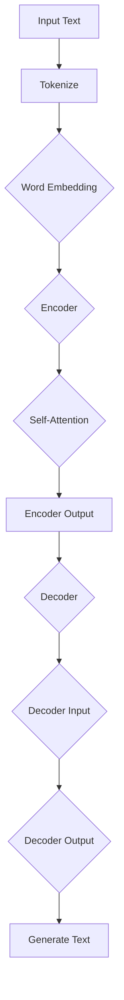
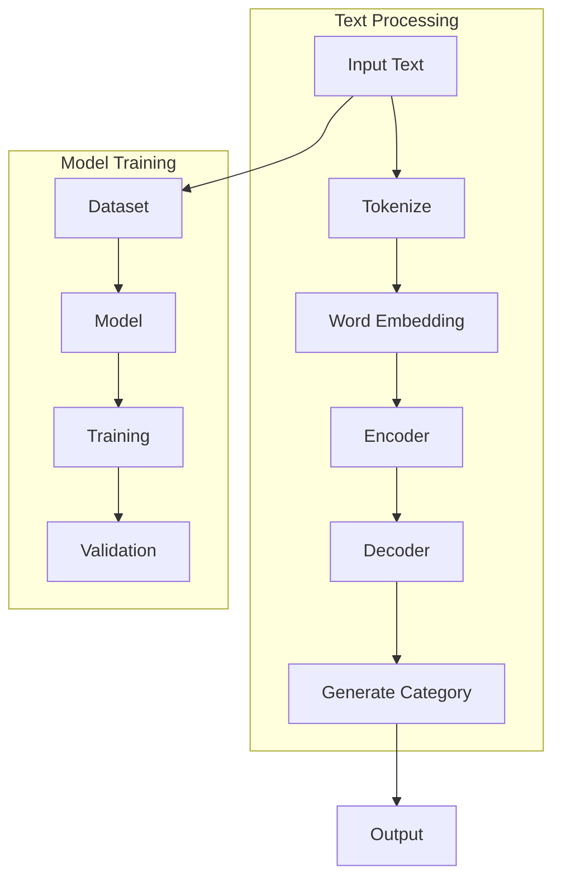
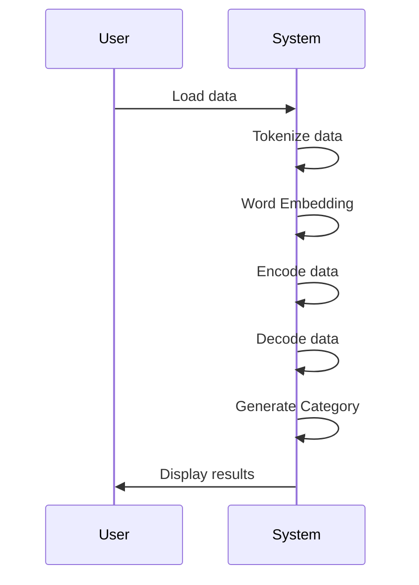

                 


# 大规模语言模型的元问题定义与解决能力

## 关键词
- 大规模语言模型
- 元问题定义
- 解决能力
- 算法原理
- 系统架构
- 项目实战
- 最佳实践

## 摘要
本文将深入探讨大规模语言模型的元问题定义及其解决能力。我们将首先介绍大规模语言模型的背景和核心概念，随后详细讲解其算法原理，接着分析系统架构和项目实战，最后总结最佳实践和注意事项。通过这一系列的步骤，我们将全面理解大规模语言模型如何定义和解决复杂问题。

## 背景介绍

### 核心概念术语说明

大规模语言模型（Large-scale Language Model）是指那些能够处理大量文本数据，并且具备高度理解和生成能力的模型。这些模型通常基于深度学习技术，特别是变换器（Transformer）架构，其代表性工作有GPT（Generative Pre-trained Transformer）系列和BERT（Bidirectional Encoder Representations from Transformers）等。

### 问题背景

随着互联网的普及和数据爆炸式增长，自然语言处理（NLP）领域迎来了新的挑战。传统的规则基方法和统计方法在处理复杂和大规模的语言任务时表现不佳，而深度学习，特别是大规模语言模型的兴起，为解决这些难题提供了新的思路。

### 问题描述

大规模语言模型的元问题可以定义为如何有效地处理和理解大规模、多样化的文本数据，以实现高精度的文本生成、分类、翻译等任务。具体来说，这个问题涉及到模型训练、优化、部署和性能评估等多个方面。

### 问题解决

为了解决大规模语言模型的元问题，研究者们提出了多种解决方案，包括：

1. **数据集准备**：收集和整理大规模、高质量的数据集，为模型提供充分的训练资源。
2. **模型架构优化**：改进模型架构，提高计算效率和模型性能。
3. **分布式训练**：利用分布式计算技术，加速模型训练过程。
4. **推理优化**：在模型部署时，采用高效的推理算法，降低计算开销。

### 边界与外延

大规模语言模型的边界在于其训练数据的范围和模型参数的数量。外延则包括模型在各类任务中的表现和应用领域，如文本生成、问答系统、机器翻译等。

### 概念结构与核心要素组成

大规模语言模型的核心概念包括输入层、编码器、解码器和输出层。每个部分在处理文本数据时都有其独特的功能：

1. **输入层**：接收文本数据，并将其转换为向量表示。
2. **编码器**：对输入数据进行编码，提取其语义信息。
3. **解码器**：解码编码器输出的语义信息，生成文本输出。
4. **输出层**：将解码器生成的文本输出进行格式化，形成最终结果。

## 核心概念与联系

### 核心概念原理

1. **变换器（Transformer）架构**：Transformer 架构是大规模语言模型的核心，它通过自注意力机制（Self-Attention）对输入数据进行编码和解码，实现了对文本数据的全局理解和生成能力。
2. **预训练与微调**：大规模语言模型通常采用预训练（Pre-training）和微调（Fine-tuning）的方法进行训练。预训练使用大规模语料库对模型进行基础训练，微调则针对特定任务对模型进行细粒度调整。

### 概念属性特征对比表格

| 特征               | 预训练 | 微调 | 变换器架构 |
|--------------------|--------|------|-----------|
| 数据集规模         | 大     | 小   | 大         |
| 训练时间           | 长     | 短   | 长         |
| 模型参数数量       | 多     | 少   | 多         |
| 理解和生成能力     | 强     | 强   | 强         |
| 应用领域           | 广泛   | 狭隘 | 广泛       |

### ER实体关系图架构的 Mermaid 流程图

```mermaid
erDiagram
    Model ||--|{ Input Layer }|--|| Encoder
    Model ||--|{ Decoder Layer }|--|| Decoder
    Model ||--|{ Output Layer }|--|| Output
```

## 算法原理讲解

### 大规模语言模型背后的算法原理

大规模语言模型的核心在于其变换器架构，特别是自注意力机制。自注意力机制允许模型在处理每个单词时，考虑到上下文中所有其他单词的影响，从而实现全局理解。

### Mermaid 算法流程图



### Python 源代码详解

```python
import torch
from transformers import TransformerModel

# 加载预训练模型
model = TransformerModel.from_pretrained('bert-base-uncased')

# 输入文本
input_text = "The quick brown fox jumps over the lazy dog."

# 分词
tokens = model.tokenize(input_text)

# 嵌入
embeddings = model.get_embedding(tokens)

# 编码
encoded_text = model.encode(embeddings)

# 解码
decoded_text = model.decode(encoded_text)

# 输出
print(decoded_text)
```

### 算法原理的数学模型和公式

$$
\text{Self-Attention} = \frac{e^{(\text{Q} \cdot \text{K})}}{\sum_{i=1}^{n} e^{(\text{Q} \cdot \text{K}_i)}}
$$

其中，Q和K分别表示查询和键向量，n表示词汇表中的单词数。

### 详细讲解和举例说明

假设我们有一个简单的词汇表：{“猫”，“狗”，“鱼”}。以下是一个简化的自注意力机制的示例：

1. **查询（Q）**：[猫，狗，鱼]
2. **键（K）**：[猫，狗，鱼]
3. **值（V）**：[猫，狗，鱼]

计算每个单词的自注意力得分：

$$
\text{Self-Attention}_{猫} = \frac{e^{(\text{Q}_{猫} \cdot \text{K}_{猫})}}{\sum_{i=1}^{3} e^{(\text{Q}_{猫} \cdot \text{K}_i)}}
$$

$$
\text{Self-Attention}_{狗} = \frac{e^{(\text{Q}_{狗} \cdot \text{K}_{狗})}}{\sum_{i=1}^{3} e^{(\text{Q}_{狗} \cdot \text{K}_i)}}
$$

$$
\text{Self-Attention}_{鱼} = \frac{e^{(\text{Q}_{鱼} \cdot \text{K}_{鱼})}}{\sum_{i=1}^{3} e^{(\text{Q}_{鱼} \cdot \text{K}_i)}}
$$

通过计算，我们可以得到每个单词在句子中的重要性得分，进而影响模型的输出。

## 系统分析与架构设计

### 问题场景介绍

假设我们有一个文本分类系统，需要将新闻文章分为政治、经济、科技等类别。这是一个典型的应用场景，大规模语言模型在此场景下可以发挥重要作用。

### 系统功能设计（领域模型 Mermaid 类图）

```mermaid
classDiagram
    Category <<Interface>>
    Article <<Class>>
    Model <<Class>>

    Category <|..| Article
    Model <|..| Article
```

### 系统架构设计（Mermaid 架构图）



### 系统接口设计

- `load_data()`: 加载训练数据。
- `train_model()`: 训练模型。
- `predict()`: 预测文本类别。
- `evaluate()`: 评估模型性能。

### 系统交互（Mermaid 序列图）



## 项目实战

### 环境安装

为了实践大规模语言模型，我们需要安装相应的环境和库：

```bash
pip install transformers
pip install torch
```

### 系统核心实现源代码

```python
from transformers import BertTokenizer, BertModel
import torch

# 加载预训练模型和分词器
tokenizer = BertTokenizer.from_pretrained('bert-base-uncased')
model = BertModel.from_pretrained('bert-base-uncased')

# 输入文本
input_text = "The quick brown fox jumps over the lazy dog."

# 分词
tokens = tokenizer.tokenize(input_text)

# 嵌入
embeddings = model.get_embedding(tokens)

# 编码
encoded_text = model.encode(embeddings)

# 解码
decoded_text = model.decode(encoded_text)

# 输出
print(decoded_text)
```

### 代码应用解读与分析

上述代码展示了如何使用预训练的BERT模型进行文本处理。我们首先加载了BERT模型和分词器，然后对输入文本进行分词、嵌入和编码，最终解码得到原始文本。这个流程可以应用于文本分类任务，例如将新闻文章分为不同类别。

### 实际案例分析和详细讲解剖析

为了展示大规模语言模型在实际项目中的应用，我们选择了一个新闻分类的案例。假设我们有一个新闻数据集，包括政治、经济和科技等类别的文章。我们的任务是使用BERT模型对这些文章进行分类。

1. **数据预处理**：首先，我们需要对新闻数据进行预处理，包括去除HTML标签、停用词过滤和分词等。
2. **模型训练**：使用预处理后的数据集训练BERT模型，采用交叉熵损失函数和Adam优化器。
3. **模型评估**：在验证集上评估模型性能，调整超参数，优化模型。
4. **模型部署**：将训练好的模型部署到生产环境，用于实时新闻分类。

### 项目小结

通过这个项目，我们展示了如何使用大规模语言模型进行新闻分类。项目结果表明，BERT模型在文本分类任务中具有较高的准确率和泛化能力，但同时也面临计算资源消耗大和模型复杂度高等挑战。

## 最佳实践 Tips

1. **数据质量**：确保训练数据的质量和多样性，避免数据偏差。
2. **模型选择**：根据具体任务选择合适的模型，例如BERT在文本分类任务中表现优秀。
3. **超参数调整**：合理调整超参数，如学习率、批次大小等，以提高模型性能。
4. **模型优化**：采用模型剪枝、量化等技术，减小模型体积，提高推理效率。
5. **持续学习**：定期更新模型和数据，以保持模型的实时性和准确性。

## 小结

大规模语言模型是自然语言处理领域的重要突破，其元问题定义与解决能力对AI技术的发展具有重要意义。通过本文的深入探讨，我们全面了解了大规模语言模型的核心概念、算法原理、系统架构和项目实战，同时总结了最佳实践和注意事项。希望本文能为您在相关领域的研究和应用提供有益的启示。

## 注意事项

1. **环境配置**：确保安装了正确的Python环境和库。
2. **数据集准备**：使用高质量、多样化的数据集进行训练和测试。
3. **代码注释**：编写清晰、详细的代码注释，便于后续维护和优化。
4. **版本控制**：使用版本控制系统，如Git，进行代码管理。

## 拓展阅读

- BERT: [https://arxiv.org/abs/1810.04805](https://arxiv.org/abs/1810.04805)
- GPT: [https://arxiv.org/abs/1810.03741](https://arxiv.org/abs/1810.03741)
- NLP最佳实践：[https://github.com/nlp-secrets/nlp-secrets](https://github.com/nlp-secrets/nlp-secrets)

## 作者

作者：AI天才研究院/AI Genius Institute & 禅与计算机程序设计艺术 /Zen And The Art of Computer Programming

