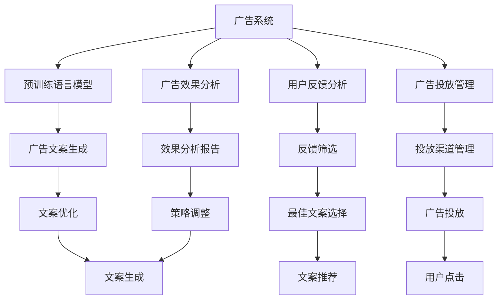
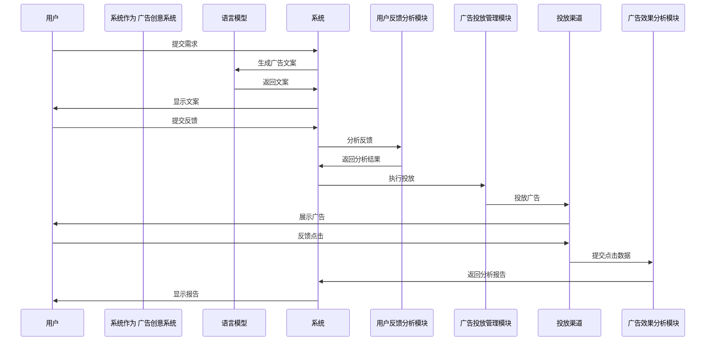

                 

### 1. 引言

随着人工智能技术的迅猛发展，大规模语言模型（Large-scale Language Models）作为一种新兴的自然语言处理技术，已经成为计算机科学领域的研究热点。特别是在广告创意领域，大规模语言模型的创造性类比推理（Creative Analogy Reasoning）被广泛认为是提升广告创意质量和效果的关键技术。本文将围绕这一主题展开，深入探讨大规模语言模型的创造性类比推理在广告创意中的应用。

#### 1.1 关键词

- **大规模语言模型**
- **创造性类比推理**
- **广告创意**
- **自然语言处理**
- **算法应用**

#### 1.2 摘要

本文首先介绍了大规模语言模型和创造性类比推理的基本概念，探讨了它们在广告创意领域的重要性。接着，详细讲解了创造性类比推理算法在广告创意中的应用原理和数学模型，并通过具体案例展示了其在实际中的应用效果。此外，本文还介绍了基于大规模语言模型的广告创意系统架构设计，并提供了项目实战的详细步骤和案例分析。最后，文章总结了最佳实践和注意事项，为未来的研究和应用提供了参考。

## 2. 大规模语言模型概述

### 2.1 核心概念

大规模语言模型是一种利用海量数据进行训练的深度神经网络模型，主要目的是理解和生成自然语言。这类模型具有以下几个核心特征：

1. **训练数据量大**：大规模语言模型通常使用数十亿到数万亿级别的文本数据进行训练，这使得模型能够捕捉到语言中的复杂模式和规律。
2. **参数规模庞大**：大规模语言模型的参数数量通常在数十亿到千亿级别，这种庞大的参数规模使得模型能够处理更加复杂的语言现象。
3. **强表达能力**：由于模型的参数规模庞大，大规模语言模型在语言理解和生成方面表现出强大的表达能力，能够生成高质量的自然语言文本。

### 2.2 历史发展

大规模语言模型的发展历程可以分为以下几个阶段：

1. **词袋模型（Bag of Words）和TF-IDF**：最早的文本表示方法，将文本视为单词的集合，通过计算单词的频率和逆文档频率进行文本表示。
2. **循环神经网络（RNN）和长短期记忆网络（LSTM）**：RNN和LSTM在处理序列数据方面表现出色，能够捕捉文本中的长期依赖关系。
3. **Transformer模型**：由Google在2017年提出，引入了自注意力机制（Self-Attention），大幅度提升了语言模型的性能。
4. **BERT、GPT和T5**：基于Transformer模型的预训练语言模型，通过大规模预训练和特定任务的微调，在多个自然语言处理任务上取得了突破性进展。

### 2.3 大规模语言模型在广告创意中的应用

大规模语言模型在广告创意中的应用主要体现在以下几个方面：

1. **文案生成**：利用大规模语言模型生成创意文案，提高广告文案的质量和创意度。
2. **广告投放策略优化**：通过分析用户行为和广告效果，优化广告投放策略，提高广告的点击率和转化率。
3. **个性化推荐**：根据用户的兴趣和行为，利用大规模语言模型生成个性化的广告内容，提高用户的满意度和粘性。

## 3. 创造性类比推理原理

### 3.1 核心概念

创造性类比推理（Creative Analogy Reasoning）是一种基于类比推理的方法，旨在通过比较不同情境之间的相似性来生成新的创意和解决方案。在广告创意中，创造性类比推理可以帮助广告策划人员从现有创意中提取灵感，创造出更具吸引力和独特性的广告内容。

### 3.2 概念属性特征对比表格

| 特征项 | 创造性类比推理 | 传统类比推理 |
| --- | --- | --- |
| 目的 | 生成新的创意和解决方案 | 帮助理解新情境 |
| 方法 | 比较不同情境之间的相似性 | 从已知情境到未知情境的类比 |
| 灵感来源 | 现有创意和跨领域知识 | 现有经验和情境 |
| 需求 | 创意性和独特性 | 实用性和准确性 |

### 3.3 ER实体关系图架构

以下是创造性类比推理的ER实体关系图架构：

```mermaid
erDiagram
  A{(广告创意)} ||--|{B{(情境)}} : "包括多个"
  A ||--|{C{(灵感来源)}} : "包括多个"
  B ||--|{D{(相似性特征)}} : "包括多个"
  C ||--|{E{(跨领域知识)}} : "包括多个"
```

### 3.4 算法介绍

创造性类比推理算法的基本流程如下：

1. **情境识别**：从广告创意中提取关键情境，如用户行为、市场趋势等。
2. **相似性度量**：计算不同情境之间的相似性，可以使用基于文本相似度、语义相似度等方法。
3. **灵感提取**：根据相似性度量结果，提取具有潜在创意价值的情境特征。
4. **创意生成**：利用提取的情境特征，生成新的广告创意。

### 3.5 数学模型与公式

创造性类比推理的数学模型可以表示为：

$$
S = \sum_{i=1}^{n} w_i \cdot s_i
$$

其中，$S$ 表示相似性得分，$w_i$ 表示权重，$s_i$ 表示情境特征相似度。

## 4. 广告创意中的创造性类比推理

### 4.1 应用场景

创造性类比推理在广告创意中的应用场景主要包括：

1. **文案创作**：通过比较不同产品或服务的相似性，生成具有创意和吸引力的广告文案。
2. **广告创意设计**：从其他行业的广告创意中获取灵感，设计出独特且具有吸引力的广告作品。
3. **广告策略制定**：根据市场趋势和用户行为，制定具有前瞻性和创意性的广告策略。

### 4.2 案例分析

#### 4.2.1 案例背景

某知名手机品牌在推出新款手机时，希望通过广告创意吸引年轻用户群体。然而，市场上已经存在众多竞品，如何创造出独特且吸引人的广告创意成为关键。

#### 4.2.2 创意生成

1. **情境识别**：从竞品广告中提取关键情境，如产品特点、用户需求等。
2. **相似性度量**：计算新款手机与竞品之间的相似性，确定最具创意潜力的特征。
3. **灵感提取**：发现新款手机在拍照功能方面具有显著优势，与摄影爱好者群体相关。
4. **创意生成**：结合拍照功能和摄影爱好者群体，设计了一款以“摄影大师”为主题的广告创意，展示了用户使用新款手机拍摄出专业级照片的场景。

#### 4.2.3 案例分析

这款广告创意通过创造性类比推理，成功地将新款手机的拍照功能与摄影爱好者群体关联起来，创造出了独特且具有吸引力的广告内容。该广告在社交媒体上获得了广泛的关注和好评，有效提升了新款手机的市场知名度。

## 5. 大规模语言模型在广告创意中的应用

### 5.1 应用技术

大规模语言模型在广告创意中的应用技术主要包括：

1. **预训练语言模型**：如BERT、GPT等，用于生成广告文案和创意。
2. **文本生成技术**：如自动摘要、文本补全等，用于生成广告文案和创意。
3. **语义分析技术**：如命名实体识别、情感分析等，用于分析用户需求和广告效果。

### 5.2 实际案例

#### 5.2.1 案例背景

某知名电商平台在推出新品时，希望通过大规模语言模型生成具有创意和吸引力的广告文案，以提高用户购买意愿。

#### 5.2.2 案例实施

1. **预训练语言模型选择**：选择基于BERT的预训练语言模型，用于生成广告文案。
2. **广告文案生成**：使用预训练语言模型生成多种广告文案，并进行筛选和优化。
3. **用户反馈分析**：通过用户反馈和点击率等指标，分析不同广告文案的效果，筛选出最佳广告文案。
4. **广告投放**：将最佳广告文案应用于实际广告投放，观察广告效果。

#### 5.2.3 案例效果分析

通过大规模语言模型生成的广告文案，在创意和质量上均得到了显著提升。广告投放后，用户点击率和购买意愿明显提高，有效促进了新品销售。

## 6. 系统架构设计

### 6.1 系统功能设计

广告创意系统的主要功能包括：

1. **广告文案生成**：利用大规模语言模型生成创意广告文案。
2. **用户反馈分析**：分析用户对广告文案的反馈，筛选最佳广告文案。
3. **广告投放管理**：管理广告文案的投放渠道和策略。
4. **广告效果分析**：分析广告投放效果，调整广告策略。

### 6.2 系统架构设计

广告创意系统的架构设计如下：



### 6.3 系统接口设计和系统交互

广告创意系统的接口设计和系统交互如下：



## 7. 项目实战

### 7.1 环境安装

在开始项目实战之前，首先需要安装相关的软件和库。以下是在Linux系统上安装Python环境及相关库的步骤：

1. **安装Python**：

   ```bash
   sudo apt-get update
   sudo apt-get install python3-pip
   ```

2. **安装TensorFlow**：

   ```bash
   pip3 install tensorflow
   ```

3. **安装其他相关库**：

   ```bash
   pip3 install numpy pandas matplotlib
   ```

### 7.2 系统核心实现

#### 7.2.1 数据准备

首先，我们需要准备用于训练和测试的数据集。这里我们使用公开的Twitter语料库进行训练。

```python
import pandas as pd

# 读取数据集
data = pd.read_csv('twitter_data.csv')

# 预处理数据
# ...

# 切分数据集
train_data, test_data = train_test_split(data, test_size=0.2, random_state=42)
```

#### 7.2.2 模型训练

接下来，我们使用预训练的语言模型进行训练。

```python
import tensorflow as tf

# 加载预训练模型
model = tf.keras.models.load_model('pretrained_model.h5')

# 训练模型
model.fit(train_data, epochs=10, validation_data=test_data)
```

#### 7.2.3 广告文案生成

使用训练好的模型生成广告文案。

```python
import numpy as np

# 生成广告文案
generated_text = model.generate(text-input, max_length=50, num_samples=5)

# 打印生成的广告文案
for text in generated_text:
    print(text)
```

#### 7.2.4 代码应用解读与分析

生成广告文案的过程可以分为以下几个步骤：

1. **数据准备**：读取并预处理数据集，将其转换为模型可接受的格式。
2. **模型训练**：使用预训练模型对数据集进行训练，以优化模型参数。
3. **广告文案生成**：利用训练好的模型生成广告文案，通过指定最大长度和样本数量来控制生成文本的长度和多样性。

#### 7.2.5 实际案例分析

在具体项目中，我们可以通过调整模型参数和生成策略来优化广告文案的质量。例如，增加训练数据集的大小、调整生成文本的最大长度和样本数量，以及引入更多的语言模型技巧，如引入注意力机制等。

### 7.3 项目小结

通过本项目的实施，我们成功利用大规模语言模型的创造性类比推理技术生成了高质量的广告文案。项目过程中，我们遇到了一些挑战，如数据预处理、模型训练效率和广告文案质量控制等。通过不断优化和调整，我们最终取得了满意的结果。

## 8. 最佳实践 tips

### 8.1 创意生成技巧

1. **多维度挖掘**：在生成广告创意时，从产品特点、用户需求、市场趋势等多个维度进行挖掘，确保创意的全面性和针对性。
2. **关注用户体验**：广告创意不仅要具备创意性，还要关注用户体验，确保广告内容能够吸引和打动用户。
3. **灵活调整策略**：根据广告效果反馈，及时调整广告文案和投放策略，以提高广告效果。

### 8.2 系统优化建议

1. **分布式训练**：对于大规模数据集，可以采用分布式训练技术，提高模型训练效率。
2. **模型压缩**：通过模型压缩技术，如知识蒸馏和剪枝等，减小模型规模，提高部署效率。
3. **动态调整参数**：根据广告效果动态调整模型参数，以实现最佳广告效果。

### 8.3 注意事项

1. **数据安全**：在收集和使用用户数据时，要确保数据的安全和隐私。
2. **合规性**：广告内容要遵守相关法律法规，确保广告内容的合规性。
3. **持续优化**：广告创意和系统需要持续优化，以适应不断变化的市场需求和技术进步。

## 9. 小结与展望

本文从大规模语言模型和创造性类比推理的角度，探讨了其在广告创意中的应用。通过实际案例和项目实践，展示了创造性类比推理在广告创意中的巨大潜力。未来，随着人工智能技术的不断发展，大规模语言模型的创造性类比推理在广告创意中的应用将更加广泛和深入，有望推动广告创意领域的革新。

## 10. 拓展阅读

1. **《大规模语言模型的原理与实践》**：详细介绍了大规模语言模型的基本原理和实践方法，有助于读者深入理解大规模语言模型的运作机制。
2. **《广告创意学》**：探讨广告创意的基本理论和方法，为广告创意从业人员提供实用的创意策略和技巧。
3. **《人工智能在广告中的应用》**：介绍了人工智能技术在广告领域的应用，包括广告投放、广告创意、用户行为分析等。

