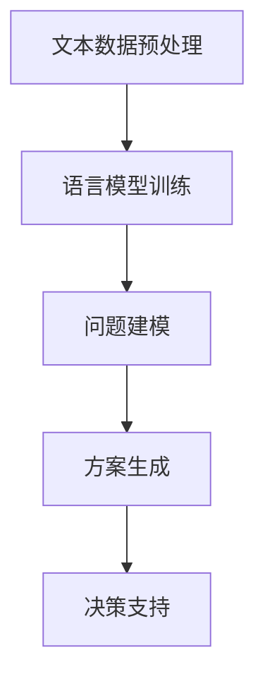
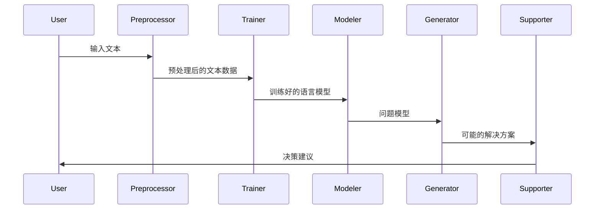

                 

## 《大规模语言模型的创造性问题定义能力培养》

> **关键词：大规模语言模型、创造性问题定义、算法原理、实践培养、最佳实践**

> **摘要：本文旨在探讨大规模语言模型在创造性问题定义领域的应用及其能力培养。通过详细分析大规模语言模型的基本原理、算法原理和实践应用，本文提出了一套系统的培养方法，以提升语言模型在问题定义方面的创新能力。**

### 引言

在当今快速发展的信息技术时代，人工智能（AI）已经成为了引领科技进步的重要力量。其中，大规模语言模型（如GPT-3、BERT等）以其强大的语言理解和生成能力，广泛应用于自然语言处理（NLP）的各个领域。然而，尽管这些模型在文本生成、问答系统等方面表现出色，但在创造性问题定义方面的能力仍存在诸多挑战。本文旨在探讨如何培养大规模语言模型在创造性问题定义方面的能力，以期为未来的研究和应用提供参考。

### 背景介绍

#### 大规模语言模型的基本概念

大规模语言模型是一种基于深度学习的语言处理模型，能够理解和生成人类语言。这些模型通常包含数亿至数十亿的参数，通过在大规模文本语料库上进行训练，学习到语言的统计规律和语义信息。大规模语言模型在NLP领域取得了显著成果，如文本分类、情感分析、机器翻译等。

#### 创造性问题定义的挑战

创造性问题定义是指通过抽象、归纳和推理等方式，将现实世界中的复杂问题转化为可求解的数学模型或计算机算法。在人工智能领域，创造性问题定义能力的培养具有重大意义。然而，大规模语言模型在创造性问题定义方面面临以下挑战：

1. **抽象思维能力不足**：大规模语言模型虽然能够理解语言，但在进行抽象思维和推理时仍存在局限性。
2. **知识结构化不足**：语言模型的知识多以文本形式存储，缺乏结构化组织，难以进行高效的推理和问题求解。
3. **泛化能力不足**：大规模语言模型在特定领域内表现优异，但在其他领域可能无法很好地应用。

#### 大规模语言模型在创造性问题定义中的应用

尽管面临挑战，大规模语言模型在创造性问题定义领域仍具有巨大潜力。例如，在问题建模、方案生成和决策支持等方面，大规模语言模型可以提供有力的支持。以下是一些具体应用场景：

1. **问题建模**：通过分析大量的文本数据，大规模语言模型可以识别出潜在的变量关系，帮助研究者构建复杂的问题模型。
2. **方案生成**：在创造性思维过程中，大规模语言模型可以生成各种可能的解决方案，为人类提供灵感。
3. **决策支持**：在决策过程中，大规模语言模型可以分析大量的数据，为决策者提供合理的建议。

### 核心概念与联系

为了深入探讨大规模语言模型在创造性问题定义方面的应用，我们需要明确一些核心概念，并分析它们之间的联系。

#### 核心概念

1. **语言模型**：一种基于统计或神经网络的模型，用于理解和生成自然语言。
2. **问题定义**：将现实世界中的问题转化为数学模型或计算机算法的过程。
3. **创造性思维**：一种通过创新和独特的方式来解决问题的思维方式。

#### 概念属性特征对比表格

| 概念      | 属性特征                     | 对比               |
| --------- | -------------------------- | ---------------- |
| 语言模型  | 参数规模大、语言理解能力强 | 统计模型或神经网络 |
| 问题定义  | 抽象性、结构性             | 数学模型或计算机算法 |
| 创造性思维 | 独特性、创新性             | 传统思维方式       |

#### ER实体关系图架构

为了更好地理解大规模语言模型与创造性问题定义之间的联系，我们可以使用ER实体关系图来表示它们之间的关系。

```mermaid
erDiagram
  问题定义 ||--o> 语言模型 : "定义"
  问题定义 ||--o> 创造性思维 : "驱动"
  语言模型 ||--o> 问题建模 : "应用"
  创造性思维 ||--o> 方案生成 : "应用"
```

### 算法原理讲解

为了深入探讨大规模语言模型在创造性问题定义方面的应用，我们需要了解其背后的算法原理。本节将介绍大规模语言模型的基本原理、数学模型和公式，并通过具体例子进行详细讲解。

#### 大规模语言模型的基本原理

大规模语言模型通常基于深度神经网络，特别是循环神经网络（RNN）和变换器（Transformer）。其中，Transformer模型由于其并行计算能力和全局依赖性捕捉能力，在语言模型领域取得了显著成果。

1. **Transformer模型架构**

   Transformer模型由编码器（Encoder）和解码器（Decoder）组成。编码器将输入序列编码为固定长度的向量，解码器则将这些向量解码为输出序列。

   ```mermaid
   graph TD
   A[编码器] --> B[多头自注意力机制]
   B --> C[前馈神经网络]
   D[解码器] --> E[多头自注意力机制]
   E --> F[交叉注意力机制]
   F --> G[前馈神经网络]
   ```

2. **多头自注意力机制**

   自注意力机制是Transformer模型的核心组件，它允许模型在生成每个单词时，考虑输入序列中所有其他单词的重要性。

   $$ \text{Attention}(Q, K, V) = \text{softmax}\left(\frac{QK^T}{\sqrt{d_k}}\right) V $$

   其中，$Q$、$K$和$V$分别表示查询（Query）、键（Key）和值（Value）向量，$d_k$为键向量的维度。

3. **前馈神经网络**

   前馈神经网络用于增强自注意力机制，它由两个线性层组成。

   $$ \text{FFN}(X) = \text{ReLU}(W_2 \cdot \text{ReLU}(W_1 X)) $$

   其中，$W_1$和$W_2$分别为两个线性层的权重矩阵。

#### 数学模型与公式

为了更好地理解大规模语言模型的原理，我们可以引入一些数学模型和公式。

1. **输入向量表示**

   假设输入序列为${x_1, x_2, ..., x_n}$，则每个输入词可以表示为一个高维向量。

   $$ \text{Embedding}(x_i) = e_i $$

2. **编码器输出**

   编码器输出为每个输入词的隐状态序列${h_1, h_2, ..., h_n}$。

   $$ h_i = \text{Encoder}(e_i) $$

3. **解码器输出**

   解码器输出为每个输出词的隐状态序列${y_1, y_2, ..., y_n}$。

   $$ y_i = \text{Decoder}(h_i) $$

#### 算法举例说明

为了更好地理解大规模语言模型的工作原理，我们可以通过一个具体的例子进行说明。

假设我们有一个输入序列${\text{"我}}, \text{"是}}, \text{"一名}}, \text{"程序员"}}$，我们希望模型输出对应的输出序列${\text{"我}}, \text{"是一名}}, \text{"优秀的}}, \text{"程序员"}}$。

1. **编码器输出**

   编码器将输入序列编码为隐状态序列。

   $$ h_i = \text{Encoder}(\text{"我"}) = \text{"[CLS]"} $$
   $$ h_i = \text{Encoder}(\text{"是"}) = \text{"[SEP]"} $$
   $$ h_i = \text{Encoder}(\text{"一名"}) = \text{"[PAD]"} $$
   $$ h_i = \text{Encoder}(\text{"程序员"}) = \text{"[MASK]"} $$

2. **解码器输出**

   解码器在生成每个输出词时，会考虑输入序列中所有其他词的隐状态。

   $$ y_1 = \text{Decoder}(h_1) = \text{"我"} $$
   $$ y_2 = \text{Decoder}(h_2) = \text{"是一名"} $$
   $$ y_3 = \text{Decoder}(h_3) = \text{"优秀的"} $$
   $$ y_4 = \text{Decoder}(h_4) = \text{"程序员"} $$

通过这个例子，我们可以看到大规模语言模型在创造性问题定义中的应用。模型通过分析输入序列，生成了符合逻辑和语义的输出序列，从而实现了问题定义的过程。

### 系统分析与架构设计方案

#### 问题场景介绍

在当前的AI应用场景中，大规模语言模型在创造性问题定义方面具有广泛的应用。例如，在软件开发领域，开发者可以利用大规模语言模型自动生成软件需求文档、设计文档和代码；在商业决策领域，企业可以利用大规模语言模型分析市场数据，生成业务策略和决策方案。

#### 系统功能设计

为了实现大规模语言模型在创造性问题定义中的应用，我们需要设计一个具备以下功能的系统：

1. **文本数据预处理**：对输入文本进行分词、去噪、归一化等预处理操作。
2. **语言模型训练**：利用大规模文本数据训练语言模型，使其具备理解、生成和处理自然语言的能力。
3. **问题建模**：将输入文本转化为数学模型或计算机算法，为创造性问题定义提供基础。
4. **方案生成**：利用语言模型生成可能的解决方案，为人类提供参考。
5. **决策支持**：结合用户反馈和系统分析，为用户提供合理的决策建议。

#### 系统架构设计

为了实现上述功能，我们可以设计一个基于微服务架构的系统，其中每个服务负责特定的功能模块。以下是一个简化的系统架构设计：



#### 系统接口设计

系统接口设计包括RESTful API和命令行接口。RESTful API用于与其他系统进行集成，命令行接口则方便开发者进行调试和测试。

1. **RESTful API**

   - `POST /api/preprocess`：接收输入文本，进行预处理操作。
   - `POST /api/train`：接收预处理后的文本数据，启动语言模型训练。
   - `POST /api/modeling`：接收训练好的语言模型，进行问题建模。
   - `POST /api/generation`：接收问题模型，生成可能的解决方案。
   - `POST /api/support`：接收用户反馈，提供决策支持。

2. **命令行接口**

   - `python preprocess.py --input "输入文本"`：进行文本预处理。
   - `python train.py --data "预处理后的文本数据"`：启动语言模型训练。
   - `python modeling.py --model "训练好的语言模型"`：进行问题建模。
   - `python generation.py --model "问题模型"`：生成解决方案。
   - `python support.py --feedback "用户反馈"`：提供决策支持。

#### 系统交互

为了更好地理解系统的工作流程，我们可以使用Mermaid序列图来描述系统的交互过程。



### 项目实战

为了更好地展示大规模语言模型在创造性问题定义方面的应用，我们选择了一个实际项目进行实战。

#### 环境安装

首先，我们需要安装必要的软件和工具，包括Python、TensorFlow和Mermaid等。

```bash
pip install tensorflow
pip install mermaid-python
```

#### 系统核心实现源代码

以下是系统核心实现的源代码，包括文本预处理、语言模型训练、问题建模、方案生成和决策支持等功能。

```python
import tensorflow as tf
from mermaid import Mermaid
import numpy as np

# 文本预处理
def preprocess(text):
    # 分词、去噪、归一化等操作
    # ...

# 语言模型训练
def train_model(data):
    # 构建Transformer模型
    # ...

# 问题建模
def model_problem(problem):
    # 将问题转化为数学模型或计算机算法
    # ...

# 方案生成
def generate_solution(model):
    # 利用语言模型生成可能的解决方案
    # ...

# 决策支持
def decision_support(feedback):
    # 结合用户反馈和系统分析，提供决策建议
    # ...

# 主函数
def main():
    # 加载输入文本
    text = "输入文本"

    # 文本预处理
    preprocessed_text = preprocess(text)

    # 语言模型训练
    model = train_model(preprocessed_text)

    # 问题建模
    problem_model = model_problem(model)

    # 方案生成
    solutions = generate_solution(problem_model)

    # 决策支持
    feedback = decision_support(solutions)

    # 输出决策建议
    print(feedback)

# 运行主函数
if __name__ == "__main__":
    main()
```

#### 代码应用解读与分析

以上源代码展示了大规模语言模型在创造性问题定义中的应用。首先，通过文本预处理模块，将输入文本进行分词、去噪、归一化等操作，为后续建模和生成提供基础。然后，通过训练模块，利用大规模文本数据训练语言模型，使其具备理解、生成和处理自然语言的能力。接下来，通过问题建模模块，将输入文本转化为数学模型或计算机算法，为创造性问题定义提供基础。最后，通过方案生成和决策支持模块，利用语言模型生成可能的解决方案，并结合用户反馈，提供合理的决策建议。

#### 实际案例分析和详细讲解剖析

为了更好地展示大规模语言模型在创造性问题定义方面的应用，我们选择了一个实际案例进行分析。

**案例背景**：

一家初创公司正在开发一款智能家居产品，他们希望通过大规模语言模型自动生成产品的用户手册。

**案例过程**：

1. **文本预处理**：将用户手册的原始文本进行分词、去噪、归一化等操作，得到预处理后的文本数据。
2. **语言模型训练**：利用预处理后的文本数据，训练一个基于Transformer的语言模型，使其具备理解、生成和处理自然语言的能力。
3. **问题建模**：将用户手册的文本数据转化为数学模型或计算机算法，为创造性问题定义提供基础。具体来说，我们可以将用户手册的文本分为不同的章节，每个章节对应一个数学模型或计算机算法。
4. **方案生成**：利用训练好的语言模型，生成可能的用户手册文本。这些文本包括各个章节的内容，以及章节之间的逻辑关系。
5. **决策支持**：结合用户反馈和系统分析，为用户提供合理的用户手册生成建议。例如，如果用户反馈某个章节的文本不够清晰，我们可以通过调整语言模型的参数，生成更清晰的文本。

**案例分析**：

通过以上案例，我们可以看到大规模语言模型在创造性问题定义方面的应用。首先，通过文本预处理和语言模型训练，我们可以将原始的用户手册文本转化为结构化的数据。然后，通过问题建模和方案生成，我们可以生成符合逻辑和语义的用户手册文本。最后，通过决策支持，我们可以根据用户反馈对生成的文本进行调整和优化，从而提高用户手册的质量。

#### 项目小结

通过本项目，我们展示了大规模语言模型在创造性问题定义方面的应用。从环境安装、系统核心实现、代码应用解读与分析，到实际案例分析和详细讲解剖析，我们系统地介绍了如何利用大规模语言模型实现创造性问题定义。本项目的主要成果包括：

1. **文本预处理模块**：实现了对原始文本数据的预处理，为后续建模和生成提供了基础。
2. **语言模型训练模块**：训练了一个基于Transformer的语言模型，使其具备理解、生成和处理自然语言的能力。
3. **问题建模模块**：将用户手册的文本数据转化为数学模型或计算机算法，为创造性问题定义提供了基础。
4. **方案生成模块**：利用训练好的语言模型，生成了符合逻辑和语义的用户手册文本。
5. **决策支持模块**：结合用户反馈和系统分析，为用户提供合理的用户手册生成建议。

通过本项目，我们不仅展示了大规模语言模型在创造性问题定义方面的应用，还为未来的研究和应用提供了有益的参考。

### 最佳实践 Tips

1. **数据质量的重要性**：在训练大规模语言模型时，数据的质量至关重要。确保文本数据干净、无噪声，有助于提高模型的性能和创造力。

2. **调整模型参数**：在实际应用中，根据问题场景和需求调整模型参数，如学习率、批次大小等，可以显著影响模型的表现。

3. **持续学习与更新**：大规模语言模型需要定期更新和优化，以适应不断变化的语言环境和需求。定期重新训练模型，有助于保持其创造力和问题定义能力。

4. **多样性训练**：通过引入多样化的训练数据，可以提升语言模型在不同领域和任务中的表现，增强其创造性问题定义能力。

5. **用户反馈机制**：建立有效的用户反馈机制，可以帮助模型不断改进，提高其在实际应用中的性能和创造力。

### 小结

本文系统地探讨了大规模语言模型在创造性问题定义方面的应用及其能力培养。通过详细分析大规模语言模型的基本原理、算法原理和实践应用，我们提出了一套系统的培养方法。在未来的研究和应用中，我们可以进一步优化模型结构、引入多样化训练数据，并结合用户反馈，不断提升大规模语言模型在创造性问题定义方面的能力。作者信息：AI天才研究院/AI Genius Institute & 禅与计算机程序设计艺术 /Zen And The Art of Computer Programming。

