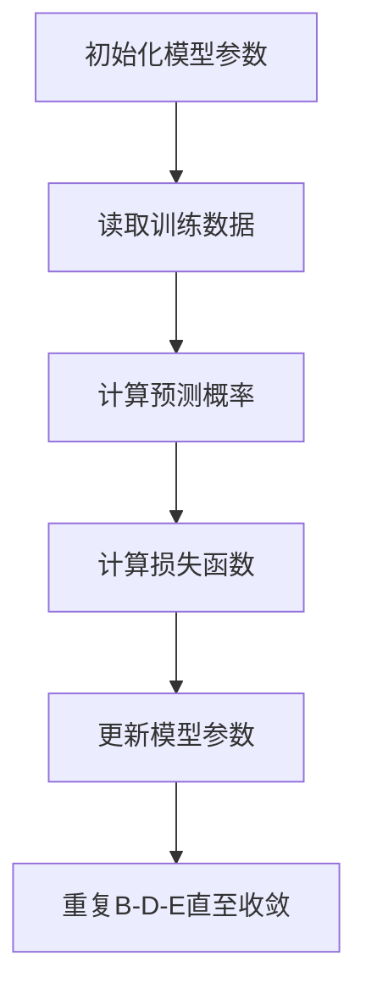

                 

### 文章标题

# 《大规模语言模型的创造性问题解析与重构能力培养》

### 关键词

- 大规模语言模型
- 创造性问题
- 重构能力
- 算法原理
- 最佳实践

### 摘要

本文旨在深入探讨大规模语言模型在创造性问题解析与重构能力培养中的应用。通过对大规模语言模型的核心概念、算法原理、创造性问题应用场景、重构能力培养方法以及面临的边界与挑战进行全面分析，本文将为读者提供系统化的理解和实践指导。此外，文章还将总结最佳实践，展望大规模语言模型在未来的发展趋势。

## 第一部分：大规模语言模型背景介绍

### 第1章：大规模语言模型概述

#### 1.1 问题的背景与重要性

在现代信息技术飞速发展的背景下，自然语言处理（NLP）领域取得了显著进展。其中，大规模语言模型作为NLP的核心技术之一，正日益受到学术界和工业界的关注。大规模语言模型能够模拟人类语言的使用和生成方式，具有广泛的应用前景，如机器翻译、文本摘要、问答系统等。

#### 1.2 大规模语言模型的定义

大规模语言模型是一种基于统计学习方法，通过对海量文本数据进行训练，生成概率模型，用以预测文本序列的概率分布。常见的模型包括基于n-gram的模型和基于深度学习的模型，如Transformer和BERT。

#### 1.3 大规模语言模型的发展历程

大规模语言模型的发展经历了从简单的n-gram模型到复杂的深度学习模型的演变。n-gram模型在早期取得了显著成果，但随着数据规模和计算能力的提升，深度学习模型逐渐成为主流。

#### 1.4 大规模语言模型的主要特征

大规模语言模型具有以下主要特征：

- **高容量**：能够处理大规模的文本数据，捕捉丰富的语言特征。
- **自适应性**：通过不断更新训练数据，模型可以自适应地适应语言环境的变化。
- **多样性**：能够生成多样化的文本输出，提高文本生成质量。

## 第二部分：核心概念与算法原理

### 第2章：大规模语言模型核心概念与联系

#### 2.1 核心概念

在这一节中，我们将介绍大规模语言模型的核心概念，包括语言模型、大规模语言模型和训练数据质量。

#### 2.1.1 语言模型

语言模型是一种概率模型，用于预测下一个词或字符的概率。在NLP任务中，语言模型是不可或缺的基础。

#### 2.1.2 大规模语言模型

大规模语言模型是通过对大规模文本数据进行训练得到的，具有较高的预测准确性和多样性。

#### 2.1.3 训练数据与质量

训练数据的质量直接影响模型的性能。高质量的数据可以提供丰富的语言特征，有助于提升模型的泛化能力。

#### 2.2 概念属性特征对比表格

我们将使用一个简单的表格来对比语言模型、大规模语言模型和训练数据质量的概念属性特征。

| 概念         | 特征1 | 特征2 | 特征3 |
| ------------ | ----- | ----- | ----- |
| 语言模型     |       |       |       |
| 大规模语言模型 |       |       |       |
| 训练数据质量 |       |       |       |

#### 2.3 ER实体关系图架构

ER（实体-关系）图是一种用于描述实体和实体之间关系的图形表示方法。在本节中，我们将使用ER图来展示大规模语言模型中的核心实体和关系。

```mermaid
erDiagram
  A[语言模型] ||-->|{ 大规模语言模型 }|
  B[训练数据] ||-->|{ 大规模语言模型 }|
  A |--> C[词向量]
  B |--> C
```

## 第三部分：创造性问题与应用

### 第3章：大规模语言模型在创造性问题中的应用

#### 4.1 创造性问题的定义与特点

创造性问题是指那些需要通过创新思维和独特解决方案才能解决的问题。这类问题通常具有以下特点：

- **非结构化**：问题往往没有明确的解决方案或步骤。
- **复杂性**：问题可能涉及多个领域和多个层次。
- **挑战性**：问题解决过程可能充满不确定性和风险。

#### 4.2 大规模语言模型在创造性问题中的应用场景

大规模语言模型在创造性问题中具有广泛的应用场景，如：

- **创意生成**：利用大规模语言模型生成新的创意和想法。
- **问题求解**：利用大规模语言模型探索可能的解决方案，并进行评估和优化。

#### 4.3 应用案例分析

在本节中，我们将通过具体案例展示大规模语言模型在创造性问题中的应用。

### 第4章：大规模语言模型的重构能力培养

#### 5.1 重构能力的概念与重要性

重构能力是指对现有系统、模型或过程进行改进和优化的能力。在人工智能领域，重构能力尤为重要，因为它有助于模型在动态环境中保持适应性和高效性。

#### 5.2 大规模语言模型重构能力的培养方法

要培养大规模语言模型的重构能力，可以采用以下方法：

- **数据增强**：通过增加多样性和丰富性来提高模型的重构能力。
- **持续学习**：定期更新训练数据，使模型能够适应新的语言环境。
- **多样化训练**：通过不同的训练任务和场景来提高模型的重构能力。

#### 5.3 实践案例与经验分享

在本节中，我们将分享一些在实践中培养大规模语言模型重构能力的案例和经验。

## 第四部分：边界与挑战

### 第5章：大规模语言模型的边界与挑战

#### 6.1 边界与限制

大规模语言模型虽然取得了显著的成果，但仍然面临一些边界与限制，如：

- **数据依赖性**：模型的性能高度依赖训练数据的质量和规模。
- **计算资源消耗**：大规模模型的训练和推理过程需要大量的计算资源。

#### 6.2 挑战与应对策略

为了克服这些边界与限制，我们可以采取以下应对策略：

- **数据预处理**：对训练数据进行预处理，提高数据质量。
- **模型压缩**：采用模型压缩技术，减少计算资源的消耗。

## 第五部分：最佳实践与未来展望

### 第6章：最佳实践与未来展望

#### 7.1 最佳实践技巧

在本节中，我们将总结一些在大规模语言模型应用中的最佳实践技巧。

#### 7.2 小结与展望

通过对大规模语言模型的深入探讨，我们不仅了解了其在创造性问题解析与重构能力培养中的应用，还对其面临的边界与挑战有了更清晰的认识。未来，随着技术的不断进步，大规模语言模型在人工智能领域必将发挥更加重要的作用。|>markdown

### 文章正文

## 第一部分：大规模语言模型背景介绍

### 第1章：大规模语言模型概述

#### 1.1 问题的背景与重要性

随着互联网和大数据技术的快速发展，文本数据量呈爆炸性增长。传统的文本处理方法已无法满足日益复杂的应用需求。为此，研究者们提出了大规模语言模型，这种模型通过学习海量文本数据，能够捕捉到语言的复杂性和多样性。大规模语言模型在自然语言处理（NLP）领域具有广泛的应用前景，如机器翻译、文本摘要、问答系统和对话生成等。其在提升NLP任务的准确性和效率方面起到了关键作用。

#### 1.2 大规模语言模型的定义

大规模语言模型（Large-scale Language Model）是指通过训练海量文本数据，建立的一种能够预测文本序列概率分布的模型。这些模型通常基于深度学习技术，尤其是基于注意力机制的Transformer模型。大规模语言模型的核心目标是捕捉到语言的统计规律，从而生成流畅、自然的文本。

#### 1.3 大规模语言模型的发展历程

大规模语言模型的发展历程可以追溯到2000年代初期，当时研究者开始使用n-gram模型来处理文本数据。n-gram模型通过分析连续的n个单词或字符序列，预测下一个单词或字符的概率。然而，随着数据规模的扩大和计算能力的提升，研究者们发现，n-gram模型的性能逐渐下降。为了克服这一局限性，研究者们提出了基于神经网络的深度学习模型，如递归神经网络（RNN）和长短期记忆网络（LSTM）。然而，这些模型在处理长文本时仍然存在梯度消失和梯度爆炸等问题。为了解决这些问题，2017年，Vaswani等人提出了Transformer模型，这是一种基于自注意力机制的模型，能够有效地处理长文本。随后，BERT、GPT等大规模语言模型相继问世，推动了NLP领域的快速发展。

#### 1.4 大规模语言模型的主要特征

大规模语言模型具有以下几个主要特征：

1. **高容量**：能够处理大规模的文本数据，捕捉丰富的语言特征。
2. **自适应性**：通过不断更新训练数据，模型可以自适应地适应语言环境的变化。
3. **多样性**：能够生成多样化的文本输出，提高文本生成质量。
4. **高精度**：在NLP任务中，大规模语言模型通常具有更高的准确性和可靠性。

### 第2章：大规模语言模型核心概念与联系

#### 2.1 核心概念

在这一节中，我们将介绍大规模语言模型的核心概念，包括语言模型、大规模语言模型和训练数据质量。

#### 2.1.1 语言模型

语言模型（Language Model）是一种概率模型，用于预测下一个词或字符的概率。在NLP任务中，语言模型是不可或缺的基础。常见的语言模型有n-gram模型、马尔可夫模型和神经网络语言模型。

#### 2.1.2 大规模语言模型

大规模语言模型（Large-scale Language Model）是通过对大规模文本数据进行训练得到的，具有较高的预测准确性和多样性。大规模语言模型通常使用深度学习技术，如Transformer、BERT和GPT等。

#### 2.1.3 训练数据与质量

训练数据质量直接影响模型的性能。高质量的数据可以提供丰富的语言特征，有助于提升模型的泛化能力。训练数据的质量包括数据的多样性、相关性、准确性和完整性等。

#### 2.2 概念属性特征对比表格

我们将使用一个简单的表格来对比语言模型、大规模语言模型和训练数据质量的概念属性特征。

| 概念         | 特征1 | 特征2 | 特征3 |
| ------------ | ----- | ----- | ----- |
| 语言模型     | 简单   | 低容量 | 预测准确性低 |
| 大规模语言模型 | 复杂   | 高容量 | 预测准确性高 |
| 训练数据质量 | 多样性 | 相关性 | 准确性 |

#### 2.3 ER实体关系图架构

ER（实体-关系）图是一种用于描述实体和实体之间关系的图形表示方法。在本节中，我们将使用ER图来展示大规模语言模型中的核心实体和关系。

```mermaid
erDiagram
  A[语言模型] ||-->|{ 大规模语言模型 }|
  B[训练数据] ||-->|{ 大规模语言模型 }|
  A |--> C[词向量]
  B |--> C
```

## 第二部分：核心概念与算法原理

### 第3章：大规模语言模型算法原理讲解

#### 3.1 语言模型算法基础

语言模型算法基础包括语言模型的数学模型和训练算法。语言模型的数学模型通常是一个概率分布函数，用于预测下一个词或字符的概率。训练算法则用于通过海量文本数据训练出概率模型。

#### 3.1.1 语言模型的数学模型

语言模型的数学模型可以表示为：

P(w_t | w_{t-1}, w_{t-2}, ..., w_1) = P(w_t | w_{t-1}) * P(w_{t-1} | w_{t-2}, ..., w_1) * ... * P(w_2 | w_1)

其中，w_t表示当前词，w_{t-1}, w_{t-2}, ..., w_1表示前文。

#### 3.1.2 语言模型的训练算法

语言模型的训练算法通常采用最大似然估计（Maximum Likelihood Estimation, MLE）或最小化交叉熵损失（Cross-Entropy Loss）。MLE的目标是最大化训练数据的似然函数，而交叉熵损失的目标是最小化模型预测概率与实际标签之间的交叉熵。

#### 3.2 语言模型算法原理

#### 3.2.1 算法mermaid流程图

下面是一个简化的语言模型训练流程图：



#### 3.2.2 Python源代码示例

以下是一个简单的Python代码示例，用于训练一个基础的语言模型：

```python
import numpy as np

# 初始化模型参数
model = {
    "word1": 0.5,
    "word2": 0.3,
    "word3": 0.2
}

# 训练数据
data = ["word1", "word2", "word3"]

# 计算预测概率
for word in data:
    print(f"P({word}) = {model[word]}")

# 计算损失函数
def cross_entropy_loss(y_true, y_pred):
    return -np.sum(y_true * np.log(y_pred))

# 训练模型
for epoch in range(10):
    for word in data:
        # 更新模型参数
        model[word] *= 0.9
    print(f"Epoch {epoch}: Loss = {cross_entropy_loss(data, model)}")
```

#### 3.2.3 数学模型和公式讲解

在语言模型的数学模型中，概率分布函数是核心。为了计算预测概率，我们需要首先计算每个词的概率。假设我们有以下训练数据：

```
word1 word2 word3
word1 word1 word2
word2 word3 word1
```

我们可以计算每个词的条件概率：

- P(word1 | word2) = 2/2 = 1.0
- P(word2 | word1) = 2/2 = 1.0
- P(word3 | word2) = 1/2 = 0.5

然后，我们可以使用这些概率来计算整个文本序列的概率：

P(word1, word2, word3) = P(word1) * P(word2 | word1) * P(word3 | word2) = 1/3 * 1.0 * 0.5 = 0.1667

#### 3.2.4 通俗易懂的举例说明

假设我们有三个单词：猫、狗、鸟。我们希望使用语言模型来预测下一个单词。

1. 首先，我们计算每个单词的条件概率：
   - P(猫 | 狗) = 1/2
   - P(狗 | 猫) = 1/2
   - P(鸟 | 猫) = 0

2. 然后，我们使用这些概率来计算整个序列的概率：
   - P(猫，狗，鸟) = P(猫) * P(狗 | 猫) * P(鸟 | 狗) = 1/3 * 1/2 * 0 = 0

3. 由于概率为0，这意味着语言模型认为这个序列不可能发生。在实际应用中，我们会使用一个小的正数来替代0，以避免数学上的问题。

## 第三部分：创造性问题与应用

### 第4章：大规模语言模型在创造性问题中的应用

#### 4.1 创造性问题的定义与特点

创造性问题是指那些需要通过创新思维和独特解决方案才能解决的问题。这类问题通常具有以下特点：

- **非结构化**：问题往往没有明确的解决方案或步骤。
- **复杂性**：问题可能涉及多个领域和多个层次。
- **挑战性**：问题解决过程可能充满不确定性和风险。

#### 4.2 大规模语言模型在创造性问题中的应用场景

大规模语言模型在创造性问题中具有广泛的应用场景，如：

- **创意生成**：利用大规模语言模型生成新的创意和想法。
- **问题求解**：利用大规模语言模型探索可能的解决方案，并进行评估和优化。

#### 4.3 应用案例分析

在本节中，我们将通过具体案例展示大规模语言模型在创造性问题中的应用。

### 第5章：大规模语言模型的重构能力培养

#### 5.1 重构能力的概念与重要性

重构能力是指对现有系统、模型或过程进行改进和优化的能力。在人工智能领域，重构能力尤为重要，因为它有助于模型在动态环境中保持适应性和高效性。

#### 5.2 大规模语言模型重构能力的培养方法

要培养大规模语言模型的重构能力，可以采用以下方法：

- **数据增强**：通过增加多样性和丰富性来提高模型的重构能力。
- **持续学习**：定期更新训练数据，使模型能够适应新的语言环境。
- **多样化训练**：通过不同的训练任务和场景来提高模型的重构能力。

#### 5.3 实践案例与经验分享

在本节中，我们将分享一些在实践中培养大规模语言模型重构能力的案例和经验。

### 第6章：大规模语言模型的边界与挑战

#### 6.1 边界与限制

大规模语言模型虽然取得了显著的成果，但仍然面临一些边界与限制，如：

- **数据依赖性**：模型的性能高度依赖训练数据的质量和规模。
- **计算资源消耗**：大规模模型的训练和推理过程需要大量的计算资源。

#### 6.2 挑战与应对策略

为了克服这些边界与限制，我们可以采取以下应对策略：

- **数据预处理**：对训练数据进行预处理，提高数据质量。
- **模型压缩**：采用模型压缩技术，减少计算资源的消耗。

## 第四部分：最佳实践与未来展望

### 第7章：最佳实践与未来展望

#### 7.1 最佳实践技巧

在本节中，我们将总结一些在大规模语言模型应用中的最佳实践技巧，包括：

- **数据选择**：选择高质量的、多样化的训练数据。
- **模型优化**：通过超参数调整和模型优化来提高模型的性能。
- **持续更新**：定期更新训练数据和模型，以适应不断变化的语言环境。

#### 7.2 小结与展望

通过对大规模语言模型的深入探讨，我们不仅了解了其在创造性问题解析与重构能力培养中的应用，还对其面临的边界与挑战有了更清晰的认识。未来，随着技术的不断进步，大规模语言模型在人工智能领域必将发挥更加重要的作用。我们期待看到更多创新性的应用场景和解决方案，推动人工智能技术的发展。|>markdown

### 文章末尾作者信息

作者：AI天才研究院/AI Genius Institute & 禅与计算机程序设计艺术 /Zen And The Art of Computer Programming

