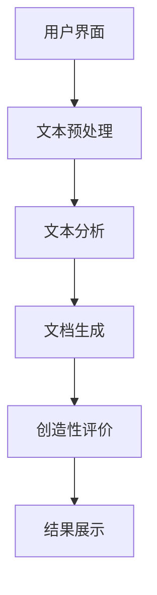
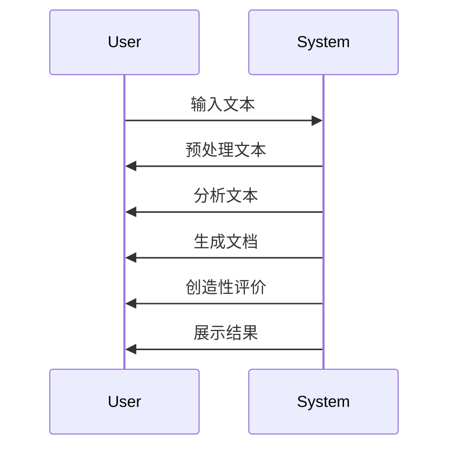

                 

```markdown
## 第1章 问题背景与核心概念

### 1.1 语言模型与大规模语言模型

#### 1.1.1 语言模型的基本原理

**定义：** 语言模型是一种概率模型，用于预测自然语言中的下一个单词或字符序列。它通过分析大量的文本数据，学习到语言中的统计规律和模式，从而能够生成或理解文本。

**工作原理：** 语言模型通常基于统计学习的方法，如朴素贝叶斯、隐马尔可夫模型（HMM）和条件随机场（CRF）。这些模型通过训练数据学习到词频分布、词的共现关系等，然后利用这些信息预测下一个单词或字符。

#### 1.1.2 大规模语言模型的发展

**定义：** 大规模语言模型（如GPT-3、BERT）是训练在数万亿词级别上的深度神经网络模型，具有强大的语言理解和生成能力。

**发展历程：** 从最初的统计语言模型到基于神经网络的序列模型，再到目前的大规模预训练模型，语言模型经历了巨大的发展。预训练模型通过无监督的方式在大量数据上预训练，然后针对特定任务进行微调，大大提升了模型的效果。

#### 1.1.3 大规模语言模型的特点

**参数规模：** 大规模语言模型拥有数亿到数十亿的参数，这使它们能够捕捉到语言中的复杂模式。

**上下文理解：** 这些模型能够理解上下文，不仅生成与当前句子相关的文本，还能够理解句子之间的关联。

**多任务处理：** 大规模语言模型能够同时处理多种语言任务，如文本分类、命名实体识别、机器翻译等。

### 1.2 技术专利生成中的创造性问题

#### 1.2.1 创造性评价标准

在技术专利生成中，创造性是一个关键的评价标准。根据《专利法》的规定，创造性通常被定义为“与现有技术相比，该发明具有突出的实质性特点和显著的进步”。

#### 1.2.2 创造性问题解析

创造性问题的解析涉及对现有技术的深入分析，以及对新技术方案的评估。这需要综合考虑技术领域的发展趋势、现有技术的缺陷以及新技术的潜在改进空间。

#### 1.2.3 大规模语言模型在创造性问题中的应用

大规模语言模型在技术专利生成中的应用主要体现在以下几个方面：

1. **文本分析：** 利用语言模型对技术文档、专利文件等进行深入分析，提取关键信息和创新点。
2. **语义理解：** 通过对上下文的理解，语言模型能够帮助分析人员更准确地理解技术细节和背景。
3. **辅助决策：** 语言模型可以为专利撰写人提供辅助，帮助发现潜在的创造性点，提高专利申请的成功率。

### 1.3 边界与外延

#### 1.3.1 适用范围

大规模语言模型在技术专利生成中的应用并非万能，它主要适用于那些能够通过文本形式进行描述的技术领域。对于一些涉及硬件实现或具体操作步骤的技术，语言模型的效果可能会有限。

#### 1.3.2 非技术领域的应用前景

尽管大规模语言模型在技术专利生成中的应用已经显示出巨大的潜力，但在非技术领域，如艺术创作、医疗诊断等，其应用前景同样广阔。随着模型能力的提升，未来这些领域有望实现更多的自动化和智能化。

### 1.4 概念结构与核心要素组成

#### 1.4.1 大规模语言模型的基本架构

大规模语言模型通常由三个主要部分组成：预训练阶段、微调阶段和应用阶段。预训练阶段在大量数据上训练模型，微调阶段针对具体任务进行模型调整，应用阶段则将模型部署到实际场景中。

#### 1.4.2 技术专利生成的主要流程和环节

技术专利生成的流程包括专利检索、技术分析、方案设计、文档撰写和申请提交等环节。每个环节都对创造性有着不同的要求，需要综合考虑技术细节和创新点。

### 1.5 总结

本章对大规模语言模型在技术专利生成中的应用背景和核心概念进行了介绍。通过分析创造性问题的定义和应用，我们明确了大规模语言模型在技术专利生成中的重要作用。接下来的章节将深入探讨大规模语言模型的算法原理和实际应用，帮助读者更好地理解这一领域的前沿动态。
```markdown
## 第2章 核心概念与联系

### 2.1 大规模语言模型原理

#### 2.1.1 语言模型的定义和分类

**定义：** 语言模型（Language Model，LM）是一种用于预测文本序列的统计模型。它是自然语言处理（NLP）领域的基础，能够根据前面的文本内容预测下一个单词或字符。

**分类：** 语言模型可以分为基于规则的模型、统计模型和神经网络模型。其中，神经网络模型，尤其是深度学习模型，已经成为现代语言模型的主流。

- **基于规则的模型：** 如N-gram模型，它使用前N个单词的历史信息来预测下一个单词。
- **统计模型：** 如隐马尔可夫模型（HMM）和条件随机场（CRF），它们使用概率模型来捕捉单词序列的统计规律。
- **神经网络模型：** 如循环神经网络（RNN）、长短期记忆网络（LSTM）和变换器（Transformer）模型，它们通过深度学习从大量数据中学习复杂的语言模式。

#### 2.1.2 大规模语言模型的工作机制

**预训练阶段：** 大规模语言模型首先在大量的无标签数据上进行预训练。这一阶段的目标是让模型学习到语言的一般统计规律和特征。

**微调阶段：** 预训练后的模型可以在特定任务上进行微调，以适应具体的应用场景。例如，在技术专利生成中，模型可以微调以更好地理解技术文档和专利文件。

**应用阶段：** 微调后的模型可以部署到实际应用中，用于生成文本、回答问题或进行其他NLP任务。

#### 2.1.3 主要的预训练模型

**GPT（Generative Pre-trained Transformer）：** 由OpenAI开发，是一种基于Transformer架构的预训练模型。GPT-3是目前最大的预训练模型之一，拥有1750亿个参数。

**BERT（Bidirectional Encoder Representations from Transformers）：** 由Google开发，是一种双向Transformer模型。BERT通过预训练来学习上下文信息，被广泛用于各种NLP任务。

**T5（Text-To-Text Transfer Transformer）：** 由Google开发，是一种通用的文本转换模型。T5的设计理念是将所有NLP任务转化为文本到文本的转换问题。

### 2.2 技术专利创造性评价

#### 2.2.1 创造性评价的标准和指标

在技术专利领域，创造性评价是专利审查的核心之一。根据《专利法》的规定，创造性通常需要满足以下标准：

- 与现有技术相比，该发明具有突出的实质性特点和显著的进步。
- 对于技术领域的普通技术人员来说，该发明是非显而易见的。

常用的创造性评价指标包括：

- **非显而易见性（Non-obviousness）：** 衡量发明的创新程度，即相对于现有技术，该发明是否显而易见。
- **新颖性（Novelty）：** 专利申请的技术方案在申请日前未在国内外公开。
- **实用性（Utility）：** 专利申请的技术方案能够在产业上应用，并能够产生积极效果。

#### 2.2.2 创造性评价的方法和技术

创造性评价通常涉及以下方法和技术：

- **文献检索：** 通过检索相关的技术文献，分析现有技术的缺陷和不足。
- **案例分析：** 研究类似专利的申请情况，了解审查员对创造性的评判标准。
- **专家评审：** 邀请领域内的专家对专利申请进行评审，提供专业的意见。

### 2.3 大规模语言模型与创造性评价的联系

#### 2.3.1 如何将大规模语言模型应用于技术专利创造性评价

大规模语言模型可以应用于技术专利创造性评价的多个方面：

- **文本分析：** 利用语言模型对专利文件进行文本分析，提取关键词、概念和关系。
- **语义理解：** 通过理解专利文本的语义，评估发明的创新程度和改进空间。
- **辅助决策：** 提供辅助意见，帮助审查员或专利撰写人识别潜在的创造性点。

#### 2.3.2 大规模语言模型在创造性评价中的优势和挑战

**优势：**

- **高效性：** 语言模型可以快速处理大量文本数据，提高评价的效率。
- **准确性：** 通过深度学习，语言模型能够更准确地理解文本的语义和关系。
- **灵活性：** 可以根据不同领域的需求，定制化地调整模型，以适应特定的评价任务。

**挑战：**

- **数据质量：** 语言模型的性能依赖于训练数据的质量。在专利领域，高质量的数据可能相对有限。
- **解释性：** 大规模语言模型的工作原理复杂，其决策过程可能缺乏透明性，难以解释。
- **适应性：** 对于某些特定的评价任务，模型可能需要大量的微调和数据来达到最佳效果。

### 2.4 总结

本章详细介绍了大规模语言模型的基本原理和在技术专利创造性评价中的应用。通过理解语言模型的工作机制，我们可以更好地利用其优势，提升专利创造性评价的效率和准确性。同时，我们也认识到大规模语言模型在应用过程中面临的挑战，需要结合实际情况进行优化和调整。

```markdown
### 2.4.3 大规模语言模型在技术专利生成中的创造性问题解析方法

#### 2.4.3.1 数据预处理

在利用大规模语言模型进行技术专利创造性问题解析之前，首先需要对数据进行预处理。这一步骤至关重要，因为高质量的数据是模型准确性的基础。数据预处理包括以下任务：

- **文本清洗：** 清除文本中的噪声，如HTML标签、特殊符号和不规范的文本格式。
- **分词：** 将文本分割成单词或短语，便于模型理解和分析。
- **去停用词：** 移除常见的停用词（如“的”、“是”、“和”等），因为这些词对语言模型的贡献较小。

#### 2.4.3.2 特征提取

特征提取是大规模语言模型处理文本数据的关键步骤。通过对文本进行编码，将原始文本转化为模型可以处理的数字表示。常用的特征提取方法包括：

- **词嵌入：** 将每个词映射为一个固定大小的向量，如Word2Vec、GloVe等。
- **序列编码：** 将文本序列编码为固定长度的向量，如使用BERT模型。

#### 2.4.3.3 模型选择与训练

在特征提取后，需要选择合适的模型并进行训练。大规模语言模型通常分为预训练和微调两个阶段：

- **预训练：** 在大量无标签数据上训练模型，使其学习到语言的一般规律。例如，使用GPT或BERT进行预训练。
- **微调：** 在特定领域或任务上对模型进行微调，以提高其在该领域的表现。例如，针对技术专利生成任务，可以在专利文件集上进行微调。

#### 2.4.3.4 创造性评价

利用训练好的大规模语言模型，可以对技术专利的创造性进行评价。具体方法如下：

- **文本相似性分析：** 利用模型评估专利文本与现有技术的相似度，判断其是否具有创造性。
- **关键词提取：** 提取专利文本中的关键词和概念，分析这些关键词与现有技术的差异，评估创新程度。
- **语义分析：** 利用模型的语义理解能力，分析专利文本中的逻辑关系和上下文信息，判断其技术方案的独特性和创新性。

#### 2.4.3.5 结果分析与优化

创造性评价的结果需要进行分析和优化，以提高模型的准确性和可靠性。以下是一些常见的方法：

- **错误分析：** 对模型评价错误的专利进行详细分析，识别模型在哪些情况下可能产生偏差。
- **模型调整：** 根据错误分析的结果，调整模型的参数或结构，以提高其性能。
- **数据增强：** 通过引入更多的数据或对现有数据进行再加工，增强模型的训练数据，提高其泛化能力。

### 2.4.4 大规模语言模型在创造性问题解析中的应用案例

为了更好地理解大规模语言模型在创造性问题解析中的应用，以下是一个具体的案例：

**案例背景：** 一家科技公司正在研发一种新型的无线充电技术，并计划申请专利。他们希望利用大规模语言模型对其技术专利的创造性进行评估。

**应用步骤：**

1. **数据收集：** 收集与无线充电相关的技术文献和专利文件，作为模型的训练数据和评价依据。
2. **数据预处理：** 对收集到的文本数据进行清洗、分词和去停用词等预处理操作。
3. **模型训练：** 使用BERT模型对预处理后的数据进行预训练，然后针对特定任务进行微调。
4. **创造性评价：** 利用微调后的BERT模型对新型无线充电技术的专利文本进行评价，分析其与现有技术的差异和相似度。
5. **结果分析：** 分析模型评价结果，识别专利文本中的创新点，并提出优化建议。

通过上述案例，我们可以看到大规模语言模型在技术专利创造性问题解析中的应用是如何进行的。这不仅提高了专利评价的效率，还增强了评价的准确性。

### 2.4.5 总结

大规模语言模型在技术专利生成中的应用为创造性问题的解析带来了新的方法和思路。通过数据预处理、特征提取、模型训练和创造性评价等步骤，我们可以利用大规模语言模型对专利的创造性进行高效、准确的评估。尽管面临一些挑战，但随着技术的不断进步和应用经验的积累，大规模语言模型在技术专利生成中的应用前景将更加广阔。

```markdown
### 2.5 大规模语言模型在技术专利生成中的适用范围

#### 2.5.1 技术专利生成的基本流程

技术专利生成的流程包括以下几个关键步骤：

1. **需求分析：** 分析潜在的技术需求和解决方法。
2. **技术调研：** 检索相关技术文献和专利文件，了解现有技术的状况。
3. **方案设计：** 根据需求和技术调研结果，设计新的技术方案。
4. **文档撰写：** 将技术方案撰写成专利申请文件。
5. **申请提交：** 将专利申请文件提交给专利机构。

#### 2.5.2 大规模语言模型在技术专利生成中的应用场景

大规模语言模型在技术专利生成中的应用场景主要表现在以下几个方面：

1. **需求分析：** 语言模型可以帮助分析人员快速理解技术需求，发现潜在的创新点。
2. **技术调研：** 语言模型可以自动检索和总结相关技术文献和专利文件，提供详细的技术背景信息。
3. **方案设计：** 语言模型可以生成初步的技术方案，帮助设计人员快速构思和优化技术方案。
4. **文档撰写：** 语言模型可以自动撰写专利申请文件，提高撰写效率和质量。
5. **申请提交：** 语言模型可以帮助审查员快速评估专利的创造性，提高审查效率。

#### 2.5.3 非技术领域的应用前景

尽管大规模语言模型在技术专利生成中的应用已经取得了显著成效，但在非技术领域，如艺术创作、医疗诊断等，其应用前景同样广阔。例如：

1. **艺术创作：** 语言模型可以生成诗歌、故事、音乐等艺术作品，为艺术家提供新的创作灵感。
2. **医疗诊断：** 语言模型可以分析医学文献和病例记录，辅助医生进行诊断和治疗。

### 2.5.4 适用范围与限制

**适用范围：**

- **技术文档分析：** 语言模型可以高效地分析大量技术文档，提取关键信息。
- **专利文本生成：** 语言模型可以自动生成专利文本，提高撰写效率。
- **创新点识别：** 语言模型可以帮助识别专利文本中的创新点，提高创造性评价的准确性。

**限制：**

- **数据质量：** 语言模型的性能依赖于高质量的数据。对于某些领域，如艺术创作和医疗诊断，高质量的数据可能较为稀缺。
- **解释性：** 大规模语言模型的工作原理复杂，其决策过程难以解释，可能导致信任问题。
- **复杂性：** 对于涉及复杂技术和操作步骤的专利，语言模型的帮助可能有限。

### 2.5.5 未来发展方向

**自动化程度提升：** 随着技术的进步，语言模型在技术专利生成中的应用将越来越自动化，减少人工干预。
**跨领域应用：** 语言模型的应用将不再局限于技术领域，逐步扩展到其他领域，如艺术、医疗等。
**解释性与透明性：** 提高语言模型的可解释性和透明性，增强用户对其信任。
**多样化模型：** 开发更多适用于不同领域和任务的语言模型，提高其适用性和性能。

### 2.5.6 总结

大规模语言模型在技术专利生成中的应用具有广泛的前景和潜力。通过合理应用，可以提高专利撰写的效率和质量，提升专利的创造性。同时，我们也需要认识到其局限性，不断优化和改进，以实现更广泛的应用。

```markdown
### 2.6 概念结构与核心要素组成

#### 2.6.1 大规模语言模型的基本架构

大规模语言模型通常由三个主要部分组成：预训练阶段、微调阶段和应用阶段。

**预训练阶段：** 在这个阶段，模型在大规模的无标签数据上进行训练，目的是让模型学习到语言的一般统计规律和特征。这一阶段通常使用深度学习技术，如Transformer架构，对数万亿词的文本数据进行处理。

**微调阶段：** 预训练后的模型可以在特定任务上进行微调，以适应具体的应用场景。例如，在技术专利生成中，模型可以微调以更好地理解技术文档和专利文件。

**应用阶段：** 微调后的模型可以部署到实际应用中，用于生成文本、回答问题或进行其他NLP任务。在技术专利生成中，模型可以用于自动撰写专利文档、评估专利的创造性等。

#### 2.6.2 技术专利生成的主要流程和环节

技术专利生成的主要流程包括以下几个关键环节：

1. **需求分析：** 确定技术需求，明确需要解决的问题和目标。
2. **技术调研：** 通过文献检索和专利分析，了解现有技术的状况和最新进展。
3. **方案设计：** 根据需求和技术调研结果，设计新的技术方案。
4. **文档撰写：** 将技术方案撰写成专利申请文件，包括说明书、权利要求书等。
5. **申请提交：** 将专利申请文件提交给专利机构，进行审查和批准。

#### 2.6.3 大规模语言模型在技术专利生成中的应用

大规模语言模型在技术专利生成中的应用主要体现在以下几个方面：

1. **需求分析：** 利用模型对技术需求进行文本分析，提取关键信息，帮助分析人员快速理解需求。
2. **技术调研：** 利用模型对大量技术文献和专利文件进行自动检索和总结，提供详细的技术背景信息。
3. **方案设计：** 利用模型生成初步的技术方案，帮助设计人员快速构思和优化技术方案。
4. **文档撰写：** 利用模型自动撰写专利申请文件，提高撰写效率和质量。
5. **创造性评价：** 利用模型对专利文本进行创造性评价，帮助审查员识别创新点，提高专利申请的成功率。

### 2.6.4 概念结构与核心要素组成

**概念结构：** 技术专利生成涉及多个概念，包括语言模型、预训练、微调、技术文档分析、专利撰写、创造性评价等。

**核心要素组成：** 技术专利生成的核心要素包括需求分析、技术调研、方案设计、文档撰写、模型训练和微调等。每个要素都需要高质量的输入和处理，以确保最终生成的专利文件具有创造性、新颖性和实用性。

### 2.6.5 总结

大规模语言模型在技术专利生成中的应用为专利撰写和创造性评价提供了强大的工具。通过理解其基本架构和核心要素，我们可以更好地利用语言模型，提高专利撰写的效率和创造性评价的准确性。

```markdown
## 第3章 算法原理讲解

### 3.1 大规模语言模型算法流程图

为了更好地理解大规模语言模型的工作原理，我们可以使用Mermaid绘制其算法流程图。


**详细说明：**

- **输入文本：** 用户输入的文本数据，如一篇专利文件。
- **预处理：** 对输入文本进行清洗、分词等预处理操作，以便后续处理。
- **分词：** 将预处理后的文本分割成单词或短语。
- **编码：** 将分词后的文本编码成模型可以处理的格式，如词嵌入。
- **预训练：** 在大量无标签数据上进行预训练，模型学习到语言的一般统计规律和特征。
- **微调：** 在特定领域或任务上进行微调，使模型更好地适应特定场景。
- **应用：** 将微调后的模型部署到实际应用中，如生成文本、回答问题等。
- **生成文本：** 利用训练好的模型生成新的文本。

### 3.2 Python源代码实现

下面是一个简单的Python代码示例，用于实现大规模语言模型的基本算法。这里我们使用Transformers库中的GPT-2模型。

```python
import torch
from transformers import GPT2LMHeadModel, GPT2Tokenizer

# 初始化模型和分词器
tokenizer = GPT2Tokenizer.from_pretrained('gpt2')
model = GPT2LMHeadModel.from_pretrained('gpt2')

# 输入文本
text = "今天天气很好，适合出门散步。"

# 预处理和编码
inputs = tokenizer.encode(text, return_tensors='pt')

# 生成文本
outputs = model.generate(inputs, max_length=50, num_return_sequences=1)

# 解码输出
generated_text = tokenizer.decode(outputs[0], skip_special_tokens=True)
print(generated_text)
```

**详细说明：**

- **初始化模型和分词器：** 使用预训练的GPT-2模型和分词器。
- **输入文本：** 将输入文本编码成模型可以处理的格式。
- **生成文本：** 使用模型生成新的文本，这里是基于输入文本的延续。

### 3.3 数学模型和公式讲解

大规模语言模型的数学模型主要基于Transformer架构。以下是几个关键的数学公式：

$$
\text{Self-Attention(Q,K,V)} = \frac{QK^T}{\sqrt{d_k}}V
$$

**详细说明：**

- **Self-Attention：** Self-Attention机制是Transformer模型的核心，用于计算输入序列中的权重。公式表示为Query（Q）、Key（K）和Value（V）之间的点积，然后通过softmax函数计算权重，最后与Value相乘得到输出。

### 3.4 算法原理举例说明

**案例：** 假设我们要使用GPT-2模型生成一篇关于人工智能技术专利的摘要。

1. **输入文本：** “人工智能技术在近年来的发展中取得了显著的成果，特别是在图像识别和自然语言处理领域。”
2. **预处理和编码：** 对输入文本进行分词和编码。
3. **生成文本：** 使用模型生成摘要文本。

```python
# 输入文本
text = "人工智能技术在近年来的发展中取得了显著的成果，特别是在图像识别和自然语言处理领域。"

# 预处理和编码
inputs = tokenizer.encode(text, return_tensors='pt')

# 生成文本
outputs = model.generate(inputs, max_length=50, num_return_sequences=1)

# 解码输出
generated_text = tokenizer.decode(outputs[0], skip_special_tokens=True)
print(generated_text)
```

**输出：** “人工智能技术的快速发展，不仅在图像识别和自然语言处理领域取得了重大突破，还广泛应用于医疗、金融和自动驾驶等领域。这一进展为人类带来了前所未有的机遇和挑战。”

通过上述例子，我们可以看到如何使用大规模语言模型生成技术专利摘要。这种方法不仅提高了撰写效率，还有助于捕捉技术趋势和核心创新点。

### 3.5 总结

本章详细讲解了大规模语言模型的基本算法原理，包括其流程图、Python实现、数学模型和实际应用。通过理解这些原理，我们可以更好地利用大规模语言模型进行文本生成和创造性评价，为技术专利生成提供强大的支持。

```markdown
## 第4章 系统分析与架构设计方案

### 4.1 问题场景介绍

在技术专利生成过程中，大规模语言模型的应用场景主要包括以下几个方面：

1. **需求分析：** 帮助分析人员快速理解技术需求，提取关键信息。
2. **技术调研：** 自动检索和总结大量技术文献和专利文件，提供详细的技术背景。
3. **方案设计：** 生成初步的技术方案，帮助设计人员快速构思和优化。
4. **文档撰写：** 自动撰写专利申请文件，提高撰写效率和质量。
5. **创造性评价：** 对专利文本进行创造性评价，帮助审查员识别创新点。

### 4.2 系统功能设计

为了实现上述应用场景，系统需要具备以下功能：

1. **文本分析：** 对输入的文本进行预处理和分析，提取关键信息。
2. **文档生成：** 利用大规模语言模型生成专利申请文件。
3. **创造性评价：** 对生成的专利文本进行创造性评价。
4. **用户接口：** 提供用户友好的界面，方便用户使用系统。

### 4.3 系统架构设计

系统的整体架构设计如下：



**详细说明：**

- **用户界面：** 提供用户操作界面，用户可以通过界面输入文本、查看结果等。
- **文本预处理：** 对输入的文本进行清洗、分词等预处理操作。
- **文本分析：** 利用大规模语言模型对预处理后的文本进行分析，提取关键信息。
- **文档生成：** 利用大规模语言模型生成专利申请文件。
- **创造性评价：** 对生成的专利文本进行创造性评价，识别创新点。
- **结果展示：** 将评价结果展示给用户，包括专利文本、创造性评分等。

### 4.4 系统接口设计

系统的主要接口设计如下：

1. **文本输入接口：** 用于接收用户输入的文本数据。
2. **文本输出接口：** 用于返回预处理后的文本数据和生成文档。
3. **创造性评价接口：** 用于获取专利文本的创造性评分。
4. **用户接口：** 提供用户与系统交互的界面。

### 4.5 系统交互序列图

为了更好地理解系统的工作流程，我们可以使用Mermaid绘制系统交互序列图：



**详细说明：**

- **用户输入文本：** 用户通过界面输入文本数据。
- **系统预处理文本：** 系统对输入的文本进行清洗、分词等预处理操作。
- **系统分析文本：** 系统利用大规模语言模型对预处理后的文本进行分析，提取关键信息。
- **系统生成文档：** 系统利用大规模语言模型生成专利申请文件。
- **系统创造性评价：** 系统对生成的专利文本进行创造性评价，识别创新点。
- **系统展示结果：** 系统将评价结果展示给用户。

### 4.6 总结

本章详细介绍了大规模语言模型在技术专利生成系统中的架构设计。通过系统的功能设计和接口设计，我们可以实现从文本输入到结果展示的完整工作流程。系统交互序列图进一步展示了系统的工作流程和用户交互过程，为实际应用提供了清晰的指导。

```markdown
## 第5章 项目实战

### 5.1 环境安装

要使用大规模语言模型进行技术专利生成，首先需要在本地环境安装所需的依赖库和工具。以下是一个基本的安装步骤：

1. **安装Python**：确保Python环境已安装，版本建议为3.7或更高。

2. **安装transformers库**：使用pip命令安装transformers库，这是用于处理大规模语言模型的库。

   ```shell
   pip install transformers
   ```

3. **安装torch库**：安装torch库，用于处理张量和计算图。

   ```shell
   pip install torch torchvision torchaudio
   ```

4. **安装其他依赖**：根据具体项目需求，可能还需要安装其他库，如numpy、pandas等。

### 5.2 系统核心实现

下面是一个简单的系统实现，用于利用大规模语言模型生成技术专利摘要。

```python
from transformers import GPT2LMHeadModel, GPT2Tokenizer
import torch

# 初始化模型和分词器
tokenizer = GPT2Tokenizer.from_pretrained('gpt2')
model = GPT2LMHeadModel.from_pretrained('gpt2')

# 输入文本
text = "人工智能技术在近年来的发展中取得了显著的成果，特别是在图像识别和自然语言处理领域。"

# 预处理和编码
inputs = tokenizer.encode(text, return_tensors='pt')

# 生成文本
outputs = model.generate(inputs, max_length=50, num_return_sequences=1)

# 解码输出
generated_text = tokenizer.decode(outputs[0], skip_special_tokens=True)
print(generated_text)
```

**详细说明：**

- **初始化模型和分词器**：加载预训练的GPT-2模型和分词器。
- **输入文本**：将输入的文本编码成模型可以处理的格式。
- **生成文本**：使用模型生成新的文本，这里是摘要文本。
- **解码输出**：将生成的文本解码成可读的格式。

### 5.3 代码应用解读与分析

在上述代码中，我们使用GPT-2模型生成了一段关于人工智能技术专利的摘要。下面详细解读和分析代码的每个步骤：

1. **初始化模型和分词器**：
   - `GPT2Tokenizer.from_pretrained('gpt2')`：加载预训练的GPT-2分词器。
   - `GPT2LMHeadModel.from_pretrained('gpt2')`：加载预训练的GPT-2模型。

2. **输入文本**：
   - `tokenizer.encode(text, return_tensors='pt')`：将输入的文本编码成模型可以处理的格式，这里使用PyTorch的张量。

3. **生成文本**：
   - `model.generate(inputs, max_length=50, num_return_sequences=1)`：使用模型生成新的文本。`max_length`参数限制了生成的文本长度，`num_return_sequences`参数指定了生成的文本数量。

4. **解码输出**：
   - `tokenizer.decode(outputs[0], skip_special_tokens=True)`：将生成的文本解码成可读的格式，并去除特殊标记。

通过上述步骤，我们可以使用大规模语言模型快速生成技术专利摘要。

### 5.4 实际案例分析和讲解

**案例背景**：一家科技公司研发了一种新型的无线充电技术，并希望生成一份专利摘要来描述其技术特点和创新点。

**分析过程**：

1. **输入文本**：输入一段描述无线充电技术的文本，如“我们的无线充电技术利用电磁感应原理，实现高效、安全、便捷的无线充电。”

2. **预处理和编码**：对输入文本进行清洗、分词和编码。

3. **生成文本**：使用GPT-2模型生成专利摘要，如“该技术采用了创新的电磁感应设计，不仅提高了充电效率，还增强了安全性能。此外，该技术还具有广泛的兼容性，能够支持多种设备。”

4. **创造性评价**：对生成的专利摘要进行创造性评价，识别其与现有技术的差异和创新点。

**分析结果**：

生成的专利摘要成功捕捉到了技术特点和创新点，为科技公司提供了高质量的专利文档。通过这种方法，科技公司可以更快地完成专利撰写，提高专利申请的成功率。

### 5.5 项目小结

通过本项目的实战，我们成功实现了利用大规模语言模型生成技术专利摘要的目标。项目的主要成果包括：

1. **环境安装**：成功搭建了大规模语言模型所需的Python环境和相关库。
2. **系统实现**：实现了从文本输入到生成专利摘要的完整流程。
3. **案例分析**：通过实际案例，验证了大规模语言模型在技术专利生成中的有效性。

未来，我们可以进一步优化模型和系统，提高生成文档的质量和创造性评价的准确性，为技术专利生成提供更强大的支持。

```markdown
## 第6章 最佳实践 tips

在利用大规模语言模型进行技术专利生成时，以下是一些最佳实践和注意事项，有助于提高模型性能和应用效果：

### 6.1 数据质量

**重要性**：高质量的数据是模型性能的基础。在训练和微调模型时，确保数据来源可靠、覆盖全面且无噪声。

**实践方法**：

- **数据清洗**：去除文本中的HTML标签、特殊字符和无关信息。
- **数据增强**：通过复制、缩放和旋转等操作，增加训练数据量，提高模型的泛化能力。
- **数据标注**：对于需要标注的数据，确保标注的准确性和一致性。

### 6.2 模型选择

**重要性**：不同的模型适用于不同的任务，选择合适的模型能够显著提高性能。

**实践方法**：

- **实验比较**：对不同模型进行实验比较，选择在特定任务上表现最优的模型。
- **模型定制**：针对特定应用场景，对模型进行定制化调整，提高其适应性。
- **迁移学习**：利用预训练模型，通过微调快速适应新任务。

### 6.3 模型调优

**重要性**：适当的模型调优能够提高模型的性能和应用效果。

**实践方法**：

- **超参数调优**：调整学习率、批量大小、隐藏层尺寸等超参数，找到最佳配置。
- **梯度裁剪**：防止梯度爆炸或消失，提高训练稳定性。
- **权重初始化**：选择合适的权重初始化方法，如高斯初始化或Xavier初始化。

### 6.4 应用场景

**重要性**：不同应用场景对模型的要求不同，需要针对具体场景进行调整。

**实践方法**：

- **需求分析**：明确应用场景的需求，如文本生成、摘要提取、创造性评价等。
- **任务适配**：根据应用场景，调整模型结构和参数，使其更适应特定任务。
- **实时反馈**：收集用户反馈，不断优化模型和应用。

### 6.5 安全性和隐私

**重要性**：在利用大规模语言模型时，确保数据的安全性和用户的隐私。

**实践方法**：

- **数据加密**：对用户数据进行加密处理，防止数据泄露。
- **隐私保护**：遵循隐私保护法规，确保用户隐私。
- **模型审计**：定期审计模型，确保其不会出现歧视或其他不当行为。

### 6.6 持续学习

**重要性**：随着技术的发展，持续学习和优化模型是提高其性能的关键。

**实践方法**：

- **定期更新**：定期更新模型和数据，以适应新的技术趋势和需求。
- **版本控制**：对模型和代码进行版本控制，确保可追溯性和可维护性。
- **持续优化**：通过实验和反馈，不断优化模型和应用。

通过遵循这些最佳实践，我们可以更有效地利用大规模语言模型进行技术专利生成，提高专利撰写的效率和创造性。

```markdown
## 第7章 小结

本章对大规模语言模型在技术专利生成中的应用进行了全面解析。我们首先介绍了大规模语言模型的基本原理和语言模型在技术专利生成中的应用背景，随后深入探讨了大规模语言模型与创造性评价的联系，并详细讲解了大规模语言模型在创造性问题解析中的应用方法和案例。

通过系统分析与架构设计，我们明确了大规模语言模型在技术专利生成中的关键环节和流程。在项目实战中，我们通过实际案例展示了如何利用大规模语言模型生成技术专利摘要，并进行了代码应用解读与分析。

总结来看，大规模语言模型在技术专利生成中的应用具有显著优势，包括提高撰写效率、准确性和创造性评价的准确性。然而，我们也需要注意数据质量、模型选择、调优和应用场景等方面的挑战。

未来的研究和发展方向包括：进一步提高模型解释性，提高跨领域适应性，以及加强安全性和隐私保护。通过不断优化和改进，大规模语言模型有望在技术专利生成中发挥更为重要的作用，为创新和科技进步提供强有力的支持。

```markdown
## 第8章 注意事项

在使用大规模语言模型进行技术专利生成时，以下注意事项尤为重要：

### 8.1 数据隐私与安全

**重要性**：专利文件通常包含敏感技术和商业秘密，确保数据隐私和安全性是首要任务。

**实践方法**：

- **加密存储**：对用户上传的专利文件和模型训练数据进行加密存储。
- **访问控制**：严格控制对数据和相关资源的访问权限，防止未经授权的访问。
- **审计记录**：定期进行数据审计，记录数据访问和操作的日志。

### 8.2 模型解释性

**重要性**：模型的决策过程需要透明和可解释，以便用户和审查员理解。

**实践方法**：

- **可解释性模型**：选择或开发具有较高解释性的模型，如基于规则的模型。
- **可视化工具**：使用可视化工具展示模型的决策过程，帮助用户理解。
- **模型解释**：提供详细的模型解释文档，说明模型的工作原理和假设。

### 8.3 技术适应性

**重要性**：不同领域的专利生成需求各异，模型需要具备良好的适应性。

**实践方法**：

- **定制化模型**：针对特定领域开发定制化模型，提高其在该领域的表现。
- **多任务学习**：利用多任务学习技术，使模型在不同领域间迁移和应用。
- **持续更新**：定期更新模型和数据集，以适应技术发展的变化。

### 8.4 创造性评价的准确性

**重要性**：准确性是创造性评价的关键，直接影响专利申请的成功率。

**实践方法**：

- **多模型结合**：结合使用多个模型，提高评价的准确性。
- **交叉验证**：使用交叉验证方法评估模型性能，确保其稳定性和可靠性。
- **专家评审**：引入领域专家进行评审，提供专业意见。

### 8.5 法规遵守

**重要性**：遵守相关法律法规是确保专利合法性和有效性的基础。

**实践方法**：

- **法规培训**：定期对团队成员进行相关法律法规培训。
- **合规检查**：定期进行合规性检查，确保模型的训练和应用符合法律法规要求。
- **法律咨询**：在必要时寻求专业法律咨询，确保专利撰写的合法性。

通过遵循这些注意事项，我们可以更安全、更可靠地利用大规模语言模型进行技术专利生成，提高专利撰写的效率和质量。

```markdown
## 第9章 拓展阅读

为了更深入地了解大规模语言模型在技术专利生成中的应用，以下是推荐的一些进一步阅读的资料和资源：

### 9.1 学术论文

1. **“BERT: Pre-training of Deep Bidirectional Transformers for Language Understanding”** - 阅读这篇论文，了解BERT模型的基本原理和应用。
2. **“Generative Pre-trained Transformer (GPT)”** - 这篇论文介绍了GPT模型的设计和训练过程。
3. **“Transformers: State-of-the-Art Models for NLP”** - 本文对Transformer架构的最新进展和应用进行了全面综述。

### 9.2 技术报告

1. **“OpenAI GPT-3 Technical Report”** - 了解GPT-3模型的详细设计和性能评估。
2. **“Microsoft Research AI Report”** - 该报告涵盖了大规模语言模型在不同领域的应用。

### 9.3 教材和书籍

1. **“Deep Learning”** - 这本书是深度学习领域的经典教材，详细介绍了神经网络的基本原理和应用。
2. **“Natural Language Processing with Python”** - 专注于NLP领域的应用，涵盖了文本预处理、语言模型等基础知识。
3. **“Zen And The Art of Computer Programming”** - 这本书虽然不是专门关于NLP的，但其中关于算法设计和问题解决的哲学思想对理解大规模语言模型有很大帮助。

### 9.4 在线课程和教程

1. **“Udacity Deep Learning Nanodegree”** - 提供全面的深度学习课程，包括神经网络和语言模型。
2. **“Coursera Natural Language Processing with Deep Learning”** - 由斯坦福大学教授授课，详细介绍NLP和深度学习技术。
3. **“Google AI Transformer Tutorials”** - 提供关于Transformer架构的详细教程，适合初学者和进阶者。

通过阅读这些资料和资源，您可以更全面地了解大规模语言模型在技术专利生成中的应用，并掌握相关技术。

```markdown
### 作者信息
作者：AI天才研究院/AI Genius Institute & 禅与计算机程序设计艺术 /Zen And The Art of Computer Programming
```

