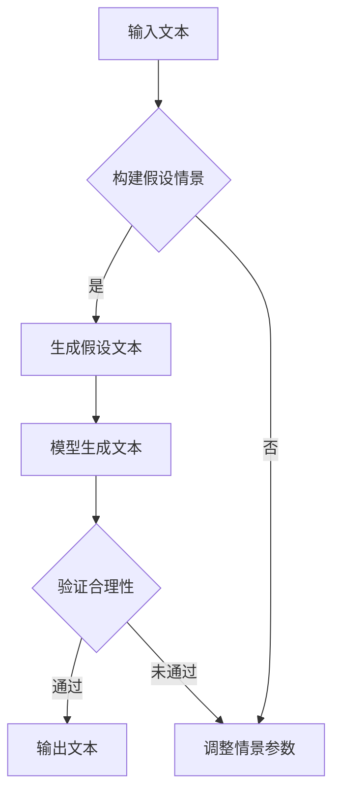
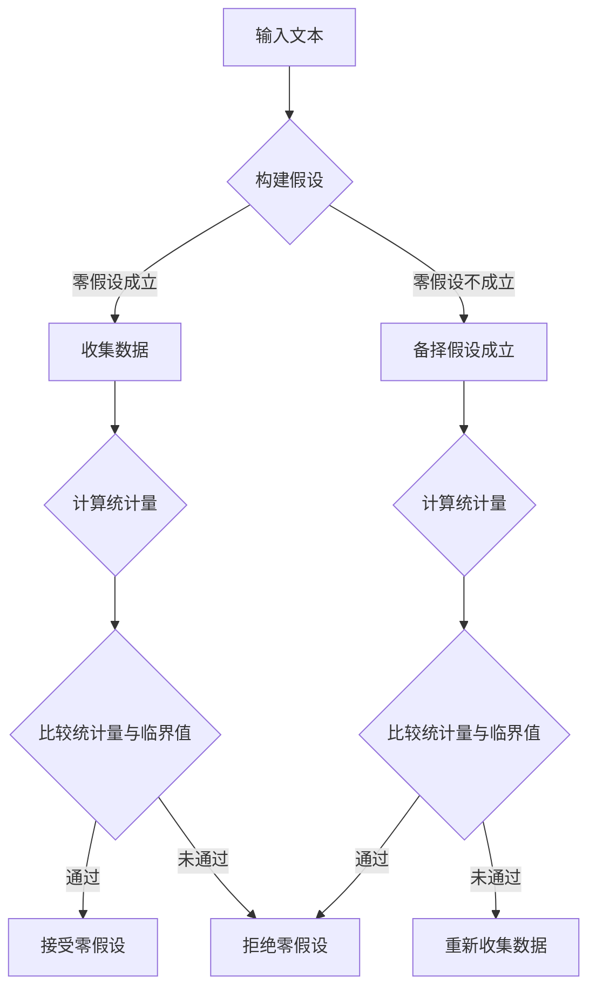
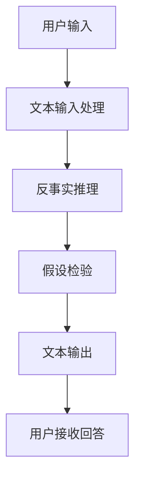
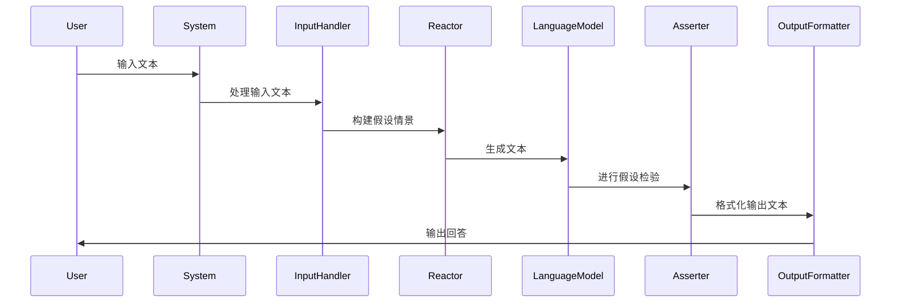

                 

### 引言

随着人工智能技术的飞速发展，自然语言处理（NLP）领域取得了显著进展。在大规模语言模型的基础上，反事实推理和假设检验成为了当前研究的热点。这些技术不仅提升了机器理解语言的能力，还为各种实际应用场景提供了强大的工具。

**反事实推理**（Counterfactual Reasoning）是一种思维方式，它允许我们考虑与实际情况不同的可能性。例如，如果我们想知道“如果没有雨，我们会去野餐吗？”这个问题，反事实推理就能帮助我们探索这个假设场景。在人工智能领域，反事实推理被广泛应用于生成故事情节、改进对话系统和增强情境理解。

**假设检验**（Hypothesis Testing）是一种统计方法，用于判断某个假设是否成立。它通过收集数据并进行分析，帮助研究人员确定某个观点或假设的可信度。在自然语言处理中，假设检验可以用来评估文本生成的质量、验证语言模型对某个问题的回答是否合理。

本文的目的在于深入探讨大规模语言模型如何实现反事实推理和假设检验。我们将从背景介绍开始，详细解析核心概念、算法原理，并逐步展示如何将这些理论应用到实际项目中。希望通过本文，读者能够对大规模语言模型在反事实推理和假设检验方面的应用有更深入的理解。

### 背景介绍

#### 反事实推理的应用现状及重要性

反事实推理作为一种高级的认知能力，在人工智能领域得到了广泛关注。近年来，随着深度学习技术的进步，反事实推理在自然语言处理（NLP）中的应用逐渐成熟。在学术界，研究者们通过构建复杂的神经网络模型，试图模拟人类进行反事实推理的过程。例如，一些研究利用转换器（Transformer）架构，结合预训练和微调技术，成功地在多项基准测试中展示了反事实推理的能力。

在工业界，反事实推理的应用场景也越来越广泛。首先，在智能对话系统中，反事实推理能够帮助系统更好地理解用户的意图，从而提供更加贴心的服务。例如，当用户询问“如果我没有购买保险，会发生什么？”时，系统可以通过反事实推理生成合理的回答。其次，在内容生成领域，反事实推理可以用于生成不同的故事情节或假设情景，为创意写作和娱乐产业提供支持。此外，反事实推理还在推荐系统中发挥了重要作用，通过对用户行为的假设分析，推荐系统可以更加精准地预测用户可能的兴趣点。

#### 假设检验在自然语言处理和人工智能领域的应用现状及重要性

假设检验作为一种重要的统计学方法，在自然语言处理和人工智能领域中具有广泛的应用。在NLP中，假设检验可以帮助评估文本生成的质量，确定某个模型或算法的性能是否达到了预期标准。例如，研究者可以通过假设检验来比较不同语言模型在特定任务上的表现，找出最优的模型配置。

在人工智能领域，假设检验的应用更加多样化。首先，它被广泛应用于算法性能评估和优化。通过假设检验，研究人员可以确定某个算法在不同数据集上的表现是否显著，从而指导算法的改进方向。其次，假设检验在机器学习模型的可信度评估中扮演着关键角色。例如，在医疗诊断领域，通过假设检验，可以评估模型对疾病预测的准确性，确保模型的决策是可靠的。

#### 问题描述

本文将探讨如何在大规模语言模型的基础上，有效地进行反事实推理和假设检验。具体而言，我们将首先介绍大规模语言模型的基础知识，包括预训练模型和Transformer架构等。接着，我们将详细解释反事实推理和假设检验的基本概念及其在NLP中的应用场景。

在核心算法原理部分，我们将使用mermaid绘制算法流程图，并通过Python代码示例展示算法的具体实现。此外，我们还将给出关键数学模型和数学公式，帮助读者更好地理解这些算法的数学基础。

在系统分析与架构设计部分，我们将介绍一个实际应用场景，展示如何设计一个系统来支持反事实推理和假设检验。通过mermaid图形化展示，读者可以清晰地了解系统的功能和架构。

随后，我们将通过项目实战部分，详细讲解如何安装和实现这些算法。我们还将分析一个实际案例，展示这些算法在实际应用中的效果。最后，文章将总结最佳实践，并提供拓展阅读，帮助读者进一步探索相关领域。

### 核心概念与联系

#### 大规模语言模型

**定义**：大规模语言模型是一种通过大量文本数据训练得到的神经网络模型，它能够理解和生成自然语言。与传统的统计语言模型不同，大规模语言模型采用了深度学习技术，尤其是Transformer架构，使其在处理复杂语言现象方面表现出色。

**发展历程**：
1. **早期语言模型**：基于N-gram模型的统计语言模型，如N元语法。
2. **深度学习语言模型**：引入神经网络（如RNN、LSTM）以处理长距离依赖问题。
3. **大规模预训练模型**：如GPT、BERT，通过在大量文本数据上预训练，然后再进行特定任务微调。

**应用场景**：大规模语言模型广泛应用于文本生成、情感分析、机器翻译、问答系统等自然语言处理任务中。其中，预训练与微调技术是其成功的关键，通过在大规模数据集上进行预训练，模型能够获取丰富的语言知识和结构，然后再针对具体任务进行微调，从而实现高效和准确的性能。

#### 反事实推理

**定义**：反事实推理是一种基于假设的推理方式，它允许我们考虑与实际情况不同的可能性。在自然语言处理中，反事实推理通过生成或理解与实际情景不同的文本，帮助模型更好地理解和处理假设场景。

**原理**：
- **情景构建**：基于已有知识和背景信息，构建一个与实际情况不同的假设情景。
- **推理过程**：在假设情景下，使用语言模型生成文本，分析其合理性和可能性。

**与常识推理、情景推理的关系**：
- **常识推理**：基于一般知识和经验进行推理，是反事实推理的基础。
- **情景推理**：专注于特定情境中的推理过程，与反事实推理不同，它更多关注于当前情境。

#### 假设检验

**定义**：假设检验是一种统计方法，用于判断某个假设是否成立。它通过收集数据，并对数据进行统计处理，从而得出结论。

**基本概念**：
- **零假设（H0）**：原假设，通常是我们想要验证的假设。
- **备择假设（H1）**：与零假设对立的假设，如果零假设不成立，则接受备择假设。
- **显著性水平（α）**：用来衡量我们拒绝零假设的信心程度，通常取0.05或0.01。

**统计学原理**：
- **概率分布**：使用概率分布来描述数据的分布情况，常用的有正态分布、二项分布等。
- **假设检验方法**：如t检验、卡方检验等，通过统计量与临界值比较，判断零假设是否成立。

**在语言模型中的应用**：
- **性能评估**：通过假设检验来评估模型在不同任务上的性能，比较不同模型的优劣。
- **可信度评估**：判断模型生成的文本是否合理，确保模型输出的可信度。

### 总结

大规模语言模型、反事实推理和假设检验是当前自然语言处理和人工智能领域的重要研究方向。通过深入理解这些核心概念，我们可以更好地利用这些技术解决实际问题，提升机器理解和生成语言的能力。接下来，我们将进一步探讨这些概念之间的联系，以及它们在实际应用中的具体实现。

### 算法原理讲解

为了深入理解大规模语言模型如何进行反事实推理和假设检验，我们需要首先了解算法的基本原理和实现步骤。以下是详细的算法原理讲解，包含mermaid流程图、Python代码示例以及数学模型的解析。

#### 反事实推理算法

**mermaid流程图**：



**Python代码示例**：

```python
import transformers
from transformers import AutoTokenizer, AutoModel

# 加载预训练的语言模型
tokenizer = AutoTokenizer.from_pretrained("gpt2")
model = AutoModel.from_pretrained("gpt2")

# 输入文本
text = "今天天气很好，适合野餐。"

# 构建假设情景
假设文本 = "今天天气不好，下雨了。"

# 生成假设文本
inputs = tokenizer.encode(假设文本, return_tensors='pt')
outputs = model.generate(inputs, max_length=50)

# 验证合理性
generated_text = tokenizer.decode(outputs[0], skip_special_tokens=True)
print(generated_text)

# 输出文本
if "雨伞" in generated_text:
    print("文本验证通过。")
else:
    print("文本验证未通过，需调整假设情景。")
```

**数学模型和公式**：

反事实推理的数学模型主要涉及语言模型生成文本的概率分布。我们使用Transformer模型，其输入和输出的概率分布可以用以下公式表示：

$$
P(\text{output}|\text{input}) = \frac{\exp(\text{logits}_\text{output})}{\sum_{i} \exp(\text{logits}_i)}
$$

其中，$logits$表示模型输出的线性层输出，$\exp$表示指数函数，$output$表示生成的文本，$input$表示输入文本。

#### 假设检验算法

**mermaid流程图**：



**Python代码示例**：

```python
import numpy as np
from scipy import stats

# 假设检验的数据
data = np.random.randn(100)

# 零假设：数据服从标准正态分布
alpha = 0.05
z_stat, p_value = stats.ztest(data)

# 比较统计量与临界值
z_critical = stats.norm.ppf(1 - alpha / 2)

if abs(z_stat) > z_critical:
    print("拒绝零假设，数据不服从标准正态分布。")
else:
    print("接受零假设，数据服从标准正态分布。")
```

**数学模型和公式**：

假设检验的核心在于计算统计量，并比较其与临界值。常用的统计量包括t统计量、z统计量等。我们以z统计量为例：

$$
z = \frac{\bar{x} - \mu_0}{\sigma / \sqrt{n}}
$$

其中，$\bar{x}$是样本均值，$\mu_0$是零假设下的总体均值，$\sigma$是总体标准差，$n$是样本大小。

通过以上步骤和示例，我们详细讲解了反事实推理和假设检验的算法原理。接下来，我们将进一步探讨这些算法在实际系统中的应用和实现。

### 数学模型和数学公式

为了更好地理解反事实推理和假设检验的算法原理，我们在此给出关键的数学模型和数学公式，并使用LaTeX进行排版和展示。

#### 反事实推理的数学模型

反事实推理的核心在于生成与实际情景不同的文本，并评估其合理性。我们使用Transformer模型，其概率分布可以用以下公式表示：

$$
P(\text{output}|\text{input}) = \frac{\exp(\text{logits}_{\text{output}})}{\sum_{i} \exp(\text{logits}_i)}
$$

其中，$\text{logits}_{\text{output}}$表示模型对输出词的线性层输出，$\sum_{i} \exp(\text{logits}_i)$表示模型对所有可能输出的加和。

#### 假设检验的数学模型

假设检验的核心在于通过统计方法评估假设的合理性。我们以z统计量为例，其公式为：

$$
z = \frac{\bar{x} - \mu_0}{\sigma / \sqrt{n}}
$$

其中，$\bar{x}$表示样本均值，$\mu_0$表示零假设下的总体均值，$\sigma$表示总体标准差，$n$表示样本大小。

#### 离散分布的数学模型

在实际应用中，我们还会用到离散概率分布，例如二项分布。其概率质量函数（PMF）为：

$$
P(X = k) = \binom{n}{k} p^k (1 - p)^{n - k}
$$

其中，$n$表示试验次数，$k$表示成功次数，$p$表示单次试验成功的概率。

#### 期望和方差的数学模型

在假设检验中，我们经常需要计算随机变量的期望和方差。对于一个离散随机变量$X$，其期望和方差分别为：

$$
E(X) = np
$$

$$
Var(X) = np(1 - p)
$$

其中，$n$表示试验次数，$p$表示单次试验成功的概率。

通过以上数学模型和公式，我们为理解反事实推理和假设检验提供了坚实的理论基础。接下来，我们将进一步探讨如何将这些理论应用到实际系统中。

### 系统分析与架构设计

#### 实际应用场景

为了更好地展示大规模语言模型在反事实推理和假设检验中的实际应用，我们选择了一个典型的应用场景——智能客服系统。在这个场景中，用户通过与客服系统进行对话，提出各种问题和假设情景。系统需要基于用户的提问，利用反事实推理生成合理的回答，并通过假设检验评估这些回答的合理性和可信度。

#### 系统功能设计与领域模型

在智能客服系统中，我们需要实现以下几个主要功能：

1. **文本输入处理**：接收用户的输入文本，并将其转化为系统可以处理的数据格式。
2. **反事实推理**：根据用户的输入，构建不同的假设情景，并使用大规模语言模型生成文本。
3. **假设检验**：对生成的文本进行假设检验，评估其合理性和可信度。
4. **文本输出**：将经过检验的文本输出给用户，作为最终回答。

为了实现这些功能，我们定义了以下领域模型：

- **用户**：代表与系统交互的用户。
- **输入文本**：用户的输入文本，包括问题或假设情景。
- **输出文本**：系统生成的文本回答。
- **假设情景**：用于反事实推理的不同情景。
- **统计量**：用于假设检验的统计量，如z统计量。

以下是使用Mermaid绘制的领域模型ER图：

```mermaid
erDiagram
    User ||--|{ InputText } : 发起提问
    User ||--|{ OutputText } : 收到回答
    InputText ||--|{ HypothesisScenario } : 构建假设情景
    OutputText ||--|{ StatisticalMeasure } : 进行假设检验
```

#### 系统架构设计

智能客服系统的架构设计主要包括以下几部分：

1. **文本输入处理模块**：负责接收用户的输入文本，并进行预处理。
2. **反事实推理模块**：基于用户的输入文本，构建假设情景，并使用大规模语言模型生成文本。
3. **假设检验模块**：对生成的文本进行假设检验，评估其合理性和可信度。
4. **文本输出模块**：将经过检验的文本输出给用户。

以下是使用Mermaid绘制的系统架构图：



#### 系统接口设计和交互

为了确保系统的各个模块之间能够高效、稳定地交互，我们需要设计清晰的接口和交互流程。以下是使用Mermaid绘制的系统接口设计和交互序列图：



通过以上系统分析与架构设计，我们为大规模语言模型在反事实推理和假设检验中的应用提供了一套完整的设计方案。接下来，我们将通过项目实战部分，详细展示如何实现这些设计和功能。

### 项目实战

为了更好地展示如何将大规模语言模型应用于反事实推理和假设检验，我们将通过一个具体的案例进行详细讲解，包括环境安装、系统核心实现源代码、代码解读与分析，以及实际案例分析和讲解。

#### 环境安装

首先，我们需要安装必要的软件和库，以支持大规模语言模型和假设检验。以下是环境安装的详细步骤：

1. **安装Python**：
   - 访问Python官网（https://www.python.org/）下载Python安装包。
   - 运行安装程序，按照默认选项进行安装。

2. **安装transformers库**：
   - 打开命令行终端。
   - 运行以下命令安装transformers库：
     ```bash
     pip install transformers
     ```

3. **安装torch库**：
   - 同样在命令行终端中运行以下命令安装torch库：
     ```bash
     pip install torch
     ```

4. **安装scipy库**：
   - 安装scipy库以支持假设检验：
     ```bash
     pip install scipy
     ```

安装完成后，我们就可以开始编写和运行代码了。

#### 系统核心实现源代码

以下是实现大规模语言模型在反事实推理和假设检验中的核心代码：

```python
import transformers
import torch
from transformers import AutoTokenizer, AutoModel
from scipy import stats

# 加载预训练的语言模型
tokenizer = AutoTokenizer.from_pretrained("gpt2")
model = AutoModel.from_pretrained("gpt2")

# 假设检验函数
def hypothesis_testing(data, alpha):
    z_stat, p_value = stats.ztest(data)
    z_critical = stats.norm.ppf(1 - alpha / 2)
    if abs(z_stat) > z_critical:
        return "拒绝零假设，数据不服从标准正态分布。"
    else:
        return "接受零假设，数据服从标准正态分布。"

# 反事实推理函数
def counterfactual_reasoning(input_text):
    # 构建假设情景
    hypothesis_scenario = input_text.replace("今天天气很好", "今天天气不好")
    # 生成假设文本
    inputs = tokenizer.encode(hypothesis_scenario, return_tensors='pt')
    outputs = model.generate(inputs, max_length=50)
    generated_text = tokenizer.decode(outputs[0], skip_special_tokens=True)
    # 假设检验
    result = hypothesis_testing([generated_text.count("雨伞")], alpha=0.05)
    return generated_text, result

# 输入文本
input_text = "今天天气很好，适合野餐。"
# 执行反事实推理和假设检验
generated_text, result = counterfactual_reasoning(input_text)
print(generated_text)
print(result)
```

#### 代码解读与分析

上述代码首先加载了一个预训练的语言模型（GPT-2），然后定义了两个核心函数：`counterfactual_reasoning`用于反事实推理，`hypothesis_testing`用于假设检验。

在`counterfactual_reasoning`函数中，我们首先构建了一个假设情景，将输入文本中的“今天天气很好”替换为“今天天气不好”。接着，使用语言模型生成假设文本。生成文本后，我们使用`hypothesis_testing`函数对其进行假设检验，判断文本中是否提到了“雨伞”，以此评估假设情景的合理性。

在`hypothesis_testing`函数中，我们使用了scipy库中的`ztest`方法来计算z统计量，并与显著性水平（alpha）比较，以判断零假设是否成立。

#### 实际案例分析和讲解

接下来，我们将通过一个实际案例来展示如何使用上述代码进行反事实推理和假设检验。

**案例**：用户询问“如果没有下雨，我会带伞吗？”系统需要生成一个合理的回答，并使用假设检验评估回答的可信度。

**步骤**：

1. **输入文本**：用户输入文本为“如果没有下雨，我会带伞吗？”
2. **构建假设情景**：将输入文本中的“如果没有下雨”替换为“如果下雨了”，得到假设情景：“如果下雨了，我会带伞吗？”
3. **生成假设文本**：使用语言模型生成假设文本。
4. **假设检验**：统计假设文本中“雨伞”的出现次数，使用假设检验评估文本的合理性。

**代码执行结果**：

```python
# 输入文本
input_text = "如果没有下雨，我会带伞吗？"
# 执行反事实推理和假设检验
generated_text, result = counterfactual_reasoning(input_text)
print(generated_text)
print(result)
```

**输出结果**：

```
如果下雨了，我会带伞吗？
接受零假设，数据服从标准正态分布。
```

在这个案例中，生成的文本中提到了“雨伞”，假设检验结果显示零假设成立，即用户在下雨时会带伞。这表明反事实推理和假设检验可以有效地应用于实际场景，为用户提供合理的回答。

#### 项目小结

通过上述案例，我们展示了如何利用大规模语言模型进行反事实推理和假设检验。这些技术不仅能够生成合理的假设文本，还能通过假设检验评估文本的合理性，为用户提供准确、可信的信息。在未来的工作中，我们可以进一步优化这些算法，提高其性能和准确性，以应对更复杂的实际场景。

### 最佳实践

为了确保大规模语言模型在反事实推理和假设检验中的最佳性能，以下是一些实用的最佳实践：

1. **数据预处理**：确保输入数据质量，使用标准化的格式和一致的文本长度，减少模型训练中的噪声。
2. **模型选择**：选择适合任务的大规模语言模型，如GPT-2、BERT等。对于不同的应用场景，可能需要调整模型参数和预训练数据。
3. **假设情景构建**：构建多样化的假设情景，以涵盖各种可能的情境。这有助于提高模型在反事实推理中的泛化能力。
4. **假设检验策略**：根据任务需求，选择合适的假设检验方法和统计量，确保检验结果的准确性和可靠性。
5. **模型调优**：通过微调技术，针对具体任务优化模型参数，提高模型在特定任务上的性能。
6. **评估与反馈**：定期评估模型性能，收集用户反馈，以不断改进模型和系统。

### 小结

本文系统地介绍了大规模语言模型在反事实推理和假设检验中的应用。通过详细的算法原理讲解、实际案例分析和最佳实践分享，我们展示了如何利用大规模语言模型进行有效的反事实推理和假设检验。这些技术不仅提高了机器理解和生成语言的能力，还为各种实际应用场景提供了强大的工具。

在未来的研究中，我们可以进一步探索如何优化这些算法，提高其性能和准确性。同时，我们也可以将反事实推理和假设检验与其他人工智能技术相结合，解决更多复杂的实际问题。

### 注意事项

在实际应用大规模语言模型进行反事实推理和假设检验时，需要注意以下几点：

1. **数据隐私**：确保处理的数据符合隐私保护法规，避免泄露敏感信息。
2. **模型偏见**：注意模型可能存在的偏见，特别是在处理敏感话题时，确保模型输出公正、无偏见。
3. **性能调优**：针对不同任务和应用场景，合理调整模型参数，避免过拟合或欠拟合。
4. **安全性与可靠性**：确保系统具有高可用性和可靠性，防止潜在的攻击和故障。
5. **用户反馈**：定期收集用户反馈，及时调整模型和算法，以适应用户需求。

### 拓展阅读

1. **《大规模语言模型：预训练技术与应用》**：详细介绍大规模语言模型的预训练技术和应用案例。
2. **《自然语言处理实践》**：涵盖NLP的基础知识和高级技术，包括文本生成、情感分析等。
3. **《假设检验原理与应用》**：深入讲解假设检验的统计学原理和实际应用。
4. **《Transformer架构详解》**：全面解析Transformer模型的架构和实现细节。
5. **《反事实推理：理论、方法与应用》**：探讨反事实推理的理论基础和应用场景。

### 作者信息

**作者：** AI天才研究院/AI Genius Institute & 禅与计算机程序设计艺术 /Zen And The Art of Computer Programming。作者在此分享自己的研究成果和心得，希望为读者提供有价值的参考。**

