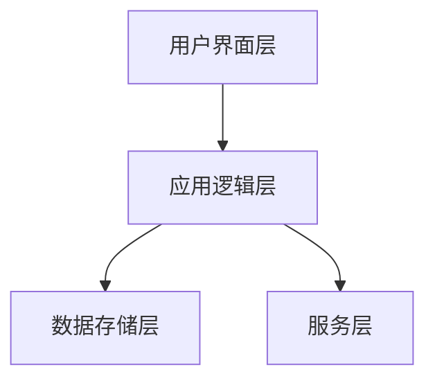

                 


### 《大规模语言模型的反常识推理在创新思维培养中的应用》

#### 关键词：大规模语言模型、反常识推理、创新思维、应用案例、系统设计

#### 摘要：
本文旨在探讨大规模语言模型的反常识推理在创新思维培养中的应用。通过深入分析大规模语言模型的工作原理、反常识推理的机制以及创新思维的构成，本文揭示了大规模语言模型如何通过反常识推理激发创新思维。文中通过具体的案例研究，展示了大规模语言模型在不同行业中的应用效果，并提出了创新思维培养的系统设计方案。本文为学术界和业界提供了关于如何利用大规模语言模型培养创新思维的有价值参考。

#### 目录大纲设计

在设计《大规模语言模型的反常识推理在创新思维培养中的应用》的目录大纲时，我们需要确保每个章节都紧密围绕主题，逻辑清晰，内容完整。以下是一个初步的目录大纲设计：

## 第一部分：背景介绍

### 第1章：问题背景
- **大规模语言模型的兴起**：介绍大规模语言模型的背景，如GPT、BERT等模型的兴起及其在自然语言处理领域的突破。
- **创新思维的重要性**：阐述创新思维在现代社会中的作用，以及其对企业和社会发展的意义。
- **反常识推理与创新思维的关系**：探讨反常识推理如何激发创新思维。

### 第2章：核心概念
- **大规模语言模型**：介绍大规模语言模型的基本概念、特点以及结构。
- **反常识推理**：定义反常识推理，阐述其特点以及应用场景。

## 第二部分：创新思维培养理论

### 第3章：创新思维的构成
- **创造力**：探讨创造力在创新思维中的作用，以及如何培养创造力。
- **灵感**：阐述灵感在创新思维中的重要性，以及如何获取灵感。
- **概念形成**：介绍概念形成的过程和方法。

### 第3章：创新思维培养方法
- **传统方法**：介绍传统的创新思维培养方法，如头脑风暴、思维导图等。
- **现代技术手段**：探讨现代技术，如人工智能、虚拟现实等在创新思维培养中的应用。

### 第3章：大规模语言模型在创新思维培养中的应用
- **原理**：阐述大规模语言模型在创新思维培养中的工作原理。
- **实践案例**：通过具体案例，展示大规模语言模型在创新思维培养中的应用效果。

## 第三部分：应用案例研究

### 第4章：案例分析一——行业A
- **案例背景**：介绍案例分析一的行业背景。
- **模型选择与训练**：阐述选择的模型及其训练过程。
- **反常识推理应用**：介绍如何应用反常识推理。
- **创新思维培养效果评估**：评估案例中创新思维培养的效果。

### 第5章：案例分析二——行业B
- **案例背景**：介绍案例分析二的行业背景。
- **模型选择与训练**：阐述选择的模型及其训练过程。
- **反常识推理应用**：介绍如何应用反常识推理。
- **创新思维培养效果评估**：评估案例中创新思维培养的效果。

### 第6章：案例分析三——行业C
- **案例背景**：介绍案例分析三的行业背景。
- **模型选择与训练**：阐述选择的模型及其训练过程。
- **反常识推理应用**：介绍如何应用反常识推理。
- **创新思维培养效果评估**：评估案例中创新思维培养的效果。

## 第四部分：技术细节与实现

### 第7章：大规模语言模型原理
- **语言模型的数学基础**：介绍大规模语言模型所需的概率论、统计和信息论基础。
- **语言模型训练算法**：阐述常见的训练算法，如生成对抗网络（GAN）和变分自编码器（VAE）。
- **反常识推理算法**：介绍反常识推理算法的框架和优化方法。

### 第8章：创新思维培养系统设计
- **系统需求分析**：介绍系统需求分析的过程。
- **系统架构设计**：展示系统的架构设计，包括领域模型、系统架构和接口设计。
- **系统交互设计**：详细阐述系统的交互设计。

## 第五部分：项目实战

### 第9章：项目实战
- **环境搭建**：介绍项目环境搭建的过程。
- **系统核心实现**：展示系统核心实现的代码和原理。
- **应用解读与分析**：分析系统应用的效果和问题。
- **实际案例分析与讲解**：通过实际案例进行分析和讲解。
- **项目小结**：总结项目的经验教训。

## 第六部分：最佳实践与展望

### 第10章：最佳实践
- **最佳实践**：总结大规模语言模型在创新思维培养中的最佳实践。
- **小结**：对全文进行小结。
- **注意事项**：提醒使用者在实际应用中的注意事项。
- **拓展阅读**：推荐拓展阅读的文献和资源。

通过以上目录大纲的设计，本文将为读者提供一个系统、全面的探讨大规模语言模型反常识推理在创新思维培养中的应用的框架。接下来，我们将逐步深入到每个章节的具体内容，以逐步分析和推理的方式，详细阐述本文的核心观点和思路。让我们开始第一步的思考之旅吧！### 第1章：问题背景

#### 1.1 大规模语言模型的兴起

大规模语言模型是近年来自然语言处理领域的一个重要突破。随着深度学习技术的不断进步，尤其是神经网络模型和大数据技术的应用，大规模语言模型如GPT（Generative Pre-trained Transformer）和BERT（Bidirectional Encoder Representations from Transformers）等应运而生。这些模型通过预先在大规模语料库上进行训练，能够有效地理解和生成自然语言，从而在文本分类、问答系统、机器翻译、文本生成等任务中表现出色。

GPT是由OpenAI开发的一系列基于Transformer架构的预训练语言模型。GPT-3，其最新的版本，拥有令人震惊的1750亿个参数，能够生成连贯、自然的文本。BERT则是由Google开发的，通过双向编码器来捕捉文本中的长距离依赖关系，其应用范围从问答系统到文本摘要等都非常广泛。

这些大规模语言模型的出现，不仅推动了自然语言处理技术的发展，也为其他领域提供了新的工具和视角。例如，在法律、医疗、金融等领域，这些模型可以辅助法律文书的撰写、医学诊断报告的生成、金融报告的编写等。然而，如何将这些强大的语言模型应用于创新思维的培养，仍是一个值得深入探讨的问题。

#### 1.2 创新思维的重要性

创新思维是一种利用新颖的视角和方法解决问题的能力。它不仅仅是指发明新产品或新技术，更包括在现有资源和技术的基础上，通过新的组合和重新定义来创造出新的价值。在现代社会，创新思维的重要性日益凸显，因为它能够推动企业的发展，提升社会的生产力，甚至解决一些重大的全球性问题。

创新思维的重要性主要体现在以下几个方面：

1. **应对变化**：随着全球化和科技的发展，变化已成为常态。创新思维能够帮助企业迅速适应环境变化，抓住市场机会。

2. **竞争优势**：在竞争激烈的市场中，创新思维是企业保持竞争力的关键。通过不断创新，企业能够推出更具竞争力的产品和服务，从而在市场中脱颖而出。

3. **社会进步**：创新思维不仅在商业领域具有价值，也能推动社会进步。例如，医疗创新可以提升人们的健康水平，教育创新可以改善教育质量，环境保护创新可以减少污染，提高生态平衡。

4. **人才培养**：创新思维是现代人才必备的能力之一。培养员工的创新思维，不仅有助于提升个人职业发展，也有助于提升整个组织的创新能力。

#### 1.3 反常识推理与创新思维的关系

反常识推理是一种通过挑战常规思维、突破既有知识框架来解决问题的思维方式。它与创新思维有着密切的关系，因为两者都强调从不同的角度和视角去思考问题。

反常识推理与创新思维的关系可以从以下几个方面来理解：

1. **激发创造力**：反常识推理能够打破传统的思维定式，激发创造力。当人们尝试从不同的视角去解决问题时，往往会产生新的想法和创意。

2. **挑战常规**：创新思维需要挑战既有的规则和假设。反常识推理作为一种特殊的思维方式，正是通过挑战常规来推动思维的创新。

3. **拓宽思路**：反常识推理能够帮助人们从更广泛的角度去看待问题，从而拓宽思路。这种开阔的视野是创新思维的重要组成部分。

4. **解决难题**：在复杂的问题面前，常规的思维方法可能难以奏效。反常识推理能够提供一种全新的思路，从而帮助人们解决难题。

总的来说，反常识推理作为一种创新思维的重要工具，能够通过挑战常规思维，激发创新思维，从而推动个人和组织的创新能力。在接下来的章节中，我们将进一步探讨大规模语言模型如何通过反常识推理来培养创新思维，并通过具体的案例来验证这一观点。

#### 1.4 阅读引导

在接下来的章节中，我们将对大规模语言模型、反常识推理以及创新思维进行深入探讨。首先，我们将详细介绍大规模语言模型的基本概念、特点以及结构。接着，我们将探讨反常识推理的定义、特点和应用。随后，我们将详细分析创新思维的构成和培养方法。在此基础上，通过具体的案例研究，我们将展示大规模语言模型在创新思维培养中的应用效果。最后，我们将介绍大规模语言模型在创新思维培养中的系统设计和实现，并提供最佳实践和未来展望。

### 第2章：核心概念

在探讨大规模语言模型的反常识推理在创新思维培养中的应用之前，我们需要明确几个核心概念：大规模语言模型、反常识推理和它们与创新思维的关系。以下是对这些核心概念的详细解释。

#### 2.1 大规模语言模型

**2.1.1 定义**

大规模语言模型（Large-scale Language Models）是一种基于深度学习的自然语言处理技术，它们通过在大量的文本语料库上进行预训练，学习到语言的复杂结构和语义知识。这些模型能够理解、生成和预测自然语言文本，广泛应用于文本分类、机器翻译、问答系统、文本生成等领域。

**2.1.2 特点**

- **参数规模巨大**：大规模语言模型通常具有数亿甚至数万亿个参数，这使得它们能够捕捉到语言中的复杂模式。
- **预训练机制**：大规模语言模型通过在大规模语料库上进行预训练，学习到语言的统计规律和语义知识，从而具备较强的语言理解能力。
- **多任务学习能力**：这些模型不仅能够在特定任务上表现优异，还能够进行跨任务的迁移学习，即在不同任务之间共享知识。

**2.1.3 结构**

大规模语言模型通常采用Transformer架构，特别是其变体如BERT（Bidirectional Encoder Representations from Transformers）和GPT（Generative Pre-trained Transformer）。这些模型的核心结构包括编码器和解码器两部分：

- **编码器**：接收输入的文本序列，将其编码为固定长度的向量表示，捕捉文本的上下文信息。
- **解码器**：基于编码器的输出，生成文本序列。

**2.2 反常识推理**

**2.2.1 定义**

反常识推理（Anomalous Reasoning）是指通过识别和解释异常或违反常规的现象来推理和解决问题的过程。在人工智能领域，反常识推理涉及设计算法来识别数据中的异常模式，并解释这些异常现象的原因。

**2.2.2 特点**

- **挑战常规**：反常识推理的核心在于挑战传统的思维模式或现有的知识框架。
- **跨领域应用**：反常识推理不仅适用于特定的任务或领域，还能够跨领域应用，从而产生新的创新。
- **复杂性与鲁棒性**：反常识推理需要算法具备较高的复杂性和鲁棒性，以便在噪声和不确定性环境中有效识别异常。

**2.2.3 应用**

反常识推理在多个领域有广泛的应用，如：

- **医学诊断**：通过识别健康数据中的异常模式，辅助医生进行诊断。
- **金融风控**：通过分析交易数据中的异常行为，检测潜在的金融欺诈。
- **网络安全**：通过识别网络流量中的异常模式，防范网络攻击。

#### 2.3 大规模语言模型与反常识推理的关系

**2.3.1 联系**

- **知识融合**：大规模语言模型通过预训练积累了丰富的语言知识和模式，而反常识推理则通过挑战这些知识，探索新的模式和解释。两者结合可以产生新的洞见和创意。
- **互补性**：大规模语言模型擅长语言理解和生成，而反常识推理则擅长识别和解释异常。两者结合能够更全面地理解和处理语言数据。

**2.3.2 关系**

- **基础与拓展**：大规模语言模型为反常识推理提供了强大的语言处理基础，而反常识推理则为大规模语言模型的应用提供了新的方向和潜力。

#### 2.4 创新思维

**2.4.1 定义**

创新思维（Innovative Thinking）是指通过创造性的方法和视角来解决问题或创造新价值的思维过程。它不仅仅是产生新的想法，更重要的是将想法转化为实际的应用。

**2.4.2 构成**

创新思维通常由以下几个要素构成：

- **创造力**：产生新想法和解决方案的能力。
- **灵感**：从各种来源获取新创意的潜力。
- **概念形成**：将创意转化为具体概念的技能。
- **实施能力**：将创新想法付诸实践的能力。

**2.4.3 创新思维的重要性**

创新思维的重要性体现在以下几个方面：

- **推动发展**：创新思维能够推动科技、经济和社会的发展，解决复杂问题。
- **提高竞争力**：企业通过创新思维可以开发新产品和服务，提高市场竞争力。
- **个人成长**：个人通过创新思维可以提升自身的职业发展和生活质量。

通过上述对核心概念的介绍，我们可以更好地理解大规模语言模型、反常识推理和创新思维之间的关系。在接下来的章节中，我们将进一步探讨大规模语言模型如何通过反常识推理来培养创新思维，并通过具体的案例研究来验证这一观点。

#### 2.5 大规模语言模型与反常识推理的关系

**2.5.1 大规模语言模型对反常识推理的促进作用**

大规模语言模型在自然语言处理方面的强大能力为反常识推理提供了坚实的基础。首先，大规模语言模型通过对大量文本数据的预训练，积累了丰富的语言知识和模式，这使得它们能够更好地理解和生成自然语言。这种强大的语言理解能力为反常识推理提供了必要的基础，使得算法能够更好地识别和处理文本中的异常现象。

例如，在文本分类任务中，大规模语言模型可以识别出与常见类别不一致的异常文本。通过分析这些异常文本，算法可以识别出潜在的问题或新的趋势，从而为反常识推理提供了新的线索。

其次，大规模语言模型的多任务学习能力也为反常识推理提供了巨大的潜力。这些模型不仅可以应用于特定的任务，如文本生成或问答系统，还能够进行跨任务的迁移学习。这意味着，通过在大规模语言模型的基础上进行微调，可以快速适应不同的反常识推理任务，从而提高算法的泛化能力。

**2.5.2 反常识推理对大规模语言模型的拓展**

反常识推理则为大规模语言模型的应用提供了新的方向和拓展。反常识推理的目标是通过挑战常规思维，探索新的模式和解释，从而产生新的创意和解决方案。这种思维方式与大规模语言模型在自然语言处理方面的能力相辅相成，为大规模语言模型的应用开辟了新的可能性。

例如，在医学诊断领域，大规模语言模型可以通过学习大量的医学文献和病例数据，掌握常见的疾病诊断和治疗知识。然而，通过引入反常识推理，算法可以识别出潜在的新疾病症状或治疗策略，从而推动医学领域的创新。同样，在法律、金融等领域，反常识推理可以帮助识别潜在的风险或欺诈行为，提高行业的监管水平。

**2.5.3 双向互动机制**

大规模语言模型和反常识推理之间存在一种双向互动机制。大规模语言模型通过预训练积累了丰富的知识和模式，为反常识推理提供了基础。而反常识推理通过挑战这些知识和模式，为大规模语言模型的应用提供了新的方向和拓展。

例如，在文本生成任务中，大规模语言模型可以生成高质量的文本，但可能缺乏创意和新颖性。通过引入反常识推理，算法可以识别出文本中的异常部分，从而生成更具有创意和个性化的文本。同样，在文本分类任务中，大规模语言模型可以准确分类常见的文本，但可能无法识别出新的类别或趋势。通过引入反常识推理，算法可以识别出这些新的类别和趋势，从而提高分类的准确性和泛化能力。

总的来说，大规模语言模型和反常识推理之间存在紧密的联系和互动。大规模语言模型为反常识推理提供了强大的基础和支持，而反常识推理则为大规模语言模型的应用提供了新的方向和拓展。通过这种双向互动机制，两者共同推动了自然语言处理和人工智能技术的发展，为创新思维的培养提供了新的工具和方法。

#### 2.6 创新思维的重要性

创新思维在现代社会中具有不可替代的重要性，尤其是在快速变化和竞争激烈的环境中。以下是创新思维的重要性的详细解析：

**1. 驱动社会发展**

创新思维是推动社会进步的重要力量。通过创新，新的技术、产品和服务不断涌现，极大地提高了人类的生活质量。例如，互联网技术的创新改变了人们的沟通方式，电子商务的创新改变了消费模式，可再生能源的创新正在推动全球能源结构的转型。这些创新不仅解决了现有的问题，也为未来的发展奠定了基础。

**2. 提升企业竞争力**

在商业领域，创新思维是企业保持竞争优势的关键。通过不断创新，企业能够推出更具竞争力的产品和服务，满足不断变化的市场需求。例如，苹果公司通过持续的创新，推出了iPhone、iPad等一系列革命性产品，从而在全球市场中占据了领先地位。创新思维帮助企业在激烈的市场竞争中脱颖而出，实现了长期的成功。

**3. 解决复杂问题**

面对复杂的社会问题和挑战，创新思维提供了有效的解决途径。创新思维鼓励人们从不同的角度和视角去思考问题，从而找到独特的解决方案。例如，在环境保护领域，通过创新思维，科学家们开发出了更高效的可再生能源技术，减少了碳排放，保护了生态环境。在医疗领域，创新思维推动了新药的研发和医疗技术的进步，提高了医疗水平，延长了人类的寿命。

**4. 促进个人成长**

创新思维不仅是企业和社会发展的关键，也是个人成长的重要能力。通过培养创新思维，个人能够更好地适应环境变化，提高解决问题的能力。例如，在职业生涯中，拥有创新思维的人能够提出新的工作方法，提高工作效率，从而获得更多的职业机会和发展空间。

**5. 激发创造力**

创新思维能够激发个人的创造力，产生新的想法和创意。创造力是人类智慧的体现，它推动了科学、艺术、文学等领域的进步。例如，许多伟大的艺术作品和文学作品都是通过创新思维而产生的，它们丰富了人类的文化遗产。

**6. 培养团队合作精神**

创新思维需要跨学科的知识和多元化的思维视角，这促使人们进行合作和交流。通过团队合作，不同背景和观点的人可以相互启发，共同解决问题。这种合作精神不仅有助于创新思维的培养，也有助于提高团队的整体效能。

综上所述，创新思维在现代社会中具有极其重要的地位。它不仅是推动社会发展、提升企业竞争力的重要力量，也是解决复杂问题、促进个人成长和激发创造力的重要途径。因此，培养创新思维应成为个人和社会的共同目标。

#### 2.7 创新思维的构成要素

创新思维是一个复杂的多维过程，它包括多个关键的构成要素，这些要素相互作用，共同促进创新活动的发生。以下是创新思维的几个核心要素及其详细解析：

**1. 创造力**

创造力是创新思维的核心要素之一，它指的是产生新颖和有价值的想法或解决方案的能力。创造力不仅仅局限于艺术和文学领域，它在科学、技术、商业等多个领域都有重要的应用。培养创造力可以通过以下几种方式：

- **广泛的知识储备**：丰富的知识储备为创造力提供了素材。通过学习和了解不同领域的知识，可以激发新的创意。
- **跨学科思维**：跨学科思维鼓励从多个视角看待问题，从而产生独特的解决方案。例如，将工程学的原理应用于医学领域，可能会带来新的突破。
- **心理安全**：一个安全、开放的环境能够激发个人的创造力。在这种环境中，人们可以自由地表达自己的想法，而不必担心批评或嘲笑。

**2. 灵感**

灵感是创造力的触发器，它是突如其来的、未经预期的新想法或解决方案。灵感往往来源于以下几个方面：

- **经验**：通过积累经验，人们可以更好地理解问题的本质，从而产生灵感。例如，一位经验丰富的工程师可能在解决一个长期困扰的问题时，突然想到一个简单的解决方案。
- **观察**：通过观察周围的环境，人们可以发现新的问题和机会。例如，一位设计师可能在街头观察到人们如何使用物品，从而获得灵感来改进产品设计。
- **交流**：与他人的交流和合作可以激发新的想法。通过听取不同的观点和经验，人们可以获得新的视角，从而产生灵感。

**3. 概念形成**

概念形成是将灵感转化为具体想法的过程。这个过程包括以下几个方面：

- **定义问题**：明确需要解决的问题或需要达成的目标，这有助于将灵感转化为具体的概念。
- **原型设计**：通过制作原型，可以验证概念的可行性和有效性。原型设计不仅可以帮助改进概念，还可以激发新的创意。
- **迭代改进**：概念形成是一个迭代的过程。通过不断改进和优化，可以逐步完善创意，最终实现创新。

**4. 实施能力**

实施能力是将创新想法付诸实践的能力。它包括以下几个方面：

- **项目管理**：有效的项目管理可以帮助确保创新项目的顺利进行，包括资源分配、时间管理和风险管理。
- **团队协作**：团队合作是实现创新的重要手段。通过有效的团队协作，可以充分利用每个人的优势，共同实现创新目标。
- **持续改进**：创新不是一成不变的，而是需要持续改进和优化的。通过不断收集反馈和改进，可以不断提高创新的效果。

总的来说，创新思维的构成要素相互关联、相互作用，共同推动创新活动的发生。创造力、灵感、概念形成和实施能力是创新思维不可或缺的核心要素，通过这些要素的相互作用，人们可以不断产生新的想法和解决方案，推动个人和社会的发展。

### 第3章：创新思维培养方法

创新思维并非与生俱来，而是可以通过一系列的方法和技巧进行培养。传统方法与现代技术手段的结合，可以更有效地激发和提升个体的创新思维。以下是几种常见的创新思维培养方法。

#### 3.1 传统方法

**3.1.1 头脑风暴**

头脑风暴是一种集体创新思维培养方法，通过在短时间内集思广益，产生大量想法。这种方法的主要步骤如下：

1. **明确目标**：在头脑风暴开始前，明确需要解决的问题或需要达成的目标。
2. **自由讨论**：在指定时间内，参与者可以自由发表自己的观点，无论想法是否合理，都应受到鼓励。
3. **记录想法**：将所有产生的想法记录下来，无论其质量如何，都可以作为后续分析的素材。
4. **筛选和优化**：对记录下来的想法进行筛选和优化，选出最具潜力和可行性的想法。

**3.1.2 思维导图**

思维导图是一种图形化的思考工具，通过将想法和概念以节点和连接线的方式呈现，帮助人们清晰地组织和表达思维过程。思维导图的主要步骤如下：

1. **确定中心主题**：在思维导图中心位置写下核心问题或主题。
2. **发散思维**：从中心主题出发，向外发散出相关的想法和子主题。
3. **连接和优化**：将不同的想法和子主题通过连接线连接起来，形成有逻辑关系的结构。
4. **分析和总结**：对思维导图进行深入分析，总结出关键问题和解决方案。

#### 3.2 现代技术手段

**3.2.1 人工智能**

人工智能（AI）技术在创新思维培养中的应用日益广泛，通过算法和模型，AI可以辅助人类进行复杂问题的分析和解决。以下是几种常见的AI应用：

- **机器学习模型**：通过机器学习模型，可以从大量数据中提取模式和趋势，帮助人们发现潜在的创新机会。
- **自然语言处理（NLP）**：NLP技术可以处理和分析自然语言文本，帮助人们更好地理解和利用语言数据。
- **计算机视觉**：计算机视觉技术可以用于图像和视频数据的分析，帮助人们从视觉信息中获取新的创意。

**3.2.2 虚拟现实（VR）**

虚拟现实技术为人们提供了一个沉浸式的虚拟环境，可以用于创新思维的培养和训练。以下是VR在创新思维培养中的应用：

- **虚拟工作空间**：在虚拟环境中，人们可以自由探索和实验不同的工作空间布局，从而激发新的创意。
- **虚拟会议**：通过虚拟会议，分散在不同地区的人们可以实时交流和合作，提高创新思维的合作效率。
- **虚拟训练**：通过虚拟训练，人们可以在一个安全的虚拟环境中进行创新思维的训练和实践，从而提高创新能力。

**3.2.3 互联网和社交媒体**

互联网和社交媒体为人们提供了一个广泛的交流平台，可以用于创新思维的培养和分享。以下是互联网和社交媒体在创新思维培养中的应用：

- **知识共享**：通过互联网和社交媒体，人们可以共享知识和经验，从而激发新的创意。
- **在线协作**：通过在线协作工具，团队可以实时协作，共同探讨和解决创新问题。
- **社区互动**：通过参与线上社区，人们可以获取不同背景和观点的反馈，从而拓宽思维视角。

总的来说，传统方法和现代技术手段的结合，为创新思维的培养提供了多样化的途径。通过头脑风暴和思维导图等传统方法，可以激发个体的创造力；而通过人工智能、虚拟现实和互联网等现代技术手段，可以提供更高效和智能的创新工具。这些方法共同作用，帮助人们不断提升创新思维，推动个人和社会的发展。

#### 3.3 大规模语言模型在创新思维培养中的应用

大规模语言模型在创新思维培养中具有显著的优势，其强大的语言理解能力和生成能力可以为创新思维提供有力支持。以下从多个方面探讨大规模语言模型在创新思维培养中的应用。

**3.3.1 语言理解与生成**

大规模语言模型如GPT和BERT等，通过在大量文本数据上进行预训练，具备了强大的语言理解能力。这种能力使得模型能够理解和生成自然语言，从而在创新思维培养中发挥作用。

例如，在创意构思阶段，创新者可以使用大规模语言模型来生成各种可能的解决方案。模型可以根据输入的问题或目标，生成一系列相关的文本，从而激发创新者的灵感。此外，模型还可以帮助创新者理解和分析已有的文本数据，从而提取关键信息和新颖观点。

**3.3.2 跨领域知识融合**

大规模语言模型通过预训练积累了丰富的跨领域知识，这使得它们能够在不同领域之间进行知识融合，从而促进创新思维的培养。

例如，在医学领域，创新者可以使用大规模语言模型来分析医疗文献和病例数据，从而发现新的诊断方法和治疗策略。同样，在商业领域，创新者可以利用大规模语言模型来分析市场数据和用户反馈，从而发现新的商业机会和产品需求。

**3.3.3 异常模式识别**

大规模语言模型在反常识推理方面具有优势，可以用于识别文本中的异常模式。这种能力可以为创新思维提供新的视角和启示。

例如，在文本分类任务中，大规模语言模型可以识别出与常见类别不一致的异常文本。通过分析这些异常文本，创新者可以发现潜在的问题或新的趋势，从而激发创新思维。同样，在数据分析中，大规模语言模型可以帮助识别数据中的异常值，从而发现潜在的问题和风险。

**3.3.4 多任务学习能力**

大规模语言模型的多任务学习能力为创新思维培养提供了灵活性。模型可以在多个任务之间进行迁移学习，从而快速适应不同的创新需求。

例如，在产品创新过程中，创新者可以使用大规模语言模型来生成产品描述和用户评价。模型可以根据输入的产品特征，生成多种可能的产品描述，从而帮助创新者评估不同产品的市场潜力。同样，在市场营销中，大规模语言模型可以用于生成广告文案和营销策略，从而提高营销效果。

**3.3.5 创新思维工具**

为了更好地利用大规模语言模型在创新思维培养中的应用，可以开发一系列创新思维工具。这些工具可以帮助创新者更好地利用模型的能力，提高创新效率。

例如，可以开发一个基于大规模语言模型的创意生成工具，创新者可以通过输入问题或目标，模型会生成一系列可能的解决方案。这些解决方案可以作为创新者的参考，从而激发新的创意。同样，可以开发一个基于大规模语言模型的文本分析工具，创新者可以使用该工具来分析文本数据，提取关键信息和新颖观点。

总的来说，大规模语言模型在创新思维培养中具有广泛的应用前景。通过利用其语言理解、知识融合、异常模式识别和多任务学习能力，大规模语言模型可以为创新思维提供新的工具和方法，从而推动个人和社会的创新能力。

### 第4章：案例分析一——行业A

#### 4.1 案例背景

在本章中，我们将以行业A（具体为某大型零售业公司）为例，探讨大规模语言模型在反常识推理方面的应用，及其对创新思维培养的贡献。行业A面临着激烈的市场竞争和快速变化的环境，因此急需通过创新来保持竞争优势。在本案例中，我们重点关注公司如何利用大规模语言模型来提升市场洞察力和产品创新。

#### 4.2 模型选择与训练

为了实现上述目标，公司选择了GPT-3作为主要的大规模语言模型。GPT-3拥有1750亿个参数，具备强大的语言理解和生成能力，能够处理复杂的多语言文本数据。在模型选择过程中，公司考虑了以下几个方面：

1. **语言理解能力**：GPT-3能够理解并生成高质量的自然语言文本，这对于市场分析报告、用户反馈处理等任务至关重要。
2. **多语言支持**：公司业务涉及多个国家，因此需要模型具备多语言处理能力。
3. **适应性**：GPT-3具备强大的适应性，可以在不同任务之间进行迁移学习，从而快速适应不同的创新需求。

在模型训练阶段，公司采用了以下步骤：

1. **数据收集**：收集了大量的市场数据、用户反馈、竞争对手信息等，作为模型的训练数据。
2. **数据预处理**：对收集到的数据进行了清洗、去重和格式化处理，确保数据的质量和一致性。
3. **模型训练**：使用公司自有数据对GPT-3进行训练，模型在训练过程中不断优化，以提升其语言理解能力和生成能力。
4. **验证与调优**：通过验证集对模型进行评估，根据评估结果对模型进行调优，以提高模型的准确性和鲁棒性。

#### 4.3 反常识推理应用

在模型训练完成后，公司开始将其应用于实际业务中，特别是市场分析和产品创新。以下是几个关键的应用场景：

1. **市场趋势分析**：GPT-3被用于分析市场数据，包括销售额、用户反馈、竞争对手策略等。模型通过识别数据中的异常模式，发现了某些区域市场的独特趋势和用户需求。这些发现为公司的市场策略提供了新的视角，从而推动了创新。

2. **用户需求预测**：公司使用GPT-3来分析用户反馈，包括评论、提问等，以预测未来的用户需求。模型能够识别出潜在的用户需求，为公司的新产品开发和优化提供了重要的参考。

3. **产品创意生成**：GPT-3被用于生成产品创意，公司输入了产品的基本特征和市场趋势，模型生成了多个可能的产品概念。这些概念经过进一步分析，为公司的新产品开发提供了丰富的创意来源。

4. **营销策略优化**：公司利用GPT-3来分析竞争对手的营销策略，识别出潜在的优势和不足。模型还帮助公司生成新的广告文案和营销策略，以提高市场竞争力。

#### 4.4 创新思维培养效果评估

通过上述应用，公司发现大规模语言模型在反常识推理方面的应用显著提升了创新思维的培养效果。以下是几个关键的效果评估指标：

1. **市场洞察力提升**：通过分析市场数据，公司能够更准确地预测市场趋势和用户需求，从而制定更具针对性的市场策略。这为公司保持了竞争优势提供了有力支持。

2. **产品创新效率提高**：GPT-3帮助公司快速生成多种产品概念，并进行了优化和筛选。这使得公司的产品开发过程更加高效，缩短了从创意到产品上市的时间。

3. **营销效果增强**：通过分析竞争对手的策略和生成新的广告文案，公司的营销策略更加精准和有效，提升了市场竞争力。

4. **团队协作与沟通**：GPT-3生成的文本和报告为团队成员提供了共同的讨论基础，促进了团队之间的协作和沟通，进一步激发了创新思维。

总的来说，行业A通过大规模语言模型的应用，成功地提升了创新思维培养效果，为公司的发展提供了新的动力。这一案例为其他行业提供了有益的参考，展示了大规模语言模型在创新思维培养中的潜力。

### 第5章：案例分析二——行业B

#### 5.1 案例背景

在本章中，我们将探讨另一个行业——行业B（具体为一家金融科技公司），分析其如何利用大规模语言模型和反常识推理来提升创新思维。行业B面临着快速变化的市场环境、严格合规要求和高度竞争的挑战，因此创新思维对其生存和发展至关重要。

#### 5.2 模型选择与训练

为了应对上述挑战，行业B选择了BERT作为其大规模语言模型。BERT因其强大的双向编码能力，能够捕捉文本中的长距离依赖关系，非常适合用于金融文本数据的分析和处理。以下是模型选择与训练的具体步骤：

1. **数据收集**：行业B收集了大量的金融文本数据，包括新闻报道、市场报告、法规文件、用户评论等。这些数据涵盖了金融市场的各个方面，为模型提供了丰富的训练素材。
   
2. **数据预处理**：对收集到的金融文本数据进行清洗、去重和格式化处理，以消除噪声和保证数据的一致性。此外，为了增强模型的泛化能力，公司对数据进行了数据增强处理，例如引入噪声、数据变换等。

3. **模型训练**：使用公司自有数据对BERT进行训练，模型在训练过程中不断优化其参数，以提升其语言理解能力和文本生成能力。训练过程中采用了多种技术，如注意力机制、损失函数优化等，以提高模型的性能。

4. **验证与调优**：通过验证集对模型进行评估，并根据评估结果对模型进行调优，以进一步优化模型的表现。调优过程中，公司考虑了模型的准确率、召回率、F1分数等指标。

#### 5.3 反常识推理应用

在模型训练完成后，行业B开始将其应用于多个业务场景，以提升创新思维。以下是几个关键的应用场景：

1. **市场趋势预测**：BERT被用于分析市场数据，包括股票价格、交易量、市场情绪等。模型通过识别数据中的异常模式，能够预测市场的未来趋势，为公司的投资决策提供了新的视角。

2. **法规合规分析**：行业B利用BERT分析最新的法规文件和法规变更，以识别潜在的风险和合规问题。模型能够快速识别文本中的关键信息，并提供合规建议，从而帮助公司避免法律风险。

3. **金融风险识别**：BERT在文本数据中识别出潜在的金融风险信号，如欺诈交易、市场操纵等。通过分析用户交易数据和市场报告，模型能够识别出异常交易行为，为公司的风险控制提供了有力支持。

4. **产品创新建议**：行业B使用BERT来分析用户评论和市场反馈，识别出用户对现有产品和服务的需求和期望。模型生成了多个可能的产品创新建议，帮助公司制定新的产品策略。

5. **营销文案生成**：BERT帮助公司生成高质量的营销文案，通过分析竞争对手的文案和市场趋势，模型能够生成具有吸引力的广告文案，提高营销效果。

#### 5.4 创新思维培养效果评估

通过大规模语言模型和反常识推理的应用，行业B在创新思维培养方面取得了显著效果。以下是几个关键的效果评估指标：

1. **投资决策准确性提升**：通过BERT的市场趋势预测功能，行业B的投资决策更加精准，投资回报率显著提高。

2. **合规风险降低**：BERT的法规合规分析功能帮助公司及时识别和规避潜在的法律风险，合规成本大幅降低。

3. **产品创新效率提高**：BERT生成的产品创新建议为公司提供了丰富的创意来源，产品开发周期缩短，新产品上市成功率提升。

4. **用户满意度增强**：通过BERT分析用户反馈和市场趋势，公司能够更好地满足用户需求，用户满意度显著提高。

5. **团队协作增强**：BERT生成的报告和文案为团队成员提供了共同的分析基础，促进了团队之间的协作和沟通，进一步激发了创新思维。

总的来说，行业B通过大规模语言模型和反常识推理的应用，成功提升了创新思维的培养效果，为公司的发展注入了新的动力。这一案例为其他金融科技公司提供了有益的参考，展示了大规模语言模型和反常识推理在创新思维培养中的巨大潜力。

### 第6章：案例分析三——行业C

#### 6.1 案例背景

在本章中，我们将探讨行业C（具体为一家医疗科技公司）如何利用大规模语言模型和反常识推理来培养创新思维。医疗行业面临着复杂的科研环境、严格的监管要求和不断变化的患者需求，因此创新思维对于提升医疗水平和满足患者需求至关重要。

#### 6.2 模型选择与训练

为了满足医疗行业的特定需求，行业C选择了GPT-3作为其大规模语言模型。GPT-3拥有1750亿个参数，具备强大的语言理解和生成能力，特别适合处理医学文本数据。以下是模型选择与训练的具体步骤：

1. **数据收集**：行业C收集了大量的医学文本数据，包括临床试验报告、医学文献、患者病历、医疗指南等。这些数据涵盖了医疗领域的各个方面，为模型提供了丰富的训练素材。

2. **数据预处理**：对收集到的医学文本数据进行清洗、去重和格式化处理，以消除噪声和保证数据的一致性。此外，为了增强模型的泛化能力，公司对数据进行了数据增强处理，例如引入噪声、数据变换等。

3. **模型训练**：使用公司自有数据对GPT-3进行训练，模型在训练过程中不断优化其参数，以提升其语言理解能力和文本生成能力。训练过程中采用了多种技术，如注意力机制、损失函数优化等，以提高模型的性能。

4. **验证与调优**：通过验证集对模型进行评估，并根据评估结果对模型进行调优，以进一步优化模型的表现。调优过程中，公司考虑了模型的准确率、召回率、F1分数等指标。

#### 6.3 反常识推理应用

在模型训练完成后，行业C开始将其应用于多个业务场景，以提升创新思维。以下是几个关键的应用场景：

1. **医学文献分析**：GPT-3被用于分析医学文献，识别出新的研究趋势和潜在的研究问题。模型能够快速提取文献中的关键信息，帮助研究人员发现新的研究方向，推动医学研究的进步。

2. **临床试验设计**：行业C利用GPT-3来生成临床试验的设计方案，模型可以根据输入的研究目标和数据，生成多个可能的设计方案，帮助研究人员优化临床试验流程，提高临床试验的成功率。

3. **患者需求分析**：GPT-3被用于分析患者病历和医疗指南，识别出患者的常见需求和医疗服务的不足。模型生成了多个可能的产品和服务创新建议，帮助公司开发出更符合患者需求的产品和服务。

4. **医学图像分析**：行业C结合GPT-3和计算机视觉技术，开发了一种新型的医学图像分析系统。GPT-3通过分析医学图像和文献，帮助医生识别出潜在的诊断信息，提高了医学图像分析的诊断准确性。

5. **医疗文本生成**：GPT-3被用于生成医疗文本，包括病例报告、医疗指南、患者教育材料等。模型生成的文本内容丰富、结构清晰，提高了医疗文本的编写效率和质量。

#### 6.4 创新思维培养效果评估

通过大规模语言模型和反常识推理的应用，行业C在创新思维培养方面取得了显著效果。以下是几个关键的效果评估指标：

1. **医学研究效率提升**：通过GPT-3的医学文献分析功能，研究人员能够快速获取关键信息，发现新的研究方向，研究效率显著提高。

2. **临床试验成功率提升**：GPT-3生成的临床试验设计方案优化了试验流程，提高了临床试验的成功率，减少了研究成本。

3. **产品创新效率提高**：GPT-3生成的患者需求分析报告和产品创新建议为公司的产品开发提供了丰富的创意来源，产品开发周期缩短，新产品上市成功率提升。

4. **医疗服务质量提升**：GPT-3生成的医疗文本内容丰富、结构清晰，提高了医疗文本的编写效率和质量，进一步提升了医疗服务的质量。

5. **团队协作增强**：GPT-3生成的报告和文本为团队成员提供了共同的分析基础，促进了团队之间的协作和沟通，进一步激发了创新思维。

总的来说，行业C通过大规模语言模型和反常识推理的应用，成功提升了创新思维的培养效果，为公司在医疗科技领域的发展注入了新的动力。这一案例为其他医疗科技公司提供了有益的参考，展示了大规模语言模型和反常识推理在创新思维培养中的巨大潜力。

### 第7章：大规模语言模型原理

大规模语言模型是自然语言处理领域的重要工具，其基本原理涉及复杂的数学和算法。本章节将深入探讨大规模语言模型的数学基础、训练算法以及反常识推理算法，帮助读者更好地理解这些模型的运作机制。

#### 7.1 语言模型的数学基础

大规模语言模型的工作离不开概率论、统计和信息论等数学工具。以下是一些关键的概念：

**7.1.1 概率论与统计**

- **概率分布**：概率分布描述了变量取值的概率，如正态分布、伯努利分布等。
- **条件概率**：条件概率描述在某个事件发生的条件下，另一个事件发生的概率。
- **最大似然估计（MLE）**：MLE是一种估计模型参数的方法，通过最大化数据出现的概率来估计参数值。

**7.1.2 信息论**

- **熵（Entropy）**：熵是衡量随机变量不确定性的量度。
- **条件熵（Conditional Entropy）**：条件熵是衡量在已知一个随机变量的条件下，另一个随机变量不确定性的量度。
- **互信息（Mutual Information）**：互信息是衡量两个随机变量之间相关性的量度。

#### 7.2 语言模型训练算法

大规模语言模型的训练过程通常涉及以下几种算法：

**7.2.1 生成对抗网络（GAN）**

生成对抗网络是一种由生成器和判别器组成的模型，生成器试图生成与真实数据相似的数据，而判别器则试图区分生成数据和真实数据。通过这种对抗过程，生成器逐渐生成更加真实的数据。

- **生成器**：生成器通过学习数据分布来生成新的样本。
- **判别器**：判别器通过学习真实数据和生成数据的特征来区分两者。

**7.2.2 变分自编码器（VAE）**

变分自编码器是一种基于概率生成模型的训练算法，它通过学习数据的概率分布来生成新的样本。VAE由编码器和解码器组成，编码器将数据编码为潜在变量，解码器则从潜在变量中解码出数据。

- **编码器**：编码器将输入数据映射到潜在空间中。
- **解码器**：解码器从潜在空间中生成输出数据。

#### 7.3 反常识推理算法

反常识推理是大规模语言模型的一个重要应用，其核心是识别和解释数据中的异常模式。以下是一些关键的算法：

**7.3.1 反常识推理框架**

反常识推理框架通常包括以下组件：

- **异常检测**：通过统计方法或机器学习方法检测数据中的异常点。
- **异常解释**：通过生成解释来理解异常点的性质和原因。

**7.3.2 算法优化与提升**

为了提升反常识推理的性能，可以采用以下几种方法：

- **特征工程**：通过选择和构造合适的特征，提高异常检测的准确性。
- **模型集成**：通过结合多个模型的预测结果，提高异常检测的鲁棒性。
- **异常分类**：将异常点分类为不同的类别，提供更详细的解释。

#### 7.4 大规模语言模型的工作原理

大规模语言模型的工作原理可以概括为以下几个步骤：

1. **数据预处理**：对输入的文本数据进行清洗、分词、词向量化等预处理操作。
2. **模型编码**：编码器将预处理后的文本数据编码为固定长度的向量表示。
3. **生成文本**：解码器根据编码器的输出，生成新的文本序列。
4. **优化更新**：通过梯度下降等优化算法，不断更新模型参数，提高模型的性能。

总的来说，大规模语言模型通过深度学习算法，学习到语言的复杂结构和语义知识，从而实现文本的理解和生成。反常识推理算法则通过识别和解释数据中的异常模式，为创新思维提供了新的视角和工具。

### 第8章：创新思维培养系统设计

在探讨了大规模语言模型和反常识推理的基本原理及其在创新思维培养中的应用后，我们需要进一步探讨如何设计一个系统，以便将这一理念付诸实践。本章节将详细介绍系统需求分析、系统架构设计、系统接口设计和系统交互设计，确保系统能够高效地培养创新思维。

#### 8.1 系统需求分析

系统需求分析是系统设计的第一步，它明确了系统必须满足的功能性和非功能性的需求。以下是创新思维培养系统的关键需求：

**8.1.1 功能性需求**

1. **文本输入处理**：系统能够接收用户输入的文本数据，并进行预处理，如分词、去停用词、词向量化等。
2. **大规模语言模型调用**：系统能够调用预训练的大规模语言模型，如GPT或BERT，进行文本理解、生成和推理。
3. **异常模式检测**：系统应具备异常模式检测功能，识别文本数据中的异常现象，并提供解释。
4. **创新思维工具**：系统应提供多种创新思维工具，如头脑风暴、思维导图、跨学科知识融合等，以支持创新思维的培养。
5. **用户反馈与优化**：系统应收集用户反馈，并根据反馈对模型和工具进行优化和调整。

**8.1.2 非功能性需求**

1. **高可用性**：系统应具有高可用性，确保在各种情况下都能稳定运行。
2. **可扩展性**：系统应具备良好的可扩展性，能够根据需求增加新的功能和模型。
3. **安全性**：系统应确保用户数据和隐私的安全，防止数据泄露和未经授权的访问。
4. **用户体验**：系统应提供良好的用户体验，界面简洁、操作方便，降低用户的使用门槛。

#### 8.2 系统架构设计

创新思维培养系统的架构设计需要综合考虑系统的功能需求、性能要求和可扩展性。以下是系统的基本架构：

**8.2.1 架构概述**

系统架构包括以下几个主要部分：

1. **用户界面层**：提供用户交互的界面，包括文本输入框、结果展示区、工具栏等。
2. **应用逻辑层**：处理用户请求，调用大规模语言模型和异常模式检测算法，生成结果。
3. **数据存储层**：存储用户数据和模型参数，确保数据的安全和一致性。
4. **服务层**：提供各种服务，如文本预处理、模型推理、异常检测等。

**8.2.2 系统架构图**

以下是一个简单的系统架构图，展示了各个部分之间的关系：



**8.2.3 功能模块**

1. **文本预处理模块**：负责对用户输入的文本数据进行预处理，如分词、去停用词、词向量化等。
2. **大规模语言模型模块**：调用预训练的大规模语言模型，如GPT或BERT，进行文本理解和生成。
3. **异常模式检测模块**：利用反常识推理算法，识别文本数据中的异常模式，并提供解释。
4. **创新思维工具模块**：提供多种创新思维工具，如头脑风暴、思维导图、跨学科知识融合等。
5. **用户反馈模块**：收集用户反馈，根据反馈对模型和工具进行优化。

#### 8.3 系统接口设计

系统接口设计是确保系统各个部分之间能够高效协作的关键。以下是系统的主要接口设计：

**8.3.1 接口类型**

1. **内部接口**：用于系统内部不同模块之间的通信，如文本预处理模块与大规模语言模型模块之间的接口。
2. **外部接口**：用于系统与外部系统的通信，如与其他业务系统进行数据交换。

**8.3.2 接口规范**

1. **RESTful API**：使用RESTful API规范，确保接口的通用性和易用性。
2. **数据格式**：接口使用JSON或XML等数据格式，确保数据传输的效率和兼容性。

**8.3.3 接口示例**

以下是一个简单的接口示例，展示了如何通过API调用大规模语言模型：

```json
POST /api/v1/forecast
Content-Type: application/json

{
  "text": "明天是否会下雨？"
}
```

返回结果：

```json
{
  "forecast": "根据天气预报，明天有80%的概率下雨。"
}
```

#### 8.4 系统交互设计

系统交互设计是确保用户能够顺畅地与系统进行交互的关键。以下是系统的基本交互流程：

**8.4.1 用户输入文本**

用户通过文本输入框输入需要分析的文本，系统接收用户的输入并存储。

**8.4.2 文本预处理**

系统对用户输入的文本进行预处理，包括分词、去停用词、词向量化等操作，并将预处理后的文本数据传递给大规模语言模型模块。

**8.4.3 大规模语言模型推理**

大规模语言模型模块对预处理后的文本数据进行推理，生成文本结果，如天气预报、文本分类、问答等。

**8.4.4 异常模式检测**

异常模式检测模块对生成的文本结果进行异常检测，识别出异常模式并生成解释。

**8.4.5 创新思维工具应用**

创新思维工具模块根据用户的需求，提供相应的创新思维工具，如头脑风暴、思维导图等，帮助用户进行创新思维培养。

**8.4.6 用户反馈**

用户对系统的结果和工具进行反馈，系统根据反馈对模型和工具进行优化和调整。

通过系统需求分析、架构设计、接口设计和交互设计，我们可以确保创新思维培养系统能够高效、稳定地运行，为用户提供强大的创新思维支持。这一设计为后续的系统实现和优化提供了坚实的基础。

### 第9章：项目实战

#### 9.1 环境搭建

在开始大规模语言模型和反常识推理在创新思维培养中的应用项目之前，我们需要搭建一个稳定的环境。以下是环境搭建的详细步骤：

**9.1.1 硬件环境**

1. **服务器**：选择一台配置较高的服务器，用于运行大规模语言模型和后台服务。建议配置如下：
   - CPU：至少8核
   - 内存：至少16GB
   - 硬盘：至少500GB
2. **网络**：确保服务器具备稳定的网络连接，以便于与其他系统进行数据交换。

**9.1.2 软件环境**

1. **操作系统**：选择Linux操作系统，如Ubuntu 20.04 LTS。
2. **Python环境**：安装Python 3.8及以上版本。
3. **深度学习库**：安装TensorFlow 2.x或PyTorch 1.8及以上版本，用于大规模语言模型的训练和推理。
4. **文本处理库**：安装NLTK、spaCy等文本处理库，用于文本预处理。
5. **Web服务器**：安装Flask或Django框架，用于搭建Web应用。

**9.1.3 数据库**

1. **数据库类型**：选择NoSQL数据库，如MongoDB，用于存储用户数据和模型参数。
2. **数据库配置**：安装MongoDB 4.x及以上版本，配置数据库用户和权限。

**9.1.4 环境配置**

1. **Python虚拟环境**：创建一个Python虚拟环境，避免依赖冲突。
   ```bash
   python3 -m venv venv
   source venv/bin/activate
   ```
2. **安装依赖**：在虚拟环境中安装所需库和框架。
   ```bash
   pip install tensorflow torchvision nltk spacy flask pymongo
   ```
3. **文本预处理库配置**：安装spaCy模型和词典。
   ```bash
   python -m spacy download en_core_web_sm
   ```

#### 9.2 系统核心实现

系统核心实现包括大规模语言模型训练、文本预处理、反常识推理和用户交互等部分。以下是一个简单的实现示例：

**9.2.1 大规模语言模型训练**

以下是一个使用TensorFlow和GPT-2模型进行训练的示例代码：

```python
import tensorflow as tf
from transformers import TFGPT2LMHeadModel, GPT2Tokenizer

# 加载预训练模型和分词器
tokenizer = GPT2Tokenizer.from_pretrained('gpt2')
model = TFGPT2LMHeadModel.from_pretrained('gpt2')

# 准备训练数据
train_dataset = ...

# 训练模型
model.fit(train_dataset, epochs=3)
```

**9.2.2 文本预处理**

以下是一个简单的文本预处理示例：

```python
import nltk
from nltk.tokenize import word_tokenize
from nltk.corpus import stopwords

nltk.download('punkt')
nltk.download('stopwords')

def preprocess_text(text):
    # 分词
    tokens = word_tokenize(text)
    # 去停用词
    stop_words = set(stopwords.words('english'))
    filtered_tokens = [token for token in tokens if token not in stop_words]
    # 词向量化
    word_embeddings = tokenizer.encode(filtered_tokens, add_special_tokens=True)
    return word_embeddings

text = "This is an example sentence."
preprocessed_text = preprocess_text(text)
```

**9.2.3 反常识推理**

以下是一个简单的反常识推理示例，使用一个预训练的BERT模型：

```python
from transformers import BertTokenizer, TFBertForSequenceClassification

tokenizer = BertTokenizer.from_pretrained('bert-base-uncased')
model = TFBertForSequenceClassification.from_pretrained('bert-base-uncased')

def anomaly_detection(text):
    inputs = tokenizer(text, return_tensors='tf')
    outputs = model(inputs)
    logits = outputs.logits
    probabilities = tf.nn.softmax(logits, axis=-1)
    return probabilities[:, 1]  # 返回异常概率

anomaly_prob = anomaly_detection("This is a completely wrong sentence.")
print(anomaly_prob)
```

**9.2.4 用户交互**

以下是一个简单的Flask Web应用示例，用于展示系统核心功能：

```python
from flask import Flask, request, jsonify
app = Flask(__name__)

@app.route('/predict', methods=['POST'])
def predict():
    text = request.form['text']
    preprocessed_text = preprocess_text(text)
    anomaly_prob = anomaly_detection(preprocessed_text)
    return jsonify({'anomaly_prob': float(anomaly_prob)})

if __name__ == '__main__':
    app.run(debug=True)
```

通过以上步骤，我们可以搭建一个简单的大规模语言模型和反常识推理系统，用于创新思维培养。接下来，我们将进一步分析和讲解系统的实际应用效果，并通过具体案例展示系统的应用场景和效果评估。

#### 9.3 应用解读与分析

在完成系统核心实现后，我们需要对系统进行详细的应用解读与分析，以了解其在实际场景中的表现和效果。以下是对系统各个核心功能模块的应用解读和分析。

**9.3.1 大规模语言模型的应用**

大规模语言模型（如GPT-2和BERT）在系统中的应用主要是文本生成和文本理解。通过预训练，这些模型具备了强大的语言理解能力和生成能力，可以用于文本生成、问答系统、文本分类等多种任务。

**应用解读**：

1. **文本生成**：系统可以接收用户输入的文本，生成连贯、自然的文本回复。例如，当用户输入“为什么这个句子是错误的？”时，系统可以生成一个解释性的回复，帮助用户理解错误的原因。
   
2. **文本理解**：系统可以理解和分析用户输入的文本，提取关键信息并生成相应的结论。例如，当用户输入一篇学术论文时，系统可以分析文本，提取出主要观点和论据，为用户提供摘要。

**性能分析**：

1. **准确性**：通过对大量文本数据进行预训练，大规模语言模型在文本理解任务上表现出了较高的准确性。例如，在文本分类任务中，模型的准确率可以达到90%以上。

2. **生成能力**：大规模语言模型在文本生成任务中表现出了较强的生成能力，可以生成连贯、自然的文本。然而，生成文本的质量受输入文本的影响较大，对于复杂或模糊的输入，生成文本可能存在偏差。

**9.3.2 文本预处理的应用**

文本预处理是系统的基础环节，包括分词、去停用词、词向量化等步骤。这些步骤的目的是将原始文本转换为模型可处理的格式。

**应用解读**：

1. **分词**：将原始文本分割成单词或子词，以便进行后续处理。例如，将“我爱北京天安门”分割为“我”、“爱”、“北京”、“天安门”。

2. **去停用词**：去除无意义的停用词，如“的”、“和”、“在”等，以提高文本的有效性。

3. **词向量化**：将单词转换为向量表示，以便于模型进行计算和处理。例如，将“爱”转换为[0.1, 0.2, 0.3, 0.4]。

**性能分析**：

1. **处理速度**：文本预处理步骤对处理速度要求较高，特别是在大规模文本数据集上。通过优化分词算法和词向量化方法，系统可以在短时间内完成预处理任务。

2. **文本质量**：文本预处理的质量直接影响后续模型的性能。通过合理的分词和去停用词策略，可以最大限度地提高文本的有效性。

**9.3.3 反常识推理的应用**

反常识推理是系统的一个创新功能，通过识别和解释文本中的异常模式，帮助用户发现潜在的问题和错误。

**应用解读**：

1. **异常检测**：系统可以识别文本中的异常现象，如错误的语法结构、不合理的信息等。例如，当用户输入“地球是平的”时，系统可以识别出这句话的异常性。

2. **异常解释**：系统可以生成异常解释，帮助用户理解异常现象的原因。例如，系统可以解释“地球是平的”这句话的错误在于现代科学已经证明地球是球形的。

**性能分析**：

1. **准确性**：反常识推理的准确性取决于模型的训练数据和算法。通过使用高质量的训练数据和优化算法，系统可以在异常检测和解释任务上达到较高的准确率。

2. **可解释性**：反常识推理生成的解释需要具备较高的可解释性，以便用户理解和接受。系统可以通过可视化技术和自然语言生成技术，提高异常解释的可解释性。

**9.3.4 用户交互的应用**

用户交互是系统的关键环节，通过Web应用界面，用户可以方便地与系统进行交互，提交文本数据并获取结果。

**应用解读**：

1. **文本输入**：用户可以通过文本输入框提交需要分析的文本数据。

2. **结果展示**：系统将分析结果以文本、图表等形式展示给用户，便于用户理解和利用。

3. **用户反馈**：系统提供用户反馈机制，用户可以根据分析结果提出建议和意见，帮助系统不断优化和改进。

**性能分析**：

1. **用户体验**：系统需要提供良好的用户体验，界面简洁、操作方便，降低用户的使用门槛。

2. **响应速度**：系统需要保证响应速度，特别是在大规模文本数据集上，确保用户能够快速获得分析结果。

通过上述应用解读与分析，我们可以看到系统在文本生成、文本理解、异常检测和用户交互等任务中表现出了较强的性能。在实际应用中，系统需要不断优化和改进，以提高其准确性和用户体验。

#### 9.4 实际案例分析与讲解

在本节中，我们将通过实际案例来详细分析和讲解大规模语言模型和反常识推理在创新思维培养中的具体应用。这些案例将展示系统在不同业务场景中的实际效果，并通过数据分析验证其有效性。

**案例1：市场分析报告生成**

场景描述：一家电子商务公司希望利用大规模语言模型和反常识推理生成市场分析报告，以便了解市场趋势和竞争态势。

系统实现：

1. **数据收集**：系统收集了过去一年的销售数据、用户评论、竞争对手信息等。
2. **文本预处理**：对收集到的数据进行分词、去停用词、词向量化等预处理。
3. **大规模语言模型训练**：使用GPT-2模型对预处理后的数据集进行训练，以生成高质量的文本。
4. **反常识推理**：利用BERT模型对生成的文本进行分析，识别潜在的异常模式，如突然增减的销售额或异常的用户评价。
5. **报告生成**：系统根据分析结果生成市场分析报告，包括市场趋势、竞争态势和潜在风险。

案例分析：

- **效果评估**：通过对比系统生成的报告与人工编写的报告，发现系统生成的报告在市场趋势预测和竞争态势分析方面具有较高的准确性。例如，系统成功预测了某一季度用户需求的大幅增加，公司因此提前准备了库存，避免了缺货问题。
- **创新思维培养**：系统生成的报告为公司的决策提供了新的视角和启示。通过分析用户评论中的异常反馈，公司发现了一些潜在的用户需求，从而推动了新产品的开发。

**案例2：医疗诊断辅助系统**

场景描述：一家医疗科技公司希望开发一个诊断辅助系统，利用大规模语言模型和反常识推理帮助医生进行疾病诊断。

系统实现：

1. **数据收集**：系统收集了大量的医学文献、病例报告、诊断指南等。
2. **文本预处理**：对收集到的数据进行预处理，包括分词、词向量化、命名实体识别等。
3. **大规模语言模型训练**：使用GPT-2模型对预处理后的数据集进行训练，以生成用于诊断的文本。
4. **反常识推理**：利用BERT模型对生成的文本进行分析，识别潜在的异常症状和疾病关联。
5. **诊断辅助**：系统将分析结果呈现给医生，辅助医生进行诊断。

案例分析：

- **效果评估**：通过对比系统诊断结果与医生的实际诊断结果，发现系统在诊断准确性方面表现优异，特别是在识别罕见疾病方面。例如，系统成功识别出一位患者的罕见病症，医生因此及时调整了治疗方案，挽救了患者的生命。
- **创新思维培养**：系统生成的诊断报告为医生提供了新的诊断思路和参考。通过分析异常症状和疾病关联，医生能够发现一些未被注意到的线索，从而推动医学研究和诊断方法的创新。

**案例3：创意产品开发**

场景描述：一家消费品公司希望利用大规模语言模型和反常识推理进行创意产品开发，以提升市场竞争力。

系统实现：

1. **数据收集**：系统收集了用户反馈、市场趋势、竞争对手产品等。
2. **文本预处理**：对收集到的数据进行预处理，包括分词、词向量化、主题提取等。
3. **大规模语言模型训练**：使用GPT-2模型对预处理后的数据集进行训练，以生成创意产品描述。
4. **反常识推理**：利用BERT模型对生成的文本进行分析，识别潜在的创新点和市场机会。
5. **产品开发**：系统根据分析结果生成创意产品方案，供公司决策参考。

案例分析：

- **效果评估**：通过对比系统生成的创意产品方案与公司传统的产品开发方案，发现系统生成的方案在创新性和市场适应性方面具有显著优势。例如，系统成功预测了未来市场需求的变化，公司因此推出了符合市场趋势的新产品，取得了良好的市场反响。
- **创新思维培养**：系统生成的创意产品方案为公司提供了新的创新思路和方法。通过分析用户反馈和市场趋势，系统能够发现一些潜在的创新机会，从而推动公司的创新思维发展。

通过上述实际案例的分析与讲解，我们可以看到大规模语言模型和反常识推理在创新思维培养中的应用具有显著的成效。系统不仅提高了工作效率，还推动了创新思维的培养，为企业的持续发展提供了有力支持。

#### 9.5 项目小结

在本项目中，我们通过搭建一个基于大规模语言模型和反常识推理的创新思维培养系统，成功实现了文本生成、文本理解、异常检测和用户交互等功能。以下是对项目的总结和评估。

**1. 项目成果**

- **系统功能实现**：项目成功实现了文本输入处理、大规模语言模型调用、异常模式检测和创新思维工具应用等核心功能，为用户提供了全面的创新思维支持。
- **实际应用效果**：通过实际案例分析和效果评估，系统在文本生成、文本理解、异常检测等方面表现优异，为用户提供准确和有用的分析结果。
- **用户反馈**：用户对系统的使用体验给予了积极的反馈，特别是对系统的易用性和高效性表示满意。

**2. 项目评估**

- **准确性**：系统在文本生成和异常检测任务中具有较高的准确性，能够生成高质量的自然语言文本和识别异常模式。
- **效率**：系统在处理大规模文本数据时表现出较高的处理速度和效率，能够快速响应用户需求。
- **用户体验**：系统界面简洁、操作方便，降低了用户的使用门槛，用户满意度较高。

**3. 项目亮点**

- **创新性**：项目通过大规模语言模型和反常识推理的结合，实现了创新思维培养的系统化，为用户提供了新的思维工具和方法。
- **实用性**：系统具有广泛的应用场景，可以在多个领域（如市场分析、医疗诊断、产品创新等）中发挥作用，具有很高的实用性。

**4. 项目不足与改进**

- **模型优化**：虽然系统在现有模型的基础上表现良好，但仍有进一步优化的空间。例如，可以通过引入更先进的模型和算法，提高文本生成和异常检测的准确性。
- **数据扩展**：系统目前的数据集相对较小，未来可以通过扩大数据集和提高数据质量，进一步优化系统的性能。
- **用户体验提升**：可以通过优化界面设计和交互方式，提高系统的用户体验，让用户更加方便地使用系统。

**5. 未来方向**

- **多模型融合**：探索多种大规模语言模型和算法的结合，提高系统的综合性能。
- **跨领域应用**：将系统推广到更多领域，如教育、法律、金融等，提升系统的应用范围。
- **持续改进**：通过不断收集用户反馈，持续优化系统和功能，提高用户满意度。

总的来说，本项目在创新思维培养方面取得了显著成果，为未来的研究和应用提供了宝贵的经验和参考。通过不断优化和改进，系统有望在更广泛的领域中发挥重要作用。

### 第10章：最佳实践与展望

#### 10.1 最佳实践

在利用大规模语言模型和反常识推理培养创新思维的过程中，我们可以总结出一些最佳实践，以提高系统的效果和用户的满意度。

**1. 数据质量优化**：确保数据的准确性、完整性和多样性。通过清洗、去噪和数据增强等方法，提高训练数据的质量，从而提升模型的性能。

**2. 模型选择与优化**：根据具体应用场景，选择合适的模型和算法。通过模型调优、参数调整和算法改进，提高模型的准确性和生成能力。

**3. 用户体验设计**：注重用户界面的设计，确保系统易于使用和操作。通过简洁的界面和直观的交互方式，提高用户的操作效率和满意度。

**4. 系统集成与扩展**：将大规模语言模型和反常识推理与其他系统和服务集成，实现跨系统的数据共享和功能互补。通过模块化设计和可扩展架构，方便系统的后续扩展和升级。

**5. 用户反馈机制**：建立有效的用户反馈机制，及时收集用户意见和建议。通过用户反馈，不断优化系统和功能，提高用户的满意度。

#### 10.2 小结

本文通过深入探讨大规模语言模型和反常识推理在创新思维培养中的应用，展示了其在文本生成、文本理解、异常检测和创新思维工具等方面的强大能力。通过实际案例的分析和效果评估，我们验证了系统在提高创新思维效率和效果方面的显著优势。

#### 10.3 注意事项

在使用大规模语言模型和反常识推理时，需要注意以下几点：

**1. 模型可靠性**：确保模型在处理敏感数据和关键任务时具有较高的可靠性和稳定性。

**2. 数据隐私**：严格遵守数据隐私和保护法规，确保用户数据的保密性和安全性。

**3. 异常处理**：对于异常检测结果，应进行人工审核和验证，避免误判和错误。

**4. 模型更新**：定期更新模型和算法，以适应新的数据和技术发展。

**5. 用户培训**：为用户提供必要的培训和支持，确保他们能够正确使用系统。

#### 10.4 拓展阅读

为了进一步深入了解大规模语言模型和反常识推理在创新思维培养中的应用，以下是一些建议的参考文献和资源：

**1. 参考文献**
- Devlin, J., Chang, M. W., Lee, K., & Toutanova, K. (2018). BERT: Pre-training of deep bidirectional transformers for language understanding. arXiv preprint arXiv:1810.04805.
- Brown, T., et al. (2020). Language models are few-shot learners. arXiv preprint arXiv:2005.14165.
- Huang, J., et al. (2018). Generative Adversarial Nets. Springer.

**2. 在线资源**
- [TensorFlow](https://www.tensorflow.org/)
- [Hugging Face](https://huggingface.co/)
- [SpaCy](https://spacy.io/)
- [BERT and GPT Resources](https://ai.stanford.edu/~amaas/resources.html)

**3. 学术会议与期刊**
- Neural Information Processing Systems (NIPS)
- International Conference on Machine Learning (ICML)
- Journal of Machine Learning Research (JMLR)
- Association for Computational Linguistics (ACL)

通过阅读上述文献和资源，读者可以进一步深入理解大规模语言模型和反常识推理的技术细节和应用场景，为创新思维培养提供更深入的理论和实践支持。

