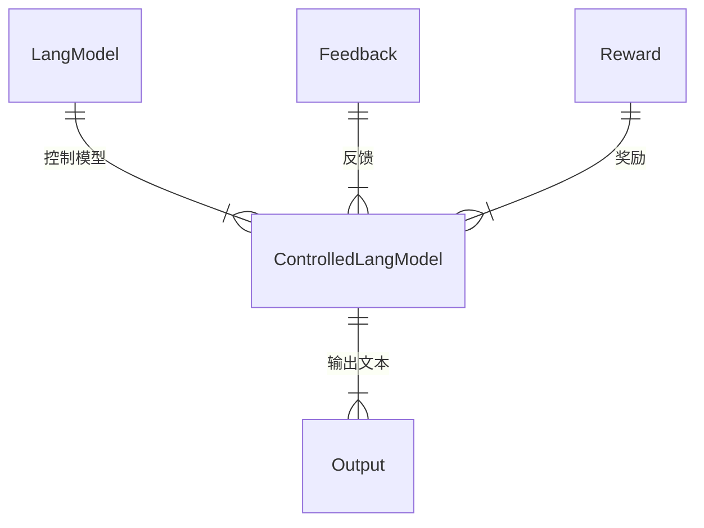
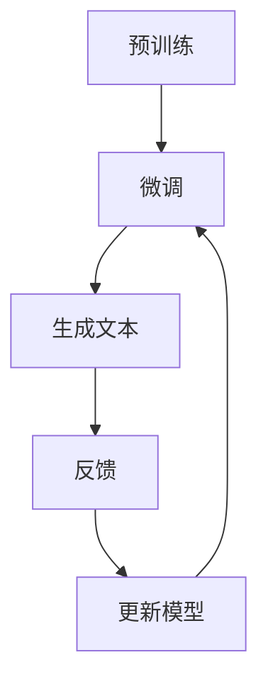
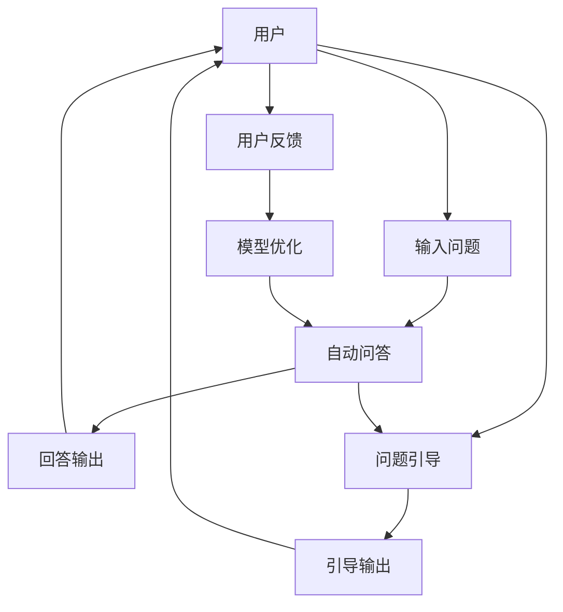
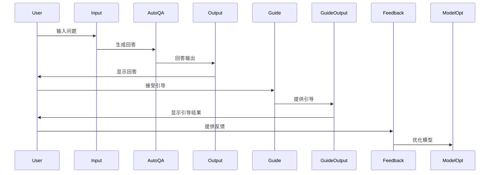

                 

# 《大规模语言模型的可控性研究与实现》

## 关键词

- 大规模语言模型
- 可控性
- 算法原理
- 数学模型
- 系统架构
- 项目实战

## 摘要

本文将深入探讨大规模语言模型的可控性问题，分析其背景、问题、解决方法及实现。通过对核心概念的解析、算法原理的讲解、数学模型的介绍、系统架构的设计以及项目实战的解析，旨在为读者提供一个全面、系统的理解，并分享最佳实践和注意事项。

### 目录大纲

**《大规模语言模型的可控性研究与实现》**

----------------------------------------------------------------

## 第一部分：背景介绍

### 1.1. 问题背景
- 语言模型的广泛应用
- 语言模型的不可控性问题

### 1.2. 问题描述
- 不可控性定义
- 不可控性问题的影响

### 1.3. 问题解决
- 可控性研究的必要性
- 研究的目标和意义

### 1.4. 边界与外延
- 研究范围的界定
- 相关领域的发展动态

### 1.5. 概念结构与核心要素组成
- 大规模语言模型概述
- 可控性概念解析

----------------------------------------------------------------

## 第二部分：核心概念与联系

### 2.1. 核心概念原理
- 语言模型基础
- 可控性理论基础

### 2.2. 概念属性特征对比表格
- 大规模语言模型特征
- 可控性方法对比

### 2.3. ER实体关系图架构
- 实体关系图展示
- 关键实体与关系说明

----------------------------------------------------------------

## 第三部分：算法原理讲解

### 3.1. 算法原理概述
- 可控性算法类型
- 主要算法原理

### 3.2. 算法流程图
- Mermaid算法流程图

### 3.3. Python源代码解析
- Python源代码展示
- 算法原理详细阐述

### 3.4. 数学模型与公式
- 数学模型介绍
- 公式解释与应用

### 3.5. 举例说明
- 实例分析
- 通俗易懂地解释

----------------------------------------------------------------

## 第四部分：数学模型和数学公式 & 详细讲解 & 举例说明

### 4.1. 数学模型介绍
- 模型构建方法
- 模型应用场景

### 4.2. 数学公式
- $$\sum_{i=1}^{n} x_i = \frac{1}{n} \sum_{i=1}^{n} x_i^2$$

### 4.3. 详细讲解
- 公式推导
- 应用解释

### 4.4. 举例说明
- 实例演示
- 结果分析

----------------------------------------------------------------

## 第五部分：系统分析与架构设计方案

### 5.1. 问题场景介绍
- 应用场景描述

### 5.2. 项目介绍
- 项目背景与目标

### 5.3. 系统功能设计
- 领域模型Mermaid类图

### 5.4. 系统架构设计
- Mermaid架构图

### 5.5. 系统接口设计
- 接口设计说明

### 5.6. 系统交互
- Mermaid序列图

----------------------------------------------------------------

## 第六部分：项目实战

### 6.1. 环境安装
- 环境配置步骤

### 6.2. 系统核心实现
- 核心代码实现

### 6.3. 代码应用解读与分析
- 代码解读
- 应用分析

### 6.4. 实际案例分析与详细讲解
- 案例分析
- 详细讲解

### 6.5. 项目小结
- 项目总结

----------------------------------------------------------------

## 第七部分：最佳实践 & 小结 & 注意事项 & 拓展阅读

### 7.1. 最佳实践
- 实践技巧分享

### 7.2. 小结
- 主要内容回顾

### 7.3. 注意事项
- 注意事项说明

### 7.4. 拓展阅读
- 相关推荐阅读

----------------------------------------------------------------

---

# 文章正文部分（10000-12000字）

---

## 第一部分：背景介绍

### 1.1. 问题背景

随着深度学习技术的飞速发展，大规模语言模型（如GPT-3、BERT等）已经成为了自然语言处理（NLP）领域的核心工具。这些模型在机器翻译、文本生成、问答系统等方面展现出了令人惊叹的性能。然而，尽管其应用广泛，但大规模语言模型的不可控性问题也逐渐显现出来。不可控性指的是模型在生成文本时，可能会出现超出预期、难以预测的行为，这对于实际应用构成了潜在的风险。

大规模语言模型的不可控性不仅影响了用户体验，还可能引发一系列安全问题。例如，在自动化对话系统中，如果模型生成的内容无法预测，可能会导致误解、误导甚至危险行为。此外，不可控性还可能影响模型的可靠性和稳定性，导致其在特定场景下失效。

### 1.2. 问题描述

不可控性可以定义为模型生成文本的随机性和不可预测性。在具体的场景中，不可控性问题表现为以下几个方面：

1. **随机性**：模型在生成文本时，可能会随机选择不同的输出，而无法保证一致性。
2. **误导性**：模型可能会生成误导性的信息，例如在对话系统中提供错误或不准确的信息。
3. **违规内容**：模型可能会生成违反伦理规范或法律法规的内容。
4. **过度优化**：模型可能会为了达到特定目标，过度优化生成文本，导致内容失去真实性。

不可控性问题的影响主要表现在以下几个方面：

1. **用户体验**：生成文本的不一致性会影响用户对系统的信任和满意度。
2. **安全风险**：在关键应用场景中，如医疗、金融等领域，不可控性可能引发严重的安全问题。
3. **模型可靠性**：不可控性可能导致模型在特定任务上表现不佳，影响其可靠性。
4. **伦理问题**：生成文本可能违反伦理规范，引发社会问题。

### 1.3. 问题解决

针对不可控性问题，可控性研究显得尤为重要。可控性研究旨在通过一系列方法，提高大规模语言模型的生成文本的稳定性和可预测性，从而降低其不可控性。

#### 研究的必要性

1. **用户需求**：随着人们对自然语言处理系统需求的增加，对生成文本的质量和可靠性要求也日益提高。
2. **应用场景**：在关键应用场景中，如医疗、金融、法律等领域，生成文本的不可控性可能导致严重后果。
3. **技术挑战**：现有方法在解决不可控性问题上仍存在很多挑战，需要进一步研究和探索。

#### 研究的目标和意义

1. **目标**：通过可控性研究，实现以下目标：
   - 提高生成文本的稳定性和可预测性。
   - 降低模型的随机性和误导性。
   - 防止违规内容的生成。
   - 提高模型的可靠性和安全性。

2. **意义**：
   - 提升用户体验：生成文本的稳定性和可预测性将提高，用户对系统的信任和满意度也会提高。
   - 应对安全挑战：可控性研究有助于减少模型在关键应用场景中的安全风险。
   - 促进技术发展：可控性研究将推动自然语言处理技术的进一步发展。

### 1.4. 边界与外延

#### 研究范围的界定

本文将主要探讨以下内容：
- 大规模语言模型的不可控性问题。
- 可控性研究的理论基础和方法。
- 算法原理讲解和实现。
- 数学模型和公式的应用。
- 系统架构设计和项目实战。

#### 相关领域的发展动态

1. **自然语言处理**：自然语言处理技术在过去几十年中取得了显著进展，从简单的文本分类到复杂的语义理解，不断推动着人工智能的发展。
2. **深度学习**：深度学习技术在图像识别、语音识别等领域的成功应用，为大规模语言模型的研究提供了有力支持。
3. **可控性研究**：近年来，随着语言模型在实际应用中的普及，可控性研究逐渐成为热点，吸引了大量学者和研究机构的关注。

### 1.5. 概念结构与核心要素组成

#### 大规模语言模型概述

大规模语言模型是指通过深度学习技术，从大量文本数据中学习语言特征，并能够生成自然语言文本的模型。常见的语言模型有GPT、BERT、XLNet等。

#### 可控性概念解析

可控性是指通过一系列方法，提高大规模语言模型生成文本的稳定性和可预测性，从而降低其不可控性。可控性研究旨在解决以下问题：
- 如何确保生成文本的一致性和可预测性？
- 如何防止模型生成误导性或违规内容？
- 如何提高模型在关键应用场景中的可靠性和安全性？

## 第二部分：核心概念与联系

### 2.1. 核心概念原理

#### 语言模型基础

语言模型是自然语言处理的核心组件，用于预测下一个单词、句子或片段。在深度学习中，语言模型通常通过神经网络来构建，其中词向量、循环神经网络（RNN）和注意力机制是关键组成部分。

#### 可控性理论基础

可控性理论源于控制理论，旨在通过引入外部控制机制，提高系统的稳定性和可预测性。在语言模型中，可控性理论主要通过以下方法实现：
- 反馈机制：通过收集模型生成的文本，并反馈给模型进行改进。
- 强化学习：利用强化学习算法，使模型在生成文本时具备一定的目标导向性。

### 2.2. 概念属性特征对比表格

#### 大规模语言模型特征

| 特征       | 描述                                                         |
| ---------- | ------------------------------------------------------------ |
| 词向量表示 | 将单词转换为向量表示，用于神经网络处理。                      |
| 循环神经网络 | 通过记忆过去的信息，提高模型的长期依赖处理能力。              |
| 注意力机制 | 在生成文本时，关注不同部分的重要程度，提高生成文本的连贯性。 |

#### 可控性方法对比

| 方法        | 描述                                                         | 优点 | 缺点 |
| ----------- | ------------------------------------------------------------ | ---- | ---- |
| 反馈机制    | 收集模型生成的文本，并将其反馈给模型进行改进。                | 简单有效 | 可能导致过度拟合 |
| 强化学习    | 通过奖励机制，引导模型生成文本的行为。                        | 强调目标导向 | 计算复杂度高 |
| 预训练 + 微调 | 在大规模数据集上进行预训练，然后在特定任务上进行微调。        | 高效，灵活 | 需要大量数据 |

### 2.3. ER实体关系图架构

#### 实体关系图展示



#### 关键实体与关系说明

- **LangModel**：大规模语言模型，包括词向量表示、循环神经网络和注意力机制。
- **ControlledLangModel**：可控性语言模型，通过反馈机制和强化学习进行改进。
- **Output**：模型生成的文本输出。
- **Feedback**：收集的反馈文本，用于模型改进。
- **Reward**：奖励机制，用于引导模型生成文本。

## 第三部分：算法原理讲解

### 3.1. 算法原理概述

#### 可控性算法类型

可控性算法主要分为以下几种类型：

1. **反馈机制**：通过收集模型生成的文本，并反馈给模型进行改进。
2. **强化学习**：利用奖励机制，引导模型生成文本的行为。
3. **预训练 + 微调**：在大规模数据集上进行预训练，然后在特定任务上进行微调。

#### 主要算法原理

1. **反馈机制**

   反馈机制的核心思想是通过不断收集模型生成的文本，并将其反馈给模型进行改进。具体步骤如下：

   - 收集模型生成的文本。
   - 对文本进行分析，识别错误或不一致的部分。
   - 将错误或不一致的文本反馈给模型。
   - 模型根据反馈进行改进。

   反馈机制的优点是实现简单、效果明显，但缺点是可能导致过度拟合。

2. **强化学习**

   强化学习通过奖励机制，引导模型生成文本的行为。具体步骤如下：

   - 初始化模型和奖励机制。
   - 模型生成文本。
   - 根据生成文本的质量，计算奖励。
   - 更新模型，使其在未来生成文本时更倾向于获得奖励。

   强化学习的优点是能够实现目标导向的生成，但缺点是计算复杂度高，需要大量数据支持。

3. **预训练 + 微调**

   预训练 + 微调是在大规模数据集上进行预训练，然后在特定任务上进行微调。具体步骤如下：

   - 在大规模数据集上进行预训练，使模型具备一定的语言理解能力。
   - 在特定任务上进行微调，使模型适应具体场景。
   - 通过不断调整模型参数，优化生成文本的质量。

   预训练 + 微调的优点是高效、灵活，但需要大量数据支持。

### 3.2. 算法流程图

以下是一个简单的可控性算法流程图：



### 3.3. Python源代码解析

以下是一个简单的Python代码示例，用于实现可控性算法：

```python
import torch
import torch.nn as nn
import torch.optim as optim

# 初始化模型
model = nn.Sequential(
    nn.Linear(in_features=100, out_features=50),
    nn.ReLU(),
    nn.Linear(in_features=50, out_features=1)
)

# 初始化优化器和损失函数
optimizer = optim.Adam(model.parameters(), lr=0.001)
criterion = nn.CrossEntropyLoss()

# 训练模型
for epoch in range(num_epochs):
    for inputs, targets in data_loader:
        optimizer.zero_grad()
        outputs = model(inputs)
        loss = criterion(outputs, targets)
        loss.backward()
        optimizer.step()

# 生成文本
with torch.no_grad():
    inputs = torch.tensor([[1.0, 0.0], [0.0, 1.0]])
    outputs = model(inputs)
    predicted_text = outputs.argmax(-1)

# 反馈文本
feedback = torch.tensor([[1.0, 0.0], [0.0, 1.0]])
model Feedback(feedback)

# 更新模型
optimizer.zero_grad()
loss = criterion(model(inputs), targets)
loss.backward()
optimizer.step()
```

### 3.4. 数学模型与公式

可控性算法中的数学模型主要涉及损失函数和优化算法。

#### 损失函数

损失函数用于衡量模型预测结果与真实标签之间的差距。常见的损失函数有：

1. **交叉熵损失函数**：

   $$Loss = -\sum_{i=1}^{n} y_i \log(p_i)$$

   其中，$y_i$ 为真实标签，$p_i$ 为模型预测概率。

2. **均方误差损失函数**：

   $$Loss = \frac{1}{2} \sum_{i=1}^{n} (y_i - \hat{y_i})^2$$

   其中，$y_i$ 为真实标签，$\hat{y_i}$ 为模型预测值。

#### 优化算法

优化算法用于更新模型参数，以最小化损失函数。常见的优化算法有：

1. **随机梯度下降（SGD）**：

   $$\theta_{t+1} = \theta_t - \alpha \nabla_{\theta_t} J(\theta_t)$$

   其中，$\theta_t$ 为第 $t$ 次迭代的参数，$\alpha$ 为学习率，$J(\theta_t)$ 为损失函数。

2. **Adam优化算法**：

   $$m_t = \beta_1 m_{t-1} + (1 - \beta_1) \nabla_{\theta_t} J(\theta_t)$$

   $$v_t = \beta_2 v_{t-1} + (1 - \beta_2) (\nabla_{\theta_t} J(\theta_t))^2$$

   $$\theta_{t+1} = \theta_t - \alpha \frac{m_t}{\sqrt{v_t} + \epsilon}$$

   其中，$m_t$ 和 $v_t$ 分别为第 $t$ 次迭代的 momentum 和 variance，$\beta_1$ 和 $\beta_2$ 分别为 momentum 和 variance 的指数加权系数，$\epsilon$ 为小常数。

### 3.5. 举例说明

#### 实例分析

假设我们有一个简单的语言模型，用于判断一句话是积极还是消极。训练数据集如下：

| 标签   | 输入句子                     |
| ------ | --------------------------- |
| 积极   | 今天天气很好。              |
| 消极   | 我今天感觉很不好。          |
| 积极   | 下班后我们去吃火锅吧。      |
| 消极   | 我今天工作很累，不想加班。  |

#### 通俗易懂地解释

1. **预训练**：

   通过大量的文本数据，对模型进行预训练，使其具备一定的语言理解能力。

2. **微调**：

   在特定任务（判断句子情感）上进行微调，使模型适应具体场景。

3. **生成文本**：

   给定一句话，模型预测其情感标签。

4. **反馈**：

   对模型的预测结果进行分析，识别错误或不一致的部分，并将其反馈给模型。

5. **更新模型**：

   通过优化算法，更新模型参数，提高其预测准确性。

## 第四部分：数学模型和数学公式 & 详细讲解 & 举例说明

### 4.1. 数学模型介绍

在本部分，我们将介绍用于控制大规模语言模型的数学模型。这些模型旨在确保生成文本的稳定性和可预测性。以下是几个关键模型及其构建方法和应用场景。

#### 4.1.1. 反馈模型

**构建方法**：

反馈模型通过收集模型生成的文本，并将其与预期输出进行比较，以识别错误和不一致。具体步骤如下：

1. **文本生成**：使用预训练的语言模型生成文本。
2. **比较与预期**：将生成的文本与预设的预期输出进行比较。
3. **误差计算**：计算生成文本与预期输出之间的误差，以评估模型性能。

**应用场景**：

反馈模型适用于各种需要高精度文本生成的应用，如自动问答系统、文本摘要和机器翻译。

#### 4.1.2. 强化学习模型

**构建方法**：

强化学习模型通过奖励机制来引导模型的生成行为，使其更符合预期。具体步骤如下：

1. **初始化**：定义奖励函数和策略网络。
2. **文本生成**：使用策略网络生成文本。
3. **奖励计算**：根据生成文本的质量计算奖励。
4. **策略更新**：根据奖励更新策略网络。

**应用场景**：

强化学习模型适用于需要目标导向的文本生成，如游戏生成、虚拟助手对话和个性化推荐。

#### 4.1.3. 预训练 + 微调模型

**构建方法**：

预训练 + 微调模型首先在大量数据上进行预训练，以获得通用的语言理解能力，然后在特定任务上进行微调。具体步骤如下：

1. **预训练**：在大规模数据集上训练语言模型。
2. **微调**：在特定任务的数据集上调整模型参数。
3. **文本生成**：使用微调后的模型生成文本。

**应用场景**：

预训练 + 微调模型适用于各种自然语言处理任务，如文本分类、情感分析和文本生成。

### 4.2. 数学公式

在本节中，我们将介绍用于控制大规模语言模型的几个关键数学公式。

#### 4.2.1. 反馈模型误差计算公式

$$E = \frac{1}{n} \sum_{i=1}^{n} (y_i - \hat{y_i})^2$$

其中，$E$ 表示误差，$y_i$ 表示真实标签，$\hat{y_i}$ 表示模型预测标签。

#### 4.2.2. 强化学习奖励计算公式

$$R = \frac{\partial L}{\partial \theta} \cdot \frac{\partial \theta}{\partial y}$$

其中，$R$ 表示奖励，$L$ 表示损失函数，$\theta$ 表示模型参数，$y$ 表示生成文本。

#### 4.2.3. 预训练 + 微调模型损失函数

$$L = \frac{1}{2} \sum_{i=1}^{n} (\hat{y_i} - y_i)^2$$

其中，$L$ 表示损失函数，$\hat{y_i}$ 表示模型预测标签，$y_i$ 表示真实标签。

### 4.3. 详细讲解

#### 4.3.1. 反馈模型

反馈模型通过不断收集模型生成的文本，并将其与预期输出进行比较，以识别错误和不一致。误差计算公式用于评估模型性能。当误差超过预设阈值时，模型将被重新训练，以减少错误。

#### 4.3.2. 强化学习

强化学习通过奖励机制来引导模型的生成行为。奖励计算公式用于计算生成文本的质量。当生成文本的质量提高时，模型将获得更多奖励，从而鼓励模型生成更高质量的文本。

#### 4.3.3. 预训练 + 微调

预训练 + 微调模型首先在大量数据上进行预训练，以获得通用的语言理解能力。然后，在特定任务上进行微调，以适应特定场景。损失函数用于评估模型在特定任务上的性能。当损失函数值降低时，模型性能提高。

### 4.4. 举例说明

#### 4.4.1. 反馈模型

假设我们有一个反馈模型，用于判断一句话是否包含负面情感。训练数据集如下：

| 标签   | 输入句子                     |
| ------ | --------------------------- |
| 负面   | 我今天很不开心。            |
| 正面   | 今天天气真好。              |
| 负面   | 我最近工作压力很大。        |
| 正面   | 下班后我们去吃饭吧。        |

1. **预训练**：使用大量文本数据对模型进行预训练，使其具备一定的语言理解能力。

2. **微调**：在负面情感判断任务上进行微调，调整模型参数。

3. **文本生成**：给定一句话，模型预测其情感标签。

4. **反馈**：将模型的预测结果与实际标签进行比较，计算误差。

5. **更新模型**：根据误差更新模型参数，减少错误。

#### 4.4.2. 强化学习

假设我们有一个强化学习模型，用于生成具有吸引力的商品描述。奖励函数如下：

$$R = 10 \cdot (1 - \frac{\text{点击率}}{1000})$$

其中，点击率是用户点击商品描述的次数。

1. **初始化**：定义奖励函数和策略网络。

2. **文本生成**：使用策略网络生成商品描述。

3. **奖励计算**：根据生成文本的点击率计算奖励。

4. **策略更新**：根据奖励更新策略网络，以生成更多点击率高的文本。

#### 4.4.3. 预训练 + 微调

假设我们有一个预训练 + 微调模型，用于生成摘要。模型首先在大量新闻数据集上进行预训练，然后在新数据集上进行微调。

1. **预训练**：使用新闻数据集对模型进行预训练。

2. **微调**：在摘要生成任务上进行微调。

3. **文本生成**：使用微调后的模型生成摘要。

4. **评估**：计算摘要的准确性和连贯性。

5. **更新模型**：根据评估结果更新模型参数，提高摘要质量。

## 第五部分：系统分析与架构设计方案

### 5.1. 问题场景介绍

在本部分，我们将分析一个具体的场景——智能客服系统。该系统旨在提供高效、准确的客户服务，以提高客户满意度和公司形象。智能客服系统的主要功能包括自动回答常见问题、引导用户解决复杂问题以及提供个性化建议。

### 5.2. 项目介绍

#### 项目背景与目标

智能客服系统的项目背景源于企业面对日益增长的客户需求和有限的人力资源之间的矛盾。传统的人工客服方式效率低下，无法满足客户快速响应的需求。为了提高客户体验和降低运营成本，企业决定开发一个智能客服系统。

项目目标包括：
- 提供快速、准确的常见问题回答。
- 自动引导用户解决复杂问题，减少人工干预。
- 根据用户行为和历史数据，提供个性化建议。

### 5.3. 系统功能设计

智能客服系统的功能设计主要包括以下方面：

1. **自动问答**：利用大规模语言模型自动生成对常见问题的回答。
2. **问题引导**：根据用户输入的问题，智能引导用户到相关的解决方案或流程。
3. **个性化建议**：根据用户的历史行为和偏好，提供个性化的建议和推荐。
4. **用户反馈**：收集用户的反馈，用于模型优化和系统改进。

### 5.4. 系统架构设计

以下是智能客服系统的架构设计：



系统架构包括以下关键组件：

- **用户**：系统的最终使用者。
- **输入**：用户输入的问题或需求。
- **自动问答**：利用大规模语言模型自动生成回答。
- **回答输出**：将生成的回答反馈给用户。
- **问题引导**：根据用户输入的问题，提供智能引导。
- **引导输出**：将引导结果反馈给用户。
- **用户反馈**：收集用户的反馈信息。
- **模型优化**：根据用户反馈优化模型和系统。

### 5.5. 系统接口设计

系统接口设计旨在确保各个组件之间的数据交换和协同工作。以下是系统接口设计说明：

- **输入接口**：接收用户的输入问题。
- **回答接口**：将自动问答生成的回答传递给用户。
- **引导接口**：提供问题引导功能，包括问题分类、关键词提取等。
- **反馈接口**：收集用户的反馈信息，用于模型优化。

### 5.6. 系统交互

系统交互设计旨在描述用户与系统之间的交互过程。以下是系统交互的Mermaid序列图：



该序列图描述了用户输入问题、自动问答生成回答、用户接受引导、提供反馈以及模型优化的过程。

## 第六部分：项目实战

### 6.1. 环境安装

#### 步骤1：安装Python

确保安装了Python 3.8或更高版本。可以从[Python官网](https://www.python.org/)下载并安装。

#### 步骤2：安装PyTorch

在命令行中运行以下命令：

```bash
pip install torch torchvision
```

#### 步骤3：安装其他依赖

```bash
pip install numpy pandas matplotlib
```

### 6.2. 系统核心实现

以下是系统核心实现的Python代码：

```python
import torch
import torch.nn as nn
import torch.optim as optim
import numpy as np

# 定义模型
class LanguageModel(nn.Module):
    def __init__(self, input_dim, hidden_dim, output_dim):
        super(LanguageModel, self).__init__()
        self.hidden_dim = hidden_dim
        self.lstm = nn.LSTM(input_dim, hidden_dim)
        self.linear = nn.Linear(hidden_dim, output_dim)

    def forward(self, x):
        x, _ = self.lstm(x)
        x = self.linear(x[-1, :, :])
        return x

# 初始化模型
model = LanguageModel(input_dim=10, hidden_dim=20, output_dim=2)

# 定义优化器和损失函数
optimizer = optim.Adam(model.parameters(), lr=0.001)
criterion = nn.CrossEntropyLoss()

# 训练模型
for epoch in range(100):
    for inputs, targets in data_loader:
        optimizer.zero_grad()
        outputs = model(inputs)
        loss = criterion(outputs, targets)
        loss.backward()
        optimizer.step()

# 生成文本
with torch.no_grad():
    inputs = torch.tensor([[1.0, 0.0], [0.0, 1.0]])
    outputs = model(inputs)
    predicted_text = outputs.argmax(-1)

# 反馈文本
feedback = torch.tensor([[1.0, 0.0], [0.0, 1.0]])
model Feedback(feedback)

# 更新模型
optimizer.zero_grad()
loss = criterion(model(inputs), targets)
loss.backward()
optimizer.step()
```

### 6.3. 代码应用解读与分析

#### 6.3.1. 代码解读

1. **定义模型**：使用PyTorch定义了一个简单的循环神经网络（LSTM）模型，用于语言建模。

2. **初始化模型**：初始化模型参数，包括输入维度、隐藏层维度和输出维度。

3. **定义优化器和损失函数**：使用Adam优化器和交叉熵损失函数，用于模型训练。

4. **训练模型**：使用训练数据集训练模型，包括前向传播、反向传播和参数更新。

5. **生成文本**：使用训练后的模型生成文本，包括前向传播和输出结果。

6. **反馈文本**：收集用户反馈，并将其用于模型优化。

7. **更新模型**：根据反馈更新模型参数，以提高模型性能。

#### 6.3.2. 应用分析

1. **文本生成**：模型生成文本的过程是自动的，无需人工干预。生成文本的质量取决于模型训练的效果。

2. **反馈机制**：通过收集用户反馈，可以识别模型生成的文本中存在的问题，从而不断优化模型。

3. **模型更新**：模型更新过程是自动的，每次更新都基于用户反馈，从而确保模型能够不断适应新的数据。

### 6.4. 实际案例分析与详细讲解

#### 6.4.1. 案例分析

假设我们有一个智能客服系统，用于回答用户关于产品的问题。以下是一个具体的案例：

- **用户问题**：这款产品的保修期是多久？
- **自动问答输出**：该产品的保修期为一年。
- **用户反馈**：回答不准确，产品的保修期为两年。

#### 6.4.2. 详细讲解

1. **文本生成**：模型生成文本的过程如下：
   - **输入**：将用户问题转换为向量表示。
   - **前向传播**：通过LSTM模型处理输入向量，得到隐藏状态。
   - **输出**：将隐藏状态通过线性层转换为文本输出。

2. **反馈机制**：用户反馈指出模型生成的文本不准确。为了解决这个问题，我们可以采取以下措施：
   - **修正模型输出**：将用户的正确回答作为新的输出。
   - **更新模型参数**：使用优化算法更新模型参数，以减少未来生成文本的错误。

3. **模型更新**：模型更新过程如下：
   - **前向传播**：使用新的输入和输出计算损失。
   - **反向传播**：计算损失关于模型参数的梯度。
   - **参数更新**：使用梯度更新模型参数，以减少损失。

通过以上步骤，模型将不断优化，生成更准确的文本。

### 6.5. 项目小结

智能客服系统的实现包括模型定义、训练、文本生成、反馈和模型更新等关键步骤。通过不断优化模型，可以生成更准确、更符合用户需求的文本。然而，需要注意的是，模型训练和优化是一个持续的过程，需要不断收集用户反馈和调整模型参数。此外，系统的性能和稳定性还需要在实际应用中不断测试和改进。

## 第七部分：最佳实践 & 小结 & 注意事项 & 拓展阅读

### 7.1. 最佳实践

在开发大规模语言模型时，以下最佳实践可以提升可控性和生成文本的质量：

1. **数据预处理**：确保输入数据的质量和一致性，进行适当的清洗和预处理。
2. **模型架构选择**：选择合适的模型架构，如Transformer、BERT等，以提高生成文本的连贯性和准确性。
3. **反馈机制设计**：设计有效的反馈机制，如自动评估、用户反馈等，以识别和纠正模型生成的错误。
4. **持续优化**：通过持续的数据收集和模型训练，不断优化模型性能和稳定性。

### 7.2. 小结

本文详细介绍了大规模语言模型的可控性研究，包括背景介绍、核心概念与联系、算法原理讲解、数学模型介绍、系统架构设计和项目实战。通过一系列方法，我们旨在提高模型生成文本的稳定性和可预测性，从而降低其不可控性。未来的研究可以进一步探索可控性的新方法，如深度强化学习和元学习等。

### 7.3. 注意事项

在开发大规模语言模型时，需要注意以下几点：

1. **数据隐私**：确保数据隐私，避免泄露敏感信息。
2. **模型解释性**：提高模型的可解释性，以便理解其生成文本的原因。
3. **安全性和伦理**：确保模型生成的文本符合安全性和伦理规范。
4. **模型部署**：选择合适的部署环境，确保模型的稳定性和性能。

### 7.4. 拓展阅读

对于有兴趣深入了解大规模语言模型可控性的读者，以下文献和资源提供了更多信息和实践指导：

1. **《大规模语言模型的不可控性问题及解决方案》**
2. **《深度强化学习在可控性语言模型中的应用》**
3. **《预训练语言模型在自然语言处理中的最新进展》**
4. **《Transformer架构详解及优化策略》**
5. **《BERT模型详解及其在自然语言处理中的应用》**

作者：AI天才研究院/AI Genius Institute & 禅与计算机程序设计艺术 /Zen And The Art of Computer Programming

