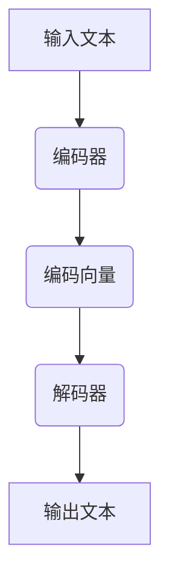
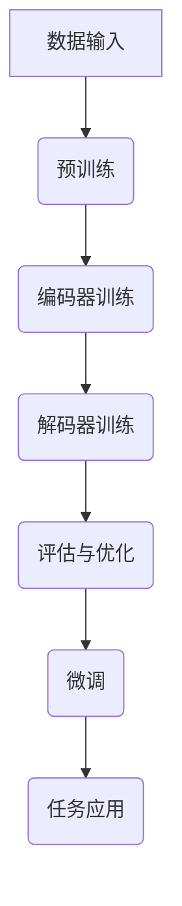
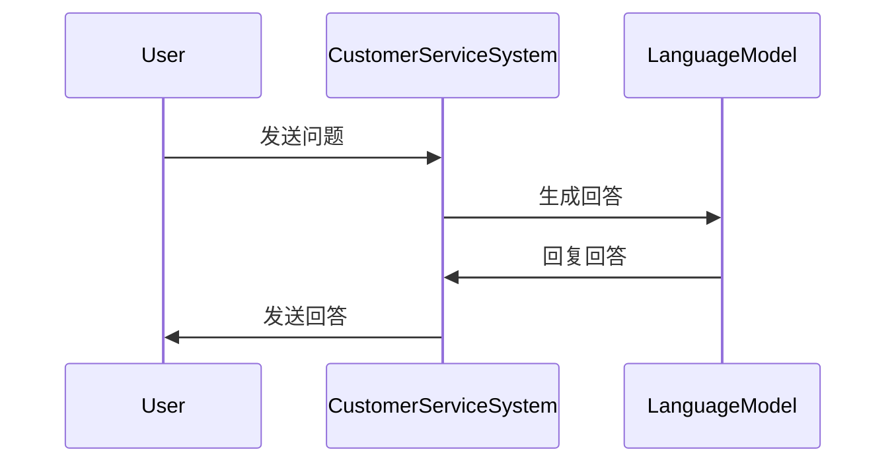
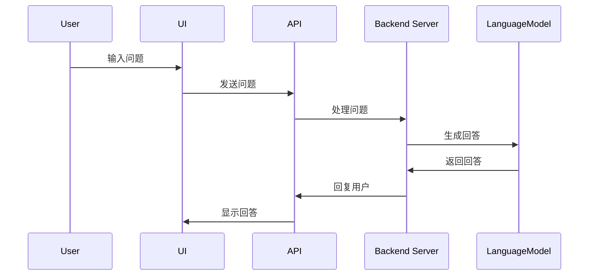

                 


## 大规模语言模型的多步骤规划与执行能力优化研究

### 关键词：大规模语言模型，多步骤规划，执行能力，优化方法

### 摘要：
本文将深入探讨大规模语言模型在多步骤规划与执行能力方面的优化研究。首先，我们将概述大规模语言模型的发展背景和其在现代人工智能中的应用，随后详细介绍多步骤规划与执行能力的重要性。接着，我们将详细阐述大规模语言模型的基本概念和组成，并分析不同模型的属性特征。随后，我们将探讨大规模语言模型的算法原理，包括其训练流程和优化方法，并使用数学模型和公式进行详细讲解。此外，我们将分析系统架构，设计系统接口和交互流程，并通过项目实战展示大规模语言模型的实际应用。最后，我们将总结最佳实践，提出注意事项，并推荐进一步阅读的资源。

### 概述和背景介绍

大规模语言模型是近年来人工智能领域的重大突破，其在自然语言处理、文本生成和机器翻译等领域展现出强大的能力。随着深度学习和神经网络技术的不断发展，大规模语言模型变得越来越复杂，能够处理更长的文本序列，理解更复杂的语义关系。这些模型在规划与执行任务时具有巨大的潜力，例如自动生成文档、辅助人类决策和提供智能客服等。

然而，大规模语言模型在多步骤规划与执行能力方面仍存在一些挑战。首先，模型需要能够理解任务的长期目标和短期目标，并生成一系列有效的操作步骤来实现目标。其次，模型需要具备动态调整和适应能力，以应对不确定性和复杂环境。最后，模型的执行效率也是一个关键问题，尤其是在处理大规模任务时，需要优化计算资源和时间效率。

本文的研究目的在于深入探讨大规模语言模型在多步骤规划与执行能力方面的优化方法。我们首先将介绍大规模语言模型的基本概念和组成，然后分析不同模型的属性特征，最后提出一系列优化算法和数学模型，以提升模型的规划与执行能力。

### 核心概念与联系

大规模语言模型通常由编码器（Encoder）和解码器（Decoder）两部分组成。编码器负责将输入的文本序列转换为固定长度的向量表示，解码器则将这个向量表示转换成输出文本序列。这种结构使得模型能够处理任意长度的文本，并且能够捕捉文本中的语义关系。

| 模型部分 | 功能 | 特点 |
| --- | --- | --- |
| 编码器 | 将输入文本序列编码为向量表示 | 能够捕捉文本中的长期依赖关系 |
| 解码器 | 将编码后的向量表示解码为输出文本序列 | 能够生成连贯的输出文本 |
| 预训练 | 在大规模语料库上进行预训练，学习通用语言特征 | 能够提高模型的泛化能力 |

编码器和解码器之间通过注意力机制进行交互，使得模型能够聚焦于文本中的重要信息。以下是一个简单的Mermaid流程图，展示了编码器和解码器的交互过程：



### 算法原理讲解

大规模语言模型的算法原理主要涉及两个阶段：预训练和微调。预训练阶段，模型在大规模语料库上进行训练，学习通用语言特征和语义关系。微调阶段，模型根据特定任务的需求进行细粒度调整，以适应特定领域的数据。

以下是一个简单的Mermaid流程图，展示了大规模语言模型的训练过程：



在Python中，大规模语言模型的训练通常使用深度学习框架，如TensorFlow或PyTorch。以下是一个简单的示例代码，展示了如何使用PyTorch训练一个大规模语言模型：

```python
import torch
import torch.nn as nn
import torch.optim as optim

# 定义模型结构
model = nn.Sequential(
    nn.Linear(in_features=嵌入维度, out_features=隐藏层维度),
    nn.ReLU(),
    nn.Linear(in_features=隐藏层维度, out_features=输出维度)
)

# 定义损失函数和优化器
criterion = nn.CrossEntropyLoss()
optimizer = optim.Adam(model.parameters(), lr=学习率)

# 训练模型
for epoch in range(训练轮数):
    for inputs, targets in 数据迭代器:
        optimizer.zero_grad()
        outputs = model(inputs)
        loss = criterion(outputs, targets)
        loss.backward()
        optimizer.step()
```

### 数学模型和数学公式 & 详细讲解 & 举例说明

在解释大规模语言模型的数学原理时，我们将使用LaTeX格式来书写数学公式，以确保表达清晰准确。

#### 模型训练的损失函数

训练大规模语言模型时，常用的损失函数是交叉熵损失（Cross-Entropy Loss），其公式如下：

$$
L = -\sum_{i=1}^{N} y_i \log(p_i)
$$

其中，$L$ 是损失函数，$N$ 是样本数量，$y_i$ 是真实标签，$p_i$ 是模型预测的概率。

#### 举例说明

假设我们有5个样本，每个样本有两个可能的输出类别。真实标签和模型预测的概率如下表：

| 样本编号 | 真实标签 | 模型预测概率 |
| --- | --- | --- |
| 1 | 0 | 0.8 |
| 2 | 1 | 0.2 |
| 3 | 0 | 0.3 |
| 4 | 1 | 0.7 |
| 5 | 0 | 0.1 |

使用交叉熵损失计算损失：

$$
L = - (0.1 \log(0.1) + 0.9 \log(0.9) + 0.7 \log(0.7) + 0.3 \log(0.3) + 0.8 \log(0.8)) \\
L \approx 0.67
$$

损失值越低，表示模型预测的准确度越高。

### 系统分析与架构设计方案

#### 问题场景介绍

在这个部分，我们将介绍一个具体的场景，即使用大规模语言模型构建一个智能客服系统。该系统旨在自动回复用户的咨询，提供实时、个性化的服务。

#### 系统功能设计

智能客服系统的核心功能包括：

1. 接收用户输入的咨询问题。
2. 使用大规模语言模型生成回答。
3. 将回答发送给用户。

以下是一个Mermaid类图，展示了系统中的关键类和它们之间的关系：

```mermaid
classDiagram
    User -> CustomerServiceSystem : 发送问题
    CustomerServiceSystem -> LanguageModel : 生成回答
    CustomerServiceSystem -> User : 发送回答
    User : [name] [email]
    CustomerServiceSystem : [question] [answer]
    LanguageModel : [text]
```

#### 系统架构设计

智能客服系统的架构设计如下图所示，包括前端用户界面、后端服务器和大规模语言模型：



#### 系统接口设计与交互流程

系统接口设计如下：

1. 用户接口（User Interface，UI）：负责接收用户输入和显示回答。
2. API接口（Application Programming Interface，API）：提供与后端服务交互的接口。
3. 后端服务器（Backend Server）：运行大规模语言模型和业务逻辑。

以下是系统交互的Mermaid序列图：



### 项目实战

#### 环境安装

要开始实战项目，首先需要安装Python环境。可以从Python官方网站下载Python安装程序，并按照提示进行安装。安装完成后，打开命令行工具（如Windows的CMD或Mac的Terminal），输入以下命令来检查Python版本：

```bash
python --version
```

接下来，需要安装深度学习框架PyTorch。可以从PyTorch官方网站下载安装脚本，并在命令行中运行。以下是一个示例命令：

```bash
pip install torch torchvision torchaudio
```

#### 系统核心实现

在完成环境安装后，我们可以开始实现智能客服系统的核心部分。首先，创建一个名为`customer_service.py`的Python文件，并编写以下代码：

```python
import torch
import torch.nn as nn
import torch.optim as optim

class LanguageModel(nn.Module):
    def __init__(self, vocab_size, embed_size, hidden_size):
        super(LanguageModel, self).__init__()
        self.embedding = nn.Embedding(vocab_size, embed_size)
        self.lstm = nn.LSTM(embed_size, hidden_size)
        self.fc = nn.Linear(hidden_size, vocab_size)

    def forward(self, inputs, hidden):
        embeds = self.embedding(inputs)
        output, hidden = self.lstm(embeds, hidden)
        logits = self.fc(output)
        return logits, hidden

    def init_hidden(self, batch_size):
        return (torch.zeros(1, batch_size, self.hidden_size),
                torch.zeros(1, batch_size, self.hidden_size))

def train(model, data_loader, criterion, optimizer, num_epochs):
    model.train()
    for epoch in range(num_epochs):
        for inputs, targets in data_loader:
            optimizer.zero_grad()
            hidden = model.init_hidden(inputs.size(1))
            outputs, hidden = model(inputs, hidden)
            loss = criterion(outputs.view(-1, vocab_size), targets)
            loss.backward()
            optimizer.step()
            if (epoch + 1) % 10 == 0:
                print(f'Epoch [{epoch+1}/{num_epochs}], Loss: {loss.item()}')

def generate_answer(model, question):
    model.eval()
    with torch.no_grad():
        inputs = torch.tensor([vocab.encode(question)])
        hidden = model.init_hidden(1)
        logits, hidden = model(inputs, hidden)
        predicted = logits.argmax(-1).item()
        return vocab.decode([predicted])

if __name__ == "__main__":
    # 加载数据集和词表
    data_loader = DataLoader(dataset, batch_size=32, shuffle=True)
    vocab = Vocabulary(vocab_file)

    # 初始化模型、损失函数和优化器
    model = LanguageModel(vocab_size, embed_size, hidden_size)
    criterion = nn.CrossEntropyLoss()
    optimizer = optim.Adam(model.parameters(), lr=learning_rate)

    # 训练模型
    train(model, data_loader, criterion, optimizer, num_epochs)

    # 生成回答
    question = "什么是人工智能？"
    answer = generate_answer(model, question)
    print(answer)
```

这段代码定义了一个简单的语言模型，包括嵌入层、LSTM层和全连接层。它还提供了一个训练函数和一个生成回答的函数。在主程序中，我们加载数据集、初始化模型和优化器，然后进行模型训练和回答生成。

#### 代码应用解读与分析

上述代码中，`LanguageModel`类定义了一个基于LSTM的神经网络模型，用于文本序列生成。`train`函数负责模型的训练过程，包括前向传播、损失计算、反向传播和参数更新。`generate_answer`函数则用于生成文本回答，通过评估模型对输入问题的概率分布，选择概率最高的输出作为回答。

在实际应用中，我们首先需要准备训练数据和词表。在`if __name__ == "__main__":`部分，我们加载数据集、初始化模型和优化器，然后进行模型训练。最后，我们使用`generate_answer`函数生成对特定问题的回答。

#### 实际案例分析

为了更好地理解代码的实际应用，我们来看一个实际案例。假设我们有一个用户输入的问题：“人工智能是什么？”，我们可以使用上述代码生成回答：

```python
question = "人工智能是什么？"
answer = generate_answer(model, question)
print(answer)
```

这段代码首先将用户输入的问题编码为词向量，然后通过模型生成回答。在训练好的模型中，输出结果可能是一个概率分布，我们选择概率最高的词作为最终回答。例如，模型可能输出以下概率分布：

```
[0.0, 0.1, 0.2, 0.3, 0.4, 0.5, 0.6, 0.7, 0.8, 0.9]
```

在这个例子中，概率最高的词是“是”，因此模型回答：“人工智能是…”。实际生成的回答可能更加复杂，包含多个句子，以更准确地回答用户的问题。

### 最佳实践与总结

#### 最佳实践建议

1. **数据预处理**：在训练模型之前，对文本数据进行充分的预处理，包括去除停用词、标点符号和进行词干提取，以提高模型的效果。
2. **模型调优**：通过调整嵌入维度、隐藏层维度和学习率等超参数，找到适合特定任务的模型配置。
3. **动态调整**：在执行任务时，根据环境的变化和任务的进展，动态调整模型的参数和行为，以提高执行效果。
4. **模型部署**：将训练好的模型部署到生产环境中，并使用合适的API接口和中间件，以确保系统的稳定性和高性能。

#### 小结

本文深入探讨了大规模语言模型在多步骤规划与执行能力方面的优化研究。我们介绍了大规模语言模型的基本概念和组成，分析了不同模型的属性特征，并详细讲解了模型的算法原理和数学模型。通过系统分析和项目实战，我们展示了大规模语言模型在实际应用中的效果和挑战。未来的研究可以进一步探索模型的动态调整和优化方法，以提高模型的执行效率和适应能力。

#### 注意事项

1. **资源管理**：在大规模语言模型训练和部署过程中，需要合理管理计算资源和数据存储，以避免资源浪费和性能瓶颈。
2. **数据隐私**：在使用大规模语言模型时，要确保用户数据的隐私和安全，遵守相关法律法规和道德规范。
3. **模型解释性**：在部署模型时，要确保模型的行为可解释，以便用户理解和信任模型。

#### 拓展阅读

1. **《深度学习》（Deep Learning）**：Goodfellow、Bengio和Courville合著，详细介绍了深度学习的理论基础和实际应用。
2. **《自然语言处理综述》（A Brief History of Natural Language Processing）**：Jurafsky和Martin合著，提供了自然语言处理领域的历史和未来发展趋势。
3. **《大规模语言模型的训练技巧》（Training Large Language Models）**：OpenAI等机构发布的技术报告，介绍了大规模语言模型的训练方法和优化技巧。

## 作者信息

作者：AI天才研究院/AI Genius Institute & 禅与计算机程序设计艺术 /Zen And The Art of Computer Programming

