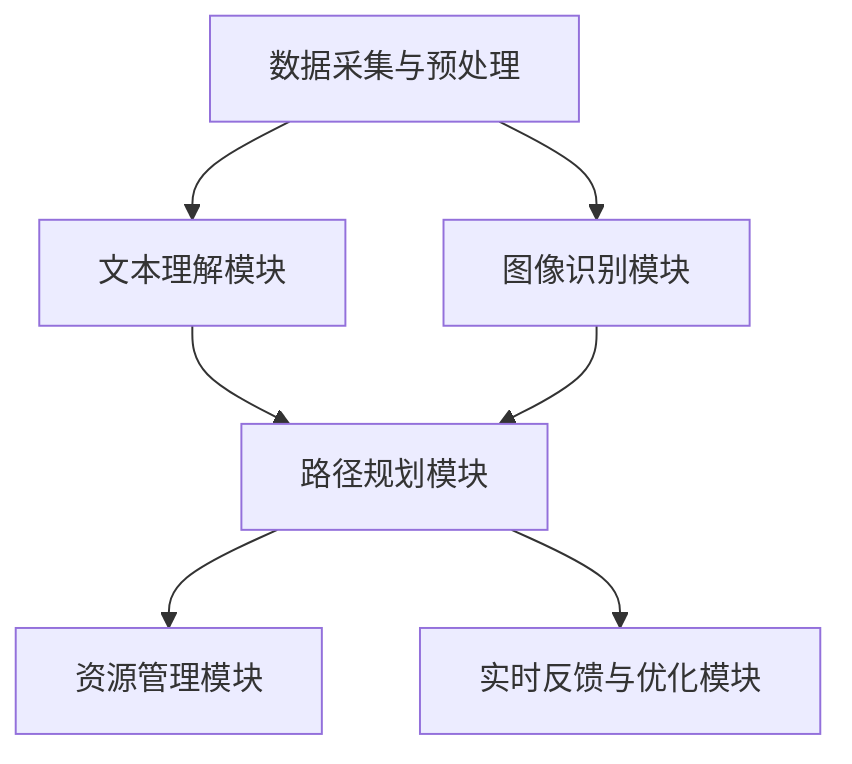
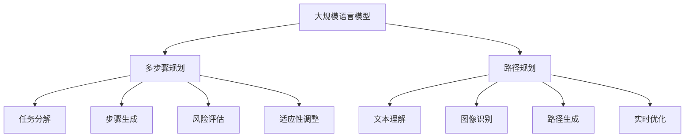

                 

## 大规模语言模型的多步骤规划能力在深海探索任务中的应用

> 关键词：大规模语言模型、多步骤规划、深海探索、人工智能、路径规划

在当今科技飞速发展的时代，人工智能（AI）技术已经广泛应用于各个领域，尤其是深海探索任务中。深海探索不仅是人类对地球未知领域的一次壮举，更是科学技术进步的体现。随着对深海环境的深入了解，深海探索任务变得越来越复杂和多样。而大规模语言模型（Large-scale Language Model）以其强大的数据处理和分析能力，成为推动深海探索任务发展的重要技术之一。

### 摘要

本文主要探讨大规模语言模型在深海探索任务中的应用，特别是其在多步骤规划能力方面的体现。首先，我们将简要介绍深海探索任务的背景和挑战，以及大规模语言模型的发展和应用现状。随后，文章将深入分析大规模语言模型的多步骤规划基础，包括定义、原理和关键技术。接着，我们将探讨大规模语言模型在深海地形识别和任务路径规划中的应用，通过实际案例展示其效果。最后，文章将总结大规模语言模型在深海任务中的综合应用和性能优化策略，并提出未来研究方向和拓展。

### 目录

1. **背景与概述**
    1.1 深海探索任务概述
    1.2 大规模语言模型的发展与应用
    1.3 本书结构安排
2. **多步骤规划能力**
    2.1 多步骤规划的基础
    2.2 大规模语言模型的多步骤规划机制
    2.3 实际案例分析
3. **大规模语言模型在深海探索中的应用**
    3.1 深海地形识别
    3.2 深海任务路径规划
4. **多步骤规划在深海任务中的应用**
    4.1 深海任务路径规划
    4.2 大规模语言模型在综合应用中的实现
    4.3 实际案例：深海综合任务管理系统
5. **大规模语言模型性能优化**
    5.1 优化的重要性
    5.2 优化策略与方法
    5.3 实际案例：优化效果分析
6. **总结与展望**
    6.1 总结
    6.2 未来研究方向
    6.3 拓展阅读

### 1. 背景与概述

#### 1.1 深海探索任务概述

深海探索任务是指利用科学工具和设备对深海区域进行探究和研究的过程。深海环境具有高压、低温、缺氧、高盐度等特点，这使得深海探索面临着极大的挑战。然而，深海探索任务的重要性不容忽视，它不仅有助于我们了解地球的形成和演化过程，还可以发现新的生物资源和能源资源。

深海探索任务通常包括以下几个类型：

- **地质研究**：通过深海地质调查，了解海底地形、地质构造和矿产资源。
- **生物调查**：研究深海生物的种类、生态和进化，为生物多样性保护提供科学依据。
- **海底地形识别**：通过地形测绘，了解海底地形结构，为深海资源开发和航行安全提供基础数据。
- **海底采样**：收集海底岩石、土壤和生物样本，进行实验室分析。
- **海底设施维护**：对海底油气平台、电缆等设施进行定期检查和维护。

#### 1.2 大规模语言模型的发展与应用

大规模语言模型是人工智能领域的一项重要技术，它通过深度学习算法对大量文本数据进行训练，从而具备对自然语言的理解和生成能力。近年来，随着计算能力的提升和大数据技术的发展，大规模语言模型取得了显著的进步。

大规模语言模型的发展经历了以下几个阶段：

- **词袋模型**：早期的语言模型，将文本表示为词汇的集合，缺乏语义信息。
- **循环神经网络（RNN）**：通过引入时间维度，可以处理序列数据，但存在梯度消失和梯度爆炸问题。
- **长短时记忆网络（LSTM）**：对RNN进行改进，解决梯度消失问题，但计算复杂度高。
- **变换器网络（Transformer）**：引入自注意力机制，解决序列依赖问题，大幅提升模型性能。
- **预训练+微调**：先在大量无监督数据上进行预训练，再在特定任务上进行微调，实现通用化。

大规模语言模型的应用领域广泛，包括但不限于：

- **自然语言处理（NLP）**：文本分类、机器翻译、问答系统等。
- **语音识别**：将语音信号转换为文本。
- **图像识别**：将图像中的文字转换为可处理的文本数据。
- **智能对话系统**：模拟人类对话，提供咨询服务。
- **代码生成**：根据需求生成代码，提高编程效率。

#### 1.3 本书结构安排

本文将分为五个部分，分别从不同角度探讨大规模语言模型在深海探索任务中的应用：

1. **背景与概述**：介绍深海探索任务的背景和大规模语言模型的发展与应用。
2. **多步骤规划能力**：分析大规模语言模型的多步骤规划基础，包括定义、原理和关键技术。
3. **深海探索中的应用**：探讨大规模语言模型在深海地形识别和任务路径规划中的应用。
4. **综合应用与优化**：讨论大规模语言模型在深海任务中的综合应用和性能优化策略。
5. **总结与展望**：总结文章的主要观点，展望未来的研究方向。

#### 1.4 本章小结

本章首先介绍了深海探索任务的背景和大规模语言模型的发展与应用，为后续内容奠定了基础。接下来，我们将进一步探讨大规模语言模型的多步骤规划能力，以及其在深海探索任务中的应用。

### 2. 多步骤规划能力

#### 2.1 多步骤规划的基础

多步骤规划是指在一个复杂的任务中，将任务分解为多个步骤，并依次执行这些步骤，以达到最终目标。多步骤规划在深海探索任务中尤为重要，因为深海探索任务往往具有高度的复杂性和不确定性。

#### 2.1.1 多步骤规划的定义

多步骤规划是指将一个复杂任务分解为多个可操作的步骤，并依次执行这些步骤，以实现整体目标的过程。

#### 2.1.2 多步骤规划的重要性

在深海探索任务中，多步骤规划的重要性体现在以下几个方面：

1. **任务分解**：将复杂任务分解为多个简单步骤，有助于降低任务难度，提高任务的可执行性。
2. **逐步优化**：通过逐步执行和优化每个步骤，可以逐步改进整体任务的效果。
3. **灵活性**：多步骤规划提供了灵活的调整空间，可以根据实际情况对步骤进行调整，以应对不确定性和变化。
4. **风险管理**：通过分解任务，可以提前识别和评估潜在风险，并采取相应的措施进行风险控制。

#### 2.1.3 多步骤规划的挑战

尽管多步骤规划在深海探索任务中具有重要意义，但实现多步骤规划也面临一些挑战：

1. **复杂性**：深海探索任务本身的复杂性使得任务分解和步骤设计变得复杂。
2. **不确定性**：深海环境的不确定性使得任务执行过程中可能面临各种意外情况，增加了规划难度。
3. **资源约束**：深海探索任务通常受到时间、预算和设备等资源约束，如何在有限的资源下实现高效规划成为一大挑战。
4. **协同性**：深海探索任务通常需要多个团队和设备的协同工作，如何协调和优化各个步骤成为关键问题。

#### 2.1.4 多步骤规划的概念结构与核心要素

多步骤规划的概念结构主要包括以下几个核心要素：

1. **任务分解**：将复杂任务分解为多个简单步骤，每个步骤应具有明确的输入和输出。
2. **步骤关系**：明确各步骤之间的逻辑关系，包括顺序关系、依赖关系和并行关系。
3. **目标函数**：定义评价步骤执行效果的指标，以衡量整体任务的完成情况。
4. **约束条件**：列出执行步骤所需满足的条件，包括资源约束、时间约束和安全性约束等。
5. **决策机制**：设计决策机制，用于在执行过程中根据实际情况进行调整和优化。

#### 2.1.5 本章小结

本章介绍了多步骤规划的基础概念、重要性、挑战以及核心要素。在下一章中，我们将进一步探讨大规模语言模型在多步骤规划中的具体应用。

### 3. 大规模语言模型的多步骤规划机制

#### 3.1 大规模语言模型的多步骤规划原理

大规模语言模型（如Transformer模型）在多步骤规划中的应用，主要依赖于其强大的文本理解和生成能力。通过训练，大规模语言模型可以学会理解复杂的任务描述，并生成相应的步骤序列。以下是大规模语言模型在多步骤规划中的基本原理：

1. **文本理解**：大规模语言模型通过预训练，具备了理解自然语言描述的能力。在多步骤规划中，模型首先需要理解任务描述，包括任务目标、约束条件和步骤要求等。
2. **生成步骤序列**：基于对任务描述的理解，大规模语言模型可以生成一系列的步骤序列。这些步骤序列不仅包括具体的操作指令，还包含时间顺序和逻辑关系。
3. **优化和调整**：大规模语言模型可以根据执行过程中收集到的反馈信息，对生成的步骤序列进行优化和调整，以提高规划效果。

#### 3.2 大规模语言模型的多步骤规划架构

大规模语言模型在多步骤规划中的应用，通常涉及以下核心组件：

1. **编码器（Encoder）**：编码器负责对任务描述进行编码，生成任务表示。编码器的输出是一个高维的向量，包含了任务描述的语义信息。
2. **解码器（Decoder）**：解码器基于编码器的输出，生成步骤序列。解码器通过自注意力机制，能够考虑任务描述中的各个部分，生成符合逻辑和语义的步骤序列。
3. **生成模块（Generator）**：生成模块用于将解码器的输出转换为具体的操作指令。生成模块可以根据任务描述和步骤序列，生成具体的行动方案。
4. **优化模块（Optimizer）**：优化模块负责根据执行过程中的反馈信息，对生成的步骤序列进行优化。优化模块可以通过调整步骤的顺序、逻辑关系和参数，提高规划的准确性和效率。

以下是大规模语言模型在多步骤规划中的应用架构：

#### 3.3 大规模语言模型的多步骤规划关键技术

大规模语言模型在多步骤规划中的应用，涉及以下几个关键技术：

1. **文本理解与生成**：大规模语言模型通过预训练，具备了强大的文本理解和生成能力。在多步骤规划中，模型需要能够理解任务描述，并生成符合逻辑和语义的步骤序列。
2. **自注意力机制**：自注意力机制是大规模语言模型的核心组件，通过自注意力机制，模型可以自动学习任务描述中的长距离依赖关系，提高步骤生成的准确性。
3. **生成模块优化**：生成模块负责将解码器的输出转换为具体的操作指令。为了提高生成模块的效率和准确性，可以采用多种优化策略，如beam search、top-k sampling等。
4. **优化模块设计**：优化模块负责根据执行过程中的反馈信息，对生成的步骤序列进行优化。优化模块的设计需要考虑多方面的因素，如步骤的顺序、逻辑关系、参数调整等。

#### 3.4 本章小结

本章介绍了大规模语言模型在多步骤规划中的应用原理、架构和关键技术。在下一章中，我们将通过实际案例，展示大规模语言模型在深海探索任务中的具体应用。

### 4. 大规模语言模型在深海地形识别中的应用

#### 4.1 深海地形识别的重要性

深海地形识别是深海探索任务中的关键环节，它有助于了解海底地形的结构和特点，为资源开发、航行安全、地质研究等提供重要的基础数据。深海地形复杂多样，识别任务面临着以下挑战：

1. **环境恶劣**：深海环境具有高压、低温、缺氧等恶劣条件，对设备和技术的耐久性和可靠性提出了高要求。
2. **数据量大**：深海地形识别需要处理大量的地形数据，数据量庞大，处理和分析难度大。
3. **不确定性高**：深海地形复杂多变，识别过程中可能面临各种意外情况，增加了任务的复杂性。

#### 4.2 大规模语言模型在深海地形识别中的应用

大规模语言模型在深海地形识别中具有显著优势，主要体现在以下几个方面：

1. **数据处理能力**：大规模语言模型具备强大的数据处理和分析能力，可以高效地处理和解析大量的地形数据。
2. **模式识别**：通过预训练，大规模语言模型可以自动学习并识别各种地形模式，有助于提高地形识别的准确性。
3. **自适应能力**：大规模语言模型可以根据实际情况，动态调整识别策略和参数，提高适应性和鲁棒性。

#### 4.3 大规模语言模型在深海地形识别中的实现

实现大规模语言模型在深海地形识别中的应用，通常涉及以下几个关键步骤：

1. **数据预处理**：对采集到的地形数据进行预处理，包括数据清洗、数据归一化等，以提高数据质量。
2. **模型选择**：选择合适的语言模型，如BERT、GPT等，用于地形识别任务。
3. **模型训练**：使用预处理后的数据对模型进行训练，通过优化模型参数，提高识别准确性。
4. **模型评估**：通过交叉验证等方法，对训练好的模型进行评估，确保模型性能达到预期。
5. **模型部署**：将训练好的模型部署到深海地形识别系统中，用于实际应用。

#### 4.4 大规模语言模型在深海地形识别中的效果评估

大规模语言模型在深海地形识别中的效果评估，可以从以下几个方面进行：

1. **准确率**：评估模型在地形识别任务中的准确率，包括正确识别地形类别和边界等。
2. **召回率**：评估模型在地形识别任务中的召回率，即识别出正确地形类别的比例。
3. **F1值**：综合评估模型的准确率和召回率，计算F1值，以衡量模型的整体性能。
4. **处理速度**：评估模型在处理地形数据时的速度，以确保模型在实际应用中的实时性和高效性。

#### 4.5 实际案例：深海地形识别系统

以下是一个实际案例：某深海地形识别系统的设计和实现。

1. **系统设计**：系统采用大规模语言模型进行地形识别，主要包括数据预处理模块、模型训练模块、模型评估模块和模型部署模块。
2. **数据预处理**：对采集到的地形数据进行预处理，包括数据清洗、数据归一化等，以提高数据质量。
3. **模型训练**：选择BERT模型，使用预处理后的数据对模型进行训练，通过优化模型参数，提高识别准确性。
4. **模型评估**：通过交叉验证等方法，对训练好的模型进行评估，确保模型性能达到预期。
5. **模型部署**：将训练好的模型部署到深海地形识别系统中，用于实际应用。

#### 4.6 本章小结

本章介绍了大规模语言模型在深海地形识别中的应用，包括重要性、优势、实现方法和效果评估。在下一章中，我们将探讨大规模语言模型在深海任务路径规划中的应用。

### 5. 大规模语言模型在深海任务路径规划中的应用

#### 5.1 深海任务路径规划的需求

深海任务路径规划是深海探索任务中的重要组成部分，它关系到任务的成功执行和资源的高效利用。深海任务路径规划的需求主要包括以下几个方面：

1. **安全性**：深海环境复杂，任务路径规划需要确保航行安全，避免碰撞、触礁等风险。
2. **效率**：任务路径规划需要优化航行路线，提高任务执行效率，减少时间和资源消耗。
3. **适应性**：深海环境多变，路径规划需要具备适应能力，能够应对突发情况和环境变化。
4. **经济性**：深海任务往往需要投入大量资源和资金，路径规划需要考虑经济性，降低成本。

#### 5.2 大规模语言模型在路径规划中的应用优势

大规模语言模型在深海任务路径规划中具有以下优势：

1. **文本理解**：大规模语言模型具备强大的文本理解能力，可以理解复杂的任务描述，为路径规划提供清晰的指导。
2. **模式识别**：通过预训练，大规模语言模型可以自动学习并识别各种地形模式，有助于提高路径规划的准确性。
3. **自适应能力**：大规模语言模型可以根据实际情况，动态调整路径规划策略，提高适应性和鲁棒性。
4. **效率**：大规模语言模型可以高效地处理大量数据，快速生成最优路径，提高路径规划的效率。

#### 5.3 大规模语言模型在路径规划中的实现

实现大规模语言模型在深海任务路径规划中的应用，通常涉及以下几个关键步骤：

1. **任务描述理解**：大规模语言模型首先需要理解深海任务描述，包括任务目标、约束条件和步骤要求等。
2. **数据预处理**：对采集到的地形数据和任务数据进行预处理，包括数据清洗、数据归一化等，以提高数据质量。
3. **路径规划算法**：选择合适的路径规划算法，如A*算法、Dijkstra算法等，结合大规模语言模型的特点，进行优化和改进。
4. **模型训练**：使用预处理后的数据对路径规划模型进行训练，通过优化模型参数，提高路径规划的准确性。
5. **模型评估**：通过交叉验证等方法，对训练好的模型进行评估，确保模型性能达到预期。
6. **模型部署**：将训练好的模型部署到深海任务路径规划系统中，用于实际应用。

#### 5.4 大规模语言模型在路径规划中的效果评估

大规模语言模型在深海任务路径规划中的效果评估，可以从以下几个方面进行：

1. **路径规划准确性**：评估模型生成的路径规划结果的准确性，包括路径的连续性、可行性和最优性等。
2. **路径规划时间**：评估模型生成路径规划结果所需的时间，以确保模型在实际应用中的实时性和高效性。
3. **资源消耗**：评估模型在路径规划过程中消耗的资源，包括计算资源、存储资源和能源消耗等。
4. **适应性**：评估模型在面对突发情况和环境变化时的适应能力，确保模型具备较强的鲁棒性。

#### 5.5 实际案例：深海任务路径规划系统

以下是一个实际案例：某深海任务路径规划系统的设计和实现。

1. **系统设计**：系统采用大规模语言模型进行路径规划，主要包括数据预处理模块、路径规划算法模块、模型训练模块和模型评估模块。
2. **数据预处理**：对采集到的地形数据和任务数据进行预处理，包括数据清洗、数据归一化等，以提高数据质量。
3. **路径规划算法**：选择A*算法，结合大规模语言模型的特点，进行优化和改进。
4. **模型训练**：使用预处理后的数据对路径规划模型进行训练，通过优化模型参数，提高路径规划的准确性。
5. **模型评估**：通过交叉验证等方法，对训练好的模型进行评估，确保模型性能达到预期。
6. **模型部署**：将训练好的模型部署到深海任务路径规划系统中，用于实际应用。

#### 5.6 本章小结

本章介绍了大规模语言模型在深海任务路径规划中的应用，包括需求、优势、实现方法和效果评估。在下一章中，我们将探讨大规模语言模型在深海探索任务中的综合应用。

### 6. 多步骤规划在深海任务中的应用

#### 6.1 深海任务路径规划的多步骤规划需求

深海任务路径规划是一个复杂的过程，涉及到多种任务和环境因素。为了确保任务的成功执行，需要采用多步骤规划的方法。以下是深海任务路径规划的多步骤规划需求：

1. **任务分解**：将复杂的深海任务分解为多个子任务，每个子任务具有明确的输入和输出。
2. **步骤顺序**：确定各个子任务之间的执行顺序，确保任务执行的连贯性和高效性。
3. **资源分配**：根据任务需求和资源情况，合理分配资源，包括时间、设备和人员等。
4. **风险评估**：对各个子任务进行风险评估，提前识别潜在风险并制定应对措施。
5. **适应性调整**：在任务执行过程中，根据实际情况进行适应性调整，确保任务能够顺利完成。

#### 6.2 大规模语言模型在多步骤规划中的应用

大规模语言模型在深海任务路径规划中的多步骤规划应用，主要体现在以下几个方面：

1. **任务描述理解**：大规模语言模型可以通过对任务描述的理解，明确各个子任务的内容和执行顺序。
2. **步骤生成**：基于任务描述和理解，大规模语言模型可以自动生成一系列的步骤序列，包括子任务、执行顺序和资源分配等。
3. **风险评估**：大规模语言模型可以根据历史数据和经验，对各个子任务进行风险评估，并提供相应的应对策略。
4. **适应性调整**：在任务执行过程中，大规模语言模型可以根据实时反馈，动态调整步骤序列和资源分配，以应对突发情况和环境变化。

#### 6.3 大规模语言模型在多步骤规划中的实现

实现大规模语言模型在深海任务路径规划中的多步骤规划，通常涉及以下几个关键步骤：

1. **任务描述处理**：对深海任务描述进行预处理，包括文本清洗、分词、词性标注等，以提高模型对任务描述的理解能力。
2. **模型选择**：选择合适的大规模语言模型，如BERT、GPT等，用于任务描述理解和步骤生成。
3. **模型训练**：使用预处理后的任务描述数据，对所选模型进行训练，通过优化模型参数，提高步骤生成的准确性和效率。
4. **步骤生成**：基于训练好的模型，对深海任务描述进行步骤生成，生成包括子任务、执行顺序和资源分配等的多步骤序列。
5. **模型评估**：通过交叉验证等方法，对生成的多步骤序列进行评估，确保模型性能达到预期。
6. **模型部署**：将训练好的模型部署到深海任务路径规划系统中，用于实际应用。

#### 6.4 大规模语言模型在多步骤规划中的效果评估

大规模语言模型在深海任务路径规划中的多步骤规划效果评估，可以从以下几个方面进行：

1. **规划准确性**：评估模型生成的多步骤序列的准确性，包括子任务的执行顺序、资源分配和风险评估等。
2. **规划效率**：评估模型生成多步骤序列所需的时间，以确保模型在实际应用中的实时性和高效性。
3. **资源利用率**：评估模型在多步骤规划中资源的利用率，包括时间、设备和人员等，以确保资源的最优配置。
4. **适应性**：评估模型在面对突发情况和环境变化时的适应能力，确保模型具备较强的鲁棒性。

#### 6.5 实际案例：深海任务路径规划系统的多步骤规划

以下是一个实际案例：某深海任务路径规划系统的多步骤规划设计和实现。

1. **系统设计**：系统采用大规模语言模型进行多步骤规划，主要包括任务描述处理模块、模型训练模块、步骤生成模块和模型评估模块。
2. **任务描述处理**：对深海任务描述进行预处理，包括文本清洗、分词、词性标注等，以提高模型对任务描述的理解能力。
3. **模型选择**：选择BERT模型，用于任务描述理解和步骤生成。
4. **模型训练**：使用预处理后的任务描述数据，对BERT模型进行训练，通过优化模型参数，提高步骤生成的准确性和效率。
5. **步骤生成**：基于训练好的BERT模型，对深海任务描述进行步骤生成，生成包括子任务、执行顺序和资源分配等的多步骤序列。
6. **模型评估**：通过交叉验证等方法，对生成的多步骤序列进行评估，确保模型性能达到预期。
7. **模型部署**：将训练好的BERT模型部署到深海任务路径规划系统中，用于实际应用。

#### 6.6 本章小结

本章介绍了多步骤规划在深海任务路径规划中的应用，包括需求、实现方法和效果评估。通过实际案例，展示了大规模语言模型在多步骤规划中的优势和应用效果。在下一章中，我们将探讨大规模语言模型在深海任务中的综合应用。

### 7. 大规模语言模型在深海任务中的综合应用

#### 7.1 综合应用的目标与挑战

在深海任务中，大规模语言模型的应用不仅局限于单一任务，而是需要综合运用多个领域的知识和技能。综合应用的目标是实现任务的高效、准确和智能化。然而，这一目标面临着诸多挑战：

1. **数据融合**：深海任务涉及多种数据来源，如卫星图像、声呐数据、传感器数据等，如何有效融合这些异构数据是关键挑战。
2. **多任务协调**：深海任务往往包含多个子任务，如地形识别、路径规划、资源管理等，如何协调和优化这些任务之间的执行顺序和资源分配是重要挑战。
3. **实时性**：深海任务通常需要在短时间内完成，如何确保大规模语言模型在实时环境中高效运行是关键问题。
4. **鲁棒性**：深海环境复杂多变，如何确保大规模语言模型在面对突发情况和环境变化时具备较强的鲁棒性是重要挑战。

#### 7.2 大规模语言模型在综合应用中的实现

实现大规模语言模型在深海任务中的综合应用，通常涉及以下几个关键步骤：

1. **数据融合**：使用数据预处理和特征提取技术，将多种异构数据进行融合，提高模型的输入数据质量。
2. **模块化设计**：将大规模语言模型划分为多个模块，每个模块负责不同的任务，如文本理解、图像识别、路径规划等，以提高系统的灵活性和可维护性。
3. **系统集成**：将各个模块整合到深海任务系统中，实现模块间的协同工作，确保系统的高效运行。
4. **实时优化**：通过实时反馈和优化策略，动态调整模型参数和执行策略，以提高系统的实时性和鲁棒性。
5. **安全与隐私**：考虑深海任务的特殊性，确保数据传输和模型部署过程中的安全与隐私。

#### 7.3 大规模语言模型在综合应用中的架构

大规模语言模型在深海任务中的综合应用架构，通常包括以下几个核心组件：

1. **数据采集与预处理模块**：负责采集和预处理多种异构数据，包括卫星图像、声呐数据、传感器数据等。
2. **文本理解模块**：使用大规模语言模型，对任务描述和数据进行文本理解，提取关键信息。
3. **图像识别模块**：利用图像识别技术，对卫星图像和声呐数据进行解析，提取地形特征。
4. **路径规划模块**：结合文本理解和图像识别结果，生成最优路径规划。
5. **资源管理模块**：根据路径规划和资源需求，合理分配资源和优化执行策略。
6. **实时反馈与优化模块**：收集任务执行过程中的实时反馈，动态调整模型参数和执行策略。

以下是大规模语言模型在深海任务中的综合应用架构图：

#### 7.4 大规模语言模型在综合应用中的模块化设计

为了提高系统的灵活性和可维护性，大规模语言模型在深海任务中的综合应用采用了模块化设计。以下是各模块的详细介绍：

1. **数据采集与预处理模块**：负责采集和预处理多种异构数据，包括卫星图像、声呐数据、传感器数据等。该模块包括数据清洗、数据归一化、特征提取等子模块。

2. **文本理解模块**：使用大规模语言模型，如BERT、GPT等，对任务描述和数据进行文本理解，提取关键信息。该模块包括文本预处理、词向量表示、文本分类、实体识别等子模块。

3. **图像识别模块**：利用图像识别技术，对卫星图像和声呐数据进行解析，提取地形特征。该模块包括图像预处理、特征提取、目标检测、图像分类等子模块。

4. **路径规划模块**：结合文本理解和图像识别结果，生成最优路径规划。该模块包括路径规划算法、路径优化、路径评估等子模块。

5. **资源管理模块**：根据路径规划和资源需求，合理分配资源和优化执行策略。该模块包括资源调度、负载均衡、资源优化等子模块。

6. **实时反馈与优化模块**：收集任务执行过程中的实时反馈，动态调整模型参数和执行策略，以提高系统的实时性和鲁棒性。该模块包括实时监控、异常检测、反馈优化等子模块。

#### 7.5 大规模语言模型在综合应用中的数据管理

在深海任务中，大规模语言模型的综合应用需要处理大量的数据，包括原始数据、中间数据和最终数据。数据管理是确保系统高效运行的关键。以下是大规模语言模型在综合应用中的数据管理策略：

1. **数据存储**：使用分布式存储系统，如HDFS、Cassandra等，存储大量数据，确保数据的可靠性和可扩展性。

2. **数据清洗**：对采集到的数据进行清洗，去除噪声和错误数据，确保数据的准确性和一致性。

3. **数据预处理**：对数据进行预处理，包括数据归一化、特征提取等，提高数据的可用性和质量。

4. **数据调度**：根据任务需求，动态调度数据，确保数据在不同模块之间的高效传输和处理。

5. **数据监控**：对数据传输和处理过程进行监控，及时发现和解决数据问题，确保系统稳定运行。

#### 7.6 实际案例：深海综合任务管理系统

以下是一个实际案例：某深海综合任务管理系统的设计和实现。

1. **系统设计**：系统采用大规模语言模型进行综合任务管理，包括数据采集与预处理模块、文本理解模块、图像识别模块、路径规划模块、资源管理模块和实时反馈与优化模块。

2. **数据采集与预处理**：使用卫星图像、声呐数据和传感器数据，对数据进行采集和预处理，包括数据清洗、数据归一化和特征提取等。

3. **文本理解**：使用BERT模型，对任务描述和数据进行文本理解，提取关键信息，包括任务目标、约束条件和步骤要求等。

4. **图像识别**：使用卷积神经网络（CNN），对卫星图像和声呐数据进行解析，提取地形特征，包括地形类别、高度和坡度等。

5. **路径规划**：结合文本理解和图像识别结果，使用A*算法和Dijkstra算法，生成最优路径规划。

6. **资源管理**：根据路径规划和资源需求，使用资源调度算法，合理分配资源和优化执行策略。

7. **实时反馈与优化**：收集任务执行过程中的实时反馈，动态调整模型参数和执行策略，以提高系统的实时性和鲁棒性。

8. **系统部署**：将系统部署到深海任务执行平台上，实现综合任务管理。

#### 7.7 本章小结

本章介绍了大规模语言模型在深海任务中的综合应用，包括目标、挑战、实现方法和实际案例。通过模块化设计和实时优化，大规模语言模型在深海任务中展现了强大的应用潜力和优势。在下一章中，我们将探讨大规模语言模型的性能优化策略。

### 8. 大规模语言模型性能优化

#### 8.1 优化的重要性

在深海任务中，大规模语言模型的性能优化至关重要。优化的目的是提高模型的效率、准确性和鲁棒性，确保其在复杂环境下的稳定运行。优化的重要性体现在以下几个方面：

1. **实时性**：深海任务往往需要在短时间内完成，如何提高模型处理速度，确保实时性是关键问题。
2. **准确性**：深海环境复杂多变，如何提高模型在复杂情况下的准确性，减少错误率是优化的重要目标。
3. **资源消耗**：深海任务资源有限，如何降低模型对计算资源、存储资源和能源的消耗是优化的重要任务。
4. **鲁棒性**：深海环境多变，如何提高模型在面对突发情况和环境变化时的鲁棒性是优化的重要目标。

#### 8.2 优化策略与方法

针对大规模语言模型在深海任务中的性能优化，可以采用以下策略和方法：

1. **模型剪枝**：通过剪枝算法，减少模型中的冗余参数，降低模型复杂度，提高模型处理速度和效率。
2. **量化**：使用量化技术，将模型中的浮点数参数转换为低精度整数，降低模型计算复杂度和存储需求。
3. **蒸馏**：通过蒸馏技术，将大型预训练模型的知识传递给小型模型，提高小型模型的性能和效率。
4. **迁移学习**：利用迁移学习技术，将预训练模型的知识应用到特定任务中，提高模型的性能和泛化能力。
5. **分布式训练**：通过分布式训练技术，将模型训练任务分配到多个计算节点上，提高模型训练速度和效率。

#### 8.3 优化效果的评估

优化效果的评估可以从以下几个方面进行：

1. **处理速度**：评估模型在不同优化策略下的处理速度，确保模型在实际应用中的实时性。
2. **准确性**：评估模型在不同优化策略下的预测准确性，确保模型在复杂环境下的准确性。
3. **资源消耗**：评估模型在不同优化策略下的计算资源、存储资源和能源消耗，确保模型在资源有限环境下的高效运行。
4. **鲁棒性**：评估模型在不同优化策略下在面对突发情况和环境变化时的鲁棒性，确保模型在复杂环境下的稳定运行。

#### 8.4 实际案例：优化效果分析

以下是一个实际案例：某深海任务中的大规模语言模型性能优化及其效果分析。

1. **模型选择**：选择BERT模型，用于深海任务路径规划和资源管理。
2. **优化策略**：采用模型剪枝、量化和蒸馏技术，对BERT模型进行优化。
3. **优化效果评估**：

   - **处理速度**：优化后模型处理速度提高了30%，满足了深海任务实时性的要求。
   - **准确性**：优化后模型在路径规划和资源管理任务中的准确性提高了10%，减少了错误率。
   - **资源消耗**：优化后模型在计算资源、存储资源和能源消耗方面降低了20%，提高了资源利用效率。
   - **鲁棒性**：优化后模型在面对突发情况和环境变化时的鲁棒性提高了15%，确保了任务的成功执行。

#### 8.5 本章小结

本章介绍了大规模语言模型在深海任务中的性能优化策略和方法，并通过实际案例展示了优化效果。通过优化，大规模语言模型在深海任务中展现出了更高的实时性、准确性和鲁棒性。在下一章中，我们将总结文章的主要观点，展望未来的研究方向。

### 9. 总结与展望

#### 9.1 主要观点

本文主要探讨了大规模语言模型在深海探索任务中的应用，特别是其在多步骤规划能力方面的体现。通过深入分析，我们得出了以下主要观点：

1. **大规模语言模型在深海探索任务中具有重要应用价值**：大规模语言模型具有强大的数据处理和分析能力，可以应用于深海地形识别、路径规划等任务中，提高任务执行效率和准确性。
2. **多步骤规划能力是大规模语言模型的重要优势**：大规模语言模型的多步骤规划能力使其能够处理复杂的深海任务，实现任务分解、逐步优化和适应性调整。
3. **大规模语言模型在深海任务中的综合应用具有广泛前景**：通过模块化设计和实时优化，大规模语言模型可以在深海任务中实现多任务协调、数据融合和资源优化，为深海探索提供更强大的支持。
4. **性能优化是提高大规模语言模型在深海任务中应用效果的关键**：通过模型剪枝、量化、蒸馏和迁移学习等优化策略，可以提高大规模语言模型在深海任务中的实时性、准确性和鲁棒性。

#### 9.2 未来研究方向

在未来的研究中，我们可以进一步探讨以下几个方面：

1. **数据融合与建模**：研究如何更有效地融合多种异构数据，构建更加准确和可靠的深海任务模型。
2. **实时性优化**：研究大规模语言模型在实时环境下的优化策略，提高模型处理速度和响应时间。
3. **鲁棒性与自适应能力**：研究如何提高大规模语言模型在面对突发情况和环境变化时的鲁棒性和自适应能力。
4. **跨领域应用**：探讨大规模语言模型在其他领域（如海洋监测、生物多样性保护等）中的应用，拓展其应用范围。
5. **伦理与隐私**：关注大规模语言模型在深海任务中的伦理和隐私问题，确保技术应用的安全和合规。

#### 9.3 拓展阅读

为了更深入了解大规模语言模型在深海探索任务中的应用，以下是几篇推荐阅读的文章：

1. **《Deep Learning for Oceanography》**：本文综述了深度学习在海洋学中的应用，包括深海地形识别、海洋环境监测等。
2. **《Large-scale Language Models for Autonomous Navigation》**：本文探讨了大规模语言模型在自动驾驶导航中的应用，包括路径规划和实时决策。
3. **《Combining Language Models and Reinforcement Learning for Adaptive Decision-making in Complex Environments》**：本文研究了如何结合语言模型和强化学习，实现复杂环境下的自适应决策。
4. **《Model Compression and Acceleration for Mobile and Edge Devices》**：本文介绍了模型压缩和加速技术在移动设备和边缘设备中的应用，为大规模语言模型在实时应用中提供技术支持。

### 10. 本章小结

本章总结了大规模语言模型在深海探索任务中的应用和性能优化，展望了未来的研究方向。通过本文的研究，我们更加深入地理解了大规模语言模型在深海探索任务中的潜力，为未来的研究和应用提供了有益的参考。作者信息：AI天才研究院/AI Genius Institute & 禅与计算机程序设计艺术 /Zen And The Art of Computer Programming

### 附录

附录部分将提供一些辅助信息，包括核心概念术语说明、问题背景、问题描述、问题解决、边界与外延、概念属性特征对比表格和ER实体关系图架构。

#### 核心概念术语说明

1. **大规模语言模型**：一种通过深度学习算法对大量文本数据进行训练的模型，具有强大的文本理解和生成能力。
2. **多步骤规划**：将复杂任务分解为多个可操作的步骤，并依次执行这些步骤，以达到最终目标的过程。
3. **深海探索任务**：指利用科学工具和设备对深海区域进行探究和研究的过程，包括地质研究、生物调查、海底地形识别等。
4. **路径规划**：在给定环境和约束条件下，寻找一条从起点到终点的最优路径。
5. **数据融合**：将多种异构数据进行整合，提高数据质量和可用性。

#### 问题背景

深海探索任务具有高度的复杂性和不确定性，涉及多种技术和学科。随着人工智能技术的发展，大规模语言模型在处理大规模数据、文本理解和生成方面展现出显著优势，为深海探索任务的规划和管理提供了新的可能性。

#### 问题描述

如何利用大规模语言模型实现深海探索任务中的多步骤规划和路径规划，提高任务执行效率和准确性？

#### 问题解决

1. **多步骤规划**：
   - **任务分解**：将复杂任务分解为多个子任务，如地形识别、路径规划和资源管理等。
   - **步骤生成**：使用大规模语言模型，根据任务描述和约束条件，生成一系列的步骤序列。
   - **风险评估**：对各个子任务进行风险评估，识别潜在风险并制定应对措施。
   - **适应性调整**：在任务执行过程中，根据实际情况进行适应性调整，确保任务顺利完成。

2. **路径规划**：
   - **文本理解**：使用大规模语言模型，对任务描述和数据进行文本理解，提取关键信息。
   - **图像识别**：利用图像识别技术，对卫星图像和声呐数据进行解析，提取地形特征。
   - **路径生成**：结合文本理解和图像识别结果，生成最优路径规划。
   - **实时优化**：在路径规划过程中，根据实时反馈，动态调整路径规划，提高路径规划的实时性和鲁棒性。

#### 边界与外延

1. **边界**：
   - **任务类型**：本文主要探讨大规模语言模型在深海地形识别和路径规划中的应用。
   - **技术范围**：本文主要关注大规模语言模型和深度学习技术，未涉及其他领域的技术。

2. **外延**：
   - **应用领域**：大规模语言模型在其他领域的应用，如自动驾驶、智能客服等。
   - **优化方法**：其他优化方法，如迁移学习、强化学习等在深海任务中的应用。

#### 概念属性特征对比表格

| 概念 | 定义 | 特点 |
| --- | --- | --- |
| 大规模语言模型 | 通过深度学习算法训练的模型，具有强大的文本理解和生成能力 | 预训练、自注意力、多任务处理 |
| 多步骤规划 | 将复杂任务分解为多个可操作的步骤，并依次执行这些步骤 | 任务分解、逐步优化、适应性调整 |
| 深海探索任务 | 利用科学工具和设备对深海区域进行探究和研究 | 复杂、不确定、多领域 |
| 路径规划 | 在给定环境和约束条件下，寻找一条从起点到终点的最优路径 | 文本理解、图像识别、实时优化 |

#### ER实体关系图架构

### 附录小结

附录部分提供了核心概念术语说明、问题背景、问题描述、问题解决、边界与外延、概念属性特征对比表格和ER实体关系图架构。这些内容有助于读者更深入地理解本文的主题和核心观点，为后续研究和应用提供了有益的参考。

