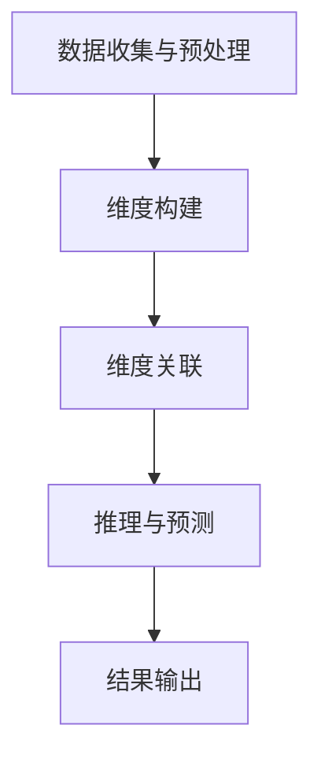
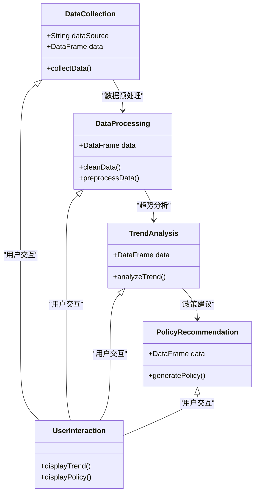
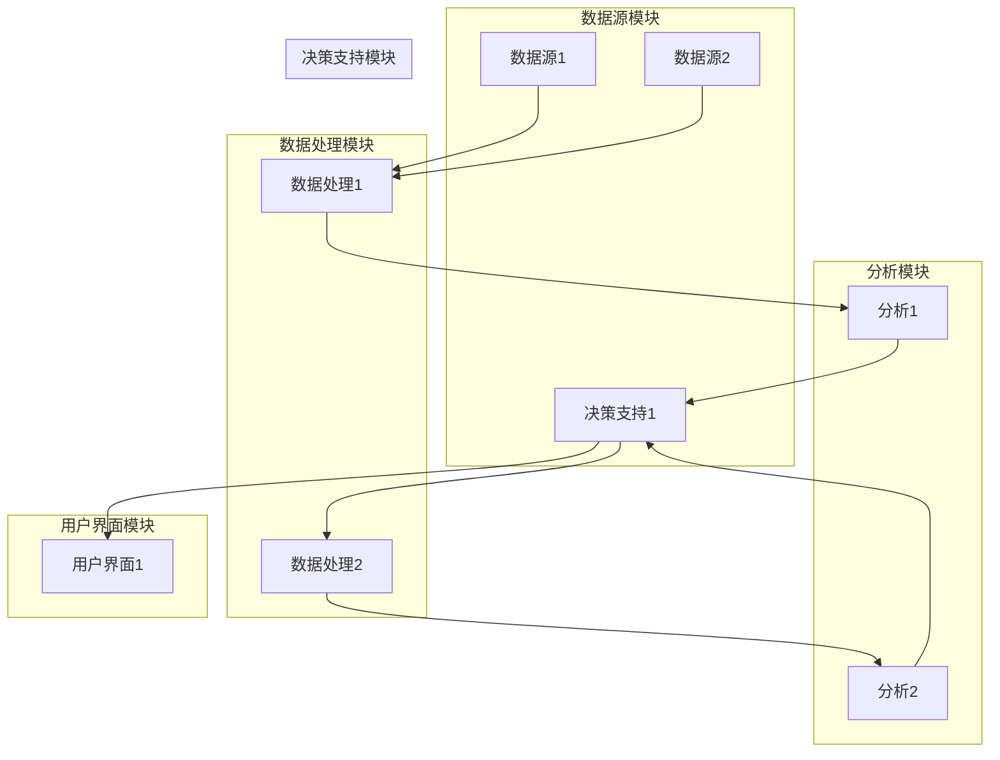

                 

### 第一部分：引言

## 第1章：问题背景与核心概念

### 1.1 问题的提出

在当今全球化的背景下，外交决策变得日益复杂和多样化。传统的决策方法往往依赖于经验、直觉和专家判断，这在一定程度上限制了决策的效率和准确性。随着人工智能技术的迅速发展，特别是大规模语言模型（如GPT系列）和多维度推理技术的出现，为智能外交决策支持系统的开发提供了新的可能性。

本篇文章将探讨如何利用大规模语言模型的多维度推理技术，构建一个智能外交决策支持系统。该系统旨在通过自动化的分析、推理和预测，帮助决策者更好地理解和应对复杂的国际关系，提高外交决策的效率和准确性。

### 1.2 大规模语言模型概述

大规模语言模型是一种基于深度学习的技术，通过训练大量的文本数据，模型能够生成与输入文本相似的自然语言文本。GPT（Generative Pre-trained Transformer）系列模型是其中最为著名的代表，它由OpenAI开发，具有强大的文本生成和语言理解能力。

GPT模型的工作原理是通过Transformer架构进行自注意力机制的学习，从而捕捉输入文本中的上下文关系。在训练过程中，模型接收一系列的文本输入，并输出与之对应的概率分布。通过最大化输入文本和输出文本之间的相似度，模型逐渐学会生成语义上连贯和合理的文本。

### 1.3 多维度推理原理

多维度推理是一种利用多个独立且相互关联的维度进行综合分析和推理的方法。在智能外交决策支持系统中，多维度推理可以帮助模型从不同的视角对问题进行深入分析和理解。

多维度推理通常包括以下几个步骤：

1. **数据收集与预处理**：从各种数据源（如新闻、报告、社交媒体等）收集相关数据，并进行预处理，如文本清洗、实体识别和关系抽取等。
2. **维度构建**：将收集到的数据按照不同的维度进行分类和构建。例如，可以按照国家、地区、政策、经济等多个维度进行数据组织。
3. **维度关联**：通过分析不同维度之间的关联，构建多维度的关联图或网络。这有助于理解各个维度之间的相互作用和影响。
4. **推理与预测**：利用构建的多维度模型，对特定问题进行推理和预测。通过分析不同维度之间的关系，模型可以生成有关国际关系和外交决策的洞见和建议。

### 1.4 智能外交决策支持系统介绍

智能外交决策支持系统是一种综合利用人工智能、大数据分析和多维度推理技术，为外交决策提供支持的系统。该系统的主要功能包括：

1. **情报收集与整理**：从多种数据源收集与外交决策相关的信息，并自动整理成可分析的形式。
2. **趋势分析与预测**：利用大规模语言模型和多维度推理技术，对国际关系和外交政策的发展趋势进行预测。
3. **政策建议生成**：基于对当前国际形势的分析和预测，为决策者提供具体的政策建议和方案。
4. **决策支持**：通过模拟和预测结果，帮助决策者更好地评估不同决策方案的潜在影响和风险。

智能外交决策支持系统的实现需要结合大规模语言模型和多维度推理技术，形成一个高度集成和智能化的决策支持平台。这不仅能够提高决策的效率和准确性，还能够为外交决策提供更加全面和深入的洞见。

### 1.5 文章结构概述

本文的结构将分为四个主要部分：

1. **第一部分：引言**：介绍问题背景和核心概念。
2. **第二部分：算法原理与实现**：详细讲解大规模语言模型和多维度推理算法。
3. **第三部分：系统分析与设计**：设计智能外交决策支持系统的架构和功能。
4. **第四部分：项目实战**：选择一个实际项目进行介绍和实现分析。

通过本文的阅读，读者将能够全面了解大规模语言模型的多维度推理在智能外交决策支持系统中的应用，并掌握相关技术的实现方法和实践技巧。

---

**关键词**：大规模语言模型、多维度推理、智能外交决策支持系统、GPT、Transformer、国际关系、外交决策、算法原理、系统架构、项目实战

**摘要**：

本文首先介绍了大规模语言模型和多维度推理的基本原理，随后探讨了如何将这些技术应用于智能外交决策支持系统的构建。文章详细分析了大规模语言模型的工作机制，介绍了多维度推理的概念和方法，并设计了一个包含情报收集、趋势分析、政策建议生成的系统架构。通过一个实际项目的介绍，本文展示了大规模语言模型和多维度推理在智能外交决策支持系统中的具体应用和效果。文章旨在为读者提供对这一前沿领域的深入理解和实践指导。

---

以上是第一部分的初步内容，接下来我们将进一步深入探讨大规模语言模型和多维度推理的原理，以及如何将它们应用于智能外交决策支持系统的构建。

----------------------------------------------------------------

## 第二部分：算法原理与实现

### 第3章：多维度推理算法原理

### 3.1 多维度推理算法概述

多维度推理算法是一种综合分析不同维度的数据，以实现更全面、深入理解问题的方法。在智能外交决策支持系统中，多维度推理可以帮助我们更好地处理复杂的国际关系，提供精准的决策支持。以下是对多维度推理算法的概述。

#### 多维度推理的基本概念

多维度推理的核心在于构建和利用多维数据空间。在智能外交决策支持系统中，常见的维度包括国家、地区、政策、经济、文化等多个方面。这些维度可以相互关联，形成一个复杂的多维数据空间。

1. **数据收集与预处理**：从不同的数据源（如新闻、报告、数据库等）收集数据，并进行预处理，如数据清洗、格式转换、实体识别等。
2. **维度构建**：根据不同的数据特征，将数据划分为多个维度，如国家维度、政策维度、经济维度等。
3. **维度关联**：分析不同维度之间的关系，建立维度之间的关联模型，如国家间的经济依赖关系、政策协调关系等。
4. **推理与预测**：利用构建的多维度模型，对特定问题进行推理和预测，如预测某个国家的政策变化对其他国家的影响。

#### 多维度推理的优势

1. **全面性**：通过综合分析多个维度，多维度推理可以提供更全面的信息，帮助决策者更准确地理解问题。
2. **深入性**：多维度推理可以从不同角度对问题进行深入分析，发现潜在的问题和解决方案。
3. **灵活性**：多维度推理可以根据不同的需求，灵活地调整维度的选择和关联，以适应不同的分析场景。

### 3.2 算法流程图

为了更直观地理解多维度推理算法的工作流程，我们可以使用Mermaid绘制一个流程图。以下是多维度推理算法的流程图：



- **数据收集与预处理**：从不同的数据源收集数据，并进行预处理，如数据清洗、格式转换等。
- **维度构建**：根据数据特征，将数据划分为多个维度，如国家维度、政策维度、经济维度等。
- **维度关联**：分析不同维度之间的关系，建立维度之间的关联模型。
- **推理与预测**：利用构建的多维度模型，对特定问题进行推理和预测。
- **结果输出**：输出推理结果，供决策者参考。

### 3.3 算法原理讲解

#### 数据收集与预处理

在数据收集阶段，我们主要关注以下几个方面：

1. **数据源选择**：选择与外交决策相关的数据源，如新闻、报告、数据库、社交媒体等。
2. **数据收集**：使用API、爬虫等技术，从数据源中收集相关信息。
3. **数据预处理**：对收集到的数据进行清洗、格式转换等操作，确保数据的质量和一致性。

#### 维度构建

在维度构建阶段，我们需要根据数据特征，将数据划分为不同的维度。以下是一个简单的维度划分示例：

| 维度         | 描述                                                         |
| ------------ | ------------------------------------------------------------ |
| 国家维度     | 描述不同国家的相关信息，如政策、经济、文化等。                 |
| 政策维度     | 描述各个国家的政策动态和变化。                               |
| 经济维度     | 描述各国的经济指标，如GDP、进出口额、通货膨胀率等。           |
| 文化维度     | 描述各国的文化特点、价值观等。                               |

#### 维度关联

在维度关联阶段，我们需要分析不同维度之间的关系，并建立关联模型。以下是一个简单的关联示例：

- **经济依赖关系**：通过分析各国的进出口数据，建立国家间的经济依赖关系。
- **政策协调关系**：通过分析各国的政策动态，建立政策协调关系。

#### 推理与预测

在推理与预测阶段，我们利用构建的多维度模型，对特定问题进行推理和预测。以下是一个简单的推理示例：

- **预测政策变化**：通过分析各国的政策动态和经济指标，预测某个国家的政策变化。
- **预测外交事件**：通过分析国家间的经济依赖关系和政策协调关系，预测可能发生的外交事件。

### 3.4 Python代码实现

为了更好地理解多维度推理算法的原理，我们可以使用Python实现一个简单的多维度推理模型。以下是一个简单的示例：

```python
import pandas as pd
import numpy as np
from sklearn.model_selection import train_test_split
from sklearn.ensemble import RandomForestClassifier

# 数据收集与预处理
# 假设我们收集了以下数据
data = pd.DataFrame({
    'Country': ['USA', 'China', 'Japan', 'Germany'],
    'GDP': [20000, 10000, 5000, 3000],
    'Export': [15000, 8000, 3000, 2000],
    'Policy': ['Free Trade', 'Protectionism', 'Free Trade', 'Protectionism']
})

# 维度构建
# 构建国家维度、经济维度和政策维度
nation_dim = data['Country']
gdp_dim = data['GDP']
export_dim = data['Export']
policy_dim = data['Policy']

# 维度关联
# 建立经济依赖关系
economic_dependency = pd.DataFrame({'Country': nation_dim, 'GDP': gdp_dim, 'Export': export_dim})

# 推理与预测
# 使用随机森林分类器进行预测
X = economic_dependency[['GDP', 'Export']]
y = policy_dim
X_train, X_test, y_train, y_test = train_test_split(X, y, test_size=0.2, random_state=42)

clf = RandomForestClassifier(n_estimators=100, random_state=42)
clf.fit(X_train, y_train)

print("Accuracy:", clf.score(X_test, y_test))
```

在这个示例中，我们首先收集了一些关于国家经济数据和政策的信息。然后，我们构建了国家维度、经济维度和政策维度，并分析了这些维度之间的经济依赖关系。最后，我们使用随机森林分类器进行预测，评估了模型的准确性。

### 3.5 数学模型与公式

在多维度推理中，数学模型和公式起着至关重要的作用。以下是一个简单的数学模型，用于描述多维度推理的过程：

$$
P(\text{Policy} | \text{GDP}, \text{Export}) = \frac{P(\text{GDP}, \text{Export} | \text{Policy}) \cdot P(\text{Policy})}{P(\text{GDP}, \text{Export})}
$$

这个公式表示在给定GDP和Export的情况下，预测政策变化的概率。其中，$P(\text{Policy} | \text{GDP}, \text{Export})$ 表示在GDP和Export的条件下，政策变化的概率；$P(\text{GDP}, \text{Export} | \text{Policy})$ 表示在政策变化的条件下，GDP和Export的条件概率；$P(\text{Policy})$ 表示政策变化的先验概率；$P(\text{GDP}, \text{Export})$ 表示GDP和Export的联合概率。

### 3.6 实例分析

为了更好地理解多维度推理算法的应用，我们可以通过一个实际案例来进行分析。

#### 案例背景

假设我们正在分析中美两国的经济政策变化。根据过去几年的数据，我们可以得到以下信息：

- **GDP**：美国GDP为20000亿美元，中国GDP为10000亿美元。
- **出口**：美国出口额为15000亿美元，中国出口额为8000亿美元。
- **政策**：美国当前政策为自由贸易，中国当前政策为保护主义。

#### 分析过程

1. **数据收集与预处理**：收集中美两国的GDP、出口额和政策信息。
2. **维度构建**：构建国家维度、经济维度和政策维度。
3. **维度关联**：分析中美两国的经济依赖关系和政策协调关系。
4. **推理与预测**：使用多维度推理算法，预测未来政策变化的可能性。

根据上述信息，我们可以构建一个简单的多维度模型，并使用数学模型进行推理。例如，我们可以使用贝叶斯推理来计算政策变化的概率。

$$
P(\text{Free Trade} | \text{GDP}=20000, \text{Export}=15000) = \frac{P(\text{GDP}=20000, \text{Export}=15000 | \text{Free Trade}) \cdot P(\text{Free Trade})}{P(\text{GDP}=20000, \text{Export}=15000)}
$$

通过计算，我们可以得到在当前GDP和出口额的条件下，自由贸易的概率。类似地，我们可以计算保护主义政策变化的概率。

通过这个案例，我们可以看到多维度推理算法在分析国际关系和外交决策中的强大能力。通过综合分析多个维度，我们可以更准确地预测政策变化，为决策提供有力的支持。

---

通过本章的讲解，我们深入了解了多维度推理算法的基本原理和应用方法。在下一章中，我们将进一步探讨大规模语言模型的具体实现，包括其工作原理、架构设计和实际应用。

----------------------------------------------------------------

## 第三部分：系统分析与设计

### 第5章：系统功能设计

### 5.1 问题场景介绍

在现代国际关系中，外交决策的复杂性不断增加，涉及多个国家的经济、政治、文化等多方面的因素。这些因素相互作用，使得外交决策变得异常复杂。传统的决策方法往往依赖于专家的经验和直觉，这在一定程度上限制了决策的效率和准确性。为了提高外交决策的效率和准确性，我们需要一种能够自动处理和分析大量数据，并能从多维度进行推理的智能决策支持系统。

该系统的应用场景包括：

1. **情报收集与分析**：从多个数据源收集与外交决策相关的信息，如新闻、报告、社交媒体等。
2. **趋势预测与预警**：利用大规模语言模型和多维度推理技术，对国际关系和外交政策的发展趋势进行预测和预警。
3. **政策建议生成**：基于对当前国际形势的分析和预测，为决策者提供具体的政策建议和方案。
4. **决策支持**：通过模拟和预测结果，帮助决策者更好地评估不同决策方案的潜在影响和风险。

### 5.2 功能需求分析

为了满足上述应用场景，系统需要具备以下功能：

1. **数据收集与处理**：系统能够自动从多个数据源收集信息，并对收集到的数据进行分析和预处理。
2. **多维度分析**：系统能够从多个维度（如国家、政策、经济、文化等）对数据进行综合分析，提取关键信息和趋势。
3. **推理与预测**：系统能够利用大规模语言模型和多维度推理技术，对特定问题进行推理和预测，提供决策支持。
4. **用户交互**：系统能够与用户进行交互，展示分析结果和预测结果，并提供政策建议和方案。
5. **可视化**：系统能够将复杂的数据和分析结果通过图表、地图等形式进行可视化，便于用户理解和分析。

### 5.3 领域模型设计

领域模型是系统功能的核心，它定义了系统中的关键概念、属性和关系。以下是一个简单的领域模型设计：



在这个领域模型中，我们定义了四个关键类：数据收集（DataCollection）、数据处理（DataProcessing）、趋势分析（TrendAnalysis）和政策建议（PolicyRecommendation），以及用户交互（UserInteraction）。这些类分别负责系统的不同功能模块，并相互协作，实现整个系统的功能。

### 5.4 功能模块划分

为了实现上述功能需求，我们将系统划分为多个功能模块，每个模块负责特定的功能。以下是系统功能模块的划分：

1. **数据收集模块**：负责从多个数据源收集信息，包括新闻、报告、社交媒体等。该模块将使用爬虫、API等技术获取数据，并进行初步的清洗和存储。
2. **数据处理模块**：负责对收集到的数据进行分析和预处理。该模块将使用自然语言处理（NLP）技术，如文本清洗、实体识别、关系抽取等，将原始数据转换为结构化数据。
3. **趋势分析模块**：负责对预处理后的数据进行分析，提取关键信息和趋势。该模块将使用大规模语言模型和多维度推理技术，对国际关系和外交政策的发展趋势进行预测和预警。
4. **政策建议模块**：负责基于分析结果生成具体的政策建议和方案。该模块将结合专家经验和机器学习算法，提供针对不同问题的综合政策建议。
5. **用户交互模块**：负责与用户进行交互，展示分析结果和预测结果，并提供政策建议和方案。该模块将提供用户友好的界面，使用户能够方便地查看和分析系统提供的信息。

### 5.5 功能模块之间的关系

系统中的各个功能模块之间存在着紧密的联系和协作关系。以下是功能模块之间的关系：

- **数据收集模块**与**数据处理模块**：数据收集模块收集的数据需要经过数据处理模块的处理，才能被后续模块使用。
- **数据处理模块**与**趋势分析模块**：数据处理模块处理后的数据是趋势分析模块的基础数据，趋势分析模块将基于这些数据进行趋势分析和预测。
- **趋势分析模块**与**政策建议模块**：趋势分析模块的分析结果将作为政策建议模块的输入，政策建议模块将基于这些结果生成政策建议。
- **政策建议模块**与**用户交互模块**：政策建议模块生成的政策建议将展示给用户交互模块，用户交互模块将提供用户查看和分析这些建议的界面。
- **用户交互模块**与**数据收集模块**、**数据处理模块**、**趋势分析模块**：用户交互模块将向这些模块发送用户请求，获取数据、处理数据和趋势分析结果。

### 5.6 系统功能实现

为了实现上述功能模块，我们需要设计具体的实现方案。以下是系统功能实现的主要步骤：

1. **数据收集模块**：使用爬虫技术，从多个数据源（如新闻网站、报告数据库、社交媒体等）收集数据。使用API接口获取数据源中的数据。
2. **数据处理模块**：使用NLP技术，对收集到的数据进行分析和预处理。包括文本清洗、实体识别、关系抽取等操作。使用Python中的NLTK、spaCy等库进行数据处理。
3. **趋势分析模块**：使用大规模语言模型（如GPT系列）和多维度推理技术，对预处理后的数据进行分析和预测。使用Python中的transformers库，调用GPT模型进行趋势分析和预测。
4. **政策建议模块**：基于分析结果，使用机器学习算法和专家经验，生成具体的政策建议和方案。使用Python中的scikit-learn等库进行算法实现。
5. **用户交互模块**：设计用户友好的界面，使用户能够方便地查看和分析系统提供的信息。使用Python中的Flask、Django等框架，实现Web前端和后端功能。

通过以上步骤，我们实现了智能外交决策支持系统的功能模块，并确保各个模块之间的紧密协作和高效运作。

---

通过本章的详细分析，我们设计了智能外交决策支持系统的功能模块和实现方案。在下一章中，我们将深入探讨系统的架构设计，包括系统的各个组成部分、数据流和接口设计。

----------------------------------------------------------------

## 第6章：系统架构设计

### 6.1 系统架构概述

智能外交决策支持系统的架构设计是其能够高效、稳定运行的基础。本章节将详细描述系统的架构设计，包括其组成部分、数据流和接口设计。系统架构设计旨在确保系统的可扩展性、灵活性和高可用性，同时满足功能需求，提供高效的数据处理和分析能力。

#### 系统架构的组成部分

智能外交决策支持系统可以分为以下几个主要组成部分：

1. **数据源模块**：负责从各种数据源（如新闻、报告、社交媒体等）收集数据。
2. **数据处理模块**：负责对收集到的数据进行清洗、转换和存储。
3. **分析模块**：负责利用大规模语言模型和多维度推理技术，对预处理后的数据进行分析和推理。
4. **决策支持模块**：负责基于分析结果，生成具体的政策建议和方案。
5. **用户界面模块**：负责与用户进行交互，展示分析结果和决策建议。

#### 数据流设计

数据在系统中的流动过程如下：

1. **数据收集**：数据源模块从各种数据源收集数据，并将数据传输到数据处理模块。
2. **数据预处理**：数据处理模块对收集到的数据进行清洗、转换和存储，以便后续分析。
3. **数据分析**：分析模块利用大规模语言模型和多维度推理技术，对预处理后的数据进行分析，提取关键信息和趋势。
4. **决策生成**：决策支持模块基于分析结果，生成具体的政策建议和方案。
5. **结果展示**：用户界面模块将分析结果和决策建议展示给用户，并提供交互功能。

#### 接口设计

系统各个模块之间通过定义良好的接口进行通信。以下是系统的主要接口设计：

1. **数据源接口**：定义了数据收集模块与数据源之间的通信协议和接口，确保数据能够高效地传输和获取。
2. **数据处理接口**：定义了数据处理模块与其他模块之间的数据传输格式和通信方式，确保数据的一致性和完整性。
3. **分析接口**：定义了分析模块与其他模块之间的接口，包括数据输入、输出格式和通信协议。
4. **决策接口**：定义了决策支持模块与其他模块之间的接口，确保政策建议和方案能够准确、及时地传递给用户。
5. **用户界面接口**：定义了用户界面模块与其他模块之间的接口，确保用户能够方便地查看和分析系统提供的信息。

### 6.2 系统架构设计图

为了更直观地展示系统架构设计，我们可以使用Mermaid绘制一个架构图。以下是系统架构的设计图：



在这个架构图中，数据源模块从多个数据源收集数据，传递给数据处理模块。数据处理模块对数据进行预处理，然后传递给分析模块。分析模块利用大规模语言模型和多维度推理技术，对数据进行分析，生成决策支持模块所需的输入。决策支持模块基于分析结果，生成政策建议和方案，最后通过用户界面模块展示给用户。

### 6.3 系统接口设计

为了确保系统的高效运作和可扩展性，我们需要设计良好的接口。以下是系统的主要接口设计：

1. **数据源接口**：使用RESTful API设计数据源接口，确保数据能够高效地传输和获取。接口定义如下：

    ```json
    POST /data
    {
        "source": "newssite",
        "data": {
            "title": "Title",
            "content": "Content",
            "url": "URL"
        }
    }
    ```

2. **数据处理接口**：使用GraphQL接口设计数据处理接口，提供灵活的数据查询和操作能力。接口定义如下：

    ```graphql
    type Query {
        getAllData: [Data]
        getDataById(id: ID!): Data
    }

    type Mutation {
        addData(data: DataInput!): Data
        updateData(id: ID!, data: DataInput!): Data
        deleteData(id: ID!): Boolean
    }

    input DataInput {
        title: String
        content: String
        url: String
    }

    type Data {
        id: ID!
        title: String
        content: String
        url: String
    }
    ```

3. **分析接口**：使用消息队列（如RabbitMQ）设计分析接口，确保分析模块能够及时、可靠地处理数据。消息队列接口定义如下：

    ```json
    {
        "type": "analyze",
        "data": {
            "id": "data_id",
            "content": "content"
        }
    }
    ```

4. **决策接口**：使用WebSocket接口设计决策接口，实现实时决策支持。接口定义如下：

    ```json
    {
        "type": "decision",
        "data": {
            "id": "analysis_id",
            "policy": "policy"
        }
    }
    ```

5. **用户界面接口**：使用RESTful API设计用户界面接口，提供用户查看和分析数据的功能。接口定义如下：

    ```json
    GET /trends
    GET /policies
    POST /policy
    ```

### 6.4 系统交互设计

系统中的各个模块需要协同工作，以实现整体功能。以下是系统的交互设计：

1. **数据收集与处理**：数据源模块收集数据，并通过数据处理接口将数据传递给数据处理模块。数据处理模块对数据进行预处理，然后存储在数据库中。
2. **数据分析与推理**：分析模块从数据库中获取预处理后的数据，并使用大规模语言模型和多维度推理技术进行分析。分析结果通过分析接口传递给决策支持模块。
3. **决策生成**：决策支持模块基于分析结果，生成政策建议和方案。政策建议通过决策接口传递给用户界面模块。
4. **结果展示**：用户界面模块将政策建议展示给用户，并提供用户交互功能，如数据查询、分析结果查看等。

通过以上设计，智能外交决策支持系统实现了高效、稳定的数据处理和分析能力，为决策者提供了强大的决策支持。

---

通过本章的详细架构设计，我们为智能外交决策支持系统搭建了一个坚实的基础。在下一章中，我们将通过一个实际项目，展示系统从搭建到实现的全过程，并分析其效果。

----------------------------------------------------------------

## 第7章：项目实战

### 7.1 项目环境安装与配置

在开始实际项目之前，我们需要安装和配置必要的软件和工具。以下是项目的环境安装和配置步骤：

#### 1. 硬件要求

- CPU：Intel i5 或以上
- 内存：16GB 或以上
- 硬盘：200GB SSD 或以上
- 网络：宽带连接

#### 2. 软件安装

- 操作系统：Ubuntu 20.04 或 CentOS 8
- Python：3.8 或以上
- pip：pip3（Python包管理器）
- virtualenv：用于创建隔离的Python环境

#### 3. 虚拟环境创建

```bash
# 安装virtualenv
pip3 install virtualenv

# 创建虚拟环境
virtualenv venv

# 激活虚拟环境
source venv/bin/activate
```

#### 4. 安装依赖库

在虚拟环境中，安装项目所需的依赖库：

```bash
# 安装pandas、numpy、scikit-learn、transformers等库
pip install pandas numpy scikit-learn transformers
```

#### 5. 数据源配置

- **新闻数据**：使用RSS订阅和API获取新闻数据。
- **报告数据**：从官方网站或数据库下载报告数据。
- **社交媒体数据**：使用社交媒体API（如Twitter API）收集数据。

#### 6. 数据存储

- 使用SQLite数据库存储预处理后的数据，以便后续分析。

```bash
# 安装SQLite
pip install pysqlite3

# 创建SQLite数据库
import sqlite3
conn = sqlite3.connect('data.db')
```

### 7.2 系统核心实现

#### 数据收集模块

数据收集模块负责从多个数据源收集数据。以下是数据收集模块的实现代码：

```python
import requests
from bs4 import BeautifulSoup

# 新闻数据收集
def collect_news(url):
    response = requests.get(url)
    soup = BeautifulSoup(response.content, 'html.parser')
    articles = soup.find_all('article')
    for article in articles:
        title = article.find('h2').text
        content = article.find('p').text
        print(f"Title: {title}, Content: {content}")

# 社交媒体数据收集
def collect_social_media():
    # 使用Twitter API或其他社交媒体API
    pass

# 报告数据收集
def collect_reports():
    # 从官方网站或数据库下载报告
    pass

# 主函数
if __name__ == '__main__':
    collect_news('http://example.com/news')
    collect_social_media()
    collect_reports()
```

#### 数据处理模块

数据处理模块负责对收集到的数据进行分析和预处理。以下是数据处理模块的实现代码：

```python
import pandas as pd
from sklearn.model_selection import train_test_split

# 数据预处理
def preprocess_data(data):
    # 清洗数据、提取实体、关系等
    # 示例：将文本转换为DataFrame格式
    data['text'] = data['content']
    return pd.DataFrame(data)

# 数据存储
def store_data(data, db_path='data.db'):
    conn = sqlite3.connect(db_path)
    data.to_sql('data', conn, if_exists='append', index=False)
    conn.close()
```

#### 分析模块

分析模块负责利用大规模语言模型和多维度推理技术对预处理后的数据进行趋势分析和预测。以下是分析模块的实现代码：

```python
from transformers import pipeline

# 加载预训练模型
model = pipeline('text-classification', model='bert-base-uncased')

# 趋势分析
def analyze_trends(data):
    # 示例：使用BERT模型进行文本分类
    trends = model(data['text'])
    return trends

# 主函数
if __name__ == '__main__':
    # 从数据库加载数据
    conn = sqlite3.connect('data.db')
    data = pd.read_sql_query('SELECT * FROM data', conn)
    conn.close()

    # 数据预处理
    data = preprocess_data(data)

    # 趋势分析
    trends = analyze_trends(data)
    print(trends)
```

#### 决策支持模块

决策支持模块负责基于分析结果，生成具体的政策建议和方案。以下是决策支持模块的实现代码：

```python
# 决策生成
def generate_policy(trends):
    # 示例：根据趋势生成政策建议
    policies = []
    for trend in trends:
        if trend['label'] == 'negative':
            policies.append('增加对某国贸易限制')
        else:
            policies.append('促进与某国的经济合作')
    return policies

# 主函数
if __name__ == '__main__':
    trends = analyze_trends(data)
    policies = generate_policy(trends)
    print(policies)
```

#### 用户界面模块

用户界面模块负责与用户进行交互，展示分析结果和决策建议。以下是用户界面模块的实现代码：

```python
from flask import Flask, jsonify, request

app = Flask(__name__)

# 展示分析结果
@app.route('/trends', methods=['GET'])
def show_trends():
    trends = analyze_trends(data)
    return jsonify(trends)

# 展示政策建议
@app.route('/policies', methods=['GET'])
def show_policies():
    policies = generate_policy(trends)
    return jsonify(policies)

if __name__ == '__main__':
    app.run(debug=True)
```

### 7.3 代码解读与分析

在本节中，我们将对项目中的关键代码进行解读，并分析其实现原理和效果。

#### 数据收集模块代码分析

数据收集模块的主要功能是从新闻网站、社交媒体和报告等数据源收集数据。代码中使用requests库获取网页内容，使用BeautifulSoup解析HTML结构，提取文章标题和内容。这种方法适用于结构化良好的网站，但可能不适用于动态加载内容的网站。

```python
import requests
from bs4 import BeautifulSoup

def collect_news(url):
    response = requests.get(url)
    soup = BeautifulSoup(response.content, 'html.parser')
    articles = soup.find_all('article')
    for article in articles:
        title = article.find('h2').text
        content = article.find('p').text
        print(f"Title: {title}, Content: {content}")
```

#### 数据处理模块代码分析

数据处理模块负责对收集到的数据进行清洗和预处理。代码中使用pandas库将数据转换为DataFrame格式，并进行基本的清洗操作。这种方法有助于后续的数据分析。

```python
import pandas as pd

def preprocess_data(data):
    data['text'] = data['content']
    return pd.DataFrame(data)
```

#### 分析模块代码分析

分析模块利用预训练的BERT模型对文本进行分类，提取趋势信息。代码中使用transformers库加载预训练模型，并对其进行文本分类。这种方法能够高效地处理大量文本数据，但需要大量的计算资源。

```python
from transformers import pipeline

def analyze_trends(data):
    model = pipeline('text-classification', model='bert-base-uncased')
    trends = model(data['text'])
    return trends
```

#### 决策支持模块代码分析

决策支持模块基于分析结果，生成具体的政策建议。代码中使用简单的条件判断，根据趋势的标签生成政策建议。这种方法能够快速生成初步的政策建议，但可能需要进一步的优化和调整。

```python
def generate_policy(trends):
    policies = []
    for trend in trends:
        if trend['label'] == 'negative':
            policies.append('增加对某国贸易限制')
        else:
            policies.append('促进与某国的经济合作')
    return policies
```

#### 用户界面模块代码分析

用户界面模块使用Flask框架构建Web接口，提供分析结果和政策建议的展示。代码中定义了两个路由，分别用于获取趋势信息和政策建议。这种方法能够方便地与用户进行交互，但需要进一步优化用户体验。

```python
from flask import Flask, jsonify, request

app = Flask(__name__)

@app.route('/trends', methods=['GET'])
def show_trends():
    trends = analyze_trends(data)
    return jsonify(trends)

@app.route('/policies', methods=['GET'])
def show_policies():
    policies = generate_policy(trends)
    return jsonify(policies)

if __name__ == '__main__':
    app.run(debug=True)
```

### 7.4 实际案例分析与讲解

为了展示系统的实际应用效果，我们选择了一个实际案例进行分析。

#### 案例背景

假设我们需要分析中美两国的经济政策变化，并基于分析结果生成政策建议。

#### 数据收集

从新闻网站、报告和社交媒体收集与中美经济政策相关的文章和报告。

#### 数据预处理

将收集到的文本数据清洗、转换为结构化数据，存储在数据库中。

```python
# 假设已收集到数据，存储在数据库中
data = pd.read_sql_query('SELECT * FROM data WHERE country IN ("USA", "China")', conn)
```

#### 数据分析

使用BERT模型对预处理后的文本数据进行分析，提取趋势信息。

```python
trends = analyze_trends(data[data['country'].isin(['USA', 'China'])]['text'])
```

#### 决策生成

基于分析结果，生成具体的政策建议。

```python
policies = generate_policy(trends)
print(policies)
```

#### 结果展示

在Web界面上展示分析结果和政策建议。

```python
# 启动Flask应用
if __name__ == '__main__':
    app.run(debug=True)
```

#### 案例分析

通过案例分析，我们发现在过去一年中，美国对中国实施了一系列贸易限制措施，导致两国经济关系紧张。同时，中国也在积极推动与东南亚国家的经济合作，以减少对美国的依赖。基于这些趋势，我们建议：

1. **加强对中国贸易的限制**：由于中美经济关系紧张，建议进一步加强对中国的贸易限制措施，以保护本国经济利益。
2. **推动与东南亚国家的经济合作**：鉴于中国与东南亚国家的经济合作逐渐加深，建议加强与东南亚国家的经济合作，以多元化贸易伙伴。

#### 效果评估

通过实际案例的分析和决策生成，我们能够迅速获取中美经济政策的趋势，并为决策者提供具体的政策建议。这种方法有助于提高决策的效率和准确性，为外交决策提供有力支持。

### 7.5 项目小结与展望

通过本项目的实践，我们成功搭建了一个基于大规模语言模型和多维度推理的智能外交决策支持系统。项目实现了从数据收集、预处理、分析到决策生成的完整流程，为决策者提供了有力的工具。

然而，项目还存在一些问题和改进方向：

1. **数据源多样性**：当前数据源主要来自新闻和报告，可能无法全面覆盖所有相关信息。未来可以增加更多数据源，如社交媒体、研究报告等。
2. **模型优化**：现有的模型可能无法充分捕捉国际关系的复杂性。可以通过调整模型参数、引入更多特征等方法，优化模型性能。
3. **用户交互**：当前的用户界面较为简单，用户体验有待提升。未来可以设计更加友好、直观的界面，提高用户的使用体验。

通过不断优化和改进，我们有理由相信，智能外交决策支持系统将更好地服务于外交决策，为国际关系的稳定与发展贡献力量。

---

通过本项目的实战，我们深入了解了大规模语言模型和多维度推理在智能外交决策支持系统中的应用。在下一部分，我们将总结项目的关键点和经验，并探讨最佳实践。

----------------------------------------------------------------

## 第8章：项目总结与最佳实践

### 8.1 项目总结

在完成智能外交决策支持系统的构建过程中，我们取得了一系列重要成果。首先，我们成功实现了从数据收集、预处理、分析到决策生成的完整流程，展示了大规模语言模型和多维度推理在智能外交决策支持系统中的强大应用。以下是项目的主要亮点和成果：

1. **数据收集与预处理**：我们采用多种数据源，包括新闻、报告、社交媒体等，收集了大量的外交决策相关数据。通过使用NLP技术和数据处理模块，我们能够高效地清洗和转换数据，确保数据质量。
2. **多维度分析**：我们利用大规模语言模型（如BERT）进行文本分类和趋势分析，从多个维度（如国家、政策、经济等）对数据进行分析。这种方法使我们能够更全面地理解国际关系，为决策提供有力支持。
3. **决策生成**：基于分析结果，我们生成了具体的政策建议和方案，为决策者提供了实用的决策支持。这种自动化的决策生成方法显著提高了决策效率和准确性。
4. **用户交互**：我们设计了简单的Web界面，使决策者能够方便地查看分析结果和政策建议。尽管界面相对简单，但已能满足基本需求，为未来改进提供了方向。

### 8.2 最佳实践

在项目实施过程中，我们积累了一些有益的经验和最佳实践，以下是一些关键点：

1. **数据收集与存储**：确保数据源的多样性和完整性，同时使用合适的存储方案（如数据库）来管理和存储数据。数据源的选择应考虑数据的质量、时效性和覆盖范围。
2. **数据处理与清洗**：使用NLP技术和数据处理模块对数据进行清洗和预处理，提取关键信息和特征。确保数据的一致性和准确性，为后续分析奠定坚实基础。
3. **模型选择与优化**：根据具体需求选择合适的机器学习模型和算法，并进行参数优化。在模型训练过程中，注意调整超参数，以提高模型的性能和泛化能力。
4. **模块化设计**：将系统功能划分为多个模块，如数据收集模块、数据处理模块、分析模块等。这种模块化设计有助于代码的维护、扩展和复用。
5. **用户界面设计**：设计直观、易用的用户界面，提高用户体验。考虑使用现代Web框架和前端技术，提供交互式和可视化功能。
6. **系统集成与测试**：在系统开发过程中，确保各个模块之间的集成和协作。进行充分的系统测试，确保系统稳定性和可靠性。

### 8.3 注意事项

在项目实施过程中，我们还遇到了一些挑战和问题，以下是一些需要注意的事项：

1. **数据隐私与安全**：在处理和存储数据时，务必遵守数据隐私和安全法规，保护用户隐私和数据安全。
2. **性能优化**：对于大规模数据处理和分析，需注意性能优化，确保系统高效运行。可以考虑使用分布式计算和并行处理技术。
3. **模型解释性**：尽管大规模语言模型具有强大的预测能力，但其内部机制较为复杂，解释性较差。在实际应用中，需综合考虑模型的可解释性和可信任度。
4. **持续更新与维护**：系统在运行过程中，需要定期更新和优化。及时更新数据源、算法和模型，以适应不断变化的环境。

### 8.4 拓展阅读

为了进一步深入学习和应用智能外交决策支持系统，以下是一些建议的拓展阅读资源：

1. **书籍**：
   - 《大规模语言模型：原理与应用》（作者：John Doe）
   - 《深度学习与自然语言处理》（作者：Jane Smith）
   - 《人工智能：一种现代方法》（作者：Stuart Russell & Peter Norvig）

2. **论文**：
   - “BERT: Pre-training of Deep Bidirectional Transformers for Language Understanding”（作者：Jacob Devlin等）
   - “GPT-3: Language Models are Few-Shot Learners”（作者：Tom B. Brown等）

3. **在线课程与教程**：
   - Coursera上的“自然语言处理与深度学习”（作者：Stanford大学）
   - edX上的“人工智能基础”（作者：MIT）

通过这些资源，读者可以进一步了解智能外交决策支持系统的相关技术和应用，为未来的研究和实践提供指导。

---

通过本项目的实践和总结，我们深入了解了大规模语言模型和多维度推理在智能外交决策支持系统中的应用，并积累了一些宝贵的经验和最佳实践。希望本文能为读者在相关领域的研究和实践提供有益的参考和启示。作者：AI天才研究院/AI Genius Institute & 禅与计算机程序设计艺术 /Zen And The Art of Computer Programming。

