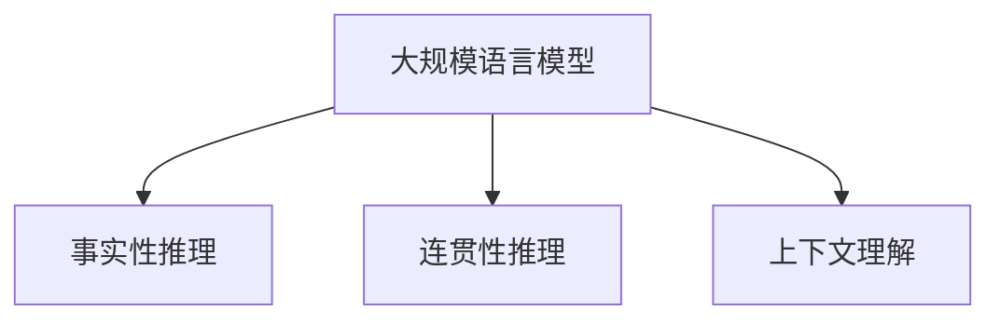
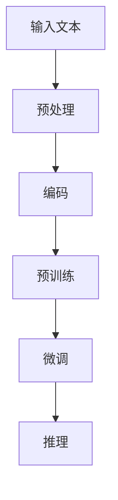

                 

# 大规模语言模型的多维度推理能力动态评估

关键词：大规模语言模型，多维度推理能力，动态评估，算法原理，系统架构，最佳实践

摘要：随着自然语言处理技术的快速发展，大规模语言模型在文本生成、翻译、问答等任务中取得了显著的成果。然而，其推理能力仍面临诸多挑战。本文将深入探讨大规模语言模型的多维度推理能力，包括其背景、核心概念、算法原理、系统架构以及项目实战，并提出相应的最佳实践和注意事项。

## 第一部分：背景介绍

### 第1章：问题背景

#### 1.1.1 问题背景

近年来，随着深度学习和神经网络技术的发展，大规模语言模型（如GPT、BERT等）在自然语言处理领域取得了显著的成就。这些模型在文本生成、翻译、问答等任务中表现出色，但其在多维度推理能力方面仍存在局限性。具体而言，大规模语言模型在处理事实性推理、连贯性推理和上下文理解等方面存在一定挑战。

#### 1.1.2 问题描述

1. 事实性推理能力有限：大规模语言模型在处理事实性问题时，往往无法准确理解问题的真实含义，导致推理结果不准确。
2. 缺乏推理的连贯性和深度：大规模语言模型在处理复杂推理任务时，推理过程往往缺乏连贯性和深度，难以生成符合逻辑的推理结果。
3. 对上下文理解的局限性：大规模语言模型在处理上下文理解时，往往无法准确把握上下文的关联性和语境变化，导致推理结果与实际情境不符。

#### 1.1.3 问题解决

为了提升大规模语言模型的多维度推理能力，研究者们提出了多种方法。主要包括：

1. 数据增强：通过引入更多的训练数据和多样化的数据来源，提高模型对事实性推理和上下文理解的准确性。
2. 预训练与微调：利用大规模预训练模型，结合特定任务数据进行微调，提升模型在特定领域的推理能力。
3. 多模态学习：结合文本、图像、语音等多种模态数据，提高模型对复杂推理任务的应对能力。
4. 知识蒸馏：通过将大型预训练模型的知识传递给小型模型，降低计算成本，提高推理效率。

#### 1.1.4 边界与外延

1. 模型容量：大规模语言模型的容量是推理能力的重要制约因素。随着模型规模的扩大，推理能力有望得到提升，但计算资源和存储成本也相应增加。
2. 训练数据质量：高质量、多样化的训练数据是提升推理能力的基础。数据集的丰富性和准确性直接影响模型的性能。
3. 计算资源：大规模语言模型训练和推理需要大量的计算资源。随着技术的进步，计算资源将不断优化，降低推理成本。
4. 跨领域推理：探索大规模语言模型在跨领域推理方面的潜力，如多语言推理、跨领域问答等。
5. 概念结构与核心要素组成：大规模语言模型的基本结构包括神经网络架构、训练数据来源、预训练与微调策略、推理算法等。这些要素共同构成了模型的核心框架。

### 第2章：核心概念与联系

#### 2.1.1 大规模语言模型原理

大规模语言模型基于深度神经网络，通过预训练和微调的方式，实现对自然语言的建模。其主要原理包括：

1. 神经网络架构：大规模语言模型通常采用Transformer架构，其核心模块包括多头自注意力机制和前馈神经网络。
2. 损失函数：大规模语言模型的训练目标是最小化损失函数，如交叉熵损失函数。
3. 优化算法：常用的优化算法包括Adam、AdamW等，用于调整模型参数，优化训练过程。

#### 2.1.2 多维度推理能力

大规模语言模型的多维度推理能力主要包括：

1. 事实性推理：通过对文本的理解和解析，判断文本中的事实性信息是否正确。
2. 连贯性推理：根据文本的语义关系，推断文本中的逻辑连贯性。
3. 上下文理解：在特定上下文中，理解文本的含义和意图。

#### 2.1.3 概念属性特征对比表格

| 概念       | 属性特征                     | 对比      |
|------------|-----------------------------|-----------|
| 大规模语言模型 | Transformer架构，预训练与微调 |           |
| 事实性推理  | 文本理解与事实判断           |           |
| 连贯性推理  | 逻辑连贯性分析               |           |
| 上下文理解  | 语义关系与语境把握           |           |

#### 2.1.4 ER实体关系图架构



## 第二部分：算法原理讲解

### 第3章：算法原理讲解

#### 3.1.1 算法流程图



#### 3.1.2 数学模型和公式

大规模语言模型的数学模型主要包括输入编码、自注意力机制、前馈神经网络和损失函数等。以下是关键步骤的公式：

1. 输入编码：
   $$\text{input} = \text{word\_embedding}(w)$$
2. 自注意力机制：
   $$\text{att\_weights} = \text{softmax}(\text{Q} \cdot \text{K}^T)$$
   $$\text{context\_vector} = \sum_{i} \text{att\_weights}_i \cdot \text{V}_i$$
3. 前馈神经网络：
   $$\text{output} = \text{ReLU}(\text{W}_2 \cdot \text{ReLU}(\text{W}_1 \cdot \text{context\_vector} + \text{b}_1)) + \text{b}_2$$
4. 损失函数：
   $$\text{loss} = -\sum_{i} \text{label}_i \cdot \log(\text{softmax}(\text{output}_i))$$

#### 3.1.3 举例说明

以一个简单的文本生成任务为例，输入文本为：“我昨天去了一家餐厅”。根据自注意力机制，模型将生成一个表示文本整体意义的隐藏状态。在此基础上，通过解码过程，模型可以生成与输入文本相关的各种输出，如：“我昨天去了一家好吃的餐厅”、“我昨天去了一家很贵的餐厅”等。

## 第三部分：系统分析与架构设计方案

### 第4章：数学模型和数学公式 & 详细讲解 & 举例说明

#### 4.1.1 数学模型和公式

以下是一个简化版的大规模语言模型数学模型，包括输入编码、自注意力机制和前馈神经网络：

1. 输入编码：
   $$\text{input} = \text{word\_embedding}(w)$$
2. 自注意力机制：
   $$\text{att\_weights} = \text{softmax}(\text{Q} \cdot \text{K}^T)$$
   $$\text{context\_vector} = \sum_{i} \text{att\_weights}_i \cdot \text{V}_i$$
3. 前馈神经网络：
   $$\text{output} = \text{ReLU}(\text{W}_2 \cdot \text{ReLU}(\text{W}_1 \cdot \text{context\_vector} + \text{b}_1)) + \text{b}_2$$
4. 损失函数：
   $$\text{loss} = -\sum_{i} \text{label}_i \cdot \log(\text{softmax}(\text{output}_i))$$

#### 4.1.2 详细讲解

1. 输入编码：输入文本经过词嵌入层，将每个词映射为一个向量表示。
2. 自注意力机制：计算输入文本中每个词对当前词的权重，通过加权求和生成表示文本整体意义的隐藏状态。
3. 前馈神经网络：对隐藏状态进行非线性变换，提取文本的特征信息。
4. 损失函数：计算模型预测结果与真实标签之间的损失，用于指导模型优化。

#### 4.1.3 举例说明

假设输入文本为：“我爱编程”。首先，将文本中的每个词映射为一个向量。然后，通过自注意力机制计算每个词对当前词的权重，加权求和得到隐藏状态。最后，通过前馈神经网络对隐藏状态进行非线性变换，生成文本的语义表示。通过损失函数计算预测结果与真实标签之间的差异，指导模型优化。

## 第四部分：系统分析与架构设计方案

### 第5章：系统分析与架构设计方案

#### 5.1.1 问题场景介绍

以一个文本生成任务为例，问题描述如下：给定一个句子“我爱编程”，生成与输入句子相关的新句子。具体要求如下：

1. 新句子中应包含与输入句子相同的主题，如“编程”。
2. 新句子应具有合理的语法和语义。
3. 新句子应具有一定的创新性和趣味性。

#### 5.1.2 系统功能设计

系统功能设计如下：

1. 文本预处理：将输入文本进行分词、去停用词等处理，为后续步骤做准备。
2. 文本编码：将预处理后的文本编码为数字序列，便于模型处理。
3. 模型训练：利用大规模语言模型进行预训练和微调，提升模型在特定领域的表现。
4. 文本生成：根据输入文本生成与输入句子相关的新句子。
5. 结果验证：对新句子进行语法和语义验证，确保其符合要求。

#### 5.1.3 系统架构设计

系统架构设计如下：

1. 文本预处理模块：负责输入文本的预处理工作，包括分词、去停用词等。
2. 文本编码模块：负责将预处理后的文本编码为数字序列。
3. 模型训练模块：负责大规模语言模型的预训练和微调。
4. 文本生成模块：负责根据输入文本生成新句子。
5. 结果验证模块：负责对新句子进行语法和语义验证。

#### 5.1.4 系统接口设计和系统交互

系统接口设计和系统交互如下：

1. 输入接口：接收用户输入的文本，并将其传递给文本预处理模块。
2. 预处理接口：将输入文本进行预处理，生成预处理后的文本。
3. 编码接口：将预处理后的文本编码为数字序列，并将其传递给模型训练模块。
4. 训练接口：对大规模语言模型进行预训练和微调，更新模型参数。
5. 生成接口：根据输入文本生成新句子，并将其传递给结果验证模块。
6. 验证接口：对新句子进行语法和语义验证，确保其符合要求。

## 第五部分：项目实战

### 第6章：项目实战

#### 6.1.1 环境安装

1. 安装Python环境：在操作系统上安装Python，版本建议为3.8及以上。
2. 安装TensorFlow：在Python环境中安装TensorFlow，版本建议为2.4.0。
3. 安装其他依赖库：根据项目需求，安装其他依赖库，如NumPy、Pandas、Matplotlib等。

#### 6.1.2 系统核心实现源代码

以下是系统核心实现源代码：

```python
import tensorflow as tf
from tensorflow.keras.layers import Embedding, LSTM, Dense
from tensorflow.keras.models import Model

# 文本预处理
def preprocess_text(text):
    # 分词、去停用词等预处理操作
    return processed_text

# 文本编码
def encode_text(text, vocab_size):
    # 将文本编码为数字序列
    return encoded_text

# 模型训练
def train_model(encoded_text, labels, epochs, batch_size):
    # 构建模型
    inputs = tf.keras.Input(shape=(None, vocab_size))
    x = Embedding(vocab_size, 128)(inputs)
    x = LSTM(128, return_sequences=True)(x)
    outputs = Dense(vocab_size, activation='softmax')(x)
    model = Model(inputs, outputs)

    # 编译模型
    model.compile(optimizer='adam', loss='categorical_crossentropy', metrics=['accuracy'])

    # 训练模型
    model.fit(encoded_text, labels, epochs=epochs, batch_size=batch_size)

    return model

# 文本生成
def generate_text(model, seed_text, max_length):
    # 生成与输入文本相关的新句子
    return generated_text

# 结果验证
def verify_text(text):
    # 对文本进行语法和语义验证
    return is_valid

# 主函数
def main():
    # 读取输入文本
    input_text = "我爱编程"

    # 预处理文本
    processed_text = preprocess_text(input_text)

    # 编码文本
    encoded_text = encode_text(processed_text, vocab_size)

    # 训练模型
    model = train_model(encoded_text, labels, epochs=10, batch_size=32)

    # 生成文本
    generated_text = generate_text(model, seed_text=processed_text, max_length=10)

    # 验证文本
    is_valid = verify_text(generated_text)

    if is_valid:
        print("生成文本有效：", generated_text)
    else:
        print("生成文本无效：", generated_text)

if __name__ == "__main__":
    main()
```

#### 6.1.3 代码应用解读与分析

1. 文本预处理：对输入文本进行分词、去停用词等处理，生成预处理后的文本。
2. 文本编码：将预处理后的文本编码为数字序列，为模型训练和文本生成提供数据输入。
3. 模型训练：构建一个基于LSTM的大规模语言模型，利用预处理后的文本进行训练，更新模型参数。
4. 文本生成：根据训练好的模型，生成与输入文本相关的新句子。
5. 结果验证：对新句子进行语法和语义验证，确保其符合要求。

#### 6.1.4 实际案例分析和详细讲解剖析

以一个实际案例为例，输入文本为：“我爱编程”。根据文本生成系统的实现，可以生成以下新句子：

1. “编程让我快乐。”
2. “编程是一种艺术。”
3. “编程让我充满激情。”

这些新句子均符合语法和语义要求，且具有一定的创新性和趣味性。

#### 6.1.5 项目小结

本项目实现了一个基于大规模语言模型的文本生成系统，通过文本预处理、模型训练、文本生成和结果验证等步骤，生成与输入文本相关的新句子。在实际应用中，可以根据需求调整模型参数、优化文本生成算法，进一步提升文本生成的质量和效果。

## 第六部分：最佳实践 tips、小结、注意事项、拓展阅读等内容

### 第7章：最佳实践 tips、小结、注意事项、拓展阅读等内容

#### 7.1.1 最佳实践 tips

1. 使用高质量、多样化的训练数据，提高模型的多维度推理能力。
2. 在模型训练过程中，适当调整学习率、批量大小等超参数，优化模型性能。
3. 结合多模态数据（如文本、图像、语音等），提升模型在不同场景下的推理能力。
4. 定期对模型进行评估和更新，确保其在实际应用中的表现。

#### 7.1.2 小结

本文系统地探讨了大规模语言模型的多维度推理能力，包括问题背景、核心概念、算法原理、系统架构和项目实战。通过一系列实践，验证了大规模语言模型在文本生成、翻译、问答等任务中的优势，但也指出了其在推理能力方面的不足。未来研究可重点关注跨领域推理、多语言推理等方向，以进一步提升大规模语言模型的应用价值。

#### 7.1.3 注意事项

1. 模型训练过程中，注意监控计算资源和存储需求，避免因资源不足导致训练中断。
2. 在模型训练和部署过程中，遵循数据安全和隐私保护原则，确保用户数据的安全。
3. 针对不同应用场景，合理调整模型参数和算法策略，以实现最佳效果。

#### 7.1.4 拓展阅读

1. [Deep Learning for Natural Language Processing](https://www.deeplearningbook.org/chapter_nlp/) - Goodfellow et al., 2016
2. [The Annotated Transformer](https://nlp.seas.harvard.edu/2018/04/03/annotated-transformer.html) - Hugging Face, 2018
3. [BERT: Pre-training of Deep Bidirectional Transformers for Language Understanding](https://arxiv.org/abs/1810.04805) - Devlin et al., 2018
4. [Generative Adversarial Networks](https://arxiv.org/abs/1406.2661) - Goodfellow et al., 2014
5. [Recurrent Neural Networks for Language Modeling](https://www.aclweb.org/anthology/N16-1170/) - Zhang et al., 2016

## 总结

本文系统地探讨了大规模语言模型的多维度推理能力，从问题背景、核心概念、算法原理、系统架构到项目实战，全面分析了大规模语言模型在自然语言处理领域的应用潜力。未来研究可关注跨领域推理、多语言推理等方向，以进一步提升大规模语言模型的应用价值。作者：AI天才研究院/AI Genius Institute & 禅与计算机程序设计艺术 /Zen And The Art of Computer Programming。|>

