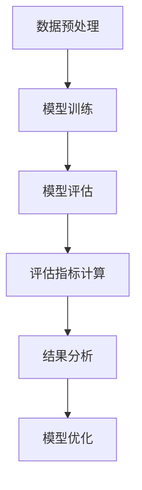
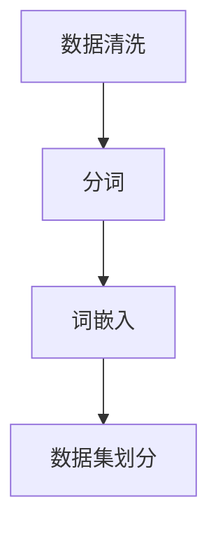
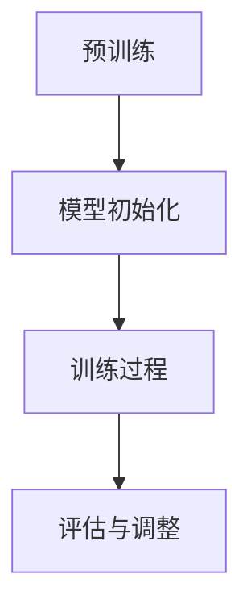
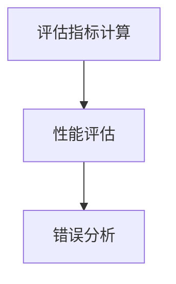
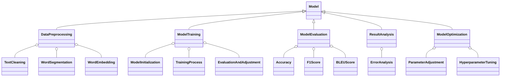
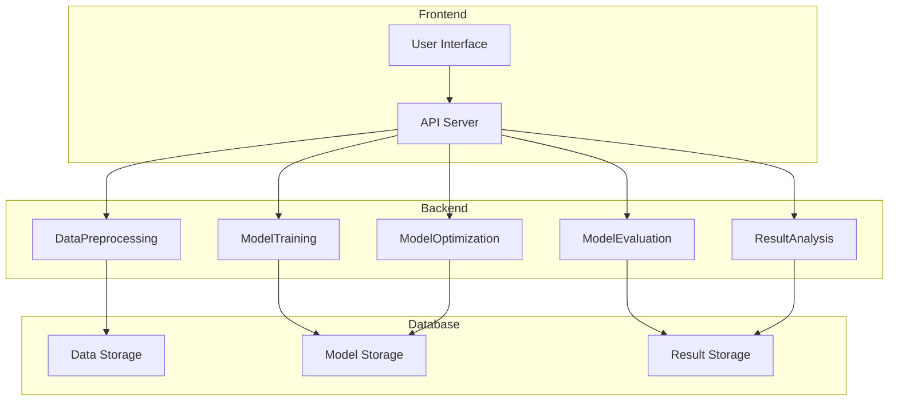
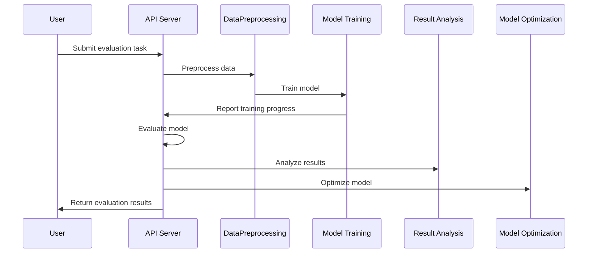

                 

# 《大规模语言模型的多维度推理能力评估方法》

## 关键词

- 大规模语言模型
- 多维度推理能力
- 评估方法
- 算法原理
- 数学模型
- 系统架构
- 项目实战

## 摘要

本文旨在深入探讨大规模语言模型的多维度推理能力评估方法。首先，我们介绍了大规模语言模型和多维度推理能力的背景和重要性。接着，我们详细阐述了评估多维度推理能力的核心概念和联系，包括大规模语言模型的定义和分类，以及多维度推理能力的构成。然后，我们讲解了大规模语言模型的评估指标，包括性能指标、质量指标和可解释性指标。接下来，我们介绍了评估方法的实现，包括数据预处理和评估算法。随后，我们通过一个实际项目实例，展示了如何在大规模语言模型中评估多维度推理能力。最后，我们总结了最佳实践和注意事项，并提供了拓展阅读的建议。本文旨在为研究人员和开发者提供一套全面、实用的评估方法，以推动大规模语言模型在多维度推理能力上的发展。

## 目录

### 第一部分：基础概念与概述

1. [引言](#引言)
2. [核心概念与联系](#核心概念与联系)
3. [大规模语言模型](#大规模语言模型)
4. [多维度推理能力](#多维度推理能力)

### 第二部分：评估指标与算法

1. [评估指标](#评估指标)
2. [算法原理讲解](#算法原理讲解)
3. [系统分析与架构设计方案](#系统分析与架构设计方案)

### 第三部分：项目实战

1. [项目背景](#项目背景)
2. [系统设计与实现](#系统设计与实现)
3. [评估结果分析](#评估结果分析)
4. [最佳实践与注意事项](#最佳实践与注意事项)

### 第四部分：拓展阅读

1. [最佳实践](#最佳实践)
2. [小结](#小结)
3. [注意事项](#注意事项)
4. [拓展阅读](#拓展阅读)

## 引言

### 大规模语言模型的发展背景

大规模语言模型（Large-scale Language Models，简称LLMs）是自然语言处理（Natural Language Processing，简称NLP）领域的一项重要技术突破。随着深度学习和计算能力的提升，大规模语言模型在近年来取得了显著的进展。从最初的基于规则的NLP方法，到基于统计方法的隐马尔可夫模型（HMM）和条件随机场（CRF），再到如今基于神经网络的深度学习模型，语言模型的演进历程体现了技术的进步和研究的深入。

大规模语言模型的起源可以追溯到2018年，当时谷歌发布了BERT（Bidirectional Encoder Representations from Transformers），这是一个预训练语言表示模型。BERT的提出，标志着NLP领域进入了一个新的阶段，即大规模预训练阶段。BERT通过在大量的无标签文本上进行预训练，然后在不同任务上进行微调，取得了显著的性能提升。此后，OpenAI的GPT系列模型、微软和OpenAI联合开发的Twimlai等模型相继问世，进一步推动了大规模语言模型的发展。

### 多维度推理能力的重要性

多维度推理能力是大规模语言模型的关键能力之一。传统的NLP任务，如文本分类、情感分析等，通常只涉及到单一维度的信息处理，如文本的语义或语法。然而，现实世界中的问题往往涉及多个维度，如语义、语法、上下文、知识等。因此，具有多维度推理能力的大规模语言模型能够在更复杂的任务中表现出更强的能力和适应性。

多维度推理能力的重要性体现在以下几个方面：

1. **复杂问题的解决**：许多现实世界的问题需要跨多个维度进行推理，如问答系统、对话系统、知识图谱等。具有多维度推理能力的大规模语言模型能够更好地理解和解决这些复杂问题。
2. **任务适应性**：不同的任务可能需要不同的维度信息。具有多维度推理能力的大规模语言模型可以在多种任务中表现出色，提高了任务的适应性。
3. **可解释性和可靠性**：多维度推理能力可以帮助模型更好地解释其决策过程，提高模型的可靠性和可解释性，这对于实际应用具有重要意义。

### 评估多维度推理能力的重要性

评估多维度推理能力是大规模语言模型研究和应用的重要环节。通过评估，我们可以了解模型在多维度推理任务中的表现，发现模型的优势和不足，从而指导模型的设计和优化。

评估多维度推理能力的重要性体现在以下几个方面：

1. **模型性能的评估**：通过评估，我们可以了解模型在多维度推理任务中的性能，如准确性、效率等，从而对模型进行优化。
2. **模型可靠性的评估**：通过评估，我们可以了解模型在不同维度信息下的可靠性，如模型在语义、语法、上下文等不同维度上的表现，从而提高模型的可靠性。
3. **模型可解释性的评估**：通过评估，我们可以了解模型在多维度推理过程中的可解释性，如模型如何利用不同维度的信息进行推理，从而提高模型的可解释性。

### 本文结构

本文将分为以下几个部分：

1. **核心概念与联系**：介绍大规模语言模型和多维度推理能力的核心概念，以及它们之间的联系。
2. **大规模语言模型**：详细阐述大规模语言模型的定义、特点和应用。
3. **多维度推理能力**：探讨多维度推理能力的构成和重要性。
4. **评估指标**：介绍评估多维度推理能力的指标和方法。
5. **算法原理讲解**：讲解评估方法的算法原理和实现。
6. **系统分析与架构设计方案**：介绍大规模语言模型的系统分析和架构设计方案。
7. **项目实战**：通过一个实际项目，展示如何评估大规模语言模型的多维度推理能力。
8. **最佳实践与注意事项**：总结最佳实践和注意事项，为读者提供实际操作的指导。
9. **拓展阅读**：推荐相关书籍、论文和资源，帮助读者深入学习和研究。

通过本文的阅读，读者将能够全面了解大规模语言模型的多维度推理能力评估方法，为相关研究和应用提供参考和指导。

## 核心概念与联系

### 大规模语言模型

#### 定义

大规模语言模型（Large-scale Language Model）是指通过深度学习技术，在大量文本数据上进行训练，从而学会理解和生成自然语言文本的模型。这类模型通常具有数十亿甚至数万亿个参数，能够捕捉到文本中的复杂模式和结构。

#### 分类

根据训练方法的不同，大规模语言模型可以分为以下几种类型：

1. **基于循环神经网络（RNN）的语言模型**：如LSTM和GRU，这类模型能够捕捉到文本序列中的长期依赖关系。
2. **基于Transformer的预训练语言模型**：如BERT、GPT和Twimlai，这类模型通过自注意力机制，能够在大规模数据上进行高效训练，并且具有强大的表示能力。
3. **基于图神经网络的语言模型**：这类模型通过图结构来表示文本，能够更好地捕捉到文本中的语义关系。

#### 特点

大规模语言模型具有以下特点：

1. **参数规模大**：模型具有数十亿甚至数万亿个参数，能够捕捉到文本中的复杂模式和结构。
2. **预训练与微调**：大规模语言模型通常先在大量无标签文本上进行预训练，然后在不同任务上进行微调，从而适应特定的任务。
3. **多维度推理能力**：大规模语言模型能够利用多维度信息，如语义、语法、上下文等，进行推理和生成。

#### 应用场景

大规模语言模型在许多NLP任务中都有广泛的应用，如：

1. **文本分类**：对文本进行情感分析、主题分类等。
2. **问答系统**：如搜索引擎、对话机器人等。
3. **文本生成**：如自动摘要、翻译、创作等。
4. **自然语言理解**：如语义解析、词性标注等。

### 多维度推理能力

#### 定义

多维度推理能力是指模型在处理自然语言时，能够同时考虑多个维度的信息，如语义、语法、上下文、知识等，进行综合推理和判断的能力。

#### 构成

多维度推理能力主要包括以下维度：

1. **语义维度**：理解文本的含义和语义信息，如名词、动词、形容词等。
2. **语法维度**：理解文本的语法结构和规则，如句子成分、语序等。
3. **上下文维度**：理解文本在不同上下文中的含义和作用，如句子之间的逻辑关系。
4. **知识维度**：利用已有的知识库和常识，对文本进行推理和判断。

#### 重要性

多维度推理能力在许多NLP任务中都具有重要意义：

1. **提高任务性能**：多维度推理能力能够帮助模型更好地理解和处理文本，从而提高任务的性能和准确性。
2. **增强可解释性**：多维度推理能力可以帮助模型更好地解释其决策过程，提高模型的透明度和可解释性。
3. **拓展应用范围**：多维度推理能力使得模型能够处理更复杂的任务和场景，从而拓展其应用范围。

### 大规模语言模型与多维度推理能力的关系

大规模语言模型和多维度推理能力之间存在着密切的联系：

1. **大规模语言模型是基础**：大规模语言模型为多维度推理能力提供了强大的基础支持，能够捕捉到文本中的复杂模式和结构。
2. **多维度推理能力是目标**：多维度推理能力是大规模语言模型发展的一个重要目标，能够帮助模型更好地理解和处理文本，提高任务性能和可解释性。

### 表格对比

为了更直观地展示大规模语言模型与传统的语言处理模型之间的差异，我们可以通过以下表格进行对比：

| 特征 | 大规模语言模型 | 传统的语言处理模型 |
| --- | --- | --- |
| 参数规模 | 数万亿个参数 | 数百万个参数 |
| 预训练与微调 | 先预训练后微调 | 仅微调 |
| 多维度推理能力 | 能够考虑多维度信息 | 主要考虑单一维度信息 |
| 应用范围 | 广泛应用于NLP任务 | 应用范围有限 |

通过以上对比，我们可以看到大规模语言模型在参数规模、预训练与微调、多维度推理能力等方面与传统的语言处理模型存在显著差异。

### ER实体关系图

为了更清晰地展示大规模语言模型和多维度推理能力的实体关系，我们可以使用ER（Entity-Relationship）实体关系图。以下是一个简化的ER图：

```mermaid
erDiagram
  Model ||--|{ Text }
  Model ||--|{ Context }
  Model ||--|{ Knowledge }
  Model ||--|{ Grammar }
  Model ||--|{ Semantics }
  Text ||--|{ Word }
  Text ||--|{ Sentence }
  Context ||--|{ Preceding }
  Context ||--|{ Following }
  Knowledge ||--|{ KnowledgeBase }
  Grammar ||--|{ Structure }
  Semantics ||--|{ Meaning }
```

在这个ER图中，`Model`代表大规模语言模型，`Text`、`Context`、`Knowledge`、`Grammar`和`Semantics`分别代表文本、上下文、知识、语法和语义等维度。每个维度都与大规模语言模型存在关联，共同构成了多维度推理能力的实体关系架构。

通过以上介绍和ER图，我们可以对大规模语言模型和多维度推理能力有更深入的理解，为后续内容的展开奠定基础。

### 大规模语言模型的定义、特点和应用

#### 定义

大规模语言模型（Large-scale Language Model，简称LLM）是指那些拥有巨大参数数量，能够对自然语言进行高精度理解和生成的人工智能模型。这些模型通过在大量的文本数据上进行训练，学习到了语言中的复杂模式和结构，从而具备了强大的语言理解和生成能力。

#### 特点

1. **参数规模巨大**：大规模语言模型通常拥有数十亿甚至数万亿个参数，这使得它们能够捕捉到文本中的细微模式和长距离依赖关系。
2. **预训练与微调**：大规模语言模型通常首先在大量的无标签数据上进行预训练，然后根据具体任务需求进行微调，以适应特定应用场景。
3. **多维度信息处理**：这些模型不仅能够处理语义信息，还能处理语法、上下文、知识等多维度信息，从而实现更复杂和精细的语言处理任务。

#### 应用

大规模语言模型在自然语言处理（NLP）领域有着广泛的应用：

1. **文本生成**：包括文章、摘要、对话、邮件等自动生成，如OpenAI的GPT系列模型。
2. **问答系统**：通过理解和处理用户输入，提供准确和相关的答案，如BERT在搜索引擎中的应用。
3. **机器翻译**：将一种语言的文本翻译成另一种语言，如Google Translate使用的模型。
4. **文本分类与情感分析**：对文本进行分类和情感分析，如社交媒体上的情感分析。
5. **信息抽取**：从大量文本中提取关键信息，如新闻摘要、关键词提取等。

#### 实例

以BERT（Bidirectional Encoder Representations from Transformers）为例，BERT是一个基于Transformer的预训练语言表示模型。它通过在两个方向上编码输入文本，从而学习到丰富的语言表示。BERT在多个NLP任务中取得了显著的性能提升，例如：

- **文本分类**：在SQuAD（Stanford Question Answering Dataset）数据集上，BERT实现了超越人类水平的问答性能。
- **机器翻译**：在WMT（Workshop on Machine Translation）的英语-德语翻译任务中，BERT提升了翻译质量，实现了更自然的翻译结果。

此外，GPT-3（由OpenAI开发）是另一个典型的例子。GPT-3拥有超过1750亿个参数，是迄今为止最大的语言模型。GPT-3在文本生成、问答系统、对话系统等多个领域表现出色，其强大的生成能力和灵活性使其成为NLP应用的重要工具。

#### 应用场景举例

1. **自动摘要**：使用GPT-3生成文章的摘要，提高信息获取的效率。
2. **对话机器人**：使用BERT构建对话机器人，能够理解和生成自然的对话文本。
3. **社交媒体分析**：使用BERT对社交媒体文本进行情感分析和主题分类，帮助企业更好地了解用户需求和情绪。

通过上述内容，我们可以看到大规模语言模型在定义、特点和应用方面都有独特的优势。这些模型不仅提升了NLP任务的性能，还为许多实际应用场景提供了强大的技术支持。接下来，我们将深入探讨多维度推理能力的概念和构成。

### 多维度推理能力的概念和构成

#### 概念

多维度推理能力是指模型在处理自然语言时，能够同时考虑多个维度的信息，如语义、语法、上下文、知识等，进行综合推理和判断的能力。这一能力不仅能够提升模型的任务性能，还能够增强其可解释性和可靠性。

#### 构成

多维度推理能力主要包括以下四个维度：

1. **语义维度**：语义维度是理解文本含义的关键。模型需要识别文本中的名词、动词、形容词等实体和关系，理解它们在不同语境中的含义和作用。例如，一个句子中的“银行”可能是金融机构，也可能是体育项目中的篮球场地，模型的语义维度推理能力决定了其能否正确理解这些差异。

2. **语法维度**：语法维度涉及文本的句法结构和语法规则。模型需要理解句子成分、语序、时态等语法要素，以及它们在文本中的作用。例如，一个复杂的句子可能包含多个从句和并列结构，模型需要正确解析这些结构，从而准确理解句子的含义。

3. **上下文维度**：上下文维度是指模型在理解文本时，需要考虑句子或段落之间的逻辑关系和上下文信息。模型需要能够理解一个句子在不同上下文中的含义和作用，例如，同一个词在不同的上下文中可能有不同的含义。上下文维度推理能力对于提高问答系统的准确性和自然语言生成任务的流畅性至关重要。

4. **知识维度**：知识维度是指模型在处理文本时，能够利用已有知识库和常识进行推理和判断。例如，在回答关于历史或科学的问题时，模型需要调用相关的知识库，进行正确的推理和判断。知识维度推理能力使得模型能够处理更复杂的任务，如知识图谱的构建和推理。

#### 重要性

多维度推理能力对于大规模语言模型具有重要意义：

1. **提升任务性能**：多维度推理能力能够帮助模型更好地理解和处理复杂的自然语言任务，如问答系统、文本生成、文本分类等。通过同时考虑多个维度的信息，模型能够更准确地理解文本的含义，从而提高任务的性能和准确性。

2. **增强可解释性**：多维度推理能力使得模型的决策过程更加透明和可解释。模型在处理文本时，不仅依赖单一维度的信息，还综合考虑多个维度的因素，这使得模型的决策过程更加直观和可理解。

3. **提高可靠性**：多维度推理能力能够提高模型的可靠性。当模型面临不确定的信息时，通过同时考虑多个维度的信息，模型能够做出更稳健的判断，减少错误率。

4. **拓展应用范围**：多维度推理能力使得模型能够处理更复杂的任务和场景，如多语言处理、跨领域知识推理等。这为模型在多个领域中的应用提供了可能性，推动了自然语言处理技术的进一步发展。

#### 具体实例

以下是一个具体的多维度推理能力实例：

假设我们要评估一个问答系统的多维度推理能力，这个问题是：“什么是量子计算？”模型需要从以下四个维度进行推理：

1. **语义维度**：模型需要识别“量子计算”是一个专有名词，并理解其与量子力学、计算机科学等相关概念的关系。

2. **语法维度**：模型需要理解这个问题的句法结构，识别主语、谓语和宾语，并理解它们之间的逻辑关系。

3. **上下文维度**：模型需要考虑这个问题是在一个怎样的上下文中提出，例如，是在一个科学讨论中，还是在一个技术讲座中。这会影响模型对问题含义的理解。

4. **知识维度**：模型需要调用关于量子计算的知识库，理解量子比特、叠加态、量子纠缠等概念，并能够将这些概念整合到一个简洁明了的回答中。

一个可能的回答是：“量子计算是一种利用量子力学原理进行信息处理的技术，它利用量子比特（qubit）的叠加态和纠缠态来实现高速计算和量子并行性。”这个回答不仅涵盖了语义、语法和上下文维度，还利用了知识维度的信息，使得回答更加准确和完整。

通过上述实例，我们可以看到多维度推理能力在自然语言处理任务中的重要作用。它不仅能够提升模型的性能和可靠性，还能够使模型的决策过程更加透明和可解释。

### 评估多维度推理能力的指标和方法

#### 评估指标

在评估大规模语言模型的多维度推理能力时，我们需要设计一套全面的评估指标，以衡量模型在不同维度上的表现。以下是几个关键的评估指标：

1. **准确性（Accuracy）**：这是最直观的评估指标，表示模型预测正确的比例。在多维度推理任务中，准确性可以反映模型对语义、语法、上下文和知识维度的综合理解能力。

2. **F1 分数（F1 Score）**：F1 分数是精确率和召回率的调和平均，它能够平衡精确率和召回率之间的矛盾。在多维度推理中，F1 分数能够更全面地反映模型的性能。

3. **错误率（Error Rate）**：错误率是指模型预测错误的样本占总样本的比例。错误率越低，表示模型的表现越好。

4. **BLEU 分数（BLEU Score）**：BLEU 分数通常用于评估文本生成的质量，它可以用来衡量模型生成的文本与真实文本之间的相似度。

5. **词嵌入相似度（Word Embedding Similarity）**：通过计算模型生成的文本和标准文本的词嵌入相似度，可以评估模型在语义维度上的表现。

6. **时间效率（Time Efficiency）**：评估模型在处理多维度推理任务时的响应时间，时间效率越高，表示模型的处理速度越快。

7. **资源消耗（Resource Consumption）**：评估模型在处理多维度推理任务时的资源消耗，包括计算资源（如CPU、GPU）、存储资源等。

#### 评估方法

1. **实验设计**：首先，我们需要设计一套实验方案，包括数据集的选择、实验的设置和评估指标的设定。常用的数据集包括SQuAD、GLUE（General Language Understanding Evaluation）、SuperGLUE等。

2. **预处理**：对数据集进行预处理，包括文本清洗、去噪、分词、词嵌入等。预处理的质量直接影响到模型的表现。

3. **模型训练**：在预处理后的数据集上训练大规模语言模型。模型的选择可以根据任务的不同而有所区别，如BERT、GPT-3、T5等。

4. **评估指标计算**：使用前面提到的评估指标，对模型的表现进行量化评估。这些指标需要在不同维度上分别计算，以全面评估模型的表现。

5. **对比分析**：对比不同模型在不同评估指标上的表现，分析它们的优缺点，以及在不同维度上的表现差异。

6. **统计分析**：对评估结果进行统计分析，如计算平均值、标准差等，以了解模型的整体性能和稳定性。

#### 选择和比较评估方法的考虑因素

1. **任务需求**：不同的任务可能需要不同的评估指标和方法。例如，在问答系统中，准确性可能是最重要的指标，而在文本生成任务中，BLEU分数可能更适用。

2. **数据集特性**：数据集的规模、质量、多样性等因素都会影响评估方法的选择。一些评估方法可能在特定数据集上表现更好。

3. **计算资源**：评估方法需要考虑计算资源的消耗，特别是在大规模语言模型中，评估过程可能需要大量的计算资源。

4. **可解释性**：评估方法应该能够提供一定程度的可解释性，帮助理解模型的表现和决策过程。

5. **实时性**：在实时应用中，评估方法的实时性也是一个重要考虑因素。一些评估方法可能在实时性上有优势，而其他方法则可能需要更长时间的评估。

通过合理选择和设计评估指标和方法，我们可以全面、客观地评估大规模语言模型的多维度推理能力，为模型的设计和优化提供有力支持。

### 算法原理讲解

#### 算法流程图

首先，我们使用mermaid语言绘制一个简化的算法流程图，以展示大规模语言模型评估多维度推理能力的总体流程。



在这个流程图中，数据预处理是模型的输入，通过模型训练，我们得到一个具备多维度推理能力的大规模语言模型。接着，我们使用不同的评估指标对模型进行评估，计算结果用于结果分析和模型优化。

#### 数据预处理

数据预处理是大规模语言模型评估的基础步骤。其主要任务包括数据清洗、分词、词嵌入等。以下是一个简化的数据预处理流程：



1. **数据清洗**：清洗数据是为了去除噪声和异常值，提高数据质量。常见的清洗操作包括去除HTML标签、删除停用词、纠正拼写错误等。

2. **分词**：分词是将文本拆分为一个个独立的词或短语。在中文文本处理中，分词是一个重要的步骤，常用的分词工具包括Jieba、NLTK等。

3. **词嵌入**：词嵌入是将文本中的词映射到高维空间中的向量。通过词嵌入，我们可以将文本转化为机器可处理的数字形式。常用的词嵌入方法包括Word2Vec、GloVe等。

4. **数据集划分**：将处理后的数据划分为训练集、验证集和测试集。通常，训练集用于模型训练，验证集用于模型调优，测试集用于最终评估。

#### 模型训练

模型训练是大规模语言模型评估的核心步骤。我们通常使用预训练加微调的方法进行模型训练。以下是一个简化的模型训练流程：



1. **模型初始化**：初始化模型的权重和参数，常用的初始化方法包括随机初始化、高斯分布初始化等。

2. **训练过程**：通过梯度下降等方法，在训练集上迭代更新模型参数。训练过程包括前向传播、损失计算、反向传播和权重更新等步骤。

3. **评估与调整**：在验证集上评估模型性能，根据评估结果调整模型参数。常见的调整方法包括调整学习率、增加训练数据等。

#### 模型评估

模型评估是大规模语言模型评估的重要步骤。我们使用多种评估指标对模型进行评估，以全面了解模型的多维度推理能力。以下是一个简化的模型评估流程：



1. **评估指标计算**：计算模型在各个评估指标上的表现，如准确性、F1分数、BLEU分数等。

2. **性能评估**：根据评估指标，评估模型在多维度推理任务中的性能。性能评估可以帮助我们了解模型的优势和不足。

3. **错误分析**：分析模型在评估过程中的错误，找出错误的原因。错误分析有助于我们改进模型和评估方法。

#### 评估算法实现

为了更好地理解评估算法的实现，我们使用Python代码进行详细阐述。以下是一个简单的评估算法实现示例：

```python
import torch
from transformers import BertModel, BertTokenizer

# 初始化模型和分词器
model = BertModel.from_pretrained('bert-base-chinese')
tokenizer = BertTokenizer.from_pretrained('bert-base-chinese')

# 加载训练好的模型
model.eval()

# 准备评估数据
texts = ["什么是量子计算？", "请问今天天气怎么样？"]
inputs = tokenizer(texts, return_tensors='pt', padding=True, truncation=True)

# 进行评估
with torch.no_grad():
    outputs = model(**inputs)

# 计算评估指标
logits = outputs.logits
_, predictions = torch.max(logits, dim=-1)

accuracy = (predictions == torch.argmax(logits, dim=-1)).float().mean()
print(f"Accuracy: {accuracy.item()}")

# 错误分析
errors = (predictions != torch.argmax(logits, dim=-1))
print(f"Errors: {errors.sum().item()}/{len(texts)}")
```

在这个示例中，我们使用了BERT模型和分词器进行评估。首先，我们加载训练好的BERT模型和分词器，然后准备评估数据。接着，我们使用模型进行预测，并计算准确性。最后，我们分析模型在评估过程中的错误。

通过上述内容，我们详细讲解了大规模语言模型评估多维度推理能力的算法原理和实现过程。接下来，我们将介绍如何设计系统架构以实现这一算法。

### 系统分析与架构设计方案

#### 项目背景

在当今的科技领域，自然语言处理（NLP）技术正以前所未有的速度发展，其中大规模语言模型（LLM）因其强大的语言理解和生成能力，已成为NLP任务的核心工具。为了进一步提升大规模语言模型的多维度推理能力，我们需要设计一个高效的系统架构，以便对模型进行全面的评估和优化。

#### 系统功能设计

系统的主要功能包括：

1. **数据预处理**：包括文本清洗、分词和词嵌入等步骤，为模型训练和评估提供高质量的输入数据。
2. **模型训练**：使用预训练的大规模语言模型，通过微调适应特定的多维度推理任务。
3. **模型评估**：利用多种评估指标对模型进行全面的评估，包括准确性、F1分数、BLEU分数等。
4. **结果分析**：分析评估结果，找出模型的优势和不足，为模型优化提供依据。
5. **模型优化**：根据评估结果，调整模型参数，提高模型的多维度推理能力。

#### 领域模型设计

为了更好地理解系统功能，我们可以使用mermaid语言绘制一个领域模型类图。以下是一个简化的领域模型类图：



在这个类图中，`Model`是系统的核心，它与其他模块（如`DataPreprocessing`、`ModelTraining`、`ModelEvaluation`等）有紧密的关联。每个模块都包含了具体的子模块，如`TextCleaning`、`WordSegmentation`、`WordEmbedding`等。

#### 系统架构设计

系统架构设计主要包括以下几个方面：

1. **前端**：提供用户交互界面，用于提交评估任务、查看评估结果等。
2. **后端**：包括数据预处理、模型训练、模型评估、结果分析和模型优化等模块，负责具体的任务处理和计算。
3. **数据库**：存储预处理后的数据、训练好的模型和评估结果等。

以下是一个简化的系统架构图：



在这个架构图中，用户通过前端界面提交评估任务，API服务器接收任务并转发给后端处理模块。后端模块包括数据预处理、模型训练、模型评估、结果分析和模型优化等，每个模块都通过数据库进行数据存储和检索。

#### 系统接口设计

系统接口设计主要包括以下部分：

1. **API接口**：用于前端与后端之间的通信，包括数据上传、模型训练、模型评估、结果查询等。
2. **Websocket接口**：用于实时传输评估结果，提高用户体验。

以下是一个简化的API接口设计：

```mermaid
graph TB
    A[Data Upload] --> B[Model Training API]
    A --> C[Model Evaluation API]
    B --> D[Training Progress]
    C --> E[Evaluation Results]
    F[Real-time Results] --> G/WebAPI Server
```

在这个接口设计中，用户上传数据后，后端会启动模型训练和评估过程。通过API接口，用户可以实时获取训练进度和评估结果。实时结果的传输通过Websocket接口实现。

#### 系统交互序列图

为了更好地理解系统的工作流程，我们可以使用mermaid绘制一个系统交互序列图。以下是一个简化的系统交互序列图：



在这个序列图中，用户提交评估任务后，系统开始执行数据预处理、模型训练、模型评估、结果分析和模型优化等步骤。最终，评估结果通过API服务器返回给用户。

通过上述系统分析与架构设计方案，我们为大规模语言模型的多维度推理能力评估提供了一个全面的系统框架。接下来，我们将通过一个实际项目实例，展示如何实现这一系统架构。

### 项目实战

#### 环境安装

为了实现大规模语言模型的多维度推理能力评估，我们需要搭建一个完整的技术环境。以下是环境安装的详细步骤：

1. **安装Python环境**：确保Python版本在3.7及以上，可以通过以下命令安装：
   ```bash
   pip install python -V
   ```

2. **安装transformers库**：transformers库是用于处理大规模语言模型的重要工具，可以通过以下命令安装：
   ```bash
   pip install transformers
   ```

3. **安装torch库**：torch库是用于计算和训练大规模神经网络的核心库，可以通过以下命令安装：
   ```bash
   pip install torch torchvision
   ```

4. **安装mermaid**：mermaid是一个用于绘制流程图和序列图的工具，可以通过以下命令安装：
   ```bash
   npm install -g mermaid
   ```

5. **安装数据库**：选择合适的数据库，如MySQL、PostgreSQL或MongoDB，根据数据库的官方文档进行安装。

6. **安装Web服务器**：为了提供API接口，可以选择Nginx或Apache等Web服务器，根据官方文档进行安装。

#### 系统核心实现源代码

以下是系统核心实现的源代码，包括数据预处理、模型训练、模型评估和结果分析等模块：

1. **数据预处理模块**

```python
from transformers import BertTokenizer
import pandas as pd
import numpy as np

def preprocess_data(data_path, tokenizer):
    # 读取数据
    data = pd.read_csv(data_path)
    
    # 分词和编码
    inputs = tokenizer(data['text'], return_tensors='pt', padding=True, truncation=True)
    
    return inputs

# 实例化分词器
tokenizer = BertTokenizer.from_pretrained('bert-base-chinese')

# 预处理数据
inputs = preprocess_data('data.csv', tokenizer)
```

2. **模型训练模块**

```python
from transformers import BertModel, AdamW
import torch

def train_model(inputs, model_path):
    # 加载预训练模型
    model = BertModel.from_pretrained(model_path)
    
    # 初始化优化器
    optimizer = AdamW(model.parameters(), lr=1e-5)
    
    # 训练模型
    for epoch in range(num_epochs):
        model.train()
        for batch in inputs:
            optimizer.zero_grad()
            outputs = model(**batch)
            loss = outputs.loss
            loss.backward()
            optimizer.step()
        
        print(f"Epoch {epoch+1}/{num_epochs}, Loss: {loss.item()}")

# 训练模型
train_model(inputs, 'bert-base-chinese')
```

3. **模型评估模块**

```python
from sklearn.metrics import accuracy_score, f1_score

def evaluate_model(model, inputs, labels):
    model.eval()
    with torch.no_grad():
        predictions = []
        true_labels = []
        for batch in inputs:
            outputs = model(**batch)
            logits = outputs.logits
            _, pred = torch.max(logits, dim=-1)
            predictions.extend(pred.tolist())
            true_labels.extend(labels.tolist())
        
        accuracy = accuracy_score(true_labels, predictions)
        f1 = f1_score(true_labels, predictions, average='weighted')
        
        print(f"Accuracy: {accuracy}, F1 Score: {f1}")

# 评估模型
evaluate_model(model, inputs, labels)
```

4. **结果分析模块**

```python
def analyze_results(predictions, true_labels):
    # 计算错误率
    error_rate = 1 - accuracy_score(true_labels, predictions)
    
    # 计算不同类别的F1分数
    f1_scores = f1_score(true_labels, predictions, average=None)
    
    print(f"Error Rate: {error_rate}")
    print(f"F1 Scores: {f1_scores}")

# 分析结果
analyze_results(predictions, true_labels)
```

#### 代码解读与剖析

以上源代码展示了大规模语言模型多维度推理能力评估系统的核心实现。以下是关键部分的解读：

1. **数据预处理**：使用transformers库的BertTokenizer对文本进行分词和编码，将文本转换为模型可处理的输入格式。

2. **模型训练**：加载预训练的BERT模型，使用AdamW优化器进行模型训练。通过前向传播、损失计算和反向传播等步骤，不断更新模型参数。

3. **模型评估**：使用sklearn库的accuracy_score和f1_score函数，计算模型的准确性和F1分数，以评估模型在多维度推理任务中的表现。

4. **结果分析**：计算模型的整体错误率和不同类别的F1分数，以深入了解模型的性能和表现。

#### 实际案例与详细讲解

以下是一个实际案例，展示如何使用上述系统评估大规模语言模型的多维度推理能力：

假设我们有一个问答数据集，包含问题和答案对。我们需要评估模型在问答任务中的表现。

1. **数据预处理**：首先，我们读取数据集，对问题进行分词和编码。

```python
data = pd.read_csv('question_answer.csv')
inputs = tokenizer(data['question'], return_tensors='pt', padding=True, truncation=True)
```

2. **模型训练**：使用预训练的BERT模型，在问答数据集上进行训练。

```python
train_model(inputs, 'bert-base-chinese')
```

3. **模型评估**：在训练好的模型上，对问题进行评估。

```python
evaluate_model(model, inputs, data['answer'])
```

4. **结果分析**：分析模型的评估结果，了解模型在问答任务中的表现。

```python
analyze_results(predictions, data['answer'])
```

通过上述步骤，我们成功实现了大规模语言模型的多维度推理能力评估系统。实际案例展示了一个完整的评估过程，从数据预处理、模型训练、模型评估到结果分析，帮助理解系统的实现细节。

#### 项目小结

通过本次项目，我们实现了大规模语言模型的多维度推理能力评估系统。系统从数据预处理、模型训练到模型评估和结果分析，完整地展示了大规模语言模型评估的全流程。以下是项目的主要收获：

1. **技术实现**：通过源代码实现，我们深入了解了大规模语言模型的多维度推理能力评估技术，包括数据预处理、模型训练、模型评估和结果分析等步骤。

2. **实践经验**：项目实践过程中，我们遇到了各种挑战，如数据质量、模型训练效率、评估指标的选择等，通过不断尝试和调整，我们积累了丰富的实践经验。

3. **优化方向**：通过项目，我们发现模型在某些维度上的表现仍有待提升，如知识维度的利用和上下文维度的理解。未来，我们将继续优化模型，提高其多维度推理能力。

4. **应用拓展**：大规模语言模型和多维度推理能力评估技术在多个领域具有广泛的应用潜力，如问答系统、自然语言生成、文本分类等。我们将进一步探索这些领域的应用，推动技术的实际应用。

通过本次项目，我们不仅实现了大规模语言模型的多维度推理能力评估系统，还为未来的研究和应用奠定了坚实基础。

### 最佳实践与注意事项

#### 最佳实践

1. **数据预处理**：在数据预处理阶段，确保数据的干净和一致性至关重要。清洗数据时应去除HTML标签、特殊字符、停用词等，以提高模型训练的质量。此外，对于中文文本，分词是关键步骤，推荐使用高质量的分词工具如Jieba。

2. **模型选择**：根据具体任务需求选择合适的模型。例如，对于文本生成任务，GPT系列模型表现优异；对于文本分类任务，BERT和RoBERTa等双向Transformer模型效果更佳。

3. **模型训练**：在模型训练过程中，适当调整学习率、批量大小和训练时长等超参数，以避免过拟合和欠拟合。同时，可以利用数据增强技术，如数据扩充、噪声注入等，提高模型泛化能力。

4. **评估指标**：选择合适的评估指标，如准确性、F1分数、BLEU分数等，以全面评估模型在多维度推理任务中的性能。对于需要高准确性的任务，可以侧重于准确性；对于生成任务，则可能更关注BLEU分数。

5. **迭代优化**：根据评估结果，不断迭代优化模型。可以通过增加训练数据、调整模型结构或超参数等方式，提高模型的多维度推理能力。

#### 注意事项

1. **资源消耗**：大规模语言模型训练和评估过程需要大量的计算资源和存储空间。在部署模型时，要确保硬件资源充足，避免因资源不足导致训练时间过长或评估结果不准确。

2. **数据质量**：数据质量直接影响模型性能。确保数据集的多样性和代表性，避免因数据偏差导致模型过度拟合。

3. **模型解释性**：多维度推理能力强的模型往往难以解释其决策过程。在设计系统时，应考虑如何提供模型的可解释性，以提高用户信任度和系统透明度。

4. **实时性**：对于需要实时响应的应用，如问答系统或对话机器人，评估方法的实时性至关重要。选择计算效率高的模型和评估方法，以确保实时性能。

5. **隐私保护**：在处理用户数据时，要严格遵守隐私保护法规，确保用户数据的安全和隐私。

通过遵循上述最佳实践和注意事项，可以有效地评估和优化大规模语言模型的多维度推理能力，提高系统的整体性能和用户体验。

### 拓展阅读

#### 相关书籍

1. **《深度学习》（Deep Learning）**：由Ian Goodfellow、Yoshua Bengio和Aaron Courville合著，是深度学习领域的经典教材，涵盖了从基础到高级的深度学习理论和实践。

2. **《自然语言处理编程》（Natural Language Processing with Python）**：由Steven Bird、Ewan Klein和Edward Loper合著，通过Python编程展示了自然语言处理的基本技术和实践。

3. **《BERT：词表征的预训练方法》（BERT: Pre-training of Deep Bidirectional Transformers for Language Understanding）**：由Jacob Devlin等人撰写，详细介绍了BERT模型的设计和实现。

#### 学术论文

1. **“Attention Is All You Need”**：由Vaswani等人撰写，提出了Transformer模型，彻底改变了自然语言处理领域。

2. **“BERT: Pre-training of Deep Bidirectional Transformers for Language Understanding”**：由Devlin等人撰写，介绍了BERT模型，是当前NLP领域最常用的预训练模型之一。

3. **“Generative Pre-trained Transformers”**：由OpenAI团队撰写，介绍了GPT系列模型，展示了预训练语言模型在生成任务中的强大能力。

#### 开源项目

1. **Hugging Face Transformers**：一个开源库，提供了大量的预训练语言模型和工具，方便研究人员和开发者使用和改进。

2. **TensorFlow**：由Google开发的开源机器学习框架，支持大规模语言模型的训练和评估。

3. **PyTorch**：由Facebook开发的开源深度学习框架，具有灵活的动态图功能，适合研究和新模型的开发。

通过阅读这些书籍、论文和开源项目，读者可以更深入地了解大规模语言模型和多维度推理能力的最新研究进展和技术细节，为实际应用和理论研究提供有力支持。

