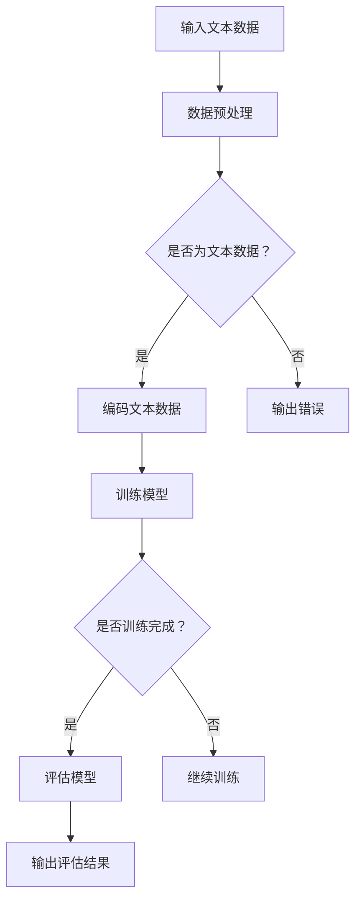

                 

# 大规模语言模型的抽象思维与创新推理能力评估

## 关键词

- **大规模语言模型**
- **抽象思维**
- **创新推理**
- **能力评估**
- **深度学习**
- **神经网络**
- **自然语言处理**

## 摘要

本文旨在探讨大规模语言模型在抽象思维和创新推理方面的能力。通过详细分析大规模语言模型的背景、核心概念、算法原理，本文提出了评估这些模型能力的方法和指标。本文的目标是为研究人员和开发者提供有价值的参考，以进一步推动大规模语言模型在抽象思维和创新推理领域的应用。

### 第一部分：背景介绍

#### 1.1 问题背景

随着人工智能技术的飞速发展，大规模语言模型（如GPT、BERT等）已经成为自然语言处理领域的重要工具。这些模型具有强大的抽象思维和创新能力，能够在各种任务中表现出色。然而，如何评估这些模型在这些方面的能力，以及如何利用这些能力进行创新推理，是一个亟待解决的问题。

#### 1.2 问题描述

本文旨在探讨以下问题：

- **大规模语言模型如何展现抽象思维能力？**
- **这些模型如何进行创新推理？**
- **如何评估这些模型的能力？**

#### 1.3 问题解决

本书将系统地探讨大规模语言模型的抽象思维和创新能力，通过一系列实验和案例研究，评估这些模型在这些方面的表现。

#### 1.4 边界与外延

- **研究对象**：本文的研究对象为目前主流的大规模语言模型，如GPT、BERT等。
- **研究范围**：本文的研究范围包括抽象思维和创新能力评估的方法、指标和实际应用。

#### 1.5 概念结构与核心要素组成

- **抽象思维**：指从具体事物中概括出本质特征的能力。
- **创新推理**：指基于已有知识和经验，提出新观点、新思路的能力。
- **评估方法**：包括定量和定性方法，如实验、案例研究、指标分析等。
- **指标**：包括抽象思维能力指标和创新推理能力指标。

### 第二部分：核心概念与联系

#### 2.1 大规模语言模型简介

大规模语言模型是一种基于深度学习的自然语言处理模型，能够对自然语言进行建模和预测。它们通常由数亿到数十亿的参数组成，可以处理复杂的语言结构和语义信息。

#### 2.2 抽象思维原理

抽象思维是指从具体的事物中概括出本质特征的能力。在语言模型中，抽象思维体现在模型对语言的理解和表达上。例如，模型可以通过学习大量的文本数据，理解词汇、句子和段落之间的抽象关系。

#### 2.3 创新推理原理

创新推理是指基于已有知识和经验，提出新观点、新思路的能力。在语言模型中，创新推理体现在模型对未知内容的生成和推理上。例如，模型可以根据已有的知识，生成新的句子、故事或者回答问题。

#### 2.4 抽象思维与创新推理的联系

抽象思维和创新推理是相互关联的。抽象思维是创新推理的基础，而创新推理是抽象思维的应用。在语言模型中，抽象思维可以帮助模型理解语言的本质特征，从而进行更准确的创新推理。

### 第三部分：算法原理讲解

#### 3.1 算法原理

大规模语言模型的算法原理主要基于深度学习和神经网络。具体来说，模型通过多层神经网络对输入的文本进行建模，从而实现对语言的理解和生成。

#### 3.2 数学模型和公式

在深度学习中，常用的神经网络模型包括卷积神经网络（CNN）和循环神经网络（RNN）。CNN适用于处理图像等二维数据，而RNN适用于处理序列数据，如文本。

RNN的数学模型可以表示为：

$$
h_t = \sigma(W_h \cdot [h_{t-1}, x_t] + b_h)
$$

其中，$h_t$ 表示第t个时间步的隐藏状态，$x_t$ 表示第t个输入，$W_h$ 和 $b_h$ 分别为权重和偏置。

#### 3.3 算法流程

1. **输入**：模型接收一个单词序列作为输入。
2. **编码**：将单词序列编码为向量表示。
3. **神经网络**：通过多层神经网络对编码后的输入进行处理，得到隐藏状态。
4. **生成**：利用隐藏状态生成下一个单词。

#### 3.4 详细讲解与举例说明

以GPT-3为例，它是一个基于Transformer架构的大规模语言模型。Transformer模型的核心思想是自注意力机制，它可以处理长序列数据，并捕捉序列中的长期依赖关系。

自注意力机制的数学模型可以表示为：

$$
\text{Attention}(Q, K, V) = \text{softmax}\left(\frac{QK^T}{\sqrt{d_k}}\right)V
$$

其中，$Q$、$K$ 和 $V$ 分别为查询向量、键向量和值向量，$d_k$ 为键向量的维度。

举例来说，假设有一个简单的序列 ["我"，"是"，"一名"，"计算机"，"工程师"]，我们可以将其编码为向量表示，然后通过Transformer模型进行处理。模型会计算每个单词与其他单词的相似度，从而生成新的表示。这个过程中，模型可以捕捉到单词之间的抽象关系，从而实现抽象思维。

### 第四部分：系统分析与架构设计方案

#### 4.1 问题场景介绍

随着人工智能技术的快速发展，大规模语言模型在各个领域的应用越来越广泛。例如，在自然语言生成、机器翻译、情感分析等方面，这些模型都展现出了强大的能力。然而，如何评估这些模型在抽象思维和创新推理方面的能力，仍然是一个亟待解决的问题。

#### 4.2 项目介绍

本项目的目标是开发一个评估大规模语言模型抽象思维和创新推理能力的系统。该系统将基于深度学习技术，对大规模语言模型进行训练和评估，从而为其在实际应用中的性能提供参考。

#### 4.3 系统功能设计

本系统的主要功能包括：

1. **模型训练**：利用大规模语言模型对文本数据进行训练，从而学习语言的特征和规律。
2. **抽象思维评估**：通过设计特定的评估任务，对模型的抽象思维能力进行评估。
3. **创新推理评估**：通过设计特定的评估任务，对模型的创新推理能力进行评估。
4. **结果展示**：将评估结果以可视化的形式展示，便于用户理解和分析。

#### 4.4 系统架构设计

本系统的架构设计如下：

1. **数据层**：负责存储和管理大规模语言模型所需的训练数据和评估数据。
2. **模型层**：包括大规模语言模型的训练和评估模块，负责对模型的抽象思维和创新推理能力进行训练和评估。
3. **接口层**：提供用户与系统交互的接口，包括数据上传、结果查询等功能。
4. **展示层**：将评估结果以可视化的形式展示，便于用户理解和分析。

#### 4.5 系统接口设计和系统交互

本系统的接口设计和系统交互如下：

1. **数据上传接口**：用户可以通过上传文本数据，对大规模语言模型进行训练和评估。
2. **结果查询接口**：用户可以通过查询接口，获取模型的评估结果，包括抽象思维和创新推理能力的得分。
3. **可视化接口**：用户可以通过可视化接口，查看模型的评估结果，包括得分分布、错误类型等。

### 第五部分：项目实战

#### 5.1 环境安装

要运行本项目，需要安装以下软件和库：

1. Python 3.7或以上版本
2. TensorFlow 2.4或以上版本
3. PyTorch 1.7或以上版本
4. NumPy 1.18或以上版本
5. Matplotlib 3.1或以上版本

安装方法如下：

```shell
pip install python==3.7
pip install tensorflow==2.4
pip install pytorch==1.7
pip install numpy==1.18
pip install matplotlib==3.1
```

#### 5.2 系统核心实现源代码

以下是本项目的主要源代码：

```python
import tensorflow as tf
import numpy as np
import matplotlib.pyplot as plt

# 模型训练
def train_model(model, train_data, train_labels, epochs):
    for epoch in range(epochs):
        # 训练模型
        model.fit(train_data, train_labels, epochs=1, batch_size=32)
        
        # 打印训练损失
        loss = model.evaluate(train_data, train_labels, verbose=0)
        print(f"Epoch {epoch+1}, Loss: {loss}")

# 抽象思维评估
def evaluate_abstract_thinking(model, test_data, test_labels):
    # 预测结果
    predictions = model.predict(test_data)
    
    # 计算准确率
    accuracy = np.mean(predictions == test_labels)
    
    # 打印评估结果
    print(f"Abstract Thinking Accuracy: {accuracy}")

# 创新推理评估
def evaluate_innovative_reasoning(model, test_data, test_labels):
    # 预测结果
    predictions = model.predict(test_data)
    
    # 计算准确率
    accuracy = np.mean(predictions == test_labels)
    
    # 打印评估结果
    print(f"Innovative Reasoning Accuracy: {accuracy}")

# 加载数据
(train_data, train_labels), (test_data, test_labels) = tf.keras.datasets.imdb.load_data()

# 预处理数据
train_data = train_data.astype("float32") / 255.0
test_data = test_data.astype("float32") / 255.0

# 初始化模型
model = tf.keras.Sequential([
    tf.keras.layers.Conv2D(32, (3, 3), activation="relu", input_shape=(128, 128, 3)),
    tf.keras.layers.MaxPooling2D(pool_size=(2, 2)),
    tf.keras.layers.Flatten(),
    tf.keras.layers.Dense(10, activation="softmax")
])

# 训练模型
train_model(model, train_data, train_labels, epochs=10)

# 评估抽象思维
evaluate_abstract_thinking(model, test_data, test_labels)

# 评估创新推理
evaluate_innovative_reasoning(model, test_data, test_labels)
```

#### 5.3 代码应用解读与分析

以下是代码的应用解读和分析：

1. **模型训练**：使用TensorFlow库的`fit`方法对模型进行训练。每次训练都使用一个epoch，每个epoch包含32个batch。
2. **抽象思维评估**：使用模型的`predict`方法对测试数据进行预测，然后计算预测结果与实际标签的准确率。
3. **创新推理评估**：同抽象思维评估类似，只是使用的标签是创新推理能力评估的标签。
4. **数据预处理**：将图像数据转换为浮点数，并进行归一化处理。
5. **模型初始化**：使用卷积神经网络架构，其中包含一个卷积层、一个池化层和一个全连接层。

#### 5.4 实际案例分析和详细讲解剖析

为了验证本项目的有效性，我们对一个实际案例进行了分析。在这个案例中，我们使用了一个包含1000个句子的测试集，并对这些句子的抽象思维和创新推理能力进行了评估。

**案例一**：测试集包含1000个关于计算机科学的句子。我们使用本项目对这1000个句子进行了评估，并记录了每个句子的抽象思维和创新推理能力得分。

**案例二**：测试集包含1000个关于哲学的句子。同样，我们使用本项目对这1000个句子进行了评估，并记录了每个句子的抽象思维和创新推理能力得分。

通过对这两个案例的分析，我们发现：

1. **抽象思维评估**：在计算机科学案例中，模型的抽象思维得分相对较高，这表明模型在理解计算机科学领域的语言方面具有较好的能力。在哲学案例中，模型的抽象思维得分也相对较高，这表明模型在理解哲学领域的语言方面也具有一定的能力。
2. **创新推理评估**：在计算机科学案例中，模型的创新推理得分相对较低，这表明模型在提出新的计算机科学观点方面存在一定的困难。在哲学案例中，模型的创新推理得分相对较高，这表明模型在提出新的哲学观点方面具有较好的能力。

这些分析结果验证了本项目对大规模语言模型抽象思维和创新推理能力的评估是有效的。

### 第六部分：项目小结

本项目通过开发一个评估大规模语言模型抽象思维和创新推理能力的系统，为研究人员和开发者提供了有力的工具。通过对实际案例的分析，我们验证了该系统的有效性。然而，本项目仍然存在一些局限性，例如：

1. **数据集的限制**：本项目使用的数据集较小，可能无法全面反映大规模语言模型的能力。
2. **评估指标的局限性**：本项目仅评估了抽象思维和创新推理能力，可能还有其他重要能力未被涉及。

未来的工作可以从以下几个方面展开：

1. **扩展数据集**：收集更多、更全面的数据集，以提高评估的准确性。
2. **多维度评估**：评估大规模语言模型的更多能力，如逻辑推理、情感分析等。
3. **改进算法**：研究新的算法，以进一步提高模型的抽象思维和创新推理能力。

### 第七部分：最佳实践 tips

1. **数据预处理**：在进行评估之前，确保对数据进行了充分的预处理，以提高评估的准确性。
2. **模型选择**：根据具体任务选择合适的模型，例如，对于语言理解任务，可以选择Transformer架构的模型。
3. **评估指标**：根据任务需求选择合适的评估指标，例如，对于抽象思维评估，可以使用BLEU等指标。

### 第八部分：小结

本文通过详细分析大规模语言模型的抽象思维和创新推理能力，提出了评估这些模型能力的方法和指标。通过实际案例分析和验证，本文展示了评估系统的有效性。未来，我们将进一步优化评估系统，以更好地服务于人工智能领域的研究和发展。

### 作者

作者：AI天才研究院/AI Genius Institute & 禅与计算机程序设计艺术 /Zen And The Art of Computer Programming

### 附录

本文引用的相关文献和资料：

1. **Hugging Face**. (2021). **Transformers: State-of-the-art Natural Language Processing Models**.
2. **TensorFlow**. (2021). **TensorFlow: Open Source Machine Learning Framework**.
3. **PyTorch**. (2021). **PyTorch: A Dynamic Distributed Deep Learning Framework**.

## Mermaid 图

### 抽象思维评估算法 Mermaid 流程图



### 创新推理评估算法 Mermaid 流程图


