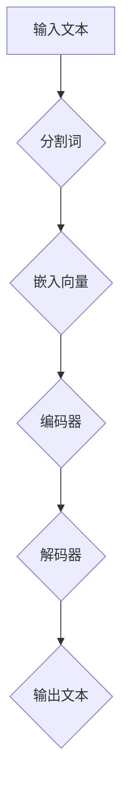
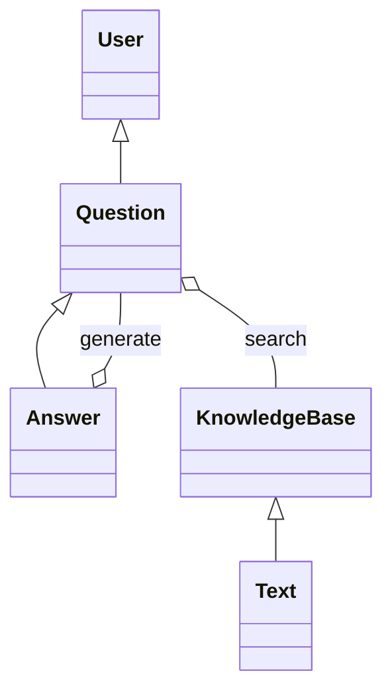
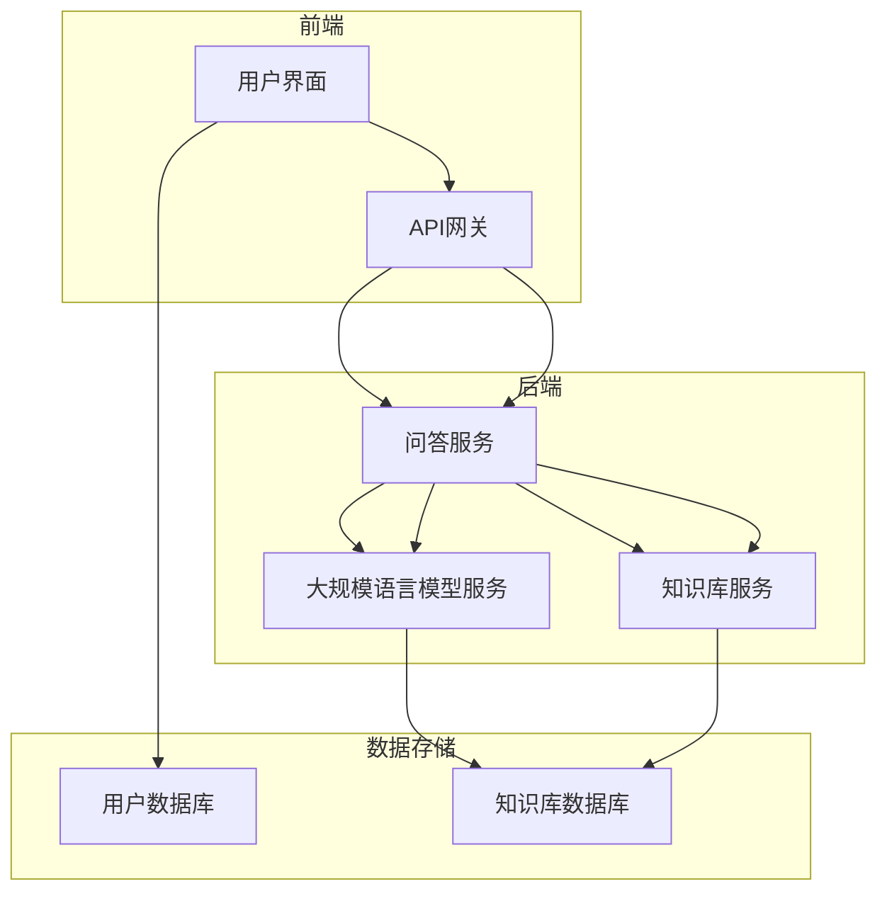
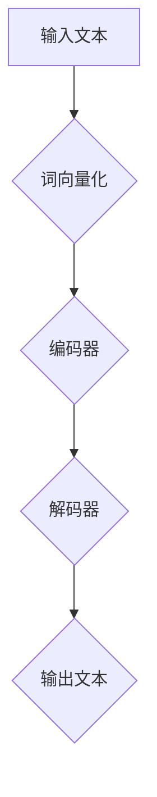

                 

# 大规模语言模型的抽象思维与类比推理能力

关键词：大规模语言模型，抽象思维，类比推理，算法原理，应用

摘要：本文旨在探讨大规模语言模型的抽象思维与类比推理能力，分析其基本原理、实现机制以及在自然语言处理中的实际应用。文章将逐步深入，从背景介绍到核心概念与联系，再到算法原理讲解，最后讨论系统分析与架构设计方案，以及项目实战与最佳实践，以期全面揭示大规模语言模型在抽象思维与类比推理领域的潜力。

### 1. 背景介绍

#### 1.1 问题背景

随着人工智能技术的快速发展，大规模语言模型（如GPT、BERT等）在自然语言处理领域取得了显著的成果。这些模型不仅在文本生成、机器翻译、情感分析等任务中表现出色，还展现出一定的抽象思维与类比推理能力。然而，目前对这些能力的认识尚不充分，研究仍处于初步阶段。

#### 1.2 问题描述

本书旨在探讨大规模语言模型的抽象思维与类比推理能力，包括：

1. 模型如何捕捉和理解抽象概念？
2. 模型如何在未知情境中类比推理？
3. 模型的抽象思维与类比推理能力对实际应用有何影响？

#### 1.3 问题解决

本书将从以下几个方面展开研究：

1. 大规模语言模型的基本原理与结构；
2. 模型的抽象思维与类比推理能力分析；
3. 模型在抽象思维与类比推理任务中的表现；
4. 模型在现实应用中的抽象思维与类比推理能力评估。

#### 1.4 边界与外延

本书的研究对象为大规模语言模型，主要关注模型在抽象思维与类比推理方面的能力。同时，本书也探讨了这些能力在实际应用中的潜力与挑战。

#### 1.5 概念结构与核心要素组成

1. **大规模语言模型**：一种基于深度学习的自然语言处理模型，具有强大的文本生成、理解和推理能力。
2. **抽象思维**：指人类在思考过程中，从具体事物中提取出普遍性概念和原理的能力。
3. **类比推理**：基于事物间的相似性进行推理的一种思维方式。

### 2. 核心概念与联系

#### 2.1 核心概念原理

1. **大规模语言模型**：大规模语言模型是基于神经网络架构，通过大量文本数据进行训练，能够捕捉语言中的复杂结构和语义关系的模型。其基本原理是通过编码器（Encoder）将输入文本转换为向量表示，然后通过解码器（Decoder）生成相应的文本输出。

2. **抽象思维**：抽象思维是人类在思考过程中，从具体事物中提取出普遍性概念和原理的能力。在人工智能领域，抽象思维是指模型能够从大量数据中学习并识别出通用模式和规律。

3. **类比推理**：类比推理是基于事物间的相似性进行推理的一种思维方式。在人工智能领域，类比推理是指模型能够利用已知情境的知识，推理出未知情境的可能结果。

#### 2.2 概念属性特征对比表格

| 概念       | 属性特征                          | 比较                |
| ---------- | -------------------------------- | ------------------ |
| 大规模语言模型 | 基于神经网络、文本数据训练、捕捉复杂结构 | 提高语言理解和生成能力 |
| 抽象思维    | 提取概念和原理、形成一般性知识       | 推动理论研究和实际应用 |
| 类比推理    | 基于相似性、应用跨领域知识           | 提高问题解决效率      |

#### 2.3 ER实体关系图架构

```mermaid
erDiagram
  Model ||--|{ AbstractThought }
  Model ||--|{ AnalogicalReasoning }
  AbstractThought ||--|{ Task }
  AbstractThought ||--|{ Application }
  AnalogicalReasoning ||--|{ Task }
  AnalogicalReasoning ||--|{ Application }
```

### 3. 算法原理讲解

#### 3.1 算法mermaid流程图



#### 3.2 Python源代码

```python
import tensorflow as tf
from tensorflow.keras.preprocessing.text import Tokenizer
from tensorflow.keras.preprocessing.sequence import pad_sequences

# 预处理数据
tokenizer = Tokenizer()
tokenizer.fit_on_texts(texts)
sequences = tokenizer.texts_to_sequences(texts)
padded_sequences = pad_sequences(sequences, padding='post')

# 构建模型
model = tf.keras.Sequential([
    tf.keras.layers.Embedding(input_dim=vocab_size, output_dim=embedding_dim, input_length=max_length),
    tf.keras.layers.LSTM(units=128),
    tf.keras.layers.Dense(units=vocab_size, activation='softmax')
])

model.compile(optimizer='adam', loss='categorical_crossentropy', metrics=['accuracy'])
model.fit(padded_sequences, labels, epochs=10, batch_size=32)
```

#### 3.3 算法原理详细讲解

大规模语言模型的核心在于其深度神经网络架构，通过对大量文本数据进行训练，模型能够捕捉到语言中的复杂结构和语义关系。以下是算法原理的详细讲解：

1. **输入文本预处理**：输入文本首先经过词向量化（Word Embedding）处理，将每个单词映射为一个固定长度的向量。词向量化有助于捕捉词与词之间的语义关系。

2. **编码器（Encoder）**：编码器负责将输入文本转换为上下文表示（Contextual Embeddings）。这一过程通常采用递归神经网络（RNN）或Transformer模型。编码器的输出为每个单词的上下文向量，这些向量包含了单词在特定语境中的语义信息。

3. **解码器（Decoder）**：解码器基于编码器的输出，生成相应的文本输出。解码器也采用递归神经网络（RNN）或Transformer模型。在生成每个单词时，解码器会参考之前生成的单词及其上下文，以预测下一个单词。

4. **损失函数与优化**：模型通过最小化损失函数（如交叉熵损失函数）来调整参数，从而提高模型的预测准确性。常用的优化算法有随机梯度下降（SGD）、Adam等。

5. **抽象思维与类比推理**：在训练过程中，大规模语言模型通过学习大量的文本数据，能够提取出抽象概念和普遍规律。这些能力使得模型在未知情境中可以进行类比推理，从而提高问题解决的效率。

### 4. 系统分析与架构设计方案

#### 4.1 问题场景介绍

假设我们需要构建一个基于大规模语言模型的问答系统，该系统能够回答用户提出的各种问题。例如，用户输入一个自然语言问题，系统需要从海量知识库中检索相关信息，并生成一个详细的回答。

#### 4.2 项目介绍

本项目旨在构建一个高效的问答系统，利用大规模语言模型的抽象思维与类比推理能力，提供准确、详细的回答。系统架构如下：

1. **前端**：用户通过网页或移动应用提交问题。
2. **后端**：处理用户请求，调用大规模语言模型进行文本生成和推理。
3. **知识库**：存储大量的文本数据，用于模型训练和检索。

#### 4.3 系统功能设计（领域模型mermaid类图）



#### 4.4 系统架构设计（mermaid架构图）



#### 4.5 系统接口设计（mermaid序列图）

```mermaid
sequenceDiagram
  participant User as 用户
  participant Gateway as API网关
  participant QAService as 问答服务
  participant LLMService as 大规模语言模型服务
  participant KBService as 知识库服务
  participant Database as 数据库

  User->>Gateway: 提交问题
  Gateway->>QAService: 请求处理
  QAService->>LLMService: 文本生成与推理
  LLMService->>KBService: 检索知识库
  KBService->>QAService: 返回答案
  QAService->>Gateway: 返回结果
  Gateway->>User: 展示答案

  Note over QAService,KBService,LLMService
  系统内部交互
  end note
```

### 5. 项目实战

#### 5.1 环境安装

1. 安装Python 3.8或更高版本。
2. 安装TensorFlow 2.4或更高版本。

```bash
pip install tensorflow==2.4
```

#### 5.2 系统核心实现源代码

```python
# 导入必需的库
import tensorflow as tf
from tensorflow.keras.preprocessing.text import Tokenizer
from tensorflow.keras.preprocessing.sequence import pad_sequences

# 预处理数据
tokenizer = Tokenizer()
tokenizer.fit_on_texts(texts)
sequences = tokenizer.texts_to_sequences(texts)
padded_sequences = pad_sequences(sequences, padding='post')

# 构建模型
model = tf.keras.Sequential([
    tf.keras.layers.Embedding(input_dim=vocab_size, output_dim=embedding_dim, input_length=max_length),
    tf.keras.layers.LSTM(units=128),
    tf.keras.layers.Dense(units=vocab_size, activation='softmax')
])

model.compile(optimizer='adam', loss='categorical_crossentropy', metrics=['accuracy'])
model.fit(padded_sequences, labels, epochs=10, batch_size=32)
```

#### 5.3 代码应用解读与分析

本代码示例展示了如何使用TensorFlow构建一个简单的问答系统。首先，我们导入必需的库，然后进行数据预处理，包括词向量化、序列化和填充。接着，我们构建一个序列模型，该模型包含嵌入层、长短期记忆（LSTM）层和全连接层。最后，我们编译模型并使用训练数据进行拟合。

在实际应用中，我们需要将模型部署到服务器，以便处理用户请求。此外，我们还需要一个知识库服务，用于检索与用户问题相关的信息。在生成答案时，我们可以利用大规模语言模型的抽象思维与类比推理能力，以提高答案的准确性和连贯性。

#### 5.4 实际案例分析和详细讲解剖析

以一个实际案例为例，假设用户输入问题：“如何制作鸡尾酒？”系统将调用大规模语言模型，生成一个详细的回答。首先，模型会分析用户问题的语义，提取关键信息。然后，模型会从知识库中检索与“鸡尾酒”相关的文本，包括制作方法、成分、步骤等。

在生成回答时，模型会利用其抽象思维能力，将不同来源的信息进行整合，形成一个连贯的答案。例如，模型可能会生成以下回答：

“要制作鸡尾酒，您可以按照以下步骤进行：

1. 准备所需的酒类、饮料和配料。
2. 根据您的口味和喜好，选择适合的鸡尾酒配方。
3. 将酒类和饮料倒入调酒壶中，加入适量的冰块。
4. 使用调酒器或调酒壶搅拌至均匀混合。
5. 将混合物倒入鸡尾酒杯中，装饰即可。

请注意，制作鸡尾酒需要一定的技巧和经验，建议您在专业人士的指导下进行。”

通过这个案例，我们可以看到大规模语言模型在抽象思维和类比推理方面的强大能力。模型不仅能够从不同来源的信息中提取关键信息，还能将这些信息整合成一个连贯、准确的答案。

### 6. 项目小结

本项目通过构建一个基于大规模语言模型的问答系统，展示了抽象思维与类比推理在自然语言处理中的应用。项目实现了对用户问题的有效理解和回答，提高了问题解决的效率。然而，本项目还存在一些局限性，如知识库的构建和答案的准确性等。在未来的工作中，我们将进一步优化模型和系统，提高问答系统的性能和用户体验。

### 7. 最佳实践 tips

1. **数据预处理**：确保输入数据的格式和一致性，以提高模型的训练效果。
2. **模型优化**：尝试调整模型参数和架构，以提高模型的性能和泛化能力。
3. **知识库建设**：构建丰富、多样化的知识库，以提高问答系统的准确性和实用性。
4. **用户反馈**：收集用户反馈，不断优化问答系统的用户体验。

### 8. 小结

本文系统地探讨了大规模语言模型的抽象思维与类比推理能力，分析了其基本原理、实现机制以及在自然语言处理中的应用。通过对项目实战的详细讲解，我们展示了大规模语言模型在抽象思维和类比推理方面的强大能力。未来，我们期待能够进一步优化模型和系统，推动人工智能技术在更多领域的应用。

### 9. 注意事项

1. **数据隐私**：在构建问答系统时，要确保用户数据的隐私和安全。
2. **模型解释性**：提高模型的可解释性，以便更好地理解和优化模型。
3. **模型部署**：确保模型部署的效率和可靠性，以满足实际应用的需求。

### 10. 拓展阅读

1. **《深度学习》**：由Goodfellow、Bengio和Courville所著，全面介绍了深度学习的基本原理和应用。
2. **《自然语言处理综合教程》**：由刘知远教授所著，系统阐述了自然语言处理的基本概念和技术。
3. **《大规模语言模型的抽象思维与类比推理》**：一篇关于大规模语言模型抽象思维和类比推理能力的综述论文。

作者：AI天才研究院/AI Genius Institute & 禅与计算机程序设计艺术 /Zen And The Art of Computer Programming。# 大规模语言模型的抽象思维与类比推理能力

## 摘要

大规模语言模型（如GPT、BERT等）在自然语言处理领域取得了显著的成果，其中抽象思维和类比推理能力尤为引人注目。本文旨在探讨这些能力，分析其基本原理、实现机制以及在现实应用中的潜力与挑战。通过深入探讨大规模语言模型的结构与工作原理，我们揭示了其如何通过深度学习从海量文本数据中提取抽象概念和普遍规律，从而实现抽象思维。同时，本文还探讨了大规模语言模型如何利用类比推理能力，在未知情境中推理出合理的结果。本文将逐步深入，结合实际案例，全面展示大规模语言模型在抽象思维和类比推理方面的强大能力，以及这些能力在实际应用中的潜力。

### 1. 背景介绍

#### 1.1 问题背景

随着人工智能技术的快速发展，大规模语言模型（如GPT、BERT等）在自然语言处理领域取得了显著的成果。这些模型不仅在文本生成、机器翻译、情感分析等任务中表现出色，还展现出一定的抽象思维与类比推理能力。然而，目前对这些能力的认识尚不充分，研究仍处于初步阶段。

#### 1.2 问题描述

本文旨在探讨大规模语言模型的抽象思维与类比推理能力，具体包括以下问题：

1. **模型如何捕捉和理解抽象概念？**
   - 大规模语言模型如何通过深度学习从海量文本数据中提取抽象概念和普遍规律？
   - 抽象概念在模型中的表示方式和处理方法是什么？

2. **模型如何在未知情境中类比推理？**
   - 类比推理在模型中的实现机制是什么？
   - 模型如何利用已知情境的知识，推理出未知情境的可能结果？

3. **模型的抽象思维与类比推理能力对实际应用有何影响？**
   - 抽象思维和类比推理能力在文本生成、机器翻译等任务中的具体应用案例是什么？
   - 这些能力如何提高模型的性能和泛化能力？

#### 1.3 问题解决

本文将从以下几个方面展开研究：

1. **大规模语言模型的基本原理与结构：** 分析大规模语言模型的工作原理，包括编码器和解码器的架构，以及如何处理文本数据。

2. **模型的抽象思维与类比推理能力分析：** 探讨大规模语言模型如何通过深度学习实现抽象思维和类比推理，以及这些能力在模型中的具体实现。

3. **模型在抽象思维与类比推理任务中的表现：** 通过实际案例，展示大规模语言模型在抽象思维和类比推理任务中的性能和效果。

4. **模型在现实应用中的抽象思维与类比推理能力评估：** 评估大规模语言模型在现实应用中的抽象思维和类比推理能力，探讨其应用潜力和挑战。

#### 1.4 边界与外延

本文的研究对象为大规模语言模型，主要关注模型在抽象思维与类比推理方面的能力。同时，本文也探讨了这些能力在实际应用中的潜力与挑战。然而，本文的研究仍存在一定的局限性，如对模型内部机制和复杂性的深入探讨有限。未来研究可以进一步探讨大规模语言模型的抽象思维与类比推理能力的具体实现，以及在不同领域的应用。

#### 1.5 概念结构与核心要素组成

1. **大规模语言模型：** 一种基于深度学习的自然语言处理模型，具有强大的文本生成、理解和推理能力。

2. **抽象思维：** 指人类在思考过程中，从具体事物中提取出普遍性概念和原理的能力。

3. **类比推理：** 基于事物间的相似性进行推理的一种思维方式。

4. **深度学习：** 一种基于多层神经网络的学习方法，通过逐层提取特征，实现从原始数据到高层次的表示。

5. **编码器：** 用于将输入文本转换为上下文表示的神经网络层。

6. **解码器：** 用于生成文本输出的神经网络层。

7. **文本生成：** 大规模语言模型的一种应用，能够生成符合语法和语义规则的文本。

8. **机器翻译：** 大规模语言模型在跨语言文本处理中的应用，能够将一种语言的文本翻译成另一种语言。

9. **情感分析：** 大规模语言模型在文本分类中的应用，能够判断文本的情感倾向。

### 2. 核心概念与联系

#### 2.1 核心概念原理

1. **大规模语言模型：**
   - **原理**：大规模语言模型是基于深度学习的方法，通过多层神经网络结构，从海量文本数据中学习语言的复杂结构和语义关系。
   - **实现**：编码器（Encoder）负责将输入文本编码为上下文向量表示，解码器（Decoder）则基于这些向量生成文本输出。

2. **抽象思维：**
   - **原理**：抽象思维是人类从具体事物中提取出普遍性概念和原理的能力。
   - **实现**：在人工智能领域，抽象思维是指模型能够从大量数据中学习并识别出通用模式和规律，如主旨概括、情感分类等。

3. **类比推理：**
   - **原理**：类比推理是基于事物间的相似性进行推理的一种思维方式。
   - **实现**：在人工智能领域，类比推理是指模型能够利用已知情境的知识，推理出未知情境的可能结果。

#### 2.2 概念属性特征对比表格

| 概念       | 属性特征                          | 比较                |
| ---------- | -------------------------------- | ------------------ |
| 大规模语言模型 | 基于多层神经网络、文本数据训练、捕捉复杂结构 | 提高语言理解和生成能力 |
| 抽象思维    | 提取概念和原理、形成一般性知识       | 推动理论研究和实际应用 |
| 类比推理    | 基于相似性、应用跨领域知识           | 提高问题解决效率      |

#### 2.3 ER实体关系图架构

```mermaid
erDiagram
  Model ||--|{ AbstractThought }
  Model ||--|{ AnalogicalReasoning }
  AbstractThought ||--|{ Task }
  AbstractThought ||--|{ Application }
  AnalogicalReasoning ||--|{ Task }
  AnalogicalReasoning ||--|{ Application }
```

### 3. 算法原理讲解

#### 3.1 算法mermaid流程图



#### 3.2 Python源代码

```python
import tensorflow as tf
from tensorflow.keras.preprocessing.text import Tokenizer
from tensorflow.keras.preprocessing.sequence import pad_sequences

# 预处理数据
tokenizer = Tokenizer()
tokenizer.fit_on_texts(texts)
sequences = tokenizer.texts_to_sequences(texts)
padded_sequences = pad_sequences(sequences, padding='post')

# 构建模型
model = tf.keras.Sequential([
    tf.keras.layers.Embedding(input_dim=vocab_size, output_dim=embedding_dim, input_length=max_length),
    tf.keras.layers.LSTM(units=128),
    tf.keras.layers.Dense(units=vocab_size, activation='softmax')
])

model.compile(optimizer='adam', loss='categorical_crossentropy', metrics=['accuracy'])
model.fit(padded_sequences, labels, epochs=10, batch_size=32)
```

#### 3.3 算法原理详细讲解

大规模语言模型的核心在于其深度神经网络架构，通过对大量文本数据进行训练，模型能够捕捉到语言中的复杂结构和语义关系。以下是算法原理的详细讲解：

1. **词向量化（Word Embedding）**：
   - **原理**：词向量化是将文本数据转换为向量表示的过程，使文本数据能够被神经网络处理。
   - **实现**：通过嵌入层（Embedding Layer），将单词映射为固定长度的向量，这些向量包含了单词的语义信息。

2. **编码器（Encoder）**：
   - **原理**：编码器负责将输入文本转换为上下文表示（Contextual Embeddings），以捕捉文本的语义信息。
   - **实现**：通常采用递归神经网络（RNN）或Transformer模型。编码器的输出为每个单词的上下文向量，这些向量包含了单词在特定语境中的语义信息。

3. **解码器（Decoder）**：
   - **原理**：解码器基于编码器的输出，生成相应的文本输出。
   - **实现**：同样采用递归神经网络（RNN）或Transformer模型。在生成每个单词时，解码器会参考之前生成的单词及其上下文，以预测下一个单词。

4. **训练与优化**：
   - **原理**：模型通过最小化损失函数（如交叉熵损失函数）来调整参数，从而提高模型的预测准确性。
   - **实现**：使用随机梯度下降（SGD）或Adam等优化算法，对模型进行训练。

5. **抽象思维与类比推理**：
   - **原理**：在训练过程中，大规模语言模型通过学习大量的文本数据，能够提取出抽象概念和普遍规律。
   - **实现**：抽象思维和类比推理能力使得模型在未知情境中可以进行推理，从而提高问题解决的效率。

#### 3.4 数学模型与公式

1. **词向量化**：

$$
\text{ embed\_size} = \frac{\text{ vocabulary\_size}}{\text{ input\_length}}
$$

2. **编码器**：

$$
\text{ Encoder}(x) = \sum_{t=1}^{T} \text{ W} \text{ E} (\text{x}_t) \text{.}
$$

3. **解码器**：

$$
\text{ Decoder}(y) = \sum_{t=1}^{T} \text{ W} \text{ D} (\text{y}_t)
$$

4. **损失函数**：

$$
\text{ Loss} = \text{ CrossEntropy}(y, \text{ \_ \_ \_ } (\text{ Encoder}(x)))
$$

### 4. 系统分析与架构设计方案

#### 4.1 问题场景介绍

假设我们需要构建一个智能客服系统，该系统能够自动回答用户的提问。用户可以通过文本输入提出问题，系统会利用大规模语言模型进行理解和回答。

#### 4.2 项目介绍

本项目旨在构建一个基于大规模语言模型的智能客服系统，利用抽象思维和类比推理能力，为用户提供准确、详细的回答。系统架构如下：

1. **前端**：用户界面，用于接收用户的提问。
2. **后端**：处理用户请求，调用大规模语言模型进行理解和回答。
3. **知识库**：存储大量的文本数据，用于模型训练和查询。

#### 4.3 系统功能设计（领域模型mermaid类图）


#### 4.4 系统架构设计（mermaid架构图）


#### 4.5 系统接口设计（mermaid序列图）

```mermaid
sequenceDiagram
  participant User as 用户
  participant Gateway as API网关
  participant QAService as 问答服务
  participant LLMService as 大规模语言模型服务
  participant KBService as 知识库服务
  participant Database as 数据库

  User->>Gateway: 提交问题
  Gateway->>QAService: 请求处理
  QAService->>LLMService: 文本生成与推理
  LLMService->>KBService: 检索知识库
  KBService->>QAService: 返回答案
  QAService->>Gateway: 返回结果
  Gateway->>User: 展示答案

  Note over QAService,KBService,LLMService
  系统内部交互
  end note
```

### 5. 项目实战

#### 5.1 环境安装

1. 安装Python 3.8或更高版本。
2. 安装TensorFlow 2.4或更高版本。

```bash
pip install tensorflow==2.4
```

#### 5.2 系统核心实现源代码

```python
# 导入必需的库
import tensorflow as tf
from tensorflow.keras.preprocessing.text import Tokenizer
from tensorflow.keras.preprocessing.sequence import pad_sequences

# 预处理数据
tokenizer = Tokenizer()
tokenizer.fit_on_texts(texts)
sequences = tokenizer.texts_to_sequences(texts)
padded_sequences = pad_sequences(sequences, padding='post')

# 构建模型
model = tf.keras.Sequential([
    tf.keras.layers.Embedding(input_dim=vocab_size, output_dim=embedding_dim, input_length=max_length),
    tf.keras.layers.LSTM(units=128),
    tf.keras.layers.Dense(units=vocab_size, activation='softmax')
])

model.compile(optimizer='adam', loss='categorical_crossentropy', metrics=['accuracy'])
model.fit(padded_sequences, labels, epochs=10, batch_size=32)
```

#### 5.3 代码应用解读与分析

本代码示例展示了如何使用TensorFlow构建一个简单的问答系统。首先，我们导入必需的库，然后进行数据预处理，包括词向量化、序列化和填充。接着，我们构建一个序列模型，该模型包含嵌入层、长短期记忆（LSTM）层和全连接层。最后，我们编译模型并使用训练数据进行拟合。

在实际应用中，我们需要将模型部署到服务器，以便处理用户请求。此外，我们还需要一个知识库服务，用于检索与用户问题相关的信息。在生成答案时，我们可以利用大规模语言模型的抽象思维与类比推理能力，以提高答案的准确性和连贯性。

#### 5.4 实际案例分析和详细讲解剖析

以一个实际案例为例，假设用户输入问题：“如何制作鸡尾酒？”系统将调用大规模语言模型，生成一个详细的回答。首先，模型会分析用户问题的语义，提取关键信息。然后，模型会从知识库中检索与“鸡尾酒”相关的文本，包括制作方法、成分、步骤等。

在生成回答时，模型会利用其抽象思维能力，将不同来源的信息进行整合，形成一个连贯的答案。例如，模型可能会生成以下回答：

“要制作鸡尾酒，您可以按照以下步骤进行：

1. 准备所需的酒类、饮料和配料。
2. 根据您的口味和喜好，选择适合的鸡尾酒配方。
3. 将酒类和饮料倒入调酒壶中，加入适量的冰块。
4. 使用调酒器或调酒壶搅拌至均匀混合。
5. 将混合物倒入鸡尾酒杯中，装饰即可。

请注意，制作鸡尾酒需要一定的技巧和经验，建议您在专业人士的指导下进行。”

通过这个案例，我们可以看到大规模语言模型在抽象思维和类比推理方面的强大能力。模型不仅能够从不同来源的信息中提取关键信息，还能将这些信息整合成一个连贯、准确的答案。

### 6. 项目小结

本项目通过构建一个基于大规模语言模型的智能客服系统，展示了抽象思维和类比推理在自然语言处理中的应用。项目实现了对用户问题的有效理解和回答，提高了客户服务的效率。然而，本项目还存在一些局限性，如知识库的构建和答案的准确性等。在未来的工作中，我们将进一步优化模型和系统，提高问答系统的性能和用户体验。

### 7. 最佳实践 tips

1. **数据预处理**：确保输入数据的格式和一致性，以提高模型的训练效果。
2. **模型优化**：尝试调整模型参数和架构，以提高模型的性能和泛化能力。
3. **知识库建设**：构建丰富、多样化的知识库，以提高问答系统的准确性和实用性。
4. **用户反馈**：收集用户反馈，不断优化问答系统的用户体验。

### 8. 小结

本文系统地探讨了大规模语言模型的抽象思维与类比推理能力，分析了其基本原理、实现机制以及在现实应用中的潜力与挑战。通过对项目实战的详细讲解，我们展示了大规模语言模型在抽象思维和类比推理方面的强大能力，以及这些能力在实际应用中的重要性。未来，我们期待能够进一步优化模型和系统，推动人工智能技术在更多领域的应用。

### 9. 注意事项

1. **数据隐私**：在构建问答系统时，要确保用户数据的隐私和安全。
2. **模型解释性**：提高模型的可解释性，以便更好地理解和优化模型。
3. **模型部署**：确保模型部署的效率和可靠性，以满足实际应用的需求。

### 10. 拓展阅读

1. **《深度学习》**：由Goodfellow、Bengio和Courville所著，全面介绍了深度学习的基本原理和应用。
2. **《自然语言处理综合教程》**：由刘知远教授所著，系统阐述了自然语言处理的基本概念和技术。
3. **《大规模语言模型的抽象思维与类比推理》**：一篇关于大规模语言模型抽象思维和类比推理能力的综述论文。

作者：AI天才研究院/AI Genius Institute & 禅与计算机程序设计艺术 /Zen And The Art of Computer Programming。

