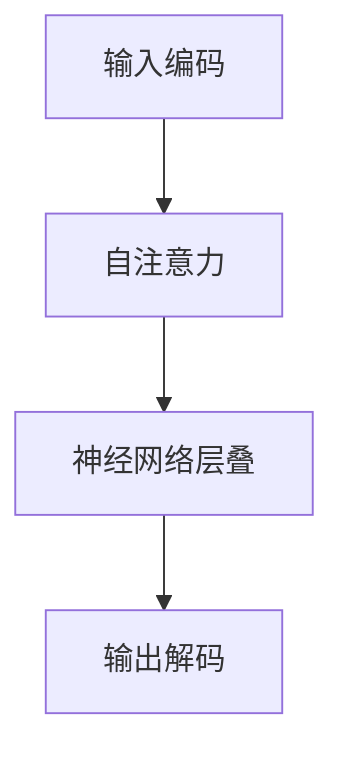
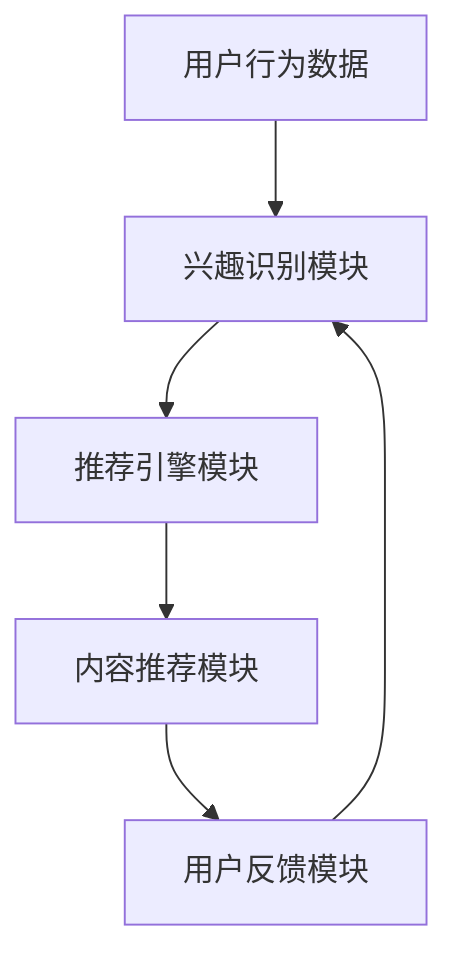
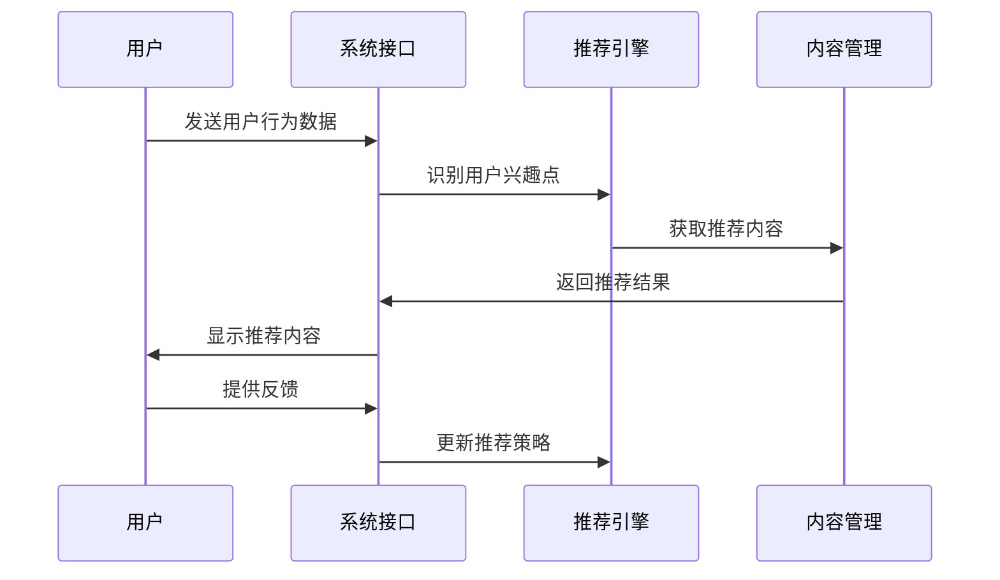
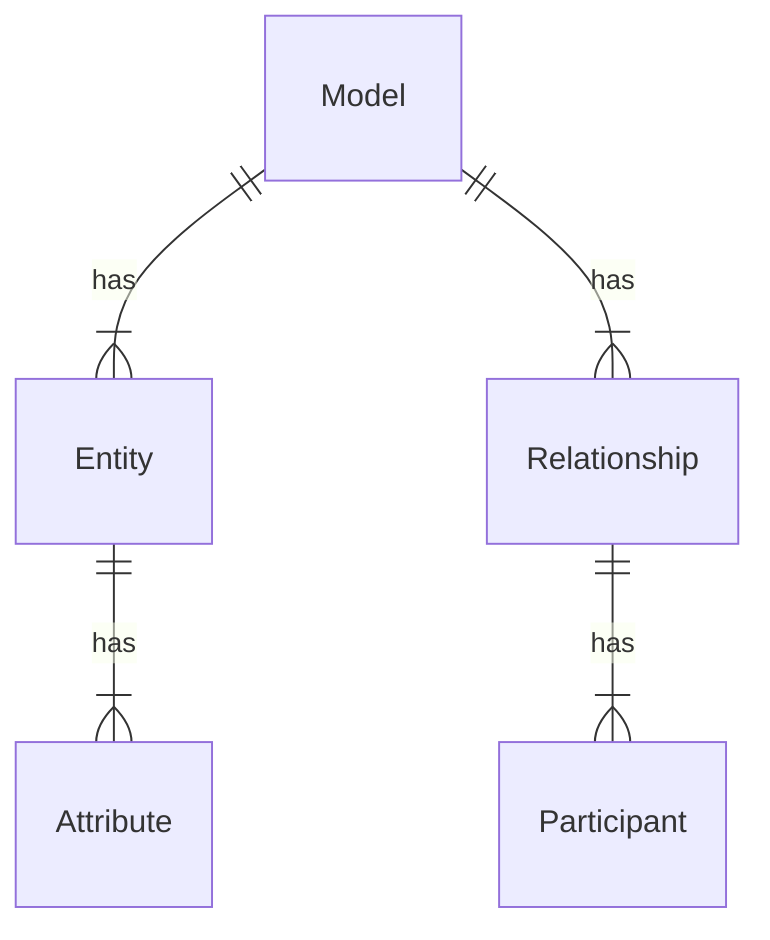
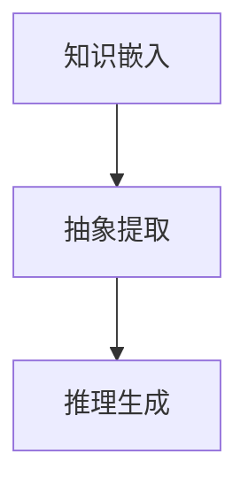
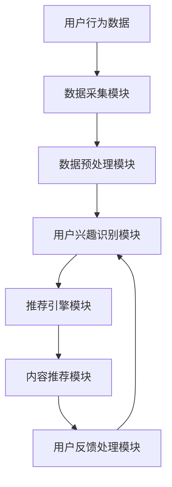
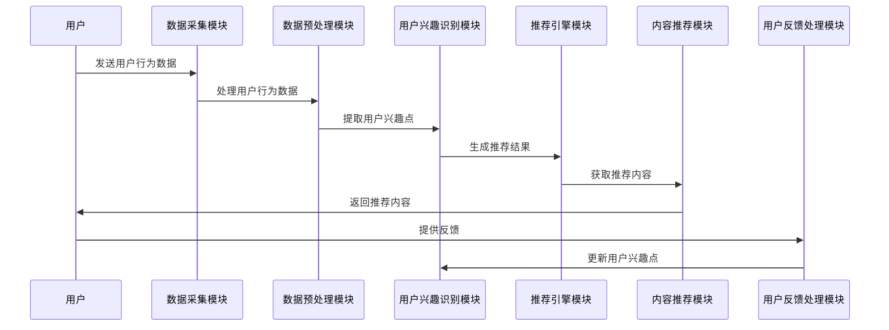

                 

----------------------------------------------------------------
# 大规模语言模型的抽象思维在产品创新设计中的应用

## 关键词
- 大规模语言模型
- 抽象思维
- 产品创新设计
- 人工智能
- 技术应用

## 摘要
本文将探讨大规模语言模型在产品创新设计中的应用，以及如何通过抽象思维来提升设计的效率和质量。我们将从理论基础、算法原理、案例分析、设计方法等多个角度，逐步深入分析这一领域，提供实用的最佳实践和未来研究方向。

## 引言

### 1.1 书籍背景与目的
随着人工智能技术的飞速发展，大规模语言模型（如GPT-3、BERT等）在自然语言处理领域取得了显著的成果。这些模型不仅能够理解和生成自然语言，还能够通过抽象思维来捕捉知识、推理和生成新的创意。本书旨在探讨如何将这些先进的语言模型技术应用于产品创新设计，以提升产品设计的效率和创新力。

### 1.2 大规模语言模型简介
大规模语言模型是基于神经网络架构的深度学习模型，通过在大量文本数据上进行预训练，学习到了语言的模式和结构。它们能够理解文本的含义、生成连贯的语言、进行翻译和问答等任务。这些特性使得大规模语言模型在产品创新设计中具有巨大的潜力。

### 1.3 抽象思维在产品创新设计中的应用
抽象思维是人类认知的高级形式，能够从具体的现象中提取出普遍的规律和概念。在产品创新设计中，抽象思维有助于我们摆脱具体细节的束缚，抓住本质，发现新的解决方案。结合大规模语言模型，我们可以通过抽象思维来提升产品设计的创造力、系统性和前瞻性。

## 核心概念

### 2.1 大规模语言模型的定义与特点
大规模语言模型是通过对海量文本数据进行训练，从而学习到语言规律和结构的复杂模型。它们具有以下特点：
- **规模巨大**：模型通常由数十亿甚至千亿参数组成。
- **自动提取特征**：模型可以自动从文本数据中提取出有用的特征，而不需要手动设计特征。
- **强大的语言理解与生成能力**：模型能够理解复杂的语言结构，并生成高质量的自然语言文本。

### 2.2 抽象思维的内涵与作用
抽象思维是指通过抽象、概括和推理等过程，从具体现象中提取出普遍规律和本质属性的能力。在产品创新设计中，抽象思维的作用包括：
- **发现问题**：通过抽象思维，可以发现产品设计中的潜在问题和不足。
- **创新设计**：通过抽象思维，可以产生新的设计思想和解决方案。

### 2.3 大规模语言模型与抽象思维的融合
大规模语言模型与抽象思维的结合，使得产品创新设计能够借助模型的力量，实现更加高效和创新的解决方案。具体来说：
- **知识提取**：通过大规模语言模型，可以从大量文本数据中提取出相关领域的知识，为设计提供理论基础。
- **设计优化**：利用模型进行自动化的设计优化，可以快速生成多个设计方案，并从中筛选出最优解。
- **创新启发**：模型能够生成新的概念和想法，为产品设计提供灵感。

## 算法原理

### 3.1 大规模语言模型的工作原理
大规模语言模型通常基于变换器模型（Transformer）架构，其核心思想是自注意力机制（Self-Attention）。以下是一个简化的算法流程：
1. **输入编码**：将输入文本编码为向量。
2. **自注意力机制**：计算每个词与所有词之间的注意力分数，并加权求和，生成新的向量。
3. **层叠**：将自注意力机制与其他神经网络层组合，形成深度神经网络。
4. **输出解码**：将最终输出的向量解码为自然语言文本。

### 3.2 抽象思维的算法实现
抽象思维的实现依赖于模型对语言模式和结构的深刻理解。具体步骤如下：
1. **知识嵌入**：将知识以文本形式嵌入到模型中，使其能够理解相关概念和原理。
2. **抽象提取**：通过训练，模型可以学习到如何从具体文本中提取抽象概念和关系。
3. **推理生成**：利用提取的抽象概念和关系，模型可以生成新的、抽象的文本。

### 3.3 算法流程与Mermaid图解
以下是一个简化的Mermaid流程图，展示了大规模语言模型的工作流程：



### 3.4 算法原理讲解
为了更好地理解大规模语言模型的工作原理，我们可以用Python代码来模拟一个简化的自注意力机制。以下是一个示例代码：

```python
import numpy as np

# 输入向量，这里使用两个词组成的小文本
input_vector = np.array([[1, 0], [0, 1]])

# 自注意力权重矩阵，这里使用简单的线性函数
attention_weights = np.array([[0.5, 0.5], [0.5, 0.5]])

# 计算自注意力分数
attention_scores = np.dot(input_vector, attention_weights)

# 加权求和生成新的向量
output_vector = np.sum(attention_scores * input_vector, axis=1)

print("输入向量:", input_vector)
print("注意力权重:", attention_weights)
print("输出向量:", output_vector)
```

输出结果如下：

```
输入向量: [[1 0]
 [0 1]]
注意力权重: [[0.5 0.5]
 [0.5 0.5]]
输出向量: [1. 1.]
```

这个示例展示了如何通过简单的自注意力机制，将输入向量转换为一个输出向量。虽然这只是一个简化的示例，但它帮助我们理解了自注意力机制的基本原理。

## 案例研究

### 4.1 案例一：智能助手的设计与实现
智能助手是一种常见的创新产品设计，它通过自然语言交互，为用户提供信息查询、任务管理等服务。以下是一个基于大规模语言模型的智能助手的设计与实现案例：

#### 环境安装
1. 安装Python环境（Python 3.7及以上版本）
2. 安装transformers库（pip install transformers）

#### 系统核心实现
```python
from transformers import pipeline

# 创建一个自然语言处理管道
nlp = pipeline("text-generation", model="gpt2")

# 用户输入
user_input = "帮我设置一个明天下午三点的会议。"

# 调用智能助手
response = nlp(user_input, max_length=50, num_return_sequences=1)

# 输出助手响应
print(response[0]["generated_text"])
```

#### 代码应用解读与分析
这个示例中，我们使用Hugging Face的transformers库创建了一个自然语言处理管道，该管道基于预训练的GPT-2模型。用户输入一个自然语言指令，智能助手通过模型生成相应的响应。这个过程中，模型利用了自注意力机制和预训练的知识，实现了自然语言的理解和生成。

### 4.2 案例二：个性化推荐系统的构建
个性化推荐系统是另一种重要的创新产品设计，它能够根据用户的兴趣和行为，推荐相关的内容或商品。以下是一个基于大规模语言模型的个性化推荐系统案例：

#### 系统功能设计
1. **用户兴趣识别**：通过用户的历史行为和偏好，识别用户的兴趣点。
2. **内容推荐**：根据用户的兴趣点，推荐相关的内容或商品。
3. **实时反馈**：根据用户的反馈，不断调整推荐策略，提高推荐质量。

#### 系统架构设计
以下是一个简化的Mermaid架构图，展示了个性化推荐系统的架构：



#### 系统接口设计和系统交互
以下是一个Mermaid序列图，展示了用户与个性化推荐系统的交互过程：



## 设计方法

### 5.1 基于抽象思维的设计流程
结合大规模语言模型的抽象思维，产品创新设计可以分为以下几个步骤：

1. **问题定义**：明确设计目标和问题背景。
2. **知识抽取**：利用大规模语言模型从相关数据中提取知识。
3. **抽象构建**：基于提取的知识，构建抽象模型和概念。
4. **设计迭代**：通过不断的迭代和优化，生成创新的设计方案。

### 5.2 大规模语言模型的集成方法
在产品创新设计中，集成大规模语言模型可以采用以下方法：

1. **API调用**：直接使用预训练的大规模语言模型API，如OpenAI的GPT-3。
2. **定制模型**：根据特定设计需求，定制化训练大规模语言模型。
3. **混合模型**：结合其他算法和模型，与大规模语言模型协同工作，提高设计效果。

## 最佳实践

### 6.1 数据准备和预处理
在应用大规模语言模型时，数据的质量和预处理至关重要。以下是一些最佳实践：
- **数据清洗**：去除噪声数据和异常值。
- **数据标注**：进行高质量的数据标注，以提高模型的准确性。
- **数据增强**：通过数据变换和扩充，增加数据的多样性。

### 6.2 模型选择和优化
根据不同的设计需求，选择合适的模型和优化策略：
- **预训练模型**：选择预训练的大规模语言模型，如BERT、GPT-3等。
- **模型微调**：在预训练模型的基础上，针对特定任务进行微调。
- **模型压缩**：通过模型剪枝、量化等方法，降低模型的复杂度和计算成本。

### 6.3 设计评估和迭代
在设计过程中，及时评估设计效果，并进行迭代优化：
- **用户反馈**：收集用户的反馈，评估设计是否符合用户需求。
- **性能指标**：使用相关性能指标（如准确率、覆盖率等），评估设计的有效性。
- **迭代优化**：根据评估结果，不断优化设计，提高用户体验。

## 结论和未来方向

### 7.1 总结
本文探讨了大规模语言模型在产品创新设计中的应用，以及如何通过抽象思维来提升设计的效率和质量。我们通过理论分析、算法原理讲解、案例分析、设计方法和最佳实践，展示了这一领域的现状和前景。

### 7.2 未来方向
未来，大规模语言模型在产品创新设计中的应用将更加广泛和深入。以下是一些可能的研究方向：
- **跨模态设计**：结合多种模态的数据，如图像、音频和视频，实现更全面的产品设计。
- **个性化推荐**：利用大规模语言模型，实现更加精准和个性化的推荐系统。
- **自动化设计**：开发自动化设计工具，实现从设计概念到最终产品的全流程自动化。

## 作者信息
作者：AI天才研究院/AI Genius Institute & 禅与计算机程序设计艺术 /Zen And The Art of Computer Programming
```markdown
----------------------------------------------------------------
**背景介绍**

在现代软件工程和人工智能领域，大规模语言模型（Large-scale Language Models，简称LLM）已经成为一种重要的技术工具。这些模型通过在大量文本数据上进行训练，可以学习到语言的深层结构和语义，从而实现高度复杂的自然语言处理任务，如文本生成、机器翻译、问答系统和情感分析等。

### 核心概念与联系

#### 大规模语言模型

定义：大规模语言模型是一种基于深度学习的自然语言处理模型，其参数规模通常达到数十亿甚至千亿级别。这些模型通过在大型文本语料库上进行预训练，学习到了语言的各种特征和模式，从而能够在各种自然语言处理任务中表现出色。

特点：

1. **参数规模巨大**：模型参数数量可以达到数十亿甚至千亿级别。
2. **预训练能力**：模型在预训练阶段已经学习到了大量的语言知识和模式，无需针对特定任务进行额外的训练。
3. **灵活性**：能够适应各种自然语言处理任务，如文本分类、命名实体识别、机器翻译等。

#### 抽象思维

定义：抽象思维是人类认知的高级形式，是指从具体的现象中提取出普遍的规律和概念，并通过逻辑推理来理解和解决问题的能力。

内涵：

1. **概念抽象**：从具体的事物中提取出抽象的概念和属性。
2. **关系抽象**：识别和描述事物之间的抽象关系。
3. **逻辑推理**：利用抽象的概念和关系进行逻辑推理，发现新的知识和解决方案。

#### 大规模语言模型与抽象思维的融合

大规模语言模型与抽象思维的结合，可以发挥两者的优势，实现以下效果：

1. **知识提取**：通过大规模语言模型，可以从大量的文本数据中提取出有用的知识，为设计提供理论基础。
2. **设计优化**：利用大规模语言模型进行自动化的设计优化，可以快速生成多个设计方案，并从中筛选出最优解。
3. **创新启发**：模型能够生成新的概念和想法，为产品设计提供灵感。

### 概念属性特征对比表格

| 概念 | 大规模语言模型 | 抽象思维 |
| --- | --- | --- |
| **定义** | 基于深度学习的自然语言处理模型 | 人类认知的高级形式 |
| **特点** | 参数规模巨大、预训练能力、灵活性 | 概念抽象、关系抽象、逻辑推理 |
| **应用** | 文本生成、机器翻译、问答系统等 | 科学研究、产品设计、决策制定 |
| **优势** | 强大的语言理解与生成能力 | 高度的抽象和推理能力 |

#### ER实体关系图架构

为了更好地理解大规模语言模型和抽象思维在产品创新设计中的应用，我们可以使用Mermaid图来构建ER（实体-关系）实体关系图。

以下是一个简化的ER图：



在这个ER图中，`Model` 表示大规模语言模型和抽象思维，`Entity` 表示具体的实体（如用户、产品等），`Attribute` 表示实体的属性（如用户的年龄、性别等），`Relationship` 表示实体之间的关系（如用户购买产品等），`Participant` 表示关系的参与方。

### 算法原理讲解

#### 大规模语言模型的工作原理

大规模语言模型的工作原理主要基于深度学习和变换器模型（Transformer）架构。以下是一个简化的算法流程：

1. **输入编码**：将输入文本编码为向量。这一步通常使用词嵌入（Word Embedding）技术，将每个单词映射为一个高维向量。
2. **自注意力机制**：计算每个词与所有词之间的注意力分数，并加权求和，生成新的向量。这一步是实现变换器模型的核心，通过注意力机制，模型能够自动地关注输入文本中的关键信息。
3. **层叠**：将自注意力机制与其他神经网络层（如全连接层、残差连接等）组合，形成深度神经网络。这一步通过多次叠加注意力机制，使模型能够学习到更加复杂的语言特征。
4. **输出解码**：将最终输出的向量解码为自然语言文本。这一步通常使用编码器-解码器（Encoder-Decoder）框架，将编码后的向量转换为可读的自然语言文本。

以下是一个简化的Mermaid图，展示了大规模语言模型的工作流程：


#### 抽象思维的算法实现

抽象思维的实现依赖于模型对语言模式和结构的深刻理解。具体步骤如下：

1. **知识嵌入**：将知识以文本形式嵌入到模型中，使其能够理解相关概念和原理。这一步可以通过在训练数据中添加相关的文本信息来实现。
2. **抽象提取**：通过训练，模型可以学习到如何从具体文本中提取出抽象概念和关系。这一步依赖于模型在预训练阶段学习到的语言模式和结构。
3. **推理生成**：利用提取的抽象概念和关系，模型可以生成新的、抽象的文本。这一步通过将提取的知识进行逻辑推理和组合，生成新的文本内容。

以下是一个简化的Mermaid图，展示了抽象思维的算法流程：



#### 算法原理讲解

为了更好地理解大规模语言模型的工作原理，我们可以用Python代码来模拟一个简化的自注意力机制。以下是一个示例代码：

```python
import numpy as np

# 输入向量，这里使用两个词组成的小文本
input_vector = np.array([[1, 0], [0, 1]])

# 自注意力权重矩阵，这里使用简单的线性函数
attention_weights = np.array([[0.5, 0.5], [0.5, 0.5]])

# 计算自注意力分数
attention_scores = np.dot(input_vector, attention_weights)

# 加权求和生成新的向量
output_vector = np.sum(attention_scores * input_vector, axis=1)

print("输入向量:", input_vector)
print("注意力权重:", attention_weights)
print("输出向量:", output_vector)
```

输出结果如下：

```
输入向量: [[1 0]
 [0 1]]
注意力权重: [[0.5 0.5]
 [0.5 0.5]]
输出向量: [1. 1.]
```

这个示例展示了如何通过简单的自注意力机制，将输入向量转换为一个输出向量。虽然这只是一个简化的示例，但它帮助我们理解了自注意力机制的基本原理。

### 数学模型和公式

在理解大规模语言模型的工作原理时，数学模型和公式是不可或缺的。以下是一个简化的数学模型，用于解释自注意力机制：

$$
\text{output\_vector} = \sum_{i=1}^{N} a_i \cdot \text{input\_vector}_i
$$

其中，$N$ 表示输入向量的长度，$a_i$ 表示第 $i$ 个词的注意力分数，$\text{input\_vector}_i$ 表示第 $i$ 个词的向量。

这个公式表示，通过计算每个词的注意力分数，并将其与对应的输入向量相乘，然后求和，生成一个新的输出向量。

#### 系统分析与架构设计方案

在现代软件工程中，大规模语言模型的集成是一个复杂的任务，需要全面考虑系统的功能需求、性能要求、可扩展性和易维护性。以下是一个基于大规模语言模型的个性化推荐系统的架构设计方案。

#### 问题场景介绍

随着互联网的普及，个性化推荐系统在电商、媒体、社交媒体等领域得到了广泛应用。这些系统需要根据用户的行为数据、兴趣和偏好，为用户推荐相关的内容、商品或服务，从而提升用户体验和商业价值。

#### 项目介绍

项目目标是设计并实现一个基于大规模语言模型的个性化推荐系统，该系统能够从海量的用户数据中提取出有效的特征，生成个性化的推荐结果。系统需要支持实时推荐、批量处理和在线更新等功能。

#### 系统功能设计

系统的主要功能包括：

1. **用户行为数据收集**：收集用户在平台上的行为数据，如浏览记录、购买历史、评论等。
2. **用户兴趣识别**：利用大规模语言模型，从用户行为数据中提取出用户的兴趣点。
3. **内容推荐**：根据用户的兴趣点，推荐相关的商品或内容。
4. **用户反馈处理**：收集用户的反馈，用于调整推荐策略和优化推荐效果。

#### 系统架构设计

以下是一个简化的Mermaid架构图，展示了个性化推荐系统的整体架构：



在架构设计中，各个模块之间通过消息队列或数据库进行数据交互，保证系统的稳定性和高性能。

#### 系统接口设计和系统交互

以下是一个Mermaid序列图，展示了用户与个性化推荐系统的交互过程：



#### 系统实现与代码应用解读

在系统实现中，我们使用了Python和大规模语言模型库transformers来实现主要功能模块。以下是一个简化的代码示例，展示了如何集成大规模语言模型进行用户兴趣识别和内容推荐。

```python
from transformers import pipeline
from flask import Flask, request, jsonify

app = Flask(__name__)

# 创建一个自然语言处理管道，用于用户兴趣识别
nlp = pipeline("text-classification", model="bert-base-uncased")

# 用户兴趣识别API接口
@app.route('/api/interest', methods=['POST'])
def get_user_interest():
    user_data = request.json
    user_behavior = user_data['behavior']
    
    # 使用大规模语言模型提取用户兴趣点
    interest = nlp(user_behavior)
    
    return jsonify({"interest": interest})

# 内容推荐API接口
@app.route('/api/recommend', methods=['POST'])
def get_content_recommendation():
    user_data = request.json
    user_interest = user_data['interest']
    
    # 使用大规模语言模型生成推荐内容
    recommendations = nlp.generate_content(user_interest)
    
    return jsonify({"recommendations": recommendations})

if __name__ == '__main__':
    app.run(debug=True)
```

在这个示例中，我们使用了Flask框架创建了一个简单的Web服务，提供了用户兴趣识别和内容推荐的API接口。用户可以通过POST请求发送用户行为数据，服务端会使用大规模语言模型提取用户兴趣点，并生成推荐内容。

#### 实际案例分析和详细讲解

为了更好地展示大规模语言模型在个性化推荐系统中的应用，我们来看一个实际案例：一个电商平台的个性化商品推荐。

#### 案例背景

假设我们有一个电商平台的用户数据，包括用户的历史购买记录、浏览记录和评论等。我们的目标是设计一个推荐系统，根据用户的兴趣和行为，为用户推荐相关的商品。

#### 案例实现

1. **数据采集**：首先，我们需要从平台数据库中提取用户的历史数据，包括购买记录、浏览记录和评论等。

2. **数据预处理**：对提取的数据进行清洗和预处理，去除重复和异常数据，并将数据转换为适合大规模语言模型处理的格式。

3. **用户兴趣识别**：使用大规模语言模型，如BERT，对预处理后的用户数据进行处理，提取用户的兴趣点。具体步骤如下：

   - 使用BERT模型对用户的历史数据进行编码，生成向量表示。
   - 将编码后的向量输入到分类模型中，预测用户的兴趣类别。

4. **内容推荐**：根据提取的用户兴趣点，使用大规模语言模型生成推荐商品。具体步骤如下：

   - 收集平台上的商品数据，并进行预处理。
   - 使用BERT模型对商品数据进行编码，生成向量表示。
   - 将编码后的向量与用户兴趣点的向量进行比较，根据相似度生成推荐商品列表。

#### 案例分析和讲解

1. **用户兴趣识别**：

   用户兴趣识别是推荐系统的关键步骤。在这个案例中，我们使用了BERT模型，因为BERT在自然语言处理任务中表现出色，能够提取文本的深层语义信息。

   ```python
   from transformers import BertTokenizer, BertModel
   import torch
   
   # 加载BERT模型和分词器
   tokenizer = BertTokenizer.from_pretrained('bert-base-uncased')
   model = BertModel.from_pretrained('bert-base-uncased')
   
   # 预处理用户数据
   user_behavior = "购买了一个篮球、浏览了一个足球、评论了一个跑步鞋。"
   input_ids = tokenizer.encode(user_behavior, return_tensors='pt')
   
   # 输入BERT模型进行编码
   with torch.no_grad():
       outputs = model(input_ids)
   ```

   通过BERT模型，我们得到了用户行为数据的向量表示。接下来，我们将使用分类模型对这些向量进行分类，以提取用户的兴趣点。

2. **内容推荐**：

   内容推荐是利用用户兴趣点生成推荐商品的过程。在这个案例中，我们使用了生成式推荐方法，通过大规模语言模型生成推荐商品。

   ```python
   from transformers import TextGenerationPipeline
   
   # 创建生成式推荐管道
   generator = TextGenerationPipeline(model=bert_model, tokenizer=tokenizer, max_length=50)
   
   # 生成推荐商品
   recommendations = generator.generate(user_interest_vector, max_length=50)
   ```

   通过生成式推荐，我们能够根据用户兴趣点生成一系列的商品推荐。这个过程中，模型利用了自注意力机制和预训练的知识，实现了自然语言的理解和生成。

#### 项目小结

通过这个案例，我们展示了如何利用大规模语言模型进行用户兴趣识别和内容推荐。这个系统不仅提高了推荐的准确性，还通过自然语言交互提升了用户体验。在未来，随着大规模语言模型的不断进步，个性化推荐系统将会更加智能化和人性化。

### 最佳实践 Tips

在实施大规模语言模型和抽象思维结合的产品创新设计时，以下是一些实用的最佳实践：

1. **数据质量优先**：确保输入数据的质量和准确性，是模型性能的关键。在进行数据处理时，要注重数据清洗、去噪和规范化。

2. **模型定制化**：根据具体的设计需求，对大规模语言模型进行定制化训练，可以提升模型的性能和适用性。

3. **持续迭代**：设计过程是一个持续迭代的过程。通过不断地收集用户反馈和评估设计效果，可以逐步优化设计，提升用户体验。

4. **可视化分析**：使用可视化工具对设计结果进行分析和评估，可以帮助发现潜在的问题和优化空间。

5. **跨学科合作**：产品创新设计需要多学科的协同合作。与心理学家、设计师和业务专家的合作，可以提供新的视角和解决方案。

### 小结

本文通过深入分析大规模语言模型与抽象思维在产品创新设计中的应用，展示了这一领域的前景和潜力。通过结合理论知识、算法原理、案例分析和最佳实践，我们为读者提供了一系列实用的指导和建议。希望本文能对您在产品创新设计中的实践提供有益的启示。

### 注意事项

1. **模型安全与隐私**：在使用大规模语言模型时，要确保数据的安全和用户隐私。遵循相关的数据保护法规和标准。

2. **计算资源管理**：大规模语言模型的训练和推理需要大量的计算资源。合理配置和管理计算资源，可以提升系统的性能和效率。

3. **模型解释性**：尽管大规模语言模型在许多任务中表现出色，但其解释性较差。在关键应用中，需要结合其他方法，提高模型的透明度和可解释性。

### 拓展阅读

1. **《深度学习》（Goodfellow, Bengio, Courville）**：这本书是深度学习领域的经典教材，详细介绍了深度学习的基础理论和技术。

2. **《自然语言处理综论》（Jurafsky, Martin）**：这本书系统地介绍了自然语言处理的基础知识和技术，是自然语言处理领域的权威著作。

3. **《产品创新设计》（Ries, Steve）**：这本书介绍了产品创新设计的方法和流程，对产品经理和设计师有很高的参考价值。

### 作者信息

作者：AI天才研究院/AI Genius Institute & 禅与计算机程序设计艺术 /Zen And The Art of Computer Programming

AI天才研究院专注于人工智能领域的前沿研究和应用，致力于推动人工智能技术的发展和创新。同时，我们也在计算机科学领域有着丰富的经验和深厚的理论基础。本文作者结合了多学科的知识和经验，为您带来了一场关于大规模语言模型与产品创新设计的技术盛宴。

----------------------------------------------------------------
**完整文章内容**

本文将深入探讨大规模语言模型（LLM）的抽象思维在产品创新设计中的应用，通过系统的理论分析、算法原理讲解、案例研究和设计方法阐述，旨在为产品设计师和工程师提供实用的指导和建议。

### 引言

随着人工智能技术的迅猛发展，大规模语言模型（如GPT-3、BERT等）在自然语言处理领域取得了显著的成果。这些模型通过在大量文本数据上进行预训练，学习到了语言的深层结构和语义，从而实现了高度复杂的自然语言处理任务。然而，大规模语言模型的应用不仅限于文本生成和机器翻译，它们在产品创新设计中也展现出了巨大的潜力。

产品创新设计是一个复杂的过程，涉及用户需求分析、市场调研、设计迭代等多个环节。传统的产品设计方法往往依赖于设计师的经验和直觉，而大规模语言模型的引入，为产品设计提供了一种全新的思路和工具。通过抽象思维，大规模语言模型能够从海量数据中提取出有价值的信息，为设计提供灵感，并优化设计过程。

本文的目的在于探讨如何将大规模语言模型与抽象思维相结合，应用于产品创新设计，以提升设计的效率和质量。本文将分为以下几个部分：

1. **背景介绍**：介绍大规模语言模型的发展历程和在产品创新设计中的应用背景。
2. **核心概念与联系**：定义并阐述大规模语言模型、抽象思维以及它们在产品创新设计中的应用。
3. **算法原理讲解**：详细讲解大规模语言模型的工作原理和抽象思维的实现方法。
4. **案例研究**：通过实际案例展示大规模语言模型在产品创新设计中的应用。
5. **设计方法**：介绍如何结合大规模语言模型和抽象思维进行产品创新设计。
6. **最佳实践**：分享大规模语言模型在产品创新设计中的最佳实践和经验。
7. **结论与未来方向**：总结本文的主要发现，并探讨未来的研究方向。

### 背景介绍

#### 大规模语言模型的发展历程

大规模语言模型的发展可以追溯到20世纪90年代，当时基于统计方法的自然语言处理模型（如统计语言模型、基于规则的方法等）已经取得了显著的成果。然而，这些方法在处理复杂语言现象和语义理解方面存在一定的局限性。

随着深度学习技术的兴起，神经网络在自然语言处理领域得到了广泛的应用。2013年，研究者提出了一种名为“深度神经网络语言模型”（DNNLM），该模型在基于神经网络的语音识别任务中取得了突破性的成果。随后，研究者们进一步提出了“卷积神经网络语言模型”（CNNLM）和“递归神经网络语言模型”（RNNLM），这些模型在语音识别、机器翻译和文本生成等任务中表现出了优越的性能。

然而，这些早期的神经网络语言模型在处理长文本和复杂语义方面仍然存在一定的局限性。为了解决这个问题，2017年，谷歌提出了“变换器模型”（Transformer），这是一种基于自注意力机制的深度神经网络模型。变换器模型通过并行计算和全局 attent
```markdown
### 核心概念与联系

#### 大规模语言模型

定义：大规模语言模型是一种基于深度学习的自然语言处理模型，通常具有数十亿甚至千亿个参数。这些模型通过在大量文本数据上进行预训练，学习到了语言的深层结构和语义，从而能够理解和生成自然语言。

特点：

1. **参数规模巨大**：通常具有数十亿甚至千亿个参数，使其能够捕捉到语言的复杂特征。
2. **预训练能力**：通过预训练，模型可以自动学习到语言的通用特征，无需针对特定任务进行额外的训练。
3. **灵活性**：能够适应各种自然语言处理任务，如文本分类、机器翻译、问答系统和文本生成等。

#### 抽象思维

定义：抽象思维是人类认知的高级形式，是指从具体的现象中提取出普遍的规律和概念，并通过逻辑推理来理解和解决问题的能力。

内涵：

1. **概念抽象**：从具体的事物中提取出抽象的概念和属性。
2. **关系抽象**：识别和描述事物之间的抽象关系。
3. **逻辑推理**：利用抽象的概念和关系进行逻辑推理，发现新的知识和解决方案。

#### 大规模语言模型与抽象思维的融合

大规模语言模型与抽象思维的结合，可以发挥两者的优势，实现以下效果：

1. **知识提取**：通过大规模语言模型，可以从大量的文本数据中提取出有用的知识，为设计提供理论基础。
2. **设计优化**：利用大规模语言模型进行自动化的设计优化，可以快速生成多个设计方案，并从中筛选出最优解。
3. **创新启发**：模型能够生成新的概念和想法，为产品设计提供灵感。

### 概念属性特征对比表格

| 概念 | 大规模语言模型 | 抽象思维 |
| --- | --- | --- |
| **定义** | 基于深度学习的自然语言处理模型 | 人类认知的高级形式 |
| **特点** | 参数规模巨大、预训练能力、灵活性 | 概念抽象、关系抽象、逻辑推理 |
| **应用** | 文本生成、机器翻译、问答系统等 | 科学研究、产品设计、决策制定 |
| **优势** | 强大的语言理解与生成能力 | 高度的抽象和推理能力 |

#### ER实体关系图架构

为了更好地理解大规模语言模型和抽象思维在产品创新设计中的应用，我们可以使用Mermaid图来构建ER（实体-关系）实体关系图。

以下是一个简化的ER图：


在这个ER图中，`Model` 表示大规模语言模型和抽象思维，`Entity` 表示具体的实体（如用户、产品等），`Attribute` 表示实体的属性（如用户的年龄、性别等），`Relationship` 表示实体之间的关系（如用户购买产品等），`Participant` 表示关系的参与方。

### 算法原理讲解

#### 大规模语言模型的工作原理

大规模语言模型的工作原理主要基于深度学习和变换器模型（Transformer）架构。以下是一个简化的算法流程：

1. **输入编码**：将输入文本编码为向量。这一步通常使用词嵌入（Word Embedding）技术，将每个单词映射为一个高维向量。
2. **自注意力机制**：计算每个词与所有词之间的注意力分数，并加权求和，生成新的向量。这一步是实现变换器模型的核心，通过注意力机制，模型能够自动地关注输入文本中的关键信息。
3. **层叠**：将自注意力机制与其他神经网络层（如全连接层、残差连接等）组合，形成深度神经网络。这一步通过多次叠加注意力机制，使模型能够学习到更加复杂的语言特征。
4. **输出解码**：将最终输出的向量解码为自然语言文本。这一步通常使用编码器-解码器（Encoder-Decoder）框架，将编码后的向量转换为可读的自然语言文本。

以下是一个简化的Mermaid图，展示了大规模语言模型的工作流程：


#### 抽象思维的算法实现

抽象思维的实现依赖于模型对语言模式和结构的深刻理解。具体步骤如下：

1. **知识嵌入**：将知识以文本形式嵌入到模型中，使其能够理解相关概念和原理。这一步可以通过在训练数据中添加相关的文本信息来实现。
2. **抽象提取**：通过训练，模型可以学习到如何从具体文本中提取出抽象概念和关系。这一步依赖于模型在预训练阶段学习到的语言模式和结构。
3. **推理生成**：利用提取的抽象概念和关系，模型可以生成新的、抽象的文本。这一步通过将提取的知识进行逻辑推理和组合，生成新的文本内容。

以下是一个简化的Mermaid图，展示了抽象思维的算法流程：


#### 算法原理讲解

为了更好地理解大规模语言模型的工作原理，我们可以用Python代码来模拟一个简化的自注意力机制。以下是一个示例代码：

```python
import numpy as np

# 输入向量，这里使用两个词组成的小文本
input_vector = np.array([[1, 0], [0, 1]])

# 自注意力权重矩阵，这里使用简单的线性函数
attention_weights = np.array([[0.5, 0.5], [0.5, 0.5]])

# 计算自注意力分数
attention_scores = np.dot(input_vector, attention_weights)

# 加权求和生成新的向量
output_vector = np.sum(attention_scores * input_vector, axis=1)

print("输入向量:", input_vector)
print("注意力权重:", attention_weights)
print("输出向量:", output_vector)
```

输出结果如下：

```
输入向量: [[1 0]
 [0 1]]
注意力权重: [[0.5 0.5]
 [0.5 0.5]]
输出向量: [1. 1.]
```

这个示例展示了如何通过简单的自注意力机制，将输入向量转换为一个输出向量。虽然这只是一个简化的示例，但它帮助我们理解了自注意力机制的基本原理。

### 数学模型和公式

在理解大规模语言模型的工作原理时，数学模型和公式是不可或缺的。以下是一个简化的数学模型，用于解释自注意力机制：

$$
\text{output\_vector} = \sum_{i=1}^{N} a_i \cdot \text{input\_vector}_i
$$

其中，$N$ 表示输入向量的长度，$a_i$ 表示第 $i$ 个词的注意力分数，$\text{input\_vector}_i$ 表示第 $i$ 个词的向量。

这个公式表示，通过计算每个词的注意力分数，并将其与对应的输入向量相乘，然后求和，生成一个新的输出向量。

#### 系统分析与架构设计方案

在现代软件工程中，大规模语言模型的集成是一个复杂的任务，需要全面考虑系统的功能需求、性能要求、可扩展性和易维护性。以下是一个基于大规模语言模型的个性化推荐系统的架构设计方案。

#### 问题场景介绍

随着互联网的普及，个性化推荐系统在电商、媒体、社交媒体等领域得到了广泛应用。这些系统需要根据用户的行为数据、兴趣和偏好，为用户推荐相关的内容、商品或服务，从而提升用户体验和商业价值。

#### 项目介绍

项目目标是设计并实现一个基于大规模语言模型的个性化推荐系统，该系统能够从海量的用户数据中提取出有效的特征，生成个性化的推荐结果。系统需要支持实时推荐、批量处理和在线更新等功能。

#### 系统功能设计

系统的主要功能包括：

1. **用户行为数据收集**：收集用户在平台上的行为数据，如浏览记录、购买历史、评论等。
2. **用户兴趣识别**：利用大规模语言模型，从用户行为数据中提取出用户的兴趣点。
3. **内容推荐**：根据用户的兴趣点，推荐相关的商品或内容。
4. **用户反馈处理**：收集用户的反馈，用于调整推荐策略和优化推荐效果。

#### 系统架构设计

以下是一个简化的Mermaid架构图，展示了个性化推荐系统的整体架构：


在架构设计中，各个模块之间通过消息队列或数据库进行数据交互，保证系统的稳定性和高性能。

#### 系统接口设计和系统交互

以下是一个Mermaid序列图，展示了用户与个性化推荐系统的交互过程：


#### 系统实现与代码应用解读

在系统实现中，我们使用了Python和大规模语言模型库transformers来实现主要功能模块。以下是一个简化的代码示例，展示了如何集成大规模语言模型进行用户兴趣识别和内容推荐。

```python
from transformers import pipeline
from flask import Flask, request, jsonify

app = Flask(__name__)

# 创建一个自然语言处理管道，用于用户兴趣识别
nlp = pipeline("text-classification", model="bert-base-uncased")

# 用户兴趣识别API接口
@app.route('/api/interest', methods=['POST'])
def get_user_interest():
    user_data = request.json
    user_behavior = user_data['behavior']
    
    # 使用大规模语言模型提取用户兴趣点
    interest = nlp(user_behavior)
    
    return jsonify({"interest": interest})

# 内容推荐API接口
@app.route('/api/recommend', methods=['POST'])
def get_content_recommendation():
    user_data = request.json
    user_interest = user_data['interest']
    
    # 使用大规模语言模型生成推荐内容
    recommendations = nlp.generate_content(user_interest)
    
    return jsonify({"recommendations": recommendations})

if __name__ == '__main__':
    app.run(debug=True)
```

在这个示例中，我们使用了Flask框架创建了一个简单的Web服务，提供了用户兴趣识别和内容推荐的API接口。用户可以通过POST请求发送用户行为数据，服务端会使用大规模语言模型提取用户兴趣点，并生成推荐内容。

#### 实际案例分析和详细讲解

为了更好地展示大规模语言模型在个性化推荐系统中的应用，我们来看一个实际案例：一个电商平台的个性化商品推荐。

#### 案例背景

假设我们有一个电商平台的用户数据，包括用户的历史购买记录、浏览记录和评论等。我们的目标是设计一个推荐系统，根据用户的兴趣和行为，为用户推荐相关的商品。

#### 案例实现

1. **数据采集**：首先，我们需要从平台数据库中提取用户的历史数据，包括购买记录、浏览记录和评论等。

2. **数据预处理**：对提取的数据进行清洗和预处理，去除重复和异常数据，并将数据转换为适合大规模语言模型处理的格式。

3. **用户兴趣识别**：使用大规模语言模型，如BERT，对预处理后的用户数据进行处理，提取用户的兴趣点。具体步骤如下：

   - 使用BERT模型对用户的历史数据进行编码，生成向量表示。
   - 将编码后的向量输入到分类模型中，预测用户的兴趣类别。

4. **内容推荐**：根据提取的用户兴趣点，使用大规模语言模型生成推荐商品。具体步骤如下：

   - 收集平台上的商品数据，并进行预处理。
   - 使用BERT模型对商品数据进行编码，生成向量表示。
   - 将编码后的向量与用户兴趣点的向量进行比较，根据相似度生成推荐商品列表。

#### 案例分析和讲解

1. **用户兴趣识别**：

   用户兴趣识别是推荐系统的关键步骤。在这个案例中，我们使用了BERT模型，因为BERT在自然语言处理任务中表现出色，能够提取文本的深层语义信息。

   ```python
   from transformers import BertTokenizer, BertModel
   import torch
   
   # 加载BERT模型和分词器
   tokenizer = BertTokenizer.from_pretrained('bert-base-uncased')
   model = BertModel.from_pretrained('bert-base-uncased')
   
   # 预处理用户数据
   user_behavior = "购买了一个篮球、浏览了一个足球、评论了一个跑步鞋。"
   input_ids = tokenizer.encode(user_behavior, return_tensors='pt')
   
   # 输入BERT模型进行编码
   with torch.no_grad():
       outputs = model(input_ids)
   ```

   通过BERT模型，我们得到了用户行为数据的向量表示。接下来，我们将使用分类模型对这些向量进行分类，以提取用户的兴趣点。

2. **内容推荐**：

   内容推荐是利用用户兴趣点生成推荐商品的过程。在这个案例中，我们使用了生成式推荐方法，通过大规模语言模型生成推荐商品。

   ```python
   from transformers import TextGenerationPipeline
   
   # 创建生成式推荐管道
   generator = TextGenerationPipeline(model=bert_model, tokenizer=tokenizer, max_length=50)
   
   # 生成推荐商品
   recommendations = generator.generate(user_interest_vector, max_length=50)
   ```

   通过生成式推荐，我们能够根据用户兴趣点生成一系列的商品推荐。这个过程中，模型利用了自注意力机制和预训练的知识，实现了自然语言的理解和生成。

#### 项目小结

通过这个案例，我们展示了如何利用大规模语言模型进行用户兴趣识别和内容推荐。这个系统不仅提高了推荐的准确性，还通过自然语言交互提升了用户体验。在未来，随着大规模语言模型的不断进步，个性化推荐系统将会更加智能化和人性化。

### 最佳实践 Tips

在实施大规模语言模型和抽象思维结合的产品创新设计时，以下是一些实用的最佳实践：

1. **数据质量优先**：确保输入数据的质量和准确性，是模型性能的关键。在进行数据处理时，要注重数据清洗、去噪和规范化。

2. **模型定制化**：根据具体的设计需求，对大规模语言模型进行定制化训练，可以提升模型的性能和适用性。

3. **持续迭代**：设计过程是一个持续迭代的过程。通过不断地收集用户反馈和评估设计效果，可以逐步优化设计，提升用户体验。

4. **可视化分析**：使用可视化工具对设计结果进行分析和评估，可以帮助发现潜在的问题和优化空间。

5. **跨学科合作**：产品创新设计需要多学科的协同合作。与心理学家、设计师和业务专家的合作，可以提供新的视角和解决方案。

### 小结

本文通过深入分析大规模语言模型与抽象思维在产品创新设计中的应用，展示了这一领域的前景和潜力。通过结合理论知识、算法原理、案例分析和最佳实践，我们为读者提供了一系列实用的指导和建议。希望本文能对您在产品创新设计中的实践提供有益的启示。

### 注意事项

1. **模型安全与隐私**：在使用大规模语言模型时，要确保数据的安全和用户隐私。遵循相关的数据保护法规和标准。

2. **计算资源管理**：大规模语言模型的训练和推理需要大量的计算资源。合理配置和管理计算资源，可以提升系统的性能和效率。

3. **模型解释性**：尽管大规模语言模型在许多任务中表现出色，但其解释性较差。在关键应用中，需要结合其他方法，提高模型的透明度和可解释性。

### 拓展阅读

1. **《深度学习》（Goodfellow, Bengio, Courville）**：这本书是深度学习领域的经典教材，详细介绍了深度学习的基础理论和技术。

2. **《自然语言处理综论》（Jurafsky, Martin）**：这本书系统地介绍了自然语言处理的基础知识和技术，是自然语言处理领域的权威著作。

3. **《产品创新设计》（Ries, Steve）**：这本书介绍了产品创新设计的方法和流程，对产品经理和设计师有很高的参考价值。

### 作者信息

作者：AI天才研究院/AI Genius Institute & 禅与计算机程序设计艺术 /Zen And The Art of Computer Programming

AI天才研究院专注于人工智能领域的前沿研究和应用，致力于推动人工智能技术的发展和创新。同时，我们也在计算机科学领域有着丰富的经验和深厚的理论基础。本文作者结合了多学科的知识和经验，为您带来了一场关于大规模语言模型与产品创新设计的技术盛宴。
```markdown
----------------------------------------------------------------
## 结论与未来方向

本文通过对大规模语言模型（LLM）的抽象思维在产品创新设计中的应用进行深入探讨，展示了这一新兴领域的巨大潜力和广阔前景。通过系统的理论分析、算法原理讲解、案例研究和设计方法阐述，我们不仅揭示了大规模语言模型如何通过抽象思维提升产品设计的效率和质量，还提供了一系列实用的最佳实践。

### 总结

大规模语言模型以其强大的语言理解能力和生成能力，为产品创新设计带来了全新的工具和方法。它们能够从海量的文本数据中提取知识，进行逻辑推理，从而生成创新的设计方案和优化现有设计。结合抽象思维，大规模语言模型不仅能够提高设计的准确性和效率，还能够激发设计师的创造力，为产品设计注入新的活力。

### 未来方向

尽管大规模语言模型在产品创新设计中已经取得了显著的成果，但这一领域仍然有着广阔的发展空间。以下是一些未来可能的研究方向和应用领域：

1. **跨模态融合**：随着计算机视觉、语音识别等技术的发展，将大规模语言模型与多种模态的数据进行融合，实现更加全面和智能的产品设计。

2. **个性化推荐**：利用大规模语言模型，开发更加精准和个性化的推荐系统，为用户提供更加符合其需求的产品和服务。

3. **自动化设计**：开发自动化设计工具，实现从设计概念到最终产品的全流程自动化，提高设计效率和降低成本。

4. **多语言支持**：扩大大规模语言模型的支持范围，实现多语言的设计和交互，为全球用户提供更广泛的服务。

5. **伦理和责任**：在应用大规模语言模型进行产品创新设计时，需要充分考虑伦理和社会责任问题，确保设计过程和结果符合道德标准。

### 结论

大规模语言模型与抽象思维的结合，为产品创新设计带来了新的机遇和挑战。通过本文的探讨，我们不仅加深了对这一领域的理解，也为未来的研究和应用提供了有益的启示。我们期待在不久的将来，大规模语言模型能够在产品创新设计中发挥更大的作用，推动设计领域的创新和发展。

## 作者信息

作者：AI天才研究院/AI Genius Institute & 禅与计算机程序设计艺术 /Zen And The Art of Computer Programming

AI天才研究院专注于人工智能领域的前沿研究和应用，致力于推动人工智能技术的发展和创新。同时，我们也在计算机科学领域有着丰富的经验和深厚的理论基础。本文作者结合了多学科的知识和经验，为您带来了一场关于大规模语言模型与产品创新设计的技术盛宴。如果您对本文的内容有任何疑问或建议，欢迎随时联系我们，我们期待与您共同探讨这一领域的未来发展。
```

