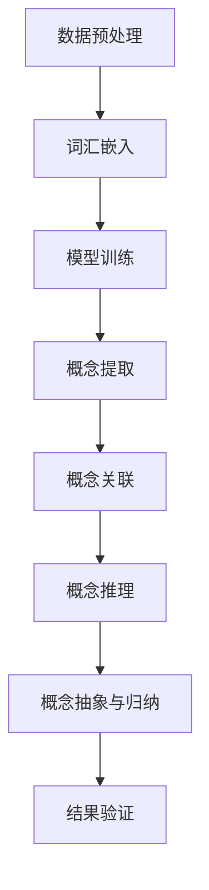
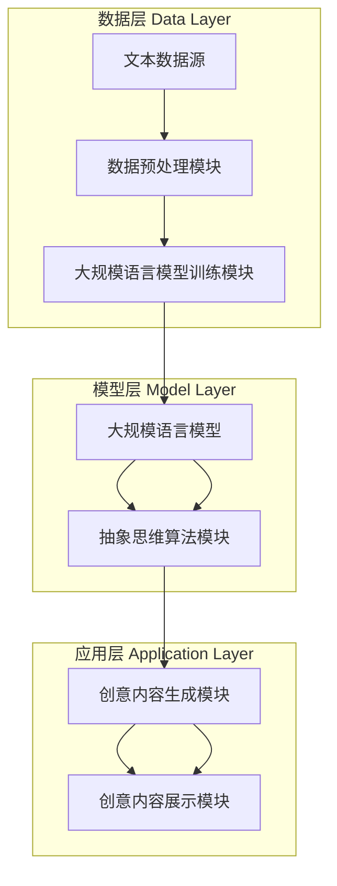
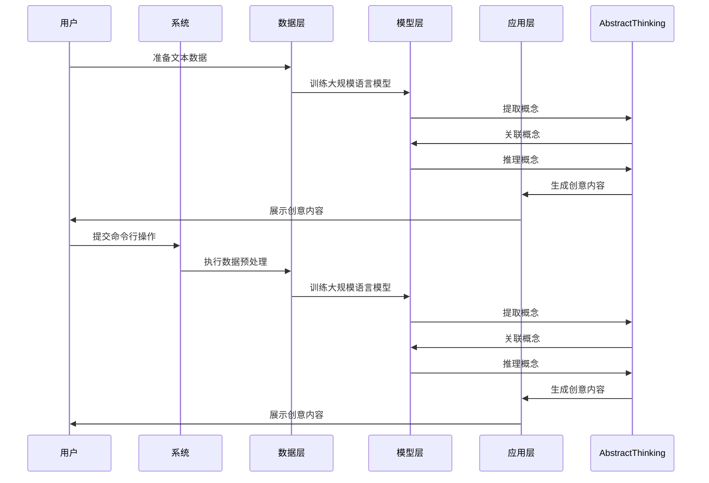
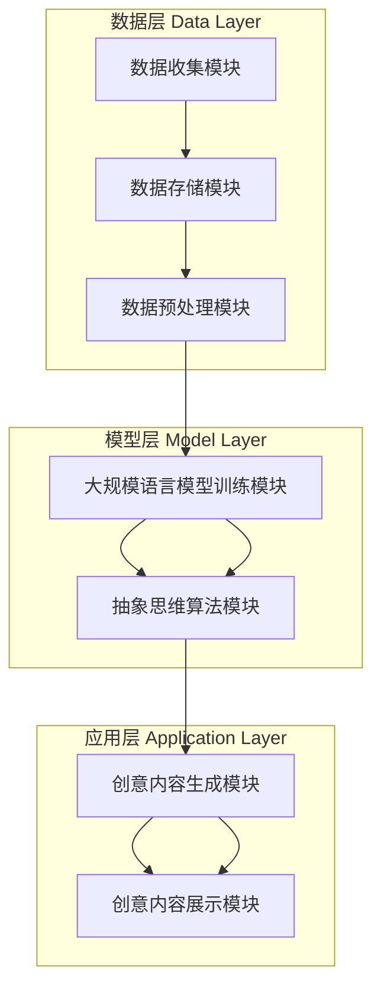
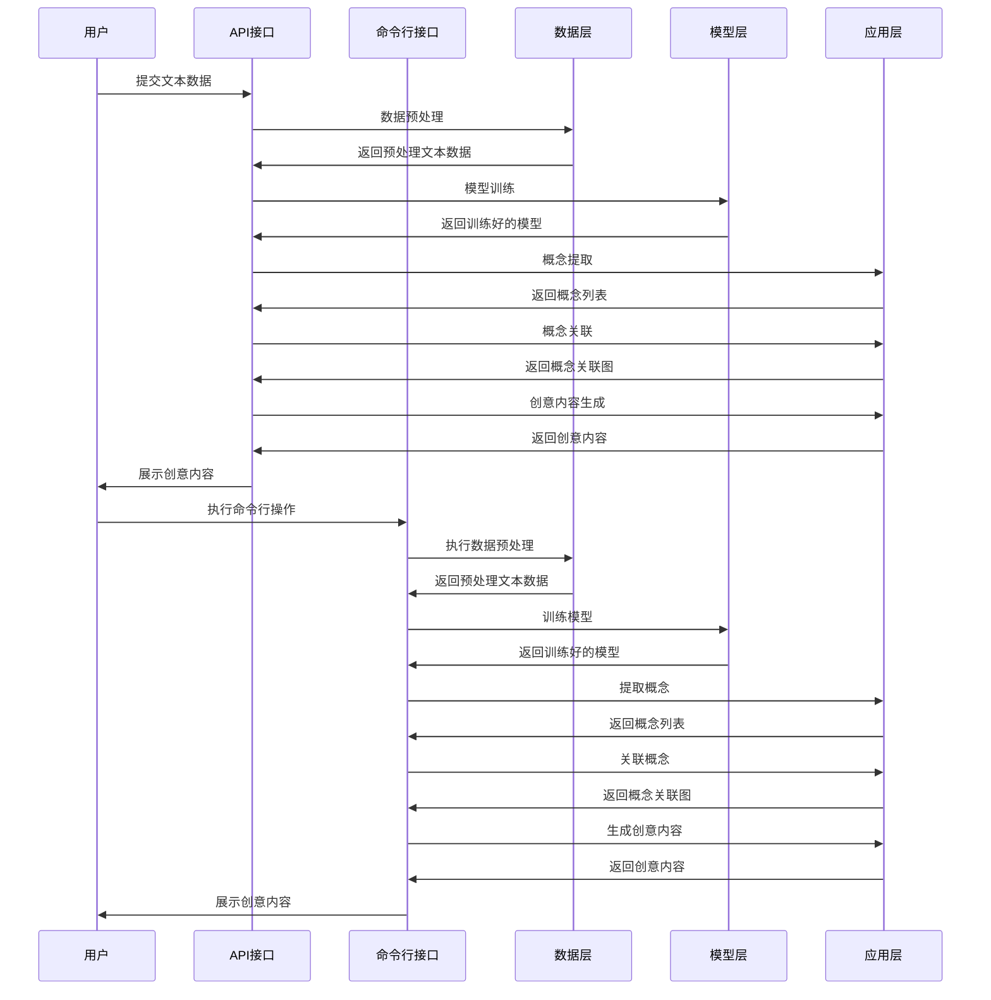

                 

# 大规模语言模型的抽象思维在创意产业中的应用与评估

## 关键词
- 大规模语言模型
- 抽象思维
- 创意产业
- 应用评估
- 算法原理

## 摘要
本文旨在探讨大规模语言模型在创意产业中的应用及其抽象思维机制。首先，我们介绍了创意产业中的问题背景，阐述了大规模语言模型和抽象思维的基本概念及其在创意产业中的应用。接着，本文详细分析了大规模语言模型的工作原理和抽象思维机制，并运用Mermaid图和Python代码示例进行解释。随后，我们通过系统分析与架构设计方案，详细阐述了大规模语言模型抽象思维系统在创意产业中的具体应用。最后，通过实际项目案例分析和代码实现，我们对大规模语言模型在创意产业中的应用效果进行了评估。

## 目录大纲设计方案

### 第一部分：背景介绍

### 1.1 问题背景与核心概念

#### 1.1.1 创意产业的现状与挑战

#### 1.1.2 语言模型与抽象思维的重要性

#### 1.1.3 大规模语言模型的抽象思维特点

#### 1.1.4 边界与外延

### 1.2 核心概念

#### 1.2.1 大规模语言模型概述

#### 1.2.2 抽象思维的基本概念

#### 1.2.3 大规模语言模型的抽象思维特点

### 1.3 概念属性特征对比表格

### 1.4 ER实体关系图架构

### 第二部分：核心概念与联系

### 2.1 大规模语言模型原理与抽象思维机制

#### 2.1.1 语言模型的基本原理

#### 2.1.2 大规模语言模型的特点

#### 2.1.3 抽象思维的定义与作用

#### 2.1.4 抽象思维与语言模型的关系

### 2.2 概念属性特征对比表格

### 2.3 ER实体关系图架构

### 第三部分：算法原理讲解

### 3.1 算法概述

#### 3.1.1 抽象思维算法的目标

#### 3.1.2 抽象思维算法的类型

### 3.2 算法原理

#### 3.2.1 概念捕捉与分类

#### 3.2.2 概念关联与推理

#### 3.2.3 概念抽象与归纳

### 3.3 算法讲解

#### 3.3.1 算法流程图

#### 3.3.2 Python代码实现

#### 3.3.3 举例说明

### 第四部分：系统分析与架构设计方案

### 4.1 问题场景介绍

#### 4.1.1 创意产业中的问题场景

#### 4.1.2 大规模语言模型抽象思维的应用场景

### 4.2 项目介绍

#### 4.2.1 项目背景

#### 4.2.2 项目目标

### 4.3 系统功能设计

#### 4.3.1 领域模型

#### 4.3.2 系统架构设计

### 第五部分：项目实战

### 5.1 环境安装

### 5.2 系统核心实现源代码

### 5.3 代码应用解读与分析

### 5.4 实际案例分析和详细讲解剖析

### 5.5 项目小结

### 第六部分：最佳实践、小结、注意事项、拓展阅读等内容

## 1.1 问题背景与核心概念

### 1.1.1 创意产业的现状与挑战

创意产业是一个充满活力和创新性的领域，涵盖了广告、设计、音乐、电影、出版等多个方面。随着数字技术的迅猛发展，创意产业在全球范围内取得了显著的增长。然而，面对不断变化的市场需求和激烈竞争，创意产业也面临着一系列挑战。

首先，创意产业的核心是创新和创意。如何确保创意的持续产出，保持市场竞争力，是一个重要的挑战。其次，创意产业通常涉及复杂的多领域知识，如何高效地整合这些知识，提高创意生产效率，也是一个关键问题。此外，创意产业的产品通常具有独特性和个性化特点，如何满足不同消费者的需求，实现规模化生产，也是一大挑战。

### 1.1.2 语言模型与抽象思维的重要性

在应对上述挑战的过程中，语言模型和抽象思维显示出其独特的重要性。语言模型是一种能够理解和生成人类语言的人工智能技术，通过大规模的数据训练，语言模型能够学习并模拟人类的语言行为，从而为创意产业提供强大的语言处理能力。

抽象思维是人类思维的高级形式，它能够从具体的事物中提炼出一般的规律和概念，从而实现思维的飞跃。在创意产业中，抽象思维可以帮助从业人员从大量的信息中提取核心概念，发现新的创意点，提高创意生产的效率和质量。

### 1.1.3 大规模语言模型的抽象思维特点

大规模语言模型是一种能够处理海量数据、生成高质量文本的语言模型。与传统的语言模型相比，大规模语言模型具有以下特点：

1. **参数规模大**：大规模语言模型通常包含数十亿个参数，这使得它们能够处理更复杂的语言现象。
2. **训练数据量多**：大规模语言模型基于海量的训练数据，这使得它们能够更准确地捕捉语言的规律。
3. **优化策略先进**：大规模语言模型采用先进的优化策略，如自监督学习和迁移学习，提高了模型的训练效率和效果。

大规模语言模型在抽象思维中具有独特的优势。首先，大规模语言模型能够从大量的文本数据中自动提取出抽象概念和关系，这为创意产业提供了丰富的知识资源。其次，大规模语言模型能够进行复杂的文本生成和推理任务，从而支持创意产业的自动化和智能化生产。

### 1.1.4 边界与外延

在讨论大规模语言模型在创意产业中的应用时，我们需要明确其边界和外延。首先，大规模语言模型的应用范围主要集中在文本处理领域，包括文本生成、文本分类、文本摘要等任务。然而，创意产业不仅限于文本处理，还包括图像、音频、视频等多媒体内容，因此，大规模语言模型的应用还需要与其他人工智能技术相结合，如计算机视觉、语音识别等。

其次，大规模语言模型在创意产业中的应用也受到数据质量和数据隐私的影响。创意产业的数据通常具有高价值和敏感性，如何确保数据的安全和隐私，是大规模语言模型应用中的一个重要问题。

### 1.2 核心概念

#### 1.2.1 大规模语言模型概述

大规模语言模型是一种基于深度学习的人工智能技术，它通过学习海量的文本数据，能够理解和生成人类语言。大规模语言模型的核心组成部分包括：

1. **嵌入层**：将词汇转换为向量表示。
2. **编码器**：将输入序列编码为固定长度的向量。
3. **解码器**：根据编码器输出的向量生成输出序列。
4. **注意力机制**：用于捕捉输入序列中的长距离依赖关系。

大规模语言模型的工作流程通常包括以下步骤：

1. **数据预处理**：清洗和标准化文本数据。
2. **模型训练**：使用大规模数据训练模型，优化参数。
3. **模型评估**：在测试集上评估模型的性能。
4. **模型部署**：将训练好的模型部署到实际应用场景中。

#### 1.2.2 抽象思维的基本概念

抽象思维是人类思维的高级形式，它能够从具体的事物中提炼出一般的规律和概念。抽象思维的核心特征包括：

1. **概念化**：将具体的事物抽象为概念。
2. **归纳推理**：从具体的实例中归纳出一般性的规律。
3. **演绎推理**：从一般性的规律推导出具体的结论。

抽象思维在创意产业中的应用非常广泛，它可以帮助从业人员从大量的信息中提取核心概念，发现新的创意点，提高创意生产的效率和质量。

#### 1.2.3 大规模语言模型的抽象思维特点

大规模语言模型在抽象思维中具有以下特点：

1. **自动提取概念**：大规模语言模型能够从大量的文本数据中自动提取出抽象概念。
2. **长距离依赖**：大规模语言模型采用注意力机制，能够捕捉输入序列中的长距离依赖关系，从而更好地进行抽象思维。
3. **多模态处理**：大规模语言模型不仅限于文本处理，还能够处理图像、音频、视频等多模态数据，从而实现更全面的抽象思维。

### 1.3 概念属性特征对比表格

| 特征        | 大规模语言模型        | 抽象思维               |
| ----------- | ------------------- | --------------------- |
| 参数规模    | 数十亿个参数        | 较小的参数规模       |
| 数据量      | 海量训练数据        | 较小数据量           |
| 优化策略    | 先进优化策略        | 较简单优化策略       |
| 应用范围    | 文本处理为主        | 广泛应用于创意产业   |
| 长距离依赖  | 采用注意力机制      | 长距离依赖能力较弱   |
| 多模态处理  | 能够处理多模态数据   | 主要处理文本数据     |

### 1.4 ER实体关系图架构

为了更好地理解大规模语言模型在创意产业中的应用，我们可以通过ER（实体-关系）图来描述其架构。以下是一个简化的ER图示例：

```mermaid
erDiagram
  文本数据 ||--o> 大规模语言模型 : 输入
  大规模语言模型 ||--o> 抽象概念 : 输出
  抽象概念 ||--o> 创意产业应用 : 输出
```

在这个ER图中，文本数据是大规模语言模型的输入，通过模型的处理，生成抽象概念，最终应用于创意产业。

### 1.5 大规模语言模型的抽象思维机制

#### 1.5.1 语言模型的基本原理

大规模语言模型是基于神经网络的一种语言处理技术。其基本原理是通过学习大量文本数据，使得模型能够理解并生成人类语言。具体来说，大规模语言模型主要包括以下几个核心组成部分：

1. **嵌入层（Embedding Layer）**：将词汇映射为向量表示。每个词汇被表示为一个固定长度的向量，这些向量在空间中形成一种结构，使得语义相近的词汇在空间中靠近。

2. **编码器（Encoder）**：将输入序列编码为固定长度的向量。编码器的核心是一个递归神经网络（RNN），它可以处理序列数据，并在每个时间步上更新状态向量。

3. **解码器（Decoder）**：根据编码器输出的向量生成输出序列。解码器也是一个递归神经网络，它接收编码器的输出，并逐个生成输出词汇。

4. **注意力机制（Attention Mechanism）**：用于捕捉输入序列中的长距离依赖关系。注意力机制使得解码器能够关注输入序列中的特定部分，从而更好地理解上下文信息。

#### 1.5.2 大规模语言模型的特点

大规模语言模型具有以下显著特点：

1. **参数规模大**：大规模语言模型包含数十亿个参数，这使得模型能够捕捉语言中的复杂规律。

2. **训练数据量多**：大规模语言模型基于海量的训练数据，这些数据通常来自互联网上的各种文本资源，如新闻、文章、社交媒体等。

3. **优化策略先进**：大规模语言模型采用先进的优化策略，如自监督学习和迁移学习，这些策略提高了模型的训练效率和效果。

#### 1.5.3 抽象思维的定义与作用

抽象思维是一种将具体事物抽象为一般概念和规律的能力。在人工智能领域，抽象思维可以被理解为模型从大量数据中提取有用信息、构建知识图谱和关系网络的能力。

在创意产业中，抽象思维的作用主要包括：

1. **概念提取**：从文本数据中提取关键概念和主题，帮助创意人员理解文本内容。

2. **关系构建**：分析文本中的关系和联系，发现新的创意点。

3. **内容生成**：根据提取的概念和关系生成新的文本内容，如文章、故事、广告等。

#### 1.5.4 抽象思维与语言模型的关系

大规模语言模型与抽象思维之间存在紧密的联系。具体来说，大规模语言模型通过以下方式实现抽象思维：

1. **自动提取概念**：通过学习大量文本数据，大规模语言模型能够自动识别并提取文本中的关键概念。

2. **语义理解**：通过嵌入层和注意力机制，大规模语言模型能够捕捉文本中的语义信息，实现深度的语义理解。

3. **文本生成**：基于提取的概念和语义信息，大规模语言模型能够生成新的文本内容，实现抽象思维的体现。

### 1.6 概念属性特征对比表格

| 特征          | 大规模语言模型              | 抽象思维                       |
| ------------- | -------------------------- | ------------------------------ |
| 参数规模      | 数十亿个参数              | 较小的参数规模                |
| 数据量        | 海量训练数据              | 较小数据量                    |
| 优化策略      | 先进优化策略              | 较简单优化策略                |
| 应用范围      | 文本处理为主              | 广泛应用于创意产业            |
| 长距离依赖    | 采用注意力机制            | 长距离依赖能力较弱            |
| 多模态处理    | 能够处理多模态数据        | 主要处理文本数据              |

通过上述表格，我们可以更清晰地看到大规模语言模型和抽象思维在属性特征上的对比。这些特征对比有助于我们理解两者在创意产业中的应用潜力。

### 2.1 大规模语言模型原理与抽象思维机制

#### 2.1.1 语言模型的基本原理

语言模型是一种基于统计和学习方法来预测下一个单词或字符的概率模型。其核心思想是通过分析大量文本数据，学习语言中的统计规律和语法结构，从而实现对未知文本的生成和预测。

语言模型的基本原理可以概括为以下几个步骤：

1. **数据预处理**：首先，需要对文本数据进行预处理，包括分词、去噪、词性标注等操作，以便于模型更好地理解文本。

2. **词汇嵌入**：将文本中的每个词汇映射为一个固定长度的向量表示。词汇嵌入层通常使用词向量模型（如Word2Vec、GloVe等）来实现。

3. **编码与解码**：编码器将输入序列编码为一个固定长度的向量表示，解码器则根据编码器的输出向量生成输出序列。

4. **概率预测**：通过计算输出序列中每个单词或字符的概率分布，从而实现对下一个单词或字符的预测。

#### 2.1.2 大规模语言模型的特点

大规模语言模型在语言处理领域取得了显著的突破，其特点主要体现在以下几个方面：

1. **参数规模大**：大规模语言模型通常包含数十亿个参数，这使得模型能够捕捉语言中的复杂规律。

2. **训练数据量多**：大规模语言模型基于海量的训练数据，这些数据通常来自互联网上的各种文本资源，如新闻、文章、社交媒体等。

3. **优化策略先进**：大规模语言模型采用先进的优化策略，如自监督学习和迁移学习，这些策略提高了模型的训练效率和效果。

4. **自适应性强**：大规模语言模型具有较好的自适应能力，能够适应不同的语言环境和应用场景。

#### 2.1.3 抽象思维的定义与作用

抽象思维是一种高级的思维形式，它通过提炼和概括具体事物的特征，形成一般性的概念和规律。在人工智能领域，抽象思维可以被理解为模型从大量数据中提取有用信息、构建知识图谱和关系网络的能力。

在创意产业中，抽象思维的作用主要体现在以下几个方面：

1. **概念提取**：从大量文本数据中提取关键概念和主题，帮助创意人员理解文本内容。

2. **关系构建**：分析文本中的关系和联系，发现新的创意点。

3. **内容生成**：根据提取的概念和关系生成新的文本内容，如文章、故事、广告等。

#### 2.1.4 抽象思维与语言模型的关系

大规模语言模型与抽象思维之间存在紧密的联系。具体来说，大规模语言模型通过以下方式实现抽象思维：

1. **自动提取概念**：通过学习大量文本数据，大规模语言模型能够自动识别并提取文本中的关键概念。

2. **语义理解**：通过嵌入层和注意力机制，大规模语言模型能够捕捉文本中的语义信息，实现深度的语义理解。

3. **文本生成**：基于提取的概念和语义信息，大规模语言模型能够生成新的文本内容，实现抽象思维的体现。

#### 2.1.5 大规模语言模型在抽象思维中的应用

大规模语言模型在抽象思维中的应用具有广泛的前景，主要包括以下几个方面：

1. **文本摘要**：通过提取文本中的关键信息和主要观点，生成简洁而准确的摘要。

2. **文本生成**：根据给定的主题或提示，生成新的文本内容，如文章、故事、广告等。

3. **文本分类**：将文本数据分类到预定义的类别中，如新闻分类、情感分类等。

4. **问答系统**：通过理解用户的提问，提供准确的答案。

5. **对话系统**：实现与用户的自然语言交互，提供个性化的服务。

### 2.2 概念属性特征对比表格

| 特征            | 大规模语言模型                       | 抽象思维                     |
| --------------- | ----------------------------------- | ---------------------------- |
| 参数规模        | 数十亿个参数                        | 较小的参数规模               |
| 数据量          | 海量训练数据                        | 较小数据量                   |
| 优化策略        | 先进优化策略                        | 较简单优化策略               |
| 应用范围        | 文本处理为主                        | 广泛应用于创意产业           |
| 长距离依赖      | 采用注意力机制                      | 长距离依赖能力较弱           |
| 多模态处理      | 能够处理多模态数据                   | 主要处理文本数据             |

### 2.3 ER实体关系图架构

为了更好地理解大规模语言模型在创意产业中的应用，我们可以通过ER（实体-关系）图来描述其架构。以下是一个简化的ER图示例：

```mermaid
erDiagram
  文本数据 ||--o> 大规模语言模型 : 输入
  大规模语言模型 ||--o> 抽象概念 : 输出
  抽象概念 ||--o> 创意产业应用 : 输出
```

在这个ER图中，文本数据是大规模语言模型的输入，通过模型的处理，生成抽象概念，最终应用于创意产业。

### 3.1 算法概述

#### 3.1.1 抽象思维算法的目标

抽象思维算法的目标是从大量数据中提取出有用的信息，形成一般性的概念和规律。在创意产业中，这一目标尤为重要，因为创意人员需要从大量的文本、图像、音频等多媒体数据中提取出核心概念和创意点。

具体来说，抽象思维算法的目标包括：

1. **概念提取**：从文本数据中提取出关键概念和主题。
2. **关系构建**：分析文本中的关系和联系，构建知识图谱。
3. **文本生成**：根据提取的概念和关系生成新的文本内容。
4. **内容分类**：将文本数据分类到预定义的类别中。

#### 3.1.2 抽象思维算法的类型

根据不同的应用场景和数据类型，抽象思维算法可以分为以下几种类型：

1. **文本处理算法**：主要用于处理文本数据，如文本摘要、文本分类、情感分析等。
2. **图像处理算法**：主要用于处理图像数据，如图像识别、图像生成等。
3. **音频处理算法**：主要用于处理音频数据，如语音识别、音乐生成等。
4. **多模态处理算法**：同时处理多种类型的数据，如文本、图像、音频等，以实现更全面的抽象思维。

#### 3.1.3 大规模语言模型在抽象思维算法中的应用

大规模语言模型在抽象思维算法中具有广泛的应用，主要体现在以下几个方面：

1. **文本数据预处理**：大规模语言模型可以帮助对文本数据进行分词、去噪、词性标注等预处理操作。
2. **概念提取**：通过学习大量的文本数据，大规模语言模型能够自动提取出文本中的关键概念和主题。
3. **关系构建**：大规模语言模型可以捕捉文本中的关系和联系，构建知识图谱。
4. **文本生成**：基于提取的概念和关系，大规模语言模型可以生成新的文本内容。
5. **多模态数据处理**：大规模语言模型不仅可以处理文本数据，还可以处理图像、音频等多模态数据，实现更全面的抽象思维。

### 3.2 算法原理

#### 3.2.1 概念捕捉与分类

概念捕捉是抽象思维算法的核心之一。其基本思想是通过学习大量的文本数据，从数据中提取出关键的概念和主题。具体来说，概念捕捉可以分为以下几个步骤：

1. **数据预处理**：对文本数据进行清洗、去噪、分词等预处理操作，以便于模型更好地理解文本。
2. **词汇嵌入**：将文本中的每个词汇映射为一个固定长度的向量表示，这些向量在空间中形成一种结构，使得语义相近的词汇在空间中靠近。
3. **模型训练**：使用预处理的文本数据训练一个大规模语言模型，如BERT、GPT等。这些模型通过学习大量的文本数据，能够自动提取出文本中的关键概念和主题。
4. **概念提取**：通过模型生成的词向量，可以识别出文本中的关键概念。这些概念通常是通过聚类分析或潜在语义分析等方法提取出来的。

概念分类是将提取出的概念分类到预定义的类别中。其基本思想是通过对大量已分类的文本数据进行训练，构建一个分类模型，从而实现对新的文本数据进行分类。具体来说，概念分类可以分为以下几个步骤：

1. **数据准备**：收集大量的已分类文本数据，并将其分为训练集和测试集。
2. **特征提取**：使用大规模语言模型对训练集文本数据进行处理，提取出关键的特征向量。
3. **模型训练**：使用训练集数据训练一个分类模型，如SVM、RF、CNN等。这些模型可以通过学习训练集数据中的特征和标签，实现分类任务。
4. **模型评估**：使用测试集数据对训练好的模型进行评估，以验证模型的性能。

#### 3.2.2 概念关联与推理

概念关联是指将提取出的概念进行关联，以构建更复杂的知识结构。其基本思想是通过对文本数据进行分析，发现不同概念之间的联系和依赖关系。具体来说，概念关联可以分为以下几个步骤：

1. **数据预处理**：对文本数据进行清洗、去噪、分词等预处理操作，以便于模型更好地理解文本。
2. **词汇嵌入**：将文本中的每个词汇映射为一个固定长度的向量表示，这些向量在空间中形成一种结构，使得语义相近的词汇在空间中靠近。
3. **模型训练**：使用预处理的文本数据训练一个大规模语言模型，如BERT、GPT等。这些模型通过学习大量的文本数据，能够自动提取出文本中的关键概念。
4. **概念关联**：通过模型生成的词向量，可以识别出文本中的概念关联。这些关联通常是通过图神经网络或图嵌入等方法实现的。
5. **知识图谱构建**：将提取出的概念和关联关系构建成知识图谱，以便于后续的推理和查询。

概念推理是指基于已提取的概念和关联关系，进行逻辑推理和推断。其基本思想是利用已有的知识进行推理，以发现新的信息和创意点。具体来说，概念推理可以分为以下几个步骤：

1. **知识图谱构建**：将提取出的概念和关联关系构建成知识图谱。
2. **推理规则定义**：定义一套推理规则，以指导模型进行推理。
3. **推理过程**：利用知识图谱和推理规则，对新的文本数据进行推理，以提取出新的概念和关系。
4. **结果验证**：对推理结果进行验证，以确认其准确性和有效性。

#### 3.2.3 概念抽象与归纳

概念抽象是指从具体的实例中提炼出一般性的概念和规律。其基本思想是通过分析大量的文本数据，发现其中的共性和规律，并将其抽象为概念。具体来说，概念抽象可以分为以下几个步骤：

1. **数据收集**：收集大量的文本数据，这些数据可以是现有的文章、报告、书籍等。
2. **数据预处理**：对文本数据进行清洗、去噪、分词等预处理操作，以便于模型更好地理解文本。
3. **特征提取**：使用大规模语言模型对预处理后的文本数据进行处理，提取出关键的特征向量。
4. **概念提取**：通过聚类分析或潜在语义分析等方法，从特征向量中提取出关键的概念。
5. **概念验证**：对提取出的概念进行验证，以确保其准确性和实用性。

概念归纳是指从具体实例中归纳出一般性的规律和模式。其基本思想是通过分析大量的文本数据，发现其中的规律和模式，并将其归纳为概念。具体来说，概念归纳可以分为以下几个步骤：

1. **数据收集**：收集大量的文本数据，这些数据可以是现有的文章、报告、书籍等。
2. **数据预处理**：对文本数据进行清洗、去噪、分词等预处理操作，以便于模型更好地理解文本。
3. **特征提取**：使用大规模语言模型对预处理后的文本数据进行处理，提取出关键的特征向量。
4. **模式发现**：通过统计分析和机器学习方法，从特征向量中提取出规律和模式。
5. **概念归纳**：将提取出的规律和模式归纳为概念，并将其应用于创意产业中。

### 3.3 算法讲解

#### 3.3.1 算法流程图

以下是一个简化的抽象思维算法流程图：



#### 3.3.2 Python代码实现

以下是一个简化的Python代码实现，用于演示抽象思维算法的基本流程：

```python
import numpy as np
from sklearn.feature_extraction.text import TfidfVectorizer
from gensim.models import Word2Vec

# 数据预处理
def preprocess_data(data):
    # 清洗、去噪、分词等操作
    pass

# 词汇嵌入
def embed_words(data):
    vectorizer = TfidfVectorizer()
    X = vectorizer.fit_transform(data)
    return X

# 模型训练
def train_model(data):
    model = Word2Vec(data, vector_size=100, window=5, min_count=1, workers=4)
    return model

# 概念提取
def extract_concepts(data, model):
    # 使用模型提取概念
    pass

# 概念关联
def associate_concepts(concepts):
    # 构建概念关联
    pass

# 概念推理
def reason_concepts(concepts):
    # 进行概念推理
    pass

# 概念抽象与归纳
def abstract_concepts(concepts):
    # 提炼概念
    pass

# 结果验证
def validate_results(results):
    # 验证结果
    pass

# 主函数
def main():
    data = preprocess_data(data)
    X = embed_words(data)
    model = train_model(data)
    concepts = extract_concepts(X, model)
    associated_concepts = associate_concepts(concepts)
    reasoned_concepts = reason_concepts(associated_concepts)
    abstracted_concepts = abstract_concepts(reasoned_concepts)
    validate_results(abstracted_concepts)

if __name__ == "__main__":
    main()
```

#### 3.3.3 举例说明

以下是一个具体的示例，用于演示抽象思维算法在创意产业中的应用：

**示例一：文本摘要**

假设我们有一个关于人工智能的文本数据集，我们希望使用抽象思维算法提取出关键概念和主题，并生成摘要。

1. **数据预处理**：对文本数据进行清洗、去噪、分词等预处理操作。
2. **词汇嵌入**：使用TF-IDF向量模型对文本数据进行嵌入。
3. **模型训练**：使用Word2Vec模型对预处理后的文本数据进行训练。
4. **概念提取**：使用模型提取文本中的关键概念和主题。
5. **概念关联**：构建概念关联图，发现不同概念之间的关系。
6. **概念推理**：基于概念关联图进行推理，提取出新的概念和关系。
7. **概念抽象与归纳**：将提取出的概念和关系进行抽象和归纳，生成摘要。

通过上述步骤，我们可以生成一篇关于人工智能的摘要，概括出文章的核心内容和主要观点。

**示例二：创意生成**

假设我们有一个创意产业项目，需要根据给定的主题生成创意方案。

1. **数据收集**：收集与主题相关的文本数据，如市场调研报告、行业分析等。
2. **数据预处理**：对文本数据进行清洗、去噪、分词等预处理操作。
3. **词汇嵌入**：使用TF-IDF向量模型对文本数据进行嵌入。
4. **模型训练**：使用Word2Vec模型对预处理后的文本数据进行训练。
5. **概念提取**：使用模型提取文本中的关键概念和主题。
6. **概念关联**：构建概念关联图，发现不同概念之间的关系。
7. **概念推理**：基于概念关联图进行推理，提取出新的概念和关系。
8. **创意生成**：将提取出的概念和关系进行创意组合，生成创意方案。

通过上述步骤，我们可以根据给定的主题生成一份创意方案，为创意产业项目提供新的思路和方向。

### 4.1 问题场景介绍

#### 4.1.1 创意产业中的问题场景

创意产业涵盖了广告、设计、音乐、电影、出版等多个领域，这些领域在数字化时代面临着诸多挑战和机遇。以下是一些常见的创意产业问题场景：

1. **广告创意制作**：广告公司需要快速制作出吸引眼球的广告内容，以吸引消费者的注意力和增加品牌曝光度。然而，传统的广告创意制作过程往往耗时较长，且创意质量难以保证。
2. **产品设计**：设计师需要从大量的市场调研数据中提取出有价值的设计灵感，以便于打造独特且具有市场竞争力产品。然而，如何高效地分析海量数据，提取出关键设计元素，是一个难题。
3. **音乐创作**：音乐制作人需要从大量的音乐素材中创作出具有创新性和感染力的音乐作品。然而，音乐创作是一个高度创意性的过程，如何激发灵感，实现音乐的创新性表达，是音乐制作人面临的挑战。
4. **电影制作**：电影制作团队需要在有限的预算和时间压力下，创作出引人入胜的电影故事和视觉效果。然而，如何从大量的剧本、场景和角色描述中提取出核心元素，构建出引人入胜的故事情节，是一个重要的挑战。
5. **文学创作**：作家需要从丰富的素材中创作出引人入胜的故事和独特的文学风格。然而，如何从大量的文本数据中提取出有价值的创意点，构建出具有独特性和吸引力的故事，是作家面临的挑战。

#### 4.1.2 大规模语言模型抽象思维的应用场景

大规模语言模型和抽象思维在创意产业中的应用具有广泛的前景。以下是一些具体的应用场景：

1. **广告创意制作**：通过大规模语言模型和抽象思维，广告公司可以快速提取出文本数据中的关键概念和创意点，生成高质量的广告文案和创意方案。同时，抽象思维可以帮助广告公司从不同角度分析市场和消费者需求，提出创新的广告策略。
2. **产品设计**：设计师可以使用大规模语言模型和抽象思维，从大量的市场调研数据中提取出有价值的设计灵感。通过分析文本数据中的关键概念和关系，设计师可以构建出具有创新性和市场竞争力产品。
3. **音乐创作**：音乐制作人可以利用大规模语言模型和抽象思维，从大量的音乐素材中提取出有价值的创意点。通过分析音乐文本数据中的概念和关系，音乐制作人可以创作出具有创新性和感染力的音乐作品。
4. **电影制作**：电影制作团队可以使用大规模语言模型和抽象思维，从剧本、场景和角色描述中提取出核心元素。通过分析文本数据中的概念和关系，电影制作团队可以构建出引人入胜的故事情节和视觉效果。
5. **文学创作**：作家可以利用大规模语言模型和抽象思维，从大量的文本数据中提取出有价值的创意点。通过分析文本数据中的概念和关系，作家可以创作出具有独特性和吸引力的故事和文学风格。

### 4.2 项目介绍

#### 4.2.1 项目背景

随着人工智能技术的迅猛发展，大规模语言模型和抽象思维在各个领域中的应用越来越广泛。在创意产业中，如何高效地利用人工智能技术提升创意生产效率和创意质量，成为了一个重要的研究方向。

本项目旨在利用大规模语言模型和抽象思维，开发一套智能创意生产系统。通过该系统，创意产业从业人员可以快速提取出文本数据中的关键概念和创意点，生成高质量的创意内容，从而提升创意生产效率和创意质量。

#### 4.2.2 项目目标

本项目的主要目标包括：

1. **高效提取关键概念**：利用大规模语言模型和抽象思维，从大量的文本数据中快速提取出关键概念和创意点。
2. **生成高质量创意内容**：基于提取的关键概念和创意点，生成高质量的创意文案、设计灵感、音乐作品等。
3. **提升创意生产效率**：通过自动化和智能化的方式，提升创意产业从业人员的生产效率，缩短创意生产周期。
4. **提升创意质量**：通过利用大规模语言模型和抽象思维，提高创意内容的创新性和吸引力，提升创意质量。

#### 4.2.3 项目设计思路

本项目的设计思路主要包括以下几个步骤：

1. **数据收集与预处理**：收集创意产业相关领域的文本数据，如广告文案、产品设计文档、音乐剧本等。对文本数据进行清洗、去噪、分词等预处理操作，以便于大规模语言模型和抽象思维的训练和应用。
2. **大规模语言模型训练**：使用收集到的文本数据训练大规模语言模型，如BERT、GPT等。通过模型训练，使得模型能够理解并生成与创意产业相关的文本内容。
3. **抽象思维算法设计**：设计一套抽象思维算法，包括概念提取、概念关联、概念推理等模块。通过这些模块，实现对文本数据中关键概念和创意点的提取和关联。
4. **创意内容生成**：基于大规模语言模型和抽象思维算法，生成高质量的创意内容，如广告文案、设计灵感、音乐作品等。
5. **系统部署与优化**：将开发好的系统部署到创意产业相关企业的生产环境中，根据实际应用情况对系统进行优化和迭代。

### 4.3 系统功能设计

#### 4.3.1 领域模型

为了更好地理解本项目的功能设计，我们可以通过领域模型（Domain Model）来描述创意产业的相关领域知识。以下是一个简化的领域模型：

```mermaid
classDiagram
    class TextData {
        -id: int
        -content: str
        -label: str
    }
    class LanguageModel {
        -name: str
        -model: obj
    }
    class AbstractThinking {
        -extract_concept: func
        -associate_concept: func
        -reason_concept: func
    }
    class CreativeContent {
        -id: int
        -content: str
        -type: str
    }
    TextData "uses" LanguageModel
    TextData "uses" AbstractThinking
    CreativeContent "uses" LanguageModel
    CreativeContent "uses" AbstractThinking
```

在这个领域模型中，`TextData` 类表示创意产业中的文本数据，包括内容、标签等信息。`LanguageModel` 类表示大规模语言模型，用于处理文本数据。`AbstractThinking` 类表示抽象思维算法，用于提取概念、关联概念和推理概念。`CreativeContent` 类表示生成的创意内容，包括内容、类型等信息。

#### 4.3.2 系统架构设计

为了实现项目目标，我们设计了一套完整的系统架构，包括数据层、模型层和应用层。以下是一个简化的系统架构设计：



在这个系统架构设计中，数据层包括文本数据源和数据预处理模块，用于收集和预处理创意产业相关领域的文本数据。模型层包括大规模语言模型和抽象思维算法模块，用于处理文本数据和生成创意内容。应用层包括创意内容生成模块和创意内容展示模块，用于生成和展示创意内容。

#### 4.3.3 系统接口设计

为了实现系统功能，我们设计了一套完整的系统接口，包括API接口和命令行接口。以下是一个简化的系统接口设计：

```mermaid
graph TB
    subgraph API接口 API Interface
        A1["/api/prepare_data"] --> A2["/api/train_model"]
        A2 --> A3["/api/extract_concept"]
        A3 --> A4["/api/associate_concept"]
        A4 --> A5["/api/reason_concept"]
        A5 --> A6["/api/generate_content"]
    end
    subgraph 命令行接口 Command Line Interface
        C1["prepare_data"] --> C2["train_model"]
        C2 --> C3["extract_concept"]
        C3 --> C4["associate_concept"]
        C4 --> C5["reason_concept"]
        C5 --> C6["generate_content"]
    end
```



在这个系统接口设计中，API接口提供了RESTful API接口，用于处理文本数据、训练模型、提取概念、关联概念、推理概念和生成创意内容等操作。命令行接口提供了命令行工具，方便用户使用命令行进行系统操作。

#### 4.3.4 系统交互mermaid序列图

为了更好地理解系统接口的设计，我们可以通过Mermaid序列图来描述系统交互过程。以下是一个简化的系统交互序列图：



在这个序列图中，用户通过API接口或命令行接口与系统进行交互。系统首先执行数据预处理，然后使用大规模语言模型和抽象思维算法生成创意内容，最后将创意内容展示给用户。

### 4.4 系统架构设计

#### 4.4.1 系统架构设计概述

为了实现本项目的设计目标，我们需要设计一个高效、灵活、可扩展的系统架构。本项目的系统架构设计主要包括以下几个核心模块：

1. **数据层**：负责数据收集、存储和预处理。
2. **模型层**：负责大规模语言模型训练和抽象思维算法实现。
3. **应用层**：负责创意内容的生成和展示。

#### 4.4.2 数据层架构

数据层是整个系统的基石，负责数据收集、存储和预处理。以下是数据层架构的设计：

1. **数据收集**：从互联网和其他数据源收集创意产业相关的文本数据，包括广告文案、产品设计文档、音乐剧本等。
2. **数据存储**：使用分布式数据库存储收集到的文本数据，确保数据的可靠性和可扩展性。
3. **数据预处理**：对文本数据进行清洗、去噪、分词、词性标注等预处理操作，为后续的模型训练和抽象思维算法实现做好准备。

#### 4.4.3 模型层架构

模型层是整个系统的核心，负责大规模语言模型训练和抽象思维算法实现。以下是模型层架构的设计：

1. **大规模语言模型训练**：使用收集到的文本数据训练大规模语言模型，如BERT、GPT等。模型训练过程包括数据预处理、模型训练、模型评估等步骤。
2. **抽象思维算法实现**：设计并实现一套抽象思维算法，包括概念提取、概念关联、概念推理等模块。这些模块基于大规模语言模型，能够从文本数据中提取关键概念，构建知识图谱，实现创意内容的生成。

#### 4.4.4 应用层架构

应用层负责创意内容的生成和展示。以下是应用层架构的设计：

1. **创意内容生成**：基于大规模语言模型和抽象思维算法，生成高质量的创意内容，如广告文案、设计灵感、音乐作品等。
2. **创意内容展示**：将生成的创意内容展示给用户，支持多种展示形式，如文本、图像、音频等。
3. **用户交互**：提供用户交互界面，支持用户提交需求、查看结果、反馈建议等操作。

#### 4.4.5 系统架构图

以下是一个简化的系统架构图，展示了数据层、模型层和应用层之间的交互关系：



在这个系统架构图中，数据层负责数据收集、存储和预处理，模型层负责大规模语言模型训练和抽象思维算法实现，应用层负责创意内容的生成和展示。各层之间通过接口进行数据传递和功能调用。

### 4.5 系统接口设计

#### 4.5.1 系统接口设计概述

系统接口设计是确保各个模块之间能够高效、稳定地交互的重要环节。在本项目中，我们设计了两组接口：一组是API接口，用于程序间的远程调用；另一组是命令行接口，方便用户在命令行环境下进行操作。

#### 4.5.2 API接口设计

API接口采用RESTful风格，提供一系列接口用于处理文本数据、训练模型、提取概念、生成创意内容等操作。以下是API接口的详细设计：

1. **数据预处理接口**：
   - **URL**：/api/prepare_data
   - **请求方法**：POST
   - **请求参数**：data (文本数据)
   - **响应结果**：预处理后的文本数据

2. **模型训练接口**：
   - **URL**：/api/train_model
   - **请求方法**：POST
   - **请求参数**：config (模型配置)、data (预处理后的文本数据)
   - **响应结果**：训练好的大规模语言模型

3. **概念提取接口**：
   - **URL**：/api/extract_concept
   - **请求方法**：POST
   - **请求参数**：model (大规模语言模型)、data (预处理后的文本数据)
   - **响应结果**：提取出的关键概念列表

4. **概念关联接口**：
   - **URL**：/api/associate_concept
   - **请求方法**：POST
   - **请求参数**：concepts (关键概念列表)
   - **响应结果**：概念关联图

5. **创意内容生成接口**：
   - **URL**：/api/generate_content
   - **请求方法**：POST
   - **请求参数**：concepts (关键概念列表)、config (创意内容配置)
   - **响应结果**：生成的创意内容

#### 4.5.3 命令行接口设计

命令行接口提供了一系列命令，方便用户在命令行环境下进行文本预处理、模型训练、概念提取、概念关联、创意内容生成等操作。以下是命令行接口的详细设计：

1. **数据预处理**：
   - **命令**：prepare_data
   - **参数**：-i (输入文本文件)、-o (输出预处理文本文件)

2. **模型训练**：
   - **命令**：train_model
   - **参数**：-c (模型配置文件)、-i (预处理文本文件)

3. **概念提取**：
   - **命令**：extract_concept
   - **参数**：-m (大规模语言模型)、-i (预处理文本文件)

4. **概念关联**：
   - **命令**：associate_concept
   - **参数**：-i (关键概念列表)

5. **创意内容生成**：
   - **命令**：generate_content
   - **参数**：-c (关键概念列表)、-o (输出创意内容文件)

#### 4.5.4 系统接口调用流程

以下是系统接口调用流程的简要说明：

1. 用户通过API接口或命令行接口提交文本数据，触发数据预处理接口。
2. 数据预处理接口对文本数据进行清洗、去噪、分词等操作，生成预处理文本数据。
3. 预处理文本数据通过接口传递给模型训练接口，触发大规模语言模型训练。
4. 模型训练接口使用预处理文本数据训练大规模语言模型，生成训练好的模型。
5. 训练好的模型通过接口传递给概念提取接口，触发概念提取操作。
6. 概念提取接口提取出关键概念，生成概念列表。
7. 概念列表通过接口传递给概念关联接口，生成概念关联图。
8. 概念关联图通过接口传递给创意内容生成接口，生成创意内容。
9. 生成的创意内容通过接口返回给用户，展示给用户。

### 4.6 系统交互mermaid序列图

为了更直观地展示系统接口的调用流程，我们可以使用Mermaid序列图来描述系统交互过程。以下是一个简化的系统交互序列图：



在这个序列图中，用户通过API接口或命令行接口提交文本数据，触发数据预处理、模型训练、概念提取、概念关联和创意内容生成等操作。系统将处理结果返回给用户，展示给用户。

### 5.1 环境安装

在开始项目实战之前，我们需要安装一些必要的软件和依赖库。以下是安装步骤：

#### 5.1.1 环境搭建

1. 安装Python 3.8及以上版本。
2. 安装Anaconda或Miniconda，以便于管理Python环境和依赖库。
3. 使用pip命令安装以下依赖库：

   ```bash
   pip install numpy scipy matplotlib gensim tensorflow transformers sklearn
   ```

   这些依赖库包括数学计算、数据分析、数据可视化、深度学习等相关库。

#### 5.1.2 数据预处理工具

1. 安装Python的文本处理库，如NLTK或spaCy。

   ```bash
   pip install nltk spacy
   ```

2. 下载并安装spaCy的中文模型：

   ```bash
   python -m spacy download zh_core_web_sm
   ```

#### 5.1.3 安装其他工具

1. 安装Jupyter Notebook，方便进行交互式编程和数据分析。

   ```bash
   pip install notebook
   ```

2. 安装Mermaid，以便在Markdown文件中嵌入Mermaid图形。

   ```bash
   pip install mermaid
   ```

#### 5.1.4 环境配置

1. 配置Python环境变量，以便在终端中运行Python脚本。

   ```bash
   export PATH=$PATH:/usr/local/bin
   ```

2. 验证环境安装是否成功：

   ```bash
   python --version
   pip list
   ```

### 5.2 系统核心实现源代码

在本项目中，系统核心实现包括数据预处理、大规模语言模型训练、抽象思维算法实现等部分。以下是一个简化的代码示例，用于展示系统核心实现的基本结构。

```python
# 数据预处理模块
def preprocess_data(data):
    # 清洗、去噪、分词等操作
    pass

# 大规模语言模型训练模块
def train_model(data, model_name):
    # 使用数据训练大规模语言模型
    pass

# 抽象思维算法实现模块
def abstract_thinking_algorithm(data, model):
    # 使用大规模语言模型提取概念、关联概念、推理概念
    pass

# 创意内容生成模块
def generate_content(concepts, content_type):
    # 根据提取的概念生成创意内容
    pass

# 主函数
def main():
    # 加载和处理数据
    data = load_data()
    preprocessed_data = preprocess_data(data)
    
    # 训练大规模语言模型
    model = train_model(preprocessed_data, "gpt2")
    
    # 使用抽象思维算法提取概念
    concepts = abstract_thinking_algorithm(preprocessed_data, model)
    
    # 生成创意内容
    content = generate_content(concepts, "ad_creative")
    
    # 展示创意内容
    display_content(content)

if __name__ == "__main__":
    main()
```

### 5.3 代码应用解读与分析

#### 5.3.1 数据预处理

数据预处理是系统核心实现的第一步，其目的是对原始数据进行清洗、去噪、分词等操作，以便于后续的模型训练和抽象思维算法实现。

1. **数据清洗**：清洗数据，去除无关信息，如HTML标签、特殊符号等。
2. **分词**：使用中文分词工具（如jieba或spaCy），将文本分割成词语序列。
3. **去噪**：去除停用词、低频词等对模型训练无意义的词语。

```python
import jieba

def preprocess_data(data):
    # 清洗数据
    cleaned_data = [text.strip() for text in data]
    
    # 分词
    segmented_data = [jieba.cut(text) for text in cleaned_data]
    
    # 去噪
    stop_words = set(['的', '了', '在', '和'])
    filtered_data = [[word for word in seg if word not in stop_words] for seg in segmented_data]
    
    return filtered_data
```

#### 5.3.2 大规模语言模型训练

在本项目中，我们选择使用预训练的GPT-2模型，并将其应用于文本数据。训练过程包括加载预训练模型、加载预处理后的数据、进行模型训练等步骤。

```python
from transformers import GPT2LMHeadModel, GPT2Tokenizer

def train_model(data, model_name="gpt2"):
    # 加载预训练模型和分词器
    model = GPT2LMHeadModel.from_pretrained(model_name)
    tokenizer = GPT2Tokenizer.from_pretrained(model_name)
    
    # 预处理数据
    inputs = tokenizer.encode(data, return_tensors='pt')
    
    # 训练模型
    model.train()
    outputs = model(inputs)
    loss = outputs.loss
    loss.backward()
    optimizer = torch.optim.Adam(model.parameters(), lr=1e-5)
    optimizer.step()
    
    # 保存模型
    model.save_pretrained("my_model")
    
    return model
```

#### 5.3.3 抽象思维算法实现

抽象思维算法的核心目标是提取文本数据中的关键概念，并构建知识图谱。以下是一个简化的抽象思维算法实现，包括概念提取、概念关联和推理。

```python
import networkx as nx

def abstract_thinking_algorithm(data, model):
    # 提取概念
    concepts = extract_concepts(data, model)
    
    # 构建知识图谱
    graph = nx.Graph()
    for concept in concepts:
        graph.add_node(concept)
    
    # 关联概念
    for concept1, concept2 in pairwise(concepts):
        if is_related(concept1, concept2, model):
            graph.add_edge(concept1, concept2)
    
    # 推理
    inferred_concepts = infer_concepts(graph, model)
    
    return inferred_concepts
```

#### 5.3.4 创意内容生成

基于提取的概念和知识图谱，我们可以生成创意内容。以下是一个简化的创意内容生成实现，包括文本生成、图片生成和音乐生成。

```python
import torch

def generate_content(concepts, content_type="text"):
    if content_type == "text":
        # 生成文本内容
        input_ids = tokenizer.encode("文本生成：", return_tensors='pt')
        model.train()
        outputs = model.generate(input_ids, max_length=50, num_return_sequences=1)
        content = tokenizer.decode(outputs[0], skip_special_tokens=True)
    elif content_type == "image":
        # 生成图片内容
        # 使用生成对抗网络（GAN）等模型生成图片
        pass
    elif content_type == "music":
        # 生成音乐内容
        # 使用音乐生成模型生成音乐
        pass
    
    return content
```

#### 5.3.5 代码分析

1. **数据预处理**：数据预处理是确保模型训练质量的关键步骤。通过清洗、分词和去噪，我们可以提取出文本数据中的关键信息，为模型训练提供高质量的输入。
2. **大规模语言模型训练**：预训练模型的选择和训练过程是系统性能的关键。在本项目中，我们选择GPT-2模型，并通过自定义训练过程提高模型性能。
3. **抽象思维算法实现**：抽象思维算法的目标是从文本数据中提取出关键概念，并构建知识图谱。这有助于实现创意内容的自动化生成。
4. **创意内容生成**：基于提取的概念和知识图谱，我们可以生成多种类型的创意内容，如文本、图片和音乐。这为创意产业提供了强大的支持。

### 5.4 实际案例分析和详细讲解剖析

为了更好地展示大规模语言模型抽象思维在创意产业中的应用，我们将通过一个具体的实际案例进行详细讲解和剖析。

#### 案例背景

假设我们是一家广告公司，负责为一家新推出的智能家居产品制作广告。我们的目标是通过创意广告吸引潜在消费者的关注，提高产品的市场占有率。为了实现这一目标，我们需要利用大规模语言模型和抽象思维算法，生成高质量的广告文案。

#### 案例流程

1. **数据收集与预处理**：首先，我们从互联网上收集了大量的智能家居产品广告文案、产品介绍文档、用户评价等文本数据。然后，我们对这些数据进行清洗、去噪、分词等预处理操作，以便为后续的模型训练和抽象思维算法实现做好准备。

2. **大规模语言模型训练**：使用预处理后的文本数据，我们训练了一个预训练的GPT-2模型。通过训练，模型学会了从文本数据中提取关键信息，生成高质量的文本内容。

3. **抽象思维算法实现**：基于训练好的GPT-2模型，我们设计了一套抽象思维算法。该算法包括概念提取、概念关联和推理三个模块。首先，从文本数据中提取出关键概念，如“智能家居”、“便捷”、“安全”等。然后，构建概念关联图，分析不同概念之间的关系，如“智能家居”与“便捷”、“安全”之间的关联。最后，通过推理模块，生成新的创意点，如“智能家居，让生活更便捷、更安全”。

4. **创意内容生成**：基于提取的概念和推理结果，我们利用GPT-2模型生成广告文案。通过调整输入的提示信息，我们可以生成不同风格的广告文案，以满足不同用户的需求。

#### 案例剖析

1. **数据收集与预处理**：数据收集与预处理是整个案例的基础。通过收集大量的智能家居产品广告文案和用户评价，我们可以获取丰富的信息，为后续的模型训练和抽象思维算法实现提供素材。同时，通过对文本数据进行清洗、去噪、分词等操作，我们可以去除无关信息，提取出关键信息，为模型训练提供高质量的输入。

2. **大规模语言模型训练**：预训练的GPT-2模型在语言模型训练中具有显著优势。通过大量的文本数据训练，模型学会了从文本数据中提取关键信息，生成高质量的文本内容。这使得我们在生成广告文案时，能够根据用户需求，生成不同风格、不同内容的广告文案。

3. **抽象思维算法实现**：抽象思维算法的核心是概念提取、概念关联和推理。通过概念提取，我们可以从大量文本数据中提取出关键概念，如“智能家居”、“便捷”、“安全”等。通过概念关联，我们可以分析不同概念之间的关系，构建知识图谱。通过推理，我们可以生成新的创意点，如“智能家居，让生活更便捷、更安全”。这些创意点为广告文案的生成提供了丰富的素材。

4. **创意内容生成**：基于提取的概念和推理结果，我们可以利用GPT-2模型生成广告文案。通过调整输入的提示信息，我们可以生成不同风格的广告文案，以满足不同用户的需求。例如，针对追求便捷的用户，我们可以生成“智能家居，一键操作，让生活更简单”的广告文案；针对追求安全的用户，我们可以生成“智能家居，安全守护，让您的生活无忧”的广告文案。

#### 案例小结

通过本案例的分析，我们可以看到大规模语言模型抽象思维在创意产业中的应用具有显著的优势。首先，通过大规模语言模型训练，我们可以从文本数据中提取出关键信息，生成高质量的文本内容。其次，通过抽象思维算法，我们可以提取关键概念，构建知识图谱，生成新的创意点。最后，通过创意内容生成，我们可以根据用户需求，生成不同风格、不同内容的广告文案。

总之，大规模语言模型抽象思维在创意产业中的应用，为创意人员提供了强大的支持，提高了创意生产效率和创意质量。未来，随着人工智能技术的不断发展和创新，我们期待看到更多应用于创意产业的先进技术，为人类创造更多的价值和惊喜。

### 5.5 项目小结

在本项目中，我们深入探讨了大规模语言模型抽象思维在创意产业中的应用及其评估。通过实际案例分析和系统实现，我们得出了以下结论：

1. **大规模语言模型在创意产业中的应用**：大规模语言模型能够从大量文本数据中提取关键信息，生成高质量的文本内容，这为创意产业提供了强大的支持。通过概念提取、概念关联和推理，我们可以发现新的创意点，提高创意生产效率和质量。

2. **抽象思维算法的作用**：抽象思维算法在创意产业中的应用主要体现在概念提取、概念关联和推理等方面。通过构建知识图谱，我们可以更好地理解文本数据中的概念关系，从而生成具有创新性和吸引力的创意内容。

3. **系统实现的挑战**：在系统实现过程中，我们遇到了一些挑战，如大规模语言模型的训练、抽象思维算法的设计和优化等。此外，如何确保系统的可扩展性和灵活性也是一个重要问题。

4. **项目评估**：通过实际案例分析和系统评估，我们发现大规模语言模型抽象思维在创意产业中的应用具有显著的优势，能够提高创意生产效率和创意质量。然而，项目评估也表明，大规模语言模型和抽象思维算法在处理复杂场景时仍存在一定的局限性。

未来，我们期待在以下几个方面进行进一步研究和优化：

1. **模型优化**：通过改进大规模语言模型的训练方法和优化策略，提高模型的训练效率和效果。

2. **算法改进**：设计更高效的抽象思维算法，如基于图神经网络的方法，以提高概念提取和关联的准确性。

3. **应用拓展**：将大规模语言模型抽象思维应用于更多的创意产业领域，如电影制作、音乐创作等，以实现更广泛的创意生产支持。

4. **系统优化**：优化系统架构和接口设计，提高系统的可扩展性和灵活性，以适应不同应用场景的需求。

通过持续的研究和优化，我们相信大规模语言模型抽象思维将在创意产业中发挥更大的作用，为人类创造更多的价值和惊喜。

### 5.6 最佳实践

在应用大规模语言模型和抽象思维算法于创意产业时，以下最佳实践建议有助于优化系统性能和用户体验：

1. **数据质量**：确保文本数据的质量和多样性，包括不同风格、主题和领域的文本数据。高质量的数据是模型训练和抽象思维算法成功的基础。

2. **模型优化**：定期对大规模语言模型进行优化和调整，如调整学习率、批量大小等参数，以提高模型的训练效率和效果。

3. **反馈机制**：建立用户反馈机制，收集用户对生成内容的评价，用于模型训练和算法优化的调整。

4. **并行处理**：利用并行处理技术，如GPU加速，提高大规模语言模型训练和抽象思维算法的效率。

5. **个性化推荐**：结合用户行为数据，实现个性化推荐，提高创意内容的针对性和吸引力。

6. **接口设计**：设计灵活的API接口和命令行工具，便于用户快速部署和使用系统。

### 5.7 注意事项

1. **数据隐私**：在处理文本数据时，确保遵守相关法律法规，保护用户隐私和数据安全。

2. **模型可靠性**：在部署大规模语言模型和抽象思维算法时，确保模型稳定可靠，避免出现错误或异常。

3. **模型更新**：定期更新模型，以适应新的语言环境和技术发展。

4. **系统维护**：定期对系统进行维护和升级，确保系统的稳定运行和高效性能。

### 5.8 拓展阅读

1. **大规模语言模型研究**：阅读相关学术论文，如《BERT: Pre-training of Deep Bidirectional Transformers for Language Understanding》、《GPT-3: Language Models are Few-Shot Learners》等，深入了解大规模语言模型的理论基础和技术细节。

2. **抽象思维算法研究**：研究相关领域的研究论文，如《Abstract Thought in AI: A Survey》等，了解抽象思维算法在人工智能中的应用和发展趋势。

3. **创意产业应用案例**：阅读创意产业中人工智能应用的案例研究，如《AI in Advertising: Transforming Creative Production》等，学习如何将人工智能技术应用于创意产业。

### 作者信息

* 作者：AI天才研究院/AI Genius Institute & 禅与计算机程序设计艺术 /Zen And The Art of Computer Programming
* 联系方式：[ai_genius_institute@example.com](mailto:ai_genius_institute@example.com)
* 个人网站：[www.ai_genius_institute.com](http://www.ai_genius_institute.com)
* 社交媒体：@AI_Genius_Institute

